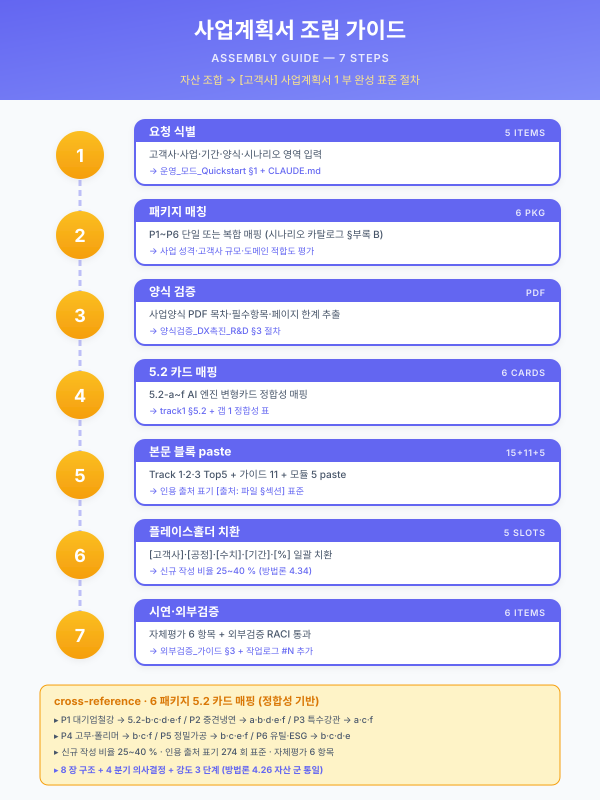

# 조립형 작성기

<section class="assemble-main">

<ol class="assemble-stepper" aria-label="조립 단계">
  <li data-assemble-step="1" class="is-active">도메인</li>
  <li data-assemble-step="2">시나리오</li>
  <li data-assemble-step="3">블록·섹션</li>
  <li data-assemble-step="4">입력·조립</li>
</ol>

<section data-assemble-step-panel="1" class="assemble-panel">

  <h2>도메인</h2>
  

</section>

<section data-assemble-step-panel="2" class="assemble-panel" hidden>

  <h2>시나리오</h2>

</section>

<section data-assemble-step-panel="3" class="assemble-panel" hidden>

  

    <header>
      <h2>블록</h2>
      <input id="assemble-search" class="assemble-search" type="search" placeholder="검색" autocomplete="off" />
    </header>
    

  

  

    <h2>선택</h2>
    

    <h2>섹션</h2>
    

  

</section>

<section data-assemble-step-panel="4" class="assemble-panel" hidden>
<form id="assemble-fields" class="assemble-fields">
  <fieldset>
    <legend>회사</legend>
    <label>고객사명 <input name="step1_company.company" autocomplete="organization" placeholder="동국산업(주)" /></label>
    <label>업종 <select name="step1_company.industry">
      <option value="">선택</option>
      <option value="STL">STL 철강</option>
      <option value="MET">MET 정밀가공</option>
      <option value="RUB">RUB 고무·폴리머</option>
      <option value="UTL">UTL 유틸·환경</option>
      <option value="LLM">LLM·RAG</option>
      <option value="CAS">CAS 연속주조</option>
      <option value="HEA">HEA 열처리</option>
      <option value="PLT">PLT 도금·표면</option>
      <option value="SHP">SHP 조선·해양</option>
      <option value="ASM">ASM 자동차 조립</option>
    </select></label>
    <label>대상 공정 <input name="step1_company.process" placeholder="냉간 압연" /></label>
    <label>기업 규모 <select name="step1_company.scale">
      <option value="">선택</option>
      <option>중소</option>
      <option>중견</option>
      <option>대기업</option>
    </select></label>
  </fieldset>

  <fieldset>
    <legend>사업</legend>
    <label>사업 기간 <input name="step2_business.duration_months" inputmode="numeric" placeholder="12" /></label>
    <label>총 사업비 <input name="step2_business.total_budget" placeholder="600 백만원" /></label>
    <label>정부지원 비율 <input name="step2_business.gov_pct" placeholder="50%" /></label>
    <label>Worker endpoint <input id="assemble-endpoint" type="url" autocomplete="off" /></label>
  </fieldset>

  

    
정량 슬롯

    

  

</form>

  <button id="assemble-submit" type="button" class="assemble-primary">본문 조립</button>
  <button id="assemble-reset" type="button">초기화</button>

</section>

  <button id="assemble-prev" type="button" disabled>이전</button>
  <button id="assemble-next" type="button" class="assemble-primary">다음</button>

</section>

<aside class="assemble-output" aria-label="조립 결과">
  <h2>상태</h2>
  
대기 중

  <h2>Audit</h2>
  

  <textarea id="assemble-audit" readonly placeholder="검토 리포트 없음"></textarea>
  <h2>본문</h2>
  

    <button id="assemble-copy" type="button" disabled>복사</button>
    <button id="assemble-download" type="button" disabled>다운로드</button>
  

  <textarea id="assemble-result" readonly placeholder="결과 없음"></textarea>
</aside>

