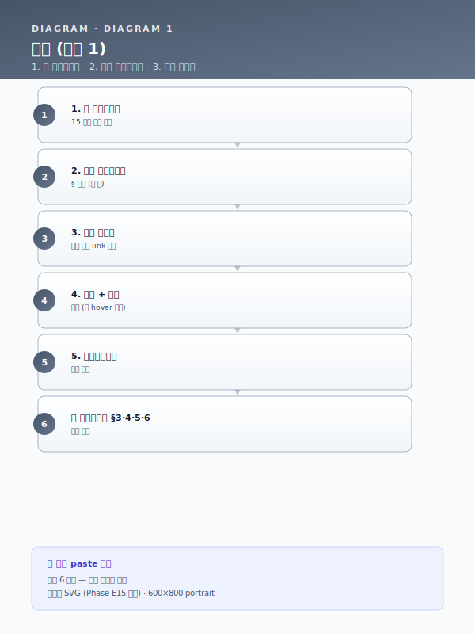

# 📋 공통 블록 모음 — Paste-Ready 15 블록

!!! tip "이 페이지를 어떻게 쓰는가?"
    1. 아래 표에서 **귀사 사업계획서 § 위치** 에 맞는 블록을 찾는다 (예: §3.1 사업 배경 → BLK-T1-3.1).
    2. 해당 블록의 **"전체 본문"** 링크 클릭 → 본문 복사 (📋 버튼 또는 hover 후 우측 Copy 버튼).
    3. 귀사 사업계획서에 paste 후 `[고객사]·[공정]·[수치]·[기간]·[%]` 플레이스홀더 일괄 치환.
    4. 끝. **별도 작성 불요**.

---

## 어디에 paste 하나? — 15 블록 한눈에

| 사업계획서 § | 블록 ID | 트랙 | 핵심 내용 | 길이 | 전체 본문 |
|---|---|---|---|---|---|
| **§3.1 사업 배경** | BLK-T1-3.1 | Track 1 — 제조 AI | 공정 운영의 인적 의존·암묵지 리스크 | 3 단락 + Mermaid | [→ 본문](track/track1-top5.md#31) |
| **§3.1 사업 배경** | BLK-T3-3.1 | Track 3 — LLM·RAG | 문서 포맷 이질성·검색 불가 상태 | 3 단락 + Mermaid | [→ 본문](track/track3-top5.md#31) |
| **§3.2 사업 배경** | BLK-T1-3.2 | Track 1 — 제조 AI | 데이터 단절·비정형/이미지 관리 한계 | 3 단락 + Mermaid | [→ 본문](track/track1-top5.md#32) |
| **§3.2 사업 배경** | BLK-T2-3.2 | Track 2 — MLOps | 모니터링 부재로 인한 후행적 모델 운영 | 3 단락 + Mermaid | [→ 본문](track/track2-top5.md#32) |
| **§3.2 사업 배경** | BLK-T3-3.2 | Track 3 — LLM·RAG | 숙련자 암묵지 의존·지식 이전 실패 | 3 단락 + Mermaid | [→ 본문](track/track3-top5.md#32) |
| **§4.2 기술 설계** | BLK-T2-4.2 | Track 2 — MLOps | MLOps 핵심 7 종 구성요소 모듈 인벤토리 | 3 단락 + Mermaid | [→ 본문](track/track2-top5.md#42) |
| **§4.2 기술 설계** | BLK-T3-4.2 | Track 3 — LLM·RAG | RAG 기준 아키텍처 — 5 계층 | 3 단락 + Mermaid | [→ 본문](track/track3-top5.md#42) |
| **§4.4 기술 설계** | BLK-T1-4.4 | Track 1 — 제조 AI | 피쳐 엔지니어링 접근 | 3 단락 + Mermaid | [→ 본문](track/track1-top5.md#44) |
| **§4.4 기술 설계** | BLK-T2-4.4 | Track 2 — MLOps | 엣지·온프레미스·클라우드 3 단 참조 아키텍처 | 3 단락 + Mermaid | [→ 본문](track/track2-top5.md#44) |
| **§4.5 기술 설계** | BLK-T1-4.5 | Track 1 — 제조 AI | 모델·알고리즘 선정 기준·앙상블 구성 | 3 단락 + Mermaid | [→ 본문](track/track1-top5.md#45) |
| **§4.6 기술 설계** | BLK-T1-4.6 | Track 1 — 제조 AI | 데이터 → 피쳐 → 모델링 → 현장 적용 전체 파이프라인 | 3 단락 + Mermaid | [→ 본문](track/track1-top5.md#46) |
| **§5.2 운영** | BLK-T3-5.2 | Track 3 — LLM·RAG | 청킹 전략 — 계층·섹션·토픽·멀티뷰 | 3 단락 + Mermaid | [→ 본문](track/track3-top5.md#52) |
| **§5.5 운영** | BLK-T2-5.5 | Track 2 — MLOps | 인프라·데이터·성능 3 층 모니터링·드리프트 탐지 | 3 단락 + Mermaid | [→ 본문](track/track2-top5.md#55) |
| **§5.5 운영** | BLK-T3-5.5 | Track 3 — LLM·RAG | LLM 응답 생성 — 환각 방지·근거 인용·거부 정책 | 3 단락 + Mermaid | [→ 본문](track/track3-top5.md#55) |
| **§6.1 운영** | BLK-T2-6.1 | Track 2 — MLOps | 개선 포인트 선정 노하우 — 어디를 왜 먼저 고칠까 | 3 단락 + Mermaid | [→ 본문](track/track2-top5.md#61) |

---

## 추가 블록 영역 (Top5 외)

위 15 블록은 **Track 1·2·3 의 핵심 5 블록 ×3** 입니다. 추가로 활용 가능한 블록 영역:

### 5.2 AI 엔진 변형 카드 (6 종 — Track 1 §5.2 시나리오별 교체 블록)

| 카드 | 적용 시나리오 | 핵심 |
|---|---|---|
| 5.2-a | 시계열 회귀·앙상블 | LSTM/Transformer + XGBoost 앙상블 |
| 5.2-b | 압연 두께 예측 (시계열) | LSTM·BiLSTM + 시간창 윈도우 |
| 5.2-c | 비전 결함 검출 (CNN) | EfficientNet·ResNet + 데이터 증강 |
| 5.2-d | 이상탐지·예지보전 | Autoencoder + Isolation Forest 앙상블 |
| 5.2-e | 공정 최적화·자동 보정 | 강화학습 (PPO·SAC) + HITL 피드백 |
| 5.2-f | LLM·RAG | sLM (Polyglot-Ko·HyperCLOVA-X) + RAG 5 계층 |

[→ 5.2 카드 6 종 전체 보기](track/track1-engine-cards.md)

### 6 패키지 통합 파일럿 (사업 패턴별 30~50 블록)

각 패키지의 §3 시나리오 본문 (5 조항: 현장문제·개선·구현·기술개발·DX 추진) 도 paste-ready:

- [패키지 1 — 대기업 철강 다년 R&D](pkg/pkg1-steel-enterprise.md) (9 시나리오 × 5 조항 = 45 블록)
- [패키지 2 — 중견 냉연](pkg/pkg2-cold-rolled.md) (6 시나리오 × 5 조항 = 30 블록)
- [패키지 3 — 특수강관 RAG](pkg/pkg3-special-pipe.md) (4 시나리오 × 5 조항 = 20 블록)
- [패키지 4 — 고무 양산](pkg/pkg4-rubber.md)
- [패키지 5 — 정밀가공 SaaS](pkg/pkg5-precision.md)
- [패키지 6 — 유틸·ESG](pkg/pkg6-util-esg.md)

### Cross-cutting 모듈 (5 종 — 영역별 결합 블록)

| 모듈 | 결합 영역 | paste 위치 |
|---|---|---|
| [CBAM 대응](module/cbam.md) | EU 수출·탄소국경조정 | §3 ESG·§7 성과 |
| [중대재해 안전](module/safety.md) | 안전보건관리체계 | §1.2 추진 배경 |
| [연합학습](module/federated-learning.md) | 산업단지 공동 | §3.4 성과공유 |
| [OEM 공급망 정합](module/oem-supply.md) | 자동차·조선·2차전지 | §1.1 외부 환경 |
| [SaaS 보안](module/saas-security.md) | 클라우드 데이터 거버넌스 | §3.5 보안과제 여부 |

---

## 플레이스홀더 일괄 치환 가이드

paste 한 본문에서 다음 플레이스홀더를 귀사 정보로 일괄 치환:

| 플레이스홀더 | 의미 | 치환 예시 |
|---|---|---|
| `[고객사]` | 귀사명 | "동국제강(주)" |
| `[공정]` | 대상 공정명 | "후판 압연·소둔" |
| `[수치]` | 정량 데이터 | "87%" "5,000" "12.5%" |
| `[기간]` | 시점·기간 | "12개월" "2026.04~2026.12" |
| `[%]` | 비율 | "30%" |
| `[LLM모델]` | LLM 모델명 | "Polyglot-Ko-12.8B" |
| `[벡터스토어]` | 벡터 DB | "FAISS" "Milvus" |
| `[임계]` | 임계값 | "PSI 0.25" |

플레이스홀더는 본 사이트의 모든 페이지에서 **점선 박스 + 앰버 배경** 으로 시각 강조됩니다.

---

## 5 단계 사업계획서 작성 워크플로

---

!!! info "더 많은 블록이 필요하신가요?"
    - **6 패키지 통합 파일럿** ([패키지 비교 →](by-package.md)) — 사업 패턴별 30~50 블록
    - **11 운영 가이드** — 조립·재무·KPI·외부검증·RAG·도메인지식 등 운영 본문
    - **5 시나리오 상세** — STL·RUB·MET·UTL·SAF·LLM 도메인별 상세 시나리오 본문

    [→ 5 분 안내](start-here.md) · [→ Quick-Start 가이드](guide/quickstart.md)
