# Cross-reference 인터랙티브 그래프

본 페이지는 워크스페이스의 자산 cross-reference 망을 D3 force-directed 그래프로 시각화합니다. 노드 = 자산 1, 엣지 = `> [출처: 파일명]` 표기. 노드 클릭 시 해당 페이지로 이동, 드래그로 위치 조정 가능.

## 진행 예정

- 노드 44 = 자산 1:1 매핑
- 엣지 274 = `> [출처: 파일명]` 표기 파싱 결과
- 노드 클릭 → 해당 자산 페이지 이동
- JS 비활성 환경에서 정적 SVG fallback

## 임시 — 자산 분류 트리

[← 홈으로](index.md)
