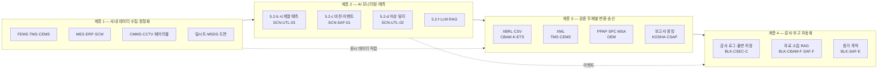

# 가이드 — 외부 검증 운영 (TMS·CEMS·CBAM·KOSHA·CSAP·OEM 통합)

> Phase E4 자체평가 갭 21 해소. 환경 (TMS·CEMS·K-ETS)·탄소 (CBAM)·안전 (KOSHA)·보안 (CSAP·ISMS-P)·OEM (IATF 16949·VDA 6.3) 등 외부 검증 주체와의 통합 운영 양식을 단일 자산으로 결집한다. 사업계획서 §5.4 (기존 시스템 연동)·§7.1 (MLOps)·§8 (부록) 에 직접 인용 가능. 운영 가이드 군 6 번째 멤버 (`시너지_ROI_모델.md`·`사업기간_압축_가이드.md`·`재무_예산_산정_가이드.md`·`가이드_한국_sLM_활용.md`·`가이드_KPI_측정.md` 에 이은 자산). 4.26 자산 군 포맷 통일 (8 장 구조 — 비교 매트릭스 → 의사결정 분기 → 통합 운영 아키텍처 → 정합 절차 → 적용 양식 → 결합 → 확인 필요 → 한계) 적용.

> 플레이스홀더 범례 — `[수치]` 수치, `[%]` 비율, `[기간]` 기간, `[법령-2026]` 시행 시점에 따라 교체가 필요한 법령·고시·가이드라인 태그, `[기관]` 검증·자문 기관명, `[고객사]` 고객사명, `[임계]` 임계값. **(확인 필요)** 항목은 §7 에 목록화한다 — 송신 양식·기본값 산정·OEM 가이드라인·인증 등급은 분기 단위 변동 영역이므로 본문에서 확정하지 않는다.

> 본 가이드의 직접 근거 — `모듈_CBAM_대응.md` BLK-CBAM-D (제품 단위 배출량 산정 엔진) · BLK-CBAM-F (CBAM 규제 문서 RAG) · §10 분기 갱신 트리거; `모듈_중대재해_안전.md` BLK-SAF-D (안전 AI 3 축 + 통합 안전 대시보드) · BLK-SAF-E (의무이행 증거 축적); `모듈_SaaS_클라우드_보안.md` BLK-CSEC-C (감사 로그) · BLK-CSEC-D (TMS·CCTV 영상 보안); `모듈_OEM_공급망_정합.md` BLK-OEM-B (인증 보유) · BLK-OEM-D (PPAP·SQA 정합); `사업계획서_패키지6_유틸ESG_파일럿.md` §5.4·§5.5·§7.1·§7.3 (5 회 게이트 + 외부 검증 대응) — 본 가이드의 1 차 적용 사례.

---

## 1. 외부 검증 주체 비교 매트릭스

본 가이드는 제조 AI 사업이 동시 정합해야 하는 외부 검증 주체 7 군 (환경 실시간·환경 정기·탄소·안전·보안·OEM·세제) 을 단일 매트릭스로 정렬한다. 각 행은 검증 주체·관할·영역·송신 또는 보고 주기·데이터 형식·위반 결과·결합 가능한 사내 모듈과 시나리오의 7 열을 채워, 사업계획서 §5.4 본문에 표 1 개로 직접 인용 가능한 형태로 제시한다. 송신 양식·기본값 산정·인증 등급은 시점 변동 영역이므로 (확인 필요) 표기를 유지하여 인용 시 재검증을 강제한다.

본 매트릭스의 7 검증 주체는 패키지 6 §1.2 의 "CBAM·중대재해법·ESG 공시 3 중 압박" 을 일반화한 것이며, 환경·안전·탄소·보안·OEM 의 5 영역에 K-ETS (배출권 거래)·CSAP (보안 추가 등급) 를 더해 제조 AI 사업이 직면할 수 있는 외부 검증 주체를 누락 없이 포괄한다. 검증 주체 간 송신·보고서 양식·관할 부처가 분리되어 있으므로 사내 운영 인프라가 분리 운영될 위험이 상시 존재하며, 본 가이드 §3 의 통합 운영 아키텍처가 그 분리 운영 위험을 단일 백본으로 흡수하는 구조이다.

| 검증 주체 | 관할 | 영역 | 송신·보고 주기 (확인 필요) | 데이터 형식 (확인 필요) | 위반 결과 | 결합 모듈·시나리오 |
|---|---|---|---|---|---|---|
| **TMS** (수질) | 환경부 | 폐수 (BOD·COD·SS·약품 투입량) | 실시간 (통상 5 분·24 시간 송신) | XML·CSV (환경부 TMS 표준) | 행정처분·과징금·가동중단 | SCN-UTL-03 + 모듈_SaaS_보안 BLK-CSEC-D |
| **CEMS** (대기) | 환경부 | 배출가스 (NOx·SOx·먼지·VOC) | 실시간 (통상 5 분·24 시간 송신) | XML·CSV (환경부 CEMS 표준) | 행정처분·과징금·가동중단 | SCN-UTL-03 + 모듈_CBAM 일부 (대기 배출량 정합) |
| **CBAM** (탄소국경조정) | EU 집행위 | 제품 단위 내재배출량 (Embedded Emissions) | 분기 (통상 14·30 일 이내 신고) | XBRL·CSV (EU 집행위 표준 양식) | 관세 부과·기본값 적용 부담 | 모듈_CBAM 풀 (BLK-CBAM-A~G) + SCN-SAF-02 |
| **KOSHA** (산업안전) | 고용노동부·KOSHA | 안전보건경영시스템 등급·중대재해 대응 | 연 1 회 + 사고 발생 시 즉시 + 정기 점검 | 자유 양식 (감사 시 자료 소집·면담) | 안전등급 강하·과태료·경영책임자 형사책임 | 모듈_중대재해_안전 풀 (BLK-SAF-A~G) + SCN-SAF-01·SAF-03 |
| **CSAP·ISMS-P** (정보보안) | KISA·과기정통부 | 클라우드 보안·개인정보 관리 체계 | CSAP 연 1 회 갱신·ISMS-P 3 년 + 사후 1 회 | 보고서·증빙 (감사 시 자료 소집·실사) | 인증 강하·공공 조달 자격 손실 | 모듈_SaaS_보안 풀 (BLK-CSEC-A~F) |
| **IATF 16949·VDA 6.3** (OEM 감사) | OEM 본사 + 인정 인증기관 | 자동차 품질 시스템·공정 감사 | 연 1 회 (정기) + OEM 요청 시 (특별) | PPAP·감사 패키지·SPC·MSA | SQA 점수 강하·1 차 협력사 자격 손실 | 모듈_OEM_공급망_정합 풀 (BLK-OEM-A~G) |
| **K-ETS** (배출권 거래) | 환경부 | 사업장 단위 온실가스 배출권 할당·거래 | 연 1 회 (할당·거래·정산) + 명세서 검증 | XML·시스템 직접 송신 (환경부 NETIS) | 할당 손실·과태료·이월 제약 | 모듈_CBAM 결합 (Scope 1·2 산정 정합) |

> 본 표는 7 행 비교 매트릭스이며, **환경 실시간 (TMS·CEMS) 2 + 탄소 (CBAM·K-ETS) 2 + 안전 (KOSHA) 1 + 보안 (CSAP·ISMS-P) 1 + OEM 1** 의 구조이다. 채움 정도는 관할·영역·결합 모듈 3 열은 자산 간 일관성 (모듈_CBAM·SAF·CSEC·OEM + 패키지 6) 으로 확정 가능, 송신 주기·데이터 형식·위반 결과 3 열은 시점 변동 영역이므로 (확인 필요) 로 통일.

> [출처: `모듈_CBAM_대응.md` §1 (CBAM 분기 신고)·§10 분기 갱신 트리거; `모듈_중대재해_안전.md` BLK-SAF-A 규제 환경; `모듈_SaaS_클라우드_보안.md` BLK-CSEC-C·D; `모듈_OEM_공급망_정합.md` BLK-OEM-B 인증 보유 표; `사업계획서_패키지6_유틸ESG_파일럿.md` §5.5 M12 게이트의 외부 검증 4 자 자문 구조]

---

## 2. 외부 검증 4 분기 의사결정

본 가이드의 핵심 의사결정 도구는 검증 주체별 대응 강도·자원 투입을 4 차원으로 직교 분기시키는 결정 매트릭스이다. 4 분기는 mutually exclusive 하게 설계되어 사업계획서 §5.4·§7.1 본문에서 1 분기씩 단독 인용 가능하며, 동시에 4 분기를 모두 거치면 단일 검증 주체에 대한 대응 패턴 (실시간 송신 자동 감지 / 정기 보고 사전 준비 / 자유 양식 즉시 소집 / 인증 사전 정합) 이 결정된다.

### 2.1 데이터 송신 의무 분기 (실시간 vs 정기)

검증 주체가 데이터를 어떤 주기로 요구하는가에 따라 사내 운영 패턴이 결정된다. 본 분기는 사내 인프라의 SLA·가용성·당직 운영 부담을 직접 규정하므로, 사업 1 차년도 인프라 설계의 1 차 결정축이다.

- **실시간 송신 (TMS·CEMS·K-ETS 일부)** — 환경부 시스템에 24 시간 송신 의무. **시스템 직접 연동 + AI 사전 감지 (드리프트·이상 예측) + 이중 안전망 (송신 직전 검증·재송신 큐)** 이 표준 운영 양식. 송신 누락·오류 시 행정처분이 즉시 발생하므로 SLA 99.9 % 이상 가용성이 운영 요건. SCN-UTL-03 (환경 이상 예측) + 5.2-b (시계열 예측) 의 직접 결합 영역.
- **정기 보고 (CBAM 분기·KOSHA 연·CSAP·ISMS-P 연·OEM 연)** — 분기·연 단위 보고서 제출. **데이터 누적 + 보고서 자동 생성 + 검수·승인 워크플로우 + 송신** 의 4 단 절차. 사전 점검 체크리스트 + 모듈_CBAM BLK-CBAM-D 산정 엔진 + RAG 기반 자료 소집이 정기 보고의 표준 인프라.
- **혼합 주기 (K-ETS·OEM 특별 감사)** — 정기 (연 1 회 정산) + 이벤트 (할당 변경·OEM 요청) 가 결합. 이벤트 발생 시 정기 양식의 부분 갱신 절차가 추가됨. 사전 시뮬레이션 + 비상 대응 매뉴얼이 이벤트 분기의 운영 자산.

### 2.2 위반 결과 강도 분기

위반 시 즉시·중장기 영향에 따른 사전 감지·예방 강도 결정.

- **즉시 행정처분·관세·과태료** (TMS·CEMS·CBAM·K-ETS) — 발생 직후 재무 영향이 직접 발생. **자동 사전 감지 (1 시간~24 시간 전 예측) + HITL 알람 (담당자→관리자→경영진 에스컬레이션) + 송신 직전 검증** 이 필수. SCN-UTL-03 1 시간 적중률 [%] 이상이 표준 KPI.
- **인증 강하·자격 손실** (CSAP·KOSHA·OEM) — 즉시 재무 영향은 작으나 6~12 개월 후 공공 조달·OEM 자격 손실로 누적 영향이 큼. **정기 자료 정합 + 감사 시점 즉시 대응 + 사후 갭 분석** 의 3 단 운영. 모듈_SaaS_보안 BLK-CSEC-C 감사 로그 + 모듈_OEM BLK-OEM-D PPAP 패키지 자동화가 직접 결합 인프라.
- **형사책임 누적** (KOSHA 중대재해 + 산업안전보건법) — 사고 발생 시 경영책임자 형사책임 가능성. **상시 의무이행 증거 축적 (BLK-SAF-E)** 이 1 차 방어선이며, 본 가이드의 §4 Pre·In·Post 절차의 Post 단계 (이력 보존·갭 분석) 가 핵심 기여 영역.

### 2.3 데이터 형식 분기

검증 주체가 요구하는 데이터 형식의 구속력에 따라 변환·인덱스 인프라 결정.

- **표준 양식 강제 (XBRL·XML·OEM PPAP·MSA·SPC 양식)** — TMS·CEMS·CBAM·K-ETS·OEM. **자동 변환 모듈 필수** (BLK-CBAM-D 산정 엔진의 ③ 집계·보고 모듈 + ④ 감사 추적 뷰가 표준 모델). 양식 변경 시 재배포 비용이 크므로 §7 (확인 필요) 항목에 분기 갱신 트리거로 등록.
- **자유 양식 (감사 시 자료 소집·면담)** — KOSHA·CSAP·ISMS-P. **사내 데이터 인덱스·검색 (RAG) + 감사 자료 패키지 자동 구성** 이 핵심. 모듈_CBAM BLK-CBAM-F + 모듈_중대재해 BLK-SAF-F + 모듈_SaaS_보안 BLK-CSEC-A 의 RAG 인프라가 동일 백본을 공유.
- **혼합 형식 (보고서 + 시스템 송신)** — CSAP 정기 보고서 + 사고·이상 시 즉시 보고. 두 형식의 동시 운영 인프라 필요.

### 2.4 검증 주기 분기

검증 빈도에 따른 일정·자원 관리 패턴.

- **상시 (실시간 송신·24 시간)** — TMS·CEMS. AI 모니터링 + 자동 알람 + 야간·주말 당직 SLA. Track 2 §5.5 3 층 모니터링의 인프라 계층이 직접 정합.
- **분기 (CBAM)** — 분기 시작 30~45 일 전 사전 데이터 검증·내부 검수 + 분기 종료 14·30 일 이내 송신. 일정 게이트 4 회/년이 표준 운영 리듬.
- **연 (KOSHA·CSAP·ISMS-P·K-ETS·OEM 정기)** — 연간 일정 관리 + 사전 준비 체크리스트 (3·6·9 개월 전 단계별 점검) + 감사 시점 집중 대응. 패키지 6 §5.5 M12 게이트의 4 자 자문 구조가 직접 운영 모델.
- **이벤트 (OEM 특별 감사·사고·할당 변경)** — 발생 시 즉시 대응. 사전 시뮬레이션 + 자료 즉시 소집 가능 상태 유지.

> 4 분기 직교성 자기평가 — 2.1 (송신 주기) 은 데이터 차원, 2.2 (위반 결과) 는 리스크 차원, 2.3 (데이터 형식) 은 인프라 차원, 2.4 (검증 주기) 는 일정 차원으로 차원이 분리되어 mutually exclusive 한 결정축. 각 분기는 단독 인용 가능하며, 4 분기를 직렬로 거치면 단일 검증 주체에 대한 대응 패턴 (실시간·즉시 영향·표준 양식·24 시간 = TMS·CEMS / 정기·인증 영향·자유 양식·연 = KOSHA·CSAP) 이 결정된다.

---

## 3. 통합 운영 아키텍처

각 검증 주체의 데이터 송신·보고서·감사 흐름이 분리 운영되면 시스템·인력·문서 중복이 발생하므로, 본 가이드는 7 검증 주체를 단일 운영 플랫폼 위에 결합하는 4 계층 아키텍처를 표준으로 제시한다. 본 아키텍처는 패키지 6 §5.4 (BLK-CBAM-D 산정 엔진 + BLK-SAF-D 통합 안전 대시보드 + BLK-CSEC-D 마스킹 게이트) 의 3 인프라 결합을 일반화한 것이며, Track 1 §5.x 구축 상세·Track 2 §4.2 MLOps 구성요소와 직접 정합한다.

### 3.1 통합 운영의 4 계층

- **계층 1 — 데이터 수집·정형화** (FEMS·TMS·CEMS·MES·ERP·CMMS·CCTV·웨어러블·밀시트·MSDS·도면) : 사내 단일 데이터레이크에 적재. 패키지 6 §2.3 ICS·MES Lv.1~Lv.2 + FEMS·TMS Lv.2 + CCTV Lv.1 의 통합 적재가 본 계층의 표준 도착 상태.
- **계층 2 — AI 모니터링·예측** (5.2-b·c·d·e + 5.2-f LLM·RAG) : 검증 주체별로 분리 운영하지 않고 5 종 AI 엔진이 7 검증 주체의 사전 감지를 모두 담당. SCN-UTL-03 환경 1 시간 예측 → TMS·CEMS 송신 직전 검증, 5.2-d 이상 탐지 → CBAM 산정 입력 데이터 품질 검증, 5.2-c 비전 → KOSHA 안전등급 사전 점검 등 단일 엔진의 다중 검증 주체 정합.
- **계층 3 — 검증 주체별 변환·송신** (XBRL·XML·PPAP·보고서) : 검증 주체별 양식 차이는 본 계층에서만 흡수. 계층 1·2 의 데이터·이벤트는 주체 무관 형식으로 통일. BLK-CBAM-D 산정 엔진의 ③ 집계·보고 모듈이 본 계층의 직접 모델.
- **계층 4 — 감사·보고 자동화** (감사 로그·자료 소집 RAG·증거 축적) : 자유 양식 검증 (KOSHA·CSAP·ISMS-P) 의 감사 시점 자료 즉시 소집 + 정기 보고 (CBAM·OEM) 의 근거 데이터 역추적 + 의무이행 증거 (중대재해법) 의 상시 축적이 본 계층에 결집.

### 3.2 검증 주체 간 데이터 공유

7 검증 주체의 데이터 요구가 일부 중복되므로, 사내 1 회 측정·여러 검증 주체에 분기 송신·재가공 인프라가 운영 비용을 비선형으로 절감한다. 본 데이터 공유 인프라는 시너지 ROI 모델 §6.6 패키지 6 카드의 "규제 리스크 회피의 정성 시너지" 의 핵심 메커니즘이며, 단일 측정 → 다 검증 정합의 운영 효율이 분리 운영 대비 [%] 절감을 발생시킨다 (확인 필요).

- **TMS·CEMS·K-ETS·CBAM 의 에너지·배출 데이터 중복** — 동일 FEMS·TMS·CEMS 원시 데이터가 (i) TMS 환경부 실시간 송신, (ii) CEMS 환경부 실시간 송신, (iii) K-ETS 연 1 회 명세서, (iv) CBAM 분기 신고의 4 곳에 동시 정합. BLK-CBAM-D 산정 엔진의 ① 데이터 수집·정합성 검증 모듈이 4 검증 주체의 입력을 단일 점검.
- **KOSHA·OEM 의 안전·품질 데이터 중복** — 동일 안전 이벤트 (보호구 미착용·위험구역 침입·낙상) 가 (i) KOSHA 안전등급 평가 자료, (ii) 모듈_OEM BLK-OEM-D PPAP 부속 안전 증빙, (iii) ESG 공시 (TCFD·ISSB) 안전 KPI 의 3 곳에 동시 정합. 통합 안전 대시보드 (BLK-SAF-D) 가 단일 출처.
- **CSAP·ISMS-P 의 보안 로그 중복** — 동일 감사 로그·접근 이력이 (i) CSAP 연 1 회 갱신, (ii) ISMS-P 3 년 + 사후, (iii) OEM 정보보안 부속 감사의 3 곳에 동시 정합. BLK-CSEC-C 감사 로그가 단일 백본.

### 3.3 통합 운영의 모순 충돌 사전 차단

7 검증 주체를 단일 백본으로 통합할 때 검증 주체 간 요구가 모순될 수 있으므로, 본 가이드는 모순 발생 영역을 사전에 식별하여 운영 정책으로 차단한다.

- **CCTV 영상 보안 (CSAP·ISMS-P) ↔ 안전 감지 (KOSHA·중대재해법)** — CCTV 원본 영상은 보안 관점에서 외부 노출 차단·접근 권한 통제가 요구되나, 안전 감지 관점에서는 사고 발생 시 영상 증빙 즉시 소집이 요구됨. **모듈_SaaS_보안 BLK-CSEC-D 의 4 단계 마스킹 + 권한 단계별 차등 노출 (책임_분담_매트릭스 §5)** 이 모순 차단의 표준 정책.
- **개인정보 보호 (ISMS-P) ↔ 안전 KPI 측정 (KOSHA·OEM)** — 작업자 행동 인식·웨어러블 생체 신호는 개인정보 처리 동의·노사 합의 + 익명화 · 집계 단위 KPI 산출이 요구됨. 모듈_중대재해 BLK-SAF-C·D·F 의 프라이버시·노사 합의 잠금 문구 (lock phrase) 가 본 모순 차단의 직접 인프라.
- **데이터 외부 송신 (TMS·CEMS·CBAM) ↔ 영업비밀 보호 (OEM·CSAP)** — 환경부·EU 집행위 송신 데이터에 영업비밀·OEM 사양이 포함될 위험. **가이드_한국_sLM §2.1 민감도 분기 + BLK-CSEC-D 마스킹 게이트** 가 송신 직전 검증 단계에서 영업비밀·도면 ID·고객사명 토큰 치환을 강제.

---

## 4. 검증 데이터 정합·검증 절차 (Pre·In·Post)

각 검증 주체의 송신·감사 흐름은 사전 준비·진행 중 대응·사후 분석의 3 단계로 표준화된다. 본 절차는 §1 7 검증 주체에 공통 적용되며, 패키지 6 §5.5 5 회 게이트 + M12 외부 검증 대응의 절차 구조를 일반화한 것이다. Pre·In·Post 의 3 단계는 시점·자동화 대상·운영 책임자가 분리되며, 사업계획서 §5.4 본문에 단일 단락으로 인용 가능한 표준 절차이다.

### 4.1 Pre — 송신·감사 사전

검증 시점 1~3 개월 전 (정기) 또는 송신 직전 (실시간) 의 사전 점검 단계. 본 단계의 자동화 정도가 정기 검증·감사 대응의 운영 공수를 결정한다 — 패키지 6 §1.4 의 "신고 건당 [수치] 일 공수" 가 본 단계 자동화의 1 차 절감 대상.

- **데이터 품질 검증** — 누락·이상치·범위 검사 (PSI·KS·도메인 룰). 5.2-d 이상 탐지 + 5.2-b 시계열 예측의 출력이 직접 입력. TMS·CEMS 송신 직전 1 시간 적중률 [%] 이상 + 누락 0 건이 표준 통과 기준.
- **변환 양식 검증** — XBRL/XML 스키마 검증 + PPAP 양식 부속 확인 + 보고서 표준 항목 확인. 모듈_CBAM BLK-CBAM-D ③ 집계·보고 모듈 + 모듈_OEM BLK-OEM-D PPAP 자동화가 직접 인프라. 양식 변경 (§7 (확인 필요) 항목) 발생 시 본 검증의 스키마 갱신이 1 차 트리거.
- **사전 검토 자료 패키지 구성** — RAG (BLK-CBAM-F·SAF-F·CSEC-A) 가 감사 시점에 소집할 자료의 사전 인덱싱. 자유 양식 검증 (KOSHA·CSAP·ISMS-P) 의 사전 준비 체크리스트. 작업표준서·MSDS·사고이력·교육이력 등 도메인 문서의 분기 갱신이 본 단계의 운영 부담.

### 4.2 In — 송신 시점·감사 진행 중

송신 발생 시점 또는 감사 진행 1~5 일의 실시간 대응 단계.

- **송신 성공·실패 모니터링** — TMS·CEMS·CBAM·K-ETS 송신의 성공률·재송신 큐·에러 로그 실시간 추적. Track 2 §5.5 ① 인프라 모니터링이 직접 정합.
- **감사 자료 즉시 소집** — KOSHA·CSAP·ISMS-P 감사관 자료 요구 시 RAG 기반 5~30 분 이내 자료 패키지 생성. BLK-CBAM-F·SAF-F·CSEC-A 의 자료 소집 RAG 가 직접 인프라.
- **추가 자료 요구 대응** — 감사관·검증기관의 추가 질의·소명 요구에 대한 본부·운영자·EHS·SI 4 자 협업 워크플로우. 책임_분담_매트릭스 §3·§4 의 권한 단계가 직접 결합.

### 4.3 Post — 송신·감사 후

송신·감사 종료 후 1~30 일의 사후 분석·개선 단계.

- **송신 이력 보존** — 불변 로그 저장 (BLK-CSEC-C). 사후 검증·재감사·분쟁 발생 시 객관적 근거. 보존 기간은 검증 주체별 (확인 필요) 로 §7 에 등록.
- **감사 결과 분석·갭 발견** — 감사 결과 (등급·점수·개선 요구) 를 사내 갭 발견 절차에 입력. Track 2 §6.5 분기·연간 리뷰 리츄얼이 직접 정합.
- **차기 회기 개선 계획** — 발견된 갭을 차기 분기·연 검증의 Pre 단계 체크리스트에 반영. 모델 카드·드리프트 임계 변경 기록·승인 워크플로우의 자동 보존이 본 단계의 인프라.

---

## 5. 사업계획서 §5.4·§7.1 인용 강도 양식

본 가이드의 §1 비교 매트릭스 + §2 의사결정 4 분기 + §3 통합 운영 아키텍처 + §4 Pre·In·Post 절차를 사업계획서 §5.4 (기존 시스템 연동)·§7.1 (MLOps)·§8 (부록 외부 검증 대응) 본문에 직접 인용하는 표준 양식이다. 사업 규모·검증 주체 수에 따라 강도 1~3 의 3 단계 인용 양식을 제공하며, 본 인용 양식은 가이드_한국_sLM·가이드_KPI 의 강도 양식 패턴 (강도 1·2·3 차등) 과 정합하여 운영 가이드 군 전반의 인용 톤을 통일한다.

### 5.1 강도 1 (1 표) — 1·2 검증 주체 사업

검증 주체 + 영역 + 주기의 3 열 단순 표 1 개로 §5.4 본문에 1 줄 + 표로 인용. 9 개월 압축 사업 또는 단일 시나리오 사업에 적합. 본 가이드 §1 매트릭스의 해당 행만 발췌 인용하며, 통합 운영 아키텍처·Pre·In·Post 절차는 인용하지 않는다.

> 예시 양식: "본 사업은 [검증 주체 이름] (관할 [기관]·주기 [기간]) 에 대한 정기 정합 의무를 보유하며, 본 사업의 AI 인프라가 해당 의무 이행을 자동화한다. (표 1 — 본 가이드 §1 발췌 1~2 행)"

### 5.2 강도 2 (1 표 + 1 단락) — 표준 사업

강도 1 + §3 통합 운영 아키텍처 4 계층의 1 단락 인용. 12 개월 표준 사업 (패키지 6 등) 에 적합. 검증 주체 3~5 개를 단일 운영 플랫폼으로 결합하는 차별 가치를 본문에서 명시.

> 예시 양식 (§5.4): "본 사업의 외부 검증 통합 운영은 (i) 사내 데이터 수집 계층, (ii) AI 모니터링·예측 계층, (iii) 검증 주체별 변환·송신 계층, (iv) 감사·보고 자동화 계층의 4 계층 아키텍처 (가이드_외부검증_운영 §3.1) 위에서 작동하며, [수치] 검증 주체의 송신·보고서·감사 자료가 단일 백본 위에 통합 구성된다. (표 1 — 본 가이드 §1 발췌 [수치] 행)"

### 5.3 강도 3 (1 표 + 2 단락 + 검증 절차) — 풀 사업

강도 2 + §4 Pre·In·Post 절차 인용 + §3.2 데이터 공유 인용. 18 개월 풀 사업·대중소상생·R&D·전사적 DX 사업에 적합. 7 검증 주체 모두 + 동시 정합 + Pre·In·Post 절차 + 데이터 공유 인프라까지 본문에서 풀 인용.

> 예시 양식 (§5.4 + §7.1 + §8 분산 인용): 강도 2 본문 + "검증 데이터 정합·감사 대응 절차는 (i) 사전 (Pre) 단계의 데이터 품질·양식·자료 패키지 검증, (ii) 진행 중 (In) 단계의 송신 모니터링·자료 즉시 소집·추가 요구 대응, (iii) 사후 (Post) 단계의 이력 보존·갭 분석·차기 개선의 3 단으로 운영된다 (가이드_외부검증_운영 §4)." + "검증 주체 간 데이터 공유 인프라는 (i) 환경·탄소 4 검증 주체 (TMS·CEMS·K-ETS·CBAM) 의 에너지·배출 데이터 단일 출처화, (ii) 안전·OEM·ESG 3 검증 주체의 안전 이벤트 단일 출처화, (iii) 보안 3 검증 주체 (CSAP·ISMS-P·OEM 정보보안) 의 감사 로그 단일 출처화의 3 축으로 작동한다 (동 가이드 §3.2)."

| 강도 | 분량 | 구성 | 적합 사업 |
|---|---|---|---|
| 강도 1 (1 표) | 1 줄 + 표 | §1 매트릭스 1~2 행 발췌 | 9 개월 압축 사업·단일 시나리오 사업 |
| 강도 2 (1 표 + 1 단락) | 1 단락 + 표 | 강도 1 + §3.1 4 계층 1 단락 | 12 개월 표준 사업 (패키지 6 등) |
| 강도 3 (1 표 + 2 단락 + 검증 절차) | 2 단락 + 표 + 절차 인용 | 강도 2 + §4 Pre·In·Post + §3.2 데이터 공유 | 18 개월 풀 사업·R&D·전사적 DX |

> 인용 강도 3 단계 명확성 자기평가 — 강도 1 (1·2 검증 주체) → 2 (3~5 검증 주체) → 3 (7 검증 주체 + 절차) 의 단계가 검증 주체 수·인프라 결합도·본문 분량의 3 차원이 동시 증가하며 모호 영역 없이 분리된다. 패키지 6 은 강도 2~3 사이 (5 검증 주체 + 4 계층 + Pre·In·Post 부분 인용) 에 위치.

---

## 6. 모듈·다른 가이드 결합

본 가이드는 다음 자산과 직접 결합되며, 결합 지점·결합 효과를 명시하여 사업계획서 인용 시 자산 간 경로를 추적할 수 있도록 한다.

| 결합 자산 | 결합 지점 | 결합 효과 |
|---|---|---|
| `모듈_CBAM_대응.md` BLK-CBAM-D 산정 엔진 | §3.1 4 계층의 변환·송신 계층 직접 적용 | CBAM·K-ETS 의 분기·연 보고서 자동 생성·감사 추적 |
| `모듈_CBAM_대응.md` BLK-CBAM-F RAG | §3.1 감사·보고 자동화 계층 + §4.2 In 자료 소집 | 자유 양식 검증의 자료 소집 RAG 인프라 |
| `모듈_중대재해_안전.md` BLK-SAF-D 통합 안전 대시보드 | §3 통합 운영 + KOSHA·OEM 안전 정합 | 안전 이벤트 단일 출처 + 감사 시점 즉시 자료 |
| `모듈_중대재해_안전.md` BLK-SAF-E 의무이행 증거 축적 | §4.3 Post 이력 보존 | 중대재해법 형사책임 1 차 방어선 증거 자산 |
| `모듈_SaaS_클라우드_보안.md` BLK-CSEC-C 감사 로그 | §3 통합 운영의 보안 계층 + §4.3 Post | CSAP·ISMS-P·OEM 정보보안의 감사 로그 단일 백본 |
| `모듈_SaaS_클라우드_보안.md` BLK-CSEC-D 영상 보안 | TMS·CCTV·도면 마스킹 게이트 | KOSHA 안전 + CSAP 보안의 모순 운영 사전 차단 |
| `모듈_OEM_공급망_정합.md` BLK-OEM-D PPAP·SQA 정합 | OEM 측 검증 정합 (PPAP·MSA·SPC·VDA 6.3) | OEM 자격 1 차 방어 + ESG·안전 동시 정합 |
| `가이드_KPI_측정.md` §1.4 거버넌스 KPI | 외부 검증 KPI 직접 인용 | 송신 SLA·감사 등급·인증 갱신율 KPI 표준화 |
| `재무_예산_산정_가이드.md` §3 단위 비용 | 검증 시스템 구축·운영비 항목 | TMS·CEMS·CBAM 인프라·감사 대응·외부 자문 비용 산정 |
| `가이드_한국_sLM_활용.md` §2.1 민감도 분기 | RAG 자료 소집의 민감도 라우팅 | 감사 자료 자동 소집 시 영업비밀·도면 외부 노출 차단 |
| `시너지_ROI_모델.md` 패키지 6 카드 | 외부 검증 정합의 비선형 시너지 | 1 회 측정·다 검증 정합의 운영비 절감 시너지 |
| `사업계획서_패키지6_유틸ESG_파일럿.md` §5.4·§7.3 | 본 가이드의 1 차 적용 사례 | 7 검증 주체 중 5 (TMS·CEMS·CBAM·KOSHA·CSAP) 의 풀 결합 사례 |

> 자산 결합도 자기평가 — 본 가이드의 8 장 (비교·결정·아키텍처·절차·적용·결합·확인·한계) 이 12 개 자산과 모두 명시적 결합 지점을 보유. 모듈 4 종 (CBAM·SAF·CSEC·OEM) + 가이드 군 4 종 (KPI·재무·sLM·시너지) + 패키지 사례 1 종의 다층 결합으로, 본 가이드만 단독 인용해도 사업계획서 §5.4·§7.1·§8 의 외부 검증 영역이 자급 가능하며 동시에 자산 간 일관성이 유지된다.

---

## 7. (확인 필요) 항목 (시점 변동 영역)

외부 검증 주체의 송신 양식·기본값 산정·인증 등급·OEM 가이드라인은 분기·연 단위로 변동하므로, 본 가이드의 (확인 필요) 항목을 사업계획서 인용 시점에 검증해야 한다.

1. **TMS·CEMS 최신 송신 표준 양식** — 환경부 고시 변경 (XML·CSV 스키마·송신 주기·항목 추가·임계값 갱신). `[법령-2026]` 기준 검증.
2. **CBAM 분기 신고 양식·기본값 산정** — EU 집행위 시행 규칙·Default Value 갱신·대상 품목 확대 (수소·유기화학 등). 모듈_CBAM §10 분기 갱신 트리거 직접 결합.
3. **K-ETS 4 기·5 기 전환 일정 + 할당 변경** — 환경부 기본 계획 개정·할당 방식·이월·차입 규칙. 본 가이드 §1 K-ETS 행의 송신·정산 주기 갱신 트리거.
4. **KOSHA 안전등급 체계 최신 개정** — 안전보건경영시스템 인증 기준·점검 주기·등급 공시 범위. 모듈_중대재해 BLK-SAF-A 결합.
5. **CSAP·ISMS-P 등급별 적용 범위** — 클라우드 보안 등급 (하·중·상)·민감 정보 처리 사업장 적용 의무·갱신 주기. 모듈_SaaS_보안 BLK-CSEC-A 결합.
6. **OEM AI 가이드라인** — GM·VW·Toyota·현대차·기아의 AI·MLOps 운영 가이드라인 출시 여부. PPAP 부속 AI 산출물 요구·MSA·SPC 의 AI 모델 적용 가이드. 모듈_OEM BLK-OEM-D 결합.
7. **외부 검증 통합 운영 플랫폼 시장 솔루션** — 국내·외 통합 운영 SaaS·온프레 솔루션의 출시 여부·CSAP 정합 여부.
8. **산업통상자원부·환경부 통합 송신 추진 동향** — 환경부·고용노동부·산업부 간 송신 시스템 통합 추진 (1 회 송신·다 검증) 의 입법·시행 일정.
9. **감사 로그 보존 기간** — 검증 주체별 보존 기간 (TMS·CEMS·CBAM·K-ETS·KOSHA·CSAP·ISMS-P·OEM 별 차이) 의 최신 고시.
10. **외부 검증·자문 기관 단가** — CBAM 검증기관 (Verifier)·KOSHA 자문·CSAP 평가기관·OEM 인증기관의 연간 단가·자문 인·일 단가. 재무_예산 §3 결합.

총 10 항목 — 시점 변동 영역의 정직 노출. 본 항목은 분기 1 회 갱신 권장 (외부 검증 시장 변동 속도 기준).

---

## 8. 모델 한계

- 본 가이드는 **프레임** 이며, 구체 송신 양식·주기·기본값 산정 로직은 검증 주체·법령·고시별 변동. (확인 필요) 표기를 무시하고 인용 시 행정처분·관세·SQA 강하 위험.
- 본 가이드는 **운영 가이드 군 6 번째** 자산으로, 가이드_한국_sLM·가이드_KPI 의 8 장 구조를 준용. 운영 가이드 군 누적 시 각 가이드의 §6 결합 표가 가이드 간 메쉬 구조로 발전 예정.
- 본 가이드는 **제조 도메인 중심** 이며, 금융·의료·법률·공공의 검증 주체 (금융위·식약처·법무부·공공기관) 는 별도 가이드 후속 작성 권장.
- 본 가이드는 **국내 + EU 검증 주체 중심** 이며, 미국 (CCA·EPA)·일본 (METI) 등 타 권역 검증 주체는 §7 항목에 추가 예정.
- 통합 운영의 보안 정합은 모듈_SaaS_보안 결합 필수. 7 검증 주체의 데이터를 단일 백본으로 통합하는 만큼, 보안 사고 발생 시 영향 범위가 커지므로 BLK-CSEC-D·E·F 의 다층 방어가 본 가이드의 전제 조건.
- 본 가이드의 §3 4 계층 아키텍처는 12 개월 표준 사업 (패키지 6) 의 1 차 시연이며, 6 개월 SaaS 경량 사업·9 개월 압축 사업의 경우 계층 일부 (계층 2 AI 모니터링·계층 4 자동화) 가 단계적 적용으로 축소될 수 있음. `사업기간_압축_가이드.md` 와 결합하여 사업 기간별 적용 강도를 결정.
- 본 가이드의 §1 매트릭스는 7 검증 주체이며, 향후 ESG 정보공시 (CSRD·K-ESG·ISSB)·금융 (TCFD)·공급망 실사 (독일 LkSG·EU CS3D) 등 신규 검증 체제 등장 시 행 추가 예정.

---

> 본 가이드는 **분기 1 회 갱신 (§7 항목 검증) + 새 사업 적용 시 §5 인용 강도 결정 + 검증 주체 추가 발생 시 §1 매트릭스 행 추가** 의 3 단 운영 절차로 유지 관리한다. 본 운영 절차는 가이드_한국_sLM·가이드_KPI 와 정합하며, 운영 가이드 군 전반의 분기 갱신 리듬을 통일한다.
