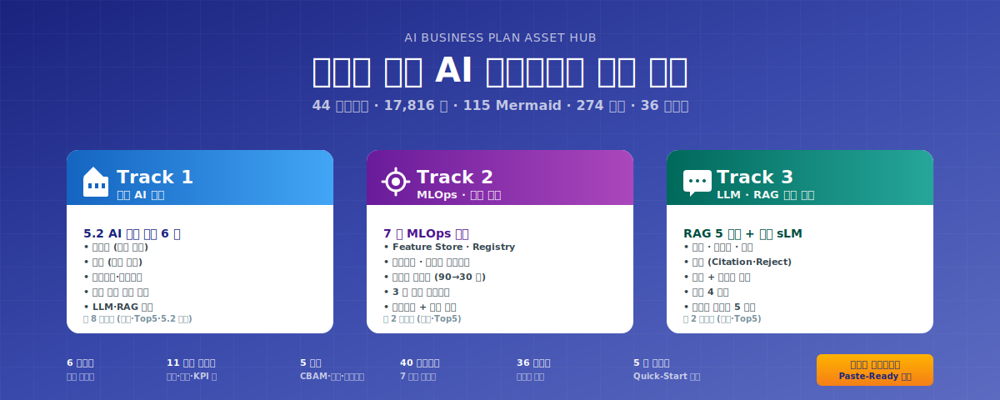

# AI 사업계획서 자산 허브

<figure markdown="span">
  
  <figcaption>본 워크스페이스의 3 트랙 자산 구조 — 페이지 우측 상단의 ⬇ 다운로드 버튼으로 SVG 원본 (해상도 무제한) 다운로드 가능</figcaption>
</figure>

> **부산·경남권 제조업체** (철강·고무·정밀가공) 대상 정부지원 R&D 사업계획서 작성을 위한 **누적 자산 워크스페이스** 의 시각 문서화. 44 마크다운 / 17,816 줄 / 115 Mermaid 블록 / 274 인용 출처 표기 / 9 분류 자산 군 + 36 방법론 후보.

---

## 빠른 진입 — 5 단계 워크플로

새 [고객사] 사업계획서 작성 시:

1. **새 요청 수신** — 5 항목 입력 (고객사명·업종·규모·지원사업·기간)
2. **패키지 매칭** — 6 패키지 중 1:1 또는 복합 매핑
3. **양식 검증** (다년 R&D 시) — PDF 통독 + 8 섹션 자산 신설
4. **통합 파일럿 변형** — §1.2 가설 박스 + KPI·예산 [수치] 변경
5. **자산 인용 + 자체평가** — 11 운영 가이드 + 5 모듈 + Track Top5 인용

자세한 사용법: [운영 모드 Quickstart](guide/quickstart.md)

---

## 9 분류 자산

- :material-factory:{ .lg .middle } **Track 1 — 제조 AI 본문**

    ---

    제조업·공정에서 AI 도입 필요성·데이터 유형·모델 선정·5.2 엔진 변형 카드 6 종

    [→ Track 1 목차](track/track1-index.md) · [Top5 본문](track/track1-top5.md) · [5.2 카드](track/track1-engine-cards.md)

- :material-cog-refresh:{ .lg .middle } **Track 2 — MLOps**

    ---

    CI/CD for ML·Feature Store·모니터링·드리프트·재학습·거버넌스 7 종 모듈

    [→ Track 2 목차](track/track2-index.md) · [Top5 본문](track/track2-top5.md)

- :material-message-text:{ .lg .middle } **Track 3 — LLM·RAG**

    ---

    도메인 sLM·RAG 5 계층·청킹 전략·골드셋·작업지시 자동화·환각 방지

    [→ Track 3 목차](track/track3-index.md) · [Top5 본문](track/track3-top5.md)

- :material-format-list-bulleted:{ .lg .middle } **시나리오 (40 종 / 7 도메인)**

    ---

    철강 (STL) · 고무 (RUB) · 정밀가공 (MET) · 유틸 (UTL) · 안전·ESG (SAF) · LLM · MLOps

    [→ 시나리오 카탈로그](scenario/catalog.md)

- :material-package-variant-closed:{ .lg .middle } **6 통합 파일럿 (사업 패턴)**

    ---

    패키지 1 (대기업 철강 다년) · 2 (중견 냉연) · 3 (특수강관 RAG) · 4 (고무 양산) · 5 (정밀가공 SaaS) · 6 (유틸 ESG)

    [→ 패키지 1](pkg/pkg1-steel-enterprise.md) · [2](pkg/pkg2-cold-rolled.md) · [3](pkg/pkg3-special-pipe.md) · [4](pkg/pkg4-rubber.md) · [5](pkg/pkg5-precision.md) · [6](pkg/pkg6-util-esg.md)

- :material-book-open-page-variant:{ .lg .middle } **11 운영 가이드**

    ---

    Quickstart·조립·재무·압축·KPI·외부검증·RAG·도메인지식·sLM·컨설팅위탁·TRL·위험관리

    [→ Quickstart](guide/quickstart.md) · [조립 가이드](guide/assembly.md)

- :material-puzzle:{ .lg .middle } **5 Cross-cutting 모듈**

    ---

    CBAM 대응·중대재해 안전·연합학습·OEM 공급망·SaaS 보안

    [→ CBAM](module/cbam.md) · [안전](module/safety.md) · [연합학습](module/federated-learning.md) · [OEM](module/oem-supply.md) · [SaaS](module/saas-security.md)

- :material-format-list-bulleted-square:{ .lg .middle } **기타 자산 + 메타**

    ---

    시너지 ROI 모델 · 책임 매트릭스 · 양식검증 · 방법론 총론 · 작업로그

    [→ 시너지 ROI](other/synergy-roi.md) · [방법론](other/methodology.md) · [작업로그](meta/worklog.md)

---

## 활용 시나리오

| 사용자 유형 | 1 차 진입점 |
|---|---|
| **신규 작업자 / 다른 세션 AI** | [운영 모드 Quickstart](guide/quickstart.md) → 5 분 안에 워크플로 시작 |
| **사업계획서 1 부 작성** | [패키지 매칭 표](guide/quickstart.md#2-패키지-매칭) → 통합 파일럿 변형 |
| **다년 R&D 양식 검증** | [양식검증 DX 촉진 R&D](other/form-validation-dx.md) → 8 섹션 패턴 답습 |
| **방법론 이식 (다른 프로젝트)** | [방법론 총론](other/methodology.md) → 36 방법론 후보 통째 가져가기 |

---

## 워크스페이스 통계

| 항목 | 값 |
|---|---|
| 자산 총수 | **44** 마크다운 (CLAUDE.md 포함) |
| 분량 | **17,816** 줄 / 약 750 KB |
| 시각 자료 | Mermaid 블록 **115** + 표 **2,484** 행 |
| Cross-reference | 출처 표기 **274** 회 (자산 간 인용 망) |
| 방법론 | **36** 후보 (4.1 ~ 4.36) |
| 작업 사이클 | **36** 작업로그 엔트리 (Phase A ~ E8) |

[→ Cross-reference 인터랙티브 그래프](graph.md) (Stage 3 활성)
