# 모듈 — 연합학습·산단 공동 AI

## 1. 모듈 목적

본 모듈은 부산·경남 제조 클러스터(철강·자동차 부품·조선 기자재·뿌리산업 등)에서 **참여사 간 원천 데이터 공유 없이 공통 AI 모델을 학습·운영** 하기 위한 **연합학습(Federated Learning, FL)** 구축 개념을 사업계획서 여러 섹션에 삽입할 수 있도록 설계한 **크로스커팅 재사용 블록 세트** 이다. Track 1/2/3 의 고유 목차에 종속되지 않으며, 거시환경(1.2)부터 MLOps(Track 2)·부록 FAQ 까지 다수 섹션에 끼워 넣어도 논리적 단절 없이 정합되도록 100~300 자 단위의 자립 블록으로 구성하였다.

본 모듈이 선제적으로 다루는 쟁점은 단순 "데이터 안 모으면 된다" 수준을 넘어 (1) **모델 업데이트(gradient·weight)의 역공학 리스크**, (2) **차등 프라이버시(Differential Privacy) 기반 노이즈 주입·프라이버시 예산 관리**, (3) **참여사 간 계약·법적 책임 분담 및 영업비밀 보존 거버넌스** 까지의 3 대 축을 포함한다. 이를 통해 대중소상생·디지털 경남·뿌리산업 첨단화·전사적 DX 등 "데이터 공유 없는 협력" 요건이 강조되는 공고에 일관되게 대응한다.

> **플레이스홀더 범례** — `[수치]` 참여사 수·정확도·통신량 등 수치, `[조건]` 보안 등급·산단 명·지원사업 요건, `[기술스택]` Flower/NVFlare/TFF/PySyft 등 프레임워크, `[고객사]` 주관 고객사, `[공정]` 대상 공정명, `[기간]` 기간.

---

## 2. 삽입 지점 맵

| 삽입 위치 | 블록 ID | 블록명 | 분량 |
|---|---|---|---|
| Track 1 1.2 거시환경 | **BLK-FL-A** | 산단 공동 AI 의 거시적 필요성 | 1 문단 |
| Track 1 1.4 고객사 현황 | **BLK-FL-B** | 중소 참여사의 데이터 한계 | 1 문단 |
| Track 1 4.x TO-BE (4.1/4.3/4.6) | **BLK-FL-C** | 연합학습 아키텍처 | 2 문단 |
| Track 1 5.x 구축 (5.1/5.4) | **BLK-FL-D** | 참여사 온보딩·거버넌스 | 1~2 문단 |
| Track 1 6.2 정성효과 | **BLK-FL-E** | 산단 전체 동반성장·상생 효과 | 1 문단 |
| Track 2 MLOps | **BLK-FL-F** | 연합 모델의 운영·드리프트 관리 | 1 문단 |
| 부록 (공통) | **BLK-FL-G** | FAQ — 보안·영업비밀·법적 책임 | 0.5 페이지 |

> 블록 ID 는 본문 내 편집 이력·변형 버전 관리 시 참조 키로 사용한다. 동일 블록을 복수 사업에 재사용할 때는 수치·참여사 범위·기술 스택 플레이스홀더만 교체한다.

---

## 3. 본문 블록 A~G

### BLK-FL-A — 산단 공동 AI 의 거시적 필요성 (삽입: 1.2 거시환경)

- **용도**: 거시환경 서술 말미에 "산단·클러스터 단위의 협력형 AI" 라는 정책적 흐름을 1 문단으로 추가, 후속 블록 B·C 로 연결하는 교량.
- **초안 (문어체)**:

  > 제조 AI 의 경쟁력은 단일 기업의 데이터 규모를 넘어 **산단·클러스터 단위의 축적된 공정 지식** 에서 창출되는 국면에 진입하고 있다. 특히 부산·경남 제조 클러스터는 철강·자동차 부품·조선 기자재·뿌리산업이 지리적으로 집적되어 있어, 개별 중소기업이 단독으로는 확보하기 어려운 다품종·다조건 데이터가 클러스터 차원에서는 풍부하게 존재한다. 그러나 영업비밀 보호와 데이터 주권 이슈로 인해 원천 데이터를 중앙 서버에 통합하는 전통적 방식은 현실적으로 불가능하며, 이에 따라 **참여사의 데이터를 이동시키지 않고 모델만 공유·학습** 하는 **연합학습(Federated Learning) 기반 협력형 AI** 가 대중소상생·디지털 경남·뿌리산업 첨단화 등 최근 지원사업 공고에서 "데이터 공유 없는 협력" 요건으로 명시되고 있다.

- **키워드·수치**: 산단·클러스터, 데이터 주권, 연합학습, 영업비밀, [수치]개 참여사 규모, "데이터 공유 없는 협력".
- **대체 문구 옵션**:
  - (R&D 색채 강화) "… 산단 차원의 공동 AI 자산 축적은 국가 제조 경쟁력 확보의 기반 인프라로 제시되고 있다."
  - (ESG 색채 강화) "… 데이터 주권과 영업비밀 보호는 ESG 의 거버넌스(G) 축과 직접 연계된다."

---

### BLK-FL-B — 중소 참여사의 데이터 한계 (삽입: 1.4 고객사 현황)

- **용도**: 고객사 현황의 "구조적 문제" 블렛에 **단독 학습 불가능성** 을 별도 항목으로 추가, 연합학습 도입 당위성의 미시적 근거 제공.
- **초안 (문어체)**:

  > [고객사] 및 부산·경남 제조 클러스터 내 중소 참여사 대다수는 단일 공장 기준 연간 확보 가능한 공정 데이터가 불량·이벤트·희소 조건(고난이도 재질·특수 사양)에 대해 AI 학습에 요구되는 최소 표본 규모([수치]건)에 미달하는 **데이터 희소성 구조** 에 놓여 있다. 특히 이상탐지·예지보전·표면결함 분류 등 불량 라벨 수가 절대적으로 적은 문제에서는 단일 기업의 데이터만으로 학습한 모델이 **과적합·일반화 실패** 로 이어지는 한계가 반복 관찰된다. 반면 원재료·설비·공정 특성이 유사한 클러스터 내 다른 참여사의 데이터를 **원본 노출 없이 공동 학습 자원으로 활용** 할 수 있다면, 단독으로는 도달 불가능한 표본 규모·다양성을 확보할 수 있어, 연합학습 기반 협력 구조가 중소 참여사의 AI 전환에 사실상 유일한 현실적 경로로 부각된다.

- **키워드·수치**: 데이터 희소성, 최소 표본 [수치]건, 과적합·일반화 실패, 불량 라벨 희소, 공동 학습 자원.
- **대체 문구 옵션**:
  - (정밀가공 업종) "… 치수·공차 이상 사례가 연 [수치]건 미만으로 발생해 단독 학습 표본이 부족하며 …"
  - (고무·폴리머 업종) "… 배합·경화 조건의 희소 불량 패턴이 개별 공장 기준 연 [수치]건 수준에 불과해 …"

---

### BLK-FL-C — 연합학습 아키텍처 (삽입: 4.1 TO-BE / 4.3 데이터 유형 / 4.6 전체 파이프라인)

- **용도**: TO-BE 아키텍처 또는 전체 파이프라인 다이어그램 직전·직후에 배치되어 연합학습 구조를 정의하는 본문 블록. 2 문단 구성.
- **초안 (문어체)**:

  > 본 사업에서 도입하는 **연합학습(Federated Learning) 아키텍처** 는 각 참여사 내부에 배포되는 **로컬 학습 클라이언트** 와, 참여사 외부(주관기관 또는 중립 클라우드)에 위치하는 **중앙 집계 서버(Aggregator)** 로 구성된다. 각 참여사는 자사 공정 데이터를 자체 경계 안에 보관한 상태로 로컬 모델을 학습하며, 외부로 송신되는 것은 원천 데이터가 아닌 **모델 파라미터 업데이트(가중치·그래디언트)** 에 국한된다. 중앙 서버는 수신한 업데이트를 FedAvg·FedProx 등 **집계 알고리즘** 을 통해 결합하여 **글로벌 모델** 을 갱신하고, 갱신된 글로벌 모델을 다시 참여사에 배포함으로써 라운드 단위 학습 사이클을 반복한다. 기술 스택은 [기술스택] 을 기반으로 하되, 참여사 수·네트워크 조건·보안 등급에 따라 조합을 조정한다.
  >
  > 모델 업데이트 자체에서도 역공학을 통한 학습 데이터 복원 위험이 알려져 있으므로, 본 아키텍처에는 **차등 프라이버시(Differential Privacy, DP)** 기반 노이즈 주입, **보안 집계(Secure Aggregation)** 프로토콜, **참여사별 프라이버시 예산(ε·δ) 관리** 가 기본 포함된다. 업데이트 송신 구간은 TLS 암호화와 상호 인증을 적용하며, 중앙 서버는 개별 참여사의 업데이트를 그대로 열람할 수 없도록 **다자간 계산(MPC)** 또는 **동형암호(HE)** 옵션을 병행한다. 이로써 "원천 데이터 미이동 + 업데이트 역공학 방지 + 집계 서버 신뢰 최소화" 의 3 중 방어선이 형성되어, 영업비밀과 데이터 주권이 기술적으로 담보된 상태에서 클러스터 공동 모델이 성장하는 구조를 갖는다.

- **키워드·수치**: 로컬 클라이언트, 중앙 집계 서버(Aggregator), FedAvg·FedProx, 글로벌 모델, 라운드 [수치]회, 차등 프라이버시 ε=[수치], 보안 집계, TLS, MPC·동형암호.
- **대체 문구 옵션**:
  - (경량 버전) 두 번째 문단을 "… 차등 프라이버시 및 보안 집계를 선택 적용한다." 1 문장으로 축약.
  - (교차 사일로 강조) "본 구조는 스마트폰 기반 교차 디바이스(cross-device) 연합학습이 아닌, 참여사 단위의 **교차 사일로(cross-silo) 연합학습** 으로 설계된다." 삽입.

---

### BLK-FL-D — 참여사 온보딩·거버넌스 (삽입: 5.1 데이터 수집 / 5.4 기존 시스템 연동)

- **용도**: 구축 단계 서술에 **참여사 모집·온보딩·규약 서명·데이터 스키마 정합화** 절차를 명시, 거버넌스 실행력을 입증.
- **초안 (문어체)**:

  > 연합학습 기반 공동 모델의 품질은 참여사 간 **데이터 스키마·라벨 정의·단위 체계의 정합성** 에 결정적으로 의존하므로, 본 사업은 참여사 온보딩을 4 단계(① 참여의향 확인·사전심사 → ② 표준 스키마·라벨 정의서 공유 및 로컬 매핑 → ③ 보안·프라이버시 규약 서명 → ④ 파일럿 라운드 [수치]회 검증)로 구조화한다. 각 참여사에는 로컬 학습 클라이언트([기술스택] 기반)와 데이터 전처리 모듈이 동일 컨테이너 이미지로 배포되며, 참여사 내부의 MES·SCADA·PLC 데이터와는 읽기 전용 커넥터로 연동되어 **원천 시스템의 운영 영향 최소화** 원칙을 유지한다.
  >
  > 거버넌스 차원에서는 **운영위원회(주관기관 + 참여사 대표 + 외부 감리)** 를 구성하여 (1) 참여·탈퇴 조건, (2) 모델 기여도 평가 및 성과 배분 원칙, (3) 프라이버시 예산·보안 사고 대응 절차, (4) 글로벌 모델의 **지식재산권 귀속 및 상업적 이용 범위** 를 성문화한 **참여사간 협약서(Consortium Agreement)** 를 체결한다. 협약서는 영업비밀 보호 의무, 학습 종료 후 로컬 가중치 폐기 의무, 이탈 시 기여분 처리 방식 등을 포함하며, 국내 개인정보보호법·산업기술보호법·부정경쟁방지법과의 정합성을 사전 법률 검토(확인 필요)하여 반영한다.

- **키워드·수치**: 온보딩 4 단계, 스키마 정합화, 컨테이너 배포, 운영위원회, 참여사간 협약서, 기여도 평가, IP 귀속, 산업기술보호법.
- **대체 문구 옵션**:
  - (대중소상생 맥락) "대기업 [조건] 이 모델 주도권을 갖고 중소 참여사가 데이터 기여자로 참여하는 비대칭 구조에 맞춰, 기여도 평가는 **Shapley 값 기반 정량화** 로 투명성을 확보한다." 추가.
  - (디지털 경남 맥락) "경남테크노파크 (확인 필요) 를 중립 집계 서버 운영 주체로 지정하여 참여사 간 신뢰를 확보한다." 추가.

---

### BLK-FL-E — 산단 전체 동반성장·상생 효과 (삽입: 6.2 정성효과)

- **용도**: 정성적 기대효과에 "단일 기업 효과를 넘는 산단·지역 차원 파급" 을 1 문단으로 추가.
- **초안 (문어체)**:

  > 본 사업이 구축하는 연합학습 기반 공동 AI 는 [고객사] 단독의 성과를 넘어, 부산·경남 제조 클러스터 내 중소 참여사가 **원천 데이터 공유 없이도 대기업급 AI 모델의 품질** 에 근접할 수 있는 **디지털 동반성장 인프라** 로 확장된다. 희소 불량·특수 조건에 대한 학습 표본이 클러스터 차원에서 축적됨에 따라 이상탐지·품질예측 성능이 참여사 평균 [수치]% 향상되고, 신규 참여사는 파일럿 라운드 [수치]회만으로 글로벌 모델의 편익을 수혈받을 수 있어 AI 도입 진입 장벽이 근본적으로 낮아진다. 이는 단일 기업 단위의 디지털 격차를 완화하고, 산단 전체의 평균 AI 성숙도를 끌어올리는 **수평적 상생 구조** 로 작동하여 대중소상생·지역 혁신클러스터 정책 목표와 직접 정합한다.

- **키워드·수치**: 디지털 동반성장, 평균 [수치]% 향상, 참여사 [수치]개, 디지털 격차 완화, 수평적 상생, 지역 혁신클러스터.
- **대체 문구 옵션**:
  - (수출·글로벌 강조) "… 클러스터 공동 모델 자체를 산단 공동 수출자산으로 활용하는 장기 비전과도 연결된다."

---

### BLK-FL-F — 연합 모델의 운영·드리프트 관리 (삽입: Track 2 MLOps)

- **용도**: MLOps 섹션에 **연합 모델 특유의 운영 난점** — 참여사별 드리프트, 라운드 스케줄, 클라이언트 가용성 — 을 1 문단으로 명시.
- **초안 (문어체)**:

  > 연합학습 모델은 단일 사이트 모델 대비 **참여사별 데이터 분포 편이(non-IID)**, **클라이언트 가용성 변동**, **라운드 간 통신 비용** 이라는 3 대 운영 난점을 추가로 갖는다. 본 사업의 MLOps 는 이에 대응하여 (1) 참여사별 로컬 모델과 글로벌 모델의 **성능·드리프트 지표를 분리 모니터링** 하는 대시보드, (2) 드리프트 탐지 시 자동으로 **부분 재학습 라운드** 를 트리거하는 규칙 엔진, (3) 일부 참여사의 일시적 미참여를 허용하는 **비동기 집계(Asynchronous FedAvg)** 옵션, (4) 라운드별 차등 프라이버시 예산 소진 현황과 통신량 [수치]GB 를 추적하는 **프라이버시·리소스 대시보드** 를 포함한다. 이로써 모델 품질 저하와 프라이버시 예산 고갈이 조기에 감지되어 공동 모델의 지속 가능성이 담보된다.

- **키워드·수치**: non-IID, 클라이언트 가용성, 통신 비용 [수치]GB, 드리프트 분리 모니터링, 비동기 FedAvg, 프라이버시 예산 ε 추적, 부분 재학습.
- **대체 문구 옵션**:
  - (Flower/NVFlare 특정 스택) "Flower (확인 필요) 의 Strategy API 를 활용해 FedAvg·FedProx·FedAdam 을 시나리오별로 분기 적용한다." 추가.

---

### BLK-FL-G — 부록 FAQ (삽입: 부록)

- **용도**: 심사위원·참여사 법무팀이 흔히 제기하는 질문에 대한 공식 답변 초안. 사업계획서 부록 또는 별첨 Q&A 로 삽입(약 0.5 페이지).

**Q1. 원천 데이터가 외부로 나가지 않는다고 하는데, 모델 업데이트에서 학습 데이터가 복원될 가능성은 없는가?**

> 이론적으로는 가중치·그래디언트 업데이트에 대해 **membership inference · model inversion · gradient leakage 공격** 이 연구되어 왔으며, 특히 배치 크기가 작거나 공격자가 여러 라운드 업데이트를 관찰할 수 있는 경우 부분적 복원 위험이 존재한다. 본 사업은 이에 대응하여 (1) **차등 프라이버시(DP-SGD)** 기반 노이즈 주입으로 개별 샘플의 영향을 수학적으로 상한 처리하고, (2) **보안 집계(Secure Aggregation)** 로 중앙 서버조차 개별 참여사의 업데이트를 복원할 수 없도록 하며, (3) 프라이버시 예산(ε·δ) 을 라운드별로 누적 추적해 상한 도달 시 학습을 중단하는 3 중 방어선을 적용한다.

**Q2. 차등 프라이버시 노이즈가 커지면 모델 성능이 떨어지지 않는가? 어떻게 절충하는가?**

> DP 노이즈 강도는 프라이버시 예산 ε 값으로 조절되며, ε 이 작을수록 강한 보호 대신 성능 손실이 발생하는 **프라이버시-유용성 트레이드오프(Privacy-Utility Trade-off)** 가 존재한다. 본 사업은 파일럿 라운드에서 ε ∈ [조건] 구간을 스캔해 참여사 합의 하에 **운영 ε 기본값** 을 확정하고, 이상탐지·품질예측 등 민감도가 낮은 과제와 공정설계 추천 등 민감도가 높은 과제에 대해 **과제별 차등 ε** 을 적용한다. (구체 ε·δ 값은 확인 필요.)

**Q3. 한 참여사가 악의적으로 오염된 업데이트를 보내 글로벌 모델을 훼손하면 어떻게 되는가?**

> **모델 포이즈닝(Model Poisoning) · 백도어 공격** 리스크이며, 본 사업은 (1) Krum · Median · Trimmed-Mean 등 **비잔틴 강건 집계(Byzantine-Robust Aggregation)** 알고리즘을 기본 채택하고, (2) 업데이트 이상치 탐지 규칙을 중앙 서버에 장착하며, (3) 참여사 협약서에 **데이터·모델 무결성 보증 의무 및 위반 시 제재** 조항을 성문화한다.

**Q4. 참여사의 영업비밀·지식재산권은 어떻게 보호되며, 공동 모델의 소유권은 누구에게 있는가?**

> 원천 데이터는 각 참여사 경계 내에 잔존하므로 영업비밀 직접 유출 경로는 차단된다. 글로벌 모델의 **지식재산권 귀속·상업적 이용 범위** 는 참여사간 협약서(Consortium Agreement)에 명시하며, 본 사업에서는 "공동 귀속 + 내부 비상업적 이용 자유 + 외부 상업화 시 별도 합의" 원칙을 기본값으로 제안한다. 단, 산업기술보호법·부정경쟁방지법·개인정보보호법상 구체 요건은 사전 법률 검토(확인 필요)로 확정한다.

**Q5. 특정 참여사가 중도 이탈하면 이미 학습된 공동 모델에 그 참여사의 기여분이 남아 있어 문제가 되지 않는가?**

> **기계 비학습(Machine Unlearning)** · 참여사 기여분 제거 연구가 활발하나 완전한 제거는 기술적으로 난제이다. 본 사업은 협약서에 (1) 이탈 통지 [기간] 전 사전 고지 의무, (2) 이탈 시점 이후 라운드 참여 중단, (3) 필요 시 해당 참여사 제외 재학습 조항을 명시하고, 실무적으로는 **기여분 제거 재학습 비용** 을 이탈 참여사와 잔류 참여사 간 분담하는 방식을 기본 옵션으로 제시한다.

**Q6. 사고(프라이버시 침해·데이터 유출·모델 오작동) 발생 시 법적 책임은 누가 지는가?**

> 사고 유형별로 귀책 주체가 달라지므로 협약서에 **책임 매트릭스(Liability Matrix)** 를 포함한다. 예를 들어, 참여사 로컬 환경에서 발생한 데이터 유출은 해당 참여사 책임, 중앙 집계 서버의 운영 과실은 주관기관 책임, 알고리즘 설계 결함은 수행기관 책임으로 구분하며, 공동 책임 구간(예: 집계 알고리즘의 프라이버시 보증 불충분)은 책임 비율을 사전 합의한다. **배상 책임 보험 가입** 및 **면책 조항** 의 구체 범위는 사전 법률 검토(확인 필요)로 확정한다.

---

## 4. 관련 시나리오·지원사업

### 4.1 시나리오 카탈로그 확장 축 — C-5 매핑

- `시나리오_카탈로그.md` **부록 C-5 연합학습·프라이버시 보존 AI** 가 본 모듈의 1 차 확장 축.
- 관련 인접 축: **C-4 공급망·대중소 상생 AI** (협력사 재고·품질 가시성 공유 플랫폼 — 연합학습 기반), **C-3 생성형 AI 기반 제조 설계** (제조 특화 sLM 의 연합학습 파인튜닝 확장 여지).

### 4.1.1 연합학습 결합에 적합한 카탈로그 시나리오

본 모듈은 특정 단일 시나리오 대응이 아닌 **기존 시나리오에 "산단 공동 학습" 레이어를 덧씌우는** 구조이다. 데이터 희소성이 심하거나 원재료·설비·공정 특성이 여러 참여사 간에 유사한 시나리오가 주 결합 후보이다.

| 카탈로그 시나리오 | 결합 가치 | 주 사용 블록 |
|---|---|---|
| **SCN-STL-09** 설비 예지보전 (압연기 롤·베어링·구동부) | 고장 라벨 절대적으로 희소 — 산단 공동 학습 시 표본 규모 [수치]배 확대 가능 | BLK-FL-B (데이터 희소성), BLK-FL-C (아키텍처), BLK-FL-E (동반성장) |
| **SCN-STL-10** 표면결함 비전 검사 | 신규 결함 유형이 한 공장에 1~2건/년 수준 — 연합학습으로 클래스 다양성 확보 | BLK-FL-B, BLK-FL-C |
| **SCN-STL-11** 비파괴검사 UT/ECT 자동 판정 | 결함 신호 라벨 희소 + 공급사별 재질 차이 — 클러스터 공동 라벨 집합 유리 | BLK-FL-B, BLK-FL-C |
| **SCN-RUB-01** 배합 분산도 예측 | 원료 배합비 변동이 참여사별 다양 — 공동 모델이 일반화 성능 향상 | BLK-FL-B, BLK-FL-E |
| **SCN-RUB-05** 고무 외관 비전 검사 | 결함 데이터 부족 (Self-supervised 사전학습 이후에도) — 연합학습 보완 | BLK-FL-B, BLK-FL-C |
| **SCN-MET-01** CNC 공구 마모·파손 예지 | 중소 정밀가공사 다수 참여 시 공구·재료 조합 다양성 확보 | BLK-FL-A, BLK-FL-B |
| **SCN-MET-02** 용접 비드 비전·파라미터 최적화 | 로봇 용접 조건·결함 데이터의 참여사 간 보완 | BLK-FL-B, BLK-FL-F |
| **SCN-MLO-02** 피쳐 스토어·모델 레지스트리 | 산단 공동 플랫폼의 인프라 축 — 연합학습 집계 서버와 통합 운영 | BLK-FL-C, BLK-FL-D, BLK-FL-F |
| **SCN-LLM-01~04** 전 LLM·RAG 시나리오 | 제조 특화 sLM 의 **도메인 연합 파인튜닝** — 영업비밀 보존한 공동 모델 | BLK-FL-A (거시), BLK-FL-C (FL 구조) + Track 3 결합 |

> 본 표는 "어떤 기존 시나리오가 연합학습 구조 위에서 가장 큰 효용을 얻는가" 를 판정하는 1 차 참조. 사업계획서 작성 시 고객사 공정 특성·데이터 성숙도·참여사 구성에 따라 우선순위를 재조정한다.

### 4.2 지원사업 매핑

| 지원사업 | 본 모듈 적용 포인트 | 우선 결합 블록 |
|---|---|---|
| **대중소상생 (LG·삼성·포스코 AI 트랙)** | 대기업 플랫폼 + 중소 참여사 데이터 기여의 비대칭 연합 구조. 기여도 평가·IP 귀속 조항이 공고 요구사항과 직접 정합. | BLK-FL-A, D, E, G |
| **2026 디지털 기업 in 경남** | 경남테크노파크(확인 필요) 중립 집계 서버 구도. 지식그래프·RDBMS 와 연합학습 병행. | BLK-FL-A, C, D, F |
| **뿌리산업 첨단화** | 열처리·표면처리·주조 뿌리기업 간 희소 불량 데이터 공동 학습. C-5 + C-4 결합. | BLK-FL-B, C, E |
| **제조AI특화 스마트공장** | 단일 공장 고도화 중심이라 기본 범위 바깥이지만, 2 단계 확장 시나리오로 본 모듈을 별첨 형태로 제시 가능. | BLK-FL-A, B (별첨) |
| **전사적 DX 촉진 R&D** | 다년 R&D 성격상 연합학습 연구개발 과제로 직접 편입 가능(Byzantine 강건성·DP 예산 최적화 등 심화 주제). | BLK-FL-C, F, G |
| **클라우드 종합솔루션 지원사업 (SaaS)** | 중립 SaaS 집계 서버 제공자로서 CSP(네이버클라우드 등) 연계 가점. | BLK-FL-C, D |

상세 공고 조건·예산·신청 시기는 `지원사업_공고_스냅샷_2026.md` 참조.

---

## 5. 삽화·도식 후보

| 도식 ID | 삽화명 | 배치 지점 | 형식 |
|---|---|---|---|
| FIG-FL-1 | **연합학습 전체 아키텍처 다이어그램** (로컬 클라이언트 N 개 ↔ 중앙 집계 서버 ↔ 글로벌 모델 배포) | BLK-FL-C 1 문단 직후 | Mermaid flowchart + 원본 데이터 경계선 하이라이트 |
| FIG-FL-2 | **참여사 네트워크 토폴로지** (부산·경남 클러스터 지도 + 참여사 노드 + 집계 서버 중립 위치) | BLK-FL-A 또는 BLK-FL-E 직후 | 지도형 인포그래픽 |
| FIG-FL-3 | **모델 집계 라운드 시퀀스 다이어그램** (Round t: 배포 → 로컬 학습 → 업데이트 송신 → 보안 집계 → 글로벌 모델 갱신) | BLK-FL-C 2 문단 또는 BLK-FL-F 근처 | Sequence diagram |
| FIG-FL-4 | **거버넌스 구조도** (운영위원회 + 주관기관 + 참여사 대표 + 외부 감리 + 법률 자문) | BLK-FL-D 직후 | 조직도 / 계층 다이어그램 |
| FIG-FL-5 | **프라이버시 방어선 3 중 구조** (DP 노이즈 + 보안 집계 + TLS·MPC) | BLK-FL-C 2 문단 또는 BLK-FL-G Q1 직후 | 동심원 / 레이어 다이어그램 |
| FIG-FL-6 | **프라이버시-유용성 트레이드오프 곡선** (ε vs 모델 정확도) | BLK-FL-G Q2 직후 | 라인 차트 개념도 |
| FIG-FL-7 | **책임 매트릭스** (사고 유형 × 책임 주체) | BLK-FL-G Q6 직후 | 매트릭스 표 |

Mermaid 예시 (FIG-FL-1 골격):

---

## 6. 유지보수 지침

본 모듈은 다음 조건 변경 시 지정 블록을 수정한다.

| 변경 트리거 | 수정 대상 블록 | 조치 |
|---|---|---|
| 참여사 수·규모 변경 | BLK-FL-A, B, D, E / FIG-FL-2 | `[수치]` 참여사 수·표본 규모 교체, 토폴로지 재작성 |
| 기술 스택 교체(Flower ↔ NVFlare ↔ TFF ↔ PySyft) | BLK-FL-C, D, F | `[기술스택]` 플레이스홀더 일괄 교체, 프레임워크별 특이 옵션(API 용어) 조정 |
| 보안 등급 상향(기밀·민간 → 공공·국방급) | BLK-FL-C, D, G / FIG-FL-5 | MPC·HE 기본화, DP ε 하향, 책임 매트릭스 강화 |
| 지원사업 공고 개정 | 4.2 지원사업 매핑 표 / BLK-FL-A | `지원사업_공고_스냅샷_2026.md` 최신본과 정합성 재검토 |
| 법령 개정(개인정보보호법·산업기술보호법·AI기본법 등) | BLK-FL-D 협약서 조항, BLK-FL-G Q4/Q6 | 사전 법률 검토 재실시, 관련 문장의 "(확인 필요)" 해소 |
| 참여 업종 변경(철강 → 고무·폴리머 → 뿌리·정밀가공) | BLK-FL-B 대체 문구, 4.2 지원사업 매핑 | 업종별 희소 불량 사례·지원사업 우선순위 교체 |
| 집계 알고리즘 변경(FedAvg → FedProx → FedAdam → Krum 등) | BLK-FL-C 1 문단, BLK-FL-F | 알고리즘명 교체, 비잔틴 강건성 서술 조정 |
| 프라이버시 예산 정책 변경 | BLK-FL-C 2 문단, BLK-FL-G Q2, FIG-FL-6 | ε·δ 운영값 재확정, 트레이드오프 곡선 갱신 |

---

## 7. 확인 필요 항목

본 모듈 내에서 사용자(또는 후속 업데이트)가 1 차 자료로 확정해야 하는 "(확인 필요)" 항목.

1. **대중소상생(LG·삼성·포스코 AI 트랙) 2026 공고의 연합학습·데이터 공유 구체 요건** — 대기업 플랫폼 필수 연계 여부, 참여사 IP 귀속 표준 조항 유무. (BLK-FL-A·BLK-FL-D 인용 문구 확정 근거)
2. **2026 디지털 기업 in 경남 공고의 주관기관 지정 방식** — 경남테크노파크가 중립 집계 서버 운영 주체로 공식 지정되는지. (BLK-FL-D 대체 문구 근거)
3. **뿌리산업 첨단화 2026 공고의 뿌리기업 확인증 요건 및 참여사 자격 조건**. (4.2 매핑 표 근거)
4. **국내 연합학습 관련 법령·가이드라인** — 개인정보보호법(가명처리·결합), 산업기술보호법, 부정경쟁방지법, AI 기본법(제정/시행 여부), 개인정보위·KISA 연합학습 가이드라인 최신판. (BLK-FL-D 협약서, BLK-FL-G Q4·Q6 근거)
5. **참여사간 협약서(Consortium Agreement) 표준 양식** — 국내 산단 공동 AI 사례의 표준 템플릿 존재 여부 및 조항 수준. (BLK-FL-D 근거)
6. **기여도 평가 기법(Shapley 값 기반 등)의 표준 운영 사례** — 국내외 연합학습 사업에서 실제 채택된 평가식·성과 배분 비율. (BLK-FL-D 대체 문구 근거)
7. **운영 ε·δ 권장 구간** — 제조 공정 데이터에 대한 국내 산업별 DP 운영 기본값 가이드(개인정보위·NIA 등 발간 자료). (BLK-FL-G Q2 근거)
8. **배상 책임 보험 상품** — 국내 AI·데이터 사고 관련 책임 보험 상품의 적용 범위 및 한도. (BLK-FL-G Q6 근거)
9. **집계 서버 인프라의 국산 CSP 연계 조건** — 네이버클라우드·KT클라우드 등의 보안 집계·TEE(Trusted Execution Environment) 서비스 지원 현황. (FIG-FL-1, 지원사업 5 매핑 근거)
10. **Flower/NVFlare/TFF/PySyft 등 기술 스택의 상용 레퍼런스 비교** — 국내 제조 산단 도입 사례 유무, 한국어 문서 지원 수준. (BLK-FL-C·BLK-FL-F 기술 스택 선택 근거)

---

> **본 모듈 사용 원칙** — 각 블록은 100~300 자의 자립 단위로 설계되었으므로, 대상 사업계획서의 논조·분량 제약에 맞춰 블록 단위로 삽입·삭제·재배열할 수 있다. 실명 기업·구체 수치는 원칙적으로 사용하지 않으며, "부산·경남 제조 클러스터", "중소 참여사", "[수치]개 참여사" 등 범위 표현을 유지한다. 영업비밀·차등 프라이버시·법적 책임의 3 대 쟁점은 본 모듈이 직접 다루며, 사업계획서 어디에 삽입되더라도 이 3 축이 하나라도 누락되지 않도록 BLK-FL-C·D·G 중 최소 1 개 이상을 반드시 포함하는 것을 권장한다.
