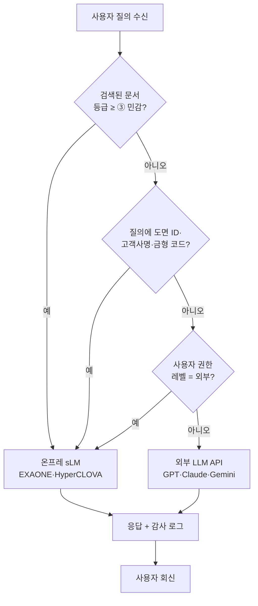

# 모듈 — SaaS·클라우드 보안 거버넌스 (크로스커팅 재사용 블록)

## 1. 모듈 목적

본 모듈은 클라우드 SaaS 형태로 도입되는 제조 AI 사업 (패키지 5 정밀가공 중소 SaaS 경량 파일럿, 패키지 6 일부 시나리오, 클라우드 종합솔루션 지원사업, 향후 SaaS 트랙 신규 공고 등) 에서 **온프레미스 OT/IT 경계 모델로는 다루지 못하는 클라우드 영역의 보안·거버넌스** 를 사업계획서 여러 섹션에 일관 톤으로 주입하기 위한 **크로스커팅 재사용 블록 세트** 이다. Phase E1 (패키지 2 중견 냉연 18 개월 풀 인프라) 의 보안 모델은 사내 폐쇄망과 OT/IT DMZ 경계를 중심으로 설계되었으나, Phase E2 (패키지 5 정밀가공 SaaS 경량) 가 클라우드 SaaS 영역으로 진입하며 **CSAP 인증 요구·자격증명 관리·영업비밀 도면 (DWG·STEP) 의 마스킹·SaaS 벤더의 데이터 주권·다중 테넌트 격리** 라는 새 보안 영역이 노출되었다. 본 모듈은 이러한 신규 쟁점을 **정밀가공 영업비밀 도면·고객사 IP·SaaS 벤더 신뢰의 3 축** 으로 정리하고, CSAP·ISMS-P·개인정보보호법·산업기술보호법과의 정합 어휘를 표준화하여, 패키지 5 를 비롯한 SaaS 트랙 사업계획서 7 개 지점에 분산 투입할 수 있도록 한다.

본 모듈이 선제적으로 다루는 쟁점은 (1) **국내 CSP (네이버클라우드·KT클라우드·NHN) vs 외산 CSP (AWS·Azure) 의 데이터 주권·CSAP 등급 차이**, (2) **다중 테넌트 격리·암호화·SSO 의 SaaS 표준 보안 아키텍처**, (3) **정밀가공 영업비밀 도면 (DWG·STEP·IFC) 의 비식별화·외주 라벨링 시 마스킹·산업기술보호법 정합성**, (4) **SaaS RAG 환경에서 민감 질의의 온프레 sLM 강제 라우팅** 의 4 대 축을 포함하며, 기존 모듈 (CBAM·중대재해·연합학습) 과 동일 7 블록 (A~G) 포맷으로 사업계획서 작성자가 취사선택할 수 있도록 설계되었다.

> **플레이스홀더 범례** — `[고객사]` 고객사명, `[수치]` 수치 전반, `[기간]` 기간, `[%]` 비율, `[CSP]` 클라우드 서비스 제공자 (네이버클라우드·KT클라우드·NHN·AWS·Azure 등), `[SaaS]` 대상 SaaS 제품·플랫폼명, `[법령-2026]` 시행 시점에 따라 교체가 필요한 법령·고시·인증 가이드 태그, `[등급]` CSAP·ISMS-P 등급.
> 본 모듈에 포함된 구체 인증 등급·등급별 요구사항·법령 조문은 모두 "(확인 필요)" 표기 또는 플레이스홀더로 처리하였으며, 실무 투입 전 `[법령-2026]` 기준의 최신 고시·인증 가이드를 확인하여 채워야 한다.

---

## 2. 삽입 지점 맵

| 삽입 위치 (상위 문서 섹션) | 본 모듈 블록 | 분량 추천 | 사용 성격 |
|---|---|---|---|
| Track 1 § 1.2 거시환경 | **BLK-CSEC-A** SaaS·클라우드 도입 거시 (CSAP·데이터 주권) | 1 문단 (220~280자) | 공통 고정 (SaaS 트랙 전반) |
| Track 1 § 2.4 데이터 보유 현황 | **BLK-CSEC-B** SaaS 적재 데이터의 분류·민감도 | 1 문단 + 표 (240~300자) | 고객사별 교체 (등급 체계 차이) |
| Track 1 § 4.5 모델 선정 또는 § 5.4 시스템 연동 | **BLK-CSEC-C** SaaS 보안 아키텍처 (SSO·암호화·테넌트 격리) | 2 문단 (380~480자) | 공통 고정 (SaaS 표준 보안) |
| Track 1 § 5.4 시스템 연동 | **BLK-CSEC-D** 영업비밀 도면·IP 마스킹·접근 권한 | 1~2 문단 (380~520자) | 정밀가공·기계 특화 교체 |
| Track 1 § 6.2 정성 기대효과 | **BLK-CSEC-E** 보안 거버넌스의 사업 가치 (감사 대비·고객 신뢰) | 1 문단 (220~280자) | 공통 고정 (CBAM-E·SAF-E 와 병기) |
| Track 3 § 5.6 권한·보안 | **BLK-CSEC-F** SaaS RAG 의 권한·민감정보 라우팅 | 1 문단 (220~280자) | Track 3 선택 삽입 |
| 부록 / 별첨 용어집 | **BLK-CSEC-G** 클라우드 보안 용어·법령 인덱스 | 0.5 페이지 | 공통 고정 (부록 자산) |

총 **7 개 블록 · 7 개 삽입 지점** 으로, 기존 CBAM·중대재해·연합학습 모듈과 동일 구조이다.

**조합 패턴 예시**
- **정밀가공 SaaS 풀패키지** (패키지 5 등): A + B + C + D + E + F + G (7 개 블록 모두 투입)
- **온프레 위주 + SaaS 일부 결합**: A + C + E (거시·아키텍처·정성 효과만 SaaS 톤으로 보강)
- **Track 3 RAG 중심 SaaS 사업**: A + F + G + (BLK-CSEC-D 도면 마스킹 결합)

---

## 3. 본문 블록

### BLK-CSEC-A — SaaS·클라우드 도입 거시 (CSAP·데이터 주권)

- **블록 ID**: `BLK-CSEC-A`
- **용도**: Track 1 § 1.2 거시환경 섹션 말미에 "왜 클라우드 SaaS 인가" 의 보안 거버넌스 명분 축으로 투입. 클라우드 도입의 비용 효율과 보안 거버넌스 양립을 한 문단으로 정당화하며, 후속 블록 B·C 와 자연 연결.
- **초안 문장 (공통 고정, 약 270자)**:

  > 국내 제조업의 클라우드 SaaS 기반 AI 도입은 비용 효율·확장성·신속한 배포의 이점에도 불구하고, **데이터 주권·다중 테넌트 격리·인증 거버넌스** 라는 보안 영역의 신규 쟁점을 동반한다. 정부는 공공·민간 클라우드 이용 활성화의 전제 조건으로 **클라우드 보안인증제 (CSAP)** 를 운영하고 있으며, ISMS-P (정보보호 및 개인정보보호 관리체계 인증) 와 함께 클라우드 SaaS 사업의 기본 신뢰 인프라로 자리 잡았다. 특히 제조 영업비밀과 도면·고객사 IP 가 적재되는 SaaS 의 경우 `[CSP]` 의 데이터센터 물리 위치·국내 법 적용 가능성·운영 인력 국적이 직접적인 리스크 요인이 되며, 국내 CSP (네이버클라우드·KT클라우드·NHN) 우선 검토와 외산 CSP (AWS·Azure) 사용 시 데이터 주권 보장 옵션 확인이 사업계획서 수립의 출발점이 된다. 클라우드 도입률이 `[수치]`% 를 상회하는 산업 환경에서 보안 거버넌스의 양립은 더 이상 선택이 아닌 SaaS 사업의 필수 조건이다.

- **주요 키워드·수치**: CSAP, ISMS-P, 데이터 주권, `[CSP]`, 국내 CSP·외산 CSP, 다중 테넌트 격리, 클라우드 도입률 `[수치]`%.
- **대체 문구 옵션**
  - *외산 CSP (AWS·Azure) 사용 사업*: "국내 CSP 우선 검토" 부분을 "외산 CSP 사용 시 한국 리전 (Seoul Region) 적용 + 데이터 주권 부속 계약 (DPA, Data Processing Addendum) 체결" 로 교체.
  - *국내 CSP 단일 사용 사업*: "외산 CSP (AWS·Azure) 사용 시 …" 부분을 생략하고 "국내 CSP 의 CSAP `[등급]` 인증 보유 사실" 을 강조.
  - *하이브리드 SaaS·온프레 분리 사업*: 말미에 "민감도 등급에 따라 일부 데이터는 사내 온프레미스에 보관하고 비민감 데이터만 SaaS 에 적재하는 하이브리드 분리 모델을 채택한다" 1 문장 추가.

---

### BLK-CSEC-B — SaaS 적재 데이터의 분류·민감도

- **블록 ID**: `BLK-CSEC-B`
- **용도**: Track 1 § 2.4 데이터 보유 현황 안쪽에서, 클라우드에 적재될 데이터를 민감도 등급으로 분류하고 등급별 처리 매트릭스를 명시. CBAM-C (데이터 유형) 와 병렬로 배치 가능하며, 본 블록은 "어떤 데이터가 SaaS 에 적재되는가" 에 보안 관점을 더한다.
- **초안 문장 (고객사별 교체, 약 280자 + 표)**:

  > [고객사] 가 SaaS 에 적재할 데이터는 **5 등급 분류 체계 (① 공개 → ② 내부 → ③ 민감 → ④ 기밀 → ⑤ 영업비밀)** 로 구분되며, 등급별로 적재 가능 SaaS·암호화 수준·외부 LLM 전송 가능 여부가 차등 적용된다. 정밀가공 도면 (DWG·STEP·IFC) 과 고객사로부터 수령한 사양서·BOM 은 **기밀 또는 영업비밀** 등급으로 분류되어 외부 API 전송이 기본 금지되며, CNC 가공 로그·검사 결과 등 공정 데이터는 **민감** 등급으로 SaaS 적재는 가능하나 외부 LLM 학습 입력은 차단된다. 본 등급 체계는 산업기술보호법·개인정보보호법·고객사와의 비밀유지계약 (NDA) 의 법적·계약적 의무를 데이터 거버넌스 운영 규칙으로 변환한 결과이며, 데이터 거버넌스 위원회 (CISO·법무·생산관리·IT) 의 승인 후 분기 단위로 갱신된다.
  >
  > | 등급 | 예시 데이터 | 적재 SaaS | 외부 LLM | 암호화 |
  > |---|---|---|---|---|
  > | ① 공개 | 회사 소개·일반 카탈로그 | 모든 SaaS | 허용 | TLS |
  > | ② 내부 | 작업표준서·공정 매뉴얼 | 인증 SaaS | 사내 검토 후 | TLS + AES-256 |
  > | ③ 민감 | CNC 로그·검사 결과·전력 데이터 | CSAP `[등급]` 이상 | 차단 | AES-256 + KMS |
  > | ④ 기밀 | 고객사 사양서·BOM·원가 | CSAP `[등급]` + NDA 검증 | 차단 | AES-256 + KMS + 별도 키 |
  > | ⑤ 영업비밀 | DWG·STEP 도면·금형 노하우 | CSAP `[등급]` + 마스킹 적용 | 절대 차단 | AES-256 + HSM + 마스킹 |

- **주요 키워드·수치**: 5 등급 분류, 등급별 SaaS·LLM·암호화 매트릭스, 영업비밀 도면 외부 전송 절대 금지, 산업기술보호법, NDA, 데이터 거버넌스 위원회.
- **대체 문구 옵션**
  - *4 등급 체계 (대기업 표준)*: "공개·내부·기밀·영업비밀" 4 단계로 축약. 민감 등급을 내부에 통합.
  - *6 등급 체계 (방산·기간산업)*: 기밀과 영업비밀 사이에 "특급기밀" 추가, 산업기술보호법상 국가핵심기술 지정 자료를 별도 등급화.
  - *데이터 성숙도 낮은 중소 고객사*: "데이터 거버넌스 위원회 (CISO·법무·생산관리·IT)" 부분을 "대표·생산팀장·외부 자문사" 로 축소.

---

### BLK-CSEC-C — SaaS 보안 아키텍처 (SSO·암호화·테넌트 격리)

- **블록 ID**: `BLK-CSEC-C`
- **용도**: Track 1 § 4.5 모델 선정 또는 § 5.4 시스템 연동에서, SaaS 환경의 표준 보안 아키텍처 (단일 인증·암호화·격리·키 관리·감사 로그) 를 2 문단으로 정의. 폐쇄망 OT/IT 경계 서술 (Track 2 § 4.5) 의 SaaS 영역 대응판.
- **초안 문장 (공통 고정, 약 460자, 2 문단)**:

  > 본 사업이 도입하는 SaaS 보안 아키텍처는 **단일 인증 (SSO) 게이트, 적재 데이터 암호화, 다중 테넌트 격리, 키 관리, 감사 로그** 의 5 개 계층으로 구성된다. 사용자 인증은 SAML 또는 OIDC 기반 SSO 게이트를 통해 [고객사] 의 사내 AD·HRM 시스템과 연동되며, 다중 인증 (MFA) 과 인사 변동 시 자동 권한 회수 (Joiner·Mover·Leaver) 가 작동한다. 적재 데이터는 **AES-256 으로 암호화** 되어 저장되고, 모든 외부 통신 구간은 **TLS 1.3** 으로 보호된다. 다중 테넌트 환경에서는 **논리 분리 (별도 스키마·키스페이스)** 를 기본으로 하되, 영업비밀 등급 데이터는 **물리 분리 (별도 인스턴스·VPC)** 옵션으로 격상 가능하다. `[CSP]` 와 [고객사] 사내 시스템 간에는 **VPC Peering 또는 전용선 (Direct Connect / Cloud Connect)** 으로 연결하여 공인 인터넷 노출을 최소화한다.
  >
  > 키 관리는 `[CSP]` 의 **KMS (Key Management Service)** 를 기본으로 하며, 영업비밀·기밀 등급 데이터의 암호화 키는 **HSM (Hardware Security Module) 기반** 으로 격상되어 [고객사] 가 키 자체를 관리하는 BYOK (Bring Your Own Key) 옵션이 적용된다. 모든 데이터 접근·관리자 작업·시스템 변경은 **불변 감사 로그** 로 기록되어 `[기간]` 보존되며, 외부 감사 (CSAP 갱신·ISMS-P 갱신·고객사 보안 감사) 에서 1 회 추출로 제출 가능하도록 표준화된 형식으로 보존된다. 이 5 계층 아키텍처는 CSAP `[등급]` · ISMS-P 인증 요구사항을 기본 기준선으로 삼아 설계되었으며, 사업 종료 후에도 [고객사] 가 인증 갱신·고객사 감사·법적 분쟁 대응에 자체적으로 대응할 수 있는 거버넌스 자산으로 남는다.

- **주요 키워드·수치**: SSO (SAML·OIDC), MFA, AD·HRM 연동, AES-256, TLS 1.3, 논리·물리 테넌트 격리, VPC Peering, 전용선 (Direct Connect / Cloud Connect), KMS, HSM, BYOK, 감사 로그 보존 `[기간]`, CSAP `[등급]` · ISMS-P.
- **대체 문구 옵션**
  - *폐쇄망 + SaaS 게이트웨이 사업*: 두 번째 문단 끝에 "본 SaaS 는 [고객사] 의 폐쇄망과 직접 연결되지 않으며, 중간 SaaS 게이트웨이를 경유하여 정의된 API 만 양방향으로 통과시킨다" 1 문장 추가.
  - *풀 오픈 SaaS (테넌트 격리 최소)*: "물리 분리 옵션" 부분을 생략하고 논리 분리만 명시.
  - *하이브리드 (일부 온프레)*: 첫 문단 끝에 "민감도 ④·⑤ 등급 데이터는 [고객사] 사내 온프레미스에 보관되며, SaaS 는 ②·③ 등급만 적재한다" 추가.
  - *경량 (중소 SaaS 사업)*: 두 번째 문단의 HSM·BYOK 부분을 "키 관리는 `[CSP]` 의 KMS 를 기본으로 한다" 1 문장으로 축약.

---

### BLK-CSEC-D — 영업비밀 도면·IP 마스킹·접근 권한 (정밀가공·기계 산업 특화)

- **블록 ID**: `BLK-CSEC-D`
- **용도**: Track 1 § 5.4 시스템 연동에서, **정밀가공 영업비밀 도면 (DWG·STEP·IFC)** 의 비식별화·외주 라벨링 시 마스킹·도면 검색 (5.2-f 텍스트 RAG · 5.2-g 형상 임베딩) 시 권한 단계별 결과 노출 차등을 1~2 문단으로 명시. **패키지 5 정밀가공 SaaS 사업의 핵심 차별점** 이며, 산업기술보호법 정합 톤을 포함한다.
- **초안 문장 (시나리오별 교체, 약 480자, 1~2 문단)**:

  > [고객사] 와 같은 정밀가공 사업자에게 **CAD 도면 (DWG·STEP·IFC) 은 단일 자산으로 가장 가치가 높은 영업비밀** 이며, 부품 좌표·치수 공차·표면 처리 노하우·금형 설계 정보가 한 파일에 응축되어 있다. 본 사업은 도면이 클라우드 SaaS 에 적재될 때 다음 4 단계 보호 조치를 적용한다. ① **업로드 시점 자동 분류** — DWG·STEP 헤더 메타와 부서·고객사 태그를 추출하여 민감도 등급 (BLK-CSEC-B 의 ⑤ 영업비밀) 을 자동 부여한다. ② **외주 라벨링 시 마스킹** — 외부 라벨링 업체에 도면 데이터를 전송할 때는 좌표·치수 일부를 비식별화 (좌표 정규화·치수 단위 마스킹·고객사명·재질명 토큰 치환) 하여 원본 IP 노출을 차단한다. ③ **도면 검색 시 권한 단계별 차등 노출** — 5.2-f 텍스트 RAG 또는 5.2-g 형상 임베딩 검색 결과를 **작업자 (썸네일·치수 마스킹) → 검사원 (썸네일·일부 치수) → 설계자 (전체 도면)** 의 3 단계로 차등 노출한다. ④ **외부 LLM 절대 차단** — 도면 검색 질의에 도면 데이터 자체를 외부 LLM API 로 전송하는 것은 절대 금지되며, 임베딩 생성·LLM 응답 생성은 BLK-CSEC-F 의 온프레 sLM 강제 라우팅 규칙에 따라 처리된다.
  >
  > 본 4 단계 보호 조치는 **산업기술보호법** 의 국가핵심기술·산업기술 보호 원칙과 정합하며, 고객사로부터 수령한 도면에 대해서는 추가로 NDA 조항의 데이터 처리 범위와 일치하도록 운영된다. 도면 마스킹 워크플로 (FIG-CSEC-3) 와 권한 단계별 검색 결과 차등 (FIG-CSEC-4) 은 SaaS 게이트웨이 위에 가시화되어 [고객사] CISO·법무·생산관리가 분기 1 회 거버넌스 회의에서 점검한다.

- **주요 키워드·수치**: DWG·STEP·IFC, 자동 민감도 분류, 비식별화 (좌표 정규화·치수 마스킹·토큰 치환), 외주 라벨링 마스킹, 권한 단계별 차등 노출 (작업자·검사원·설계자 3 단계), 산업기술보호법, NDA, 외부 LLM 절대 차단.
- **대체 문구 옵션**
  - *영업비밀 비중 高 (대기업 부품 협력사·금형사)*: "산업기술보호법 의 국가핵심기술 …" 부분을 "산업기술보호법상 국가핵심기술 지정 가능성을 사전 확인하고, 지정 자료에 한해 별도 격리 인스턴스로 분리 운영" 으로 강화.
  - *영업비밀 비중 中 (자사 부품 위주)*: 외주 라벨링 마스킹 부분을 "외주 라벨링은 본 사업 범위 외이며, 사내 라벨링으로 대체" 로 단순화.
  - *영업비밀 비중 低 (범용 부품·표준품)*: 4 단계 중 ③ 권한 단계별 차등을 2 단계 (작업자·설계자) 로 축약, 마스킹은 옵션 처리.
  - *조선 기자재·기계 산업 (DWG 외 IFC·BIM 비중)*: "DWG·STEP·IFC" 의 IFC 부분을 강조하고 BIM 메타 추출을 추가.

---

### BLK-CSEC-E — 보안 거버넌스의 사업 가치 (정성 기대효과)

- **블록 ID**: `BLK-CSEC-E`
- **용도**: Track 1 § 6.2 정성 기대효과에서, 보안 거버넌스가 단순 비용이 아닌 **사업 가치 (대기업 공급망 편입·정부지원 가점·고객 감사 대비)** 의 직접 자산임을 1 문단으로 정당화. CBAM-E·SAF-E 와 병기되어 정성 효과 트리오 (규제·안전·보안) 를 구성한다.
- **초안 문장 (공통 고정, 약 250자)**:

  > 본 사업으로 구축되는 SaaS 보안 거버넌스 (CSAP `[등급]` 인증 정합 · ISMS-P 갱신 대응 · 산업기술보호법 정합 도면 마스킹 · 5 등급 데이터 분류 체계) 는 단순한 보안 비용이 아니라 **대기업 공급망 편입·정부지원 사업 가점·고객 감사 대비의 직접 자산** 으로 작동한다. 단기적으로는 [고객사] 가 1 차·2 차 협력사로 참여하는 대기업 공급망 평가에서 보안 인증 보유가 `[%]`% 의 가점으로 작용하며, 정부 지원사업 (스마트공장·디지털 경남·대중소상생 등) 의 보안·정보보호 평가 항목에서 인증 보유가 결격 회피 요건이 된다. 중장기적으로는 고객사 (특히 자동차·반도체 OEM) 의 정기·임시 보안 감사에서 공통 증빙 자산으로 재활용되어 감사 대응 공수를 [기간] 단위로 단축한다. 이는 보안 투자 회수가 인증 비용 자체가 아닌 **사업 신뢰의 인프라** 차원에서 회수되는 구조이며, 6 개월 SaaS 경량 사업에서도 동일하게 적용된다.

- **주요 키워드·수치**: CSAP `[등급]` 인증, ISMS-P, 산업기술보호법, 5 등급 분류, 공급망 가점 `[%]`%, 정부지원 평가 결격 회피, 감사 대응 공수 단축 `[기간]`.
- **대체 문구 옵션**
  - *대기업·지주 차원*: 말미에 "또한 그룹 전사 보안 정책 (Zero Trust·SBOM·취약점 관리) 의 클라우드 영역 실행 데이터 기반으로도 활용되어, 그룹 보안 거버넌스와의 정합도를 높인다" 추가.
  - *중소 고객사*: "대기업 공급망 평가" 부분을 "주요 거래처의 협력사 평가 항목" 으로 순화하고, "1 차·2 차 협력사" 표현 단순화.
  - *방산·기간산업 색채*: "산업기술보호법" 부분을 "산업기술보호법 + 방위산업기술보호법 (해당 시)" 으로 확장하고, 국가핵심기술 지정 가능성을 추가.

---

### BLK-CSEC-F — SaaS RAG 의 권한·민감정보 라우팅 (Track 3 연계)

- **블록 ID**: `BLK-CSEC-F`
- **용도**: Track 3 § 5.6 권한·보안 섹션 또는 Track 3 본문 SaaS 분기에서, **민감도 라우팅 — 도면·고객사 IP 포함 질의는 온프레 sLM 으로 강제 라우팅, 일반 지식 질의만 외부 API 허용** 의 SaaS 적용판을 1 문단으로 명시. 5.2-f 의 외부 API vs 온프레 sLM 분기를 SaaS 환경으로 확장.
- **초안 문장 (Track 3 선택 삽입, 약 260자)**:

  > 본 SaaS 의 RAG (Retrieval-Augmented Generation) 엔진은 **민감도 라우팅 결정 트리** 를 적용하여, 사용자 질의·검색 컨텍스트·반환 문서의 민감도 등급에 따라 LLM 처리 경로를 분기한다. 일반 지식 질의 (공개·내부 등급 문서 기반, 예: 작업표준서·공정 매뉴얼 일반 검색) 는 외부 LLM API (GPT·Claude·Gemini 등) 로 전송 가능하나, **민감 (③) 이상 등급 문서 또는 도면·고객사 IP 가 포함된 질의는 온프레 sLM (EXAONE·HyperCLOVA·Llama 한국어 파생 등) 으로 강제 라우팅** 되어 SaaS 외부로 데이터가 이탈하지 않도록 차단된다. 라우팅 판정은 ① 검색된 문서의 등급 메타, ② 질의에 포함된 키워드 패턴 (도면 ID·고객사명·금형 코드), ③ 사용자의 권한 레벨 의 3 축을 결합한 게이트웨이가 수행하며, 모든 라우팅 결정은 감사 로그 (BLK-CSEC-C) 에 기록되어 사후 추적 가능하다. 이 구조는 BLK-CSEC-D 도면 보호 원칙과 직접 연동되며, SaaS 의 비용 효율과 영업비밀 보호의 양립을 가능케 한다.

- **주요 키워드·수치**: 민감도 라우팅 결정 트리, 외부 LLM API (GPT·Claude·Gemini), 온프레 sLM (EXAONE·HyperCLOVA), 키워드 패턴 검출, 권한 레벨 결합, 라우팅 감사 로그.
- **대체 문구 옵션**
  - *외부 API 사용 금지 사업 (방산·기간산업)*: "일반 지식 질의 …" 부분을 "본 사업은 모든 LLM 호출을 온프레 sLM 으로 처리하며 외부 API 는 사용하지 않는다" 로 교체.
  - *외부 API 우선 사업 (비민감 데이터만)*: 민감도 게이트웨이의 차단 비율을 명시하지 않고 "민감 등급 문서 검색 시 사용자 알림 후 사용자 동의 절차 적용" 으로 완화.
  - *경량 (중소 SaaS 사업)*: "EXAONE·HyperCLOVA·Llama 한국어 파생 등" 의 sLM 라인업을 1 종으로 축소하여 운영 단순화.

---

### BLK-CSEC-G — 클라우드 보안 용어·법령 인덱스 (부록)

- **블록 ID**: `BLK-CSEC-G`
- **용도**: 부록 또는 별첨 용어집에서, 사업계획서 본문을 읽는 심사자·이해관계자가 클라우드 보안·법령 용어를 빠르게 확인할 수 있도록 제공. 0.5 페이지 내외.
- **초안 문장 (공통 고정, 표 + 짧은 서술)**:

  > 본 사업계획서에서 사용되는 클라우드 보안·법령 용어는 아래와 같으며, 구체적 인증 등급·시행 시기·조문 인용은 `[법령-2026]` 의 최신 고시·인증 가이드를 우선으로 한다.
  >
  > | 용어 | 약어 | 정의 (요약) | 본문 등장 블록 |
  > |---|---|---|---|
  > | 클라우드 보안인증제 | CSAP | 한국인터넷진흥원 (KISA) 운영, 클라우드 서비스의 보안 수준 인증 제도 (등급 체계 — 확인 필요) | A·B·C·E |
  > | 정보보호 및 개인정보보호 관리체계 인증 | ISMS-P | 정보보호 + 개인정보보호 통합 관리체계 인증 | A·C·E |
  > | 개인정보보호법 | PIPA | 개인정보 처리 기준·정보주체 권리·국외 이전 등 규정 | A·B |
  > | 산업기술보호법 | — | 국가핵심기술·산업기술의 유출 방지 및 보호 규정 | B·D·E |
  > | 정보통신망법 | — | 정보통신서비스 제공자의 보안·개인정보 처리 규정 | A |
  > | 단일 인증 | SSO | SAML·OIDC 기반 단일 자격증명으로 다수 시스템 접근 | C |
  > | 다중 인증 | MFA | 추가 인증 수단 결합 (OTP·생체·하드웨어 키) | C |
  > | 키 관리 시스템 | KMS | 암호화 키의 생성·저장·회전·폐기 관리 서비스 | C |
  > | 하드웨어 보안 모듈 | HSM | 키를 하드웨어에 격리 저장하는 보안 장비 | C |
  > | 자체 키 관리 | BYOK | 고객이 키 자체를 관리하고 CSP 는 사용만 허가 | C |
  > | 가상 사설 클라우드 | VPC | CSP 위의 격리된 가상 네트워크 | C |
  > | 데이터 처리 부속 계약 | DPA | 외산 CSP 사용 시 데이터 주권·처리 범위 명시 계약 | A |
  > | 일반 데이터 보호 규정 (참고) | GDPR | EU 의 개인정보 보호 규정 (역외 영향) | A |
  > | 캘리포니아 소비자 프라이버시 법 (참고) | CCPA | 미국 캘리포니아 주의 개인정보 보호 법 (역외 영향) | A |
  >
  > **FAQ 예시**
  > - *Q. CSAP 와 ISMS-P 의 적용 범위 차이는?* — CSAP 는 클라우드 서비스 자체의 인증, ISMS-P 는 사업자의 정보보호·개인정보보호 관리체계 인증이며 적용 대상이 다르다. 상세 적용 범위는 (확인 필요).
  > - *Q. 외산 CSP 사용 시 데이터 주권은 어떻게 보장되는가?* — 한국 리전 (Seoul Region) 강제 + DPA 체결 + 데이터 이동 통제로 일정 수준 보장 가능하나, 법령상 한국 영토 내 보관 의무가 있는 데이터는 별도 검토가 필요하다 (확인 필요).
  > - *Q. 영업비밀 도면을 SaaS 에 적재해도 되는가?* — 적재 자체는 가능하나, BLK-CSEC-D 의 4 단계 보호 조치 적용을 전제로 한다. 산업기술보호법상 국가핵심기술 지정 자료는 별도 격리 검토 필요 (확인 필요).
  >
  > 본 표의 법령 조문·인증 등급·시행 시기는 사업계획서 최종본 작성 시점에 `[법령-2026]` 최신 고시로 검증한다.

- **주요 키워드·수치**: 용어 정의 14 종, FAQ 3 종.
- **대체 문구 옵션**
  - *분량 제약 시*: 용어표를 CSAP·ISMS-P·산업기술보호법·SSO·KMS 5 개로 축약.
  - *글로벌 SaaS 사업 (해외 진출 결합)*: GDPR·CCPA 항목을 본문 등장 블록으로 승격하고, 데이터 역외 이전 조항을 별도 추가.

---

## 4. 관련 시나리오

### 카탈로그 시나리오와의 매핑

| 카탈로그 시나리오 | 본 모듈과의 관계 | 주 사용 블록 |
|---|---|---|
| **패키지 5 전 시나리오** (SCN-MET-01·MET-03·UTL-01·LLM-04·SAF-01) | **본 모듈의 1 차 적용 사례.** 정밀가공 SaaS 경량 사업 전체에 본 모듈 7 블록이 분산 투입된다. | A, B, C, D, E, F, G |
| **SCN-MET-03** 3D 스캔 치수 검사 자동화 | 측정 데이터의 SaaS 적재 + 외주 라벨링 시 마스킹 적용 (BLK-CSEC-D 와 직결). | B, C, D |
| **SCN-MET-05** CAD-가공 결합 (도면-경로 자동 변환) | 도면 자체가 학습·추론 입력이 되므로 도면 IP 보호의 직접 대상. | D |
| **SCN-LLM-01** SOP RAG | SaaS 환경에서의 SOP 문서 검색 시 민감도 라우팅 적용. | F |
| **SCN-LLM-02** 장애 대응 지식 RAG | 장애 사례·고객사 정보 포함 가능성 → 민감도 라우팅 필요. | F |
| **SCN-LLM-03** 표준 작업 문서 QA | 작업표준서가 외부 노출 시 영업비밀 노출 리스크 → 등급 분류 + 라우팅. | B, F |
| **SCN-LLM-04** CAD 도면 지능 검색 | **본 모듈 BLK-CSEC-D 의 직접 대상 시나리오.** 도면 마스킹·권한 단계별 결과 노출. | D, F |
| **SCN-MLO-03** 현장 피드백 루프 | SaaS 통합 UI 의 권한·감사 로그 적용. | C, F |
| **SCN-SAF-01** 영상 안전 AI | 작업자 영상의 개인정보 (얼굴) 처리 → 개인정보보호법 정합. | B, C |
| **5.2-g 도면 형상 임베딩 (G6 카드)** | **본 모듈 BLK-CSEC-D 와 직결.** 도면 임베딩 생성·검색 시 IP 보호의 직접 대상이며 G6 카드와 본 모듈은 병렬 자산. | D |

### 본 모듈이 지원하는 시나리오 확장

- **SaaS-온프레 하이브리드 시나리오 (신규 후보)**: 민감도 등급에 따라 사내 온프레와 SaaS 를 동적 분기하는 시나리오. BLK-CSEC-B 의 등급 매트릭스와 BLK-CSEC-F 의 라우팅을 결합.
- **다중 고객사 테넌시 시나리오 (신규 후보)**: 정밀가공사가 자사 SaaS 를 다른 고객사에도 제공할 때의 다중 테넌트 격리 + 고객사별 NDA 정합 운영.
- **SaaS 보안 감사 자동화 시나리오 (신규 후보)**: BLK-CSEC-C 의 감사 로그를 분기 1 회 자동 추출·CSAP·ISMS-P 갱신 대응 패키지화.

---

## 5. 삽화·도식 후보

본 모듈을 사업계획서에 삽입할 때 함께 사용할 수 있는 삽화·도식은 아래와 같다. 모두 Mermaid 또는 구조화된 표로 초안 작성 후 실제 문서에서 디자인 툴로 재제작한다.

| 도식 ID | 제목 | 배치 | 형식 |
|---|---|---|---|
| **FIG-CSEC-1** | SaaS 보안 아키텍처 (SSO·암호화·테넌트 격리) | BLK-CSEC-C 직후 | Mermaid `flowchart LR` 5 계층 |
| **FIG-CSEC-2** | 데이터 5 등급 × SaaS 처리 매트릭스 | BLK-CSEC-B 직후 | 5 × 5 매트릭스 표 (등급 × 처리 차원) |
| **FIG-CSEC-3** | 도면 마스킹 워크플로 (외주 라벨링 시) | BLK-CSEC-D 직후 | Mermaid `flowchart LR` 6 노드 |
| **FIG-CSEC-4** | 민감도 라우팅 결정 트리 (온프레 sLM vs 외부 API) | BLK-CSEC-F 직후 | Mermaid `flowchart TD` 결정 트리 |
| **FIG-CSEC-5** | 보안 인증 로드맵 (CSAP → ISMS-P → 산업기술보호) | BLK-CSEC-E 직후 | Mermaid `gantt` 또는 단계 다이어그램 |

**FIG-CSEC-4 민감도 라우팅 결정 트리 (Mermaid 예시)**

이 결정 트리는 BLK-CSEC-F 본문의 3 축 판정 (등급 메타 · 키워드 패턴 · 권한 레벨) 을 시각화한 것이며, 게이트웨이 구현 시 동일 로직으로 작동한다.

---

## 6. 유지보수 지침

CSAP·ISMS-P·산업기술보호법·개인정보보호법은 `[연도]` 년 이후에도 시행 규칙·인증 가이드가 연 1~2 회 개정될 가능성이 높다. 또한 SaaS 벤더 (`[CSP]`) 의 침해·데이터 유출 사고 발생 시 본 모듈의 거시 환경·정성 효과 블록도 갱신되어야 한다. 본 모듈의 유지보수는 **태그 기반 검색 → 해당 블록 수정 → 연동 블록 정합성 확인** 의 3 단계 절차를 따른다.

| 개정 사유 | 수정해야 할 블록·위치 | 사용 태그 |
|---|---|---|
| CSAP 등급 체계·인증 범위 개정 | BLK-CSEC-A "CSAP", BLK-CSEC-C "CSAP `[등급]`", BLK-CSEC-E "CSAP `[등급]` 인증", BLK-CSEC-G 용어표 | `[등급]`·"CSAP" 문자열 |
| ISMS-P 통합 인증 가이드 개정 | BLK-CSEC-A·C·E·G | "ISMS-P" 문자열 |
| 산업기술보호법 개정 (국가핵심기술 지정 범위 변경) | BLK-CSEC-B 5 등급 분류, BLK-CSEC-D 도면 보호 4 단계, BLK-CSEC-G 용어표 | "산업기술보호법" 문자열 |
| 개인정보보호법 개정 (국외 이전 규정 강화) | BLK-CSEC-A 데이터 주권, BLK-CSEC-G FAQ Q2 | "개인정보보호법"·"DPA"·"국외 이전" 문자열 |
| `[CSP]` 의 CSAP 등급 변경·신규 인증 획득 | BLK-CSEC-A "국내 CSP (네이버클라우드·KT클라우드·NHN)" 열거 부분 | `[CSP]` |
| `[CSP]` 침해·데이터 유출 사고 발생 | BLK-CSEC-A 거시 환경, BLK-CSEC-E 정성 효과의 가점 비율 | `[CSP]`·`[%]` |
| GDPR·CCPA 등 해외 규정 개정 | BLK-CSEC-G 용어표 (해외 SaaS 사업 시) | "GDPR"·"CCPA" 문자열 |
| 고객사 NDA 조항·도면 보호 요구 변경 | BLK-CSEC-D 마스킹 4 단계, BLK-CSEC-B 등급 매트릭스의 NDA 검증 항목 | "NDA"·"비식별화" 문자열 |
| sLM 모델 업데이트 (EXAONE·HyperCLOVA 신버전) | BLK-CSEC-F 라우팅 본문, FIG-CSEC-4 다이어그램 | "EXAONE"·"HyperCLOVA" 문자열 |

**정기 점검 주기** — 분기 1 회 `[법령-2026]` 태그가 포함된 본문·FAQ 를 순회 점검하며, 연 1 회 전체 블록을 KISA·과기정통부·산업통상자원부·개인정보보호위원회 최신 고시와 대조한다. 신규 SaaS 사고 (벤더 침해·데이터 유출) 발생 시 BLK-CSEC-A·E 부분을 수시 갱신한다.

---

## 7. 확인 필요 항목 (실무 검증 후 채움)

아래 항목은 본 모듈 초안 작성 시점에서 **추측 기입을 금지한 영역** 으로, 사업계획서 투입 전 사용자 (실무 담당자) 가 최신 고시·공식 문서를 근거로 확인·채움해야 한다.

1. **CSAP 등급별 인증 범위·소요 기간·비용** — 현행 CSAP 등급 체계 (간편·표준·확장 등) 와 등급별 적용 가능 SaaS 유형, 인증 소요 기간 및 비용 (확인 필요).
2. **CSAP 와 ISMS-P 의 적용 범위 차이 및 동시 보유 시 효익** — 두 인증의 중복·구분·통합 운영 가능성 (확인 필요).
3. **산업기술보호법상 정밀가공 도면의 보호 범위** — 일반 도면 vs 국가핵심기술 지정 자료의 구분 기준, 영업비밀 침해 시 형사·민사 책임 (확인 필요).
4. **국내 주요 CSP (네이버클라우드·KT클라우드·NHN) 의 CSAP 등급 현황** — 각 CSP 의 보유 인증·서비스별 인증 범위 (확인 필요).
5. **외산 CSP (AWS·Azure·GCP) 의 한국 리전 데이터 주권 보장 옵션** — Seoul Region 적용 범위, DPA 체결 가능 조건, 한국 영토 내 보관 의무 데이터의 처리 방법 (확인 필요).
6. **개인정보보호법 국외 이전 규정의 SaaS 적용** — 동의·계약·인증 등 국외 이전 근거의 SaaS 환경 적용 사례 (확인 필요).
7. **다중 테넌트 격리의 인증 기준** — CSAP·ISMS-P 가 요구하는 논리·물리 분리 수준 (확인 필요).
8. **감사 로그 보존 기간** — CSAP·ISMS-P·개인정보보호법·산업기술보호법별 요구 보존 기간 차이 (확인 필요).
9. **sLM (EXAONE·HyperCLOVA·Llama 한국어 파생) 의 SaaS 환경 라이선스** — 상업적 사용·배포·수정 권한 (확인 필요).
10. **BLK-CSEC-D 의 도면 마스킹 알고리즘 표준 참고 자료** — 좌표 정규화·치수 마스킹·토큰 치환의 산업 표준 또는 학술 참조 (확인 필요).
11. **BLK-CSEC-E 의 대기업 공급망 평가 가점 비율 `[%]`** — 자동차·반도체·디스플레이 등 OEM 별 보안 인증 가점 실제 수치 (확인 필요).
12. **BLK-CSEC-G 용어표의 법령 조문·인증 등급** — 본 모듈 작성 시점의 조문·등급은 모두 (확인 필요).

---
