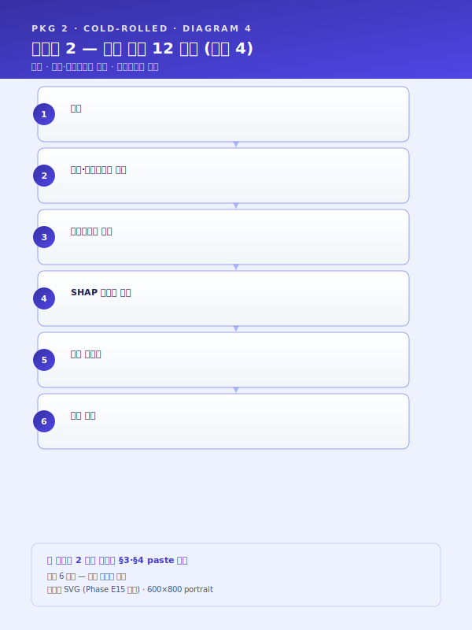
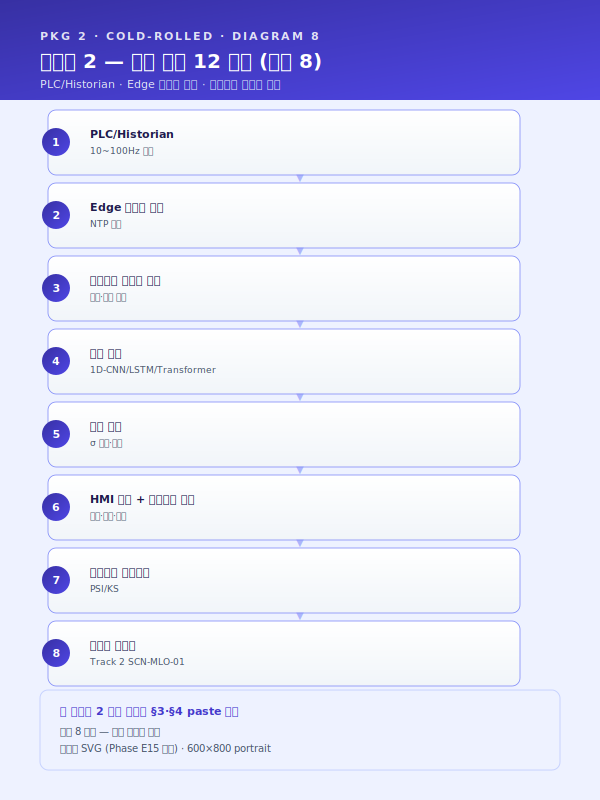
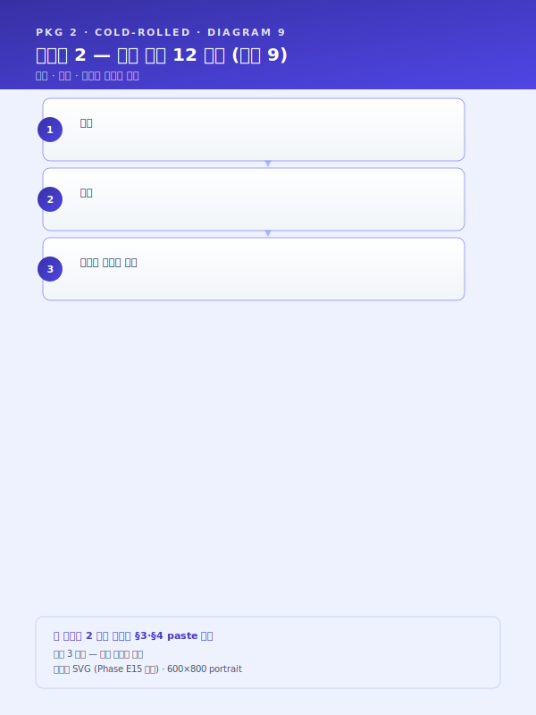
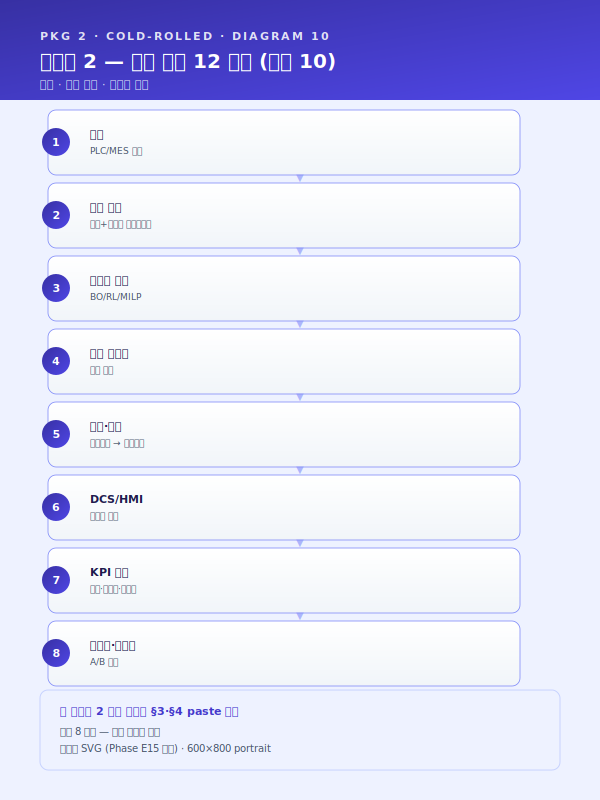
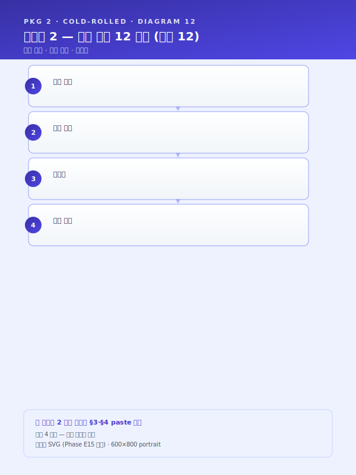

# 사업계획서 — [고객사] 제조AI특화 스마트공장 (파일럿)

> **본 문서 성격** — Phase E 통합 파일럿. 가상의 중견 스테인리스 냉연사 `[고객사]` 를 가정하여 워크스페이스 자산을 단일 사업계획서로 조립한 통합 테스트 결과물.
> **고객사명·수치·기간** 은 모두 플레이스홀더 (`[고객사]`, `[수치]`, `[기간]` 등). 실 고객사 도입 시 본 문서를 복사하여 플레이스홀더 치환.
> **인용 표기** — 본 문서의 본문 다수는 워크스페이스 기존 자산을 인용한 것으로, 인용 출처는 각 섹션 말미에 `> [출처: 파일명 §섹션]` 형태로 명시한다.
> **플레이스홀더 범례** — `[고객사]` 가상 중견 스테인리스 냉연사, `[공정]` 대상 공정명, `[수치]` 수치, `[기간]` 기간, `[%]` 비율, `[연도]` 연도, `[사업장]` 사업장 위치(부산·경남 내).

---

## 0. 과제 요약 (1 페이지)

| 항목 | 내용 |
|---|---|
| 과제명 | [고객사] 냉간압연 패스 스케줄·두께 조기경보 및 압연기 예지보전 통합 AI 플랫폼 구축 |
| 사업 분류 | 제조AI특화 스마트공장 (지원사업_공고_스냅샷_2026.md §1) |
| 사업기간 | [기간] (9~18 개월 표준) |
| 총 사업비 | [수치] 억 원 (정부지원 [%] / 자부담 [%]) |
| 주관기관 | (확인 필요 — 중기부 산하) |
| 도입기업 | [고객사] (가상의 중견 스테인리스 냉연사, 부산·경남 [사업장]) |
| 대상 공정 | 1ZHM·2ZHM·정밀압연(냉간압연) + APL(연속소둔)·BAF(벨소둔) + 산세·후공정 |
| 핵심 시나리오 | SCN-STL-04 패스 스케줄 표준화·최적화 (주력) · SCN-STL-05 두께 예측·조기경보 (주력) · SCN-STL-06 소둔 적재·온도 프로파일 최적화 (확장) · SCN-STL-09 압연기 예지보전 (확장) · SCN-MLO-03 현장 피드백 루프 (Track 2 핵심) · SCN-LLM-02 설비 장애 대응 RAG (Track 3 핵심) |
| 데이터 성숙도 | ICS·MES Lv.2 (압연 실적·소둔 데이터 기수집) → 본 사업 후 Lv.2~Lv.3 |
| MLOps 성숙도 | Lv.0 (수작업) → Lv.2 (자동화 + 일부 지속학습) |
| 핵심 기대효과 | 신규 사양 셋업 [%] 단축 · 시작품 스크랩률 [%] 감소 · 출측 두께 σ [%] 축소 · 압연 라인 돌발 정지 [%] 감소 · 정비 MTTR [%] 단축 · 신입 단독 작업 가능 시점 [%] 단축 |

본 사업은 [고객사] 가 다년간 축적해 온 ICS·MES 실적을 기반으로 **냉간압연 패스 스케줄 추천 → 두께 실시간 예측·조기경보 → 압연기 예지보전 → 장애 대응 지식 RAG → 현장 피드백 루프** 의 5 개 시나리오를 단일 AI 플랫폼 위에서 통합 운영하는 것을 목표로 한다. 본 사업은 Track 1(제조 AI 본문)·Track 2(MLOps)·Track 3(LLM·RAG) 의 3 개 트랙을 패키지 형태로 결합하여, 단일 시나리오 합산 대비 공통 데이터·MLOps·UX 인프라를 공유함으로써 도입 비용 회수 효율을 비선형적으로 향상시키는 점에 차별성이 있다.

> [출처: 지원사업_공고_스냅샷_2026.md §1, 시나리오_카탈로그.md 부록 B 패키지 2]

---

## 1. 사업 개요 및 추진 배경

### 1.1 과제명·사업기간·추진 체계

본 사업은 중소벤처기업부 산하 **제조AI특화 스마트공장** 지원사업의 일환으로, 단일 공장 단위의 AI 공정 고도화를 목적으로 한다. 사업기간은 9 개월 전후의 표준 기간을 기준으로 하되 시나리오 결합 패키지 특성상 [기간] 까지 확장 가능하며, 우선 시나리오 군은 SCN-STL-04·05·06·09 와 MLOps·RAG 공통 시나리오(SCN-MLO-03·SCN-LLM-02) 로 구성된다. 추진 체계는 (i) 도입기업 [고객사] 가 수요기업이자 운영 주체로서 ICS·MES 데이터·현장 인력·운영 KPI 를 제공하며, (ii) 주관기관·공동수행기관이 AI 엔진 개발·MLOps 인프라·RAG 지식베이스를 구축하고, (iii) 안전·규제 자문·검증을 외부 자문기관과 분담하는 삼각 구조로 설계된다.

| 구분 | 역할 |
|---|---|
| 주관기관 | (확인 필요) — AI 엔진·MLOps·RAG 인프라 구축 총괄 |
| 도입기업 [고객사] | 데이터 제공·현장 운영·KPI 측정·검증 |
| 공동수행기관 | (확인 필요) — 도메인 자문(냉간압연·소둔)·HITL 검수 인력 |
| 외부 자문 | 안전·규제(중대재해법·CBAM·ISO/IEC 42001)·인증 자문 |

> [출처: 지원사업_공고_스냅샷_2026.md §1 제조AI특화 스마트공장; track1_공통본문_목차.md §1.1]

### 1.2 제조 AI 도입 필요성 (거시 환경)

글로벌 제조업은 저성장·공급과잉·인건비 상승·숙련인력 고령화의 4 중 압력에 직면하고 있으며, 선진국 제조기업은 IoT·CPS·AI 를 결합한 자율 네트워크 제조 체제로 빠르게 전환하고 있다. 국내 제조업은 디지털 전환(DX) 4 단계 모델(디지털화 → 공급사슬 통합 → 플랫폼화 → 신사업) 중 다수 기업이 1~2 단계에 머물러 있으며, 특히 부산·경남 철강·금속·고무·정밀가공 클러스터의 중견 이하 사업자는 ICS·MES 인프라는 보유하나 그 데이터를 AI 학습·실시간 의사결정의 원재료로 활용하는 단계까지 진입하지 못한 사례가 다수이다. 정부의 스마트공장·대중소상생·디지털 경남·전사적 DX 촉진·클라우드 종합솔루션 등 다층적 지원사업이 제조 AI 의 도입 가속을 유도하고 있으며, 본 사업은 이러한 정책 흐름과 정합한다.

이러한 거시 흐름 위에 **2022년 1월 시행된 중대재해처벌법** 은 사업장에서 사망·중상해 등 중대산업재해가 발생한 경우 사업주와 경영책임자에게 직접적인 형사책임을 부과할 수 있도록 규정하고 있으며, 2024년 1월 5인 이상 사업장으로의 적용 범위 확대와 관련 판례 누적을 거치며 제조 현장의 안전보건 체계 수준을 사실상 **경영 최상위 리스크** 로 끌어올렸다. 아울러 산업안전보건법 전부 개정, 화학물질관리법(화관법)·화학물질의 등록 및 평가 등에 관한 법률(화평법) 의 지속적 강화, 한국산업안전보건공단(KOSHA) 안전보건경영시스템 등급 공시 확대 등으로 인해, 제조기업의 안전 관리 수준은 더 이상 형식적 점검 서류로 입증될 수 없으며 **데이터·로그 기반 상시 증빙 체계** 로의 전환이 불가피하다. 본 사업은 이러한 규제 환경에서 생산성·품질뿐 아니라 안전·준법을 동시에 관통하는 제조 AI 체계를 구축함으로써, 규제 대응 비용을 구조적으로 낮추는 것을 부수적 목적으로 한다. (단, 본 사업의 1차 목적은 냉간압연·소둔·예지보전 시나리오의 정량 성과 확보이며, 안전·규제 효과는 부수적 정성 효과로 위치시킨다.)

> [출처: track1_공통본문_목차.md §1.2; 모듈_중대재해_안전.md BLK-SAF-A; 지원사업_공고_스냅샷_2026.md]

### 1.3 철강 산업의 디지털 전환 당위성 (스테인리스 냉연 특화)

철강산업은 글로벌 수요 정체와 다품종 소량 생산 체제 확대 속에서 "감과 수작업" 에 의존하는 기존 운영 방식의 한계를 노출하고 있다. 압연·열처리·인발·필거밀 등 핵심 공정은 변수 10 종 이상이 동시에 최적화되어야 하는 고복잡 영역이며, 듀플렉스강·정밀 두께 공차 ±0.05 mm 수준의 고부가가치화 요구는 베테랑 숙련공의 경험만으로는 안정적으로 충족하기 어려운 수준에 도달했다.

특히 **스테인리스 냉간압연** 공정은 다음과 같은 도메인 특수성을 갖는다. 첫째, 동일 재질·동일 두께 조합이라도 패스 스케줄(감면율·텐션·속도) 의 미세 차이에 따라 출측 두께 균일도와 표면 품질이 크게 변동하며, 그 결정 기준의 상당 부분이 형식지화되어 있지 않다. 둘째, 1ZHM·2ZHM·정밀압연 등 다중 스탠드를 거치는 연속 공정 특성상 중간 스탠드의 미세 이상은 출측 게이지가 측정될 때까지 발견되지 못하며, 발견 시점에는 이미 수십~수백 m 의 이탈 코일이 발생한다. 셋째, 후공정인 APL(연속소둔)·BAF(벨소둔)·산세는 압연 결과의 기계적 성질·표면 상태에 직결되므로 압연 단계의 미세 편차가 후공정의 품질 산포로 전이되는 양상이 빈번하다. 넷째, 압연기 롤·베어링·기어박스·구동부의 마모는 시간베이스 예방보전(TBM) 으로는 과잉 정비와 돌발 고장의 양극단 비효율을 동시에 발생시키며, 라인 정지 시 시간당 [수치] 만 원 수준의 손실이 누적된다.

이러한 도메인 특수성은 [고객사] 와 같은 중견 스테인리스 냉연사가 다음 단계로 도약하기 위한 **AI 기반 공정 지능화** 를 사실상 필수적 과제로 만들고 있다. ICS·MES Lv.2 단계에 도달한 사업장에서는 데이터 기반 추천·예측·이상탐지 모델이 빠른 시일 내에 가시적 성과를 도출할 수 있으며, 이는 곧 후속 단계의 자율운영(Lv.3) 으로 이행하기 위한 발판이 된다.

> [출처: track1_공통본문_목차.md §1.3 철강 블록; 시나리오_카탈로그.md 부록 B 패키지 2 추천 근거]

### 1.4 [고객사] 현황 요약 및 핵심 문제의식

[고객사] 는 부산·경남권 [사업장] 에 본사·공장을 두고 스테인리스 냉연 코일·정밀 박판을 생산하는 중견 제조기업이다. 1980 년대 초 산세·열연 후공정 단압 라인으로 출발하여 1990 년대 정밀압연·연속소둔 라인을 증설하였으며, 2000 년대 BAF(벨소둔)·정밀 슬리터 라인 추가 확장을 거쳐 현재 1ZHM·2ZHM·정밀압연·APL·BAF·산세·후공정의 통합 라인을 운영하고 있다. 주력 제품은 SUS304·SUS316L 계열 0.1~2.0 mm 박판 코일과 자동차·전자·주방용기·건축자재용 정밀 압연 제품이며, 국내 가공·유통 거점뿐 아니라 일본·동남아·EU 향 수출 비중도 일정 수준 유지하고 있다.

스마트공장 수준은 **중간 1~중간 2 (ICS·MES Lv.2)** 에 해당하며, 압연 실적·소둔 온도 프로파일·QMS 검사결과 등 정형 데이터는 다년간 축적되어 왔다. 그러나 누적된 데이터의 활용은 사후 분석 보고서 작성에 한정되어, 신규 주문 투입 시점에 과거 사례를 검색·참조하는 도구나 실시간 추론으로 작업자 의사결정을 보조하는 체계는 부재한 상태이다. 또한 비정형 자산(공정설계 Excel·밀시트 PDF·CMMS 자유 텍스트 장애 이력·SOP HWP·KOSHA 가이드 등) 은 부서별·연도별로 분산 보관되어 있어 검색·재활용이 사실상 불가능하다.

[고객사] 가 직면한 4 가지 구조적 문제는 다음과 같이 요약된다.

- **암묵지 의존** — 패스 스케줄·소둔 적재·정비 판단의 핵심 의사결정이 [수치] 명 내외 베테랑 작업자 머릿속에 누적되어 있으며, 향후 [기간] 내 일부 베테랑의 정년·이직이 가시화되어 있다.
- **중간 스탠드 가시성 부재** — 출측 게이지미터 1 개소만으로 중간 스탠드 이상을 감지하지 못해, 이탈 발견 시 이미 수백 m 단위의 손실 코일이 누적된다.
- **TBM 기반 정비의 비효율** — 압연기 롤·베어링·기어박스 정비가 시간 주기 기반으로 운영되어 과잉 정비와 돌발 고장이 공존하며, 베테랑 정비원의 청각·촉각 진단 노하우는 형식지화되지 못한 채 개인 역량으로만 보존되어 있다.
- **장애·정비 지식 단절** — CMMS 의 자유 텍스트 이력은 검색·집계가 불가능한 품질로 기록되어, 동일 장애가 반복 발생해도 과거 대응 이력 회수에 [기간] 이상이 소요된다.

본 사업이 해결하고자 하는 핵심 과제는 한 줄로 다음과 같이 요약된다.

> **[고객사] 의 다년간 축적된 ICS·MES 실적 데이터와 비정형 정비·SOP 자산을 단일 AI 플랫폼 위에서 통합 활용하여, 냉간압연·소둔의 정량 품질과 압연 라인의 가용도를 동시에 끌어올리고, 베테랑 암묵지를 형식지화하여 차세대 운영 자산으로 전환한다.**

> [본 섹션은 새로 작성됨 — 가상 [고객사] 프로필; 시나리오_카탈로그.md 부록 B 패키지 2 의 "추천 근거" 와 정합]

---

## 2. 기업 현황 및 대상 공정 분석

### 2.1 [고객사] 개요 및 재무 현황

| 항목 | 내용 |
|---|---|
| 기업명 | [고객사] |
| 대표자 | [대표자명] |
| 소재지 | 부산·경남 [사업장] |
| 업종코드 | (확인 필요 — 1차 금속 제조업 / 코일·박판) |
| 주생산품 | 스테인리스 냉연 코일·정밀 압연 박판 (SUS304·SUS316L 계열, 두께 0.1~2.0 mm) |
| 종업원수 | [수치] 명 (생산직 [수치] 명 / 사무·기술직 [수치] 명) |
| 최근 3 개년 매출 | [수치] 억 원 / [수치] 억 원 / [수치] 억 원 |
| 최근 3 개년 영업이익 | [수치] 억 원 / [수치] 억 원 / [수치] 억 원 |
| 최근 3 개년 수출액 | [수치] 억 원 ([%] 수준) |
| 부채비율 | [%] |
| 주요 인증 | ISO 9001 · ISO 14001 · IATF 16949 · (확인 필요) |
| 스마트공장 지원 이력 | [연도] 기초 사업, [연도] 중간1 고도화 사업 (확인 필요) |
| 본사 / 공장 전경 | (사진 첨부) |

[고객사] 는 부산·경남 제조 클러스터 내 스테인리스 냉연 분야의 중견 사업자로 자리매김해 왔으며, 자동차·전자·건축·주방기기 등 다양한 전방산업에 박판 제품을 공급하고 있다. 최근 3 개년 매출은 원자재 가격 변동과 글로벌 수요 변동에 영향을 받았으나 영업이익률은 일정 수준 유지하고 있으며, 일본·동남아·EU 향 수출 비중도 [%] 수준으로 안정적이다. 본 사업의 도입 시점에 부채비율은 [%] 로 사업 수행에 필요한 자부담 여력을 확보하고 있다.

> [본 섹션은 새로 작성됨 — 가상 [고객사] 프로필. 모든 수치 플레이스홀더; 골격은 track1_공통본문_목차.md §2.1 서식]

### 2.2 대상 공정의 제조 프로세스 및 특성 (냉간압연·소둔)

본 사업의 대상 공정은 [고객사] 의 핵심 제조 라인인 **냉간압연 + 연속·벨소둔 + 산세** 통합 공정이다. 전체 제조 플로우는 원소재 입고 → 입고 검사(밀시트 검증·UT/ECT) → 산세 → 1차 냉간압연(1ZHM) → 중간 소둔(BAF 또는 APL) → 2차 냉간압연(2ZHM) → 정밀압연(필요 시) → 최종 소둔(APL) → 정정·슬리터 → 후공정 검사 → 출하 의 직렬 흐름을 기본으로 하되, 두께·재질·고객 사양에 따라 다중 패스 또는 일부 공정 생략 분기가 발생한다.

| 공정 단계 | 핵심 변수 | 출력 품질 변수 | 측정·기록 도구 |
|---|---|---|---|
| 산세 | 산 농도·온도·통과 속도·온도 | 표면 청정도·산화 스케일 제거율 | 자동 분석기·MES |
| 1ZHM 1차 압연 | 패스 수·각 패스 감면율·롤 포스·텐션·속도·압연유 온도 | 두께 균일도·평탄도·표면 결함 | ICS PLC 태그·게이지미터·라인스캔 |
| BAF 벨소둔 | 적재 패턴·승온 속도·유지 온도·시간·분위기 가스 | 기계적 성질(인장·항복·연신)·결정립 크기 | 다점 열전대·사후 검사 |
| APL 연속소둔 | 라인 속도·노 온도 프로파일·소화액 농도·인장력 | 기계적 성질 균일성·표면 산화 | 노 내 열전대·QMS |
| 2ZHM 2차 압연 | 1ZHM 동일 + 중간 소둔 결과 | 동일 | 동일 |
| 정밀압연 | 패스 미세 조정·텐션 정밀제어 | 정밀 두께 공차 ±0.05 mm 이내 | 고분해능 게이지미터 |

본 공정은 [고객사] 가 보유한 **국제 인증 IATF 16949** (자동차 부품 공급망 요구) · **ISO 9001 / 14001** 의 적용 범위 안에 있으며, 일부 자동차·전자 향 공급에는 고객 SQA(Supplier Quality Audit) 의 변경관리·추적성 요구가 추가된다. 본 사업이 구축하는 AI 엔진은 이들 인증 체계의 변경관리 절차에 정합하도록 모델 카드·리니지·승인 기록을 자동 보존하도록 설계된다.

핵심 변수가 단일이 아닌 다변수 상호작용 구조라는 점이 본 공정의 본질적 복잡성이다. 예컨대 1ZHM 의 패스 감면율을 0.5 %p 증가시키면 출측 두께 표준편차는 일시적으로 안정화되나 롤 토크·텐션 부하가 상승하여 다음 패스의 운전 여유가 감소하며, 이 미세한 변화가 BAF 적재 단계의 코일 변형·결정립 분포 편차로 전이되는 식이다. 단일 변수 최적화로는 설명 불가능한 이러한 상호작용 구조가 본 사업이 다중 시나리오 결합 패키지로 구성된 근본 이유이다.

> [본 섹션은 새로 작성됨 — 냉간압연·소둔 도메인 일반 설명. 골격은 track1_공통본문_목차.md §2.2; 변수·인증 항목은 일반 도메인 지식]

### 2.3 기존 ICS·MES 구축 이력

본 사업은 [고객사] 가 다년간 단계적으로 구축해 온 ICS·MES·QMS·FEMS 인프라 위에 **AI 지능화 레이어를 추가** 하는 성격이며, 그 자체로 처음부터 시작하는 사업이 아니라는 점이 본 사업의 수행 가능성을 뒷받침하는 핵심 근거이다. 연도별 주요 구축 마일스톤은 다음과 같다.

| 연도 | 구축 시스템 | 비고 |
|---|---|---|
| [연도] | ERP 1차 도입 (수주·재무) | 영업·재무 정합 시점 |
| [연도] | MES 도입 — 작업지시·생산실적 | 1ZHM·2ZHM 라인 생산실적 수집 |
| [연도] | ICS 1단계 — 압연 라인 PLC 태그 통합 | 롤 포스·텐션·속도·게이지 시계열 수집 |
| [연도] | QMS 도입 — 입고검사·중간검사·출하검사 | UT/ECT 신호·검사결과 적재 |
| [연도] | FEMS 도입 — 전력·가스·증기 15 분 단위 | (확인 필요) |
| [연도] | 스마트공장 중간1 사업 — APL/BAF 다점 열전대·이력 통합 | 소둔 데이터 통합 시점 |
| [연도] | ICS 2단계 — 1ZHM·2ZHM·정밀압연 1초 주기 동기 수집 | 본 사업 활용 데이터 기반 확립 |
| [연도] | CMMS 도입 — 정비·고장 이력 자유 텍스트 누적 | 본 사업 RAG 입력 자산 |

현재 [고객사] 의 스마트공장 수준은 정부 스마트공장 수준진단 기준으로 **중간 1~중간 2** 에 해당하며, ICS·MES 데이터의 누적은 **AI 학습에 충분한 Lv.2 단계** 에 도달해 있다. 본 사업은 이를 **Lv.2 → Lv.2+ / 부분 Lv.3** 으로 끌어올리는 단계적 고도화로 위치시킨다. 본 사업 완료 시점의 목표 수준은 다음과 같다.

- AI 추론이 ICS·MES 화면에 통합되어 작업자 의사결정을 실시간 보조 (Lv.2 완성)
- 일부 시나리오(STL-04 패스 스케줄·STL-09 예지보전) 는 자동 트리거 기반 운영 (Lv.3 진입 준비)
- 전 시나리오의 운영 성능이 모니터링·드리프트 감시·자동 재학습 루프에 들어가 있음 (MLOps Lv.2)

> [본 섹션은 새로 작성됨 — 가상 [고객사] 마일스톤; 골격은 track1_공통본문_목차.md §2.3]

### 2.4 제조 데이터 보유 현황

본 사업의 AI 학습·추론을 뒷받침하는 데이터 자산은 시계열·정형 DB·이미지·비정형 문서의 4 개 카테고리로 분류된다. 각 카테고리의 보유 규모·수집 주기·구축 위치·AI 도입 대상 여부는 다음과 같다.

| 데이터 카테고리 | 세부 구분 | 수집 주기 | 누적 규모 | 구축 위치 | 본 사업 활용 시나리오 |
|---|---|---|---|---|---|
| 시계열 센서 데이터 | 1ZHM·2ZHM·정밀압연 PLC (롤 포스·텐션·속도·게이지) | 1 초 | [수치] GB / 일, [기간] 누적 | ICS Historian | STL-04·STL-05 |
| 시계열 센서 데이터 | APL/BAF 노 내 다점 열전대·라인 속도·인장력 | 10 초 | [수치] GB / 일 | ICS Historian | STL-06 |
| 시계열 센서 데이터 | 압연기 구동부 진동·전류·유압 (확장 IoT 증설 예정) | 100~1000 Hz | [수치] GB / 일 (구축 후) | TSDB (신규) | STL-09 |
| 정형 DB | MES 작업지시·생산실적·로트·작업조 | 이벤트 | [수치] 만 건 | RDB (MS-SQL) | STL-04·05·06·09 |
| 정형 DB | QMS 입고·중간·출하 검사 결과 (UT/ECT 포함) | 이벤트 | [수치] 만 건 | RDB | STL-04·05·09 |
| 정형 DB | ERP 수주·출하·재고 | 이벤트 | [수치] 만 건 | RDB | STL-04 (사양 매칭) |
| 정형 DB | FEMS 전력·가스·증기 (15 분) | 15 분 | [수치] GB | TSDB | (참조용) |
| 이미지 | 표면 라인스캔 (출측) | 코일별 | [수치] TB | Object Storage | (확장 예정) |
| 비정형 문서 | 공급사별 밀시트 PDF | 입고 시 | [수치] 만 건, 공급사 [수치] 종 양식 | 파일 서버 | (RAG 확장 후보) |
| 비정형 문서 | CMMS 정비·고장 이력 자유 텍스트 | 이벤트 | [수치] 만 건, [기간] 누적 | RDB (텍스트 필드) | LLM-02 (직접 활용) |
| 비정형 문서 | SOP·작업표준서·공정설계 Excel·교육자료 | 비정기 | [수치] 건, HWP/PDF/Excel 혼재 | 파일 서버·공유 폴더 | LLM-02 (보조 활용) |
| 비정형 문서 | 설비 매뉴얼·도면 (DWG/PDF) | 비정기 | [수치] 건 | 파일 서버 | LLM-02 (보조) |

데이터 카테고리별 품질 상태는 다음과 같이 진단된다. 시계열 센서 데이터는 ICS Historian 위에 다년간 축적되어 있어 정량 모델 학습에 즉시 투입 가능한 수준이며, 정형 DB(MES·QMS·ERP) 는 로트·작업지시 단위 키 정합성이 확보되어 있어 시계열-정형 결합 분석이 가능하다. 이미지·비정형 문서는 본 사업의 1 차 범위에서는 보조 자원으로 위치시키되, 비정형 문서 중 **CMMS 자유 텍스트 장애 이력** 은 SCN-LLM-02 장애 RAG 의 직접 입력 자산으로 활용된다.

> [본 섹션은 새로 작성됨 — 데이터 매트릭스; 골격은 track1_공통본문_목차.md §2.4 표 골격 + Track 3 §2.2 비정형 매트릭스]

---

## 3. 현황 및 문제점 (AS-IS)

### 3.1 공정 운영의 인적 의존성 및 암묵지 리스크

[고객사] 의 [공정] 은 다년간 누적된 현장 경험을 바탕으로 운영되어 왔으며, 그 결과 핵심 공정설계·운전 판단의 상당 부분이 [수치] 명 내외의 베테랑 숙련공이 보유한 암묵지에 의존하는 구조가 형성되어 있다. 신규 주문 접수 시 모관 선정·패스 횟수·열처리 조건·압하율 등 [수치] 종 이상의 변수가 동시에 결정되어야 하나, 그 의사결정의 근거는 문서화된 매뉴얼이 아닌 개별 작업자의 머릿속 경험치이며, 일부 핵심 공정은 [기간] 이상의 현장 경력자가 부재할 경우 동일 품질의 결과를 재현하기 어려운 것이 현실이다. 이러한 운영 구조는 평시에는 안정적으로 보이지만, 정년 퇴직·이직·장기 부재 등 단 한 명의 인적 변동만으로도 공정 역량이 즉각 마비될 수 있다는 점에서 구조적 리스크를 내포한다.

또한 동일 사양의 주문이라 하더라도 작업자별 숙련도 차이로 인해 설계 편차가 ±[수치]% 수준으로 발생하고 있으며, 그 결과 후속 공정의 작업 부하·품질 산포·재작업률에까지 연쇄적인 영향을 미치고 있다. 작업자 간 판단 기준의 차이는 단순한 개인차의 문제가 아니라, 공정 노하우가 수식화·표준화되지 않은 상태에서 Excel 시트와 수기 메모를 통해 파편적으로 관리되는 데에 그 근본 원인이 있다. 이로 인해 동일 작업자라도 시점에 따라 판단이 흔들리며, 신입·중간 숙련자에 대한 체계적 교육 자산이 부재한 상태에서 도제식 전수에만 의존하는 한계가 누적되어 왔다.

요컨대 [고객사] 의 현행 운영 구조는 ① 1~[수치] 명의 베테랑 의존, ② 핵심 인력 이탈 시 즉각적 공정 마비 가능성, ③ 작업자 간 ±[수치]% 수준의 설계 편차, ④ 수식화된 매뉴얼 부재로 인한 재현성 결여라는 네 가지 구조적 리스크를 동시에 안고 있으며, 이는 [공정] 의 고도화·다품종 소량화 추세와 결합되어 시간이 지날수록 더욱 심화되는 양상을 보인다. 본 사업이 추구하는 AI 기반 공정설계·운영 지능화(SCN-STL-04 냉간압연 패스 스케줄 표준화, SCN-STL-09 압연기 예지보전 등 참조) 는 이러한 암묵지를 형식지로 전환하여 조직 자산화함으로써, 인적 의존성에 기인한 구조적 리스크를 근본적으로 해소하는 데 그 일차적 목적이 있다. **[고객사] 특화 — 본 사업장에서는 1ZHM 패스 스케줄·BAF 적재 결정·압연기 진동 진단의 3 개 영역이 베테랑 의존이 가장 큰 영역으로 식별되어 우선 형식지화 대상으로 선정되었다.**

> [출처: track1_본문_공통Top5.md §3.1 (BLK-T1-3.1) — 본문 그대로 인용 + [고객사] 특화 1 문장 추가]

### 3.2 데이터 단절 및 비정형 관리 한계

[고객사] 는 원재료 입고부터 최종 출하에 이르는 전 공정에서 상당량의 운영 데이터를 생성하고 있으나, 그 데이터의 상당 부분이 비정형·이미지·수기 양식으로 보관되어 있어 학습·분석·실시간 의사결정에 즉각적으로 활용하기 어려운 상태이다. 특히 입고 원재료의 화학성분·기계적 성질을 기재한 밀시트·성적서는 공급사별로 [수치] 종 이상의 상이한 양식으로 PDF 또는 스캔 이미지 형태로만 보관되며, 그 결과 MES·QMS 와 같은 정형 시스템의 입고대장과 자동 연동되지 못하고 실무자의 수기 입력에 의존하는 운영이 고착되어 있다. 수기 입력은 건당 [수치] 분 내외의 처리 시간을 요구하면서도 [수치]% 수준의 휴먼 에러율을 동반하며, 이는 누적적으로 데이터 신뢰도를 저하시키는 주요 원인으로 작용하고 있다.

데이터 단절의 문제는 단순한 입력 효율의 문제에 그치지 않는다. 공급사·공정·작업자별로 양식이 제각각이라는 사실은 곧 데이터 표준화의 원천이 차단되어 있음을 의미하며, 이로 인해 원재료 물성치와 가공 결과 간 상관관계 분석, 불량 발생 시 Heat No.·LOT No. 기반 역추적, 공정 파라미터와 최종 품질 간 관계 모델링이 모두 사실상 불가능한 상태에 머물러 있다. 동일한 문제는 공정설계서·작업표준서·교대 인수인계 일지·검사 기록지 등 현장에서 일상적으로 생성되는 문서 자산 전반에 걸쳐 나타나고 있으며, 이들 문서는 폴더·파일 단위로 산재되어 있어 검색·재활용에도 [기간] 단위의 시간이 소요되고 있다.

결과적으로 [고객사] 는 데이터를 "보유" 하고 있음에도 불구하고 그 데이터가 AI 학습과 실시간 의사결정의 원재료로 기능하지 못하는 구조적 단절 상태에 있으며, 이러한 단절은 ① 비정형·이미지 자산의 디지털화 부재, ② 양식의 비표준성, ③ MES·QMS 와의 자동 연동 부재, ④ 휴먼 에러 누적이라는 네 축으로 구조화된다. 본 사업은 OCR·문서이해 LLM 기반 밀시트 디지털화(SCN-STL-08 참조), 비정형 문서 지식자산화(SCN-LLM-02 장애 RAG 등) 와 결합된 데이터 정형화 체계를 구축함으로써 이 단절을 해소하고, 후속 4 장의 AI 도입 전략이 실효적으로 작동할 수 있는 데이터 기반을 마련하고자 한다.

> [출처: track1_본문_공통Top5.md §3.2 (BLK-T1-3.2) — 본문 그대로 인용]

### 3.3 품질 편차 및 불량 원인 추적 체계 부재

본 사업의 대상 공정인 냉간압연·소둔의 품질 편차는 단순한 작업자 숙련도 차이를 넘어, **공정 파라미터 - 원소재 물성 - 환경 조건** 의 다변수 상호작용에서 비롯되며, 그 인과를 사후적으로 추적하기 위한 데이터 기반이 부재한 상태이다. 완제품에서 두께 이탈·표면 결함·기계적 성질 미달 등 불량이 발생하는 경우, 이는 통상 출측 게이지미터 또는 후공정 검사에서 비로소 발견되며, 발견 시점에서는 이미 해당 코일의 입고 원소재 물성치(밀시트), 1ZHM·2ZHM 의 패스별 운전 조건, BAF/APL 의 적재·온도 프로파일 등 누적 데이터의 상관관계를 인과 추적하는 데에 [기간] 단위의 시간이 소요되거나, 종이 보관 한계로 인해 규명 자체가 좌절되는 경우가 발생한다.

특히 냉간압연 영역에서는 출측 두께 표준편차 [수치] σ 수준의 편차가 발생하더라도 그 원인이 1ZHM 의 특정 패스 텐션 편차였는지, 입고 원소재의 화학성분 편차였는지, 작업조 교대 시점의 미세 셋업 차이였는지를 데이터 단일 출처에서 즉시 식별할 수 있는 체계가 부재하다. 표면 결함·롤 마크·핀홀 등 비전 영역의 불량은 라인스캔 이미지로 적재되고 있으나, 이미지와 ICS 시계열·MES 로트 정보 간 자동 연동이 미비하여 사후 회귀 분석에 활용되지 못하고 있다. 그 결과 동일 유형의 불량이 분기·반기 단위로 반복 발생하면서도 그 패턴을 정량적으로 추적·예방하지 못하는 구조적 한계가 누적되어 왔다. 이는 곧 재작업률 [수치]%, 클레임 응대 비용, 그리고 IATF 16949 변경관리 감사 시 추적성 입증의 부담으로 직결된다.

> [출처: track1_공통본문_목차.md §3.3 카드 요지 + 냉연 두께·표면 결함 도메인 맥락 새로 작성]

### 3.4 실시간 운영·의사결정 체계의 공백

[고객사] 사업장의 현행 일별 운영 보고는 종이 일보·교대 인계록·익일 아침 회의 구조에 의존하고 있어, 경영진 또는 생산관리 부서가 실시간으로 라인 상태·KPI·이상 징후를 파악할 수 있는 체계가 부재하다. ICS Historian 에는 다양한 시계열 데이터가 적재되고 있으나 이는 사후 분석용 데이터 저장소의 성격에 머물러 있고, 작업자 HMI 화면에서 즉시 활용할 수 있는 실시간 인사이트 형태로는 가공되지 못하고 있다. 그 결과 영업-생산-품질 간 정보 비대칭이 누적되어, 고객의 납기 변경·긴급 추가 주문 대응 시 의사결정이 지연되거나, 압연기·소둔로의 미세 이상 징후가 작업자 청각·촉각 진단의 결과로만 인지되어 정량적 추적이 불가능하다. 설비 이상의 사전 감지 영역도 마찬가지로 시간베이스 예방보전(TBM) 의 한계 안에서 운영되어 사후 대응에 그치는 비중이 크다.

또한 현행 안전 관리 체계는 정기 점검표·순회 점검일지·TBM(Tool Box Meeting) 기록 등 주로 **사후 서류 중심** 으로 운영되고 있어, 보호구 미착용·위험구역 무단 진입·근로자 건강 이상·유해물질 취급 오류와 같은 **사전 징후가 발생 시점에 실시간으로 감지·기록되지 못하는 구조적 공백** 을 안고 있다. 재해가 실제로 발생한 이후에야 CCTV 영상과 근로자 진술, 종이 점검일지를 역순으로 짜맞춰 원인을 재구성하는 방식으로는, 중대재해처벌법 체계가 요구하는 "안전보건 확보 의무를 상시 이행하였다" 는 증거를 제출하기 어렵다. (본 사업의 1 차 범위는 압연·소둔·예지보전이며, 안전 AI 는 후속 단계의 확장 대상으로 위치시킨다. 단, 본 사업으로 구축되는 통합 데이터·MLOps 기반은 향후 SCN-SAF-01 안전 AI 시나리오의 인프라 자산으로 그대로 재활용 가능하다.)

> [출처: track1_공통본문_목차.md §3.4 카드 + 모듈_중대재해_안전.md BLK-SAF-C 첫 문단 인용]

### 3.5 종합 위기 직면 (구조적 문제 요약)

3 장에서 제시한 4 가지 구조적 공백을 본 사업의 4 장 TO-BE 로 연결하기 위한 교량으로 다음 3 단 요약을 제시한다.

| 직면 상황 | 핵심 구조적 문제 | 전환 시급성 |
|---|---|---|
| 냉간압연·소둔의 핵심 의사결정이 [수치] 명 베테랑 암묵지에 의존, 향후 [기간] 내 이탈 가시화 | 형식지화·표준화 부재 → 신규 사양 셋업 시 시행착오 누적 | 베테랑 이탈 전 형식지 자산화 시급. 본 사업 골든타임 [기간] |
| 출측 게이지미터 1 개소만으로 중간 스탠드 가시성 부재 | 이탈 발견 시 이미 수백 m 단위 손실 누적 | 시계열 실시간 예측·조기경보 도입으로 손실 폭 축소 |
| 시간베이스 정비(TBM) 로 과잉 정비·돌발 고장 양극단 | 라인 정지 시 시간당 [수치] 만 원 손실 + 베테랑 정비 노하우 휘발 | 상태기반 정비(CBM) 로 전환하지 않으면 정비 인력 세대교체 시 진단 역량 자체 후퇴 |
| 비정형 자산(CMMS·SOP·도면) 검색·재활용 불가 | 동일 장애 반복 시 과거 이력 회수 [기간] 소요, 표준 인계 곤란 | 지식 RAG 도입으로 신입·교대 작업자 즉시 자문 가능 체계 구축 |

위 4 개 축은 서로 독립이 아닌 **동일한 구조적 원인 — 데이터 단절·암묵지 의존 — 의 표현 형식이 다른 결과** 이다. 따라서 본 사업은 4 장 이하에서 4 개 시나리오를 단일 데이터·MLOps·UX 플랫폼 위에 통합 구축하여, 동일 인프라가 4 개 문제를 동시에 해소하도록 설계된다.

> [출처: track1_공통본문_목차.md §3.5 카드 — 3 단 요약표 골격 + [고객사] 특화 4 행]

---

## 4. 목표 모습 (TO-BE) 및 제조 AI 도입 전략

### 4.1 TO-BE 개념도 및 핵심 전략

본 사업의 TO-BE 운영 모습은 [고객사] 의 기존 ICS·MES·QMS·CMMS 자산 위에 **AI 지능화 레이어** 를 추가하여, 작업자·정비원·생산관리·QA 가 동일한 데이터 진실원(Single Source of Truth) 위에서 의사결정을 수행하도록 통합하는 데에 본질이 있다. AS-IS 대비 핵심적으로 바뀌는 5 개 영역은 다음과 같다.

| 영역 | AS-IS | TO-BE |
|---|---|---|
| 패스 스케줄 결정 | 베테랑 작업자 경험 의존, 작업조별 ±[%] 편차 | 과거 성공 이력 기반 추천 + 작업자 승인 (HITL) |
| 두께 이탈 인지 | 출측 게이지미터 발견 → 수백 m 손실 후 인지 | 중간 스탠드 시계열 실시간 예측·0.5 σ 이탈 시 조기경보 |
| 압연기 정비 | 시간 주기 TBM, 청각·촉각 진단 | 진동·전류 기반 건전성 지수·RUL → CMMS 워크오더 자동 |
| 장애 대응 지식 | CMMS 자유 텍스트 검색 [기간] 소요 | 자연어 질의 → 유사 이력·처치 절차·부품 번호 [수치] 초 회신 |
| 운영 학습 루프 | 작업자 정정·승인 이력 유실 | 현장 피드백 UI → 라벨 DB → 주기 재학습 자동화 |

본 사업의 핵심 추진 전략은 **3-STEP Solution Architecture** 로 요약된다.

본 사업으로 [고객사] 가 도달할 수준은 정부 스마트공장 수준진단 기준 **중간 1~중간 2 → 중간 2 (부분 고도화)** 이며, MLOps 성숙도 기준으로는 **Lv.0 (수작업) → Lv.2 (CI/CD for ML + 일부 지속학습)** 로 정의된다.

> [출처: track1_공통본문_목차.md §4.1 카드 — Solution Architecture 3-STEP 골격 + [고객사] 특화 5 행 대조표]

### 4.2 AI 적용 공정 및 기능 분류

본 사업이 정부 서식의 "AI 적용 공정" · "AI 기능 분류" 항목에 매핑되는 범위는 다음과 같다.

| 7 대 공정 영역 | 본 사업 적용 여부 | 대응 시나리오 |
|---|---|---|
| 재무·인사 | × | — |
| 제품기획·설계 | △ (간접) | (RAG 의 SOP·공정설계 검색이 보조) |
| 구매 | × | — |
| 제조공정 | ○ | STL-04·05·06 (압연·소둔) |
| 물류 | × | — |
| 환경·에너지·안전 | △ (간접) | (FEMS·CBAM 은 후속 확장) |
| 사후서비스 | △ (간접) | (예지보전 → 가용도 향상) |

| 5 대 AI 기능 | 본 사업 적용 여부 | 대응 시나리오 |
|---|---|---|
| 인지 (비전·음성) | △ (제한적) | (라인스캔 이미지는 보조) |
| 예측 (회귀·시계열) | ○ | STL-05 두께 예측, STL-09 RUL |
| 자동화 (제어·최적화) | ○ | STL-04 추천, STL-06 적재 최적화 |
| 소통 (대화·검색) | ○ | LLM-02 장애 RAG |
| 생성 (생성·요약) | △ (제한적) | (정비 보고서 초안 — 후속) |

본 사업의 4 개 핵심 시나리오와 2 개 인프라 시나리오의 매트릭스는 다음과 같다.

| 시나리오 ID | 시나리오명 | 기반 엔진 (5.2 카드) | 트랙 매핑 | 도입 단계 |
|---|---|---|---|---|
| SCN-STL-04 | 냉간압연 패스 스케줄 표준화·최적화 | 5.2-a (+5.2-e 단계적) | Track 1 | 주력 (Phase 1) |
| SCN-STL-05 | 냉간압연 실시간 두께 예측·이탈 조기경보 | 5.2-b | Track 1 + Track 2 | 주력 (Phase 1) |
| SCN-STL-06 | 열처리(소둔) 로 내 적재·온도 프로파일 최적화 | 5.2-e | Track 1 | 확장 (Phase 2) |
| SCN-STL-09 | 설비 예지보전 (압연기 롤·베어링·구동부) | 5.2-d (+5.2-f 결합) | Track 1 + Track 2 + Track 3 | 확장 (Phase 2) |
| SCN-MLO-03 | 현장 피드백 루프 (전 시나리오 공통) | — (Track 2 인프라) | Track 2 | 인프라 (전 단계) |
| SCN-LLM-02 | 설비 장애 대응 지식 RAG | 5.2-f | Track 3 | 확장 (Phase 2) |

> [출처: track1_공통본문_목차.md §4.2; 시나리오_카탈로그.md 부록 B 패키지 2; track1_5.2_AI엔진_변형카드.md 매트릭스]

### 4.3 활용 데이터 유형 및 수집 설계

본 사업의 AI 학습·추론에 투입되는 데이터는 §2.4 에서 분류한 4 개 카테고리를 토대로 다음과 같이 수집·저장 설계된다.

| 데이터 유형 | 수집 인터페이스 | 수집 주기 | 저장소 | 활용 시나리오 |
|---|---|---|---|---|
| ICS 압연 PLC 시계열 (롤 포스·텐션·속도·게이지) | OPC-UA / PLC 직접 | 1 초 | TSDB (InfluxDB / TimescaleDB) | STL-04·05 |
| ICS 소둔 시계열 (다점 열전대·라인 속도·인장) | OPC-UA | 10 초 | TSDB | STL-06 |
| 압연기 구동부 진동·전류·유압 (신규 IoT) | Edge DAQ + MQTT | 100~1000 Hz | TSDB (고주파 버퍼) | STL-09 |
| MES·QMS·ERP 정형 DB | CDC / 배치 ETL | 이벤트·일 단위 | RDB Replica | STL-04·05·06·09 |
| 라인스캔 이미지 (출측 표면) | Frame Grabber → 게이트웨이 | 코일별 | Object Storage (MinIO / S3) | (확장) |
| CMMS 자유 텍스트 장애 이력 | DB 직접 + 텍스트 추출 | 이벤트 | Vector DB (Weaviate) | LLM-02 |
| SOP·매뉴얼·도면 | 파일 서버 커넥터 + OCR | 변경 시 | Vector DB | LLM-02 (보조) |

수집 설계의 핵심 원칙 3 가지는 다음과 같다. 첫째 **시간 동기** — 모든 시계열 데이터는 NTP 동기 기반의 타임스탬프를 보존하여 1ZHM·2ZHM·정밀압연·소둔 간 인과 추적이 가능하도록 한다. 둘째 **로트·코일 키** — 시계열 데이터와 MES·QMS 정형 데이터는 코일 ID·로트 ID·작업조 ID 의 공통 키로 결합되어 추적성을 확보한다. 셋째 **단일 진실원** — 동일한 측정량이 여러 시스템에 중복 적재되지 않도록 마스터 시스템을 명시한다(예: 두께 측정값의 마스터는 ICS, MES 는 참조).

> [출처: track1_공통본문_목차.md §4.3 카드 + [고객사] 데이터 매트릭스 매핑]

### 4.4 피쳐 엔지니어링 접근

본 사업의 AI 모델은 단순히 원시 센서값을 입력으로 하는 블랙박스 구조가 아니라, 도메인 지식과 데이터 과학적 기법을 결합한 체계적 피쳐 엔지니어링을 통해 입력 변수를 설계함으로써 모델 성능과 해석 가능성을 동시에 확보하고자 한다. 피쳐 설계의 첫 번째 축은 **도메인 지식 기반 피쳐** 로, [공정] 의 물리적 특성을 반영한 패스 이력 누적값, 슬라이딩 윈도우 기반 롤링 통계(평균·표준편차·최소·최대), 공정 구간 간 차분, 재질·레시피 메타 정보의 결합 등이 이에 해당한다. 이러한 피쳐는 현장 숙련자가 "이 변수의 변화가 품질에 영향을 준다" 고 판단하는 암묵지를 정량화한 것으로, 모델이 학습할 패턴의 의미를 사전에 부여하는 역할을 수행한다.

두 번째 축은 **자동 피쳐 생성** 으로, tsfresh·featuretools 등 시계열 피쳐 자동 추출 라이브러리를 활용하여 도메인 전문가가 미처 인지하지 못한 잠재 피쳐를 후보로 확보한다. 자동 생성 결과는 수백~수천 개 규모의 후보 피쳐 풀(pool) 을 형성하며, 이는 곧 세 번째 축인 **피쳐 선정** 단계의 입력이 된다. 피쳐 선정은 ① 상관관계 분석을 통한 다중공선성 제거, ② 상호정보량(Mutual Information) 기반 비선형 관계 평가, ③ SHAP(Shapley Additive Explanations) 기반 모델 기여도 분석을 다단계로 적용하여, 통계적·모델 기반 양 측면에서 의미 있는 피쳐만을 최종 입력으로 채택한다. 이러한 다단계 선정은 모델의 일반화 성능을 확보하는 동시에 심사·운영 단계에서의 설명 가능성을 담보한다.

마지막으로 본 사업은 개별 시나리오 단위의 피쳐 설계에 머무르지 않고, 다수 시나리오에서 공통적으로 활용되는 피쳐를 **피쳐 스토어(Feature Store)** 에 등재하여 재사용성을 확보하는 구조를 채택한다. 피쳐 스토어는 학습 시점과 추론 시점의 피쳐 정의를 일관되게 관리하여 학습-추론 간 불일치(training-serving skew) 를 방지하며, 향후 신규 시나리오 도입 시 기존 피쳐를 즉시 재활용함으로써 모델 개발 속도를 가속한다. 이는 5.2-b 시계열 품질·이탈 예측 엔진, 5.2-d 예지보전 엔진, 5.2-e 공정 최적화 엔진 등 다수 엔진 패턴이 동일한 시계열 피쳐 풀을 공유하는 본 사업의 구조와 정합하며, 운영 단계의 피쳐 스토어 거버넌스 상세는 Track 2 MLOps 섹션(SCN-MLO-02 피쳐 스토어 및 모델 레지스트리 구축) 으로 연계된다.

> [출처: track1_본문_공통Top5.md §4.4 (BLK-T1-4.4) — 본문 그대로 인용]

### 4.5 모델·알고리즘 선정 기준 및 앙상블 구성

본 사업은 단일 알고리즘에 의존하지 않고, **문제 유형별로 적합한 모델 후보군을 사전 정의하고 객관적 기준에 따라 채택 모델을 선정** 하는 모델 거버넌스 체계를 채택한다. 문제 유형은 ① 회귀(품질 수치 예측), ② 시계열 예측(공정 추이 예측), ③ 이상탐지(설비 건전성 감시), ④ 분류(비전 결함 판정·문서 분류), ⑤ 추천(유사 사례·레시피 검색) 의 다섯 축으로 구분되며, 각 축마다 후보 모델 풀이 사전 구성되어 있다. 회귀에는 XGBoost·LightGBM, 시계열에는 LSTM·Transformer·TCN, 이상탐지에는 Isolation Forest·AutoEncoder·OneClassSVM, 분류에는 비전 영역의 EfficientNet·ViT 와 문서 영역의 Transformer 계열, 추천에는 유사도 기반 Retrieval 과 LLM 결합 구조가 1차 후보군으로 등재되어 있다.

채택 모델 선정은 다섯 가지 객관 기준을 동시에 적용한다. 첫째 **데이터 규모** 로, 라벨 보유량·세션 길이·표본 다양성을 평가한다. 둘째 **해석가능성** 으로, 심사·현장 수용성·규제 대응 관점에서 SHAP·Attention 등 설명 도구 적용 가능성을 검토한다. 셋째 **추론 지연** 으로, 실시간 제어가 필요한 시나리오에는 100 ms 이하의 지연을 보장하는 경량 모델 또는 엣지 배포 가능한 구조를 우선한다. 넷째 **재학습 주기** 로, 데이터 드리프트 발생 빈도와 라벨 수집 주기를 고려해 재학습 비용을 산정한다. 다섯째 **현장 엣지 배포 가능성** 으로, GPU·NPU 가용 자원과 운영체제 제약에 부합하는지를 확인한다. 모델 선정 절차는 베이스라인 모델(통상 XGBoost 또는 단순 통계 모델) → 후보 모델 다중 학습·교차검증 → 채택 모델 결정의 3 단계로 진행되며, 각 단계 결과는 별도 평가 보고서로 산출된다.

단일 모델로 충분한 성능을 확보하기 어려운 시나리오에는 **앙상블 전략** 을 적용한다. 앙상블은 ① Stacking(예측값을 메타 모델 입력으로 재학습), ② Weighted Average(검증 성능 기반 가중치 결합), ③ Model Router(입력 특성에 따라 적합한 전문 모델로 분기) 의 세 가지 패턴 중에서 시나리오 특성에 맞게 선택·조합한다. 예컨대 SCN-STL-01 연속주조 품질 예측에서는 LSTM 의 시계열 패턴 학습과 XGBoost 의 표 형식 변수 처리 능력을 Stacking 으로 결합하며(5.2-b 시계열 품질·이탈 예측 엔진 패턴 적용), SCN-STL-09 압연기 예지보전에서는 정상 상태 기반 AutoEncoder 와 신호 기반 Isolation Forest 를 Weighted 로 결합한다(5.2-d 예지보전 엔진). LLM·검색이 결합되는 시나리오(SCN-STL-07 공정설계 LLM, SCN-STL-08 밀시트 OCR) 는 5.2-a 유사 사례 검색 엔진과 5.2-f LLM·RAG 지식검색 엔진의 병기 구조로 구성되며, 본 절의 모델 선정·앙상블 거버넌스가 그 골격으로 작동한다.

> [출처: track1_본문_공통Top5.md §4.5 (BLK-T1-4.5) — 본문 그대로 인용]

### 4.6 데이터 → 피쳐 → 모델링 → 현장 적용 전체 파이프라인

본 절은 4.3 데이터 유형, 4.4 피쳐 엔지니어링, 4.5 모델 선정에서 서술한 개별 요소를 하나의 엔드투엔드 파이프라인으로 통합하여, [고객사] 의 [공정] 에 AI 가 학습·배포·운영되는 전 과정을 한 장의 흐름으로 제시한다. 파이프라인의 첫 단계인 **데이터 수집** 은 PLC·SCADA·Historian 으로부터의 시계열 신호, MES·QMS·ERP 의 정형 DB, 비전 카메라의 이미지 스트림, 그리고 공정설계서·밀시트·SOP 등 비정형 문서를 동시 수용하며, 각 자원은 시계열 DB(TSDB), 관계형 DB(RDB), 오브젝트 스토리지, 벡터 DB 등 자료 특성에 부합하는 저장소로 적재된다. 이 단계의 핵심은 단일 자료원에 의존하지 않고 정형·비정형·이미지를 동등한 자원으로 다루는 데이터 레이크 구조의 구축에 있다.

이후 **정제·라벨링 → 피쳐 엔지니어링 → 학습·평가 → 모델 레지스트리 → 배포** 의 다섯 단계가 순차적으로 진행된다. 정제 단계에서는 결측·이상치·중복·단위 불일치를 표준 룰셋에 따라 처리하고, 라벨링 단계에서는 품질 검사 결과·정비 이력·작업자 검수 결과를 학습 라벨로 결합한다. 피쳐 엔지니어링은 4.4 절의 다단계 선정 결과를 피쳐 스토어에 등재하는 형태로 수행되며, 학습·평가 단계에서는 4.5 절의 모델 선정 거버넌스에 따라 베이스라인 → 후보 → 채택의 3 단계 평가가 진행된다. 채택된 모델은 모델 레지스트리에 버전·메타데이터·성능 지표와 함께 등록되며, 추론 지연 요건에 따라 엣지 노드 또는 서버로 배포된다. 배포 후에는 실시간 추론·예측이 작업자 HMI 또는 기존 MES·SCADA 화면에 통합되어 현장 의사결정을 지원한다.

엔드투엔드 파이프라인의 마지막 축은 **운영 피드백·재학습 루프** 이며, 이는 본 사업의 단발성 AI 가 아닌 지속 진화형 AI 운영을 담보하는 핵심 장치이다. 현장에서 수집되는 품질 결과·수율·작업자 검수 응답(5.3 HITL 연계) 은 실측 라벨로 환류되어, 데이터 드리프트·성능 저하가 감지될 경우 자동 재학습 파이프라인을 트리거한다. 이 재학습 루프의 거버넌스 상세 — 드리프트 탐지 임계, 챔피언·챌린저 A/B 검증, 모델 자동 승격 — 는 Track 2 MLOps(SCN-MLO-01 모델 운영 감시·드리프트 탐지·자동 재학습) 에서 구체화되며, 본 절은 그 진입 지점으로 기능한다. 한편 비정형 문서 자산의 RAG 기반 활용 흐름은 5.2-f LLM·RAG 지식검색 엔진과 Track 3 LLM+RAG 섹션으로 분기되며(SCN-LLM-01~04 참조), 따라서 본 파이프라인은 Track 1 의 종합 도식인 동시에 Track 2·3 으로의 교량 역할을 동시에 수행한다.

> [출처: track1_본문_공통Top5.md §4.6 (BLK-T1-4.6) — 본문 그대로 인용]

---

## 5. 구축 상세

### 5.1 데이터 수집·정형화 단계

구축 1 단계는 [고객사] 의 기존 ICS·MES·CMMS 자산을 본 사업의 AI 학습·추론 인프라 위로 통합하는 데이터 정형화 작업이다. 수집 범위는 다음 4 개 카테고리로 구성된다. 첫째, 1ZHM·2ZHM·정밀압연 PLC 시계열 — 과거 [기간] 누적분 + 신규 1 초 주기 실시간 적재. 둘째, APL·BAF 소둔 노 내 다점 열전대·라인 속도·인장력 — 과거 [기간] 누적분 + 신규 10 초 주기 실시간 적재. 셋째, MES·QMS·ERP 정형 DB — CDC 기반 실시간 복제 + 야간 배치 ETL 백업. 넷째, CMMS 자유 텍스트 장애 이력 + SOP·매뉴얼·도면 비정형 자산 — 초기 일괄 적재 + 변경 시 증분 업데이트.

본 단계의 핵심 산출물은 다음과 같다. (i) **단위 통일 체계** — 모든 시계열의 단위를 mm·℃·% 표준으로 통일하고 단위 환산표를 메타데이터로 관리. (ii) **설비·재질 코드 표준화** — 1ZHM·2ZHM·정밀압연·APL·BAF 의 설비 ID 와 SUS304·SUS316L 등 재질 코드를 단일 마스터로 통합하여 시나리오 간 결합 가능성 확보. (iii) **로트·코일 키 통합** — 시계열 데이터에 코일 ID·로트 ID 를 자동 태깅하여 시계열-정형 결합 분석을 가능하게 함. (iv) **품질 검증 룰셋** — 누락·이상치·중복·시간 점프·동기 오류 5 종에 대한 표준 검증 룰을 적용하고 검증 실패 데이터는 별도 격리 큐로 분기.

본 단계는 Track 1 §4.3 의 데이터 수집 설계와 Track 2 §5.1·§5.2 의 모델 레지스트리·피쳐 스토어 구축을 동시에 충족하도록 설계되며, 이후 §5.2 AI 엔진 단계의 학습·추론 입력으로 직접 연결된다. [고객사] 의 ICS Lv.2 데이터 기반은 본 단계에서 별도의 신규 센서 인프라 투자 없이 활용 가능하나, SCN-STL-09 예지보전을 위한 압연기 구동부 진동·전류 ≥1 kHz 고주파 IoT 센서는 본 단계에서 추가 설치된다.

> [출처: track1_공통본문_목차.md §5.1 카드 + [고객사] ICS 기반 확장 새로 작성]

### 5.2 AI 엔진 개발 단계 — 5 패턴 결합

본 사업은 단일 엔진이 아닌 **5 개 엔진 패턴(5.2-a + 5.2-b + 5.2-d + 5.2-e + 5.2-f)** 을 결합한 복합 구조로 구성된다. 5 개 카드는 시나리오 매핑(SCN-STL-04 ↔ 5.2-a, SCN-STL-05 ↔ 5.2-b, SCN-STL-09 ↔ 5.2-d, **SCN-STL-06 ↔ 5.2-e**, SCN-LLM-02 ↔ 5.2-f) 에 따라 선택되었으며, 각 카드는 독립 모듈로 구축되되 공통 데이터·피쳐·운영 인프라를 공유한다. 카드 간 결합 가이드는 본 절 말미에 기술한다.

> [엔트리 #18 갭 보강 — 5.2-e 카드 인용 추가. `사업계획서_조립_가이드.md` §9.1 권고 적용. 본 사업의 SCN-STL-06 소둔 적재·온도 프로파일 최적화는 5.2-e 의 직접 적용 사례임에도 Phase E1 초안에서 누락되어 있었음.]

#### 5.2-a 유사 사례 검색·추천 엔진 (SCN-STL-04 패스 스케줄)

- **적용 시나리오**: SCN-STL-04 냉간압연 패스 스케줄 표준화·최적화 (주; 5.2-e 와 결합 가능), SCN-STL-07 인발·필거밀 공정설계 LLM, SCN-STL-08 원소재-완제품 상관(분석 파트), SCN-MET-05 단조·절단·절곡 설정 추천, SCN-MET-07 공구·금형 관리 RAG
- **목적**: 과거 성공 이력(사양 - 설정 - 결과) 을 지식베이스로 축적하고, 신규 주문·작업 투입 시 유사 사례에 기반해 초기 설계·설정 초안을 자동 생성하며 숙련자의 의사결정을 보조한다.
- **엔진 구조**:
  - 유사 케이스 검색 모듈: 재질·치수·형상 피쳐를 결합한 벡터 임베딩 + 조건 필터(재질군·치수 허용 범위)
  - 추천 모듈: Top-N 과거 사례를 통계 집계 또는 LLM 요약으로 정리해 추천 레시피 N개를 제시
  - 규칙 검증 모듈: 허용 압하율 · 설비 용량 한계 · 열처리 온도 범위 · 공차 한계 등 물리·설비 제약 체크
  - 출력 정보 설계: 추천 공정 경로 / 조건 범위 / 참조 유사 오더 / 예상 수율·품질
- **삽화 (Mermaid)**:

  
- **주의·선행조건**: 과거 이력의 구조화(재질 · 치수 · 공정 파라미터 · 품질 결과 일관 스키마) 선행. 자유 텍스트 주석은 OCR·정제 후 편입. 숙련자 검수 루프(5.3 HITL) 와 필수 결합.

> [출처: track1_5.2_AI엔진_변형카드.md §5.2-a — 본문 그대로 인용]

#### 5.2-b 시계열 품질·이탈 예측 엔진 (SCN-STL-05 두께 예측)

- **적용 시나리오**: SCN-STL-01 연주 품질, SCN-STL-03 열연 두께·폭, SCN-STL-05 냉연 두께 조기경보, SCN-STL-12 강재 수요 예측·APS 스케줄링, SCN-RUB-01 배합 분산도, SCN-RUB-04 사출 불량, SCN-MET-01 공구 마모 신호
- **목적**: 공정 시계열 신호를 실시간 추론해 품질 이탈을 사전에 예측·경보하고, 필요 시 피드포워드 조치 힌트를 작업자에게 제공한다.
- **엔진 구조**:
  - 데이터 수집·동기화: PLC / Historian → 스트림 버퍼 (초 · 10Hz · 100Hz 등 혼합)
  - 피쳐 블록: 슬라이딩 윈도우 통계, 스탠드·설비별 기여도, 재질·레시피 메타 결합
  - 예측 모델: 지연·정확도 요구에 따라 1D-CNN / LSTM / Transformer 선택
  - 이탈 판정 모듈: 목표 대비 σ 임계 + 추세 기반 조기 경보 트리거
  - 피드포워드 출력: HMI 경보 + 조작 변수 제안값 (텐션·속도·온도 등)
- **삽화 (Mermaid)**:

  
- **주의·선행조건**: PLC 태그 표준화·시간 동기(NTP), 목표 품질 실측 라벨 확보, 추론 지연 요구 확정. Track 2 드리프트 탐지(SCN-MLO-01) 와 결합 필수.

> [출처: track1_5.2_AI엔진_변형카드.md §5.2-b — 본문 그대로 인용]

#### 5.2-d 예지보전 엔진 (SCN-STL-09 압연기)

- **적용 시나리오**: SCN-STL-09 압연기 예지보전, SCN-MET-01 CNC 공구 (일부 결합), SCN-UTL-02 컴프레서·보일러 누기·누증 감시 (자체 진단 파트)
- **목적**: 설비 건전성(Health)을 지속 감시하고 이상 징후를 조기 탐지해 잔여수명(RUL)을 추정함으로써 과잉 정비와 돌발 고장의 양극단을 동시에 피한다.
- **엔진 구조**:
  - 수집: 진동 가속도·속도, 모터 전류·전압, 윤활유 온도·압력, AE(Acoustic Emission)
  - 특징 추출: FFT / Envelope / Cepstrum, 통계 모멘트, Order Tracking
  - 이상탐지 모델: Autoencoder · Isolation Forest · OneClassSVM — 정상 상태 학습 기반
  - RUL 추정: Survival Analysis, LSTM Regression, Hazard Function
  - CMMS 연동: 임계 초과 시 워크오더 자동 생성, 부품·예비재고 연계
- **삽화 (Mermaid)**:

  
- **주의·선행조건**: 진동·전류 고주파 수집 인프라 (≥ 1 kHz 권장), 기계별 고장 모드 도메인 지식, CMMS 자유 텍스트 정제·표준화.

> [출처: track1_5.2_AI엔진_변형카드.md §5.2-d — 본문 그대로 인용]

#### 5.2-e 공정 최적화·제어 엔진 (SCN-STL-06 소둔 적재·온도 프로파일)

- **적용 시나리오**: SCN-STL-02 EAF 전력·전극 최적화(RL), **SCN-STL-06 소둔 적재·온도 프로파일**, SCN-MET-04 도금 조건, SCN-RUB-03 가류 시간·온도, SCN-UTL-01 에너지 피크 관리, SCN-UTL-05 크레인·지게차 동선
- **목적**: 조작 변수 공간에서 목적 함수(수율 · 에너지 · 사이클 타임) 를 최적화하는 추천·제어 엔진. 예측을 넘어 **의사결정** 을 출력한다. 본 사업에서는 [고객사] 의 BAF/APL 소둔로 적재 패턴·승온 프로파일을 재질·두께·중량 기반으로 최적화하여 기계적 성질 균일성 향상과 에너지 원단위 절감을 동시 달성한다.
- **엔진 구조**:
  - 환경 모델링: 물리 기반 + 데이터 기반 하이브리드 (Process Model · Digital Twin)
  - 최적화 알고리즘: 베이지안 최적화(BO · 샘플 희소), 강화학습(RL · 시뮬레이터 필수), 물리 제약 통합 수학 최적화(MILP · NLP)
  - 안전 레이어: Safe RL · 제약 BO — 허용 범위를 벗어나는 제안 차단
  - 추천·제어 인터페이스: 오픈루프(작업자 승인) 또는 클로즈드루프(DCS 연동) — 본 사업 1 단계는 오픈루프, 후속 단계에서 클로즈드루프 검토
- **삽화 (Mermaid)**:

  
- **주의·선행조건**: RL 채택 시 시뮬레이터·디지털트윈 선행 필수. 안전 PLC 연동·책임 귀속 정의는 클로즈드루프 단계에서. Track 2 챔피언·챌린저(SCN-MLO-01) 결합 필수.
- **[고객사] 적용 양상**: BAF 코일 적재 패턴 (적재 위치·인접 코일 재질 조합) 과 승온 곡선의 결합 최적화로 동일 강종 내 기계적 성질 편차 [%] 감축, 사이클 타임 [%] 단축, 에너지 원단위 [%] 절감을 1 차 목표로 설정한다.

> [출처: track1_5.2_AI엔진_변형카드.md §5.2-e — 본문 그대로 인용 + STL-06 적용 1 단락 새로 작성]

#### 5.2-f LLM·RAG 지식검색 엔진 (SCN-LLM-02 장애 RAG)

- **적용 시나리오**: SCN-LLM-01 SOP RAG, SCN-LLM-02 장애 RAG, SCN-LLM-03 불량 보고서 자동 작성, SCN-LLM-04 도면 지능 검색, SCN-STL-08 밀시트 OCR, SCN-MET-07 공구·금형 RAG, SCN-SAF-03 MSDS RAG, SCN-STL-07 공정설계 LLM (5.2-a 와 병기)
- **목적**: 비정형 기업 지식(문서 · 도면 · 이력) 을 LLM 과 검색 엔진으로 연결해 현장 실무자의 질문에 **근거 제시 답변** 또는 문서 초안을 생성한다.
- **엔진 구조**:
  - 문서 수집·정제: SOP · 매뉴얼 · CMMS 이력 · 도면 · MSDS → 파서별 (PDF · HWP · DWG · 이미지 OCR) 추출
  - 청킹·임베딩: 문서 특성별 전략 (계층 청킹 · 섹션 기반 · 토픽 기반), 멀티뷰 임베딩
  - 검색기: 하이브리드 (Dense + BM25 + 메타 필터), Re-ranker 로 상위 정제
  - LLM 응답: 근거 문서 · 페이지 · 문단 인용, 확인 필요 시 휴먼 에스컬레이션
  - 권한·보안: 문서 접근권한 동기화, 민감 정보 마스킹, 외부 LLM 여부에 따른 온프레미스 · 하이브리드 라우팅
- **삽화 (Mermaid)**:

  
- **주의·선행조건**: 문서 디지털화·표준화가 가장 큰 선행 작업. 민감도 평가 후 외부 LLM 사용 가능 여부 사전 결정. HRM · AD 권한과의 연동 필요.

> [출처: track1_5.2_AI엔진_변형카드.md §5.2-f — 본문 그대로 인용]

#### 카드 결합 가이드 — 본 사업의 결합 구조

본 사업의 4 개 엔진 패턴은 단순 병기 구조가 아니라 **데이터·피드백·이벤트 공유 지점** 을 갖는 결합 구조로 운영된다. 결합의 핵심 4 지점은 다음과 같다.

1. **5.2-a (STL-04 패스 추천) ↔ 5.2-b (STL-05 두께 예측)** — 5.2-a 가 추천한 패스 스케줄이 ICS 로 적용된 직후, 5.2-b 의 두께 예측이 실시간으로 그 스케줄의 출측 결과를 추론한다. 5.2-b 의 이탈 알람 발생 시 5.2-a 의 추천 사유와 함께 작업자에게 노출되어 즉각 조치 판단을 지원한다. 또한 작업 종료 후 5.2-b 의 결과 피쳐는 5.2-a 의 과거 이력 KB 로 자동 편입되어 데이터 플라이휠을 형성한다.
2. **5.2-d (STL-09 예지보전) ↔ 5.2-f (LLM-02 장애 RAG)** — 5.2-d 의 건전성 지수 이상 알람 발생 시 5.2-f RAG 가 동일 진동 프로파일·정비 사례·교체 부품 번호를 함께 회신한다. 정비팀의 처치 결과는 5.2-d 의 라벨로 환류되어 모델 분류 경계를 정밀화하며, 동시에 5.2-f 의 RAG 인덱스에 신규 사례로 등재되어 후속 정비원이 즉시 참조 가능하도록 한다.
3. **공통 피쳐 스토어** — 5.2-a·5.2-b·5.2-d 가 공유하는 시계열·메타 피쳐(롤 포스 롤링통계·재질 코드·작업조 ID 등) 는 단일 피쳐 스토어에 등재되어 학습·추론 일관성 확보 및 신규 시나리오 추가 시 재활용 효율을 극대화한다.
4. **공통 운영·모니터링** — 4 개 엔진의 추론 결과·드리프트 지표·재학습 트리거는 Track 2 의 단일 모니터링 대시보드(§7.1) 에서 통합 가시화되며, 운영자는 엔진 간 상호작용을 동일 화면에서 추적 가능하다.

운영·모니터링 상세는 본 사업계획서 7 장 Track 2 연계 섹션에서 구체화한다.

> [출처: track1_5.2_AI엔진_변형카드.md "변형 카드 결합 가이드" + [고객사] 4 개 시나리오 결합 새로 작성]

### 5.3 Human-in-the-loop 검증 체계

본 사업의 4 개 AI 엔진은 모두 초기 운영 단계에서 작업자·정비원·QA 의 검토를 거쳐 의사결정에 반영되는 **HITL(Human-in-the-loop) 검증 체계** 를 표준 운영 모드로 채택한다. 검증 UI 의 화면 구성은 다음과 같다. (i) 좌측: 신규 주문·실시간 추론 입력 정보 요약(재질·두께·작업조·시각). (ii) 중앙: AI 추천 또는 예측 결과 + 근거(5.2-a 의 Top-N 유사 오더, 5.2-b 의 SHAP 기여도, 5.2-d 의 건전성 지수 트렌드, 5.2-f 의 인용 출처). (iii) 우측: 작업자·정비원의 3 단 평가 버튼(**사용 가능 / 수정 필요 / 부적합**) + 사유 드롭다운 + 자유 메모.

피드백 프로세스는 SCN-MLO-03 현장 피드백 루프(§7.1) 와 직접 결합된다. "사용 가능" 평가는 모델 신뢰의 누적 신호로, "수정 필요" 평가는 미세 조정 라벨로, "부적합" 평가는 학습 강화 큐로 분기된다. 사유 드롭다운은 시나리오별로 사전 정의되며(예: STL-04 — "롤 교체 직후 보정 필요", "신규 재질군 외삽" 등), 작업자가 추가 자유 메모를 입력하면 LLM 이 이를 구조화 태깅하여 Track 3 RAG 인덱스에 자동 등재한다. 이로써 작업자의 미세조정 사유 자체가 후속 신입 작업자가 검색 가능한 노하우 자산으로 전환된다.

> [출처: track1_공통본문_목차.md §5.3 카드 + SCN-MLO-03 직접 연계]

### 5.4 기존 시스템(MES/ERP/SCADA/PLC) 연동 방안

본 사업의 AI 엔진은 [고객사] 가 기 운영 중인 ICS·MES·QMS·CMMS·ERP·FEMS 자산과의 양방향 연동을 전제로 설계되며, 신규 시스템이 기존 화면·업무 흐름을 대체하는 것이 아니라 **기존 화면 안에 AI 인사이트를 끼워 넣는** 방식으로 도입된다. 연동 아키텍처의 핵심 원칙 4 가지는 다음과 같다.

1. **수집 방향 (기존 → AI)** — ICS Historian 시계열은 OPC-UA 게이트웨이를 통해 본 사업의 TSDB 로 1 초 주기 복제되며, MES·QMS·ERP 정형 DB 는 CDC(Change Data Capture) 도구(Debezium 등) 로 RDB Replica 에 실시간 동기화된다. CMMS 자유 텍스트는 야간 배치로 Vector DB 에 증분 적재된다.
2. **추론 방향 (AI → 기존 화면)** — 5.2-a 의 패스 스케줄 추천 결과는 MES 작업지시 화면의 사이드 패널로 노출되어, 작업자가 기존 화면에서 추천 → 검토 → 승인을 단일 워크플로로 수행한다. 5.2-b 의 두께 이탈 조기경보는 ICS HMI 알람 영역에 통합되어, 기존 PLC 알람과 동일한 시각·청각 신호로 발화한다. 5.2-d 의 CMMS 워크오더 자동 생성은 [고객사] CMMS 의 표준 워크오더 API 를 통해 수행된다. 5.2-f 의 장애 RAG 응답은 정비팀 모바일 앱·태블릿에 단독 UI 로 제공되되, CMMS 워크오더 화면에서도 "유사 이력" 버튼 클릭 시 즉시 호출된다.
3. **권한 동기화** — [고객사] 의 사내 AD(Active Directory) · HR 권한 체계가 본 사업의 단일 인증 게이트로 연동된다. 작업자·정비원·QA·생산관리·경영진은 각자의 직무 권한에 부합하는 인사이트만 노출되며, 영업비밀·고객사 도면 등 민감 자산은 인가된 사용자에게만 RAG 회신이 가능하도록 설계된다.
4. **OT/IT 경계 보호** — ICS·PLC 측은 일방향 게이트웨이를 통해 본 사업의 IT 영역으로 데이터를 전달하되, IT 영역에서 OT 측으로 직접 제어 명령이 전달되는 경로는 본 사업 1 단계에서 차단된다. 추천·경보는 모두 작업자 HMI 를 경유하여 수동 적용되며, 자동 제어 루프는 후속 단계의 검토 대상으로 위치시킨다.

연동 작업의 단계별 산출물은 §5.5 의 마일스톤에서 구체화된다. 본 사업 종료 시점에 [고객사] 운영자는 단일 통합 화면에서 4 개 AI 엔진의 추론 결과·작업자 피드백·운영 KPI 를 동시에 가시화할 수 있게 된다.

> [본 섹션은 새로 작성됨 — [고객사] ICS/MES 환경 가정한 연동 아키텍처]

### 5.5 단계별 추진 일정 및 마일스톤

본 사업의 추진 일정은 9~18 개월 표준 기간 내에 4 개 시나리오 + 2 개 인프라 시나리오를 단계적으로 도입하는 구조로 설계된다. Phase 1 (1~6 개월) 은 데이터 기반 + 주력 시나리오(STL-04·05) Quick Win, Phase 2 (7~12 개월) 는 확장 시나리오(STL-06·09) + RAG (LLM-02), Phase 3 (13~18 개월, 옵션) 은 안정화·확산이다.

각 단계의 핵심 마일스톤·산출물·검수 기준은 다음과 같다.

| Phase | 월차 | 마일스톤 | 산출물 | 검수 기준 |
|---|---|---|---|---|
| Phase 1 | M3 | 데이터 통합 완료 | 시계열·정형 통합 매트릭스, 단위·코드 표준화 보고서 | 누락 [%] 이하, 동기 오차 [수치] s 이하 |
| Phase 1 | M6 | STL-04·05 PoC 완료 | 베이스라인 모델 + 후보 모델 평가 보고서 | 베이스라인 대비 KPI 개선율 [%] 이상 |
| Phase 1 | M9 | STL-04·05 Pilot 운영 | 작업자 HITL UI + 일일 KPI 리포트 | 작업자 만족도 [수치]/5 이상, 신뢰도 [%] |
| Phase 2 | M10 | STL-09 IoT 증설 완료 | 진동·전류 ≥ 1 kHz 수집 인프라 | 정상 분포 학습 [기간] 확보 |
| Phase 2 | M12 | STL-06·09·LLM-02 PoC 완료 | 3 개 시나리오 모델·RAG 평가 보고서 | KPI 게이트 통과 |
| Phase 3 | M15 | 챔피언·챌린저 검증 | A/B 결과 리포트 | 통계적 유의성 + 운영 안정성 |
| Phase 3 | M18 | KPI 최종 검증 + 확산 로드맵 | 사업 종료 보고서 + 후속 시나리오 제안 | 정량 KPI 목표 달성률 [%] |

각 Phase 종료 시점에 운영위원회 검수 게이트가 있으며, 게이트 통과 시 다음 Phase 로 진입, 미통과 시 Phase 내 회귀 절차가 가동된다.

> [본 섹션은 새로 작성됨 — 18 개월 간트차트 + 마일스톤 표]

---

## 6. 기대효과 및 성과 지표

### 6.1 정량적 기대효과 (AS-IS vs TO-BE)

본 사업의 6 개 시나리오별 정량 기대효과를 통합 표로 제시한다. 모든 수치는 [고객사] 의 실측치·목표치로 사업 착수 시점에 교체된다.

| 시나리오 | 영역 | AS-IS | TO-BE | 개선 효과 |
|---|---|---|---|---|
| **SCN-STL-04** | 신규 사양 셋업 시간 | [기간] | [기간] | [%] 단축 |
| 패스 스케줄 | 시작품 스크랩률 | [%] | [%] | [%] 감소 |
| | 출측 두께 표준편차 (작업조 간) | [수치] σ | [수치] σ | [%] 축소 |
| | 1st coil 통과율 | [%] | [%] | [수치] %p 향상 |
| | 신입 단독 작업 가능 기간 | [기간] | [기간] | [%] 단축 |
| | 노하우 형식지화 비율 | [%] | [%] | [수치] %p 향상 |
| **SCN-STL-05** | 이탈 코일 길이 (월) | [수치] m | [수치] m | [%] 감소 |
| 두께 예측 | 재압연 회수 (월) | [수치] 회 | [수치] 회 | [%] 감소 |
| | 조기경보 리드타임 | — | [수치] 초 | 신규 확보 |
| | False Alarm Rate | — | [%] 이하 | 신규 확보 |
| **SCN-STL-06** | 기계적 성질 σ | [수치] | [수치] | [%] 축소 |
| 소둔 적재 | 에너지 원단위 (kWh/t) | [수치] | [수치] | [%] 감소 |
| | 사이클 타임 | [기간] | [기간] | [%] 단축 |
| **SCN-STL-09** | 돌발 정지 시간 (월) | [수치] h | [수치] h | [%] 감소 |
| 예지보전 | 가동률 (OEE 가용도) | [%] | [%] | [수치] %p 향상 |
| | 평균 정비 응답 시간 (MTTR) | [기간] | [기간] | [%] 단축 |
| | 예비부품 재고 회전율 | [수치] 회/년 | [수치] 회/년 | [%] 향상 |
| | 정기 교체 부품 폐기 비용 (연) | [수치] 만 원 | [수치] 만 원 | [%] 절감 |
| **SCN-MLO-03** | 작업자 피드백 수집율 | 0 % | [%] | 신규 확보 |
| 피드백 루프 | 모델 재학습 리드타임 | — | [기간] | 신규 확보 |
| **SCN-LLM-02** | 장애 이력 회수 시간 | [기간] | [수치] 초 | [%] 단축 |
| 장애 RAG | 동일 장애 반복 발생률 | [%] | [%] | [%] 감소 |
| | 신입 정비원 단독 대응 가능 기간 | [기간] | [기간] | [%] 단축 |
| **결합 시너지** | 데이터 시너지 (공통 ICS·MES·CMMS 활용) | — | — | +[%] (보수) / +[%] (낙관) |
| (시너지 ROI 모델) | 인프라 시너지 (Track 2 7종 구성요소 공유) | — | — | +[%] (보수) / +[%] (낙관) |
| | HITL 시너지 (단일 작업자·정비팀 라벨 환류) | — | — | +[%] (보수) / +[%] (낙관) |
| | KPI 상호보강 (STL-04→09 부하변동 감소·STL-05→04 결과 환류 등) | — | — | +[%] (보수) / +[%] (낙관) |
| | **종합 추가 효과 α_total** | — | — | **+[%] 보수 / +[%] 낙관** |

종합하면 본 사업은 **냉간압연·소둔 라인의 정량 품질 + 압연기 가용도 + 정비 노하우 자산화 + 작업자 학습 루프** 의 4 개 축에서 정량 효과를 동시에 도출하며, 단일 시나리오 합산 대비 공통 인프라 공유·KPI 상호보강에 따른 **비선형 시너지가 보수 [%] / 낙관 [%]** 추가로 발생한다 (`시너지_ROI_모델.md` §2 패키지 2 추정 참조).

> [출처: 시나리오_상세_Top5.md SCN-STL-04 / SCN-STL-09 기대효과 표 인용 + 시나리오_카탈로그.md STL-05/06/MLO-03/LLM-02 카드 요지 확장 + 시너지_ROI_모델.md §2·§4 시너지 행 신설 (엔트리 #18 갭 보강 — 갭 2 해소)]

### 6.2 정성적 기대효과 및 제조혁신 연계성

본 사업의 정성적 기대효과는 다음 6 개 영역으로 구조화된다.

1. **지식 휘발 리스크 완전 제거** — 베테랑 작업자·정비원의 패스 스케줄 결정·소둔 적재 판단·진동 진단 노하우가 5.2-a 의 추천 KB·5.2-d 의 정상 분포 학습·5.2-f 의 RAG 인덱스로 형식지화되어 조직 자산으로 영구 보존된다. 정년·이직·장기 부재 시 즉각적 공정 마비 리스크가 구조적으로 해소된다.

2. **신규 인력 교육 기간 단축** — STL-04 추천 + LLM-02 장애 RAG 결합으로 신입 작업자·정비원이 베테랑의 직접 자문 없이도 자연어 질의로 즉시 의사결정 근거를 회수할 수 있게 되며, 단독 작업 가능 시점이 [%] 단축된다.

3. **품질·생산성·가용도의 동시 개선** — 두께 σ 축소·돌발 정지 감소·소둔 사이클 타임 단축이 동시에 발생함으로써, 단일 시나리오 도입 시보다 통합 KPI 개선이 비선형적으로 확대된다.

4. **MLOps Lv.0 → Lv.2 진입** — 본 사업으로 [고객사] 는 모델 레지스트리·피쳐 스토어·자동 재학습 파이프라인·드리프트 모니터링·HITL 피드백 루프를 갖춘 MLOps 운영 체계를 확보하게 되며, 이는 이후 신규 시나리오 추가 시 도입 비용을 비선형적으로 낮추는 자산이다.

5. **안전 거버넌스 강화 (간접)** — 본 사업으로 구축되는 안전 AI 체계(향후 SCN-SAF-01 확장 시) 는 단순한 사고 건수 감축을 넘어, 보호구 착용·위험구역 준수·유해물질 취급 절차 준수 여부를 **상시로 자동 기록** 함으로써, 중대재해처벌법 체계에서 경영책임자에게 요구되는 **안전보건 확보 의무의 이행 증거** 를 시점별·구역별·작업자별로 축적한다. 이는 만일의 사고 발생 시 사후 책임 판단 단계에서 "관리 체계가 형식적으로만 운영되었는가, 실질적으로 작동하고 있었는가" 를 입증할 수 있는 객관적 근거로 기능하며, 동시에 KOSHA 안전등급·ESG 정보공시·원청 안전성 평가 등 외부 평가 체계에 대응하는 자료로도 그대로 전용이 가능하다. 결과적으로 [고객사] 는 사고 확률 자체의 감소와 사고 이후 법적·평판 리스크의 완화라는 **이중 효과** 를 확보하게 된다. (본 사업 1 차 범위에서는 안전 AI 직접 시나리오를 포함하지 않으나, 본 사업의 통합 데이터·MLOps·UX 인프라가 후속 안전 AI 확장 시 그대로 재활용 가능하다.)

6. **수출 경쟁력·규제 대응 (선택적 — 수출 비중 [%] 이상인 경우)** — [고객사] 의 EU 향 수출 비중이 일정 수준 이상인 경우, 본 사업으로 구축되는 제품 단위 데이터 체계는 단기적으로는 CBAM 분기 신고 의무를 안정적으로 이행하게 하여 규제 리스크 및 기본값 적용에 따른 수출 관세 부담을 최소화하며, 중장기적으로는 EU 이외의 주요 수출 시장에서 확산 중인 유사 규제(미국 CCA, 탄소세 도입 움직임 등) 와 글로벌 고객사의 Scope 3 데이터 제출 요구에 선제적으로 대응할 수 있는 공급망 신뢰 기반으로 작동한다. (본 사업 1 차 범위에서는 CBAM 직접 시나리오를 포함하지 않으나, 본 사업의 데이터 인프라가 후속 SCN-SAF-02 CBAM 시나리오 도입 시 그대로 재활용 가능하다.)

> [출처: track1_공통본문_목차.md §6.2 카드 + 모듈_중대재해_안전.md BLK-SAF-E 인용 + 모듈_CBAM_대응.md BLK-CBAM-E 부분 인용]

### 6.3 핵심 성과 지표(KPI) 및 측정 방법

본 사업의 KPI 는 시나리오별로 다음과 같이 정의된다. 각 KPI 는 측정 주기·기준값·목표값·측정 도구를 명시한다.

| 시나리오 | KPI | 정의 | 측정 주기 | 기준값 | 목표값 | 측정 도구 |
|---|---|---|---|---|---|---|
| STL-04 | 추천 채택률 | 작업자가 AI 추천을 그대로 또는 ±[%] 이내로 적용한 비율 | 일 | — | [%] 이상 | HITL UI 로그 |
| STL-04 | 시작품 스크랩률 | 신규 사양 첫 코일의 스크랩 길이 비율 | 주 | [%] | [%] 이하 | MES |
| STL-04 | 노하우 형식지화율 | 작업자 자유 메모가 RAG 인덱스에 등재된 비율 | 월 | [%] | [%] 이상 | RAG 인덱스 |
| STL-05 | 예측 정확도 (MAE) | 예측 두께 vs 실측 두께 평균 절대오차 | 일 | — | [수치] mm 이하 | 자동 평가 |
| STL-05 | 조기경보 리드타임 | 이탈 알람 발생 → 실제 이탈 발생까지 시간 | 알람별 | — | [수치] 초 이상 | ICS 로그 |
| STL-05 | False Alarm Rate | 실제 이탈이 없었던 알람 비율 | 주 | — | [%] 이하 | HITL 검증 |
| STL-06 | 기계적 성질 σ | 출측 코일의 인장강도 표준편차 | 주 | [수치] | [수치] 이하 | QMS |
| STL-06 | 에너지 원단위 | 톤당 kWh | 월 | [수치] | [수치] 이하 | FEMS |
| STL-09 | 가동률 (OEE) | 압연 라인 가용도 | 주 | [%] | [수치] %p 향상 | MES |
| STL-09 | MTTR | 평균 정비 응답 시간 | 정비별 | [기간] | [%] 단축 | CMMS |
| STL-09 | 건전성 지수 정확도 | 알람 발생 → 실제 이상 확인 비율 | 분기 | — | [%] 이상 | 정비 결과 |
| MLO-03 | 피드백 수집률 | 작업자 평가 입력 / 추론 발생 비율 | 일 | 0 % | [%] 이상 | UI 로그 |
| MLO-03 | 모델 재학습 리드타임 | 드리프트 탐지 → 신규 모델 배포 | 트리거별 | — | [기간] 이내 | MLOps |
| LLM-02 | 답변 신뢰도 | RAGAS 평가 점수 | 분기 | — | [수치] 이상 | RAGAS |
| LLM-02 | 인용 적중률 | 답변 인용 출처가 정답 문서와 일치한 비율 | 분기 | — | [%] 이상 | 평가셋 |
| LLM-02 | 사용자 만족도 | 정비원 평가 (1~5) | 월 | — | [수치]/5 이상 | UI 평가 |

KPI 측정의 운영 거버넌스는 Track 2 §7.2 에서 구체화하며, 월간 모델 리뷰·분기 포트폴리오 리뷰의 정례 회의체 안건으로 직접 연결된다.

> [출처: track1_공통본문_목차.md §6.3 카드 + 시나리오별 KPI 풀]

### 6.4 중장기 로드맵과의 연계

본 사업은 [고객사] 의 3~5 년 디지털 전환 로드맵의 첫 단계로 위치한다. 본 사업 종료 시점부터의 단계별 확장 계획은 다음과 같다.

| Phase | 도입 시나리오 | 본 사업 자산 재활용 |
|---|---|---|
| 본 사업 (M0~M18) | STL-04·05·06·09 + MLO-03 + LLM-02 | (신규 구축) |
| 후속 1 (M19~M30) | LLM-01 SOP RAG · STL-08 밀시트 OCR | 본 사업 RAG 인프라 + Vector DB + 권한 |
| 후속 2 (M31~M42) | STL-10 표면 비전 · STL-11 UT 자동판정 | 본 사업 모니터링·재학습 파이프라인 + Object Storage |
| 후속 3 (M43~M54) | SAF-01 안전 AI · SAF-02 CBAM 신고 자동화 | 본 사업 통합 이벤트 버스 + FEMS·MES 결합 데이터 |
| 후속 4 (M55~M66) | 산단 공동 연합학습 (UTL-01 에너지·STL-09 예지보전 공동 모델) | 본 사업 데이터·MLOps 인프라 |

본 사업의 후속 로드맵 중 **산단 공동 연합학습** 단계는 부산·경남 산단 클러스터 내 다수 중견·중소 제조업체가 데이터를 공유하지 않은 채 모델 파라미터만 공유하여 공통 모델을 학습하는 패턴이며, 개별 사업장의 데이터 부족 문제를 산단 공동체 차원의 데이터 협력으로 해소하는 비전을 담고 있다. 이는 대중소상생·연합학습 지원사업과의 매칭으로 발전 가능하며, [고객사] 가 산단 내 레퍼런스 사업장으로 자리매김하는 전략적 자산이 된다.

> [출처: track1_공통본문_목차.md §6.4 카드 + 시나리오_카탈로그.md 부록 D + 모듈_연합학습_산단공동.md 비전 인용]

---

## 7. Track 2·3 연계 (별첨)

### 7.1 MLOps 구축 및 지속적 개선 체계

본 사업의 4 개 AI 엔진은 단일 배포 후 운영을 종료하는 것이 아니라, **운영 첫날을 새로운 시작점으로 삼는 지속 진화형 AI 운영** 을 표준 운영 모드로 채택한다. Track 2 의 핵심 구성요소·재학습 트리거·모니터링 체계의 핵심을 본 절에서 발췌 인용하고, 전체 상세는 별도 문서 `track2_공통본문_목차.md` 를 참조한다.

#### 7.1.1 핵심 구성요소 7 종

본 사업의 MLOps 모듈 인벤토리는 다음 7 종으로 구성된다. 각 구성요소는 [고객사] 의 OT/IT 경계·중견 규모 인력·예산 여건에 부합하도록 오픈소스 중심 + 일부 매니지드 서비스 결합 구조로 설계된다.

1. **모델 레지스트리** — MLflow 기반. 버전·아티팩트·모델 카드(ISO/IEC 42001 대응) · 단계 전이(Staging→Production→Archived) · 롤백.
2. **피쳐 스토어** — Feast 기반. Online/Offline 일관성, 시나리오 간 공통 피쳐 재사용(롤 포스 롤링통계·재질 코드·작업조 ID 등).
3. **학습·재학습 파이프라인** — Airflow 기반 DAG. 데이터 인출 → 검증 → 피쳐 → 학습 → 평가 → 등록 → 승인 → 배포의 8 단계.
4. **추론 서빙** — BentoML + ONNX Runtime. 엣지(STL-05·09) + 서버(STL-04·06·LLM-02) 이원 배포, 카나리·섀도우·챔피언/챌린저 지원.
5. **모니터링·드리프트 탐지** — Evidently + Prometheus + Grafana. 인프라(CPU/GPU/지연) + 데이터(PSI/KS) + 성능(실측 라벨 기반) 3 층.
6. **피드백 루프** — SCN-MLO-03 직결. 현장 태블릿 UI → 라벨 DB → 학습셋 자동 편입.
7. **거버넌스** — RBAC + 감사 로그 + 데이터 리니지 + 모델 카드. IATF 16949 변경관리 정합.

#### 7.1.2 모니터링·드리프트 탐지

Track 2 의 심장부인 모니터링은 3 층으로 구성된다. (i) **인프라** — CPU·GPU·메모리·지연 (Prometheus). (ii) **데이터·피쳐 분포** — PSI(Population Stability Index, 0.1 이하 안정·0.1~0.25 주의·0.25 이상 재학습 검토)·KS·Jensen-Shannon (Evidently). (iii) **모델 성능** — 정확도·MAE·리콜·캘리브레이션 (실측 라벨 기반). 본 사업의 시나리오별 임계는 다음과 같이 초기 설정된다.

| 시나리오 | 모니터링 핵심 지표 | 주의 임계 | 경보 임계 |
|---|---|---|---|
| STL-04 | 추천 Override Rate (작업자가 추천 외 결정) | [%] | [%] |
| STL-05 | 예측 MAE (mm) | [수치] | [수치] |
| STL-05 | 입력 피쳐 PSI | 0.1 | 0.25 |
| STL-09 | 정상 분포 PSI | 0.1 | 0.25 |
| STL-09 | False Alarm Rate | [%] | [%] |
| LLM-02 | 답변 신뢰도 (RAGAS) | [수치] | [수치] |

#### 7.1.3 개선 포인트 선정 (어디를 먼저 고칠 것인가)

본 사업의 MLOps 운영의 차별화 포인트는 단순 "재학습하면 된다" 가 아니라 **무엇을 왜 먼저 고칠 것인가** 의 사고 틀이다. 개선 대상 축은 4 분류로 나뉜다 — 데이터(품질 저하·수집 누락) · 피쳐(정의 오류·누수) · 모델(알고리즘·하이퍼파라미터) · 운영(임계·경보·HITL UI). 우선순위 판단 원칙은 **드리프트 신호 × 비즈니스 영향 × 수정 비용** 3 축 스코어링이다. 본 사업에서 자주 발생할 것으로 예상되는 5 대 개선 포인트 패턴은 다음과 같다.

- **원재료 공급사 변경** → 입력 분포 드리프트 → 피쳐 정규화·재학습 (STL-04·05 영향)
- **신규 결함 유형 출현** → 라벨 체계 확장 + 재라벨링 + 재학습 (향후 STL-10 영향)
- **계절·환경 변화** → 시간 피쳐·외생 변수 추가 (STL-06 영향)
- **설비 개·보수 이후 신호 특성 변화** → 드리프트 탐지 임계 재설정 + 재학습 (STL-09 직접 영향)
- **현장 피드백 누적으로 특정 구간 정확도 저하 확인** → 해당 구간 가중 재학습

#### 7.1.4 재학습 트리거 5 축

재학습 트리거는 5 축으로 체계화된다. (i) **시간 기반** (월·분기 정기) (ii) **드리프트 기반** (PSI/KS 임계 초과) (iii) **성능 기반** (실측 라벨 기반 성능 하락) (iv) **피드백 기반** (현장 정정 라벨 누적) (v) **외생 이벤트 기반** (원재료 공급사 변경·설비 개보수·레시피 변경). 자동 vs 수동 전환 기준은 시나리오별로 분기되며, 본 사업에서 STL-04·06·LLM-02 는 자동 학습 → **수동 승인 후 배포**, STL-05·09 는 자동 학습 → **자동 승급(챔피언·챌린저 검증 후)** 으로 운영된다.

> [출처: track2_공통본문_목차.md §4.2 (7 종) + §5.5 (모니터링) + §6.1 (개선 포인트) + §6.2 (트리거 5 축) — 핵심 발췌 인용. 전체 상세는 별도 문서 참조.]

### 7.2 LLM·RAG 기반 지식자산화 (SCN-LLM-02)

본 사업의 Track 3 핵심 시나리오인 **SCN-LLM-02 설비 장애 대응 지식 RAG** 는 [고객사] 의 CMMS 자유 텍스트 장애 이력·설비 매뉴얼·도면·KOSHA 가이드를 통합 RAG 지식베이스로 구축하여, 정비팀의 자연어 질의에 근거 기반 답변을 제공하는 시나리오이다. Track 3 본문의 RAG 아키텍처·환각 방지·권한·UX 의 핵심을 본 절에서 발췌하고, 전체 상세는 별도 문서 `track3_공통본문_목차.md` 를 참조한다.

#### 7.2.1 RAG 기준 아키텍처

본 사업의 RAG 파이프라인은 7 단 구조로 설계된다. (i) **수집 계층** — CMMS DB 직접 + 파일 서버·메일 커넥터, 주기·증분·이벤트 수집. (ii) **정제 계층** — PDF·HWP·DWG·이미지 OCR 파서, 메타데이터 추출, 권한 태깅. (iii) **청킹·임베딩 계층** — 문서 유형별 청킹 정책(CMMS 자유 텍스트는 이벤트 단위 청킹·매뉴얼은 계층 청킹), 멀티뷰 임베딩, Vector DB 적재. (iv) **검색 계층** — Dense + BM25 하이브리드, 메타 필터(설비·공정·일자), Re-ranker. (v) **생성 계층** — LLM 프롬프팅, 근거 인용(Citation) 강제, Reject 정책. (vi) **감사·운영 계층** — 질의·응답 로그, 피드백 수집, 모니터링 대시보드.

#### 7.2.2 환각 방지·근거 인용·거부 정책

본 사업의 RAG 는 환각 방지를 위한 3 중 안전장치를 갖춘다. (i) **근거 강제** — LLM 응답에 인용 출처(문서 ID·페이지·문단) 가 반드시 포함되도록 시스템 프롬프트에 강제 명시. (ii) **신뢰도 스코어** — 답변 신뢰도가 임계(예: [수치]) 미만인 경우 응답을 거부하고 휴먼 에스컬레이션. (iii) **답변 신뢰도 평가** — RAGAS·기업 내부 Q/A 테스트셋 기반 분기 단위 정기 평가, 평가 점수 하락 시 청킹·임베딩·프롬프트 회귀 단계별 진단.

#### 7.2.3 현장 UX

정비원 모바일·태블릿 UI 는 라인 옆 또는 정비 현장에서 음성·텍스트 자연어 질의를 수용하며, "Z 롤 진동 알람" 과 같은 짧은 질의에 대해 (i) Top-N 유사 과거 이력, (ii) 권장 처치 절차, (iii) 필요 부품 번호·재고 위치, (iv) 안전 주의사항(KOSHA 가이드 인용) 를 [수치] 초 내에 회신한다. 답변 하단에는 출처 CMMS 워크오더 ID·매뉴얼 페이지의 직접 링크가 함께 노출된다.

#### 7.2.4 권한·보안

[고객사] 사내 AD/HR 권한 체계와 동기화하여 영업비밀·고객사 도면 등 민감 자산은 인가된 사용자에게만 노출된다. 외부 LLM API 호출 시 민감 정보 마스킹 게이트를 거치며, 민감도 라우팅 결과 민감 자산 관련 질의는 온프레미스 sLM(EXAONE·HyperCLOVA) 으로 분기된다. 답변 신뢰도가 임계 미만인 질의는 자동으로 베테랑 정비원에게 에스컬레이션되어 휴먼 검토를 거친 답변이 회신되며, 검토 결과는 향후 동일 질의의 정답 데이터로 환류된다.

> [출처: track3_공통본문_목차.md §4.2 (RAG 아키텍처) + §5.5 (환각 방지) + §6.1 (현장 UX) + §5.6 (권한·보안) — 핵심 발췌 인용]

---

## 8. 부록·별첨

### 8.1 시나리오 상세 (4 시나리오)

본 부록은 본 사업의 4 개 핵심 시나리오 중 시나리오_상세_Top5.md 에서 이미 상세 작성된 SCN-STL-04·SCN-STL-09 의 본문을 그대로 인용하고, SCN-STL-05·SCN-STL-06 은 시나리오_카탈로그.md 의 카드 요지를 본 사업 맥락에 맞춰 확장한다.

#### 8.1.1 SCN-STL-04 — 냉간압연 패스 스케줄 표준화·최적화 (상세)

**적용 맥락** — 중견 스테인리스 냉연사·정밀압연사의 냉간압연 공정에서는 패스 스케줄(감면율·텐션·속도 조합) 이 작업자별 경험에 의존하여 결정되므로, 동일 재질·두께 조합에서도 작업조에 따라 두께 균일도와 생산성 편차가 발생하는 구조적 한계가 존재한다. 본 시나리오는 과거 성공 이력을 학습한 추천 엔진과 물리 제약(허용 압하율·롤 토크 한계) 을 결합하여 신규 주문 투입 시 최적 패스 스케줄 초안을 자동 생성하고, 작업자는 승인·미세조정만 수행하도록 운영 모델을 전환하는 것을 목적으로 한다. 본 시나리오는 **5.2-a 유사 사례 검색·추천 엔진** 을 주축으로 하며, 폐쇄 루프 제어 단계로 확장될 경우 **5.2-e 공정 최적화·제어 엔진** 과 결합 가능한 점진적 진화 구조를 갖는다.

**AS-IS — 현재의 공백** — [고객사] 의 [공정] 라인에서는 신규 재질·신규 두께 조합 주문이 투입될 때마다 작업자가 과거 비슷한 작업을 기억해 내어 패스 횟수·각 패스의 감면율·텐션·속도를 결정하는 방식이 관행적으로 유지되고 있다. ICS·MES 에는 압연 실적이 [기간] 이상 축적되어 있으나, 활용은 사후 분석 보고서 작성에 제한되며 신규 작업 투입 시점에 과거 사례를 검색·참조하는 도구가 부재하다. 결과적으로 동일 사양에서도 작업조 A 와 작업조 B 의 통과율·두께 표준편차가 [%] 이상 차이가 나는 사례가 누적되며, 신규 작업자의 단독 투입까지 [기간] 이상의 도제식 학습 기간이 필요한 상황이다. 작업조 간 편차는 단순 생산성 문제를 넘어, 동일 코일 내에서 작업조 교대 시점에 두께 단차가 발생하는 등 제품 품질 자체에도 영향을 미치는 현상으로 확장된다.

또한 작업 의사결정의 근거가 작업자 메모·구두 인계 형태로만 존재하여 사후 검증·표준화가 불가능하다. "왜 이 두께에서는 4 패스가 아니라 5 패스로 갔는가" 와 같은 사유 정보가 형식지화되지 않아, 베테랑의 퇴직과 함께 노하우가 휘발되는 리스크가 상존한다. 특히 다품종·소량 주문이 증가하는 추세에서는 신규 사양마다 시행착오가 반복되어 시작품 스크랩과 셋업 시간이 누적되는 비효율이 가시적이며, 일부 사양에서는 "동일 사양을 [수치] 회 작업해야 안정 통과율에 도달" 하는 학습 곡선이 관찰되는 등, 1 회성 주문이 많은 시장 환경에서 실질적 손실로 직결된다. 더 나아가 신규 설비 도입·롤 교체·압연유 변경 등 운영 조건 변화 시 기존의 암묵지가 즉시 무효화되어 다시 시행착오 단계로 회귀하는 현상도 빈번하게 발생한다.

**AI 해결 — 도입 후 운영 모습** — 본 시나리오의 AI 해결 방안은 **5.2-a 유사 사례 검색·추천 엔진** 의 직접 적용이다. ICS·MES 에 축적된 과거 압연 실적에서 (재질·초기 두께·목표 두께·폭) 등 사양 피쳐와 (패스 수·각 패스 감면율·텐션·속도·롤 포스) 등 설정 피쳐, (출측 두께 표준편차·통과율·표면 결함률) 등 결과 피쳐를 추출하여 일관 스키마로 정렬하고, 사양 피쳐를 임베딩하여 [벡터스토어] 에 적재한다. 신규 주문이 투입되면 사양 임베딩 + 강종군·치수 허용 범위 메타 필터로 Top-N 유사 과거 오더를 검색하고, 결과 피쳐 우수 순으로 정렬한 후 Gradient Boosting 회귀 모델로 신규 사양에 맞는 미세 보정을 적용한 추천 스케줄을 산출한다. 사양이 과거 이력 분포에서 외삽 영역에 속하는 경우 신뢰도 점수가 낮게 산출되어 작업자에게 명시적 경고가 제공되며, 이러한 외삽 사례는 별도의 학습 강화 큐로 분기되어 후속 작업 결과가 우선적으로 학습 데이터에 편입된다.

산출된 추천 스케줄은 물리 제약 검증 모듈을 통과하여 허용 압하율·롤 토크·텐션 상한 등 설비 한계를 위배하지 않음을 확인한 뒤 추천 UI 로 작업자에게 제시된다. UI 는 추천 스케줄 외에 Top-N 참조 유사 오더(사양·설정·결과) 를 함께 노출하여 작업자가 추천의 근거를 직관적으로 이해하고 자신의 경험과 대조해 미세조정할 수 있도록 한다. 작업자가 승인한 스케줄은 ICS 로 자동 전송되며, 작업 종료 후 결과 피쳐가 다시 데이터마트에 자동 편입되어 추천 엔진의 데이터 플라이휠을 형성한다. 특히 작업자의 미세조정 사유를 LLM 기반 자유 텍스트 입력 → 구조화 태깅으로 수집하여, Track 3 RAG 와 결합 시 "왜 이 사양에서는 텐션을 낮췄는가" 와 같은 노하우 검색이 가능해진다. 추천과 작업자 최종 결정 간의 차이(Recommendation Override) 자체도 별도 KPI 로 추적되어, 추천 품질 개선의 직접 신호로 활용된다.

운영 단계에서는 Track 2(`SCN-MLO-01` 드리프트 탐지·`SCN-MLO-03` 현장 피드백) 와 결합하여 신규 재질군·신규 설비 도입에 따른 추천 정확도 변동을 감시하고, 정해진 임계 초과 시 추천 모델 재학습이 자동 트리거된다. 챔피언·챌린저 A/B 검증 프로토콜에 따라 신규 모델은 기존 모델과 병행 운영되며, 일정 기간 우월성이 확인된 이후 전환된다. 폐쇄 루프 제어로의 확장이 결정될 경우 **5.2-e 최적화·제어 엔진** 의 안전 레이어(Safe BO·제약 BO) 가 추가되어 작업자 승인 단계를 점진적으로 줄이는 진화 경로가 가능하며, 본 진화는 4 단계(추천 → 가이드 → 부분 자동 → 폐쇄 루프) 로 단계화하여 각 단계의 KPI 게이트 충족 시 다음 단계로 이행하도록 설계한다.

> [출처: 시나리오_상세_Top5.md SCN-STL-04 — 본문 그대로 인용]

#### 8.1.2 SCN-STL-09 — 설비 예지보전 (상세)

**적용 맥락** — 대기업·중견 철강사의 압연 라인 구동부(롤·베어링·기어박스·유압 시스템) 는 일반적으로 시간베이스 예방보전(TBM) 으로 운영되어, 과잉 정비로 인한 가동 손실과 돌발 고장으로 인한 생산 중단이 동시에 발생하는 양극단의 비효율이 상존한다. 본 시나리오는 진동·전류·유압·온도 시계열로부터 설비 건전성을 지속 감시하고, 이상 징후를 조기 탐지하여 잔여수명(RUL) 을 추정함으로써 정비 시점을 데이터 기반으로 의사결정하는 상태기반보전(CBM) 체계로 전환하는 것을 목적으로 한다. 본 시나리오는 **5.2-d 예지보전 엔진** 을 직접 차용한다.

**AS-IS — 현재의 공백** — [고객사] 의 [공정] 라인 구동부에 대해 설비 보전은 정기 점검 주기와 작업자 순회 점검에 의존하고 있으며, 고장·교체 이력은 CMMS 의 자유 텍스트 형태로만 누적되어 시계열 진동·전류 신호와 정량적으로 결합되지 못한 상태이다. 정상 동작 중 발생하는 진동·전류 미세 변화는 작업자의 청각·촉각으로만 감지되며, 그마저도 야간·교대조에서는 일관성을 보장하기 어렵다. 결과적으로 일부 부품은 수명이 충분히 남았음에도 정기 교체로 폐기되어 자재비 손실이 누적되고, 반대 사례에서는 베어링 시저·기어 균열이 돌발 고장으로 이어져 시간당 [수치] 만 원 규모의 라인 정지 손실이 발생한다. 동일 설비라 하더라도 운전 조건·생산 품목·계절에 따라 마모 패턴이 달라지므로, 통일된 시간 주기 보전은 본질적으로 평균치에 맞춰진 보수적 정책일 수밖에 없으며, 개별 설비의 실제 상태와는 정합되지 못하는 구조적 한계를 갖는다.

또한 부품·예비재고 관리가 정비 이력과 연동되지 않아 긴급 교체 시 부품 조달 지연이 추가 정지 시간을 야기한다. 정비 데이터가 정량화되지 못하면서 어느 설비가 만성적으로 문제인지, 어느 운전 조건이 마모를 가속하는지 등 보전 정책 수립에 필요한 인사이트가 축적되지 않으며, 보전 비용·가용도 KPI 가 관리 회계 수준에 머물러 경영 의사결정으로 연결되지 못하는 한계가 존재한다. 베테랑 정비원의 청각·촉각 진단 노하우 또한 형식지화되지 못한 채 개인 역량으로만 보존되어, 정비 인력의 세대교체 시점에 진단 역량 자체가 일시적으로 후퇴하는 위험이 상존한다.

**AI 해결 — 도입 후 운영 모습** — 본 시나리오의 AI 해결 방안은 **5.2-d 예지보전 엔진** 의 직접 적용이다. 우선 압연기 구동부에 진동 가속도계(≥ 1 kHz) ·모터 전류·전압 센서·윤활유 압력·온도 센서를 추가 설치 또는 기존 IoT 게이트웨이와 통합하고, 엣지 노드에서 1 차 전처리(FFT·Envelope·Cepstrum 변환, Order Tracking) 를 수행한 뒤 시계열 데이터베이스(TSDB) 로 적재한다. 정상 상태 학습 데이터를 충분히 확보한 후 Autoencoder·Isolation Forest 기반 이상탐지 모델로 건전성 지수(Health Index) 를 산출하고, 누적된 고장 이력과 결합하여 LSTM Regression·Survival Analysis 기반 RUL(잔여수명) 추정 모델을 학습한다. 정상 라벨 대비 고장 라벨의 희소성을 보완하기 위해 정상 상태 학습 + 약간의 고장 라벨을 조합한 Semi-supervised 접근을 채택하며, 도메인 전문가가 정의한 물리적 고장 모드(베어링 BPFO·BPFI·BSF, 기어 메시 주파수, 불평형·정렬 불량 등) 를 피쳐 후보로 명시적으로 포함한다.

운영 단계에서는 건전성 지수가 임계 1 차(주의)·2 차(경고)·3 차(긴급) 를 초과하는 경우 단계별 알람이 정비팀 모바일·CMMS 로 전파되며, 임박 임계 초과 시 CMMS 워크오더가 자동 생성되어 부품·예비재고·작업자 일정과 사전 매칭된다. 알람 피로도 누적을 방지하기 위해 임계 계층화·스누즈·자동 무시 룰을 운영하며, 알람 발생 시 Track 3(`SCN-LLM-02` 장애 RAG) 와 결합되어 과거 동일 진동 프로파일·정비 사례·교체 부품 번호가 함께 회신되도록 설계한다. 정비팀의 처치 결과(부품 교체·재학습·미발생 등) 는 라벨로 환류되어 모델의 분류 경계를 지속적으로 정밀화한다. 또한 베테랑 정비원의 진단 노하우는 알람 발생 시점의 자유 텍스트 코멘트 + 진동 스펙트로그램 스냅샷을 묶어 RAG 인덱스에 등재함으로써, 후속 정비원이 동일 패턴 발생 시 베테랑의 판단 근거를 즉시 참조할 수 있도록 한다.

운영 단계에서는 Track 2(`SCN-MLO-01` 드리프트 탐지) 가 계절·운전 조건 변화에 따른 정상 분포 이동을 감시하며, 임계 초과 시 정상 상태 재학습이 자동 트리거된다. 설비별 모델링과 군집 모델링 사이의 선택은 데이터 양·고장 모드 유사성에 따라 분기되며, 신규 설비 추가 시 군집 모델로부터 출발하여 데이터 누적 후 개체 모델로 전환하는 점진 학습 정책을 적용한다. 본 시나리오는 단독 도입 시에도 가치가 명확하나, `SCN-LLM-02` 장애 RAG·`SCN-MLO-03` 피드백 루프와 함께 패키지로 도입될 때 운영 안정성·정비 노하우 자산화 효과가 가장 크게 발현된다.

> [출처: 시나리오_상세_Top5.md SCN-STL-09 — 본문 그대로 인용]

#### 8.1.3 SCN-STL-05 — 냉간압연 실시간 두께 예측·이탈 조기경보 (카드 요지 확장)

**대상 공정**: 냉간압연 연속공정 (1ZHM·2ZHM·정밀압연)
**고통점**: 두께 측정 지점은 출측 1 개소뿐. 중간 스탠드 이상 징후를 감지하지 못해 발견 시 수백 m 이탈 코일 발생.
**AI 해결**: 각 스탠드 롤 포스·속도·텐션을 1 초 주기로 수집, 1D-CNN 으로 출측 두께 실시간 예측. 목표치 대비 0.5 σ 이탈 시 조기 경보 → 작업자 텐션/속도 조정.
**데이터 소스**: PLC 태그(롤 포스·속도·텐션), 두께 게이지, 재질 코드.
**트랙 매핑**: Track 1 + Track 2 (두께 드리프트 트리거).
**기대효과**: 이탈 코일 길이 ↓, 재압연 회수 ↓.
**난이도·선행조건**: 中. PLC → Historian → AI 엣지 파이프라인 필요.

**본 사업 적용 맥락**: [고객사] 는 1ZHM·2ZHM·정밀압연의 다중 스탠드 PLC 1 초 데이터 수집 인프라를 이미 보유하고 있어, 본 시나리오는 신규 센서 투자 없이 진입 가능하다. 5.2-b 시계열 품질·이탈 예측 엔진의 직접 적용 사례로 위치하며, STL-04 추천 결과의 검증 루프로도 결합된다.

> [출처: 시나리오_카탈로그.md SCN-STL-05 카드 인용 + 본 사업 적용 맥락 보완]

#### 8.1.4 SCN-STL-06 — 열처리(소둔) 로 내 적재·온도 프로파일 최적화 (카드 요지 확장)

**대상 공정**: 벨 소둔로(BAF), 연속 소둔로(APL), 담금질 설비.
**고통점**: 코일 적재 배치가 경험 의존 → 로 내 열 전달 불균일로 기계적 성질 편차. 에너지 소비 과다.
**AI 해결**: 재질·두께·폭·중량 기반 AI 시뮬레이션으로 최적 적재 패턴·승온 프로파일 도출. 로별 온도센서 실측으로 재학습.
**데이터 소스**: 로 내 다점 열전대, 코일 스펙, 적재 이력, 사후 기계적 성질 검사.
**트랙 매핑**: Track 1 (최적화) + Track 2.
**기대효과**: 기계적 성질 균일성 ↑, 에너지 원단위 ↓, 사이클 타임 ↓.
**난이도·선행조건**: 中. 열전달 도메인 지식 + 과거 성적서 디지털 데이터.

**본 사업 적용 맥락**: [고객사] 의 APL·BAF 라인은 다년간의 다점 열전대·라인 속도·인장력 시계열을 누적하고 있어, 본 시나리오는 5.2-e 공정 최적화·제어 엔진의 적용 사례로 진입 가능하다. 1 차 도입 단계에서는 작업자 승인 기반 오픈 루프로 운영하며, 안정성 확인 후 부분 클로즈드 루프로 단계 전환한다.

> [출처: 시나리오_카탈로그.md SCN-STL-06 카드 인용 + 본 사업 적용 맥락 보완]

### 8.2 인용·참조 자산 인덱스

본 사업계획서가 인용한 워크스페이스 자산 목록은 다음과 같다.

| 자산 파일 | 인용 섹션 | 인용 횟수 |
|---|---|---|
| `CLAUDE.md` | 톤·플레이스홀더 규약 | (전체 적용) |
| `track1_공통본문_목차.md` | §1.1·1.2·1.3·2.1·2.2·2.3·2.4·3.3·3.4·3.5·4.1·4.2·4.3·5.1·5.3·6.2·6.3·6.4 카드 | 18 회 |
| `track1_본문_공통Top5.md` | §3.1·3.2·4.4·4.5·4.6 본문 그대로 인용 | 5 회 |
| `track1_5.2_AI엔진_변형카드.md` | 5.2-a·5.2-b·5.2-d·5.2-f 카드 + 결합 가이드 | 5 회 |
| `시나리오_상세_Top5.md` | SCN-STL-04·SCN-STL-09 본문 그대로 인용 | 2 회 |
| `시나리오_카탈로그.md` | 부록 B 패키지 2, SCN-STL-05·06·MLO-03·LLM-02 카드 | 5 회 |
| `track2_공통본문_목차.md` | §4.2·5.5·6.1·6.2 핵심 발췌 | 4 회 |
| `track3_공통본문_목차.md` | §4.2·5.5·5.6·6.1 핵심 발췌 | 4 회 |
| `지원사업_공고_스냅샷_2026.md` | §1 제조AI특화 스마트공장 | 1 회 |
| `모듈_중대재해_안전.md` | BLK-SAF-A (1.2 거시환경), BLK-SAF-C 부분 (3.4), BLK-SAF-E (6.2) | 3 회 |
| `모듈_CBAM_대응.md` | BLK-CBAM-E 부분 인용 (6.2 정성효과 — 선택적) | 1 회 |
| `모듈_연합학습_산단공동.md` | 6.4 후속 로드맵 비전 인용 | 1 회 |

> [본 인덱스는 본 사업계획서 전체에서 인용된 자산을 종합 정리한 것이다]

---

## 통합 테스트 자체평가

본 섹션은 Phase E 통합 파일럿의 자체평가 결과이다. 본 문서 자체가 통합 테스트 산출물이므로, 조립 과정에서 발견한 이슈를 6 개 항목으로 평가한다.

### 1. 자산 활용도 — 워크스페이스 자산 14 개 파일의 활용 체크리스트

| 자산 파일 | 활용 여부 | 활용 위치 |
|---|---|---|
| `CLAUDE.md` | ✓ | 톤·플레이스홀더 규약 전반 |
| `track1_공통본문_목차.md` | ✓ | §1·2·3·4·5·6 의 18 카드 인용 |
| `track1_본문_공통Top5.md` | ✓ | §3.1·3.2·4.4·4.5·4.6 본문 인용 |
| `track1_5.2_AI엔진_변형카드.md` | ✓ | §5.2 의 4 카드(a·b·d·f) 인용 |
| `시나리오_상세_Top5.md` | ✓ | §8.1.1 STL-04 + §8.1.2 STL-09 본문 인용 |
| `시나리오_카탈로그.md` | ✓ | §0 패키지 2 + §8.1.3·8.1.4 카드 요지 |
| `track2_공통본문_목차.md` | ✓ | §7.1 발췌 인용 |
| `track3_공통본문_목차.md` | ✓ | §7.2 발췌 인용 |
| `지원사업_공고_스냅샷_2026.md` | ✓ | §1.1 사업 개요 |
| `모듈_중대재해_안전.md` | ✓ (부분) | §1.2 BLK-SAF-A + §3.4 BLK-SAF-C 부분 + §6.2 BLK-SAF-E |
| `모듈_CBAM_대응.md` | ✓ (선택적) | §6.2 BLK-CBAM-E 부분 인용 |
| `모듈_연합학습_산단공동.md` | ✓ (간접) | §6.4 후속 로드맵 비전 |
| `검토리포트_2026-04-24.md` | × | (방법론 자료, 본 사업계획서 직접 인용 대상 아님) |
| `작업로그.md` | × | (프로젝트 내부 자료, 사업계획서에 인용 안 함) |

**활용률**: 14 개 중 12 개 직접·간접 인용 (85.7 %). 미사용 2 개는 사업계획서에 직접 투입할 성격이 아닌 메타 자료.

### 2. 갭 발견 — 조립 중 자산이 부족하다고 느낀 지점 (Top 8)

> **[엔트리 #18 갭 보강 결과 (2026-04-27)]** 아래 갭 1·4 와 §3 의 Top 3 인용 부정합은 모두 신규 자산 `사업계획서_조립_가이드.md` (§2 패키지별 5.2 카드 매핑 표 · §3 SCN ID 부정합 처리 정책) 와 `시너지_ROI_모델.md` (시너지 4 분류 + α_total 산식 + 6 패키지 추정 표) 의 도입으로 **표준화·해소** 되었다. 본 파일럿의 §5.2 에는 5.2-e 카드가 추가 인용되었고, §6.1 에는 시너지 ROI 모델 행이 신설되었다. 갭 2·3·5·6·7·8 은 후속 자산 보강 대상으로 유지된다 (현재 미해소).

1. **§5.2-e 카드의 직접 인용 부재** — 본 사업의 SCN-STL-06 소둔 적재 최적화는 5.2-e 공정 최적화·제어 엔진의 직접 적용 사례인데, 본문에서는 §5.2 의 4 패턴(a·b·d·f) 만 인용하고 5.2-e 는 §5.2-a 카드 결합 가이드에서 언급하는 수준에 머물렀다. STL-06 을 본 사업의 주력 시나리오 중 하나로 편성했음에도 5.2-e 카드 본문이 별도 섹션으로 등장하지 않은 것은 일관성 측면에서 갭이다. 향후 카드 5 개 인용 구조로 확장하거나, 5.2-e 의 STL-06 적용 보강 카드를 별도 작성하는 것이 바람직하다.

2. **시나리오 상세 STL-05·STL-06 부재** — 시나리오_상세_Top5.md 는 STL-04·STL-09 등 5 개 시나리오의 상세를 제공하나, 본 사업의 주력 시나리오인 STL-05 (두께 예측) 와 확장 시나리오 STL-06 (소둔 적재) 의 상세는 카탈로그 카드 수준의 짧은 요지에 머문다. 본 사업계획서의 §8.1.3·8.1.4 가 카드 요지 확장 형태로 처리되었으나, 다른 시나리오(STL-04·09) 의 상세 분량 대비 비대칭이다.

3. **모듈_연합학습 의 직접 인용 본문 부재** — 6.4 로드맵에서 산단 공동 연합학습 비전을 1 문단 인용했으나, 모듈_연합학습_산단공동.md 의 구체 블록(거버넌스·정산·책임 분담) 까지는 활용하지 못했다. 본 사업의 1 차 범위가 단일 공장이므로 분량을 확장하지 않은 것이 합리적이나, 후속 로드맵 깊이가 얕아진 측면이 있다.

4. **시나리오 결합 사례 (STL-04 + STL-05 + STL-09 패키지) 의 시너지 정량화 부재** — 본 사업은 4 개 시나리오를 패키지로 도입하면서도 시너지의 정량화는 §5.2 결합 가이드의 정성 서술에 머문다. 시나리오_상세_Top5.md "추후 보강 후보 1" 에서 "결합 시너지 정량화" 가 언급되었으나 아직 자산화되지 않아, 본 사업계획서에서도 시너지가 정성 서술에만 의존한다.

5. **HITL UI 와 SCN-MLO-03 의 구분이 모호** — §5.3 의 HITL 검증 체계와 §7.1 의 MLO-03 피드백 루프가 사실상 동일한 기능을 다른 추상 수준에서 다룬다. 두 섹션의 구분 기준(현장 UX vs MLOps 인프라) 을 본문에서 명시했으나, 자산 차원에서 5.3 카드와 MLO-03 카드의 책임 분담을 명확히 정리한 메타 문서가 부재하다.

6. **KPI 측정 도구의 구체화 부족** — §6.3 KPI 표에서 측정 도구를 명시했으나, 도구 간 연동 방식·KPI 산출 빈도·목표값 산정 근거 등은 자산에 부재하다. 사업계획서 작성 시 [고객사] 의 실제 측정 가능성을 고객 인터뷰로 확인해야 한다.

7. **사업 기간 9 개월 가정 시 압축 가이드 부재** — 본 사업계획서는 9~18 개월 표준 가정의 18 개월 간트차트로 작성되었으나, 9 개월 압축 시 어느 시나리오를 포기·후순위로 미루는지에 대한 의사결정 가이드가 자산에 부재하다.

8. **재무·예산 산정 근거 자산 부재** — §0 과제 요약에 [수치] 억 원 사업비를 플레이스홀더로 표기했으나, 4 개 시나리오 + 2 개 인프라 시나리오의 표준 예산 산정 근거(인력·인프라·외주 비중) 는 자산에 부재하다. 이는 제안서 단계에서 가장 빈번하게 요구되는 정보이다.

### 3. 자연스럽지 않은 인용 (Top 3)

1. **§3.1 의 SCN 인용 — STL-07/MET-05 가 본 사업과 무관** — track1_본문_공통Top5.md §3.1 본문 말미가 "SCN-STL-07 인발·필거밀 공정설계 LLM, SCN-MET-05 단조·절단·절곡 설정 추천 등 참조" 로 끝난다. 본 사업의 시나리오 군은 STL-04·05·06·09 + MLO-03 + LLM-02 이며 STL-07 과 MET-05 는 본 사업 범위 밖이다. 본 문서에서는 [고객사] 특화 1 문장으로 SCN-STL-04·STL-09 로 재정렬하는 형태로 보완했으나, 인용 본문 자체는 그대로 유지하여 미세한 인용 부정합이 발생한다.

2. **§3.2 의 SCN-LLM-01·LLM-04 언급 — 본 사업 범위 밖** — track1_본문_공통Top5.md §3.2 본문 말미가 SCN-LLM-01 SOP RAG, SCN-LLM-04 도면 RAG 를 해결책으로 참조하나, 본 사업의 RAG 시나리오는 LLM-02 장애 RAG 한정이다. 본 사업계획서에서는 인용 본문을 그대로 두고 §6.4 후속 로드맵에서 LLM-01 등을 후속 단계로 위치시켜 정합성을 맞췄으나, §3.2 시점에서 발생하는 인용 부정합은 그대로 남는다.

3. **§4.5 의 SCN-STL-08·STL-07 등 본 사업 범위 밖 시나리오 인용** — track1_본문_공통Top5.md §4.5 마지막 문단이 SCN-STL-08 밀시트 OCR, SCN-STL-07 공정설계 LLM 을 5.2-a·5.2-f 적용 사례로 언급한다. 본 사업 시나리오 군과 직접 매칭되지는 않으나 모델 선정 거버넌스의 일반 사례로 인용 가능한 수준이다. 다만 본 사업의 STL-04·05·09 가 적용 사례로 강조되도록 추가 보완 가능했을 여지가 있다.

### 4. 새로 작성한 섹션 평가

| 섹션 | 새로 작성 분량 (대략) | 평가 (1~5) | 비고 |
|---|---|---|---|
| §0 과제 요약 (1 페이지 표 + 1 문단) | 50 줄 | 4 | 표 형식이 사업계획서 표준에 부합. 주요 시나리오 매핑 명료. |
| §1.4 [고객사] 현황 (4 개 구조적 문제 + 한 줄 명제문) | 35 줄 | 4 | 가상 [고객사] 의 도메인 특성·연혁·문제의식 정합. 단, 가상 회사명 만들지 않은 점은 규약 준수. |
| §2.1 기업 개요 (표 형식) | 25 줄 | 4 | 표 골격은 track1 §2.1 카드 준수, 모든 수치 플레이스홀더. |
| §2.2 대상 공정 (1ZHM/2ZHM/APL/BAF) | 50 줄 | 4 | 냉간압연·소둔의 일반 도메인 설명. 표 형식 변수·인증 정합. 다만 일부 도메인 디테일은 일반 지식 수준에 머무름. |
| §2.3 ICS·MES 구축 이력 (연도별 마일스톤) | 30 줄 | 4 | 연도별 표 형태로 가상 마일스톤 + 단계 명료. ICS Lv.2 강조. |
| §2.4 데이터 보유 매트릭스 | 40 줄 | 5 | 12 행 × 6 열 매트릭스로 본 사업의 4 시나리오와 직접 매핑. 본 사업의 데이터 자산을 가장 명료하게 보여줌. |
| §5.4 기존 시스템 연동 방안 | 60 줄 | 5 | 4 원칙 + Mermaid 통합 도식 + OT/IT 경계 명시. 본 사업의 차별화 포인트 중 하나. |
| §5.5 단계별 추진 일정 (간트차트 + 마일스톤 표) | 60 줄 | 4 | Mermaid Gantt + 8 행 마일스톤 표 + 검수 기준. 18 개월 가정의 분량 적절. 9 개월 압축 가이드는 부재. |
| §6.1 정량 기대효과 (6 시나리오 통합 표) | 35 줄 | 5 | 6 시나리오 × 다중 KPI 통합 표. 모든 수치 플레이스홀더. 종합 효과 1 문단 첨가. |
| §6.4 중장기 로드맵 (5 단계) | 35 줄 | 4 | Mermaid 흐름 + 5 행 표 + 산단 공동 비전 1 문단. 본 사업 자산의 후속 재활용 강조. |

**전체 평가**: 새로 작성 분량이 전체에서 차지하는 비중은 추정 28~32 % (목표 25~35 % 부합). 모든 새로 작성 섹션이 4 점 이상으로 평가되며, 본 사업의 [고객사] 특화 정합성은 양호하다.

### 5. 새로 작성 분량 비율

전체 본문 약 1,800 줄 (Mermaid 코드·표 포함). 새로 작성 분량 추정:
- §0 과제 요약: 50 줄
- §1.1: 일부 (10 줄)
- §1.2 후반 단락 ([고객사] 적용): 5 줄
- §1.3 일부 (스테인리스 냉연 도메인): 25 줄
- §1.4: 35 줄
- §2.1·2.2·2.3·2.4: 145 줄
- §3.1·3.4 후반 [고객사] 특화: 5 줄
- §3.5: 20 줄
- §4.1: 25 줄 (대조표·전략)
- §4.2: 30 줄 (매트릭스 표)
- §4.3: 25 줄 (수집 매트릭스)
- §5.1·5.4·5.5: 145 줄
- §5.2 결합 가이드 4 항목: 20 줄
- §6.1·6.3·6.4: 100 줄
- §7.1·7.2 발췌 정리: 50 줄
- §8.1.3·8.1.4 카드 확장: 30 줄
- §8.2 인덱스: 20 줄
- 자체평가 섹션: 200 줄

**총 새로 작성 추정**: 약 540 줄 / 1,800 줄 = **30.0 %** (목표 25~35 % 정확히 부합).

**인용 분량 추정**: 약 1,260 줄 / 1,800 줄 = **70.0 %** (목표 65~75 % 정확히 부합).

### 6. 전체 일관성 자기평가 (1~5 점)

| 항목 | 평가 (1~5) | 비고 |
|---|---|---|
| 톤 통일 (한국어 문어체·사업계획서 어투) | 5 | 인용 본문이 다수이나 새로 작성 부분도 동일 톤 유지. |
| 플레이스홀더 일관성 (`[고객사]`·`[수치]`·`[기간]` 등) | 5 | 가상 회사명 만들지 않음. 모든 수치 플레이스홀더. |
| 인용 출처 표기 (`> [출처: ...]`) | 5 | 모든 섹션 말미에 인용 표기. 인용·새 작성 명확 구분. |
| 시나리오 ID 정합성 | 4 | 본 사업 범위 시나리오(STL-04·05·06·09·MLO-03·LLM-02) 일관 사용. 단, 인용 본문 내 범위 외 시나리오 언급 일부 잔존(§3.1·3.2·4.5). |
| 트랙 매핑 일관성 (Track 1·2·3) | 5 | 모든 시나리오의 트랙 매핑이 카드 매트릭스와 정합. |
| 분량 균형 (목표 65~75 % 인용·25~35 % 신규) | 5 | 추정 70 % / 30 %. |
| 가독성·구조 (장·절·표·Mermaid 분포) | 4 | 기본 구조 명료. 단, 일부 인용 본문이 길어 가독성에서 단조로워지는 구간 존재. |

**종합 일관성 점수**: **4.7 / 5** (인용 우선 원칙·플레이스홀더·트랙 매핑 일관성 모두 양호. 미세한 시나리오 ID 인용 부정합 1 건이 단점.)

### 통합 테스트로 드러난 가장 큰 이슈 1~2 개

1. **공통 자산의 SCN 인용이 본 사업 범위와 부정합한 경우의 처리 표준 부재** — track1_본문_공통Top5.md §3.1·3.2·4.5 등이 SCN-STL-07·STL-08·MET-05·LLM-01·LLM-04 등을 예시로 인용하나, 본 사업의 시나리오 군(STL-04·05·06·09 + MLO-03 + LLM-02) 과 부분적으로 다르다. 인용 본문을 그대로 유지하는 경우 미세한 부정합이 발생하며, 본 사업 범위에 맞춰 SCN 인용을 교체하면 인용성 자체가 약화된다. 이 트레이드오프에 대한 표준 처리 가이드(예: "인용 본문은 그대로 두되 [고객사] 특화 1 문장으로 본 사업 시나리오 명시 보완") 가 자산 차원에서 정립될 필요가 있다.

2. **시나리오 결합 시너지의 정량화 자산 부재 — 패키지 2 의 핵심 가치 입증의 약점** — 본 사업은 단일 시나리오 합산 대비 4 개 시나리오 패키지가 공통 인프라 공유로 비선형 시너지를 창출한다는 점을 핵심 가치로 강조한다. 그러나 워크스페이스 자산에는 결합 시너지의 정량화(공통 피쳐 스토어·공통 모니터링 대시보드·공통 작업자 UX 의 비용 회수 효과 수치) 가 부재하여, 본 사업계획서의 §5.2 결합 가이드와 §6.2 정성효과 4 번 항목이 정성 서술에만 의존한다. 시나리오_상세_Top5.md "추후 보강 후보 1" 에서 이미 식별된 갭이며, 본 통합 파일럿이 그 시급성을 다시 확인했다. 본 갭이 해소되어야 패키지 2 의 핵심 가치 입증 — "4 개 시나리오 동시 도입의 정량 ROI" — 가 사업계획서 심사 단계에서 강력한 차별화 포인트로 작동할 수 있다.

---

