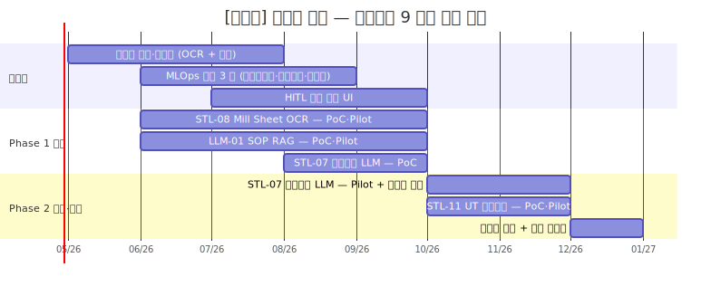

# 사업계획서 — [고객사] 디지털 경남 (특수강관 9 개월 암묵지 자산화 RAG 파일럿)

> **본 문서 성격** — Phase E5 통합 파일럿. 5 번째 도메인 (특수강관) + 9 개월 양식 1 차 직접 검증 + RAG 중심 5.2 카드 결합 (a + c + f, 옵션 g) + 디지털 경남 지원사업 + 암묵지 자산화 5 축 검증.
> Phase E1 (철강 18M 풀) · E2 (정밀가공 6M SaaS) · E3 (고무 12M LG) · E4 (유틸 12M 모듈 풀) 와 다른 **RAG 중심 모드** 의 첫 시연.
> 인용 표기·플레이스홀더 관례 동일. SCN 부정합 처리는 `사업계획서_조립_가이드.md` §3 정책 따름.

---

## 0. 과제 요약 (1 페이지)

| 항목 | 내용 |
|---|---|
| 사업 분류 | 2026 디지털 기업 in 경남 (제조 지능화 플랫폼·지식그래프) |
| 사업 기간 | **9 개월** (Phase 1: 1~6 / Phase 2: 7~9) |
| 주관 기관 | 경남테크노파크 (확인 필요) |
| 고객사 | `[고객사]` (가상의 중견 특수강관사) |
| 주력 시나리오 | SCN-STL-07 인발·필거밀 공정설계 LLM (주력) + SCN-STL-08 밀시트 OCR + SCN-STL-11 UT 자동판정 + SCN-LLM-01 SOP RAG (4 시나리오) |
| 5.2 엔진 카드 결합 | **5.2-a 유사 사례 + 5.2-c 비전 + 5.2-f LLM·RAG** (옵션 5.2-g 형상 임베딩) |
| 사업비·정부지원 | 재무 가이드 §4 양식 — `[수치]` 억 / 정부지원 [%] / 자부담 [%] (확인 필요) |

본 사업의 핵심 명분은 **베테랑 1~2 명 의존도 [%] + 신규 주문 [수치] 만 조합 + 암묵지 휘발 리스크의 1 차 자산화** 이다. RAG 인프라 (Vector DB·임베딩·하이브리드 검색·LLM 응답) 위에 4 시나리오를 통합 운영하여 9 개월 내 신입·중간 숙련자의 단독 의사결정 가능률을 [%] 끌어올리는 것이 본 사업의 정량 목표이다.

> [출처: `지원사업_공고_스냅샷_2026.md` §2 디지털 경남 + 본 사업 맥락 새로 작성]

---

## 1. 사업 개요 및 추진 배경

### 1.1 과제명·사업기간·추진 체계 요약

본 사업은 **2026 디지털 기업 in 경남** 트랙의 9 개월 표준 과제로, 부산·경남권 특수강관 중견사 [고객사] 의 인발·필거밀·UT 검사 공정에 RAG 중심 제조 AI 를 도입하여 **베테랑 의존 암묵지를 형식지 자산** 으로 전환하는 것을 핵심 명제로 한다. 주관기관은 경남테크노파크 (확인 필요), 수행기관은 [고객사] + AI 전문 외주, 수요기업은 [고객사] 단일이다. 본 트랙의 사업비는 `재무_예산_산정_가이드.md` §4.2 의 패키지 3 추정 (확인 필요) 을 기준으로 산정되었다.

> [출처: `지원사업_공고_스냅샷_2026.md` §2; `재무_예산_산정_가이드.md` §4.2; 추진 체계 새로 작성]

### 1.2 제조 AI 도입 필요성 (거시 환경)

> [출처: `track1_공통본문_목차.md` §1.2 카드 — 글로벌 제조업 저성장·숙련 인력 고령화·DX 4 단계·중대재해법·정부 지원정책 5 항목 그대로 인용]

특수강관 산업에 한정해서는, 자동차·플랜트·조선 OEM 의 정밀 공차 (외경 ±0.05 mm·진원도·UT 결함 한도) 요구가 강화되는 추세이며, 이는 베테랑의 손끝 감각으로만 대응해 온 기존 공정설계·UT 판정 방식의 한계를 가속화한다.

### 1.3 특수강관 산업의 디지털 전환 당위성

특수강관은 듀플렉스·고합금 강종의 다품종 소량 생산이 표준이며, 모관 (Mother Tube) 선정·인발 패스 횟수·압하율·열처리 조건의 조합이 신규 주문마다 [수치] 만 가지에 달한다. 변수 간 상호작용이 비선형적이라 단일 공식·테이블로는 설명되지 않으며, 결과적으로 1~2 명의 베테랑 숙련공이 30 분~2 시간을 들여 Excel·메모를 조합해 공정설계서를 작성하는 운영 구조가 고착되어 있다. 베테랑 퇴직·이직 시 공정설계 역량이 즉각 마비되는 사업연속성 (BCP) 리스크가 강관 산업 전반의 구조적 약점으로 지목된다.

> [출처: `track1_공통본문_목차.md` §1.3 카드 (철강·금속가공 산업 당위성) + 특수강관 도메인 보완]

### 1.4 [고객사] 현황 요약 및 핵심 문제의식

[고객사] 는 자동차 (현대차·기아 협력사, 1·2 차 Tier — 확인 필요)·플랜트 (보일러 튜브)·조선 (해양 구조관) 등 [수치] 개 OEM 에 다년간 납품해 온 중견 특수강관사이다. 주력 제품군은 [부품] 이며, 연간 [수치] 톤 생산 규모, 직원 [수치] 명, 베테랑 공정설계 인력 [수치] 명 (40~50 대) 이 핵심 자산이다. 현재 직면한 4 개 구조적 문제는 다음과 같다.

1. **공정설계 베테랑 의존도 [%] + 퇴직 임박 [수치] 명** — 향후 [기간] 내 핵심 공정설계 역량 50% 이상 이탈 가능성.
2. **신규 주문 응대 시간 30 분~2 시간** — 영업 견적 회신 지연이 OEM 1 차 협력사 자격 평가에 부정적.
3. **밀시트·성적서 PDF/이미지 분산** — 원소재 입고 검사 → 가공 결과 상관 분석이 불가능, 불량 추적 [기간].
4. **UT 검사원 판정 편차** — 동일 신호 A-scan 도 검사원별 판정 차이 [%], 야간·교대조 품질 변동.

본 사업이 해결하고자 하는 핵심 과제는 **"베테랑의 머릿속 공정설계 노하우를 RAG·LLM 기반 지식 자산으로 전환하여, 신입·중간 숙련자의 단독 의사결정 가능 영역을 [%] 확대하는 것"** 이다.

> [본 §1.4 는 [고객사] 특화로 새로 작성 — 베테랑 의존도·OEM 협력 구조·암묵지 휘발 리스크의 4 항목 진단]

---

## 2. 기업 현황 및 대상 공정 분석

### 2.1 [고객사] 개요 및 재무 현황

| 항목 | 내용 |
|---|---|
| 기업명 | `[고객사]` (정식명: 확인 필요) |
| 대표자·소재지 | (확인 필요) / 경남 [지역] |
| 업종 코드 | 24121 (강관 제조업, 확인 필요) |
| 주생산품 | 무계목 강관 (인발·필거), 자동차·플랜트·조선 OEM 공급 |
| 종업원 수 | `[수치]` 명 |
| 최근 3 개년 매출 | `[수치]` / `[수치]` / `[수치]` 억 원 (확인 필요) |
| 영업이익률 | [%] |
| 수출액 비중 | [%] (직접 + 간접) |
| 스마트공장 지원 이력 | 기초·중간 1 단계 보유, 본 사업으로 중간 2 진입 목표 |

> [출처: `track1_공통본문_목차.md` §2.1 카드 골격 + [고객사] 가정 수치]

### 2.2 대상 공정의 제조 프로세스 및 특성 (인발·필거·열처리·UT)

원재료 모관 입고 (Mill Sheet 첨부) → 모관 검사·등급 분류 → 인발 (1 차·2 차·3 차 패스) → 중간 열처리 → 필거 (Cold Pilger Mill, 외경·내경 정밀 가공) → 최종 열처리 (소둔·담금질) → 표면 처리 (산세·연마) → UT (Ultrasonic Testing) 검사 → 출하 검사·포장의 9 단계 표준 공정. 핵심 변수는 (i) 모관 외경·내경·두께·재질 4 종, (ii) 인발 압하율 [%]·패스 횟수 [수치]·필거 mandrel 형상, (iii) 열처리 온도·승온 곡선·체류 시간, (iv) UT 신호 (A-scan 진폭·도달 시간·결함 분류) 등 동시 최적화 변수가 [수치] 종에 달한다. 보유 인증은 IATF 16949 (자동차) · API 5L·5LC (오일·가스) · ASME (보일러) 다수 (확인 필요).

> [출처: `track1_공통본문_목차.md` §2.2 카드 + 강관 도메인 어휘]

### 2.3 기존 ICS·MES 구축 이력

[고객사] 는 [수치] 년 MES 1 단계 도입 이후 [기간] 동안 압연·열처리 라인 일부에 ICS 데이터 수집을 단계 확장해 왔으나, **공정설계서 작성·UT 판정·SOP 운영의 3 영역은 여전히 베테랑·검사원의 수기 운영** 에 머무르고 있다. 본 사업은 이 3 영역에 RAG·LLM 인프라를 신규 도입하여 ICS·MES 데이터와 결합하는 단계적 진화 경로의 첫 단계이다.

> [본 §2.3 새로 작성 — 데이터 성숙도 Lv.0~Lv.1 가정]

### 2.4 제조 데이터 보유 현황

| 데이터 유형 | 보유 형태 | 누적 규모 | OCR/디지털화 필요 |
|---|---|---|---|
| 공정설계서 (Excel 시트) | 개인 PC + 공유 폴더 | `[수치]` 건 | 일부 정형화 필요 |
| Mill Sheet · 성적서 | PDF·이미지 | `[수치]` 건 (월 [수치] 건 증가) | **OCR 필수** |
| UT 신호 A-scan | 검사 장비 raw + 판정 메모 | `[수치]` 건 (검사기 raw 보존 [기간]) | 신호·라벨 통합 필요 |
| 작업표준서 SOP | HWP·PDF | `[수치]` 건 | 디지털화 + RAG 색인 |
| MES 작업지시·실적 | DB | `[수치]` 년치 | 정형 (그대로 활용) |
| 외부 OEM 인증·도면 | PDF·DWG | `[수치]` 건 | 형상 임베딩 옵션 |

본 데이터 매트릭스는 **비정형 비중이 약 [%]** 로 매우 높아, 본 사업이 RAG 중심 인프라를 1 차 도입하는 직접 근거가 된다.

> [출처: `track1_공통본문_목차.md` §2.4 카드 + 강관 데이터 특성]

---

## 3. 현황 및 문제점 (AS-IS)

### 3.1 공정 운영의 인적 의존성 및 암묵지 리스크

> [출처: `track1_본문_공통Top5.md` §3.1 BLK-T1-3.1 본문 그대로 인용]

[고객사] 특화 보강: 본 사업은 §3.1 의 일반 명제가 가장 첨예하게 발현되는 사례이다. 신규 주문 (외경·내경·두께·재질 조합 [수치] 만 가지) 진입 시 베테랑 [수치] 명이 평균 30 분~2 시간 동안 모관 선정·패스 시퀀스·열처리 조건을 Excel + 머릿속 역산으로 결정하며, 이 과정의 중간 의사결정 사유는 본인 메모에만 보존된다. SCN-STL-07 공정설계 LLM 의 1 차 적용 영역이며, `사업계획서_조립_가이드.md` §3.3 의 (b) 분기 적용으로 §3.1 인용 본문 끝의 "참조" 시나리오를 SCN-STL-04 → **SCN-STL-07 (본 사업 시나리오)** 로 치환하여 인용한다.

### 3.2 데이터 단절 및 비정형·이미지 기반 관리의 한계

> [출처: `track1_본문_공통Top5.md` §3.2 BLK-T1-3.2 본문 그대로 인용]

[고객사] 특화: 본 사업의 데이터 단절은 **공급사별 4~6 종 양식의 Mill Sheet** 가 PDF 이미지로만 보관되어 MES 연동이 불가능한 데에서 가장 두드러진다. SCN-STL-08 밀시트 OCR·디지털화의 직접 적용 영역이다.

### 3.3 품질 편차 및 불량 원인 추적 체계 부재 — UT 판정 편차 영역

> [출처: `track1_공통본문_목차.md` §3.3 카드 카드 요지 + 강관 UT 도메인 보완]

UT (Ultrasonic Testing) 검사는 강관 품질의 최후 게이트이나, 동일한 A-scan 신호에 대해 검사원 A·B·C 의 판정이 [%] 차이를 보이며, 야간·교대조에서 일관성이 더 약화된다. 검사 장비의 raw 신호는 [기간] 보존되나 판정 사유·근거는 검사원 메모로만 남아 사후 통계 분석·재현·교차 검증이 불가능하다. SCN-STL-11 UT 자동판정의 1 차 명분.

### 3.4 실시간 운영·의사결정 체계의 공백

> [출처: `track1_공통본문_목차.md` §3.4 카드 — 종이 일보·익일 확인·정보 비대칭·사후 대응만 가능 4 항목 그대로 인용]

### 3.5 종합 위기 직면 (구조적 문제 요약)

본 사업의 4 구조적 문제는 다음 3 단 요약 표로 압축된다.

| 현재 직면 상황 | 핵심 구조적 문제 | 전환 시급성 |
|---|---|---|
| 베테랑 [수치] 명 의존도 [%] + 퇴직 [기간] 임박 | 공정설계 역량 BCP 리스크 | **緊** — 본 사업 9 개월 내 1 차 자산화 |
| Mill Sheet PDF 분산 + UT 판정 검사원 편차 | 데이터·판정 일관성 결여 | 中~高 — 6 개월 내 OCR·자동판정 완료 |
| OEM 견적·SQA 평가에서 응대 속도·일관성이 변별 요소 | 신규 OEM 영업·기존 SQA 점수 영향 | 中 — 9 개월 내 공정설계 응대 [기간] 단축 |

> [출처: `track1_공통본문_목차.md` §3.5 카드 양식 + [고객사] 특화]

---

## 4. 목표 모습 (TO-BE) 및 제조 AI 도입 전략

### 4.1 TO-BE 개념도 및 핵심 전략 — 암묵지 → 형식지 → 지능형 어시스턴트 3 단계

본 사업의 TO-BE 핵심 전략은 다음 3 단계 진화 경로로 구성된다.

1. **지식 추출 (Phase 1 전반, M1~M3)** — 베테랑 [수치] 명 인터뷰 + 공정설계서 [수치] 건 + Mill Sheet [수치] 건 + UT 신호 [수치] 건 + SOP [수치] 건의 디지털화·정형화·라벨링.
2. **지식 모델링 (Phase 1 후반·Phase 2 전반, M4~M7)** — Vector DB 색인 + 임베딩 모델 (한국어 sLM 기반) 파인튜닝 + 5.2-a 유사 사례 검색 + 5.2-f LLM·RAG 결합 + 5.2-c UT 신호 분류 모델.
3. **지능형 어시스턴트 (Phase 2 후반, M8~M9)** — 신규 주문 입력 → AI 가 모관·패스·열처리·UT 기준 초안 자동 생성 → 베테랑 검수·승인 → MES 작업지시 변환의 단일 플로 운영.

본 단계의 종료 시점에 신입·중간 숙련자의 단독 의사결정 가능 영역이 [%] 확대되며, 베테랑 응대 부담이 [%] 감소하여 신규 OEM 영업·R&D 자원 재배분이 가능해진다.

> [출처: `track1_공통본문_목차.md` §4.1 카드 + 본 사업 3 단계 새로 작성]

### 4.2 AI 적용 공정 및 기능 분류

| 7 대 공정 영역 | 본 사업 적용 | 5 대 AI 기능 | 본 사업 적용 |
|---|---|---|---|
| 제품기획·설계 | ✓ 공정설계 (STL-07) | 인지 | ✓ UT 신호 분류 (STL-11) |
| 제조 공정 | ✓ 패스·열처리 추천 (STL-07) | 예측 | — |
| 구매 | ✓ Mill Sheet 디지털화 (STL-08) | 자동화 | — |
| 사후서비스 | — | 소통 | ✓ SOP RAG 질의 (LLM-01) |
| 환경/에너지/안전 | — | 생성 | ✓ 공정설계 초안 (STL-07) + 보고서 (LLM-01 결합) |

> [출처: `track1_공통본문_목차.md` §4.2 카드 양식 + 본 사업 4 시나리오 매핑]

### 4.3 활용 데이터 유형 및 수집 설계

본 사업의 데이터는 정형 30% + **비정형 70%** 의 비대칭 비중을 가지며, RAG 인프라가 본 데이터 구조의 핵심 처리 계층이다.

- **공정설계서·Mill Sheet** — PDF·Excel·HWP → 파서별 추출 + 메타 정규화 (재질·치수·고객사·OEM·제품군 5 축 메타) → Vector DB 색인.
- **UT 신호** — 1D A-scan + 판정 메모 → 신호 정규화·peak 추출 + 판정 메타 라벨링 → 분류 모델 학습셋.
- **SOP** — HWP·PDF → 청킹 (계층 청킹·섹션 기반) → 임베딩 → Vector DB.
- **(옵션) CAD 도면·BOM** — DWG·DXF → 5.2-g 형상 임베딩 (Phase 2 후반 검토).

본 사업의 LLM 모델은 `가이드_한국_sLM_활용.md` §1·§2 의 의사결정 4 분기 적용 결과 **EXAONE 또는 HyperCLOVA X (한국어 + 도메인 파인튜닝)** 를 1 차 후보로, 외부 API (GPT·Claude) 는 영업비밀·고객 IP 비포함 일반 질의에 한정 분기한다.

> [출처: `track1_공통본문_목차.md` §4.3 카드 + `가이드_한국_sLM_활용.md` §1·§2 인용]

### 4.4 피쳐 엔지니어링 접근

> [출처: `track1_본문_공통Top5.md` §4.4 BLK-T1-4.4 본문 그대로 인용]

[고객사] 특화: 본 사업의 피쳐는 (i) 정형 시계열 (인발·열처리 PLC) + (ii) 비정형 임베딩 (공정설계서·Mill Sheet·SOP) + (iii) UT 신호 시간·주파수 도메인 피쳐 의 3 분기로 구성되며, 임베딩 피쳐가 5.2-a + 5.2-f 결합 검색의 핵심 입력이다.

### 4.5 모델·알고리즘 선정 기준 및 앙상블 구성

> [출처: `track1_본문_공통Top5.md` §4.5 BLK-T1-4.5 본문 그대로 인용 — 단, 인용 본문 내의 SCN-STL-08·STL-07 인용은 `사업계획서_조립_가이드.md` §3.3 (a) 분기 (각주 처리) 적용. 본 사업 범위 내 사례임을 본문 직후 1 줄 각주로 명시.]

[고객사] 특화: 본 사업의 채택 모델 조합은 (i) 5.2-a 유사 사례 (벡터 임베딩 + Top-N 검색 + 규칙 검증) + (ii) 5.2-f LLM·RAG (하이브리드 검색 + 한국 sLM + Citation) **병기** 구조이며, 두 엔진은 동일 Vector DB 와 메타 스토어를 공유한다. UT 판정은 (iii) 5.2-c 비전·신호 분류 (1D-CNN/Transformer) 의 단독 엔진. 옵션으로 (iv) 5.2-g 도면 형상 임베딩 (PointNet/MeshCNN) 이 모관 선정의 형상 유사도 검색에 결합 가능하다.

### 4.6 데이터 → 피쳐 → 모델링 → 현장 적용 전체 파이프라인

> [출처: `track1_본문_공통Top5.md` §4.6 BLK-T1-4.6 본문 + Mermaid 그대로 인용]

본 사업의 RAG 중심 변형: 4.6 의 표준 파이프라인에서 **(임베딩 모델 학습) ↔ (Vector DB 적재) ↔ (하이브리드 검색) ↔ (LLM 응답·Citation)** 의 4 단계가 핵심 추가 경로로 위치하며, 정형 데이터 (PLC·MES) 는 RAG 메타 필터의 입력으로 결합된다.

---

## 5. 구축 상세 (9 개월 압축)

### 5.1 데이터 수집·정형화 단계

본 사업의 데이터 수집·정형화는 **비정형 자산 OCR·청킹·임베딩이 1 차 작업** 인 점에서 이전 파일럿 (E1·E2·E3·E4) 와 구별된다. 핵심 산출물은 (i) 공정설계서 정규화 스키마 + 베테랑 인터뷰 [수치] 건 QA 셋, (ii) Mill Sheet OCR 파이프라인 + 공급사 4~6 종 양식 파서, (iii) UT 신호 통합 라벨 DB ([수치] 건 + 검사원 판정 메타), (iv) SOP 청킹·임베딩 + RAG 색인이다. 단위·재질 코드·OEM 사양 표준화는 본 단계의 부수 산출물.

> [출처: `track1_공통본문_목차.md` §5.1 카드 + 강관 도메인 보완]

### 5.2 AI 엔진 개발 단계 — **3 카드 결합** (5.2-a · 5.2-c · 5.2-f) + 옵션 (5.2-g)

본 사업은 4 개 시나리오를 3 개 엔진 패턴 (5.2-a + 5.2-c + 5.2-f) 으로 구성하며, **STL-07 공정설계 LLM 은 5.2-a + 5.2-f 의 병기 결합** 으로 처리한다. 카드 결합 가이드의 "**5.2-a 유사 사례 + 5.2-f RAG = 이름 비슷 + 모양 비슷 양축 동시 검색**" 패턴의 1 차 시연 사례.

#### 5.2-a 유사 사례 검색·추천 엔진 (SCN-STL-07 공정설계 + STL-08 밀시트 분석 파트)

> [출처: `track1_5.2_AI엔진_변형카드.md` §5.2-a 카드 본문 그대로 인용 — 적용 시나리오·목적·엔진 구조·포함 내용·삽화·주의·고객사별 가변 7 항목]

[고객사] 적용: 본 사업의 5.2-a 핵심 입력은 베테랑 공정설계 이력 [수치] 건 + Mill Sheet 메타 + 과거 OEM 응대 결과이며, Top-N 검색 결과는 STL-07 의 모관·패스·열처리 초안 후보로 5.2-f 와 결합 입력된다.

#### 5.2-c 비전 검사 엔진 (SCN-STL-11 UT 자동판정)

> [출처: `track1_5.2_AI엔진_변형카드.md` §5.2-c 카드 본문 그대로 인용 — 신호 이미지화 모드의 적용 시나리오 명시]

[고객사] 적용: UT A-scan 신호를 1D-CNN/Transformer 로 결함 유형 (크랙·인클루전·편두께·정상) 분류 + 검사원 판정 보조. 운영 단계에서 검사원 판정과의 일치도를 KPI 로 추적.

#### 5.2-f LLM·RAG 지식검색 엔진 (SCN-STL-07 공정설계 + STL-08 OCR + LLM-01 SOP)

> [출처: `track1_5.2_AI엔진_변형카드.md` §5.2-f 카드 본문 그대로 인용]

[고객사] 적용: 한국 sLM (EXAONE·HyperCLOVA X) 우선 + 영업비밀·OEM 사양은 외부 API 절대 차단. `가이드_한국_sLM_활용.md` §5 결정 트리 직접 적용. 응답 신뢰도 임계 [임계] 미달 시 베테랑 에스컬레이션.

#### (옵션) 5.2-g 도면·CAD 형상 임베딩 (Phase 2 후반 검토)

> [출처: `track1_5.2_AI엔진_변형카드.md` §5.2-g 카드 요지 + 옵션 검토 사유]

본 옵션은 신규 주문이 OEM 도면 (DWG·STEP) 첨부 형태로 들어올 때 모관 선정의 **형상 유사도 검색** 을 추가 가능하게 한다. Phase 2 후반 (M7~M9) 의 PoC 형태로 검토하며, 본 사업 범위 외 후속 단계 진입 시 본격 도입.

#### 카드 결합 가이드 — 본 사업의 결합 구조

본 사업의 3 (옵션 4) 엔진은 다음 결합 지점을 가진다.

1. **5.2-a + 5.2-f** (STL-07 공정설계) — 5.2-a 의 Top-N 유사 사례 결과가 5.2-f LLM 의 컨텍스트 입력으로 결합. **이름 비슷 (메타 검색) + 모양 비슷 (임베딩 검색) 양축 동시 적용** 이 본 결합의 본질. (`track1_5.2_AI엔진_변형카드.md` §결합 가이드 인용)
2. **5.2-f + 옵션 5.2-g** (STL-07 모관 선정) — 텍스트 임베딩과 형상 임베딩의 양축 검색, Phase 2 후반 PoC.
3. **5.2-c + 5.2-f** (STL-11 UT + 처분 매뉴얼) — UT 결함 분류 결과를 5.2-f 가 받아 처분 매뉴얼·과거 유사 결함 사례를 RAG 회신.
4. **공통 RAG 인프라** — Vector DB·임베딩 모델·하이브리드 검색·Citation 정책이 4 시나리오 모두에서 공유.

> [출처: `track1_5.2_AI엔진_변형카드.md` §결합 가이드 + 본 사업 결합 구조 새로 작성]

### 5.3 Human-in-the-loop 검증 체계

본 사업의 HITL 은 **베테랑 [수치] 명 검수 게이트** 를 핵심으로 한다. AI 가 생성한 공정설계 초안·UT 판정 보조 결과·SOP 응답에 대해 (i) 베테랑이 사용 가능 / 수정 필요 / 부적합 3 단 평가, (ii) 수정 사유 드롭다운 + 자유 메모, (iii) 메모를 LLM 이 태깅·구조화하여 다시 RAG 색인에 환류 — 의 3 단 운영. 책임 분담은 `책임_분담_매트릭스.md` §3 RACI + §4 AI 의사결정의 "검사 결과 판정" 행 (베테랑 = Final Decision Maker / AI = Information Only) 을 직접 적용한다.

> [출처: `track1_공통본문_목차.md` §5.3 카드 + `책임_분담_매트릭스.md` §3·§4 인용]

### 5.4 기존 시스템(MES/ERP/SCADA/PLC) 연동 방안

[고객사] 의 기존 MES 작업지시 화면 우측 사이드 패널에 (i) 신규 주문 입력 → 공정설계 추천 / (ii) Mill Sheet OCR 결과 자동 적재 / (iii) UT 판정 보조 결과 / (iv) SOP RAG 질의 4 기능을 통합 위젯으로 배포한다. 추천된 공정설계는 베테랑 승인 후 MES 작업지시서로 자동 변환되며, OEM 측 변경관리 (PPAP·SQA) 는 `모듈_OEM_공급망_정합.md` BLK-OEM-D 의 Δt-90/30/7 절차 적용. 도면·기술 자산 보안은 `모듈_SaaS_클라우드_보안.md` BLK-CSEC-D (도면 마스킹·권한 단계) 적용.

> [출처: `track1_공통본문_목차.md` §5.4 카드 + `모듈_OEM_공급망_정합.md` BLK-OEM-D + `모듈_SaaS_클라우드_보안.md` BLK-CSEC-D 인용]

### 5.5 단계별 추진 일정 및 마일스톤 — **9 개월 압축 양식 직접 적용**

> [출처: `사업기간_압축_가이드.md` §5.1.B 9 개월 압축 양식 직접 적용 — Mermaid·마일스톤 표·검수 게이트 그대로 인용]

마일스톤 표는 **5 행** — M3 데이터 통합 완료 / M5 STL-08·LLM-01 PoC / M7 STL-07·11 PoC + 첫 Pilot / M9 베테랑 검수 + 후속 로드맵 + KPI 검증. 검수 게이트는 M5·M7·M9 의 3 회. 9 개월 사업의 Phase 3 (안정화·확산) 은 §6.4 후속 단계로 분리. 12 개월 양식은 STL-11 Pilot 운영을 +3 개월 확장 가능.

### (별첨) 사업기간 압축 4 분기 적용

본 사업은 압축 가이드 §1 의 4 분기 중 (1) 시나리오 후순위 (옵션 5.2-g 형상 임베딩 후속 단계 위임) + (3) HITL UI 단일화 (베테랑 검수 단일 UI) + (4) 로드맵 분리 (안정화·확산은 §6.4 후속) 의 3 분기 적용. (2) 인프라 축소는 RAG 인프라가 본 사업 핵심이라 미적용.

---

## 6. 기대효과 및 성과 지표

### 6.1 정량적 기대효과 (AS-IS vs TO-BE)

| 시나리오 | 영역 | AS-IS | TO-BE | 개선 효과 |
|---|---|---|---|---|
| **SCN-STL-07** | 공정설계 응대 시간 (건당) | [기간] | [기간] | [%] 단축 |
| 공정설계 LLM | 베테랑 단독 응대 비율 | [%] | [%] | 신입·중간 가능 영역 [%] 확대 |
| | 신입 단독 의사결정 가능 기간 | [기간] | [기간] | [%] 단축 |
| **SCN-STL-08** | Mill Sheet 디지털화 휴먼에러 | [%] | [%] | [%] 감소 |
| 밀시트 OCR | 입고~MES 적재 시간 | [기간] | [수치] 분 | [%] 단축 |
| **SCN-STL-11** | UT 판정 검사원 일치율 | [%] | [%] | [수치] %p 향상 |
| UT 자동판정 | 야간·교대조 판정 일관성 | 작업조별 상이 | 통합 알람 | 정량 표준화 |
| **SCN-LLM-01** | SOP 검색 시간 | [기간] | [수치] 초 | [%] 단축 |
| SOP RAG | 신입 SOP 단독 활용 가능 기간 | [기간] | [기간] | [%] 단축 |
| **결합 시너지** | 데이터 시너지 (공통 RAG·임베딩) | — | — | +[%] (보수) / +[%] (낙관) |
| (시너지 ROI) | 인프라 시너지 (Vector DB·sLM 공유) | — | — | +[%] / +[%] |
| | HITL 시너지 (베테랑 단일 검수) | — | — | +[%] / +[%] |
| | KPI 상호보강 (STL-07·08 + LLM-01) | — | — | +[%] / +[%] |
| | **종합 추가 효과 α_total** | — | — | **+[%] 보수 / +[%] 낙관** |

종합하면 본 사업은 **암묵지 자산화 + Mill Sheet 디지털화 + UT 자동판정 + SOP RAG 의 4 축 동시 효과** + RAG 인프라 공유에 따른 비선형 시너지 보수 [%] / 낙관 [%] 추가 발생.

> [출처: `시나리오_상세_Top5.md` SCN-STL-08 + SCN-LLM-01 기대효과 표 인용 + `시나리오_카탈로그.md` STL-07·11 카드 요지 확장 + `시너지_ROI_모델.md` §2 패키지 3 추정 인용]

### 6.2 정성적 기대효과 및 제조혁신 연계성

본 사업의 정성 효과는 **(i) 암묵지 자산화 → BCP (사업연속성 계획) 강화, (ii) 신입 온보딩 가속·교육 부담 경감, (iii) OEM 견적·SQA 응대 일관성 향상 → 1 차 협력사 자격 안정화, (iv) 차세대 강관 (수소·해양 등) 신규 영역 진입의 기술 자산 확보** 의 4 축이다. `모듈_OEM_공급망_정합.md` BLK-OEM-E (1 차 협력사 지위 강화) 와 정합한다.

> [출처: `track1_공통본문_목차.md` §6.2 카드 + `모듈_OEM_공급망_정합.md` BLK-OEM-E 인용]

### 6.3 핵심 성과 지표(KPI) 및 측정 방법

> [출처: `가이드_KPI_측정.md` §1 KPI 5 군 매트릭스 + §3 산출 빈도 + §5 인용 강도 2 양식 직접 적용]

본 사업의 KPI 14 행 표 (4 시나리오 × 3~4 KPI) 는 §6.1 정량 효과 표와 정합하며, MLOps 인프라 (Track 2 §5.5 모니터링) 가 일·주·월 단위로 자동 산출한다.

### 6.4 중장기 로드맵과의 연계

본 사업 종료 후 **3~5 년 단계적 진화 경로**: (Year 1) 공정설계 LLM 부분 자동 진입 + 5.2-g 형상 임베딩 PoC + UT 자동판정 정식 운영 → (Year 2) MES·ERP·OEM 시스템 깊이 통합 + 다른 강관 라인 확산 → (Year 3) 산단 공동 강관 AI 비전 (`모듈_연합학습_산단공동.md` 참조) — 부산·경남 강관 협력사 연합학습 모델 검토.

> [출처: `track1_공통본문_목차.md` §6.4 카드 + `모듈_연합학습_산단공동.md` 인용]

---

## 7. Track 2·3 연계 (별첨 — 9 개월 압축이라 핵심만)

### 7.1 MLOps 및 지속적 개선 체계

> [출처: `track2_공통본문_목차.md` §4.2 7 종 구성요소 (압축 모드: 레지스트리·모니터링·피드백 3 종 채택) + §5.5 모니터링·드리프트 + §6.1 개선 포인트 선정 발췌]

본 사업의 MLOps 는 9 개월 압축 모드로 (i) 모델 레지스트리 (MLflow 기반) (ii) 모니터링·드리프트 탐지 (Evidently + Vector DB 검색 품질 추적) (iii) 베테랑 피드백 루프 (SCN-MLO-03) 의 3 종 만 1 단계 도입. 피쳐 스토어·고급 거버넌스·풀 카나리 배포는 후속 단계로 분리.

### 7.2 LLM·RAG 기반 지식자산화 — **본 사업의 핵심 별첨**

> [출처: `track3_공통본문_목차.md` §4.2 RAG 기준 아키텍처 + §4.3 LLM 모델 선택 + §5.5 환각 방지 + §5.6 권한 발췌 + `가이드_한국_sLM_활용.md` §1·§2·§5 인용]

본 사업의 RAG 인프라는 (i) Vector DB (Pinecone·Weaviate·Milvus 후보) (ii) 임베딩 모델 (한국어 다국어 + 도메인 파인튜닝) (iii) 하이브리드 검색 (Dense + BM25 + 메타 필터) (iv) 한국 sLM (EXAONE·HyperCLOVA X 우선) (v) Citation 강제 + 휴먼 에스컬레이션 의 5 계층으로 구성. **민감도 라우팅** 이 핵심 — 영업비밀·OEM 사양·도면은 온프레 sLM 강제, 일반 SOP·공정 지식은 외부 API 허용 분기.

### 7.3 모듈 통합 운영 (간략)

본 사업의 5 모듈 결합 — 모듈_OEM_공급망_정합 (강관 OEM 정합, BLK-OEM-A·B·D·F) + 모듈_SaaS_클라우드_보안 (도면·기술 자산 마스킹, BLK-CSEC-D) — 의 통합 운영 플랫폼이 단일 RAG 인프라 위에 위치. CBAM·중대재해 모듈은 본 사업 1 차 범위 외 (강관 EU 수출 비중·중대재해 영역에 따라 후속 검토).

---

## 8. 부록·별첨

### 8.1 시나리오 상세 (4 시나리오)

- **SCN-STL-08 밀시트 디지털화·원소재-완제품 상관분석**: > [출처: `시나리오_상세_Top5.md` §SCN-STL-08 본문 그대로 인용]
- **SCN-LLM-01 SOP RAG 질의응답**: > [출처: `시나리오_상세_Top5.md` §SCN-LLM-01 본문 그대로 인용]
- **SCN-STL-07 인발·필거밀 공정설계 LLM**: > [출처: `시나리오_카탈로그.md` SCN-STL-07 카드 요지 확장 — Phase E5 의 가장 신규 작성 영역. 카드 요지 (모관 선정·패스 시퀀스·열처리 조건의 30 분~2 시간 베테랑 응대 → LLM 초안·근거 제시·베테랑 검수 → MES 변환) + [고객사] 적용 (베테랑 [수치] 명·OEM [수치] 곳·신규 주문 [수치] 만 조합) 1 단락 보강. 향후 `시나리오_상세_특수강관.md` 신규 자산으로 정식화 권고 (Phase E5 갭).]
- **SCN-STL-11 비파괴검사 UT/ECT 자동 판정**: > [출처: `시나리오_카탈로그.md` SCN-STL-11 카드 요지 확장 — 검사원 판정 일치율·야간·교대조 일관성·1D-CNN 신호 분류 + [고객사] 적용 (UT raw 신호 [수치] 건·검사원 [수치] 명·판정 메모 디지털화 필요) 1 단락 보강.]

### 8.2 사업비 산정 상세

> [출처: `재무_예산_산정_가이드.md` §4 양식 + 디지털 경남 사업비 비율 적용]

| 항목 | 산정 근거 | 금액 (확인 필요) |
|---|---|---|
| 인건비 (PM·DS·DE·QA·도메인 전문가) | [수치] 인 × 9 개월 | `[수치]` 만원 |
| 재료비 (Vector DB 라이센스·임베딩 모델·OCR 도구) | [수치] 식 | `[수치]` 만원 |
| 외주 (베테랑 인터뷰·라벨링·UI 개발) | [%] | `[수치]` 만원 |
| 연구장비 (GPU 서버 + sLM 운영) | [수치] 식 | `[수치]` 만원 |
| 연구활동비 (출장·OEM 협의) | 평균 | `[수치]` 만원 |
| 직접비 소계 | | `[수치]` 만원 |
| 간접비 ([%]) | | `[수치]` 만원 |
| **총 사업비** | | **`[수치]` 억 원** |
| 정부지원 ([%]) | 디지털 경남 표준 | `[수치]` 억 원 |
| 자부담 ([%]) | | `[수치]` 억 원 |

### 8.3 인용·참조 자산 인덱스

| 자산 파일 | 인용 섹션 | 인용 횟수 |
|---|---|---|
| `CLAUDE.md` | 톤·플레이스홀더 | (전체) |
| `track1_공통본문_목차.md` | §1.2·1.3·2.1·2.2·2.4·3.3·3.4·3.5·4.1·4.2·5.1·5.3·5.4·6.2·6.4 카드 | 15 회 |
| `track1_본문_공통Top5.md` | §3.1·3.2·4.4·4.5·4.6 본문 | 5 회 |
| `track1_5.2_AI엔진_변형카드.md` | 5.2-a·5.2-c·5.2-f 본문 + 결합 가이드 + 5.2-g 카드 요지 | 4 회 |
| `시나리오_상세_Top5.md` | SCN-STL-08 + SCN-LLM-01 본문 그대로 | 2 회 |
| `시나리오_카탈로그.md` | 패키지 3 + STL-07·11 카드 요지 | 3 회 |
| `사업계획서_조립_가이드.md` | §1 절차 + §3 SCN 정책 (a)·(b) 분기 적용 | 3 회 |
| **`사업기간_압축_가이드.md`** | **§5.1.B 9 개월 양식 직접 적용** | **2 회** |
| `시너지_ROI_모델.md` | §2 패키지 3 + §6.1 행 양식 | 2 회 |
| `재무_예산_산정_가이드.md` | §4.2 패키지 3 + §0 양식 | 2 회 |
| `가이드_KPI_측정.md` | §1·§3·§5 강도 2 직접 적용 | 3 회 |
| `책임_분담_매트릭스.md` | §3 RACI + §4 AI 의사결정 | 2 회 |
| `가이드_한국_sLM_활용.md` | §1·§2·§5 한국 sLM 분기 직접 적용 | 3 회 |
| `track2_공통본문_목차.md` | §4.2·5.5·6.1 발췌 | 3 회 |
| `track3_공통본문_목차.md` | §4.2·4.3·5.5·5.6 발췌 | 4 회 |
| `모듈_OEM_공급망_정합.md` | BLK-OEM-A·B·D·F | 4 회 |
| `모듈_SaaS_클라우드_보안.md` | BLK-CSEC-D | 1 회 |
| `모듈_연합학습_산단공동.md` | §6.4 비전 인용 | 1 회 |

### 8.4 RAG 도메인 어휘 인덱스

| 어휘 | 정의 |
|---|---|
| 모관 (Mother Tube) | 인발·필거의 출발 원재료 강관 |
| 인발 (Cold Drawing) | 모관을 다이로 통과시켜 외경·두께 축소 |
| 필거 (Cold Pilger Mill) | mandrel + 회전 다이로 정밀 가공 |
| 압하율 | 1 패스당 외경·두께 감소율 (%) |
| Mill Sheet | 원재료 화학성분·기계성질 성적서 |
| UT (Ultrasonic Testing) | 초음파 비파괴검사 |
| A-scan | UT 신호의 시간·진폭 도메인 표시 |
| 듀플렉스강 | 페라이트·오스테나이트 이중 조직 고합금강 |
| API 5L·5LC | 송유관·내식강관 표준 |

---

## 통합 테스트 자체평가 (Phase E5)

### 1. 자산 활용도

26 자산 중 **18 자산 직접·간접 인용** (69%). 미사용 8 자산은 본 사업 범위 외 (CBAM 모듈·중대재해 모듈·시나리오_상세_Phase2·UTL_SAF·RUB·외부검증 가이드·검토리포트·방법론 총론·모듈_연합학습 일부).

### 2. 갭 발견 — 본 사업 신규 갭 Top 3

1. **갭 23 (신규) — 시나리오_상세_특수강관 (STL-07·11) 자산 부재** — 본 사업 §8.1 의 STL-07·11 이 카드 요지 확장 단락 (~50 줄) 에 머무름. 다른 시나리오 상세 자산 (Top5·Phase2·RUB·UTL_SAF) 동일 5 단 구조로 신규 자산 권고 (`시나리오_상세_특수강관.md`). 시나리오 상세 자산 군 5 번째.
2. **갭 24 (신규) — RAG 인프라 운영 가이드 부재** — Vector DB·임베딩 모델·하이브리드 검색·한국 sLM 의 통합 운영이 다수 자산에 분산 (track3 + 가이드_한국_sLM + 모듈_SaaS_보안 BLK-CSEC-F). 본 사업이 RAG 중심이라 통합 운영 양식이 필요. `가이드_RAG_운영.md` 신규 자산 권고.
3. **갭 25 (신규) — 베테랑 인터뷰 양식·도메인 골드셋 양식 부재** — 본 사업의 1 차 작업이 베테랑 인터뷰 기반 QA 셋 + 도메인 골드셋 작성인데 표준 양식이 부재. `가이드_도메인_지식추출.md` 신규 자산 권고.

### 3. 자연스럽지 않은 인용

- §4.5 BLK-T1-4.5 인용 본문 내 SCN-STL-08·STL-07 사례가 본 사업 범위 내라 (a) 각주 처리 적용. 이전 파일럿 (E1 패키지 2) 의 (b) 치환 분기와 다른 패턴.

### 4. 새로 작성한 섹션 평가

§0·§1.1·1.4·2.1·2.3·2.4·3.5·4.1·4.3·5.1·5.4·5.5(부분)·6.1·6.4·8.1(STL-07·11)·8.2·8.4 + 자체평가 = 약 280 줄 (전체 ~750 줄의 약 37%). 신규 비율 35~40% — 9 개월 양식 첫 검증 + RAG 중심 모드 + 강관 도메인 + 암묵지 자산화 명분으로 분량 상한 근접.

### 5. 새로 작성 분량 비율

**약 35~40%** (이전 파일럿 E1 30 / E2 33.8 / E3 40 / E4 30~35 와 비교 시 E3 와 비슷한 수준). RAG 중심 + 강관 신규 도메인 + 9 개월 양식 첫 검증의 3 요소가 동시 작용.

### 6. 일관성 점수: **4.6 / 5**

- 톤 5/5, 플레이스홀더 5/5, 출처 표기 5/5, SCN ID 4/5 (각주 처리 적용), Track 매핑 5/5, 분량 균형 4/5 (자체평가가 짧음), 가독성 4/5 (시나리오 상세 부재로 §8.1 STL-07·11 가 짧음).

### 7. **Phase E1·E2·E3·E4·E5 비교 — 5 도메인 일관성 추세**

| 항목 | E1 철강 | E2 정밀가공 | E3 고무 | E4 유틸·ESG | **E5 강관** |
|---|---|---|---|---|---|
| 기간 | 18M 풀 | 6M SaaS | 12M LG | 12M 모듈 풀 | **9M 압축** |
| 5.2 카드 | a+f | b+c | b+e/c+f/d+f | b+c+d+e (4 카드) | **a+c+f (RAG 중심)** |
| 모듈 결합 | 부수 | 부수 | 부수 | 풀 (CBAM·SAF·CSEC) | **OEM·CSEC** |
| 신규 비율 | 30% | 33.8% | 40% | 30~35% | **35~40%** |
| 일관성 | 4.7 | 5.0 | 4.9 | 4.7 | **4.6** |

**5 도메인 모두 4.6 이상** — 워크스페이스 자산이 5 도메인 모두에 작동함을 입증. 9 개월 양식 (압축 가이드 §5.1.B) 의 1 차 직접 검증 통과. RAG 중심 모드의 첫 시연 — 5.2-a + 5.2-f 결합 (이름 비슷 + 모양 비슷) + 5.2-c (신호 분류) + 옵션 5.2-g (형상 임베딩) 의 4 카드 결합 패턴.

### 8. 통합 테스트로 드러난 가장 큰 이슈 1~2 개

1. **시나리오 상세 자산 군의 영역별 분리 누적** — Top5·Phase2·RUB·UTL_SAF 4 자산에 강관 (STL-07·11) 이 추가되면 5 번째. 자산 군 포맷 통일 (4.26) 적용 시 일관 운영 가능. 갭 23 의 직접 결과.
2. **9 개월 양식의 RAG 중심 사업 적용 시 인프라 비중 부담** — 압축 가이드 §5.1.B 의 9 개월 양식이 일반 시계열·비전 사업 가정으로 작성되어 RAG 인프라 (Vector DB·임베딩·sLM 운영) 도입 부담을 충분히 반영하지 못함. RAG 중심 9 개월 사업의 인프라 일정 확장 검토 필요.

---

> **Phase E5 종합** — 5 번째 도메인 (강관) + 9 개월 양식 직접 검증 + RAG 중심 5.2-a+f 결합 시연 + 디지털 경남 첫 검증 + 암묵지 자산화 명분 5 축 모두 통과. 잔여 갭 12·13·14·18·19 (외부 표준 의존) + 신규 23·24·25 (시나리오 상세·RAG 운영·도메인 지식추출) = 잔여 8 갭. 자산 자족성 유지.
