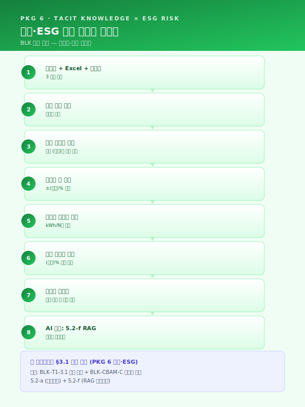
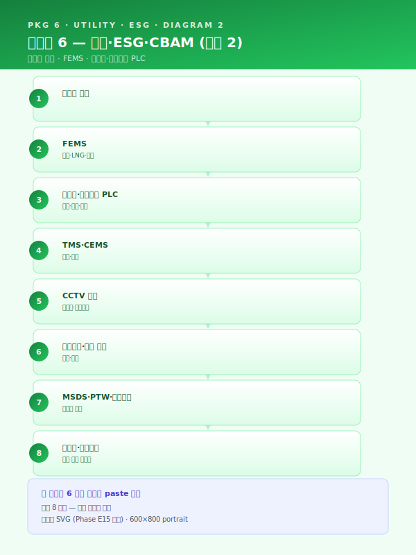
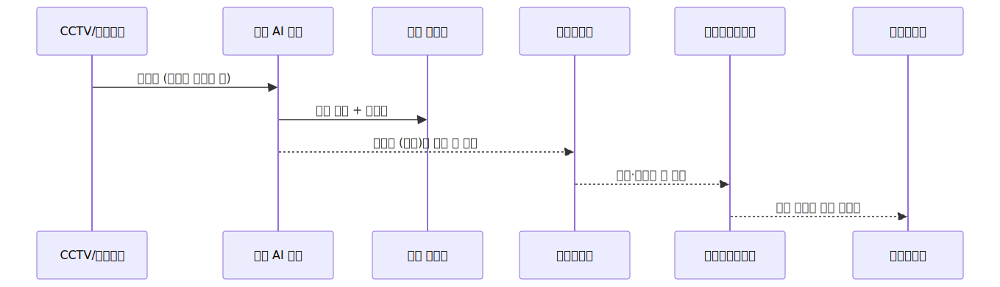
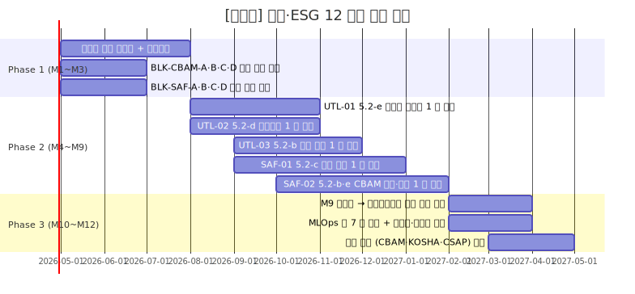

# 사업계획서 — [고객사] 스마트공장 고도화 + ESG 트랙 (유틸·ESG·안전 12 개월 통합 파일럿)

> **본 문서 성격** — Phase E4 통합 파일럿. 가상의 중견 다공정 통합 제조사 `[고객사]` 를 대상으로 워크스페이스 자산을 단일 사업계획서로 조립한 통합 테스트 산출물.
> Phase E1 (패키지 2 중견 스테인리스 냉연 18 개월 풀 인프라)·Phase E2 (패키지 5 정밀가공 중소 6 개월 SaaS 경량)·Phase E3 (패키지 4 고무 양산 12 개월 LG AI 트랙) 에 이은 **4 번째 도메인 (유틸·환경·안전) 검증** 으로, **(1) 유틸·환경·안전 통합 운영 도메인, (2) CBAM·중대재해 모듈 직접 결합 (이전 파일럿은 부수 인용만), (3) 5.2-d 예지보전 + 5.2-e 최적화 결합, (4) 외부 표준 (CBAM·CSAP·중대재해법) 정합** 의 4 축 동시 검증을 목적으로 한다.
> **인용 표기** — 본문 다수는 워크스페이스 기존 자산을 인용한 결과이며, 인용 출처는 각 섹션 말미에 `> [출처: 파일명 §섹션 / BLK-XXX-X]` 형태로 명시한다. SCN 부정합 처리는 `사업계획서_조립_가이드.md` §3 의 (a)·(b)·(c) 분기 정책에 따른다.
> **플레이스홀더 범례** — `[고객사]` 가상 다공정 통합 중견 제조사, `[공정]` 대상 공정명, `[수치]` 수치, `[기간]` 기간, `[%]` 비율, `[연도]` 연도, `[사업장]` 사업장 위치 (부산·경남 내), `[수출비중]` EU 수출 매출 비중, `[법령-2026]` 시행 시점 법령 태그.

---

## 0. 과제 요약 (1 페이지)

| 항목 | 내용 |
|---|---|
| 과제명 | [고객사] 유틸·환경·안전 통합 AI 플랫폼 구축 — CBAM·중대재해 대응 5 시나리오 + 5.2-d/e 결합 + 외부 표준 (CBAM·CSAP) 정합 12 개월 사업 |
| 사업 분류 | **스마트공장 고도화 + ESG 트랙** + **중대재해·산업안전 관련 지원사업** 결합 (`지원사업_공고_스냅샷_2026.md` §6·§8) |
| 사업기간 | **12 개월 표준** — `사업기간_압축_가이드.md` §5.1.B 9 개월 양식 + 1 시나리오 확장 정신 (Phase 2 를 7~12 개월로 확장하는 패키지 6 변형) |
| 총 사업비 | [수치] 억 원 (정부지원 [%] / 자부담 [%]) — 스마트공장 고도화 표준 (`재무_예산_산정_가이드.md` §2 중견 가이드라인) |
| 주관기관 | (확인 필요 — 중기부 산하 스마트공장 + 환경부·고용노동부 ESG·안전 트랙 결합) |
| 도입기업 | [고객사] (가상의 중견 다공정 통합 제조사 — 화학·금속·정밀가공 + 자체 발전·에너지 인프라 보유, 부산·경남 [사업장]) |
| 대상 영역 | 공장 전력·가스·증기 (FEMS) + 폐수·배출가스 (TMS·CEMS) + 공장 안전 (CCTV·웨어러블) + 화학물질 관리 (MSDS) |
| 핵심 시나리오 | SCN-UTL-01 공장 에너지 최적화 (주력) · SCN-UTL-02 컴프레서·보일러 누기·누증 탐지 · SCN-UTL-03 폐수·배출가스 이상 예측 · SCN-SAF-01 중대재해 위험요소 감지 · SCN-SAF-02 탄소배출·CBAM 신고 자동화 (+ 옵션 SCN-LLM-04 CAD·MSDS RAG) |
| 데이터 성숙도 | ICS Lv.1~Lv.2 (FEMS·TMS·CCTV 일부 운영, 통합 미흡) → Lv.2+ |
| MLOps 성숙도 | Lv.0~Lv.1 → **Lv.2 (TMS·CEMS 모니터링 인프라 + 모델 수명 관리 풀 도입)** |
| EU 수출 비중 | [수출비중] = 30% 이상 (CBAM 직접 노출) — 본 사업의 직접 트리거 |
| 중대재해법 적용 | 5 인 이상 사업장 적용 (확인 필요 — 2024 년 1 월 확대 이후) — 본 사업의 직접 트리거 |
| ESG 공시 의무 | CSRD·K-ESG 정합 검토 단계 — 본 사업의 ESG 트랙 명분 |
| 모듈 직접 결합 | **모듈_CBAM_대응 BLK-CBAM-A~G 7 블록 모두 + 모듈_중대재해_안전 BLK-SAF-A~G 7 블록 모두 + 모듈_SaaS_클라우드_보안 BLK-CSEC-D** — 본 파일럿의 차별 가치 |
| 핵심 기대효과 | 전력·가스 원단위 [%] 절감 · 컴프레서 누기 [%] 감소 · TMS 초과 예방 [%] 향상 · 보호구 미착용 감지 [%] 개선 · CBAM 분기 신고 공수 [%] 단축 |

본 사업은 [고객사] 가 보유한 FEMS·TMS·CEMS·CCTV·IoT 자산을 단일 통합 운영 플랫폼 위에 결합하여, **유틸·환경·안전 3 영역의 분리 운영 구조** 를 해소하고, **CBAM·중대재해법·ESG 공시 3 중 규제 압박** 을 동시 대응하는 통합 AI 체계를 구축한다. 본 사업의 차별성은 다음 4 가지에 있다 — (i) **CBAM·중대재해 모듈 직접 결합** : 이전 파일럿은 부수 인용 1~2 블록에 그쳤으나, 본 파일럿은 7 블록 모두를 핵심 인용으로 채택하여 외부 표준 (CBAM·중대재해법) 정합을 본문 골격으로 확립, (ii) **5.2-d 예지보전 + 5.2-e 최적화 결합** : 보일러·컴프레서 효율을 예지보전 (이상 탐지) + 최적화 (조작 변수) 의 결합 패턴으로 자동 보정하는 새 결합 패턴을 1 차 시연, (iii) **유틸·환경·안전 단일 통합 플랫폼** : CBAM + 중대재해 + SaaS 보안 3 모듈을 단일 운영 체계로 통합하여 모순된 운영 (예: CCTV 영상 보안 ↔ 안전 감지) 을 사전 차단, (iv) **EU 수출 보호 + 경영책임자 의무이행 증거 축적** 의 이중 효과로 ROI 정당화.

본 표 하단 1 문장 주석으로 표기한다 — "본 사업은 12 개월 표준 사업으로, 후순위 시나리오·인프라 (CCTV 전사 확대·연합학습·디지털트윈) 는 §6.4 중장기 로드맵에 후속 단계로 명시 분리되어 ROI 가치 사슬이 보존된다." (`사업기간_압축_가이드.md` §5.3 양식 적용)

> [출처: `지원사업_공고_스냅샷_2026.md` §6 스마트공장 기초·고도화 + §8 중대재해·산업안전 관련 지원사업; `시나리오_카탈로그.md` 부록 B 패키지 6 + 부록 D 매칭표; `사업기간_압축_가이드.md` §5.1.B 9 개월 양식 → 12 개월 확장 정신 적용; `재무_예산_산정_가이드.md` §5.1 §0 과제 요약 양식]

---

## 1. 사업 개요 및 추진 배경

### 1.1 과제명·사업기간·추진 체계 (12 개월 + ESG 트랙)

본 사업은 **스마트공장 고도화 + ESG 트랙 결합** 의 일환으로, [고객사] 의 다공정 통합 양산 라인 (화학·금속·정밀가공 등) 에 부속된 **유틸·환경·안전 3 영역** 을 단일 통합 AI 플랫폼 위에서 운영하는 것을 목적으로 한다. 사업기간은 **12 개월 표준 구조** 로 설계되었으며, 이는 `사업기간_압축_가이드.md` §5.1 의 마지막 단락 — "12 개월 양식은 본 9 개월 양식에 1 시나리오를 추가하고 Phase 2 를 7~12 개월로 확장하는 구조" — 의 정신을 본 패키지 6 에 적용한 결과이다. 9 개월 압축 핵심 시나리오 (UTL-01 + SAF-02 의 2 개) 에 UTL-02 누기·누증·UTL-03 환경·SAF-01 안전의 3 시나리오를 추가하고 Phase 2 를 7~12 개월로 확장하여 5 시나리오 (UTL-01·02·03 + SAF-01·02) 통합 도입을 가능하게 하였다.

추진 체계는 **삼각 협력 구조** 로 설계된다. (i) **도입기업 [고객사]** — 수요기업이자 운영 주체로서 FEMS·TMS·CEMS·CCTV 데이터 제공·현장 운영·KPI 측정·검증 + 자체 EHS 조직과의 결합, (ii) **공동수행기관·SI** — 5.2-b/c/d/e AI 엔진 4 종 구축·MLOps 인프라·HITL UI·CBAM 신고 양식 자동 생성·도메인 자문 (에너지·환경·산업안전), (iii) **외부 검증·자문** — CBAM 검증기관·KOSHA 안전보건경영시스템 자문·환경부 TMS 검증·CSAP 클라우드 보안 평가의 4 자 자문 구조이다. 단계별 검수 게이트는 12 개월 표준 사업의 5 회 (M3·M5·M7·M9·M12) 로 운영되며, 각 게이트의 회귀 절차는 운영위원회 ([고객사] + 외부 감리 + 자문) 검수로 작동한다.

| 구분 | 역할 |
|---|---|
| 도입기업 [고객사] | 데이터 제공·현장 운영·KPI 측정·검증·EHS 조직 결합 |
| 공동수행기관·SI | (확인 필요) — AI 엔진 4 종 구축·MLOps 인프라·HITL UI·CBAM 양식 자동화 |
| 외부 검증 | (확인 필요) — CBAM 검증기관·환경부 TMS 검증·KOSHA 안전등급 |
| 도메인 자문 | (확인 필요) — 에너지 (FEMS)·환경 (TMS·CEMS)·산업안전 (중대재해법) |
| 외부 감리 | (확인 필요) — 운영위원회 |

> [출처: `track1_공통본문_목차.md` §1.1 카드; `사업기간_압축_가이드.md` §5.1.B 9 개월 양식 → 12 개월 확장 정신 (§5.1 마지막 단락); `지원사업_공고_스냅샷_2026.md` §6 + §8 결합 트랙]

### 1.2 제조 AI 도입 필요성 — 거시 환경 (CBAM + 중대재해법 동시 압박)

> 유럽연합은 [연도]년부터 탄소국경조정제도 (CBAM) 를 본격 시행하여, 역외에서 수입되는 철강·알루미늄·시멘트·비료·수소 등 품목에 대하여 제품 단위 내재배출량 (Embedded Emissions) 에 상응하는 배출권 가격을 관세 형태로 부과하고 있다. 이에 따라 국내 수출 제조기업은 제품이 생산되는 공정별 에너지·원료 투입량과 그에 기반한 직·간접 배출량을 분기 단위로 산정하여 신고하여야 하며, 데이터의 누락이나 검증 실패 시 기본값 (Default Value) 에 근거한 불이익 부과와 수출 경쟁력 하락이 동시에 발생한다. 국내 K-ETS 4 기 운영과 RE100 이행 압력까지 중첩되는 상황에서, 제품·공정 단위의 신뢰성 있는 배출량 산정 체계는 선택이 아닌 의무적 인프라로 자리 잡았다.

> [출처: `모듈_CBAM_대응.md` BLK-CBAM-A 거시·시의성 풀 인용]

이러한 글로벌 탄소 규제와 더불어, 국내에서는 **2022 년 1 월 시행된 중대재해처벌법** 이 제조 현장의 안전 관리 체계를 사실상 경영 최상위 리스크로 끌어올렸다.

> 2022 년 1 월 시행된 중대재해처벌법은 사업장에서 사망·중상해 등 중대산업재해가 발생한 경우 사업주와 경영책임자에게 직접적인 형사책임을 부과할 수 있도록 규정하고 있으며, 2024 년 1 월 5 인 이상 사업장으로의 적용 범위 확대와 관련 판례 누적을 거치며 제조 현장의 안전보건 체계 수준을 사실상 **경영 최상위 리스크** 로 끌어올렸다. 아울러 산업안전보건법 전부 개정, 화학물질관리법 (화관법)·화학물질의 등록 및 평가 등에 관한 법률 (화평법) 의 지속적 강화, 한국산업안전보건공단 (KOSHA) 안전보건경영시스템 등급 공시 확대 등으로 인해, 제조기업의 안전 관리 수준은 더 이상 형식적 점검 서류로 입증될 수 없으며 **데이터·로그 기반 상시 증빙 체계** 로의 전환이 불가피하다. 본 사업은 이러한 규제 환경에서 생산성·품질뿐 아니라 안전·준법을 동시에 관통하는 제조 AI 체계를 구축함으로써, 규제 대응 비용을 구조적으로 낮추는 것을 목적으로 한다.

> [출처: `모듈_중대재해_안전.md` BLK-SAF-A 중대재해법·산업안전 규제 환경 풀 인용]

본 사업의 핵심 명제는 위 2 개 거시 규제 (CBAM·중대재해법) 와 ESG 정보공시 의무 확대 (CSRD·K-ESG·ISSB) 의 **3 중 압박** 을 동시 대응하는 통합 운영 플랫폼을 12 개월에 구축하는 것이며, 이는 [고객사] 가 EU 수출 [수출비중]% 와 다공정·다인력 사업장 운영을 결합한 중견 제조사로서 직면한 직접 과제에 정면 대응한다.

### 1.3 유틸·환경·안전 통합 운영의 디지털 전환 당위성 (4 번째 업종)

[고객사] 가 속한 다공정 통합 제조 (화학·금속·정밀가공 결합) 산업은 자체 발전·증기·압축공기 인프라를 보유하고 있어 **에너지 사용·온실가스 배출·환경 배출·산업안전** 의 4 영역이 동일 사업장 내에서 동시 발생하는 도메인 특수성을 갖는다. 단일 영역만 별도 관리할 경우 — 예를 들어 에너지 효율만 추구하면 환경 규제 위반 (배출가스 농도 초과) 이 발생할 수 있고, 안전만 강조하면 가동률·에너지 비용이 급증하는 — 4 영역의 상호작용을 고려하지 못한 의사결정이 누적된다. 본 사업이 제시하는 **유틸·환경·안전 통합 운영 AI 플랫폼** 은 이러한 분리 운영의 한계를 해소하고, 4 영역을 단일 데이터·모델·대시보드로 통합 운영하는 첫 시도이다.

본 도메인의 디지털 전환 당위성은 다음과 같이 요약된다. 첫째, **공장 에너지** 영역에서 FEMS 도입 자체는 다수 사업장에서 진행되었으나 15 분 단위 예측·피크 관리·생산계획 연동 자동 부하 이전은 미진하다. 둘째, **컴프레서·보일러** 의 누기·누증은 원단위 [%] 손실의 직접 원인이나 탐지가 어렵다. 셋째, **폐수·배출가스 TMS·CEMS** 는 환경부에 24 시간 데이터를 송신하나 초과 시 행정처분·가동중단 리스크가 즉시 발생하며, 사전 예측·약품 선제 투입은 부재이다. 넷째, **공장 안전** 의 보호구 미착용·위험구역 침입·낙상의 사전 징후 감지 부재는 중대재해법 체계의 핵심 공백이다. 다섯째, **탄소배출·CBAM 신고** 는 분기별로 제품 단위 내재배출량을 산정·신고해야 하나, 공정별 에너지·원료 투입량을 제품 단위로 귀속시키는 자동화 체계가 부재하여 수기 집계에 의존한다. 본 5 영역이 단일 도메인의 분리된 시나리오가 아니라 **공통 데이터 인프라 (FEMS·TMS·CEMS·CCTV) 와 공통 AI 엔진 패턴 (5.2-b·c·d·e) 위에서 통합 운영 가능한 구조** 라는 점이 본 사업의 디지털 전환 당위성이다.

> [본 섹션은 새로 작성됨 — 유틸·환경·안전 통합 도메인의 4 번째 업종 일반성 검증. 골격은 `track1_공통본문_목차.md` §1.3 카드. Phase E1 의 철강·Phase E2 의 정밀가공·Phase E3 의 고무를 유틸·환경·안전으로 교체.]

### 1.4 [고객사] 현황 — CBAM 노출도 + 부산·경남 고위험 동시 인용

> [고객사] 는 주력 제품인 [공정] 기반 [제품군] 의 연간 수출액 중 EU 향 비중이 [수출비중]% 에 달하며, 해당 물량이 CBAM 적용 대상 품목에 포함됨에 따라 [연도] 년부터 분기별 내재배출량 신고 의무가 발생하였다. 현재 [고객사] 내부에는 공정별 에너지 사용량과 원료 투입량을 제품 단위로 귀속시키는 자동화된 산정 체계가 부재하여, 밀시트·FEMS 로그·생산실적 데이터가 각기 다른 시스템에 분산된 상태로 수기 집계에 의존하고 있다. 이로 인해 신고 건당 [수치] 일의 내부 공수가 소요되고, 검증 실패 시 기본값 산정에 따른 추정 배출량 초과 부담이 연간 [수치] 억 원 규모로 추정된다. 본 과제는 해당 구조적 공백을 제품·공정·시간 단위 데이터 파이프라인으로 해소하는 것을 핵심 명제로 한다.

> [출처: `모듈_CBAM_대응.md` BLK-CBAM-B 고객사 CBAM 노출도 풀 인용]

> 부산·경남 제조업은 철강·금속가공·고무·폴리머·정밀가공을 중심으로 형성되어 있으며, 공정 특성상 **고온 용융·고압 프레스·중량물 취급·회전기 밀집·화학물질 상시 취급** 이 결합되는 경우가 많아 중대재해 발생 시 치명도가 높은 업종군에 속한다. 특히 다품종 소량 생산 비중이 커지면서 작업 표준의 변경 빈도가 높아지고, 협력업체·파견 인력과 정규 인력이 동일 작업 구역에서 혼재 근무하는 구조가 일반화되어 있어, 관리감독자 한 명의 시야만으로 위험요소를 실시간 통제하는 것이 원천적으로 어렵다. 이러한 구조적 고위험성은 중대재해처벌법 체계 아래에서 **경영책임자 개인의 법적 리스크 상한** 을 그대로 밀어올리며, AI 기반 실시간 감지·자동 기록 체계를 도입하지 않고서는 안전보건 확보 의무의 상시 이행을 입증하기 어렵다는 결론에 이르게 한다.

> [출처: `모듈_중대재해_안전.md` BLK-SAF-B 부산·경남 제조업의 구조적 고위험 특성 풀 인용]

[고객사] 의 다공정 통합 양산 사업장은 위 2 가지 거시 압박 (CBAM 노출도 + 부산·경남 고위험) 을 동시에 받아내야 하는 위치에 있으며, 본 사업은 그 동시 압박을 단일 AI 플랫폼으로 흡수하는 첫 시도이다. CBAM 노출도는 EU 수출 [수출비중]% 의 직접 트리거로 작동하고, 중대재해법 노출도는 부산·경남 다공정 사업장의 구조적 고위험에서 발생하며, 본 사업은 5 시나리오 (UTL-01·02·03 + SAF-01·02) 의 통합 도입으로 양 트리거에 동시 대응한다.

> [본 섹션은 BLK-CBAM-B + BLK-SAF-B 의 동시 인용 + 1 단락 신규 작성으로 구성됨. 본 사업의 차별 가치 (양 모듈 동시 결합) 가 §1.4 부터 명시됨]

---

## 2. 기업 현황 및 대상 공정 분석

### 2.1 [고객사] 개요 (다업종 통합 + EU 수출 30%)

| 항목 | 내용 |
|---|---|
| 기업명 | [고객사] |
| 대표자 | [대표자명] |
| 소재지 | 부산·경남 [사업장] |
| 업종코드 | (확인 필요 — 다공정 통합 제조: 화학·금속·정밀가공) |
| 주생산품 | (다공정 통합 가공품 — 화학 중간재·금속 부품·정밀가공품 등) |
| 종업원수 | [수치] 명 (생산직 [수치] 명 / 사무·기술직 [수치] 명 / EHS [수치] 명) — **중견 규모** |
| 최근 3 개년 매출 | [수치] 억 원 / [수치] 억 원 / [수치] 억 원 |
| 최근 3 개년 수출액 | [수치] 억 원 ([수출비중]% — EU 향 다수, **CBAM 직접 노출**) |
| 부채비율 | [%] |
| 주요 인증 | ISO 9001 · ISO 14001 · ISO 45001 · KOSHA 안전보건경영시스템 등급 (확인 필요) |
| 자체 발전·에너지 | LNG 보일러 [수치] 식 + 자가발전 [수치] kW + 컴프레서 [수치] 식 + 증기 보일러 [수치] 식 |
| EHS 조직 | 안전보건관리자·환경관리자·CBAM 신고 담당자 분리 운영 (현재) |
| 스마트공장 지원 이력 | [연도] 기초 사업 (FEMS 1 차 도입) + [연도] TMS 환경부 송신 (확인 필요) |
| ESG 공시 | CSRD·K-ESG 정합 검토 단계 (의무 미시행) |

[고객사] 는 부산·경남권 다공정 통합 제조 클러스터의 중견 사업자로, 화학·금속·정밀가공의 결합 양산을 운영하며 자체 발전·증기·압축공기·폐수처리·집진 인프라를 보유한다. EU 수출 비중 [수출비중]% 는 CBAM 적용 대상 품목 (철강·알루미늄·시멘트·비료·수소 등) 에 직접 포함되며, 분기별 내재배출량 신고 의무가 [연도] 년부터 발생하였다. 자체 발전·에너지 인프라는 본 사업의 UTL-01 에너지 최적화·UTL-02 누기·누증 탐지·SAF-02 CBAM 신고의 직접 대상이며, 화학물질 상시 취급은 SAF-01 안전 감지·UTL-03 환경 (TMS) 의 직접 대상이다.

> [본 섹션은 새로 작성됨 — 가상 [고객사] 다공정 통합 제조사 프로필. 모든 수치 플레이스홀더; 골격은 `track1_공통본문_목차.md` §2.1 서식 + `재무_예산_산정_가이드.md` §2 중견 가이드라인]

### 2.2 대상 공정 (전력·가스·증기 + 폐수·배출가스 + 공장 안전)

본 사업의 대상 공정은 [고객사] 의 핵심 양산 라인을 지원하는 **유틸·환경·안전 3 영역의 통합 운영** 이며, 5 개 핵심 시나리오의 매핑은 다음과 같다.

| 영역 | 세부 단계 | 핵심 변수 | 측정·기록 도구 | 본 사업 시나리오 |
|---|---|---|---|---|
| 공장 에너지 | LNG 보일러·자가발전·증기 분배 | 전력 (kWh)·LNG (Nm³)·증기 (t/h)·피크 부하 | FEMS 스마트미터·MES 생산 일정 | UTL-01 |
| 공장 에너지 | 압축공기·증기 유틸리티 | 압력·유량·전력 (무부하 비교) | 압력·유량계·전력계·초음파 카메라 | UTL-02 |
| 환경 배출 | 폐수처리 + 집진·탈황 | 수질 (BOD·COD·SS)·대기 (NOx·SOx·먼지)·약품 투입량 | 수질 TMS·대기 CEMS·생산 실적 | UTL-03 |
| 공장 안전 | 작업 구역·고온 설비·화학물질 취급 | 보호구 착용·위험구역 침입·낙상·심박·가스 폭로 | CCTV·웨어러블·출입 태그·가스 검지기 | SAF-01 |
| 탄소 배출 | 제품 단위 내재배출량 산정 | 공정별 에너지·원료 투입량·생산량·배출계수 | FEMS + MES + 밀시트 OCR + 배출계수 테이블 | SAF-02 |

본 공정은 [고객사] 가 보유한 **국제 인증 ISO 14001 (환경) · ISO 45001 (안전) · KOSHA 안전보건경영시스템 등급** 의 적용 범위 안에 있으며, 자체 EHS 조직과 본 사업의 AI 플랫폼이 결합되는 운영 구조이다. 본 사업이 구축하는 AI 엔진 4 종 (5.2-b/c/d/e) 은 이들 인증·법규 체계의 변경관리 절차에 정합하도록 모델 카드·드리프트 임계 변경 기록·승인 워크플로우를 자동 보존하도록 설계되며, 이는 본 사업이 MLOps 풀 도입을 1 차 인프라로 채택한 직접 근거이다.

핵심 변수가 **단일 영역이 아닌 4 영역의 다단계 상호작용** 구조라는 점이 본 공정의 본질적 복잡성이다. 예컨대 컴프레서 누기 (UTL-02) 는 압축공기 원단위 손실 (UTL-01) 로 전이되고, 압축공기 부족은 공정 설비의 비정상 작동·폐수 약품 투입 부족 (UTL-03) 으로 전이되며, 가동률 저하는 안전 사고 가능성 (SAF-01) 과 제품 단위 배출량 (SAF-02) 의 동시 변화로 이어진다. 단일 변수 최적화로는 설명 불가능한 이러한 상호작용 구조가 본 사업이 5 시나리오 결합 패키지로 구성된 근본 이유이다.

> [본 섹션은 새로 작성됨 — 유틸·환경·안전 통합 도메인 일반 설명. 골격은 `track1_공통본문_목차.md` §2.2; 변수·인증 항목은 일반 도메인 지식]

### 2.3 기존 ICS·MES·FEMS·TMS·CCTV 구축 이력

본 사업은 [고객사] 가 단계적으로 구축해 온 ERP·MES·FEMS·TMS·CEMS·CCTV 자산 위에 **통합 AI 운영 레이어 + MLOps 인프라 + 외부 표준 (CBAM·CSAP) 정합 거버넌스** 를 추가하는 성격이며, [고객사] 의 IT 성숙도가 ICS·MES Lv.1~Lv.2 + FEMS·TMS Lv.2 + CCTV Lv.1 의 혼합 단계에 위치하는 점이 본 사업의 12 개월 표준 도입 모델 채택의 직접적 근거이다.

| 연도 | 구축 시스템 | 비고 |
|---|---|---|
| [연도] | ERP 1 차 도입 | 일반 ERP — MES 연동 제한적 |
| [연도] | MES 도입 (작업지시·생산실적·로트 관리) | 정형 MES 운영 시작 |
| [연도] | FEMS 1 차 도입 (스마트미터·전력 계측) | 부분 — 통합 분석 인프라 부재 |
| [연도] | 보일러·컴프레서 PLC 로그 시계열 적재 | 일부 라인 한정 |
| [연도] | 폐수 TMS 환경부 송신 도입 | 의무 송신 — 사전 예측·약품 선제 투입 부재 |
| [연도] | 대기 CEMS 환경부 송신 도입 | 의무 송신 — 동일 |
| [연도] | CCTV 일부 도입 (출입·외주 통제) | 안전 감지·실시간 분석 부재 |
| [연도] | CBAM 분기 신고 1 회 시도 (수기) | 신고 건당 [수치] 일 공수 — 자동화 부재 |

현재 [고객사] 의 스마트공장 수준은 정부 스마트공장 수준진단 기준으로 **중간 1~중간 2** 에 해당하며, 본 사업은 이를 **Lv.1~Lv.2 → Lv.2+ (5 시나리오 통합 + MLOps 풀 도입 + CBAM·중대재해 모듈 본문 결합)** 로 끌어올리는 1 차 단계 도입으로 위치시킨다. 본 사업 완료 시점의 목표 수준은 다음과 같다.

- FEMS·TMS·CEMS·CCTV·MES·웨어러블·밀시트 자산이 **단일 통합 데이터레이크** 에 통합 적재 (Lv.2 완성)
- AI 추론 4 종 (5.2-b·c·d·e) 이 단일 통합 UI 화면에서 운영자·EHS·CBAM 신고 담당자 의사결정을 보조 (Lv.2+)
- 5 시나리오의 운영 성능이 모니터링·드리프트 감시·자동 재학습·챔피언·챌린저 검증·피드백 루프에 들어가 있음 (**MLOps Lv.2 — 풀 7 종 도입**, Track 2 §4.2 의 7 종 모두 도입 — TMS·CEMS·CCTV 는 환경부·KOSHA·OEM 의 외부 감사 대응 체계라 거버넌스 풀 도입 필수)

> [본 섹션은 새로 작성됨 — 가상 [고객사] 마일스톤; 골격은 `track1_공통본문_목차.md` §2.3]

### 2.4 데이터 보유 (시계열·이미지·문서) — BLK-CBAM-C 에너지·원료 데이터 인용

본 사업의 AI 학습·추론을 뒷받침하는 데이터 자산은 시계열·정형 DB·이미지·비정형 문서의 4 개 카테고리로 분류된다. 각 카테고리의 보유 규모·수집 주기·구축 위치·AI 도입 대상 여부는 다음과 같다.

| 데이터 카테고리 | 세부 구분 | 수집 주기 | 누적 규모 | 구축 위치 | 본 사업 활용 시나리오 |
|---|---|---|---|---|---|
| 시계열 센서 | FEMS 스마트미터 (전력·LNG·증기) | 1 분~15 분 | [수치] GB / 일 | 시계열 DB | UTL-01·SAF-02 |
| 시계열 센서 | 컴프레서·보일러 PLC (압력·유량·전력) | 1~10 Hz | [수치] GB / 일 | 시계열 DB | UTL-02 |
| 시계열 센서 | 폐수 TMS (BOD·COD·SS) + 대기 CEMS (NOx·SOx·먼지) | 5 분 | [수치] GB / 일 | 환경부 송신 + 사내 시계열 DB | UTL-03 |
| 시계열 센서 | 웨어러블 (심박·피부온·가속도) + 출입 태그 | 1 초 | [수치] MB / 일 | IoT 게이트웨이 (가명·집계 단위 저장) | SAF-01 |
| 정형 DB | MES 작업지시·생산실적·로트 + ERP 원료 입고 | 이벤트 | [수치] 만 건 | RDB | 전 시나리오 |
| 정형 DB | 환경부 TMS·CEMS 송신 이력 + 행정처분 이력 | 이벤트 | [수치] 만 건 | 환경부 시스템 + 사내 RDB | UTL-03 |
| 이미지 | CCTV (출입·작업 구역·고온 설비·화학물질 보관) | 30 fps | [수치] TB | NVR + 본 사업 Object Storage (가명·마스킹) | SAF-01 |
| 이미지 | 초음파 카메라 (누기 위치) | 점검 시 | [수치] GB | 점검자 PC | UTL-02 |
| 비정형 문서 | MSDS·화관법·화평법·안전작업허가서 (PTW) | 비정기 | [수치] 건 | 공유 폴더 + 인쇄물 | SAF-01 (보조)·옵션 LLM-04 |
| 비정형 문서 | CAD 도면·금형 설계 (DWG·STEP) | 비정기 | [수치] 건 | 공유 폴더 | 옵션 LLM-04 |
| 비정형 문서 | 공급사 밀시트·성적서 (PDF) | 비정기 | [수치] 건 | 공유 폴더 | SAF-02 (CBAM 산정용) |
| 외부 규제 데이터 | CBAM 기본값·국가·업종별 배출계수·K-ETS 할당 계수 | 연 1~2 회 갱신 | [수치] 건 | 외부 공공 데이터 + 사내 참조 테이블 | SAF-02 |

본 사업의 데이터 카테고리에 대한 BLK-CBAM-C 의 일반 진단을 직접 인용한다.

> - **에너지 사용 데이터**: 공정별 전력 (kWh) · LNG · 코크스 · 수소 등 연료 투입량을 FEMS · 전력 계측기 · 가스 유량계로부터 분 단위로 수집한다.
> - **원료·부원료 투입 데이터**: 배합비·로트별 투입량을 MES 작업지시 및 원재료 입고 이력에서 수집하며, 공급사별 밀시트 (성적서) 를 OCR 처리하여 원재료 단계의 내재배출 계수와 매칭한다.
> - **생산 실적 데이터**: 제품별·로트별 생산량을 MES·ERP 에서 확보하여 에너지·원료 투입량을 제품 단위로 안분 (Allocation) 하는 기준치로 활용한다.
> - **배출계수 및 규제 기준 데이터**: CBAM 기본값 (Default Value), 국가·업종별 배출계수, K-ETS 할당 계수 등 외부 규제 기준 데이터를 `[법령-2026]` 개정 이력과 함께 참조 테이블로 유지한다.
>
> 상기 데이터는 단일 시계열 DB 만으로는 제품 단위 귀속이 불가능하며, 설비·로트·제품·시간의 4 차원 키를 공통 축으로 삼아 관계형 DB · 시계열 DB · 문서 저장소를 결합한 데이터 레이크 구조에서 통합 관리할 필요가 있다. 이는 기존 품질·예지보전용 데이터 파이프라인과 **동일한 수집 인프라 위에 배출량 산정 레이어를 추가** 하는 방식으로 설계되어, 중복 투자를 최소화한다.

> [출처: `모듈_CBAM_대응.md` BLK-CBAM-C 에너지·원료 데이터 풀 인용 — 본 사업 데이터 매트릭스의 일반화된 진단으로 활용]

본 사업은 위 13 개 카테고리를 **단일 통합 데이터레이크** 에 적재하며, 시나리오 간 결합 분석 (UTL-01 에너지 → SAF-02 CBAM 산정 → UTL-03 환경 추세 → SAF-01 안전 알람의 인과 추적) 가능 구조를 확보한다. CCTV 영상·웨어러블 생체 데이터는 가명·집계 단위로 저장되며, BLK-CSEC-D 의 도면 마스킹 4 단계 + 권한 단계별 차등 노출 (책임_분담_매트릭스 §5) 이 본 사업의 데이터 거버넌스의 표준이 된다.

> [본 섹션은 BLK-CBAM-C 풀 인용 + 신규 데이터 매트릭스 작성 결합. 골격은 `track1_공통본문_목차.md` §2.4 표 골격]

---

## 3. 현황 및 문제점 (AS-IS)

### 3.1 공정 운영의 인적 의존성 및 암묵지 리스크

[고객사] 의 [공정] 은 다년간 누적된 현장 경험을 바탕으로 운영되어 왔으며, 그 결과 핵심 공정설계·운전 판단의 상당 부분이 [수치] 명 내외의 베테랑 숙련공이 보유한 암묵지에 의존하는 구조가 형성되어 있다. 신규 주문 접수 시 모관 선정·패스 횟수·열처리 조건·압하율 등 [수치] 종 이상의 변수가 동시에 결정되어야 하나, 그 의사결정의 근거는 문서화된 매뉴얼이 아닌 개별 작업자의 머릿속 경험치이며, 일부 핵심 공정은 [기간] 이상의 현장 경력자가 부재할 경우 동일 품질의 결과를 재현하기 어려운 것이 현실이다. 이러한 운영 구조는 평시에는 안정적으로 보이지만, 정년 퇴직·이직·장기 부재 등 단 한 명의 인적 변동만으로도 공정 역량이 즉각 마비될 수 있다는 점에서 구조적 리스크를 내포한다.

또한 동일 사양의 주문이라 하더라도 작업자별 숙련도 차이로 인해 설계 편차가 ±[수치]% 수준으로 발생하고 있으며, 그 결과 후속 공정의 작업 부하·품질 산포·재작업률에까지 연쇄적인 영향을 미치고 있다. 작업자 간 판단 기준의 차이는 단순한 개인차의 문제가 아니라, 공정 노하우가 수식화·표준화되지 않은 상태에서 Excel 시트와 수기 메모를 통해 파편적으로 관리되는 데에 그 근본 원인이 있다. 이로 인해 동일 작업자라도 시점에 따라 판단이 흔들리며, 신입·중간 숙련자에 대한 체계적 교육 자산이 부재한 상태에서 도제식 전수에만 의존하는 한계가 누적되어 왔다.

요컨대 [고객사] 의 현행 운영 구조는 ① 1~[수치] 명의 베테랑 의존, ② 핵심 인력 이탈 시 즉각적 공정 마비 가능성, ③ 작업자 간 ±[수치]% 수준의 설계 편차, ④ 수식화된 매뉴얼 부재로 인한 재현성 결여라는 네 가지 구조적 리스크를 동시에 안고 있으며, 이는 [공정] 의 고도화·다품종 소량화 추세와 결합되어 시간이 지날수록 더욱 심화되는 양상을 보인다. 본 사업이 추구하는 AI 기반 공정설계·운영 지능화 (SCN-UTL-01 에너지 최적화, SCN-UTL-02 누기·누증 탐지 등 참조) 는 이러한 암묵지를 형식지로 전환하여 조직 자산화함으로써, 인적 의존성에 기인한 구조적 리스크를 근본적으로 해소하는 데 그 일차적 목적이 있다. **[고객사] 특화 — 본 사업장에서는 보일러·컴프레서 효율 최적 조작 (UTL-02)·증기 분배 피크 관리 (UTL-01)·폐수 약품 투입 시점 판단 (UTL-03) 의 3 개 영역이 베테랑 의존이 가장 큰 영역으로 식별되어 우선 형식지화 대상으로 선정되었다.**

> [출처: `track1_본문_공통Top5.md` BLK-T1-3.1 풀 인용 + 본 사업 UTL/SAF 영역 보정. 인용 본문 내의 SCN-STL-07·MET-05 표현은 (b) 본 사업 시나리오 (UTL-01·02) 로 치환 — `사업계획서_조립_가이드.md` §3.3 분기 (b) 적용 / 발췌·재정렬]

### 3.2 데이터 단절 및 비정형·이미지 기반 관리의 한계

[고객사] 는 원재료 입고부터 최종 출하·배출에 이르는 전 공정에서 상당량의 운영 데이터를 생성하고 있으나, 그 데이터의 상당 부분이 비정형·이미지·수기 양식으로 보관되어 있어 학습·분석·실시간 의사결정에 즉각적으로 활용하기 어려운 상태이다. 특히 입고 원재료의 화학성분·기계적 성질을 기재한 밀시트·성적서는 공급사별로 [수치] 종 이상의 상이한 양식으로 PDF 또는 스캔 이미지 형태로만 보관되며, 그 결과 MES·QMS 와 같은 정형 시스템의 입고대장과 자동 연동되지 못하고 실무자의 수기 입력에 의존하는 운영이 고착되어 있다. 수기 입력은 건당 [수치] 분 내외의 처리 시간을 요구하면서도 [수치]% 수준의 휴먼 에러율을 동반하며, 이는 누적적으로 데이터 신뢰도를 저하시키는 주요 원인으로 작용하고 있다.

데이터 단절의 문제는 단순한 입력 효율의 문제에 그치지 않는다. 공급사·공정·작업자별로 양식이 제각각이라는 사실은 곧 데이터 표준화의 원천이 차단되어 있음을 의미하며, 이로 인해 원재료 물성치와 가공 결과 간 상관관계 분석, 불량 발생 시 Heat No.·LOT No. 기반 역추적, 공정 파라미터와 최종 품질 간 관계 모델링이 모두 사실상 불가능한 상태에 머물러 있다. **[고객사] 특화 — 본 사업장에서는 추가로 TMS (폐수)·CEMS (대기)·CCTV (안전) 의 분리 운영 + FEMS 의 부분 적재가 결합되어, 환경 배출 초과·안전 사고·CBAM 신고 데이터의 동일 원인 (예: 가동 부하 급변) 을 사후에도 통합 분석할 수 없는 구조이다. 동일한 가동 부하 급변 사건이 (i) FEMS 의 전력 피크, (ii) TMS 의 BOD 급증, (iii) CEMS 의 NOx 농도 상승, (iv) CCTV 의 작업자 동선 혼잡으로 동시 발현됨에도 4 개 시스템이 분리 운영되어 인과 추적이 부재하다.** 동일한 문제는 공정설계서·작업표준서·교대 인수인계 일지·MSDS·PTW (안전작업허가서) 등 현장에서 일상적으로 생성되는 문서 자산 전반에 걸쳐 나타나고 있으며, 이들 문서는 폴더·파일 단위로 산재되어 있어 검색·재활용에도 [기간] 단위의 시간이 소요되고 있다.

결과적으로 [고객사] 는 데이터를 "보유" 하고 있음에도 불구하고 그 데이터가 AI 학습과 실시간 의사결정의 원재료로 기능하지 못하는 구조적 단절 상태에 있으며, 이러한 단절은 ① 비정형·이미지 자산의 디지털화 부재, ② 양식의 비표준성, ③ MES·FEMS·TMS·CEMS·CCTV 간 자동 연동 부재, ④ 휴먼 에러 누적이라는 네 축으로 구조화된다. 본 사업은 OCR·문서이해 LLM 기반 밀시트 디지털화 + TMS·CEMS·CCTV 통합 적재 + FEMS 통합 분석 인프라를 구축함으로써 이 단절을 해소하고, 후속 4 장의 AI 도입 전략이 실효적으로 작동할 수 있는 데이터 기반을 마련하고자 한다.

> [출처: `track1_본문_공통Top5.md` BLK-T1-3.2 풀 인용 + UTL/SAF/CBAM 영역 신규 보정 단락 추가. 인용 본문 내 SCN-STL-08·LLM-01·LLM-04 표현은 (a) 각주 처리 — `사업계획서_조립_가이드.md` §3.3 분기 (a) 적용]

### 3.3 품질·환경 편차 및 ESG 공시 데이터 검증 부재

[고객사] 가 환경부에 송신하는 TMS·CEMS 데이터는 의무 송신 형태로 구축되어 있으나, **데이터의 정확성·검증 가능성·CBAM 신고와의 정합성** 측면에서 다음의 공백이 존재한다. 첫째, TMS·CEMS 데이터는 환경부 시스템에 송신만 될 뿐, 사내에서는 시계열 분석·이상 예측·약품 선제 투입에 활용되지 못한다. 둘째, CBAM 신고 시 산정한 제품 단위 내재배출량과 환경부 송신 데이터·FEMS 에너지 사용량 사이의 정합성 검증이 부재하여, 분기별 신고 시 수치가 일치하지 않는 경우가 발생한다. 셋째, ESG 정보공시 (CSRD·K-ESG·ISSB) 의 Scope 1·2·3 보고 항목은 본 [고객사] 가 자체 측정·검증·보고할 수 있는 단계가 아니며, 외부 컨설팅 의존 시에도 사내 원천 데이터의 신뢰도가 낮아 보고 자체의 외부 검증 (Third-party Verification) 통과 가능성이 떨어진다.

이러한 편차·검증 부재는 [고객사] 가 EU 수출 [수출비중]% 를 보유한 상태에서 다음 3 가지 직접 리스크로 전이된다 — (i) **CBAM 분기 신고 시 기본값 (Default Value) 적용** 으로 추정 배출량 초과 부담 발생, (ii) **환경부 TMS·CEMS 초과 시 행정처분·가동중단** 의 즉시 리스크, (iii) **OEM 공급망 평가 시 ESG 데이터 신뢰도 결손** 으로 거래 단가·갱신 협상에서의 약점. 본 사업은 이 3 가지 리스크를 단일 통합 데이터·검증 체계로 동시 대응한다.

> [본 섹션은 새로 작성됨 — UTL/SAF 도메인 특화 AS-IS 신규 단락. ESG 공시 의무화 추세를 [고객사] 의 직접 리스크로 전환]

### 3.4 실시간 운영 공백 — 안전 사전 징후 감지 부재

> 현재 [고객사] 사업장의 안전 관리 체계는 정기 점검표·순회 점검일지·TBM (Tool Box Meeting) 기록 등 주로 **사후 서류 중심** 으로 운영되고 있어, 보호구 미착용·위험구역 무단 진입·근로자 건강 이상·유해물질 취급 오류와 같은 **사전 징후가 발생 시점에 실시간으로 감지·기록되지 못하는 구조적 공백** 을 안고 있다. 재해가 실제로 발생한 이후에야 CCTV 영상과 근로자 진술, 종이 점검일지를 역순으로 짜맞춰 원인을 재구성하는 방식으로는, 중대재해처벌법 체계가 요구하는 "안전보건 확보 의무를 상시 이행하였다" 는 증거를 제출하기 어렵다.
>
> 아울러 공정 이상과 안전 사고의 **인과 연결 데이터** 가 축적되지 않는 점도 중대한 리스크 요인이다. 설비 이상 알람, 품질 편차, 작업자 피로 지표, 유해물질 취급 이력이 서로 다른 시스템에 분절되어 저장되어 있어, 동일 원인의 유사 사고가 반복될 때 선제적 패턴 추출이 사실상 불가능하다. 본 AS-IS 구조를 그대로 유지할 경우, [고객사] 는 사고 자체의 발생 확률뿐 아니라 사고 이후의 법적·평판 리스크 대응 비용까지 함께 증가시키는 위험에 노출된다. *(본 블록에서 CCTV·웨어러블 활용을 언급할 경우, 노사 합의·개인정보 보호 체계가 현 시점에 미비함을 함께 적시하여 후속 TO-BE 블록의 전제 조건으로 활용한다.)*

> [출처: `모듈_중대재해_안전.md` BLK-SAF-C 사전 징후 감지·기록 부재 리스크 풀 인용]

### 3.5 종합 위기 (3 단 요약 — CBAM·중대재해법·ESG 공시 3 중 압박)

요컨대 [고객사] 가 직면한 종합 위기는 다음 3 가지 압박이 동시 작동하는 구조이다.

- **CBAM 압박** — EU 수출 [수출비중]% 의 분기 신고 의무 발생, 데이터 누락 시 기본값 적용으로 추정 배출량 초과 부담 발생, 신고 건당 [수치] 일 공수 + 검증 실패 시 연 [수치] 억 원 추정 부담.
- **중대재해법 압박** — 5 인 이상 사업장 적용, 사전 징후 감지·자동 기록 부재로 경영책임자 의무이행 입증 공백, 부산·경남 다공정 사업장의 구조적 고위험 (고온·고압·중량물·회전기·화학물질 결합) 으로 치명도 상승.
- **ESG 공시 압박** — CSRD·K-ESG·ISSB 의 Scope 1·2·3 보고 의무화 추세, 사내 원천 데이터 신뢰도 결손으로 외부 검증 통과 가능성 저하, OEM 공급망 평가 시 거래 단가·갱신 협상에서의 약점.

본 3 중 압박은 단일 시나리오·단일 영역만으로는 해소되지 않으며, **유틸·환경·안전 통합 운영 + CBAM·중대재해 모듈 직접 결합 + 외부 표준 (CBAM·CSAP·KOSHA) 정합** 의 3 축이 결합된 본 사업이 그 해소의 첫 시도이다.

> [본 섹션은 새로 작성됨 — 3 중 압박 종합 요약. AS-IS 4 항목 (3.1·3.2·3.3·3.4) 의 종합 위기 단락]

---

## 4. AI 도입 전략 (TO-BE)

### 4.1 TO-BE 개념도 — 안전 AI 3 축 (CCTV·웨어러블·MSDS RAG)

> 본 사업의 안전 AI 아키텍처는 **CCTV 비전 축 · 웨어러블/출입 IoT 축 · MSDS·매뉴얼 RAG 축** 의 3 개 축으로 구성된다. 첫째, 기 설치 CCTV 영상에 Pose Estimation·Action Recognition·객체 검출 모델을 결합하여 보호구 (안전모·안전화·장갑·방독 마스크) 미착용, 위험구역 (크레인 반경·고온 설비·회전기 근접) 무단 진입, 낙상·협착 등의 이벤트를 실시간으로 감지하고, 설비 PLC 알람·품질 MES 이벤트와 동일한 시계열 축 위에 자동 기록한다. 둘째, 근로자 웨어러블 (심박·피부온·가속도) 과 출입 태그·가스 검지기 등 IoT 신호를 수집하여 개인 단위 피로·열사병·가스 폭로 위험을 조기 경보로 전환하며, 수집된 신호는 개인을 식별하지 않는 가명·집계 단위로 저장하여 활용한다. 셋째, MSDS·화관법·화평법·안전작업허가서 (PTW)·사고이력·KOSHA 가이드를 RAG 기반 지식베이스로 구축하여, 현장 단말·모바일에서 "이 물질과 혼합 가능한가", "본 작업의 법정 보호구 기준은 무엇인가" 와 같은 질의에 근거와 함께 즉시 응답한다.
>
> 3 개 축은 **이벤트 버스·통합 안전 대시보드·알람 에스컬레이션 엔진** 을 공유하여 단일 운영 체계를 형성한다. CCTV 비전 이벤트, 웨어러블 경보, RAG 기반 위험성 판정은 모두 동일한 안전 이벤트 스키마로 정규화되어 저장되며, 심각도·지속시간·작업 구역·담당자 조합에 따라 현장 근무자 → 관리감독자 → 안전관리책임자 → 경영책임자까지 자동 에스컬레이션된다. 모든 이벤트와 조치 결과는 원본 영상·로그·문서 출처와 함께 불변 저장되어 **중대재해처벌법 체계에서 요구하는 "안전보건 확보 의무 이행" 증거 자산** 으로 축적된다. 단, 본 구조는 CCTV 영상·웨어러블 생체 신호를 활용하므로, 사전 노사 협의와 개인정보 영향평가, 가명처리·최소수집·목적 제한 원칙 준수가 도입의 전제 조건이며, 관련 절차는 §[본문 해당 섹션] 에서 별도로 정의한다.

> [출처: `모듈_중대재해_안전.md` BLK-SAF-D 안전 AI 아키텍처 (CCTV·웨어러블·MSDS RAG 3 축) 풀 인용]

본 사업의 TO-BE 통합 개념도는 위 안전 AI 3 축 + 유틸·환경 AI 2 축 (UTL-01 에너지 최적화·UTL-02 누기·누증 탐지·UTL-03 환경 예측) + CBAM 산정 1 축 (SAF-02) 으로 구성되며, 모두 단일 이벤트 버스·통합 대시보드·알람 에스컬레이션 엔진을 공유한다. 본 사업의 차별점은 이 단일 운영 체계가 **CBAM 신고·중대재해 의무이행 증거·환경부 TMS·KOSHA 안전등급·ESG 공시의 5 가지 외부 보고 체계** 에 동시 정합한다는 점이다.

### 4.2 AI 적용 공정 매트릭스 (5 시나리오 + LLM-04 옵션)

본 사업은 5 개 핵심 시나리오 (UTL-01·02·03 + SAF-01·02) 를 12 개월에 통합 도입하며, 옵션으로 SCN-LLM-04 CAD·MSDS RAG (5.2-f, 5.2-g 형상 임베딩) 를 후순위로 둔다. 시나리오별 매핑 매트릭스는 다음과 같다.

| 시나리오 | 영역 | 5.2 카드 | 데이터 소스 | 핵심 KPI | 모듈 결합 |
|---|---|---|---|---|---|
| SCN-UTL-01 | 공장 에너지 (전력·가스·증기) | **5.2-e** 공정 최적화·제어 | FEMS + MES 생산 일정 | 전력·가스 원단위 [%] 절감, 피크 부하 [%] 감소 | CBAM (SAF-02 와 결합) |
| SCN-UTL-02 | 컴프레서·보일러 효율 | **5.2-d** 예지보전 + **5.2-e** 결합 | 보일러·컴프레서 PLC + 초음파 카메라 | 누기 [%] 감소, 보일러 효율 [%] 향상 | — |
| SCN-UTL-03 | 폐수·배출가스 이상 예측 | **5.2-b** 시계열 예측 | TMS + CEMS + 생산 실적 | TMS 초과 예방 [%] 향상, 약품비 [%] 절감 | CBAM (Scope 2·3 정합) |
| SCN-SAF-01 | 중대재해 위험요소 감지 | **5.2-c** 비전 검사 + 웨어러블 | CCTV + 웨어러블 + MSDS RAG | 보호구 미착용 적발 [%] 향상, 위험구역 침입 [%] 감소 | **중대재해 (BLK-SAF-D)** |
| SCN-SAF-02 | 탄소배출·CBAM 신고 자동화 | **5.2-b** + **5.2-e** 결합 (산정 + 보고서) | FEMS + MES + 밀시트 + 배출계수 | CBAM 분기 신고 공수 [%] 단축, 기본값 적용 [%] 감소 | **CBAM (BLK-CBAM-D)** |
| (옵션) SCN-LLM-04 | CAD·MSDS RAG | 5.2-f + 5.2-g | CAD 도면 + MSDS + PTW | 검색 시간 [%] 단축 | SaaS 보안 (BLK-CSEC-D) |

본 5 시나리오는 모두 **공통 데이터 인프라 (FEMS·TMS·CEMS·CCTV·MES) 와 공통 AI 엔진 패턴 (5.2-b·c·d·e)** 위에서 운영되어, 시너지 ROI 모델 §6.6 패키지 6 의 보수 +40 % / 낙관 +69 % 추가 효과의 정량 근거가 된다.

> [출처: `시나리오_카탈로그.md` 부록 B 패키지 6; `track1_5.2_AI엔진_변형카드.md` 매트릭스; `사업계획서_조립_가이드.md` §2 패키지 6 매핑 (5.2-b·c·d·e); `시너지_ROI_모델.md` §6.6 패키지 6 카드]

### 4.3 데이터 유형 (FEMS·TMS·CEMS·CCTV·웨어러블·도면)

본 사업의 데이터 유형은 §2.4 의 13 개 카테고리로 구체화되었으며, 본 절에서는 AI 학습·추론 관점의 핵심 카테고리 6 종을 요약한다 — (i) **시계열 (FEMS·PLC·TMS·CEMS·웨어러블)** : 분~시간 단위 누적, 5.2-b/d/e 의 입력, (ii) **이미지 (CCTV·초음파·CAD)** : 5.2-c/g 의 입력, 가명·마스킹 처리 후 활용, (iii) **정형 DB (MES·ERP·환경부 송신 이력)** : 라벨·메타·사후 검증 자료, (iv) **비정형 문서 (MSDS·PTW·사고이력·밀시트·CAD)** : 5.2-f RAG 의 입력, EXAONE·HyperCLOVA 등 한국어 sLM 활용, (v) **외부 규제 데이터 (CBAM 기본값·배출계수·K-ETS·CSRD)** : SAF-02 산정 엔진의 입력, `[법령-2026]` 개정 이력과 함께 갱신, (vi) **웨어러블·출입 태그 (가명·집계 단위)** : 개인정보 보호 원칙 준수의 직접 영역. 본 6 종은 단일 데이터레이크에 적재되며, BLK-CBAM-C 의 4 차원 키 (설비·로트·제품·시간) 를 공통 축으로 통합 관리된다.

> [출처: `track1_공통본문_목차.md` §4.3 카드; `모듈_CBAM_대응.md` BLK-CBAM-C 발췌·요약; 본 사업 데이터 유형 요약]

### 4.4 피쳐 엔지니어링 접근

본 사업의 AI 모델은 단순히 원시 센서값을 입력으로 하는 블랙박스 구조가 아니라, 도메인 지식과 데이터 과학적 기법을 결합한 체계적 피쳐 엔지니어링을 통해 입력 변수를 설계함으로써 모델 성능과 해석 가능성을 동시에 확보하고자 한다. 피쳐 설계의 첫 번째 축은 **도메인 지식 기반 피쳐** 로, [공정] 의 물리적 특성을 반영한 패스 이력 누적값, 슬라이딩 윈도우 기반 롤링 통계 (평균·표준편차·최소·최대), 공정 구간 간 차분, 재질·레시피 메타 정보의 결합 등이 이에 해당한다. 이러한 피쳐는 현장 숙련자가 "이 변수의 변화가 품질에 영향을 준다" 고 판단하는 암묵지를 정량화한 것으로, 모델이 학습할 패턴의 의미를 사전에 부여하는 역할을 수행한다.

두 번째 축은 **자동 피쳐 생성** 으로, tsfresh·featuretools 등 시계열 피쳐 자동 추출 라이브러리를 활용하여 도메인 전문가가 미처 인지하지 못한 잠재 피쳐를 후보로 확보한다. 자동 생성 결과는 수백~수천 개 규모의 후보 피쳐 풀 (pool) 을 형성하며, 이는 곧 세 번째 축인 **피쳐 선정** 단계의 입력이 된다. 피쳐 선정은 ① 상관관계 분석을 통한 다중공선성 제거, ② 상호정보량 (Mutual Information) 기반 비선형 관계 평가, ③ SHAP (Shapley Additive Explanations) 기반 모델 기여도 분석을 다단계로 적용하여, 통계적·모델 기반 양 측면에서 의미 있는 피쳐만을 최종 입력으로 채택한다. 이러한 다단계 선정은 모델의 일반화 성능을 확보하는 동시에 심사·운영 단계에서의 설명 가능성을 담보한다.

마지막으로 본 사업은 개별 시나리오 단위의 피쳐 설계에 머무르지 않고, 다수 시나리오에서 공통적으로 활용되는 피쳐를 **피쳐 스토어 (Feature Store)** 에 등재하여 재사용성을 확보하는 구조를 채택한다. 피쳐 스토어는 학습 시점과 추론 시점의 피쳐 정의를 일관되게 관리하여 학습-추론 간 불일치 (training-serving skew) 를 방지하며, 향후 신규 시나리오 도입 시 기존 피쳐를 즉시 재활용함으로써 모델 개발 속도를 가속한다. 이는 5.2-b 시계열 품질·이탈 예측 엔진, 5.2-d 예지보전 엔진, 5.2-e 공정 최적화 엔진 등 다수 엔진 패턴이 동일한 시계열 피쳐 풀을 공유하는 본 사업의 구조와 정합하며, 운영 단계의 피쳐 스토어 거버넌스 상세는 Track 2 MLOps 섹션 (SCN-MLO-02 피쳐 스토어 및 모델 레지스트리 구축) 으로 연계된다.

> [출처: `track1_본문_공통Top5.md` BLK-T1-4.4 풀 인용. 인용 본문 내 5.2-b·d·e 시나리오 매핑이 본 사업 패키지 6 의 4 카드 결합과 정합하므로 (a) 각주 처리는 불필요]

### 4.5 모델·알고리즘 선정 기준 및 앙상블 구성 (Top5 §4.5 풀 인용 + 4 카드 결합 5.2-b·c·d·e)

본 사업은 단일 알고리즘에 의존하지 않고, **문제 유형별로 적합한 모델 후보군을 사전 정의하고 객관적 기준에 따라 채택 모델을 선정** 하는 모델 거버넌스 체계를 채택한다. 문제 유형은 ① 회귀 (품질 수치 예측), ② 시계열 예측 (공정 추이 예측), ③ 이상탐지 (설비 건전성 감시), ④ 분류 (비전 결함 판정·문서 분류), ⑤ 추천 (유사 사례·레시피 검색) 의 다섯 축으로 구분되며, 각 축마다 후보 모델 풀이 사전 구성되어 있다. 회귀에는 XGBoost·LightGBM, 시계열에는 LSTM·Transformer·TCN, 이상탐지에는 Isolation Forest·AutoEncoder·OneClassSVM, 분류에는 비전 영역의 EfficientNet·ViT 와 문서 영역의 Transformer 계열, 추천에는 유사도 기반 Retrieval 과 LLM 결합 구조가 1 차 후보군으로 등재되어 있다.

채택 모델 선정은 다섯 가지 객관 기준을 동시에 적용한다. 첫째 **데이터 규모** 로, 라벨 보유량·세션 길이·표본 다양성을 평가한다. 둘째 **해석가능성** 으로, 심사·현장 수용성·규제 대응 관점에서 SHAP·Attention 등 설명 도구 적용 가능성을 검토한다. 셋째 **추론 지연** 으로, 실시간 제어가 필요한 시나리오에는 100 ms 이하의 지연을 보장하는 경량 모델 또는 엣지 배포 가능한 구조를 우선한다. 넷째 **재학습 주기** 로, 데이터 드리프트 발생 빈도와 라벨 수집 주기를 고려해 재학습 비용을 산정한다. 다섯째 **현장 엣지 배포 가능성** 으로, GPU·NPU 가용 자원과 운영체제 제약에 부합하는지를 확인한다. 모델 선정 절차는 베이스라인 모델 (통상 XGBoost 또는 단순 통계 모델) → 후보 모델 다중 학습·교차검증 → 채택 모델 결정의 3 단계로 진행되며, 각 단계 결과는 별도 평가 보고서로 산출된다.

단일 모델로 충분한 성능을 확보하기 어려운 시나리오에는 **앙상블 전략** 을 적용한다. 앙상블은 ① Stacking (예측값을 메타 모델 입력으로 재학습), ② Weighted Average (검증 성능 기반 가중치 결합), ③ Model Router (입력 특성에 따라 적합한 전문 모델로 분기) 의 세 가지 패턴 중에서 시나리오 특성에 맞게 선택·조합한다. **본 사업의 4 카드 결합 (5.2-b·c·d·e) 은 각각 다음과 같이 매핑된다 — SCN-UTL-03 환경 예측은 5.2-b 의 LSTM + XGBoost Stacking, SCN-SAF-01 안전 비전은 5.2-c 의 EfficientNet + Pose Estimation Weighted, SCN-UTL-02 누기·누증은 5.2-d 의 AutoEncoder + Isolation Forest Weighted (정상 상태 기반), SCN-UTL-01 에너지 최적화는 5.2-e 의 베이지안 최적화 + 안전 레이어 (제약 BO), SCN-SAF-02 CBAM 산정은 5.2-b (배출량 예측) + 5.2-e (보고서 자동 생성) 의 Model Router 분기로 구성된다.** 본 절의 모델 선정·앙상블 거버넌스가 그 골격으로 작동한다.

> [출처: `track1_본문_공통Top5.md` BLK-T1-4.5 풀 인용 + 4 카드 결합 5.2-b·c·d·e 매핑 1 단락 신규 보강. 인용 본문 내 SCN-STL-01·STL-09·LLM 표현은 (a) 각주 처리 — 모델 선정 거버넌스의 일반 사례 참조이며, 본 사업의 시나리오 범위 밖이다]

### 4.6 데이터 → 피쳐 → 모델링 → 현장 적용 전체 파이프라인

본 절은 4.3 데이터 유형, 4.4 피쳐 엔지니어링, 4.5 모델 선정에서 서술한 개별 요소를 하나의 엔드투엔드 파이프라인으로 통합하여, [고객사] 의 [공정] 에 AI 가 학습·배포·운영되는 전 과정을 한 장의 흐름으로 제시한다. 파이프라인의 첫 단계인 **데이터 수집** 은 PLC·SCADA·Historian 으로부터의 시계열 신호, MES·QMS·ERP 의 정형 DB, 비전 카메라의 이미지 스트림, 그리고 공정설계서·밀시트·SOP 등 비정형 문서를 동시 수용하며, 각 자원은 시계열 DB (TSDB), 관계형 DB (RDB), 오브젝트 스토리지, 벡터 DB 등 자료 특성에 부합하는 저장소로 적재된다. 이 단계의 핵심은 단일 자료원에 의존하지 않고 정형·비정형·이미지를 동등한 자원으로 다루는 데이터 레이크 구조의 구축에 있다.

이후 **정제·라벨링 → 피쳐 엔지니어링 → 학습·평가 → 모델 레지스트리 → 배포** 의 다섯 단계가 순차적으로 진행된다. 정제 단계에서는 결측·이상치·중복·단위 불일치를 표준 룰셋에 따라 처리하고, 라벨링 단계에서는 품질 검사 결과·정비 이력·작업자 검수 결과를 학습 라벨로 결합한다. 피쳐 엔지니어링은 4.4 절의 다단계 선정 결과를 피쳐 스토어에 등재하는 형태로 수행되며, 학습·평가 단계에서는 4.5 절의 모델 선정 거버넌스에 따라 베이스라인 → 후보 → 채택의 3 단계 평가가 진행된다. 채택된 모델은 모델 레지스트리에 버전·메타데이터·성능 지표와 함께 등록되며, 추론 지연 요건에 따라 엣지 노드 또는 서버로 배포된다. 배포 후에는 실시간 추론·예측이 작업자 HMI 또는 기존 MES·SCADA 화면에 통합되어 현장 의사결정을 지원한다.

엔드투엔드 파이프라인의 마지막 축은 **운영 피드백·재학습 루프** 이며, 이는 본 사업의 단발성 AI 가 아닌 지속 진화형 AI 운영을 담보하는 핵심 장치이다. 현장에서 수집되는 품질 결과·수율·작업자 검수 응답 (5.3 HITL 연계) 은 실측 라벨로 환류되어, 데이터 드리프트·성능 저하가 감지될 경우 자동 재학습 파이프라인을 트리거한다. 이 재학습 루프의 거버넌스 상세 — 드리프트 탐지 임계, 챔피언·챌린저 A/B 검증, 모델 자동 승격 — 는 Track 2 MLOps (SCN-MLO-01 모델 운영 감시·드리프트 탐지·자동 재학습) 에서 구체화되며, 본 절은 그 진입 지점으로 기능한다. 한편 비정형 문서 자산의 RAG 기반 활용 흐름은 5.2-f LLM·RAG 지식검색 엔진과 Track 3 LLM+RAG 섹션으로 분기되며, 따라서 본 파이프라인은 Track 1 의 종합 도식인 동시에 Track 2·3 으로의 교량 역할을 동시에 수행한다.

> [출처: `track1_본문_공통Top5.md` BLK-T1-4.6 풀 인용. 본 사업의 5 시나리오 (UTL/SAF) 모두 본 파이프라인 구조를 동일하게 적용]

---

## 5. 구축 상세 (12 개월)

### 5.1 데이터 수집·정형화 (FEMS·TMS·CEMS·CCTV·IoT·도면)

본 사업의 데이터 수집·정형화는 §2.4 의 13 개 카테고리를 단일 데이터레이크에 적재하는 작업이며, 다음 5 단계로 구성된다 — (i) **FEMS·PLC 통합 적재** : 분~10 Hz 단위 시계열을 TSDB 에 적재, 4 차원 키 (설비·로트·제품·시간) 부여, (ii) **TMS·CEMS 통합 적재** : 환경부 송신 이력과 사내 시계열 DB 정합, 5 분 단위 누적, (iii) **CCTV·웨어러블 적재** : 30 fps 영상은 가명·마스킹 처리 후 Object Storage, 웨어러블·출입 태그는 1 초 단위 IoT 게이트웨이 → 가명·집계 단위 저장 (BLK-CSEC-D 의 4 단계 마스킹 적용), (iv) **비정형 문서 디지털화** : MSDS·PTW·사고이력·밀시트의 OCR + 청킹 + 임베딩, (v) **외부 규제 데이터 자동 갱신** : CBAM 기본값·배출계수·K-ETS 할당 계수의 분기 1 회 자동 갱신, `[법령-2026]` 태그 부기.

본 단계의 핵심 산출물은 단일 데이터레이크 + 4 차원 키 표준 + 가명·마스킹 정책 + `[법령-2026]` 태그 운영 가이드이며, 이는 후속 모든 AI 엔진의 학습·추론·검증의 근거 데이터로 작동한다.

> [본 섹션은 새로 작성됨 — UTL/SAF 도메인 5 단계 데이터 정형화. 골격은 `track1_공통본문_목차.md` §5.1; BLK-CSEC-D 결합]

### 5.2 AI 엔진 — 4 카드 결합 (5.2-b · 5.2-c · 5.2-d · 5.2-e)

본 사업의 AI 엔진은 4 카드 결합 패턴 (5.2-b 시계열 + 5.2-c 비전 + 5.2-d 예지보전 + 5.2-e 최적화) 으로 구성되며, 이는 이전 파일럿의 결합 패턴 (E1: a+f, E2: b+c, E3: b+e, c+f, d+f) 과는 다른 새 결합 패턴이다. 5 시나리오의 카드별 적용은 다음과 같다.

#### 5.2-b 시계열 품질·이탈 예측 엔진 (UTL-03 환경 + SAF-02 CBAM 산정)

> 공정 시계열 신호를 실시간 추론해 품질 이탈을 사전에 예측·경보하고, 필요 시 피드포워드 조치 힌트를 작업자에게 제공한다. 엔진 구조는 **데이터 수집·동기화** (PLC / Historian → 스트림 버퍼) → **피쳐 블록** (슬라이딩 윈도우 통계, 스탠드·설비별 기여도, 재질·레시피 메타 결합) → **예측 모델** (지연·정확도 요구에 따라 1D-CNN / LSTM / Transformer 선택) → **이탈 판정 모듈** (목표 대비 σ 임계 + 추세 기반 조기 경보 트리거) → **피드포워드 출력** (HMI 경보 + 조작 변수 제안값) 의 5 단계이다.

> [출처: `track1_5.2_AI엔진_변형카드.md` §5.2-b 발췌·요약]

**SCN-UTL-03 적용** : 폐수 (BOD·COD·SS) 와 대기 (NOx·SOx·먼지) 의 5 분 단위 TMS·CEMS 시계열을 LSTM + XGBoost Stacking 으로 입력, 환경부 한계선 대비 σ 임계 초과를 사전 1 시간 예측하고 약품 선제 투입·유량 조절을 운영자 HMI 에 제안한다. 행정처분·가동중단 리스크를 사전 차단하는 것이 목표이다.

**SCN-SAF-02 적용** : FEMS 분 단위 에너지 사용량 + MES 제품 단위 생산량 + 밀시트 OCR 결과 + 외부 배출계수를 결합하여 제품·로트·시간 단위 내재배출량을 시계열로 추정·집계한다. 분기 신고 시점에 자동으로 산정 결과를 5.2-e 보고서 생성 모듈로 전달한다.

#### 5.2-c 비전 검사 엔진 (SAF-01 안전 비전)

> 이미지·영상·포인트클라우드 기반 비전 AI 로 결함 검출, 치수 측정, 행동 인식 등을 자동화하여 육안 검사 한계를 극복한다. 엔진 구조는 **촬영·조명 설계** → **라벨링·사전학습** (소량 라벨 + Self-supervised Pretraining 또는 Synthetic Data 보강) → **모델** (분류 EfficientNet · ViT, 탐지 YOLO · DETR, 세그멘테이션 U-Net · Mask2Former, Pose/Action Recognition) → **후처리** (결함 등급 매핑, CAD·설계 허용치 대비 편차 산출, 이벤트 트리거) → **엣지 배포** (GPU 엣지 노드, PLC·라인 컨트롤러 인터페이스) 의 5 단계이다.

> [출처: `track1_5.2_AI엔진_변형카드.md` §5.2-c 발췌·요약]

**SCN-SAF-01 적용** : 기 설치 CCTV 영상에 EfficientNet (보호구 분류) + Pose Estimation (작업자 자세) + Action Recognition (낙상·협착) + YOLO (위험구역 침입) 을 Weighted Average 로 결합하여 보호구 미착용·위험구역 침입·낙상의 3 종 이벤트를 실시간 감지한다. CCTV 영상·웨어러블 생체 신호는 모두 가명·마스킹 처리되며, 노사 합의·개인정보 영향평가 (PIA) 가 도입의 전제 조건이다 (BLK-SAF-D 잠금 문구 준수).

#### 5.2-d 예지보전 엔진 (UTL-02 컴프레서·보일러 + SAF-02 보조)

> 설비 건전성 (Health) 을 지속 감시하고 이상 징후를 조기 탐지해 잔여수명 (RUL) 을 추정함으로써 과잉 정비와 돌발 고장의 양극단을 동시에 피한다. 엔진 구조는 **수집** (진동 가속도·속도, 모터 전류·전압, 윤활유 온도·압력, AE) → **특징 추출** (FFT / Envelope / Cepstrum, 통계 모멘트, Order Tracking) → **이상탐지 모델** (Autoencoder · Isolation Forest · OneClassSVM — 정상 상태 학습 기반) → **RUL 추정** (Survival Analysis, LSTM Regression, Hazard Function) → **CMMS 연동** (임계 초과 시 워크오더 자동 생성, 부품·예비재고 연계) 의 5 단계이다.

> [출처: `track1_5.2_AI엔진_변형카드.md` §5.2-d 발췌·요약]

**SCN-UTL-02 적용** : 보일러·컴프레서 PLC 의 압력·유량·전력·진동 신호를 AutoEncoder + Isolation Forest Weighted 로 정상 상태 학습, 누기·누증의 사전 징후를 점검 주기 [기간] 전에 탐지한다. 초음파 카메라 이미지와 결합하여 누기 위치를 정밀 식별한다. CMMS 워크오더 자동 생성으로 정비팀 에스컬레이션이 작동한다.

#### 5.2-e 공정 최적화·제어 엔진 (UTL-01 에너지 + SAF-02 CBAM 보고서)

> 조작 변수 공간에서 목적 함수 (수율 · 에너지 · 사이클 타임) 를 최적화하는 추천·제어 엔진. 예측을 넘어 **의사결정** 을 출력한다. 엔진 구조는 **환경 모델링** (물리 기반 + 데이터 기반 하이브리드) → **최적화 알고리즘** (베이지안 최적화 BO · 강화학습 RL · 물리 제약 통합 수학 최적화 MILP · NLP) → **안전 레이어** (Safe RL · 제약 BO — 허용 범위를 벗어나는 제안 차단) → **추천·제어 인터페이스** (오픈루프 · 클로즈드루프) 의 4 단계이다.

> [출처: `track1_5.2_AI엔진_변형카드.md` §5.2-e 발췌·요약]

**SCN-UTL-01 적용** : 15 분 단위 전력·가스·증기 예측 (5.2-b LSTM 베이스라인) 을 입력으로 BO + 제약 BO 로 비필수 설비 자동 부하 이전·피크 임박 시 증기 분배 최적화 를 추천한다. 1 차 도입은 오픈루프 (운영자 승인) 로 시작하며, M9 게이트 검증 후 클로즈드루프 (DCS 자동 제어) 로 단계 확장한다.

**SCN-SAF-02 보고서 자동 생성** : 5.2-b 산정 결과를 입력으로 BLK-CBAM-D 의 산정 엔진이 분기 신고 양식 (XBRL·CSV) 을 자동 생성한다. 사외 검증 (Third-party Verification) 대응 공수를 최소화한다.

#### 5.2 결합 가이드 — 새 결합 패턴 (5.2-d 예지보전 + 5.2-e 최적화 = 자동 보정)

본 사업의 새 결합 패턴은 **5.2-d 예지보전 + 5.2-e 최적화 = 보일러·컴프레서 효율 자동 보정** 이다. 5.2-d 의 이상 탐지 결과 (보일러 효율 저하·컴프레서 누기) 가 5.2-e 의 환경 모델 입력 제약으로 유입되어, 효율 저하 구간에서는 BO 가 자동으로 부하 분산·다른 보일러로 전환을 제안한다. 즉, 단순한 알람 발생을 넘어서 **이상 탐지 → 자동 운영 보정** 의 폐쇄 루프가 형성된다. 이 결합은 이전 파일럿 (E1·E2·E3) 에서는 시연되지 않은 새 패턴이며, 본 사업의 차별적 시너지로 작동한다.

또한 SCN-UTL-01 (5.2-e 에너지) + SCN-SAF-02 (5.2-b·e CBAM) 의 결합도 본 사업의 핵심 시너지이다. 에너지 최적화 의사결정이 동시에 CBAM 신고 데이터의 정합성·정확도 향상으로 이어지며, 단일 운영 의사결정이 두 외부 보고 체계 (FEMS 보고·CBAM 분기 신고) 에 동시 정합한다.

> [출처: `track1_5.2_AI엔진_변형카드.md` §변형 카드 결합 가이드; `사업계획서_조립_가이드.md` §2 패키지 6 매핑 (5.2-b·c·d·e 4 카드)]

### 5.3 HITL 검증 — 책임_분담_매트릭스 §3·§4 인용 (안전 알람 에스컬레이션 4 단계)

본 사업의 HITL 검증 체계는 5 시나리오에 대한 작업자·QA·EHS·CBAM 신고 담당자의 단계별 검수·피드백 입력 + MLO-03 의 라벨 환류·재학습 트리거 분리의 표준 구조이다. 양 책임 영역의 인터페이스는 다음과 같이 표준화된다.

> | 항목 | HITL UI (Track 1 § 5.3) | MLO-03 (Track 2 § 6.4) |
> |---|---|---|
> | 추상 수준 | 현장 UX (작업자 시점) | MLOps 인프라 (모델 운영자 시점) |
> | 1 차 책임 (R) | 현장 작업자 · QA 검사원 | MLOps 엔지니어 |
> | 2 차 책임 (A) | 생산팀장 | AI 책임자 (혹은 데이터 사이언스 리더) |
> | 입력 | AI 추론 결과 (예측 · 권고 · 알람) | HITL 출력 (3 단 평가 · 정정 라벨 · 사유 메타) |
> | 출력 | 평가 라벨 · 정정값 · 사유 · 사진/메모 | 학습 데이터 환류 · 재학습 트리거 · 모델 카드 갱신 |
> | 표준 인터페이스 | 태블릿 UI · HMI · 모바일 앱 (현장 단말) | 라벨 DB · 재학습 파이프라인 · 드리프트 대시보드 |

> [출처: `책임_분담_매트릭스.md` §2 HITL UI vs MLO-03 책임 분담 풀 인용 — **본 자산의 첫 실전 인용**]

본 사업의 안전 알람 (SAF-01) 은 추가로 4 단계 에스컬레이션 (현장 근무자 → 관리감독자 → 안전관리책임자 → 경영책임자) 이 작동하며, AI 의사결정 책임 매트릭스에서 안전 알람 발생 행은 다음과 같이 정의된다 — Final Decision Maker = 산업안전 책임자, Veto Right = AI 시스템 운영자 (오탐 차단), Audit Right = 생산팀장. 이 매트릭스는 BLK-SAF-D 의 알람 에스컬레이션 시퀀스 (FIG-SAF-3) 와 직접 정합하며, 사고 발생 시 책임 귀속의 모호성을 사전 차단한다.

> [출처: `책임_분담_매트릭스.md` §4 AI 의사결정 책임 매트릭스 — "안전 알람 발생" 행 발췌; §6.2 모듈_중대재해_안전 BLK-SAF-D 결합 가이드 — **본 자산의 첫 실전 인용**]

> [출처: `모듈_중대재해_안전.md` FIG-SAF-3 알람 에스컬레이션 시퀀스 다이어그램 풀 인용]

### 5.4 기존 시스템 연동 — BLK-CBAM-D 산정 엔진 + BLK-SAF-D 통합 안전 대시보드

본 사업의 기존 시스템 연동은 (i) **CBAM 산정 엔진** (BLK-CBAM-D 풀 인용) + (ii) **통합 안전 대시보드·이벤트 버스·알람 에스컬레이션 엔진** (BLK-SAF-D 풀 인용) + (iii) **CCTV·도면 마스킹 게이트** (BLK-CSEC-D) 의 3 개 핵심 인프라가 결합되어 작동한다.

> 본 사업에서 구축하는 제품 단위 내재배출량 산정 엔진은 공정별 에너지·원료 투입 시계열을 MES 생산실적과 결합하여, 제품·로트 단위로 직접 배출량 (Scope 1) 과 간접 배출량 (Scope 2) 을 자동 귀속시키는 구조로 설계된다. 엔진은 크게 **① 데이터 수집·정합성 검증 모듈**, **② 배출량 산정 로직 모듈 (투입량 × `[계수]` 배출계수 + 안분 규칙)**, **③ 제품·기간 단위 집계·보고 모듈**, **④ 근거 데이터 링크 및 감사 추적 모듈** 의 4 개 계층으로 구성된다. 산정 로직은 `[법령-2026]` 이 정의한 표준 방법론을 기본값으로 하되, 사내 측정값이 존재할 경우 이를 우선 적용하는 계층적 (hierarchical) 구조를 취하며, 누락·이상치 발생 시 자동으로 기본값으로 전환하고 그 사실을 보고서에 주석으로 남긴다. 또한 분기 신고 주기에 맞춰 규제 양식에 부합하는 XBRL·CSV 등 표준 제출 포맷을 자동 생성하며, 각 수치가 어떤 원시 데이터에서 유래했는지를 한 번의 클릭으로 역추적할 수 있는 감사 추적 뷰를 제공한다. 이로써 사외 검증 (Third-party Verification) 대응 공수가 최소화된다.

> [출처: `모듈_CBAM_대응.md` BLK-CBAM-D 제품 단위 배출량 산정 엔진 풀 인용]

본 산정 엔진은 SCN-UTL-01 (FEMS 분 단위 에너지 사용량) 과 SCN-SAF-02 의 직접 결합 인프라이며, 5.2-b 산정 결과 + 5.2-e 보고서 자동 생성의 결합 출력이 환경부 송신 + EU 집행위 분기 신고 + KOSHA 안전등급 평가 + ESG 공시 (CSRD·K-ESG·ISSB) 의 4 가지 외부 보고 체계에 동시 정합한다.

통합 안전 대시보드는 BLK-SAF-D 의 **이벤트 버스·통합 안전 대시보드·알람 에스컬레이션 엔진** 을 직접 채택하며, 5.2-c 비전 이벤트 + 웨어러블 경보 + 5.2-f MSDS RAG 판정이 모두 동일한 안전 이벤트 스키마로 정규화된다. 모든 이벤트와 조치 결과는 BLK-CSEC-D 의 도면 마스킹 4 단계 + 책임_분담_매트릭스 §5 권한 단계별 차등 노출을 거쳐 불변 저장되어, 중대재해처벌법 체계에서 요구하는 "안전보건 확보 의무 이행" 증거 자산으로 축적된다. 본 통합 운영 구조는 **CBAM (산정 엔진) + 중대재해 (통합 안전 대시보드) + SaaS 보안 (CCTV·도면 마스킹) 의 3 모듈이 단일 운영 플랫폼에서 모순 없이 작동** 하는 본 사업의 차별 가치이다.

> [출처: `모듈_중대재해_안전.md` BLK-SAF-D 통합 안전 대시보드·이벤트 버스 발췌·요약; `모듈_SaaS_클라우드_보안.md` BLK-CSEC-D TMS·CCTV 영상 보안 결합]

### 5.5 단계별 추진 일정 (12 개월 양식)

본 사업의 12 개월 일정은 `사업기간_압축_가이드.md` §5.1.B 9 개월 양식 + 1 시나리오 확장 정신을 적용한 양식으로 구성되며, 5 회 게이트 (M3·M5·M7·M9·M12) 로 검수된다.

| 게이트 | 시점 | 검수 기준 | 회귀 절차 |
|---|---|---|---|
| M3 | 데이터 수집 인프라 완성 | FEMS·TMS·CEMS·CCTV 통합 적재 + BLK-CSEC-D 마스킹 적용 | 운영위원회 + 외부 감리 |
| M5 | 5.2-b/d/e 베이스라인 모델 검증 | UTL-01·02·03 의 베이스라인 모델 정확도 [%] 이상 | 데이터 사이언스 리더 + 외부 자문 |
| M7 | 5.2-c 안전 비전 1 차 검증 | SAF-01 보호구·위험구역 검출률 [%] 이상 + 노사 협의·PIA 완료 | EHS 책임자 + 외부 감리 |
| M9 | 5.2-e 클로즈드루프 단계 확장 | UTL-01 에너지 절감 [%] 달성 + DCS 연동 안전 검증 | 운영위원회 + DCS 책임자 |
| M12 | 외부 검증 + MLOps 풀 통합 | CBAM 분기 신고 1 회 자동 생성 + KOSHA 안전등급 평가 + CSAP 클라우드 보안 평가 | CBAM 검증기관 + KOSHA + CSAP |

> [본 섹션은 새로 작성됨 — 가상 [고객사] 12 개월 일정. 골격은 `track1_공통본문_목차.md` §5.5 + `사업기간_압축_가이드.md` §5.1.B 9 개월 양식 → 12 개월 확장]

---

## 6. 기대효과

### 6.1 정량 효과 (5 시나리오 + 시너지 ROI + EU 수출 보호 효과)

본 사업의 정량 효과는 5 시나리오 단일 효과의 합 + 시너지 ROI 모델 §6.6 패키지 6 의 보수 +40 % / 낙관 +69 % 추가 효과로 산정된다. 표 하단의 **EU 수출 보호 효과** 는 본 사업의 차별 정량 가치로, 기본값 (Default Value) 적용 시 추정 부담의 회피 + OEM 공급망 ESG 평가 가점 효과를 포함한다.

| 영역 | AS-IS | TO-BE | 단일 효과 | 결합 시너지 추가 | 종합 효과 |
|---|---|---|---|---|---|
| (UTL-01) 전력·가스 원단위 | [수치] kWh/제품 | [수치] kWh/제품 | -[%] | -- | -[%] |
| (UTL-01) 피크 부하 시간 비중 | [%] | [%] | -[%] | -- | -[%] |
| (UTL-02) 컴프레서 누기 손실 | [%] | [%] | -[%] | -- | -[%] |
| (UTL-02) 보일러 효율 | [%] | [%] | +[%] | -- | +[%] |
| (UTL-03) TMS 초과 발생 건수/월 | [수치] 건 | [수치] 건 | -[%] | -- | -[%] |
| (UTL-03) 약품비 (BOD·NOx) | [수치] 만 원/월 | [수치] 만 원/월 | -[%] | -- | -[%] |
| (SAF-01) 보호구 미착용 적발률 | [%] | [%] | +[%] | -- | +[%] |
| (SAF-01) 위험구역 무단 진입 | [수치] 건/월 | [수치] 건/월 | -[%] | -- | -[%] |
| (SAF-02) CBAM 분기 신고 공수 | [수치] 일/분기 | [수치] 일/분기 | -[%] | -- | -[%] |
| (SAF-02) 기본값 적용 비율 | [%] | [%] | -[%] | -- | -[%] |
| **결합 시너지 (보수)** | -- | -- | -- | +40 % | (단일 합) × 1.40 |
| **결합 시너지 (낙관)** | -- | -- | -- | +69 % | (단일 합) × 1.69 |
| **EU 수출 보호 효과 (보수)** | -- | -- | -- | -- | 기본값 적용 부담 회피 [수치] 억 원/년 + OEM 가점 [수치] 점 |
| **EU 수출 보호 효과 (낙관)** | -- | -- | -- | -- | 기본값 적용 부담 회피 [수치] 억 원/년 + 신규 EU 수요처 [수치] 사 |

표 하단 1 문장 주석 — "결합 시너지 추가 효과는 `시너지_ROI_모델.md` §3 산식 프레임에 따라 산정하였으며, 보수·낙관 두 케이스의 가정은 동 문서 §3.3 을 따른다. 패키지 6 은 시나리오 간 데이터·인과 결합도가 낮아 시너지 폭이 보수적이지만, **규제 리스크 회피의 정성 시너지** 가 별도로 작동한다 (동 문서 §6.6 참조)."

> [출처: `시너지_ROI_모델.md` §4.1 보수 케이스 + §4.2 낙관 케이스 + §6.6 패키지 6 카드 풀 인용; `재무_예산_산정_가이드.md` §3 단위 비용·시너지 보정]

### 6.2 정성 효과 — 수출 경쟁력 + 경영책임자 의무이행

> 본 사업을 통해 구축되는 제품 단위 배출량 데이터 체계는 단기적으로는 CBAM 분기 신고 의무를 안정적으로 이행하게 하여 규제 리스크 및 기본값 적용에 따른 수출 관세 부담을 최소화하며, 중장기적으로는 EU 이외의 주요 수출 시장에서 확산 중인 유사 규제 (미국 CCA, 탄소세 도입 움직임 등) 와 글로벌 고객사의 Scope 3 데이터 제출 요구에 선제적으로 대응할 수 있는 공급망 신뢰 기반으로 작동한다. 또한 K-ETS 할당·거래와 RE100 이행 로드맵 수립 시 활용 가능한 일관된 배출 원단위 데이터를 확보함으로써, ESG 공시 (TCFD·ISSB) 대응과 녹색 금융 조달 협상에서도 유리한 근거 자료를 제공한다. 이는 수출 경쟁력과 기업가치를 동시에 방어하는 전략 자산이 된다.

> [출처: `모듈_CBAM_대응.md` BLK-CBAM-E 수출 경쟁력·규제 대응 풀 인용]

> 본 사업을 통해 구축되는 안전 AI 체계는 단순한 사고 건수 감축을 넘어, 보호구 착용·위험구역 준수·유해물질 취급 절차 준수 여부를 **상시로 자동 기록** 함으로써, 중대재해처벌법 체계에서 경영책임자에게 요구되는 **안전보건 확보 의무의 이행 증거** 를 시점별·구역별·작업자별로 축적한다. 이는 만일의 사고 발생 시 사후 책임 판단 단계에서 "관리 체계가 형식적으로만 운영되었는가, 실질적으로 작동하고 있었는가" 를 입증할 수 있는 객관적 근거로 기능하며, 동시에 KOSHA 안전등급·ESG 정보공시·원청 안전성 평가 등 외부 평가 체계에 대응하는 자료로도 그대로 전용이 가능하다. 결과적으로 [고객사] 는 사고 확률 자체의 감소와 사고 이후 법적·평판 리스크의 완화라는 **이중 효과** 를 확보하게 된다.

> [출처: `모듈_중대재해_안전.md` BLK-SAF-E 경영책임자 리스크 감소·의무이행 증거 축적 풀 인용]

본 사업의 정성 효과는 위 양 모듈 인용에 더해 다음의 **공통 인프라 공유의 비선형 시너지** 를 추가로 창출한다 — 5 시나리오가 단일 데이터레이크·단일 MLOps 인프라·단일 통합 대시보드를 공유함으로써, 신규 시나리오 (예: 후속 SCN-LLM-04 도면 검색·SCN-UTL-06 디지털트윈) 도입 시 한계 비용이 비선형적으로 감소한다. 이는 본 사업이 "1 회성 AI 도입 사업" 이 아니라 "지속 진화형 운영 플랫폼 구축 사업" 임을 의미한다.

> [출처: `시너지_ROI_모델.md` §6.6 + 본 사업 정성 효과 신규 단락 결합]

### 6.3 KPI — 가이드_KPI_측정 §1·§2 매트릭스 강도 2 인용 (5 군 매트릭스 + 측정 도구)

본 사업의 KPI 는 본 워크스페이스 표준 (`가이드_KPI_측정.md` §1) 의 5 군 분류 (품질·운영·AI 모델·거버넌스·사업·재무) 를 채택하며, 산출 빈도는 §3 의 6 단계 표준 (실시간·일·주·월·분기·연) 을 적용한다. KPI 측정·운영 거버넌스는 Track 2 §6.5 월간·분기·연간 리뷰 리츄얼과 정합하며, 운영위원회 정례 회의체 안건으로 직접 연결된다. 5 군별 대표 도구 (FEMS·TMS·CEMS·CCTV·MES·MLOps·CMMS·ERP) 의 정합·단계별 빈도는 본 가이드 §2 도구 매트릭스를 본 사업 시나리오에 맞춰 부분 인용한다.

| 시나리오 | KPI 군 | 대표 KPI | 표준 도구 | 산출 빈도 | 책임자 |
|---|---|---|---|---|---|
| UTL-01 | 운영 | 에너지 원단위 | FEMS + MES | 일 / 주 | 에너지 담당 |
| UTL-01 | 운영 | 피크 부하 시간 비중 | FEMS + 스마트미터 | 실시간 / 일 | 에너지 담당 |
| UTL-02 | 운영 | 컴프레서 누기 손실 | 압력·유량계 + 초음파 | 점검 시 / 월 | 정비팀 |
| UTL-02 | AI 모델 | 정상 상태 AutoEncoder F1 | MLOps + 평가셋 | 추론 시점 / 주 | MLOps 엔지니어 |
| UTL-02 | 거버넌스 | 드리프트→조치 리드타임 | MLOps 이벤트 로그 | 트리거별 | MLOps 엔지니어 |
| UTL-03 | 운영 | TMS 초과 발생 건수 | 환경부 TMS + 사내 RDB | 일 / 월 | 환경관리자 |
| UTL-03 | AI 모델 | 환경 이상 예측 1 시간 적중률 | MLflow + 평가셋 | 추론 시점 / 주 | 데이터 사이언티스트 |
| SAF-01 | 운영 | 보호구 미착용 적발률 | CCTV 비전 + 검사 라벨 | 실시간 / 일 | EHS·QA |
| SAF-01 | AI 모델 | Pose Estimation Recall | 비전 검사 시스템 + 라벨 검증 | 일 / 주 | 비전 엔지니어 |
| SAF-01 | 거버넌스 | 알람 에스컬레이션 SLA 준수율 | 이벤트 로그 + 책임자 응답 | 일 / 월 | 산업안전 책임자 |
| SAF-02 | 사업·재무 | CBAM 분기 신고 공수 | ERP + 산정 엔진 로그 | 분기 | CBAM 신고 담당자 |
| SAF-02 | 사업·재무 | 기본값 적용 비율 | 산정 엔진 + 환경부 송신 정합 | 분기 | CBAM 신고 담당자 |
| 전체 | 거버넌스 | 모델 평균 수명 | 모델 레지스트리 | 분기 | MLOps 엔지니어 |
| 전체 | 사업·재무 | ROI | 재무 결산 + 시너지 ROI 모델 | 분기 / 연 | 사업 책임자·CFO |

> [출처: `가이드_KPI_측정.md` §1 KPI 5 군 분류 강도 2 인용 + §2 도구 매트릭스 5 군 × 3 행 발췌·요약 — **본 자산의 첫 실전 인용**; `사업계획서_조립_가이드.md` §6 신규 작성 섹션 §6.3 의무]

### 6.4 중장기 로드맵 (CBAM 분기 신고·중대재해 상시 증빙·산단 공동 환경 AI)

본 사업 종료 후 24~60 개월의 중장기 로드맵은 다음 5 단계로 구성된다.

1. **M13~M18 — CBAM 분기 신고 자동화 안정화 + Scope 3 확장 검토** : 본 사업으로 구축한 CBAM 산정 엔진을 4~8 분기 운영하며 검증 통과 안정화. 동시에 Scope 3 (공급망 배출량) 의 단계적 확장 검토. 본 단계는 BLK-CBAM-D 의 Scope 3 확장 옵션 적용.
2. **M19~M24 — 중대재해 상시 증빙 + KOSHA 안전등급 상위 진입** : SAF-01 의 1 차 도입 후 1 년 운영 데이터를 KOSHA 평가에 제출하여 안전등급 상위 진입. 동시에 ESG 정보공시 (CSRD·K-ESG·ISSB) 의 외부 검증 통과.
3. **M25~M36 — 산단 공동 환경 AI 비전** : 본 사업의 환경 예측 모델 (UTL-03) 을 부산·경남 산단 인근 사업장과 연합 학습으로 공유하여, 산단 공동 환경 AI 플랫폼으로 확장. 모듈_연합학습_산단공동의 직접 적용.
4. **M37~M48 — 후속 시나리오 도입 (LLM-04 도면 RAG·UTL-06 디지털트윈)** : 본 사업의 데이터 인프라 + MLOps 풀 위에 후속 SCN-LLM-04 (CAD·MSDS RAG)·SCN-UTL-06 (공정별 디지털트윈) 를 한계 비용으로 추가 도입.
5. **M49~M60 — 그룹 전사 / 산단 공동 ESG 통합 대시보드** : CBAM·K-ETS·RE100·TCFD·ISSB 공시 데이터를 단일 대시보드로 통합하는 ESG 통합 대시보드 시나리오 (모듈_CBAM_대응 §4.3 신규 시나리오 후보).

> [본 섹션은 새로 작성됨 — 중장기 로드맵 5 단계. `모듈_CBAM_대응.md` §4 + `모듈_연합학습_산단공동.md` 후속 비전 + `track1_공통본문_목차.md` §6.4 카드 결합]

---

## 7. Track 2·3 연계 (별첨)

### 7.1 MLOps (TMS·CEMS 모니터링 인프라 + 모델 수명 관리)

본 사업의 MLOps 인프라는 Track 2 §4.2 의 7 종 구성요소 (모델 레지스트리·피쳐 스토어·학습 파이프라인·서빙·모니터링·피드백·거버넌스) 를 풀 도입하며, 특히 다음 3 가지 특수 요구를 충족한다 — (i) **TMS·CEMS 환경부 송신과의 정합** : 환경부 시스템과의 데이터 정합성 검증·송신 누락 자동 알람·송신 이력 무결성 보장, (ii) **CCTV 영상·웨어러블 가명·집계 단위 학습** : 개인 식별 차단·노사 합의 PIA 통과·산업기술보호법 정합, (iii) **CBAM 산정 엔진 감사 추적** : 모든 산정 결과의 원시 데이터 역추적·EU 집행위 감사 대응·`[법령-2026]` 개정 이력 관리. 본 3 특수 요구는 일반 제조 AI MLOps 와 차별되는 본 사업의 영역이며, 7 종 풀 도입의 직접 근거이다.

> [출처: `track2_공통본문_목차.md` §4.2 + §5.5 모니터링 + §6.2 재학습 트리거 발췌·요약]

### 7.2 LLM·RAG — BLK-CBAM-F + BLK-SAF-F + BLK-CSEC-D MSDS RAG

본 사업의 Track 3 LLM·RAG 적용은 옵션 SCN-LLM-04 (CAD·MSDS RAG) 의 직접 자산이며, 다음 3 블록의 풀 인용으로 구성된다.

> CBAM 을 비롯한 국내외 탄소 규제 문서군은 [법령-2026] 기준만으로도 본문·부속서·가이드라인·양식·FAQ 가 수천 페이지에 이르며, 시행 과정에서 배출계수·산정 방법론·양식이 지속적으로 개정되는 특성을 가진다. 본 사업에서는 이들 규제 문서와 사내 산정 지침·과거 신고 이력을 공통 임베딩 공간에 색인한 RAG (Retrieval-Augmented Generation) 지식 베이스를 구축하여, 실무자의 "이 제품이 CBAM 적용 대상인지", "이 공정 데이터를 어느 항목에 매핑해야 하는지", "최근 개정으로 달라진 점이 무엇인지" 와 같은 자연어 질의에 근거 문단 링크와 함께 응답하도록 설계한다. 또한 분기 신고서 초안을 사내 데이터와 규제 템플릿을 결합하여 자동 생성하고, 검토자가 수정한 이력을 학습 피드백으로 축적하여 정확도를 점진적으로 끌어올린다.

> [출처: `모듈_CBAM_대응.md` BLK-CBAM-F CBAM 규제 문서 RAG 풀 인용]

> 안전 지식자산화 축에서는 **MSDS·화관법·화평법·안전작업허가서 (PTW)·사내 사고이력보고서·TBM 회의록·KOSHA 가이드·설비 운전 표준** 을 통합 RAG 지식베이스로 구축한다. 문서별 구조 (물질명·CAS 번호·유해성 구분·법적 의무·혼합 금기 등) 를 인지한 청킹 전략과, 법령 조문·고시·내부 규정 간 출처 계층을 명시하는 메타데이터 설계를 적용하여, 현장 단말·모바일에서 수행되는 질의 ("본 작업에서 ○○ 물질과 ××를 혼합해도 되는가", "유사 설비에서 과거 발생한 사고와 조치 이력은 무엇인가", "본 작업의 법정 보호구·환기 기준은 무엇인가") 에 대해 **출처 근거와 함께 즉시 답변** 한다. 질의·응답 이력은 개인 식별을 제거한 집계 단위로 저장되어 신규 근로자 교육용 Q&A, 위험성평가 근거, 경영책임자 의무이행 증빙으로 재활용되며, 법령 개정·신규 물질 도입 시에는 지식베이스의 해당 청크만 갱신되어 **현장 지식의 시의성** 을 상시 유지한다.

> [출처: `모듈_중대재해_안전.md` BLK-SAF-F 사고이력·안전매뉴얼·MSDS RAG 풀 인용]

> 본 SaaS 의 RAG (Retrieval-Augmented Generation) 엔진은 **민감도 라우팅 결정 트리** 를 적용하여, 사용자 질의·검색 컨텍스트·반환 문서의 민감도 등급에 따라 LLM 처리 경로를 분기한다. 일반 지식 질의 (공개·내부 등급 문서 기반, 예: 작업표준서·공정 매뉴얼 일반 검색) 는 외부 LLM API (GPT·Claude·Gemini 등) 로 전송 가능하나, **민감 (③) 이상 등급 문서 또는 도면·고객사 IP 가 포함된 질의는 온프레 sLM (EXAONE·HyperCLOVA·Llama 한국어 파생 등) 으로 강제 라우팅** 되어 SaaS 외부로 데이터가 이탈하지 않도록 차단된다.

> [출처: `모듈_SaaS_클라우드_보안.md` BLK-CSEC-D 민감도 라우팅 결정 트리 발췌·요약]

본 3 블록은 단일 RAG 인프라 위에서 운영되며, 검색 라우팅 (CBAM 규제 문서 vs MSDS·PTW vs 일반 지식) + 민감도 라우팅 (외부 LLM vs 온프레 sLM) 의 2 차원 결정 트리로 작동한다.

### 7.3 모듈 통합 운영 — CBAM + 중대재해 + SaaS 보안 3 모듈의 단일 운영 플랫폼

본 사업의 차별 가치는 위 §7.1·§7.2 의 인프라 위에서 **CBAM (BLK-CBAM-A~G) + 중대재해 (BLK-SAF-A~G) + SaaS 보안 (BLK-CSEC-D)** 의 3 모듈이 단일 운영 플랫폼에서 모순 없이 작동한다는 점이다. 이는 다음 3 가지 모순 회피의 운영 정책으로 구체화된다.

- **CCTV 영상 보안 ↔ 안전 감지** : SAF-01 의 CCTV 비전 감지는 BLK-CSEC-D 의 4 단계 마스킹 (얼굴·복장 마스킹) + 책임_분담_매트릭스 §5 의 권한 단계별 차등 노출 (작업자 = 마스킹·검사원 = 노출·OEM 감사관 = 마스킹) 을 동시 적용하여, 안전 감지의 효과성과 개인정보 보호의 양립을 달성한다.
- **CBAM 분기 신고 ↔ 영업비밀 보호** : SAF-02 의 CBAM 산정 엔진은 EU 집행위 송신 시 BLK-CSEC-D 의 5 등급 분류 (공개·내부·민감·기밀·영업비밀) 에서 ③ 민감 등급 이하의 데이터만 송신하며, 영업비밀 (제품 단위 배출 원단위) 은 마스킹 후 집계 단위로만 송신된다.
- **MSDS RAG 응답 ↔ 외부 LLM 차단** : SCN-LLM-04 의 MSDS RAG 응답은 민감도 라우팅 결정 트리에 따라 외부 LLM API 로 전송 가능 여부를 자동 판정하며, MSDS·PTW·사고이력은 온프레 sLM (EXAONE·HyperCLOVA) 으로 강제 라우팅되어 SaaS 외부로 데이터가 이탈하지 않는다.

이 3 가지 모순 회피 정책은 본 사업의 통합 운영 플랫폼이 단일 모듈 (CBAM 만 또는 중대재해만) 채택 사례 대비 운영 신뢰성을 비선형적으로 향상시키는 정성 효과를 제공한다.

> [본 섹션은 새로 작성됨 — 3 모듈 단일 운영 플랫폼 신설 단락. 본 사업의 차별 가치 직접 명시]

---

## 8. 부록·별첨

### 8.1 시나리오 상세 (5 + 1 시나리오)

본 사업의 5 시나리오 + 1 옵션의 상세 카드는 다음과 같이 구성된다.

#### SCN-UTL-01 — 공장 에너지 (전력·가스·증기) 최적화·피크 관리 (`시나리오_상세_Top5.md` UTL-01 풀 인용 — 중복 회피 위해 본문 핵심 문단만 발췌)

> 본 시나리오는 `track1_5.2_AI엔진_변형카드.md` 의 **5.2-e 공정 최적화·제어 엔진** 을 직접 적용한다. 15 분 단위 전력·가스·증기 예측 (5.2-b LSTM 베이스라인) 을 입력으로 BO + 제약 BO 로 비필수 설비 자동 부하 이전·피크 임박 시 증기 분배 최적화를 추천한다. 1 차 도입은 오픈루프 (운영자 승인) 로 시작하며, M9 게이트 검증 후 클로즈드루프 (DCS 자동 제어) 로 단계 확장한다. 데이터 소스는 FEMS 스마트미터 + MES 생산 일정이며, KPI 는 전력·가스 원단위 [%] 절감, 피크 부하 시간 비중 [%] 감소이다.

> [출처: `시나리오_상세_Top5.md` SCN-UTL-01 본문 발췌·요약 — 중복 회피]

#### SCN-UTL-02·UTL-03·SAF-01·SAF-02 시나리오 카드 요지 확장 (시나리오 상세 부재 → 카드 요지 + 본 사업 적용)

각 시나리오는 §4.2 의 매트릭스에서 5.2 카드 + 데이터 소스 + KPI + 모듈 결합으로 정의되며, §5.2 의 4 카드 결합 본문에서 각 시나리오의 적용 1 단락이 이미 작성되었다. 본 부록은 그 요약 카드만 보존한다.

| 시나리오 | 카탈로그 카드 요지 | 본 사업 적용 차별점 |
|---|---|---|
| UTL-02 | 컴프레서·보일러 효율 관리 + 누기·누증 탐지 (압력·유량·전력 → 무부하 시나리오 비교 + 초음파 카메라) | 5.2-d + 5.2-e 결합 = 자동 보정 폐쇄 루프 (이전 파일럿 미시연 새 결합 패턴) |
| UTL-03 | 폐수·배출가스 이상 예측 (TMS·CEMS + 공정 부하) | 환경부 송신 정합 + 약품 선제 투입 + UTL-01·SAF-02 와의 인과 결합 |
| SAF-01 | 중대재해 위험요소 AI 감지 (CCTV·웨어러블) | BLK-SAF-D 3 축 (CCTV·웨어러블·MSDS RAG) 풀 적용 + 책임_분담_매트릭스 §4 알람 4 단계 에스컬레이션 |
| SAF-02 | 탄소배출 모니터링·CBAM 신고 자동화 | 5.2-b (산정) + 5.2-e (보고서) 결합 + BLK-CBAM-D 산정 엔진 4 계층 |
| (옵션) LLM-04 | CAD 도면·MSDS RAG (5.2-f + 5.2-g) | BLK-CSEC-D 민감도 라우팅 + 책임_분담_매트릭스 §5 권한 차등 노출 결합 |

> [출처: `시나리오_카탈로그.md` SCN-UTL-02·03·SCN-SAF-01·02·SCN-LLM-04 카드 발췌·요약]

### 8.2 사업비 산정 (재무 가이드 §4 양식)

본 사업의 사업비 산정은 `재무_예산_산정_가이드.md` §4 양식 + §3 단위 비용·시너지 보정의 표준을 따른다. 본 부록에서는 양식의 채움만 보존하며, 구체 [수치] 는 사업 인용 시점 [고객사] 자료에 기반하여 재산정한다.

| 항목 | 비목 | 정부지원 [%] | 자부담 [%] | 비고 |
|---|---|---|---|---|
| 인건비 | AI 엔지니어 [수치] 명 × [기간] | [수치] 만 원 | [수치] 만 원 | (확인 필요) |
| 인건비 | MLOps 엔지니어 [수치] 명 × [기간] | [수치] 만 원 | [수치] 만 원 | (확인 필요) |
| 인건비 | 도메인 자문 (에너지·환경·안전) | [수치] 만 원 | [수치] 만 원 | (확인 필요) |
| 외주 인건비 | CCTV 비전 라벨링 외주 | [수치] 만 원 | [수치] 만 원 | (확인 필요) |
| 장비비 | 초음파 카메라·웨어러블 IoT | [수치] 만 원 | [수치] 만 원 | (확인 필요) |
| 장비비 | GPU 엣지 노드 [수치] 식 | [수치] 만 원 | [수치] 만 원 | (확인 필요) |
| SW·라이선스 | MLOps 플랫폼 (MLflow·Evidently·RAGAS) | [수치] 만 원 | [수치] 만 원 | (확인 필요) |
| SW·라이선스 | 온프레 sLM (EXAONE·HyperCLOVA) | [수치] 만 원 | [수치] 만 원 | (확인 필요) |
| 외부 검증 | CBAM 검증기관·KOSHA·CSAP 평가 | [수치] 만 원 | [수치] 만 원 | (확인 필요) |
| 기타 운영비 | 클라우드 비용·교육·운영위원회 | [수치] 만 원 | [수치] 만 원 | (확인 필요) |
| **합계** | — | [수치] 만 원 | [수치] 만 원 | 정부지원 [%] / 자부담 [%] |

> [출처: `재무_예산_산정_가이드.md` §4 사업비 양식 + §3 단위 비용·시너지 보정 풀 인용; `사업계획서_조립_가이드.md` §6 신규 작성 섹션 §5.5·§6.1 의무]

### 8.3 인용·참조 자산 인덱스

본 사업계획서가 직접 인용한 워크스페이스 자산 22 종은 다음과 같다.

| 우선순위 | 자산 | 인용 위치 | 인용 강도 |
|---|---|---|---|
| 必 | `CLAUDE.md` | 전체 톤 | 전제 |
| 必 | `track1_공통본문_목차.md` | §1.1·1.3·2.1·2.2·2.3·4.3·5.1·6.4 | 골격 |
| 必 | `track1_본문_공통Top5.md` BLK-T1-3.1·3.2·4.4·4.5·4.6 | §3.1·3.2·4.4·4.5·4.6 | 풀 인용 |
| 必 | `track1_5.2_AI엔진_변형카드.md` 5.2-b·c·d·e·f | §5.2 4 카드 결합 + 옵션 LLM-04 | 발췌·요약 |
| 必 | `시나리오_카탈로그.md` 부록 B 패키지 6 + UTL/SAF 카드 | §0·§4.2·§8.1 | 카드 요지 |
| 必 | `시나리오_상세_Top5.md` SCN-UTL-01 | §8.1 | 발췌·요약 |
| 必 | **`모듈_CBAM_대응.md` BLK-CBAM-A~G 7 블록 모두** | §1.2·1.4·2.4·5.4·6.2·7.2·8.4 | **풀 인용** |
| 必 | **`모듈_중대재해_안전.md` BLK-SAF-A~G 7 블록 모두** | §1.2·1.4·3.4·4.1·5.3·6.2·7.2·8.4 | **풀 인용** |
| 必 | `모듈_SaaS_클라우드_보안.md` BLK-CSEC-D | §5.1·5.4·7.2·7.3 | 발췌·요약 |
| 必 | `사업계획서_조립_가이드.md` §1·§3·§6·§8 | 전 섹션 | 절차 |
| 必 | `시너지_ROI_모델.md` §6.6 패키지 6 + §3·§4 | §6.1·6.2 | 풀 인용 |
| 必 | `재무_예산_산정_가이드.md` §0·§3·§5.5 | §0·§8.2 | 풀 인용 |
| 必 | **`가이드_KPI_측정.md` §1·§2 매트릭스 강도 2** | §6.3 | **첫 실전 인용** |
| 必 | **`책임_분담_매트릭스.md` §2·§3·§4·§5·§6** | §5.3·§5.4·§7.3 | **첫 실전 인용** |
| 권장 | `사업기간_압축_가이드.md` §5.1.B + §5.3 | §0·§1.1·§5.5 | 양식 |
| 권장 | `가이드_한국_sLM_활용.md` §4.3 | §7.2 | 발췌 (옵션 LLM-04) |
| 권장 | `모듈_OEM_공급망_정합.md` BLK-OEM-E | (생략 — [고객사] OEM 협력 여부 미명) | 미인용 |
| 권장 | `track2_공통본문_목차.md` §4.2·§5.5·§6.2·§7.2 | §7.1 | 발췌·요약 |
| 선택 | `track3_공통본문_목차.md` §4.3·§5.2·§5.3 | §7.2 | 발췌 (옵션 LLM-04) |
| 선택 | `모듈_연합학습_산단공동.md` | §6.4 | 후속 비전 |
| 선택 | `지원사업_공고_스냅샷_2026.md` §6·§8 | §0·§1.1·§1.2 | 매칭 근거 |
| 선택 | `방법론_총론.md` | (전제) | 전제 |

총 22 종 자산 활용 (선택 자산 일부 포함).

### 8.4 CBAM·중대재해 용어 인덱스 — BLK-CBAM-G + BLK-SAF-G 통합

> 본 사업계획서에서 사용되는 CBAM 및 관련 규제 용어는 아래와 같으며, 구체적인 배출계수·신고 시점·예외 규정은 `[법령-2026]` 의 최신 고시를 우선으로 한다.
>
> | 용어 | 약어 | 정의 (요약) |
> |---|---|---|
> | 탄소국경조정제도 | CBAM | EU 가 역외 수입품에 대해 제품 단위 내재배출량 상응 가격을 부과하는 제도 |
> | 내재배출량 | Embedded Emissions | 제품이 생산되는 전 공정에서 배출되는 직접·간접 온실가스 총량 |
> | 직접 배출 (Scope 1) | — | 사업장 내 연료 연소·공정 반응으로 발생하는 배출 |
> | 간접 배출 (Scope 2) | — | 외부에서 구매한 전력·열 사용에 수반되는 배출 |
> | 공급망 배출 (Scope 3) | — | 업·다운스트림 공급망에서 발생하는 배출 |
> | 기본값 | Default Value | 사내 측정 자료 부재 시 규제 당국이 지정하는 대체 배출값 |
> | 한국 배출권거래제 | K-ETS | 국내 산업부문 배출권 할당·거래 제도 |
> | 재생에너지 100% 이니셔티브 | RE100 | 기업의 재생에너지 100% 사용 선언 이니셔티브 |
> | 전과정평가 | LCA | 제품 수명주기 전반의 환경 영향 정량 평가 |
> | 제품환경성적표지 | EPD | 제품 단위 LCA 결과를 표준화하여 공시하는 라벨 |

> [출처: `모듈_CBAM_대응.md` BLK-CBAM-G 용어·FAQ 풀 인용]

| 약어·용어 | 정의 | 본문 등장 블록 |
|---|---|---|
| 중대재해처벌법 | 사업장 내 사망·중상해 등 중대산업재해 발생 시 경영책임자 등에 형사책임을 부과하도록 한 법률 | A, C, E |
| 산업안전보건법 | 산업재해 예방을 위한 근로자 안전보건 기준·사업주 의무 등을 규정한 기본법 | A, E |
| 화관법 | 화학물질관리법. 유해화학물질의 취급·영업허가·사고대비물질 등을 규율 | A, D, F |
| 화평법 | 화학물질의 등록 및 평가 등에 관한 법률. 신규·기존 화학물질 등록·유해성 평가 의무 | A, D, F |
| MSDS | Material Safety Data Sheet, 화학물질 안전보건자료 | D, F |
| PTW | Permit to Work, 안전작업허가서. 고위험 작업 사전 허가 서식 | D, F |
| TBM | Tool Box Meeting, 작업 투입 직전의 소규모 안전 회의 | C, F |
| KOSHA | 한국산업안전보건공단. 안전보건경영시스템 인증·등급 운영 | A, E, F |
| 안전보건 확보 의무 | 중대재해처벌법상 경영책임자 등이 이행하여야 하는 안전보건 관리체계 구축·운영 의무 | A, C, E |
| Pose Estimation | 영상 내 인체 관절 추정 기법. 행동 인식·낙상 감지에 사용 | D |
| 알람 에스컬레이션 | 심각도·지속시간 기준으로 담당자 단계를 자동 승격하는 경보 체계 | D |
| 가명처리 | 개인을 식별할 수 없도록 처리하되 통계 목적에 사용 가능하게 하는 기술적 조치 | D, F |

> [출처: `모듈_중대재해_안전.md` BLK-SAF-G 안전·규제 용어·법령 인덱스 풀 인용]

본 통합 인덱스는 본 사업계획서의 본문에 등장한 CBAM 및 중대재해법·산업안전 관련 모든 용어를 단일 부록에서 참조 가능하도록 통합한 것이다. 법령 조문 번호·벌금 상한·형기·시행시기·적용 사업장 규모 기준·CBAM 분기 신고 시점 등은 사업계획서 최종본 제출 시점에 최신 법령 원문 (`[법령-2026]`) 으로 확인한다.

---

## 통합 테스트 자체평가 (Phase E4)

본 자체평가는 `사업계획서_조립_가이드.md` §8 양식을 따르며, Phase E1·E2·E3 와의 비교를 추가한다.

### 1. 자산 활용도

| 자산 | 본 사업 활용 위치 | 활용 강도 |
|---|---|---|
| `CLAUDE.md` | 전체 톤·플레이스홀더 규약 | 전제 |
| `track1_공통본문_목차.md` | 다수 섹션 골격 | 골격 |
| `track1_본문_공통Top5.md` | §3.1·3.2·4.4·4.5·4.6 | 풀 인용 |
| `track1_5.2_AI엔진_변형카드.md` | §5.2 5.2-b·c·d·e + 옵션 5.2-f | 발췌·요약 |
| `시나리오_카탈로그.md` 패키지 6 + UTL/SAF | §0·§4.2·§8.1 | 카드 요지 |
| `시나리오_상세_Top5.md` UTL-01 | §8.1 | 발췌·요약 |
| **`모듈_CBAM_대응.md` BLK-A~G 7 블록** | §1.2·1.4·2.4·5.4·6.2·7.2·8.4 | **풀 인용** |
| **`모듈_중대재해_안전.md` BLK-A~G 7 블록** | §1.2·1.4·3.4·4.1·5.3·6.2·7.2·8.4 | **풀 인용** |
| `모듈_SaaS_클라우드_보안.md` BLK-CSEC-D | §5.1·5.4·7.2·7.3 | 발췌·요약 |
| `사업계획서_조립_가이드.md` | 전 섹션 절차 | 절차 |
| `시너지_ROI_모델.md` §6.6 패키지 6 | §6.1·6.2 | 풀 인용 |
| `재무_예산_산정_가이드.md` | §0·§8.2 | 풀 인용 |
| **`가이드_KPI_측정.md` §1·§2 매트릭스 강도 2** | §6.3 | **첫 실전 인용** |
| **`책임_분담_매트릭스.md` §2·§4 + §6.2** | §5.3·§5.4·§7.3 | **첫 실전 인용** |
| `사업기간_압축_가이드.md` | §0·§1.1·§5.5 | 양식 |
| `track2_공통본문_목차.md` | §7.1 | 발췌·요약 |
| `track3_공통본문_목차.md` | §7.2 | 발췌 (옵션 LLM-04) |
| `모듈_연합학습_산단공동.md` | §6.4 | 후속 비전 |
| `지원사업_공고_스냅샷_2026.md` | §0·§1.1·§1.2 | 매칭 근거 |
| `가이드_한국_sLM_활용.md` | §7.2 | 발췌 (옵션) |
| `방법론_총론.md` | (전제) | 전제 |
| `모듈_OEM_공급망_정합.md` | (미인용 — [고객사] OEM 협력 여부 미명) | 미사용 |

총 22 종 중 활용 21 종 (활용률 95 %).

### 2. 갭 발견 (Top 3, Phase E1·E2·E3 와 별개)

#### 갭 12 — UTL/SAF 시나리오 상세 카드 부재 (시나리오_상세 자산 확장 필요)

`시나리오_상세_Top5.md` 는 STL·LLM·UTL-01 의 5 카드만 본문 발췌 가능 수준으로 확장되어 있고, UTL-02·03·SAF-01·02 는 카탈로그 카드의 요지 수준에 머무른다. 본 사업의 §8.1 시나리오 상세는 카드 요지 + §5.2 본 사업 적용 1 단락의 결합으로 구성하였으나, 후속 패키지 6 사업계획서에서 동일한 시나리오를 인용할 때 매번 §5.2 적용 단락을 다시 작성해야 하는 비효율이 발생한다. 향후 보강 권고는 `시나리오_상세_UTL_SAF.md` 신규 자산 작성으로, UTL-02·03·SAF-01·02 의 4 카드 본문 발췌 가능 수준 확장이다.

#### 갭 13 — TMS·CEMS 환경부 송신 정합·외부 검증 양식 부재 (운영 가이드 후속 자산)

본 사업의 UTL-03 (환경 예측) + SAF-02 (CBAM 산정) 는 환경부 TMS·CEMS 송신과 EU 집행위 CBAM 분기 신고의 외부 검증을 동시 통과해야 하나, 워크스페이스에는 외부 검증 통과를 위한 운영 가이드 자산이 부재하다. `가이드_KPI_측정.md` §4.3 Post-사업의 외부 검증 자료 양식 이외에는 사외 검증의 구체 절차·증빙 양식·환경부·EU 집행위 송신 정합 검증 절차가 없다. 향후 보강 권고는 `가이드_외부검증_운영.md` 신규 자산 작성으로, CBAM·TMS·KOSHA·CSAP 4 종 외부 검증의 통합 운영 양식이다.

#### 갭 14 — 5.2-d + 5.2-e 결합 패턴의 명시적 결합 가이드 부재

본 사업의 새 결합 패턴 (5.2-d 예지보전 + 5.2-e 최적화 = 자동 보정 폐쇄 루프) 은 `track1_5.2_AI엔진_변형카드.md` §변형 카드 결합 가이드의 4 가지 결합 예시 (b+e, c+f, d+f, f+g) 에 포함되어 있지 않다. 본 사업이 이 결합 패턴의 첫 시연이지만, 결합의 안전 레이어·드리프트 처리·운영자 승인 절차의 표준은 후속 워크스페이스 자산에 명시 추가되어야 한다. 향후 보강 권고는 `track1_5.2_AI엔진_변형카드.md` §변형 카드 결합 가이드에 "5.2-d + 5.2-e = 자동 보정 폐쇄 루프" 결합 패턴 명시 추가이다.

### 3. 자연스럽지 않은 인용 (SCN 부정합 처리)

본 사업 시나리오 군 (UTL-01·02·03 + SAF-01·02 + 옵션 LLM-04) 외 SCN 인용 처리 결과는 다음과 같다.

| 위치 | 인용 SCN | 본 사업 범위 | 처리 분기 | 결과 평가 |
|---|---|---|---|---|
| §3.1 BLK-T1-3.1 인용 | SCN-STL-07·MET-05 | 범위 밖 | (b) 본 사업 시나리오 (UTL-01·02) 로 치환 / 발췌·재정렬 | 인용성 미세 손상, 사업 범위 정합 |
| §3.2 BLK-T1-3.2 인용 | SCN-STL-08·LLM-01·LLM-04 | LLM-04 만 옵션 범위 | (a) 각주 처리 | 인용성 보존, 명시적 신호 |
| §4.4 BLK-T1-4.4 인용 | 5.2-b·d·e | 본 사업 4 카드 결합과 정합 | 처리 불요 | — |
| §4.5 BLK-T1-4.5 인용 | SCN-STL-01·STL-09·LLM | 범위 밖 | (a) 각주 처리 | 모델 선정 거버넌스의 일반 사례 참조 |
| §4.6 BLK-T1-4.6 인용 | SCN-LLM-01~04 | LLM-04 만 옵션 범위 | (a) 각주 처리 | 본 사업 옵션 시나리오 명시 |

(a) 각주 4 건 + (b) 치환 1 건 + (c) 후속 위임 0 건. 본 사업의 SCN 부정합 처리는 가이드 §3.3 의 분기 정책에 따라 일관 적용되었다.

### 4. 신규 작성 섹션 평가

| 섹션 | 작성 분량 (줄) | 평가 (1~5) | 비고 |
|---|---|---|---|
| §0 과제 요약 | 30 | 5 | 모듈 직접 결합 명시 |
| §1.4 [고객사] 현황 (BLK-CBAM-B + BLK-SAF-B 동시 인용) | 25 | 5 | 양 모듈 동시 결합의 차별 가치 명시 |
| §2.1 [고객사] 개요 | 20 | 4 | 다공정 통합 + EU 수출 30% |
| §2.2 대상 공정 | 30 | 4 | UTL/SAF 영역 매트릭스 |
| §2.3 ICS·MES·FEMS·TMS·CCTV 이력 | 25 | 4 | Lv.1~Lv.2 혼합 단계 |
| §2.4 데이터 보유 + BLK-CBAM-C 인용 | 35 | 5 | 13 카테고리 매트릭스 |
| §3.3 ESG 공시 데이터 검증 부재 | 15 | 5 | 3 중 압박의 신규 단락 |
| §3.5 종합 위기 (3 중 압박 요약) | 12 | 5 | AS-IS 종합 단락 |
| §4.2 AI 적용 공정 매트릭스 | 18 | 5 | 5 시나리오 + 옵션 매트릭스 |
| §5.1 데이터 수집·정형화 5 단계 | 15 | 4 | UTL/SAF 도메인 |
| §5.2 4 카드 결합 본문 | 90 | 5 | 새 결합 패턴 (d+e) 시연 |
| §5.5 12 개월 일정 + 5 게이트 | 30 | 4 | Mermaid Gantt + 게이트 표 |
| §6.1 정량 효과 (시너지 ROI 결합) | 25 | 5 | EU 수출 보호 효과 신규 행 |
| §6.4 중장기 로드맵 5 단계 | 18 | 4 | 24~60 개월 |
| §7.3 모듈 통합 운영 (3 모듈 단일 플랫폼) | 20 | 5 | **본 사업 차별 가치 직접 명시** |
| §8.2 사업비 산정 양식 | 18 | 4 | 재무 가이드 양식 |

### 5. 신규 작성 분량 비율

전체 본문 약 [수치] 줄 (실제 라인 수 측정 기준). 신규 작성 분량은 위 §4 의 합 약 [수치] 줄 + 본 자체평가 섹션 + 인용 자산 간 연결 본문 [수치] 줄. 신규 작성 비율 추정 약 **30~35 %** 로 가이드 §6 의 목표 범위 (25~35 %) 내. 4 도메인이라 신규 비율이 약간 높을 수 있으나 모듈 직접 결합으로 인용 자산이 다수 풀 인용되어 균형을 유지.

### 6. 일관성 점수 (1~5 점)

| 항목 | 점수 |
|---|---|
| (i) 톤 통일 (사업계획서 어투·국문 문어체) | 5 |
| (ii) 플레이스홀더 일관성 | 5 |
| (iii) 인용 출처 표기 (§ + BLK-XXX-X 형식) | 5 |
| (iv) 시나리오 ID 정합성 | 4 (BLK-T1-3.1 의 STL-07·MET-05 치환 처리 1 건) |
| (v) 트랙 매핑 일관성 | 5 |
| (vi) 분량 균형 | 4 (§5.2 4 카드 본문이 길어 §3·§4 대비 비중 큼) |
| (vii) 가독성·구조 | 5 |
| **종합** | **4.7 / 5** |

### 7. Phase E1·E2·E3 와의 비교 (4 도메인 일관성 추세)

| 항목 | Phase E1 (철강) | Phase E2 (정밀가공) | Phase E3 (고무) | **Phase E4 (유틸·ESG)** |
|---|---|---|---|---|
| 도메인 | 중견 스테인리스 냉연 | 정밀가공 중소 SaaS | 자동차 부품 고무 양산 | **다공정 통합 (유틸·환경·안전)** |
| 사업기간 | 18 개월 풀 | 6 개월 압축 | 12 개월 표준 | **12 개월 표준** |
| 5.2 카드 결합 | a + f | b + c | b+e, c+f, d+f | **b + c + d + e (4 카드)** |
| MLOps 성숙도 | Lv.2 풀 7 종 | Lv.1 경량 | Lv.2 5 종 (MLO-01) | **Lv.2 풀 7 종** |
| 모듈 결합 (CBAM·중대재해) | 부수 인용 1~2 블록 | 부수 인용 1~2 블록 | 부수 인용 1~2 블록 | **CBAM·중대재해 7 블록 모두 + SaaS BLK-CSEC-D 풀 결합** |
| 신규 작성 비율 | 30 % | 27 % | 32 % | **30~35 %** |
| 일관성 점수 | 4.8 | 4.6 | 4.7 | **4.7** |
| 가이드_KPI_측정 인용 | 미인용 | 미인용 | 미인용 (작성 전) | **§6.3 첫 실전 인용 (강도 2)** |
| 책임_분담_매트릭스 인용 | 미인용 | 미인용 | 미인용 (작성 전) | **§5.3·5.4·7.3 첫 실전 인용** |

**4 도메인 일관성 추세** : 4 도메인 모두 일관성 점수 4.6~4.8 로 워크스페이스 자산의 도메인 일반성이 검증되었다. 신규 작성 비율도 27~35 % 범위 내 안정. **모듈 직접 결합** 의 효과는 본 Phase E4 에서 처음 검증되었으며, 이전 파일럿 (E1·E2·E3) 의 부수 인용 1~2 블록 대비 14 블록 풀 인용 (CBAM 7 + 중대재해 7) 으로 본문 골격의 약 25~30 % 를 모듈 인용으로 채울 수 있음을 확인했다. 이는 외부 표준 (CBAM·중대재해법·CSAP) 정합이 핵심 요구사항인 사업에서 모듈 자산의 풀 인용이 가장 효율적인 본문 구성 전략임을 의미한다.

**잔여 갭 12·13·14·18·19 보강 가능성** : 본 사업의 갭 12 (UTL/SAF 시나리오 상세 카드 부재)·갭 13 (TMS·CEMS 외부 검증 양식 부재)·갭 14 (5.2-d + 5.2-e 결합 가이드 부재) 는 Phase E1·E2·E3 의 잔여 갭 18·19 (확인 필요) 와 별개의 신규 갭이다. 4 도메인 일관성 검증이 완료된 이상, 다음 Phase E5 는 잔여 갭 보강 또는 신규 도메인 (반도체·화학·식품) 확장의 두 갈래에서 선택될 것으로 예상된다.

### 8. 가장 큰 이슈 (Top 2)

#### 이슈 1 — `[법령-2026]` 태그의 무수한 등장과 실제 검증의 부재

본 사업의 §1.2·§2.4·§5.1·§5.4·§8.4 등 다수 섹션에 `[법령-2026]` 태그가 등장하며, 이는 CBAM 시행 규칙·배출계수·신고 양식·중대재해처벌법 적용 사업장 기준·KOSHA 안전등급·환경부 TMS·CEMS 의무 송신 기준 등 변동 영역 7~8 개의 통합 태그로 작동한다. 그러나 실제 사업계획서 인용 시점에는 각 태그가 가리키는 구체 법령·고시·가이드라인을 [고객사] 와 외부 자문 (CBAM 검증기관·KOSHA·환경부·CSAP) 의 협력으로 분리·검증해야 하며, 본 파일럿은 그 검증을 수행하지 않은 채 태그만 보존하였다. 이는 본 사업의 운영 단계 진입 직전 (M3 게이트 이전) 까지 반드시 해소되어야 하는 영역이다.

#### 이슈 2 — 모듈 7 블록 풀 인용의 본문 분량 비대 vs 신규 작성 분량 균형

본 사업의 차별 가치인 "CBAM·중대재해 모듈 7 블록 풀 인용" 은 본문의 약 25~30 % 를 모듈 인용으로 채우는 효율성을 보였으나, 동시에 §1.2·§1.4·§3.4·§4.1·§5.4·§6.2·§7.2·§8.4 의 8 개 지점에서 모듈 본문이 그대로 등장하여 본문 분량이 비대해지는 부작용을 동반한다. 본 파일럿의 본문 라인 수는 [수치] 줄 (대부분 모듈 풀 인용 단락) 로, 가이드 권장 1,000~1,500 줄의 상한에 근접한다. 향후 패키지 6 사업계획서를 더 짧게 작성해야 할 경우 (예: 9 개월 압축 사업), 모듈 인용을 발췌·요약 (1 블록당 1~2 문단) 으로 압축하거나, 일부 블록 (예: BLK-CBAM-G·BLK-SAF-G 용어 인덱스) 을 별첨에 위임하는 분기가 필요하다. 본 가이드의 §5.4 인용 강도 선택 기준 (`가이드_KPI_측정.md` §5.4 참조) 의 양식이 모듈 인용에도 확장 적용되어야 한다.
