# 제조 AI 시나리오 카탈로그

> 부산·경남권 제조업(철강·금속·고무·정밀가공)을 대상으로 한 AI 적용 시나리오 모듈 카탈로그.
> 각 시나리오는 독립된 재사용 모듈로 설계되어 있으며, 업종·규모·데이터 성숙도에 따라 조합 가능.
> ID 체계: `SCN-STL` 철강, `SCN-MET` 금속가공, `SCN-RUB` 고무·폴리머, `SCN-UTL` 유틸리티·공통, `SCN-MLO` MLOps, `SCN-LLM` LLM·RAG 공통, `SCN-SAF` 안전·ESG.

> **플레이스홀더 범례** — `[고객사]` 고객사명, `[공정]` 대상 공정명, `[수치]` 수치, `[기간]` 기간, `[%]` 비율.
> 본 카탈로그는 공통 자산이며, 고객사 전용 문구는 별도 파일로 분리된다.

---

## 목차
1. 업종별 시나리오 카드 (40종)
   - 철강·제강 (STL) : 12종
   - 금속·정밀가공 (MET) : 7종
   - 고무·폴리머 (RUB) : 5종
   - 유틸리티·공통 (UTL) : 6종
   - MLOps 공통 (MLO) : 3종
   - LLM·RAG 공통 (LLM) : 4종
   - 안전·ESG (SAF) : 3종
2. 부록 A. 시나리오 선택 가이드
3. 부록 B. 시나리오 결합 패키지 (5개)
4. 부록 C. 확장 축 (추가 조사 필요 영역)
5. 부록 D. 지원사업 유형별 매칭

---

# 1. 시나리오 카드

## 1.1 철강·제강 (SCN-STL)

### SCN-STL-01 : 연속주조 블룸/슬라브 품질 예측
- **대상 공정**: 전기로 → 연속주조 (CC) 단계
- **고통점**: 턴디시 온도·탕면 변동·몰드 오실레이션 편차로 인한 내부 크랙·블리드아웃 사고가 사후 확인에만 의존. 불량은 압연 후에야 발견됨.
- **AI 해결**: 용강 성분·턴디시 온도·몰드 진동·주조 속도·2차 냉각수량 시계열을 LSTM + XGBoost 앙상블로 입력, 슬라브 표면·내부 결함 확률 예측. 알람 임계치 초과 시 주조 속도 자동 조정 권고.
- **데이터 소스**: 전기로 성분분석(히트당), 턴디시 열전대(1초), 몰드 오실레이션 가속도계(10~100Hz), 냉각수 유량계, 주조 속도 인코더, 사후 UT 검사 결과
- **트랙 매핑**: Track 1 (품질예측·이상탐지) + Track 2 (성분 분포 드리프트 재학습 필요)
- **적합 규모**: 대기업급 (대기업 철강사)
- **기대효과**: 크랙 불량률 ↓, 수율 ↑, 재압연 손실 ↓
- **삽화**: 연주기 계통도 + 센서 위치, 시계열 이상탐지 스코어 대시보드, 피쳐 중요도 바차트
- **난이도·선행조건**: 高. 고주파 센서 수집 인프라 + 슬라브 이력-UT 검사 매칭 테이블 필수.

### SCN-STL-02 : 전기로 전력·전극 소모 최적화
- **대상 공정**: 제강 전기로 (EAF)
- **고통점**: 스크랩 조성 편차가 크고, 전극 소모·탭 타임을 작업자 경험으로 판단해 kWh/톤 편차가 큼.
- **AI 해결**: 스크랩 배합·전극 전류·전압·아크 길이·배가스 조성을 입력, 강화학습 기반으로 최적 전력·산소 취입 패턴 추천. 탭 타임 단축과 원단위 감소 동시 최적화.
- **데이터 소스**: 스크랩 배합 MES, 전극 전류·전압(초 단위), 배가스 분석(CO/CO2/H2), 목표 성분, 탭 타임 이력
- **트랙 매핑**: Track 1 (공정 최적화·RL) + Track 2 (모델 모니터링)
- **적합 규모**: 대기업급
- **기대효과**: kWh/톤 ↓, 전극 소모량 ↓, 탭 타임 ↓
- **삽화**: EAF 단면도 + 데이터 흐름, 전력 프로파일 비교 (Baseline vs AI 추천), RL 에이전트 구조도
- **난이도·선행조건**: 高. HMI/DCS 태그 해석, 시뮬레이션 환경(digital twin) 구축이 선행.

### SCN-STL-03 : 열간압연 두께·폭 편차 실시간 예측
- **대상 공정**: 열간압연 (HSM), 조압연·마무리압연
- **고통점**: 압연 후 게이지미터(X-ray)로 측정되지만, 이미 압연 후라 조정이 늦음. 롤 편마모와 재질 편차에 대응 지연.
- **AI 해결**: 슬라브 가열로 온도·압연 속도·롤 간격·롤 토크·입측 온도·재질 코드 입력 → Transformer 기반 시퀀스 모델로 두께·폭 프로파일 실시간 예측. 임박 이탈 시 스탠드별 간격 피드포워드.
- **데이터 소스**: 가열로 온도계, 각 스탠드 롤 포스/토크/간격, 파이로미터, X-ray 게이지미터(검증용)
- **트랙 매핑**: Track 1 + Track 2
- **적합 규모**: 대기업급
- **기대효과**: 게이지 이탈률 ↓, 스크랩 ↓, 1st coil 수율 ↑
- **삽화**: 압연 라인 블록도, 실시간 두께 예측 vs 실측 오버레이 차트
- **난이도·선행조건**: 高. 스탠드별 PLC 데이터 동기화, 재질 코드 표준화 필수.

### SCN-STL-04 : 냉간압연 패스 스케줄 표준화·최적화
- **대상 공정**: 스테인리스 냉간압연 (ZHM, 정밀압연)
- **고통점**: 패스 스케줄(감면율·텐션·속도)이 작업자별 상이해 두께 균일도·생산성 편차 발생. 신규 재질·두께 조합에서 표준 미정립.
- **AI 해결**: 재질·목표 두께·초기 두께·폭 입력 → 과거 성공 이력 기반 Gradient Boosting + 물리 제약(감면율 한계) 결합으로 최적 패스 스케줄 생성. 작업자는 승인·미세조정만 수행.
- **데이터 소스**: ICS 수집 압연 실적, 패스별 롤 포스·텐션·속도, 두께 측정, 재질 Mill Sheet
- **트랙 매핑**: Track 1 (추천·최적화) + Track 3 (과거 스케줄 사유·노하우 RAG 조회)
- **적합 규모**: 중견 (중견 스테인리스 냉연사 등)
- **기대효과**: 두께 편차 ↓, 생산 재현성 ↑, 신규 재질 준비 시간 ↓
- **삽화**: 패스 스케줄 테이블 (Before/After), 감면율 곡선 비교, 추천 UI 목업
- **난이도·선행조건**: 中. ICS/MES에 압연 실적 축적되어 있어야 함.

### SCN-STL-05 : 냉간압연 실시간 두께 예측·이탈 조기경보
- **대상 공정**: 냉간압연 연속공정
- **고통점**: 두께 측정 지점은 출측 1개소뿐. 중간 스탠드 이상 징후를 감지하지 못해 발견 시 수백 m 이탈 코일 발생.
- **AI 해결**: 각 스탠드 롤 포스·속도·텐션을 1초 주기로 수집, 1D-CNN으로 출측 두께 실시간 예측. 목표치 대비 0.5σ 이탈 시 조기 경보 → 작업자 텐션/속도 조정.
- **데이터 소스**: PLC 태그(롤 포스·속도·텐션), 두께 게이지, 재질 코드
- **트랙 매핑**: Track 1 + Track 2 (두께 드리프트 트리거)
- **적합 규모**: 중견
- **기대효과**: 이탈 코일 길이 ↓, 재압연 회수 ↓
- **삽화**: 두께 실시간 예측 대시보드, 스탠드별 기여도 시각화
- **난이도·선행조건**: 中. PLC → Historian → AI 엣지 파이프라인 필요.

### SCN-STL-06 : 열처리(소둔·담금질) 로 내 적재·온도 프로파일 최적화
- **대상 공정**: 벨 소둔로(BAF), 연속 소둔로(APL), 담금질 설비
- **고통점**: 코일 적재 배치가 경험 의존 → 로 내 열 전달 불균일로 기계적 성질 편차. 에너지 소비 과다.
- **AI 해결**: 재질·두께·폭·중량 기반 AI 시뮬레이션으로 최적 적재 패턴·승온 프로파일 도출. 로별 온도센서 실측으로 재학습.
- **데이터 소스**: 로 내 다점 열전대, 코일 스펙, 적재 이력, 사후 기계적 성질 검사
- **트랙 매핑**: Track 1 (최적화) + Track 2
- **적합 규모**: 대기업·중견
- **기대효과**: 기계적 성질 균일성 ↑, 에너지 원단위 ↓, 사이클 타임 ↓
- **삽화**: 로 내 3D 열 분포 시뮬레이션, 적재 패턴 비교도
- **난이도·선행조건**: 中. 열전달 도메인 지식 + 과거 성적서 디지털 데이터.

### SCN-STL-07 : 인발·필거밀 공정설계 LLM 지능화
- **대상 공정**: 무계목 강관 인발(Cold Drawing)·필거(Cold Pilgering)
- **고통점**: 신규 주문(외경·내경·두께·재질) 접수 시 모관 선정·패스 횟수·감면율·열처리 조건 설계가 [수치]명 숙련공 암묵지([기간])에 의존. 퇴직·이직 시 지식 휘발 리스크.
- **AI 해결**: 과거 공정설계서·검토 체크리스트·Mill Sheet·유사 주문 이력을 벡터스토어에 축적. LLM이 주문 사양을 입력받아 모관·패스 시퀀스·열처리 조건 초안 생성 + 유사 사례 근거 제시.
- **데이터 소스**: 엑셀 공정설계 파일, 주문 이력, 검토 체크리스트, 성적서, 고객 요구사항 문서
- **트랙 매핑**: Track 3 (LLM+RAG) + Track 1 (모관 선정 분류 모델 보조)
- **적합 규모**: 중견 (중견 특수강관사)
- **기대효과**: 공정설계 시간 ↓, 신입·중간 숙련자 생산성 ↑, 지식 자산화
- **삽화**: 설계 지식 RAG 파이프라인, 설계 초안 생성 UI, 암묵지→형식지 전환 다이어그램
- **난이도·선행조건**: 中. 엑셀·PDF 비정형 데이터 정제·청킹 전략 수립 선행.

### SCN-STL-08 : Mill Sheet·성적서 OCR·디지털화 및 원소재-완제품 상관분석
- **대상 공정**: 원재료 입고 검사 ~ 최종 출하
- **고통점**: 공급사별 [수치]종 양식의 성적서(화학성분·기계성질)가 PDF 이미지로만 관리되어 MES 연동 불가. 불량 발생 시 원소재 물성치↔가공결과 상관분석 불가.
- **AI 해결**: OCR + 문서 이해 LLM으로 성적서 필드 자동 추출 → MES 표준 스키마로 적재. 입고 이력과 완제품 불량·UT 결과를 결합해 어떤 성분/강종이 불량과 상관있는지 주기적 분석.
- **데이터 소스**: 공급사 성적서 PDF, MES 입고대장, 검사 결과, 완제품 불량 이력
- **트랙 매핑**: Track 3 (문서 지능화) + Track 1 (상관분석 모델)
- **적합 규모**: 중견·대기업
- **기대효과**: 휴먼에러 ↓, 품질 추적성 확보, 불량 원인 규명 시간 ↓
- **삽화**: OCR 파이프라인, 성적서 자동 분류 결과, 상관분석 히트맵
- **난이도·선행조건**: 低~中. OCR·VLM 구축은 수개월 내 가능.

### SCN-STL-09 : 설비 예지보전 (압연기 롤·베어링·구동부)
- **대상 공정**: 압연 라인 구동부 (1ZHM, 2ZHM, APL, BAL 등)
- **고통점**: 시간베이스 예방보전(TBM)으로 과잉정비·돌발고장 공존. 고장 이력과 부품교체 이력이 수기 관리.
- **AI 해결**: 모터 전류·진동 FFT·윤활유 온도·압력 시계열을 Autoencoder 기반 이상탐지 + RUL(잔여수명) 예측. 알람 → CMMS 워크오더 자동 생성.
- **데이터 소스**: 모터 전류·전압, 진동센서(가속도, 속도), 유압 압력·온도, 고장·보전 이력
- **트랙 매핑**: Track 1 + Track 2 (드리프트·재학습 필수)
- **적합 규모**: 대기업·중견
- **기대효과**: 가동률 ↑, Downtime ↓, 예비부품 재고 ↓
- **삽화**: 예지보전 아키텍처, 진동 스펙트로그램, RUL 곡선
- **난이도·선행조건**: 中. IoT 센서 증설·엣지 수집·TSDB 필요.

### SCN-STL-10 : 표면결함 비전 검사 (강판·강관)
- **대상 공정**: 열연·냉연 출측, 강관 외관·내면 검사
- **고통점**: 육안 검사 의존, 미세 스크래치·핀홀·롤 마크 누락. 야간·교대 품질 편차.
- **AI 해결**: 라인스캔 카메라 + 고조도 조명 → CNN(EfficientNet·YOLO) 기반 결함 분류·세그멘테이션. 등급별 후처리 자동 분기.
- **데이터 소스**: 라인스캔 이미지, 결함 라벨링 데이터, 사후 클레임 결과
- **트랙 매핑**: Track 1 (비전) + Track 2 (신규 결함 유형 재학습) + Track 3 (결함별 처분 매뉴얼 RAG)
- **적합 규모**: 대기업·중견
- **기대효과**: 결함 검출률 ↑, 클레임 ↓, 검사원 피로도 ↓
- **삽화**: 비전 시스템 설치도, 결함 유형별 검출 예시, Confusion Matrix
- **난이도·선행조건**: 中. 라벨링 데이터 확보·조명 설계가 핵심.

### SCN-STL-11 : 비파괴검사(UT/ECT) 결과 AI 자동 판정
- **대상 공정**: 강관·보일러 튜브 비파괴검사
- **고통점**: UT/ECT 신호 판독이 검사원 숙련도에 의존. 동일 신호도 판정 차이 발생.
- **AI 해결**: UT A-scan·ECT 임피던스 신호를 1D-CNN·Transformer로 결함 유형(크랙·인클루전·편두께) 분류. 검사원 판정 보조·이중 체크.
- **데이터 소스**: UT/ECT 신호 파형, 검사원 판정 이력, 현미경 파괴검사 결과
- **트랙 매핑**: Track 1 + Track 2
- **적합 규모**: 중견 (중견 특수강관사·중견 스테인리스 냉연사 등)
- **기대효과**: 판정 재현성 ↑, 검사 시간 ↓, 클레임 ↓
- **삽화**: A-scan 신호 + AI 분류 오버레이, 판정 일치율 트렌드
- **난이도·선행조건**: 中. 라벨링된 신호 DB 구축이 관건.

### SCN-STL-12 : 강재 수요 예측·생산 스케줄링
- **대상 공정**: 영업-계획-생산 연계 (APS)
- **고통점**: 수요 변동·긴급 오더 대응이 영업 감에 의존. 재공·재고 편차 큼.
- **AI 해결**: 과거 수주·경기지표·원자재 가격·환율을 Prophet·LightGBM으로 수요 예측 → 설비 가용시간·납기 제약 통합 APS 최적화.
- **데이터 소스**: ERP 수주·출하, 외부 지표(한국철강협회, OECD), APS 설비 캘린더
- **트랙 매핑**: Track 1 + Track 2
- **적합 규모**: 대기업·중견
- **기대효과**: 재고 회전 ↑, 납기 준수율 ↑, 설비 효율 ↑
- **삽화**: 수요 예측 vs 실제 오버레이, APS 간트차트
- **난이도·선행조건**: 低~中. ERP 데이터 품질이 관건.

---

## 1.2 금속·정밀가공 (SCN-MET)

### SCN-MET-01 : CNC 공구 마모·파손 예지
- **대상 공정**: CNC 선반·머시닝센터
- **고통점**: 공구 수명을 이론 절삭시간으로 관리 → 조기 교체 또는 돌발 파손.
- **AI 해결**: 주축 부하 전류·진동·음향(AE) 센서 기반 공구 상태 분류. LSTM으로 남은 수명 예측.
- **데이터 소스**: 스핀들 부하 전류, 3축 가속도, AE 센서, 가공 프로그램 ID
- **트랙 매핑**: Track 1 + Track 2
- **적합 규모**: 중소·중견
- **기대효과**: 공구 원단위 ↓, 스크랩 ↓, 돌발정지 ↓
- **삽화**: 공구 마모 단계별 신호 비교, RUL 예측 곡선
- **난이도·선행조건**: 低~中. 저가 IoT 센서로도 시작 가능.

### SCN-MET-02 : 용접 비드 비전 검사 및 파라미터 최적화
- **대상 공정**: 로봇 MIG/TIG/레이저 용접
- **고통점**: 비드 언더컷·기공·스패터 불량이 사후 검사에서만 확인.
- **AI 해결**: 용접 토치 카메라 이미지 + 전류·전압·속도 실시간 분석 → CNN으로 비드 품질 분류, 이상 시 파라미터 피드백. 누적 이력으로 최적 파라미터 레시피 자동 업데이트.
- **데이터 소스**: 토치 카메라, 용접기 전류·전압, 로봇 속도·자세, 사후 검사 결과
- **트랙 매핑**: Track 1 (비전+시계열) + Track 2
- **적합 규모**: 중견·중소
- **기대효과**: 재용접률 ↓, 육안검사 부담 ↓
- **삽화**: 비드 결함 유형 샘플, 파라미터-품질 상관 산포도
- **난이도·선행조건**: 中.

### SCN-MET-03 : 치수 검사 자동화 (3D 스캔·비전 측정)
- **대상 공정**: 부품 출하 검사, SPC 관리
- **고통점**: 3차원 측정기(CMM) 병목, 수동 측정 시간 소요.
- **AI 해결**: 구조광·라인레이저 3D 스캔 → 포인트 클라우드를 CAD와 정합(ICP) 후 치수 편차 자동 산출. SPC 관리도 자동 갱신.
- **데이터 소스**: 3D 스캔 포인트 클라우드, CAD 모델, 측정 이력
- **트랙 매핑**: Track 1
- **적합 규모**: 중견·중소
- **기대효과**: 검사 처리량 ↑, 전수검사 가능
- **삽화**: CAD-실측 편차 컬러맵, SPC 관리도
- **난이도·선행조건**: 中. 고정밀 3D 스캐너 투자 필요.

### SCN-MET-04 : 도금·도장·산세 공정 조건 최적화
- **대상 공정**: 전기도금, 아연도금, 도장, 산세
- **고통점**: 도금 두께·부착력·외관 편차가 약품 농도·온도·전류밀도 편차에 따라 발생. 약품 폐수 비용 과다.
- **AI 해결**: 약품 농도·pH·온도·전류·통과 속도 입력 → 도금 두께·품질 예측 + 약품 보충 타이밍 추천 (Bayesian Optimization).
- **데이터 소스**: 약품 분석기, 정류기 DC 값, 컨베이어 속도, XRF 두께측정
- **트랙 매핑**: Track 1 + Track 2
- **적합 규모**: 중견·중소
- **기대효과**: 도금 두께 편차 ↓, 약품 사용량 ↓, 폐수 발생 ↓
- **삽화**: 도금조 계통도, 약품 농도 최적 영역 등고선
- **난이도·선행조건**: 中. 약품 분석 자동화 선행 필요.

### SCN-MET-05 : 단조·절단·절곡 공정 최적 설정 추천
- **대상 공정**: 열간 단조, 레이저·플라즈마 절단, 프레스 절곡
- **고통점**: 신규 사양 시 설정값 시행착오 다수.
- **AI 해결**: 과거 성공 설정 이력(소재·두께·형상·설정·결과)을 회귀 모델에 학습 → 신규 사양 입력 시 초기 설정 추천.
- **데이터 소스**: 작업 설정 로그, 품질 결과, 소재 스펙
- **트랙 매핑**: Track 1 + Track 3 (노하우 검색)
- **적합 규모**: 중소·중견
- **기대효과**: 준비 시간 ↓, 시작품 스크랩 ↓
- **삽화**: 추천 UI, 과거 유사 사례 표
- **난이도·선행조건**: 低.

### SCN-MET-06 : 조립 라인 작업자 행동 인식·안전 감지
- **대상 공정**: 수동·반자동 조립
- **고통점**: 작업 누락·순서 오류 발견 지연, 보호구 미착용 사고.
- **AI 해결**: 설치 카메라 영상 Pose Estimation + Action Recognition → 작업 단계 완료 여부·보호구 착용 여부 실시간 확인.
- **데이터 소스**: 작업구역 CCTV, 작업 표준 체크리스트
- **트랙 매핑**: Track 1 (비전) + Track 3 (작업표준서 연계)
- **적합 규모**: 중견·중소
- **기대효과**: 조립 불량 ↓, 안전사고 ↓, 신입 교육 가속
- **삽화**: 작업 단계 인식 시각화, 알람 사례
- **난이도·선행조건**: 中. 프라이버시 정책 수립 필요.

### SCN-MET-07 : 공구·금형 관리 RAG (이력·교체 주기·재생 노하우)
- **대상 공정**: 공구·금형 창고 및 현장
- **고통점**: 공구·금형별 재생·교체 이력이 장부·엑셀에 분산, 재사용 가능 여부 판단 난해.
- **AI 해결**: 공구·금형 이력 DB + 재생 작업 사진·설명을 벡터스토어 구축. 현장 태블릿에서 "이 금형 재생 가능한가?" 질문에 유사 사례 + 추천 재생 절차 회신.
- **데이터 소스**: 공구대장, 금형 설계도, 재생 이력, 사용 이력
- **트랙 매핑**: Track 3
- **적합 규모**: 중소·중견
- **기대효과**: 공구 수명 ↑, 재생률 ↑, 신입 숙련도 ↑
- **삽화**: RAG 대화 예시, 공구 이력 스키마
- **난이도·선행조건**: 低. 기존 대장 정비가 선행.

---

## 1.3 고무·폴리머 (SCN-RUB)

### SCN-RUB-01 : 배합(Banbury·Mixer) 분산도 품질 예측
- **대상 공정**: 고무 배합, 밴버리 믹서
- **고통점**: 카본블랙·가소제 분산 불량이 후속 성형·가류 불량으로 이어지지만 배합 단계에서 검출 난해.
- **AI 해결**: 믹서 전력·토크·온도 커브, 원료 투입 순서를 CNN+LSTM으로 분석해 분산도·무니 점도 예측. 목표 이탈 시 스팀/쿨링·추가 혼합 시간 조정.
- **데이터 소스**: 믹서 전력·토크(고주파), 온도, 원료 배합표, 사후 점도 측정
- **트랙 매핑**: Track 1 + Track 2
- **적합 규모**: 중견 (중견 고무·폴리머 양산사)
- **기대효과**: 배치 품질 편차 ↓, 불량 전이 방지
- **삽화**: 배합 에너지 곡선 + 품질 오버레이
- **난이도·선행조건**: 中.

### SCN-RUB-02 : 압출(Extrusion) 라인 치수·표면 실시간 검사·제어
- **대상 공정**: 고무·폴리머 압출 (양산공장 압출라인)
- **고통점**: 호스·프로파일의 외경·두께가 설정-실제 편차로 이탈. 작업자 수동 보정에 의존.
- **AI 해결**: 레이저 스캔 치수 + 라인스캔 카메라 표면 검사 → 실시간 치수·결함 감지. 스크류 회전수·인출속도·온도 피드백 제어.
- **데이터 소스**: 레이저 치수계, 라인스캔 카메라, 압출기 PLC 태그
- **트랙 매핑**: Track 1 + Track 2
- **적합 규모**: 중견
- **기대효과**: 치수 편차 ↓, 스크랩 ↓, 통과율 ↑
- **삽화**: 압출 라인 계통도, 치수 트렌드 차트
- **난이도·선행조건**: 中. 레이저·비전 투자 필요.

### SCN-RUB-03 : 가류(Curing) 시간·온도 최적화
- **대상 공정**: 오븐·프레스 가류
- **고통점**: 배합·형상별 최적 가류 시간이 경험 의존. 과가류·미가류 모두 물성 저하.
- **AI 해결**: 배합·형상·몰드 온도·제품 내부 온도(가상센서) 기반 가류도 예측 모델. 최적 언로딩 시점 추천.
- **데이터 소스**: 몰드 온도, 배합 이력, 사후 물성 시험 결과
- **트랙 매핑**: Track 1
- **적합 규모**: 중견·중소
- **기대효과**: 사이클 타임 ↓, 에너지 ↓, 물성 균일 ↑
- **삽화**: 가류도 시뮬레이션, 최적 시간 등고선
- **난이도·선행조건**: 中.

### SCN-RUB-04 : 사출·성형 공정 불량 예측 및 조건 추천
- **대상 공정**: 고무·플라스틱 사출
- **고통점**: 플래시·쇼트샷·웰드라인 불량이 금형 온도·사출 압력·보압 변동에 민감.
- **AI 해결**: 사출기 프로세스 데이터(압력·속도·쿠션·보압) + 금형 온도 센서 → 불량 확률 예측. 조건 추천.
- **데이터 소스**: 사출기 OPC-UA, 금형 열전대, 품질 검사 결과
- **트랙 매핑**: Track 1 + Track 2
- **적합 규모**: 중소·중견
- **기대효과**: 불량률 ↓, 셋업 시간 ↓
- **삽화**: 사출 프로세스 파라미터 맵
- **난이도·선행조건**: 低~中.

### SCN-RUB-05 : 고무 제품 외관 비전 검사 (표면 결함·이물)
- **대상 공정**: 성형 후 최종 검사
- **고통점**: 검은 고무 표면의 크랙·이물·기포 육안 검출 난해, 검사원 피로.
- **AI 해결**: 다각도 고조도 조명 + CNN/ViT 결함 분류. Self-supervised 사전학습으로 결함 데이터 부족 완화.
- **데이터 소스**: 촬영 이미지, 결함 라벨
- **트랙 매핑**: Track 1
- **적합 규모**: 중견·중소
- **기대효과**: 검출률 ↑, 클레임 ↓
- **삽화**: 결함 샘플 이미지, 조명 설계도
- **난이도·선행조건**: 中.

---

## 1.4 유틸리티·공통 (SCN-UTL)

### SCN-UTL-01 : 공장 에너지(전력·가스·증기) 최적화·피크 관리
- **대상 공정**: 전 설비 공통, FEMS 연계
- **고통점**: 피크 시간대 요금 과다, 설비별 원단위 불명.
- **AI 해결**: 15분 단위 전력·가스·증기 예측 + 생산계획 연동 스케줄 최적화. 피크 임박 시 비필수 설비 자동 부하 이전.
- **데이터 소스**: 스마트미터, FEMS, MES 생산 일정
- **트랙 매핑**: Track 1 + Track 2
- **적합 규모**: 대·중견·중소
- **기대효과**: 전기요금 ↓, CO₂ ↓, RE100 대응
- **삽화**: 에너지 예측 대시보드, 피크 시프트 시뮬레이션
- **난이도·선행조건**: 低~中.

### SCN-UTL-02 : 컴프레서·보일러 효율 관리 및 누기·누증 탐지
- **대상 공정**: 공압·증기 유틸리티
- **고통점**: 누기·누증이 원단위 [%] 손실 유발하나 탐지 어려움.
- **AI 해결**: 압력·유량·전력 패턴을 무부하 시나리오와 비교해 누기/누증 구간 추정. 초음파 카메라와 병행.
- **데이터 소스**: 압력·유량계, 전력계, 초음파 이미지
- **트랙 매핑**: Track 1
- **적합 규모**: 대·중견·중소
- **기대효과**: 유틸리티 원단위 ↓
- **삽화**: 누기 위치 히트맵
- **난이도·선행조건**: 低.

### SCN-UTL-03 : 폐수·배출가스 이상 예측 (환경 규제 대응)
- **대상 공정**: 산세·도금 폐수처리, 집진·탈황 설비
- **고통점**: TMS 초과 시 행정처분·가동중단 리스크.
- **AI 해결**: 수질·대기 센서 시계열 + 공정 부하 데이터 → 이상 예측 및 원인 추적. 선제적 약품 투입·유량 조절.
- **데이터 소스**: 수질 TMS, 대기 CEMS, 생산 실적
- **트랙 매핑**: Track 1 + Track 2 + Track 3 (규제 문서 RAG)
- **적합 규모**: 대·중견
- **기대효과**: 규제 위반 ↓, 약품비 ↓
- **삽화**: 배출 예측 대시보드, 규제 한계선
- **난이도·선행조건**: 中.

### SCN-UTL-04 : 원부재료 재고·발주 지능화
- **대상 공정**: 자재·구매
- **고통점**: 안전재고 기준이 수년간 고정, 리드타임 변동에 경직.
- **AI 해결**: 수요 예측 + 공급사 리드타임 분포 → 동적 안전재고·발주시점 추천.
- **데이터 소스**: ERP 구매·재고, 공급사 납기 이력
- **트랙 매핑**: Track 1
- **적합 규모**: 중견·중소
- **기대효과**: 재고회전 ↑, 결품 ↓
- **삽화**: 발주 시뮬레이션
- **난이도·선행조건**: 低.

### SCN-UTL-05 : 물류·창고 크레인·지게차 동선 최적화
- **대상 공정**: 원자재·제품 창고, 야드
- **고통점**: 크레인·지게차 이동 거리 과다, 충돌 위험.
- **AI 해결**: 위치 IoT + 작업 큐 → 강화학습 기반 작업 순서·경로 최적화.
- **데이터 소스**: UWB/RTLS 위치, 작업 지시
- **트랙 매핑**: Track 1
- **적합 규모**: 대·중견
- **기대효과**: 이동시간 ↓, 안전 ↑
- **삽화**: 야드 히트맵, 경로 비교
- **난이도·선행조건**: 中.

### SCN-UTL-06 : 공정별 디지털트윈 시뮬레이션
- **대상 공정**: 전 공장(단일 라인 또는 전사)
- **고통점**: What-if 시뮬레이션 부재로 설비·레이아웃 변경 리스크.
- **AI 해결**: 실제 설비 PLC 데이터를 실시간 반영하는 3D 디지털트윈. AI 모델로 시나리오별 생산성·병목 예측.
- **데이터 소스**: PLC·MES 실시간 태그, 3D 모델, 설비 스펙
- **트랙 매핑**: Track 1 + Track 2
- **적합 규모**: 대·중견
- **기대효과**: 투자 의사결정 가속, 레이아웃 개선
- **삽화**: 디지털트윈 UI 스케치
- **난이도·선행조건**: 高.

---

## 1.5 MLOps 공통 (SCN-MLO)

### SCN-MLO-01 : 모델 운영 감시·드리프트 탐지·자동 재학습
- **목적**: Track 1 시나리오 배포 후 지속 성능 유지.
- **고통점**: 공정 조건·원재료 공급사 변경 시 모델 성능 저하, 재학습 시점 판단 난해.
- **AI 해결**: Evidently·Fiddler형 피쳐 분포·성능 지표 모니터링 + PSI/KS 임계 초과 시 재학습 파이프라인 자동 트리거. 챔피언·챌린저 A/B 검증 후 전환.
- **데이터 소스**: 추론 로그, 실측 라벨 피드백
- **트랙 매핑**: Track 2 (핵심)
- **적합 규모**: 대·중견
- **기대효과**: 모델 수명 ↑, 운영 부담 ↓
- **삽화**: MLOps 파이프라인, 드리프트 대시보드
- **난이도·선행조건**: 中~高.

### SCN-MLO-02 : 피쳐 스토어 및 모델 레지스트리 구축
- **목적**: 다수 시나리오(품질·예지보전·에너지) 공통 피쳐 재사용.
- **AI 해결**: Feast·MLflow 기반 피쳐 스토어·모델 레지스트리. 권한·버전·리니지 관리.
- **트랙 매핑**: Track 2
- **적합 규모**: 대
- **기대효과**: 신규 모델 개발 속도 ↑
- **삽화**: 피쳐/모델 아키텍처도
- **난이도·선행조건**: 中~高.

### SCN-MLO-03 : 현장 피드백 루프(불량 확인·라벨 재주입)
- **목적**: 작업자 확인값을 재학습 데이터로 환류.
- **AI 해결**: 현장 태블릿 UI로 AI 예측 결과 승인·정정 → 라벨 DB 축적 → 주기 재학습.
- **트랙 매핑**: Track 2
- **적합 규모**: 전 규모
- **기대효과**: 모델 정확도 지속 향상, 현장 수용성 ↑
- **삽화**: 피드백 UI 목업, 데이터 플라이휠 다이어그램
- **난이도·선행조건**: 低~中.

---

## 1.6 LLM·RAG 공통 (SCN-LLM)

### SCN-LLM-01 : 표준작업지시서(SOP)·작업표준 RAG 질의응답
- **대상**: 현장 작업자·신입
- **고통점**: [수치] 건 규모 SOP가 PDF·HWP로 산재, 필요 항목 검색에 [기간] 소요.
- **AI 해결**: SOP·교육자료·공정지식을 청킹·임베딩 → 현장 태블릿에서 "SUS304 0.3mm 소둔 조건?" 자연어 질의. 답변에 근거 문서·페이지 링크 제시.
- **데이터 소스**: SOP, 작업표준, 교육자료
- **트랙 매핑**: Track 3
- **적합 규모**: 전 규모
- **기대효과**: 신입 숙련 가속, 작업 오류 ↓
- **삽화**: RAG 파이프라인, 대화 UI 예시
- **난이도·선행조건**: 低. 문서 디지털 형태 확보가 관건.

### SCN-LLM-02 : 설비 장애 대응 지식 검색·권고 (eCMMS 통합)
- **대상**: 정비팀
- **고통점**: 과거 장애 이력이 CMMS 자유 텍스트로만 존재해 검색·재활용 난해.
- **AI 해결**: CMMS 이력·부품 매뉴얼·회로도를 RAG 구축. "Z롤 진동 알람" 질의 시 유사 이력 + 처치 절차 + 예비 부품 번호 회신.
- **데이터 소스**: CMMS, 설비 매뉴얼, 도면
- **트랙 매핑**: Track 3 + Track 1 (예지보전 연계)
- **적합 규모**: 대·중견
- **기대효과**: MTTR ↓, 신입 정비원 숙련 가속
- **삽화**: 장애 대응 시퀀스 다이어그램
- **난이도·선행조건**: 低~中.

### SCN-LLM-03 : 품질·불량 보고서 자동 작성
- **대상**: QA·고객 클레임 대응
- **고통점**: 8D·5Why 보고서 작성에 수시간 소요.
- **AI 해결**: 불량 이력·검사 데이터·유사 과거 사례를 LLM이 종합해 보고서 초안 생성 → 담당자 검수.
- **데이터 소스**: QMS, 검사결과, 과거 8D 보고서
- **트랙 매핑**: Track 3
- **적합 규모**: 중견·대
- **기대효과**: 보고서 작성 시간 ↓, 클레임 응답 속도 ↑
- **삽화**: 보고서 자동 생성 플로우, 샘플 출력
- **난이도·선행조건**: 低.

### SCN-LLM-04 : 설계자산(CAD 도면·엔지니어링 문서) 지능 검색
- **대상**: 설계·정비·외주 협업
- **고통점**: CAD 도면 검색에 평균 [기간] 소요, 버전 관리 실패로 오작업.
- **AI 해결**: 웹 기반 도면 뷰어(CADian 등) + 도면 메타데이터·내부 주석 텍스트 OCR → RAG 검색. 모바일 조회·권한 관리 포함.
- **데이터 소스**: CAD 도면, BOM, 엔지니어링 문서
- **트랙 매핑**: Track 3
- **적합 규모**: 중견·중소 (SaaS 적합)
- **기대효과**: 검색 시간 ↓, 오작업 ↓, 라이선스 비용 ↓
- **삽화**: 도면 중앙화 아키텍처, 모바일 UI
- **난이도·선행조건**: 中. CAD 포맷 처리·보안이 관건.

---

## 1.7 안전·ESG (SCN-SAF)

### SCN-SAF-01 : 중대재해법 대응 위험요소 AI 감지 (CCTV·웨어러블)
- **대상**: 크레인·고온·고속·협착 구역
- **고통점**: 중대재해법 시행 후 경영책임자 처벌 리스크. 사전 징후 감지 부재.
- **AI 해결**: CCTV 영상에서 보호구 미착용·위험구역 침입·낙상 실시간 감지. 웨어러블 심박·위치 IoT 연계.
- **데이터 소스**: CCTV, 웨어러블, 출입 태그
- **트랙 매핑**: Track 1 (비전) + Track 3 (사고 이력 RAG)
- **적합 규모**: 대·중견
- **기대효과**: 사고 ↓, 법적 리스크 ↓
- **삽화**: 위험구역 설계도, 알람 시퀀스
- **난이도·선행조건**: 中. 프라이버시·노사 합의 선행.

### SCN-SAF-02 : 탄소배출 모니터링·CBAM 신고 자동화
- **대상**: EU 수출 철강·알루미늄 제품
- **고통점**: 2026년 CBAM 본격 시행, 제품별 탄소배출량 신고 누락 시 관세 부과.
- **AI 해결**: 공정별 에너지·원료 데이터 → 제품 단위 내재배출량 자동 산정. 신고 양식 자동 생성, 근거 데이터 링크.
- **데이터 소스**: FEMS, 생산 실적, 원료 이력
- **트랙 매핑**: Track 1 + Track 3 (규제 문서 RAG)
- **적합 규모**: 대·중견
- **기대효과**: 규제 리스크 ↓, 수출 경쟁력 유지
- **삽화**: 제품 단위 배출 산정 플로우
- **난이도·선행조건**: 中. 원단위 데이터 정비 필수.

### SCN-SAF-03 : 화학물질·MSDS 지능 관리
- **대상**: 도금·도장·산세·배합
- **고통점**: MSDS·취급 절차가 산재, 신규 물질 도입 시 위험성 검토 누락.
- **AI 해결**: MSDS·화관법·화평법 문서를 RAG로 구축. 현장에서 "이 물질과 혼합 가능?" 질의 → 위험도·법적 의무 회신.
- **데이터 소스**: MSDS, 법규 DB, 취급 이력
- **트랙 매핑**: Track 3
- **적합 규모**: 중견·중소
- **기대효과**: 사고 예방, 법규 준수
- **삽화**: RAG 대화 예시
- **난이도·선행조건**: 低.

---

# 부록 A. 시나리오 선택 가이드

## A-1. 데이터 성숙도 × 기업 규모 매트릭스

| 데이터 성숙도 ↓ / 규모 → | 중소 | 중견 | 대기업 |
|---|---|---|---|
| **Lv.0 (수기·엑셀)** | SCN-LLM-01 SOP RAG, SCN-LLM-04 도면 검색, SCN-MET-07 공구 RAG | SCN-STL-08 밀시트 디지털화, SCN-LLM-02 장애 RAG | SCN-STL-07 공정설계 LLM, SCN-STL-12 수요예측 |
| **Lv.1 (PLC·MES 일부)** | SCN-MET-01 공구 마모, SCN-UTL-02 누기 탐지, SCN-UTL-04 재고 | SCN-STL-04 패스 스케줄, SCN-RUB-02 압출 검사, SCN-UTL-01 에너지 | SCN-STL-09 예지보전, SCN-STL-10 비전검사 |
| **Lv.2 (ICS·빅데이터)** | SCN-MET-02 용접, SCN-RUB-04 사출 | SCN-STL-05 두께 예측, SCN-STL-06 소둔, SCN-RUB-01 배합 | SCN-STL-01 연주, SCN-STL-03 열연, SCN-STL-02 EAF |
| **Lv.3 (실시간 제어 가능)** | — | SCN-MLO-01 드리프트, SCN-MLO-03 피드백 | SCN-UTL-06 디지털트윈, SCN-MLO-02 피쳐스토어 |

## A-2. 공정·업종별 진입점

| 업종·공정 | 1순위 (Quick Win) | 2순위 (확장) | 3순위 (고도화) |
|---|---|---|---|
| 철강 연주·제강 | SCN-STL-08 밀시트 | SCN-STL-09 예지보전 | SCN-STL-01 연주품질, SCN-STL-02 EAF |
| 열간·냉간압연 | SCN-STL-04 패스스케줄 | SCN-STL-05 두께예측 | SCN-STL-03 열연, SCN-UTL-06 디지털트윈 |
| 열처리·표면처리 | SCN-STL-06 소둔 | SCN-MET-04 도금 | SCN-STL-10 비전검사 |
| 강관·강재 | SCN-STL-07 공정설계 LLM | SCN-STL-11 UT판정 | SCN-STL-10 표면검사 |
| 정밀가공(CNC) | SCN-MET-01 공구 | SCN-MET-03 치수검사 | SCN-MET-02 용접 |
| 고무·폴리머 | SCN-RUB-02 압출 | SCN-RUB-01 배합 | SCN-RUB-03 가류, SCN-RUB-05 외관검사 |
| 유틸리티 | SCN-UTL-01 에너지 | SCN-UTL-02 누기 | SCN-UTL-03 환경 |
| 전사 공통 | SCN-LLM-01 SOP | SCN-LLM-02 장애 RAG, SCN-SAF-01 안전 | SCN-SAF-02 CBAM |

## A-3. 의사결정 플로우 (요약)

---

# 부록 B. 시나리오 결합 패키지

## 패키지 1. **철강 대기업 전사 AI 공장 (대기업 철강사)**
- 핵심: SCN-STL-01 연주품질 + SCN-STL-03 열연두께 + SCN-STL-09 예지보전 + SCN-STL-10 비전검사 + SCN-UTL-01 에너지 + SCN-MLO-01/02 MLOps + SCN-LLM-02 장애 RAG + SCN-SAF-02 CBAM
- 로드맵 (3년): 1년차 데이터 기반 정비 + 예지보전·비전 파일럿, 2년차 연주/열연 품질예측 확산 + MLOps 플랫폼, 3년차 CBAM·에너지·전사 거버넌스.
- 지원사업 매칭: 전사적 DX 촉진 R&D

## 패키지 2. **중견 스테인리스 냉연 특화 (중견 스테인리스 냉연사)** ★ 최우선 추천
- 핵심: SCN-STL-04 패스스케줄 + SCN-STL-05 두께예측 + SCN-STL-06 소둔 + SCN-STL-09 예지보전 + SCN-MLO-03 피드백 + SCN-LLM-02 장애 RAG
- 로드맵 (9~18개월): 기존 ICS 기반 → 압연 패스스케줄/두께예측부터 Quick Win → 소둔·예지보전 확장.
- **추천 근거**: ① 기존 ICS/MES 데이터 기반이 이미 있어 Lv.2 진입 용이 ② 냉간압연은 파라미터·결과가 정량적이라 모델 성과가 빠르게 가시화 ③ 암묵지 해소 효과가 경영자 관점에서 바로 체감 ④ 제조AI특화 스마트공장 사업과 명확히 부합.
- 지원사업 매칭: 제조AI특화 스마트공장

## 패키지 3. **특수강관 중견 - 암묵지 자산화 (중견 특수강관사)**
- 핵심: SCN-STL-07 공정설계 LLM + SCN-STL-08 밀시트 디지털화 + SCN-STL-11 UT판정 + SCN-LLM-01 SOP RAG
- 로드맵 (9개월): 밀시트 OCR → 공정설계 RAG/LLM → UT 판정 보조.
- 지원사업 매칭: 제조AI특화 스마트공장, 디지털 경남

## 패키지 4. **고무 양산 중견 - 압출라인 품질 최적화 (중견 고무·폴리머 양산사)**
- 핵심: SCN-RUB-01 배합 + SCN-RUB-02 압출 + SCN-RUB-05 외관검사 + SCN-LLM-03 불량보고서 + SCN-MLO-01 드리프트
- 로드맵 (12개월): 압출 실시간 치수/표면 → 배합 품질 전이 예측 → 외관검사 → 불량보고 자동화.
- 지원사업 매칭: 대중소상생 (LG AI 트랙)

## 패키지 5. **정밀가공 중소 SaaS 경량 (중견·중소 정밀가공사)**
- 핵심: SCN-MET-01 공구 + SCN-MET-03 치수 + SCN-UTL-01 에너지 + SCN-LLM-01 SOP + SCN-LLM-04 도면검색 + SCN-SAF-01 안전
- 로드맵 (6개월): 클라우드 SaaS로 SOP/도면 RAG + 공구 모니터링 센서 킷 + 에너지 대시보드.
- 지원사업 매칭: 클라우드 종합솔루션 지원사업

## 패키지 6. **유틸리티·에너지·ESG 특화 (전 업종 공통)**
- 핵심: SCN-UTL-01 에너지 + SCN-UTL-02 누기 + SCN-UTL-03 환경 + SCN-SAF-02 CBAM + SCN-SAF-01 안전
- 용도: 기존 생산 AI가 아닌 ESG·규제 관점에서 진입 고려하는 고객사.

---

# 부록 C. 확장 축 (추가 조사 필요 영역)

## C-1. 탄소중립·ESG AI
- 제품 단위(Scope 3 포함) LCA 자동 산정, 재생에너지 PPA 최적 배분, 탄소배출권 거래 최적화
- RE100 이행 로드맵 수립 AI (태양광 자가발전 + 전력 거래 조합)
- **조사 필요**: CBAM 실제 신고 양식·배출계수 산정 방법, K-ETS 4기 기준

## C-2. 산업안전·중대재해법 대응 AI
- 중대재해법 인과관계 추적 AI (사고 → 관리감독 의무 이행 로그)
- AI 기반 TBM(Tool Box Meeting) 자동 생성
- 협력업체 안전성 평가 AI
- **조사 필요**: 고용노동부 가이드라인, KOSHA 안전등급 연계

## C-3. 생성형 AI 기반 제조 설계·시뮬레이션
- 금형·치구 Generative Design (Topology Optimization + Diffusion)
- 가상 시운전(Virtual Commissioning)에 LLM 기반 테스트 케이스 자동 생성
- 제조 특화 sLM (한국어 공정용어) 파인튜닝

## C-4. 공급망·대중소 상생 AI
- 공급사 품질 예측 (납품 이력 + Mill Sheet 자동분석)
- 협력사 재고·생산 가시성 공유 플랫폼 (연합학습 기반)
- **조사 필요**: LG/삼성/포스코 대중소상생 프로그램 구체 요구사항

## C-5. 연합학습·프라이버시 보존 AI
- 중소기업 간 데이터 공유 없이 공통 모델 학습
- 경남권 산단·클러스터 단위 공동 모델

## C-6. 현장 로봇·코봇 AI
- 코봇 기반 유연 조립 (Imitation Learning), 자율이송로봇(AMR) 군집 제어
- **조사 필요**: 부산·경남 로봇산업진흥원 지원 매칭

## C-7. 음향·진동 기반 특화 AI
- 설비 소리(AE) 기반 품질·고장 탐지 — 기존 진동보다 민감
- **조사 필요**: 업종별 성공사례

---

# 부록 D. 지원사업 매칭

> 지원사업 공고 정보는 **시간 민감성** 이 높아 별도 **스냅샷 파일** 로 분리 관리한다.
> 최신 매칭 정보 · 공고 상세: [`지원사업_공고_스냅샷_2026.md`](./지원사업_공고_스냅샷_2026.md)
> (분기 · 새 공고 포착 시 갱신, 과거 스냅샷은 날짜별 누적)

## 빠른 참조 (요약)

| 지원사업 분류 | 대표 결합 패키지 | 대표 시나리오 |
|---|---|---|
| 제조AI특화 스마트공장 | 패키지 2, 3 | SCN-STL-04~09, SCN-RUB-02, SCN-MET-01/02 |
| 2026 디지털 기업 in 경남 | 패키지 3 | SCN-LLM-01~04, SCN-STL-07/08 |
| 대중소상생 (LG·삼성·포스코 AI 트랙) | 패키지 4 | SCN-RUB-01/02, SCN-LLM-03, SCN-STL-10 |
| 전사적 DX 촉진 R&D | 패키지 1 | SCN-UTL-06, SCN-MLO-01/02, SCN-STL-01~03 |
| 클라우드 종합솔루션 지원사업 | 패키지 5 | SCN-LLM-04, SCN-STL-09, SCN-UTL-01 |
| 스마트공장 기초·고도화 | 패키지 5, 6 | SCN-UTL-01/02, SCN-MET-01 |
| 뿌리산업 첨단화 | 패키지 3 변형 | SCN-STL-06, SCN-MET-04/05 |
| 중대재해·산업안전 | 패키지 6 | SCN-SAF-01~03, SCN-MET-06 |

상세 공고 조건 · 예산 · 신청시기 · 비고는 **스냅샷 파일** 참조.

---

## 작성 메모
- 본 카탈로그는 재사용 모듈 단위로 설계되어 있으며, 고객사별 제안서 작성 시 해당 시나리오 카드를 복사해 본문 문구를 확장·정렬할 것.
- 각 시나리오의 AS-IS(고통점)·TO-BE(AI 해결)·기대효과 구조는 사업계획서 "구축 필요성 → 과제 목표 → 기대효과" 섹션에 1:1 매핑 가능.
- 삽화 후보는 실제 도식화 시 Mermaid / draw.io / PowerPoint SmartArt로 변환 권장.
