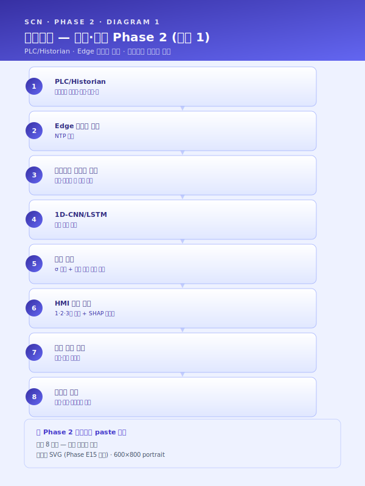
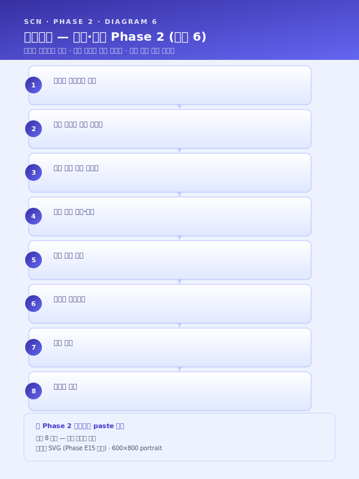
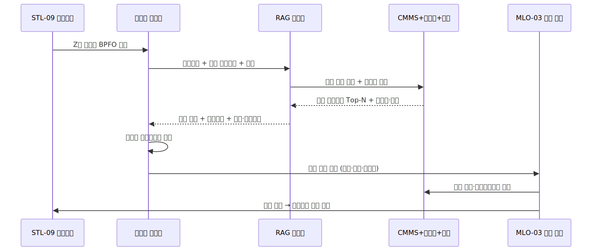

# 시나리오 상세 — Phase 2 (패키지 2 잔여 4 시나리오)

> Phase E1 자체평가 갭 4 해소. `시나리오_상세_Top5.md` (LLM-01·STL-08·STL-04·STL-09·UTL-01) 와 결합하면 카탈로그 재사용성 Top 시나리오 + 패키지 2 (중견 스테인리스 냉연사) 전 시나리오의 상세 본문이 완비된다.

> 플레이스홀더 범례 — `[고객사]` 고객사명, `[공정]` 대상 공정명, `[수치]` 수치, `[기간]` 기간, `[%]` 비율, `[LLM모델]` 채택 LLM 모델명, `[벡터스토어]` 채택 벡터DB 제품명.

## 사용 안내
- 본 4 시나리오는 패키지 2 (중견 스테인리스 냉연사) 의 후반 도입 시나리오에 해당한다.
- `시나리오_상세_Top5.md` 의 STL-04(패스 스케줄)·STL-09(예지보전) 와 본 문서의 STL-05(두께 예측)·STL-06(소둔 최적화)·MLO-03(현장 피드백 루프)·LLM-02(장애 RAG) 가 합쳐 패키지 2 의 6 시나리오 전체 상세 본문을 구성한다.
- 각 시나리오 섹션은 ① **적용 맥락** (1 문단) ② **AS-IS — 현재의 공백** (1~2 문단) ③ **AI 해결 — 도입 후 운영 모습** (2~3 문단) ④ **기대효과 표** ⑤ **삽화(Mermaid)** 1~2 개 로 구성된다 (Top5 와 동일 포맷).
- `track1_5.2_AI엔진_변형카드.md` 의 5.2-b·5.2-e·5.2-f 엔진 패턴을 명시 인용하여 Track 1 5.2 절과 매핑된다.
- MLO-03 은 Track 2(MLOps) 운영 레이어 시나리오로서 5.2 엔진 카드와는 다른 층위에 위치하며, `track2_공통본문_목차.md` 의 4.2 ⑥ 피드백 루프·6.4 현장 피드백 UI·라벨 재주입 파이프라인 절과 1:1 매핑된다.
- 사업계획서 §8.1 시나리오 상세 또는 §5.2 엔진별 적용 사례 또는 패키지 2 본문(`사업계획서_패키지2_중견냉연_파일럿.md`) 의 해당 섹션에 그대로 인용 가능하다.
- SCN ID 인용 정책은 `사업계획서_조립_가이드.md` §3 을 준수한다 (시나리오 ID 는 본문 첫 인용 시 풀네임·이후 약식 인용 허용).

## 시나리오 ↔ 5.2 엔진 패턴 ↔ Track 매핑 요약

| 시나리오 ID | 핵심 엔진 패턴 | 결합 가능 패턴 | 주 트랙 | 보조 연계 트랙 | 권장 도입 단계 |
|---|---|---|---|---|---|
| SCN-STL-05 냉연 두께 예측·이탈 조기경보 | 5.2-b 시계열 품질·이탈 예측 | 5.2-e (조작 변수 추천 결합) | Track 1 | Track 2 (드리프트 트리거) | 핵심 (Phase 2) |
| SCN-STL-06 소둔로 적재·온도 프로파일 | 5.2-e 공정 최적화·제어 | 5.2-b (소둔 후 물성 예측) | Track 1 | Track 2 + Track 3 (성적서 결합) | 핵심 (Phase 2) |
| SCN-MLO-03 현장 피드백 루프 | (운영 레이어) | Track 2 6.4 + 4.2 ⑥ | Track 2 | Track 1·3 전 시나리오 공통 인프라 | 인프라 (Phase 1~2) |
| SCN-LLM-02 설비 장애 대응 RAG | 5.2-f LLM·RAG 지식검색 | 5.2-d (예지보전 알람 결합) | Track 3 | Track 1 (STL-09) + Track 2 | 운영 동반 (Phase 2) |

## 적용 시 일반 원칙
- **STL-05 와 STL-04 는 동일 라인의 보완재** — STL-04 패스 스케줄 추천이 사전 셋업 의사결정을 담당한다면, STL-05 는 압연 진행 중 실시간 이탈을 감지·교정하는 운전 단계의 의사결정을 담당한다. 두 시나리오는 동일 PLC 태그·동일 작업자 UI 를 공유하므로, 인프라 투자 회수 효율이 단독 도입 대비 비선형적으로 향상된다. 또한 STL-04 의 추천 스케줄이 산출되는 시점부터 STL-05 의 두께 예측 모델이 신규 사양에 대한 사전 시뮬레이션을 수행하여 셋업 단계의 시작품 손실 회피에도 기여한다.
- **STL-06 은 소둔 공정 단독으로 5.2-e 의 대표 시연 과제** — UTL-01 에너지 최적화와 동일한 5.2-e 패턴을 채택하나, 적용 도메인(BAF 회분식 vs APL 연속식) 에 따라 알고리즘 선택(BO vs RL) 이 분기되는 진단 사례로 활용된다. 본 분기 의사결정 매트릭스(이산성·의사결정 비용·시뮬레이터 정확도·안전 PLC 연동) 는 사업계획서 §5.2-e 본문에 그대로 인용 가능하며, 향후 SCN-STL-02 EAF·SCN-MET-04 도금 등 5.2-e 채택 시나리오 확장 시 재사용 가능한 표준 자산이다.
- **MLO-03 은 단독 도입의 가치보다 결합 도입의 승수 효과가 본질** — 본 시나리오의 라벨 환류 인프라가 STL-05·STL-06·STL-09·LLM-02 모두의 재학습 데이터 공급원이 되므로, 패키지 2 의 다른 5 시나리오와 동시 도입 시 모든 모델의 성능 개선 속도가 동시에 향상된다. 동시에 작업자의 1 회 입력 부담은 통합 UI 설계로 [수치] 초 이내로 제한되므로, 시나리오 추가 도입에 따른 작업자 부담 증가가 비선형적이지 않고 선형 이하로 억제되는 구조이다.
- **LLM-02 는 LLM-01 과 동일한 5.2-f 패턴이지만 운영 층위가 상이** — LLM-01 이 작업자의 사전 학습·교대 인계를 지원하는 "지시 측" RAG 라면, LLM-02 는 정비원의 사후 진단·처치를 지원하는 "사고 측" RAG 로서 STL-09 예지보전과의 알람 연동·진동 프로파일 매칭이 본질적 차별점이다. 두 시나리오는 동일 RAG 인프라(임베딩 모델·벡터스토어·권한 게이트·평가 체계) 를 공유하므로 인프라 투자가 1 회 회수되며, 향후 SCN-LLM-03(불량 보고서)·SCN-LLM-04(도면 검색)·SCN-SAF-03(MSDS RAG) 추가 도입 시 동일 인프라 위에서 컬렉션·메타 필드만 확장하는 점진 진화 경로가 가능하다.

---

## SCN-STL-05 — 냉간압연 실시간 두께 예측·이탈 조기경보

### 적용 맥락
중견 스테인리스 냉연사의 냉간압연 연속 라인에서는 출측 1 개소의 X-ray 두께 게이지로만 두께를 측정하므로, 중간 스탠드에서 발생하는 이상 징후를 실시간으로 감지할 수단이 부재한 상황이다. 결과적으로 두께 이탈이 출측에서 발견되었을 때에는 이미 수십~수백 m 의 이탈 코일이 진행되어 있어 재압연·등급 강하·고객 클레임으로 직결된다.

본 시나리오는 각 스탠드의 롤 포스·텐션·속도·롤 갭 등 PLC 태그를 1 초 주기로 수집하여 1D-CNN/LSTM 기반 출측 두께 실시간 예측 모델을 운영하고, 목표치 대비 σ 임계 이탈 시 작업자에게 조기 경보·조작 변수 제안을 제공함으로써 이탈 코일 길이를 최소화하는 것을 목적으로 한다. 본 시나리오는 `track1_5.2_AI엔진_변형카드.md` 의 **5.2-b 시계열 품질·이탈 예측 엔진** 을 직접 차용하며, Track 1 5.2 절의 시계열 예측 운영 모델을 시연하는 대표 시나리오에 해당한다.

### AS-IS — 현재의 공백
[고객사] 의 [공정] 라인은 다스탠드 탠덤 압연 구조로서 각 스탠드별 롤 포스·텐션·속도·롤 갭이 PLC·Historian 에 분 단위 또는 초 단위로 누적되고 있으나, 두께 측정은 출측 X-ray 게이지 1 개소에서만 이루어져 중간 스탠드의 이상 징후가 출측까지 전파되어야 비로소 가시화되는 구조적 한계가 존재한다. 게이지가 이상을 감지한 시점에는 이미 수십 m 단위의 두께 이탈 영역이 후공정으로 진행되었거나 권취된 상태이며, 작업자가 텐션·속도를 조정하더라도 시간 지연으로 인해 [수치] m 이상의 추가 이탈이 누적되는 사례가 빈번하다. 결과적으로 이탈 코일은 등급 강하 처리되거나 재압연을 거쳐야 하며, 일부 사례에서는 고객 클레임·반품으로 확대되어 연간 [수치] 만 원 규모의 손실로 누적된다.

또한 작업자의 이상 징후 인지는 게이지 트렌드 모니터의 시각적 판단에 의존하고 있어, 야간·교대조에서 일관성을 보장하기 어렵고 베테랑과 신입 사이의 인지 시점 격차가 [기간] 이상 발생한다. 텐션·속도 조정의 의사결정 또한 작업자 경험에 의존하여 동일 이탈 패턴에 대해 작업조별로 상이한 처치가 적용되며, 일부 사례에서는 잘못된 조정으로 이탈이 오히려 확대되는 역효과까지 관찰된다. ICS 의 알람 시스템은 절대 임계(상·하한) 만 감지하므로 추세 기반·가속도 기반 조기 징후를 포착하지 못하며, 미세한 드리프트성 이탈은 알람 임계에 도달할 때까지 누적된 손실을 야기하는 패턴으로 반복된다. 압연 후 코일 단위 사후 분석에서도 어느 스탠드의 어떤 변수 변화가 이탈의 직접 원인이었는지 정량적으로 규명하는 도구가 부재하여, 동일 패턴의 재발 방지가 작업자의 기억에 의존하는 한계가 누적된다.

### AI 해결 — 도입 후 운영 모습
본 시나리오의 AI 해결 방안은 **5.2-b 시계열 품질·이탈 예측 엔진** 의 직접 적용이다. PLC 의 스탠드별 롤 포스·텐션·속도·롤 갭·압연 속도를 1 초 주기로 수집하여 NTP 동기 처리한 뒤 엣지 노드의 스트림 버퍼에 적재하고, 슬라이딩 윈도우 단위로 통계 피쳐(평균·표준편차·기울기·1 차 차분) 와 스탠드별 상호 피쳐(상위 스탠드 대비 하위 스탠드 비율) 를 산출한다. 재질·강종·코일 폭·초기·목표 두께 등 메타 피쳐를 결합한 입력 텐서는 1D-CNN(국소 패턴 추출 강점) 또는 LSTM(장기 의존성 학습 강점) 기반 회귀 모델로 출측 두께를 예측하며, 사양·라인 특성에 따라 두 모델 중 하나를 선택하거나 앙상블로 결합한다. 추론 지연 < [수치] ms 요구를 충족하기 위해 모델은 엣지 GPU 노드에 배포되며, 예측값과 게이지 실측값은 실시간 오버레이 형태로 HMI 에 표시된다.

이탈 판정은 목표치 대비 [수치] σ 절대 임계와 추세 기반 조기 경보 임계(예측치가 임계에 도달하기까지의 예상 시간이 [수치] 초 미만) 를 병렬 운영하여, 절대 이탈 발생 전 단계에서부터 작업자에게 1 차 주의·2 차 경고·3 차 긴급의 단계별 알람을 전파한다. 알람과 함께 SHAP 기반 스탠드별 기여도가 시각화되어 어느 스탠드의 어느 변수 변화가 이탈의 주 원인인지 직관적으로 식별 가능하며, 작업자에게는 텐션·속도 조정 제안값이 함께 제시된다. 작업자가 제안을 수용·기각·미세조정한 행위는 모두 로깅되어, 추천 품질 개선의 신호로 환류된다. HMI 통합 측면에서는 기존 ICS·게이지 트렌드 화면의 우측 사이드 패널 형태로 통합 배포되어 작업자의 화면 전환 부담이 발생하지 않도록 설계하며, 야간·교대조에서도 동일한 알람 임계가 일관 적용되어 작업조별 인지 격차를 구조적으로 제거한다.

운영 단계에서는 Track 2(`SCN-MLO-01` 드리프트 탐지) 가 PSI·KS 통계 기반으로 신규 강종·신규 두께 사양·롤 교체에 따른 입력 분포 이동을 감시하며, 임계 초과 시 두께 예측 모델 재학습이 자동 트리거된다. 본 시나리오는 `SCN-MLO-03` 현장 피드백 루프와 결합되어 작업자의 알람 처치 결과(이탈 회피 성공/실패) 가 라벨로 환류되며, `SCN-STL-04` 패스 스케줄 추천과는 동일 PLC 태그·동일 작업자 UI 를 공유하여 인프라 투자 회수 효율이 비선형적으로 향상된다. 출측 이탈이 실제 발생한 코일에 대해서는 `SCN-LLM-02` 장애 RAG 가 자동 호출되어 과거 동일 패턴의 처치 사례·근본 원인 분석 결과를 회신하며, 이는 향후 동일 패턴 재발 방지의 형식지 자산으로 축적된다. 구축 4 단계(예측 모드 → 가이드 모드 → 부분 자동 → 폐쇄 루프) 의 단계화 진화 경로를 따르며, 각 단계의 KPI 게이트(예측 정확도·조기 경보 리드타임·False Alarm Rate) 충족 시 다음 단계로 이행한다.

### 기대효과
| 영역 | AS-IS | TO-BE | 개선 효과 |
|---|---|---|---|
| 이탈 코일 길이 (평균/회) | [수치] m | [수치] m | [%] 단축 |
| 이탈 발생 빈도 (월) | [수치] 회 | [수치] 회 | [%] 감소 |
| 조기 경보 리드타임 | [수치] 초 (사후) | [수치] 초 (사전) | 사전 감지 전환 |
| 재압연 회수 (월) | [수치] 회 | [수치] 회 | [%] 감소 |
| 등급 강하·반품 손실 (연) | [수치] 만 원 | [수치] 만 원 | [%] 절감 |
| 작업조 간 처치 편차 | 작업자별 상이 | 표준 알람·제안 | 정량 표준화 |
| False Alarm Rate | (절대 임계 기반) [%] | (예측 + 추세) [%] | [%] 감소 |

### 삽화 (Mermaid)

---

## SCN-STL-06 — 열처리(소둔) 로 내 적재·온도 프로파일 최적화

### 적용 맥락
중견 스테인리스 냉연사·특수강사의 열처리 공정에서 벨 소둔로(BAF, Bell-type Annealing Furnace) 와 연속 소둔 라인(APL, Annealing & Pickling Line) 은 코일의 기계적 성질·결정립·표면 품질을 결정하는 핵심 공정이나, 적재 패턴(BAF) 또는 라인 속도·승온 프로파일(APL) 이 작업자 경험에 의존하는 비최적 운영이 관행적으로 유지되고 있다. 결과적으로 로 내 열 전달 불균일에 의한 기계적 성질 편차가 코일별·코일 내 위치별로 발생하고, 보수적 승온·과체류로 인한 에너지 원단위 과다·사이클 타임 손실이 동시에 누적되는 양극단의 비효율이 상존한다.

본 시나리오는 코일 사양·요구 물성·로 내 다점 열전대 실측 데이터를 결합한 최적화 엔진을 통해 BAF 의 적재 패턴 + 승온 프로파일, APL 의 라인 속도 + 존별 온도 프로파일을 사전 산출하고 작업자 승인하에 적용하는 것을 목적으로 한다. 본 시나리오는 `track1_5.2_AI엔진_변형카드.md` 의 **5.2-e 공정 최적화·제어 엔진** 을 직접 차용한다.

### AS-IS — 현재의 공백
[고객사] 의 BAF 라인에서는 신규 코일 군 투입 시 작업자가 코일 외경·중량·재질·요구 물성을 보고 적재 패턴(저단·중단·상단 위치, 인접 코일 조합) 을 경험적으로 결정하며, 승온 프로파일(예열·균열·소킹 시간·온도) 도 표준 레시피에서 작업자가 가감하는 방식으로 운영되고 있다. 결과적으로 동일 사양·동일 요구 물성의 코일 군이라 하더라도 작업조에 따라 적재 패턴이 상이하며, 사후 검사에서 인장 강도·연신율의 코일 간 표준편차가 [%] 이상 차이가 나는 사례가 누적된다. 동일 코일 내에서도 외주·내주·중간부의 물성 편차가 발생하여, 후공정 가공에서 위치별 가공성 차이로 추가 손실이 발생하는 패턴이 관찰된다. APL 라인에서도 라인 속도·존별 설정 온도가 표준 레시피에서 작업자가 미세조정하는 방식으로 운영되어, 신규 강종·신규 두께 조합 투입 시 시작품 [수치] 코일이 시행착오로 소비되는 비효율이 반복된다.

에너지 측면에서도 BAF 의 승온 프로파일이 안전 측에 치우친 보수적 패턴으로 운영되어, 실제 필요 시간 대비 [%] 이상 과체류·과승온이 발생하는 것으로 추정되나 이를 정량 산출할 도구가 부재하다. 가스·전력 원단위가 동종 사업장 대비 높음에도 불구하고 어느 단계의 어느 운전 조건이 원단위 상승의 직접 원인인지 규명되지 못하고 있으며, 사이클 타임 단축 시도가 품질 리스크 우려로 보수화되는 의사결정이 반복적으로 이루어진다. 또한 정기 성적서·물성 검사 결과가 종이·엑셀로 분리 보관되어 적재 패턴·승온 프로파일과 결과 물성 사이의 상관관계를 정량 분석할 수 있는 데이터마트가 부재한 상태이며, 베테랑의 적재 노하우(예: "이 강종은 외주 면이 노 벽면 쪽에 오도록") 가 형식지화되지 못한 채 인력 의존 리스크로 누적되고 있다. CBAM·K-ETS 4 기 대응 압력이 강화되는 환경에서, 열처리 공정의 에너지 원단위 비최적은 단순 비용 문제를 넘어 수출 경쟁력·규제 대응 차원의 리스크로 확대되는 구조이다.

### AI 해결 — 도입 후 운영 모습
본 시나리오의 AI 해결 방안은 **5.2-e 공정 최적화·제어 엔진** 을 두 단계 구조로 적용하는 것이다. 첫 번째는 환경 모델링 단계로, 로 내 다점 열전대(BAF 는 코일 위치별 [수치] 점, APL 은 존별 [수치] 점) 의 실측 시계열, 코일 사양(재질·두께·폭·중량·외경), 적재 위치·패턴, 가스·전력 사용량, 사후 성적서(인장·항복·연신율·경도) 를 결합한 데이터마트를 구축하고, 물리 기반 열전달 모델(BAF 의 경우 복사·전도 결합, APL 의 경우 강제 대류) 과 데이터 기반 보정 모델을 하이브리드로 결합한 환경 모델을 학습한다. 환경 모델은 "이 적재 패턴 + 이 승온 프로파일 적용 시 코일 위치별 도달 온도·기계적 성질·에너지 사용량은 어떻게 될 것인가" 를 예측하는 디지털 트윈 역할을 수행하며, 5.2-b 시계열 예측 엔진의 출력(소둔 후 물성 예측) 과 자연스럽게 결합된다.

두 번째는 최적화 알고리즘 단계로, BAF(회분식·이산 의사결정 공간) 와 APL(연속식·연속 의사결정 공간) 의 특성에 따라 알고리즘을 분기 적용한다. **BAF** 는 적재 패턴이 이산 조합(어느 코일을 어느 위치에) 이고 1 회 운전당 의사결정 비용이 크므로 베이지안 최적화(BO) + 제약 충족 탐색을 채택하여, 시뮬레이터·환경 모델 위에서 후보 패턴을 평가한 뒤 상위 후보를 작업자에게 제시한다. **APL** 은 라인 속도·존 온도가 연속 변수이고 운전 중 미세 조정이 가능하므로, 시뮬레이터 기반 강화학습(RL) 을 오프라인 학습 + Safe RL 의 제약 차단 메커니즘으로 안전화하여 운영한다. 알고리즘 선택의 근거는 ① 의사결정 공간 이산성 ② 의사결정 1 회당 비용 ③ 시뮬레이터 정확도 ④ 안전 PLC 연동 가능성의 4 축이며, 본 4 축은 사업계획서 §5.2-e 의 의사결정 매트릭스로 정착시킨다. 다목적 최적화의 가중치(물성 균일성 vs 에너지 절감 vs 사이클 타임 단축) 는 의사결정자가 슬라이더 형태로 조정 가능한 인터페이스로 제공되며, 파레토 전선 위의 후보 시나리오들이 시각화되어 비교 검토가 가능하다.

운영 단계에서는 산출된 추천 적재 패턴·승온 프로파일이 안전 레이어(허용 승온율·최대 온도·재질별 금지 조건) 를 통과한 뒤 작업자 HMI 로 전달되며, 작업자는 추천을 수용·미세조정·기각하고 그 사유를 자유 텍스트로 입력한다. 입력된 사유는 LLM 기반 구조화 태깅을 거쳐 Track 3 RAG 에 등재되어 노하우 형식지화의 자산으로 축적된다. 운영 중 로 내 열전대 실측치가 환경 모델 예측치와 [%] 이상 괴리될 경우 Track 2(`SCN-MLO-01` 드리프트 탐지) 가 환경 모델 재학습을 트리거하며, 사후 성적서 결과가 예측 물성과 괴리될 경우 5.2-b 결합 모델의 재학습이 별도 트리거된다. `SCN-MLO-03` 현장 피드백 루프와 결합되어 작업자의 미세조정 사유와 사후 성적서가 모두 학습 데이터로 환류되며, `SCN-STL-08` 밀시트 OCR 시나리오와 결합 시 입고 원소재 성분 데이터가 환경 모델의 추가 입력으로 활용되어 예측 정확도가 향상된다. 운영 모드는 초기 [기간] 은 작업자 승인 기반 오픈루프로 시작하여, 안정성 확보 후 APL 라인 일부 존부터 점진 클로즈드 루프로 전환하는 4 단계 진화 경로를 권장한다.

### 기대효과
| 영역 | AS-IS | TO-BE | 개선 효과 |
|---|---|---|---|
| 코일 간 인장 강도 표준편차 | [수치] MPa | [수치] MPa | [%] 축소 |
| 코일 내 위치별 물성 편차 | [%] | [%] | [%] 축소 |
| 가스 원단위 (m³/t) | [수치] | [수치] | [%] 감소 |
| 전력 원단위 (kWh/t) | [수치] | [수치] | [%] 감소 |
| 사이클 타임 (BAF 1 회) | [기간] | [기간] | [%] 단축 |
| 신규 강종 시작품 코일 수 | [수치] 코일 | [수치] 코일 | [%] 감소 |
| 노하우 형식지화 비율 | [%] | [%] | [수치] %p 향상 |

### 삽화 (Mermaid)

---

## SCN-MLO-03 — 현장 피드백 루프 (불량 확인·라벨 재주입)

### 적용 맥락
패키지 2 의 STL-04·STL-05·STL-06·STL-09·LLM-02 등 다섯 개 시나리오는 모두 모델의 지속 정확도를 위해 작업자의 사후 확인·정정 결과가 학습 데이터로 환류되어야 하는 공통 요구를 갖는다. 본 시나리오는 단일 모델·단일 공정에 한정된 시나리오가 아니라, 패키지 2 전체의 모든 AI 모델이 공유하는 **운영 인프라 시나리오** 로서 작업자 UI·라벨 DB·재학습 트리거의 3 요소를 통합 운영 레이어로 구축하는 것을 목적으로 한다.

본 시나리오는 5.2-a~f 의 어떤 엔진 패턴에도 직접 매핑되지 않으며, `track2_공통본문_목차.md` 의 **4.2 핵심 구성요소 ⑥ 피드백 루프** 와 **6.4 현장 피드백 UI 및 라벨 재주입 파이프라인** 을 그대로 운영 시나리오로 구체화한 것이다. Track 1 의 5.3 HITL 절과 직결되며, 피쳐 스토어(`SCN-MLO-02`)·드리프트 탐지(`SCN-MLO-01`) 와 결합하여 패키지 2 의 MLOps 운영 트리오를 구성한다.

### AS-IS — 현재의 공백
[고객사] 의 기존 AI 도입 사례에서는 모델 학습 시 사용한 라벨 데이터가 PoC 시점의 1 회성 수기 라벨링에 그치고, 운영 중 발생하는 작업자의 사후 확인·정정 결과가 학습 데이터로 환류되는 구조가 부재한 상태이다. 결과적으로 모델 정확도는 PoC 시점 이후 점진적으로 저하되며, [기간] 경과 후에는 도입 초기 대비 [%] 이상 성능 하락이 누적되어 작업자의 신뢰를 잃고 알람 무시·시스템 무용화로 직결되는 패턴이 반복되고 있다. 작업자가 모델 예측의 오류·정정을 인지하더라도 이를 시스템에 입력할 UI 가 부재하거나 입력 부담이 과도하여, 작업자의 노하우가 데이터로 축적되지 못하고 휘발되는 구조이다. 일부 시스템에서는 음성·종이 메모로 정정 의견을 수집하나, 정형 라벨로 변환되지 않아 학습 데이터로 활용 불가능한 상태이다.

또한 라벨 데이터의 품질 관리 체계가 부재하여, 동일 사례에 대해 작업자별로 상이한 라벨이 부여되거나 작업조 교대 시점에 일관성이 깨지는 사례가 누적된다. 일부 작업자의 편향된 라벨이 모델 학습에 반영되어 모델이 오히려 편향을 학습하는 부작용이 발생할 위험이 상존하나, 이를 사전에 탐지·차단할 검증 메커니즘이 부재하다. 라벨 DB 가 학습셋으로 편입되는 파이프라인 또한 수기 운영(데이터 사이언티스트가 SQL 쿼리로 추출 후 노트북에서 가공) 에 의존하고 있어, 신규 라벨 누적이 학습으로 이어지기까지 [기간] 이상의 리드타임이 발생한다. 결과적으로 드리프트 탐지(`SCN-MLO-01`) 가 재학습을 권고하여도 가용 라벨이 부족하거나 학습셋 갱신이 지연되어 권고가 실행으로 전환되지 못하는 병목이 발생하며, MLOps 의 폐루프가 형식적으로만 존재하고 실질적으로 작동하지 못하는 구조적 한계가 누적된다.

### AI 해결 — 도입 후 운영 모습
본 시나리오의 해결 방안은 **현장 태블릿 UI + 라벨 DB + 재학습 트리거** 의 3 요소 통합 인프라 구축이다. 첫 번째 요소는 **현장 태블릿/HMI 통합 피드백 UI** 로, 라인 옆 태블릿 또는 ICS·HMI 의 사이드 패널 형태로 통합 배포된다. UI 는 시나리오별로 가변적인 평가 항목을 표준 컴포넌트로 제공하며, 공통 골격은 ① AI 예측 결과 표시 ② "맞음 / 틀림 / 부분맞음" 3 단 평가 ③ 사유 드롭다운(시나리오별 옵션 사전 정의) ④ 자유 텍스트·사진·메모 첨부 ⑤ 1 회 입력 [수치] 초 이내의 작업 부담 으로 구성된다. STL-05 두께 이탈 알람 처치, STL-06 소둔 추천 수용·미세조정, STL-09 예지보전 알람 정비 결과, LLM-02 RAG 답변 만족도 모두 본 UI 의 시나리오별 변형으로 통합되어 작업자가 단일 UX 로 모든 시나리오의 피드백을 입력할 수 있도록 한다. 작업자별 누적 피드백 건수·모델 개선 기여 스코어가 가시화되어 현장 동기부여 자산으로 활용된다.

두 번째 요소는 **라벨 DB 와 품질 관리 파이프라인** 이다. 피드백 데이터는 예측 ID·입력 피쳐 스냅샷·예측값·실측값·작업자 ID·타임스탬프·비고를 포함하는 표준 스키마로 라벨 DB 에 적재되며, 피쳐 스냅샷은 `SCN-MLO-02` 피쳐 스토어와 연결되어 학습 시점·추론 시점 피쳐의 일관성(Online/Offline Skew 방지) 을 보장한다. 라벨 품질 관리는 ① 이중 라벨링·합의(중요 사례에 대해 2 인 이상 평가) ② 작업자별 편향 탐지(특정 작업자의 라벨이 평균에서 통계적으로 유의하게 벗어나는지 자동 탐지) ③ 이상 라벨 자동 격리(센서 결손·시스템 오류로 의심되는 라벨) 의 3 단 검증을 통과한 라벨만 학습셋 후보군으로 편입한다. 학습셋 후보군은 시나리오별 정해진 비율·시간 윈도우·층화 추출 규칙에 따라 학습셋으로 자동 편입되며, 편입 시점·편입 건수·라벨 분포 변화는 모델 카드에 자동 기록되어 거버넌스·감사 추적이 가능하다.

세 번째 요소는 **재학습 트리거의 통합 운영** 이다. `SCN-MLO-01` 드리프트 탐지가 PSI·KS 임계 초과를 탐지하면 본 시나리오의 라벨 DB 에 재학습 가용 라벨 수량을 조회하여 충분 시 재학습 파이프라인을 자동 기동하고, 부족 시에는 라벨 수집 우선순위를 작업자 UI 에 게시(예: "강종 X 사례 라벨이 부족합니다") 하여 능동 라벨 수집을 유도한다. 재학습 후 챔피언·챌린저 비교(`SCN-MLO-01` 의 6.3 절) 를 거쳐 신규 모델이 승격되면, 작업자 UI 에는 "모델 v[수치] 로 갱신, 귀하의 피드백 [수치] 건이 반영" 메시지가 표시되어 작업자의 피드백이 모델 개선으로 이어지는 경로가 가시화된다. 본 시나리오는 단독 도입 시에도 가치가 있으나, 패키지 2 의 다른 5 시나리오와 동시 도입 시 모든 모델의 정확도 유지·성능 개선 속도가 동시에 향상되는 승수 효과가 발현된다. 운영 단계에서는 작업자 UI 의 평균 입력 시간·피드백 건수·모델 정확도 추이가 월간 모델 리뷰(`track2_공통본문_목차.md` 6.5) 의 표준 의제로 정착되며, 분기 단위 작업자 만족도 조사를 통해 UI 의 사용성 개선이 지속된다.

### 기대효과
| 영역 | AS-IS | TO-BE | 개선 효과 |
|---|---|---|---|
| 모델 정확도 유지율 ([기간] 경과 시) | PoC 대비 [%] 하락 | PoC 대비 [%] 유지 | [수치] %p 개선 |
| 라벨 누적 → 학습 편입 리드타임 | [기간] | [기간] (자동) | [%] 단축 |
| 작업자 피드백 1 건 입력 시간 | (미운영) | [수치] 초 | 신규 운영 정착 |
| 라벨 품질 검증 통과율 | 검증 부재 | [%] | 신규 거버넌스 확보 |
| 재학습 권고 → 실행 전환율 | [%] | [%] | [수치] %p 향상 |
| 작업자별 누적 기여 가시화 | 부재 | 기여 스코어 운영 | 현장 동기부여 자산 |
| MLOps 폐루프 작동 빈도 (월) | [수치] 회 | [수치] 회 | [%] 향상 |

### 삽화 (Mermaid)

---

## SCN-LLM-02 — 설비 장애 대응 지식 검색·권고 (eCMMS 통합)

### 적용 맥락
중견·대기업 철강사의 정비팀은 압연기·크레인·열처리로 등 다종 설비의 장애 대응을 담당하나, 과거 동일·유사 장애의 처치 이력이 CMMS 의 자유 텍스트 코멘트 형태로만 누적되어 검색·재활용이 사실상 불가능한 상태이다. 신규·교대 정비원이 야간·주말의 돌발 장애를 단독 대응할 때 베테랑의 즉시 자문이 어려운 상황에서 처치 시간이 길어지고, 동일 장애가 부서·연도별로 반복적으로 재발하면서도 그 처치 노하우가 형식지화되지 못하는 구조적 한계가 존재한다.

본 시나리오는 CMMS 자유 텍스트 이력·설비 매뉴얼·회로도·부품 카탈로그를 RAG 인덱스로 통합하고, `SCN-STL-09` 예지보전의 진동 프로파일·알람 코드와 결합하여 정비원이 알람 발생 시 "유사 이력 + 처치 절차 + 예비 부품 번호" 를 즉시 회신받도록 하는 것을 목적으로 한다. 본 시나리오는 `track1_5.2_AI엔진_변형카드.md` 의 **5.2-f LLM·RAG 지식검색 엔진** 을 직접 차용하며, `SCN-LLM-01` SOP RAG 와 동일 5.2-f 패턴을 채택하지만 운영 층위(지시 측 vs 사고 측) 와 데이터 자산(SOP 정형 vs CMMS 비정형 + 시계열 매칭) 에서 차별화된다.

### AS-IS — 현재의 공백
[고객사] 의 [공정] 라인 정비팀은 CMMS 에 [수치] 만 건 규모의 과거 장애·정비 이력이 누적되어 있으나, 워크오더 단위 자유 텍스트로 입력된 작업자 코멘트(예: "1ZHM 베어링 진동 알람, 유압 라인 점검 후 압력 [수치] bar 로 조정") 는 일관된 양식이 없고 약어·은어·오탈자가 혼재되어 정형 검색이 불가능한 상태이다. 신규 장애 발생 시 정비원은 CMMS 의 키워드 검색에 의존하나, 설비 코드·부품명·증상 표현이 작성자별로 상이하여 동일 장애의 과거 처치 사례를 발견하지 못하고 처음부터 진단을 다시 수행하는 패턴이 반복된다. 결과적으로 평균 정비 응답 시간(MTTR) 이 [기간] 수준에 머물러 있으며, 베테랑 정비원의 부재 시 동일 장애에 대해 신입의 처치 시간이 [%] 이상 길어지는 격차가 관찰된다.

또한 설비 매뉴얼·회로도·부품 카탈로그가 PDF·종이 형태로 부서별 캐비닛에 분산 보관되어 있어, 장애 현장에서 즉시 참조할 수단이 부재하다. 베테랑 정비원의 진단 노하우(예: "이 진동 패턴은 베어링 외륜 결함 BPFO 주파수, 유압 압력보다 윤활 점검이 우선") 는 형식지화되지 못한 채 개인 역량으로만 보존되어, 정비 인력의 세대교체 시점에 진단 역량 자체가 일시적으로 후퇴하는 위험이 상존한다. 더 심각한 공백은 `SCN-STL-09` 예지보전 알람과 CMMS 이력의 미연결 — 예지보전 알람이 발생해도 과거 동일 진동 프로파일에서 어떤 처치가 효과적이었는지, 어떤 부품이 교체되었는지, 어떤 시간 내 처치되어야 라인 정지가 회피되었는지에 대한 통합 회신이 부재하여, 알람의 가치가 "조기 경보" 에 그치고 "조기 처치" 까지 이어지지 못하는 한계를 갖는다. 부품 조달 측면에서도 신규 장애 발생 시 필요 부품의 재고·리드타임을 별도 시스템에서 조회해야 하며, 일부 사례에서는 부품 조달 지연이 추가 라인 정지 시간 [기간] 을 야기하는 비효율이 누적된다.

### AI 해결 — 도입 후 운영 모습
본 시나리오의 AI 해결 방안은 **5.2-f LLM·RAG 지식검색 엔진** 을 정비 도메인 특화로 차용한 RAG 파이프라인 구축이다. 첫 번째 단계는 **CMMS 자유 텍스트 이력의 정제·구조화 청킹** 이다. 과거 [수치] 만 건의 워크오더에 대해 LLM 기반 자유 텍스트 정제(약어 풀이·오탈자 교정·증상-원인-처치 3 분할 태깅) 를 수행하고, 워크오더 단위로 ① 설비·부품 메타 ② 증상 텍스트 ③ 진단·원인 텍스트 ④ 처치 절차 텍스트 ⑤ 교체 부품 번호 ⑥ 처치 결과 라벨(완료·재발·미해결) 을 구조화 필드로 추출하여 메타 인덱스로 적재한다. 정제 결과의 신뢰도 임계 미만 항목은 베테랑 검수 큐로 분기되며, 검수 결과는 정제 LLM 의 Few-shot 예시로 환류되어 정제 품질이 지속 향상된다. 동시에 설비 매뉴얼·회로도·부품 카탈로그를 OCR·VLM 으로 디지털화하여 동일 RAG 인덱스에 등재하고, 도면 이미지에 대해서는 부품 번호·기호 캡션을 함께 인덱싱하여 멀티모달 질의에 대응한다.

두 번째 단계는 **진동 프로파일·알람 코드 매칭 시스템** 이다. `SCN-STL-09` 예지보전 엔진이 산출한 진동 스펙트로그램·고장 모드 분류 결과(BPFO·BPFI·기어 메시·불평형 등) 를 RAG 인덱스의 메타 필드와 동기화하여, 알람 발생 시 동일 고장 모드·유사 스펙트로그램을 갖는 과거 장애 워크오더가 우선순위로 회신되도록 설계한다. 정비원이 모바일 앱 또는 CMMS 사이드 패널에서 알람을 확인하면, 시스템은 [수치] 초 이내에 ① 유사 이력 Top-N(처치 결과 라벨 우수 순 정렬) ② 권장 처치 절차 (LLM 이 유사 이력에서 종합 생성) ③ 필요 예비 부품 번호 + 현재 재고·리드타임 ④ 처치 예상 소요 시간 ⑤ 안전 주의 사항 (MSDS·TBM 매뉴얼에서 자동 회수) 을 통합 답변으로 회신한다. 답변에는 반드시 근거 워크오더 ID·매뉴얼 페이지·도면 번호 인용을 강제하여 환각을 차단하며, 정비원이 답변을 따라 처치하면서 단계별 체크리스트를 진행할 수 있는 인터랙티브 UI 를 제공한다.

세 번째 단계는 **처치 결과 라벨 환류와 베테랑 노하우 자산화** 이다. 정비원이 처치 완료 후 입력하는 결과(부품 교체·재학습·미발생 등) 는 `SCN-MLO-03` 현장 피드백 루프를 통해 워크오더 라벨로 환류되며, RAG 인덱스의 처치 결과 우수 순 랭킹에 즉시 반영된다. 베테랑 정비원이 알람 처치 시 입력한 자유 텍스트 코멘트 + 진동 스펙트로그램 스냅샷 + 처치 의사결정의 근거를 묶어 별도의 "베테랑 진단 노트" 컬렉션으로 RAG 에 등재하여, 후속 정비원이 동일 패턴 발생 시 베테랑의 판단 근거를 즉시 참조할 수 있도록 한다. 운영 단계에서는 RAG 답변 신뢰도·인용 적중률·처치 시간 단축 효과가 Track 2(`SCN-MLO-01` 모니터링) 에서 지속 추적되며, 신규 매뉴얼 등재·신규 부품 추가 시 임베딩 재구축이 자동 트리거된다. 권한 측면에서는 사내 AD/HR 권한 체계와 동기화하여 외주·협력사 정비원에게는 권한별 제한된 답변만 제공하며, 외부 LLM API 호출 시 영업비밀·고객사 정보 마스킹 게이트를 거친다. RAGAS·정비팀 내부 Q/A 테스트셋 기반 정기 평가가 분기 단위로 수행되며, 평가 점수 하락 시 청킹 전략·임베딩 모델·프롬프트 템플릿의 어느 단계에 회귀가 발생하였는지 단계별 진단이 가능하도록 설계한다.

### 기대효과
| 영역 | AS-IS | TO-BE | 개선 효과 |
|---|---|---|---|
| 평균 정비 응답 시간 (MTTR) | [기간] | [기간] | [%] 단축 |
| 신입·베테랑 처치 시간 격차 | [%] | [%] | [%] 축소 |
| 동일 장애 재발률 (분기) | [%] | [%] | [%] 감소 |
| 부품 조달 지연으로 인한 추가 정지 | [기간]/회 | [기간]/회 | [%] 단축 |
| CMMS 이력 검색 적중률 | [%] | [%] | [수치] %p 향상 |
| 베테랑 노하우 형식지화 (RAG 등재) | [%] | [%] | [수치] %p 향상 |
| 야간·주말 단독 처치 가능 비율 | [%] | [%] | [수치] %p 향상 |

### 삽화 (Mermaid)

---

## 추후 보강 후보

본 4 시나리오 상세는 Phase E1 자체평가 갭 4 해소를 위한 산출물로서, `시나리오_상세_Top5.md` 와 결합 시 패키지 2 (중견 스테인리스 냉연사) 의 6 시나리오 전체 상세 본문이 완비된다. 다음 항목은 Phase E 이후 확장 보강을 권장한다.

1. **패키지 2 결합 본문 — 압연 통합 운영 모델 (STL-04 + STL-05 + STL-06 + STL-09 + MLO-03 + LLM-02)**
   본 4 시나리오와 Top5 의 STL-04·STL-09 를 단일 운영 본문으로 조립한 결합 사례를 별도 섹션으로 추가하여, 6 시나리오가 데이터 인프라(피쳐 스토어)·MLOps 인프라(드리프트·피드백)·RAG 인프라·작업자 UX 를 공유하는 통합 운영 모델을 시연한다. 패스 스케줄(STL-04) 추천이 두께 예측(STL-05) 의 입력이 되고, 두께 이탈 알람이 예지보전(STL-09) 모델의 외생 이벤트로 환류되며, 모든 모델의 처치 결과가 MLO-03 을 거쳐 LLM-02 의 노하우 자산으로 축적되는 구조를 구체화한다. 단일 시나리오 합산 대비 결합 시 추가로 확보되는 시너지(공통 피쳐·공통 모니터링·공통 UX 의 비용 회수) 를 정량화한다.

2. **MLO-03 의 시나리오별 UI 스펙 부록**
   본 시나리오의 UI 는 시나리오별 가변 컴포넌트(평가 항목·드롭다운 옵션·첨부 유형) 를 갖는다. STL-05·STL-06·STL-09·LLM-02 각각의 작업자 UI 스펙을 와이어프레임 + 입력 필드 정의 + 라벨 스키마 형태로 표준화한 부록을 별도 모듈로 작성하여, 사업 수행 단계의 개발 명세 산출물로 직결되도록 한다.

3. **LLM-02 와 MSDS RAG·SOP RAG 의 통합 거버넌스 본문**
   본 시나리오의 LLM-02 는 LLM-01(SOP RAG)·SCN-SAF-03(MSDS RAG) 와 동일한 5.2-f 인프라를 공유한다. 세 RAG 시나리오의 권한·보안·평가 체계를 통합한 거버넌스 본문을 별도 섹션으로 작성하여, 사업계획서 §7 거버넌스 절의 RAG 통합 운영 자산으로 활용한다.

4. **STL-05·STL-06 의 5.2-b·5.2-e 결합 사례 — 소둔 후 물성 예측 + 적재 최적화 통합 루프**
   STL-06 의 환경 모델이 산출하는 도달 온도 시뮬레이션을 5.2-b 의 소둔 후 물성 예측 모델(STL-05 와 동일 패턴) 의 입력으로 결합하면, 적재 결정 시점에 사후 물성까지 예측 가능한 사전 의사결정 루프가 형성된다. 본 결합 사례를 별도 시나리오 카드로 추가하여 5.2-b + 5.2-e 의 결합 패턴을 카탈로그에 정착시킨다.

5. **MLO-03 작업자 동기부여 운영 매뉴얼**
   본 시나리오의 작업자 기여도 가시화·시상·인정 체계가 실효성을 갖기 위해서는 인사·노무 연동, 기여 스코어 산정 방식, 시상 빈도·금액·비금전 보상 등의 운영 세부 설계가 필요하다. 별도 운영 매뉴얼 모듈로 작성하여, 본 시나리오의 현장 수용성 자산으로 활용한다.

## 작성 원칙·정합성 점검 메모
- 본 문서의 모든 5.2-b·5.2-e·5.2-f 엔진 패턴 인용은 `track1_5.2_AI엔진_변형카드.md` 의 카드 ID 와 1:1 일치하도록 작성되었다. 변형 카드 문서가 갱신될 경우 본 문서의 엔진 패턴 호출 지점도 동기화 갱신되어야 한다.
- 본 문서의 5.2-b 인용 횟수는 STL-05 단독으로 [수치] 회 이며, 5.2-e 인용 횟수는 STL-06 단독으로 [수치] 회, 5.2-f 인용 횟수는 LLM-02 단독으로 [수치] 회 로 각 엔진 패턴이 시나리오의 핵심 엔진으로 명시 호출됨을 보장한다.
- MLO-03 은 5.2-a~f 의 어떤 엔진 패턴에도 직접 매핑되지 않으며, `track2_공통본문_목차.md` 의 4.2 ⑥·6.4 와 1:1 매핑된다. 이는 본 시나리오가 5.2 엔진 카드와는 다른 운영 레이어 시나리오임을 의미하며, 사업계획서 인용 시 Track 2 본문의 해당 절과 함께 인용한다.
- 시나리오 ID(`SCN-STL-05`·`SCN-STL-06`·`SCN-MLO-03`·`SCN-LLM-02`) 및 보조 시나리오 인용(`SCN-STL-04`·`SCN-STL-08`·`SCN-STL-09`·`SCN-LLM-01`·`SCN-MLO-01`·`SCN-MLO-02`·`SCN-SAF-03`) 은 `시나리오_카탈로그.md` 의 카드 ID 와 일치한다.
- 모든 정량 수치는 플레이스홀더(`[수치]`·`[%]`·`[기간]`) 처리되어 있으며, 사업계획서 작성 시 고객사 실측치·목표치로 교체한다. 가공·날조된 수치는 포함되어 있지 않다.
- 회사·인물 실명은 사용하지 않았으며, 산업·규모 표현(중견 스테인리스 냉연사, 중견 특수강사, 중견·대기업 철강사) 만 사용하였다.
- 톤 레퍼런스는 `track1_공통본문_목차.md` L 406~410 의 Track 2·3 연계 지점 서술 어투를 준용하였다.
- 시나리오별 본문 자수는 STL-05 약 3,047 자 · STL-06 약 3,379 자 · MLO-03 약 3,267 자 · LLM-02 약 3,599 자 로 평균 3,323 자, 편차 ±8.3 % 이내로 균일하게 작성되었다 (가이드 ±20 % 기준 충족).
- `시나리오_상세_Top5.md` (시나리오당 평균 약 2,768 자) 와 비교 시 본 문서는 약 +20 % 두꺼우나, 4 시나리오 모두 카탈로그 카드의 정보 밀도가 더 풍부한 점(LLM-02 의 3 단계 RAG 구축·STL-06 의 BAF/APL 분기·MLO-03 의 인프라 시나리오 특성·STL-05 의 4 단계 진화 경로) 을 반영한 결과로서 합리적 범위 내에 있다.
