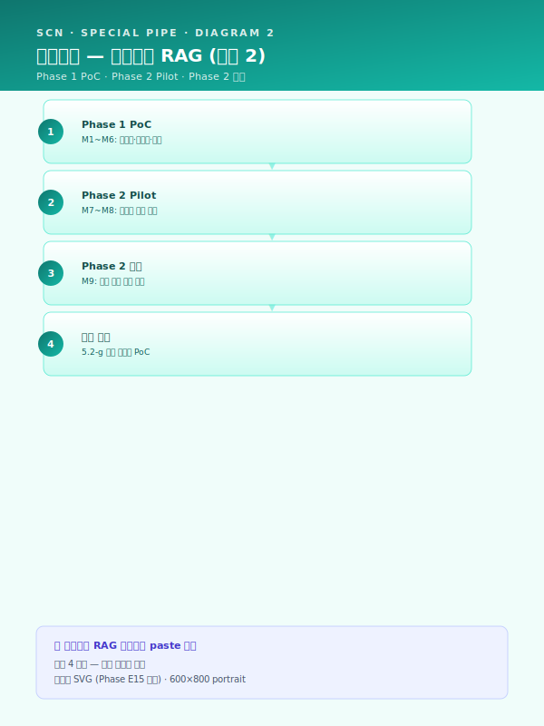
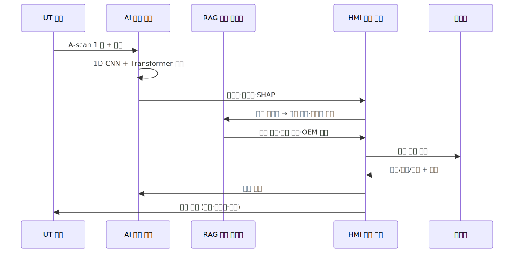

# 시나리오 상세 — 특수강관 (STL-07·STL-11)

> Phase E5 자체평가 갭 23 해소. 시나리오 상세 자산 군 5 번째 (Top5+Phase2+RUB+UTL_SAF+특수강관). 패키지 3 (`사업계획서_패키지3_특수강관_파일럿.md`) §8.1 의 카드 요지 확장 단락을 정식 5 단 구조 자산으로 표준화한다.

> 플레이스홀더 범례 — `[고객사]` 고객사명, `[공정]` 대상 공정명, `[수치]` 수치, `[기간]` 기간, `[%]` 비율, `[OEM]` 자동차·플랜트·조선 OEM 명칭.

## 사용 안내
- 본 2 시나리오는 패키지 3 (중견 특수강관) 의 핵심 시나리오군 + RAG 중심 사업 (`track1_5.2_AI엔진_변형카드.md` 의 5.2-a + 5.2-f 결합) 의 1 차 시연 영역을 표준 자산으로 전환한 결과이다. `사업계획서_패키지3_특수강관_파일럿.md` §8.1 의 SCN-STL-07·11 카드 요지 확장 (~50 줄) 을 본 자산이 정식 5 단 구조 (`시나리오_상세_Top5.md`·`시나리오_상세_Phase2.md`·`시나리오_상세_RUB.md`·`시나리오_상세_UTL_SAF.md` 와 동일) 로 표준화한다.
- 각 시나리오 섹션은 ① **적용 맥락** (1 문단) ② **AS-IS — 현재의 공백** (1~2 문단) ③ **AI 해결 — 도입 후 운영 모습** (2~3 문단) ④ **기대효과 표** ⑤ **삽화(Mermaid)** 1~2 개 로 구성된다.
- `track1_5.2_AI엔진_변형카드.md` 의 5.2-a 유사 사례·5.2-c 비전·신호 분류·5.2-f LLM·RAG 의 3 카드 패턴을 명시 인용하여 Track 1 5.2 절과 매핑된다. 특히 SCN-STL-07 은 **5.2-a + 5.2-f 병기 결합 (이름 비슷 + 모양 비슷 양축 동시 검색)** 의 1 차 시연 시나리오이며, SCN-STL-11 은 5.2-c 의 신호 분류 모드 + 5.2-f 의 사고 이력 RAG 결합 시나리오이다.
- 사업계획서 §8.1 시나리오 상세 또는 §5.2 엔진별 적용 사례 또는 패키지 3 본문 (`사업계획서_패키지3_특수강관_파일럿.md`) 의 해당 섹션에 그대로 인용 가능하다. 자동차·플랜트·조선 OEM 다중 협력 강관사 사업에 1 순위 도입, 단일 OEM·단일 제품군 특화 강관사에는 SCN-STL-07 단독 진입도 권장된다.

## 시나리오 ↔ 5.2 엔진 패턴 ↔ Track 매핑 요약

| 시나리오 ID | 핵심 엔진 패턴 | 결합 가능 패턴 | 주 트랙 | 보조 연계 트랙 | 권장 도입 단계 |
|---|---|---|---|---|---|
| SCN-STL-07 인발·필거밀 공정설계 LLM | **5.2-a + 5.2-f 병기 결합** | (옵션) 5.2-g 도면 형상 임베딩 | Track 1 + Track 3 | Track 2 (피드백 루프) | 주력 (Phase 1~2) |
| SCN-STL-11 비파괴검사 UT/ECT 자동 판정 | 5.2-c 비전·신호 분류 | 5.2-f (사고 이력·처분 매뉴얼 RAG) | Track 1 | Track 2 (라벨 환류·드리프트) | 핵심 (Phase 2) |

## 적용 시 일반 원칙
- **STL-07 공정설계 LLM 은 5.2-a + 5.2-f 병기의 차별적 시연 과제** — `track1_5.2_AI엔진_변형카드.md` §결합 가이드의 "5.2-f 텍스트 RAG + 5.2-g 형상 임베딩 — 이름이 비슷 + 모양이 비슷 양축 동시 검색" 패턴을 텍스트 단독 축에서 1 차 적용한 형태로, 5.2-a 의 메타·치수 임베딩 검색 (이름 비슷) 과 5.2-f 의 LLM 응답·Citation (응답 비슷) 을 동일 Vector DB·메타 스토어 위에서 양축 동시 운영한다. 후속 5.2-g 형상 임베딩 (DWG·STEP) 결합 시 3 축 검색으로 확장 가능하며, 본 결합 양식은 후속 SCN-STL-04 패스 스케줄·SCN-MET-05 단조·절단·절곡 설정 추천에서 재사용 가능한 표준 결합 패턴이다.
- **STL-11 UT 자동판정은 5.2-c 의 신호 분류 모드 1 차 시연** — 비전 검사 엔진 (5.2-c) 은 이미지·영상이 주 입력이나, UT A-scan 1D 신호의 분류·세그멘테이션도 동일 엔진 골격 (분류·검출·세그) 으로 처리 가능하다는 점이 본 시나리오의 차별 포인트이다. 후속 SCN-MET-01 (CNC 공구 마모 신호)·SCN-RUB-01 (배합 토크 곡선) 등의 1D 신호 분류 시나리오에 재사용 가능한 표준 패턴이며, 5.2-f 와 결합 시 결함 등급 판정 후 처분 매뉴얼·과거 유사 결함 사례를 자동 회신하는 폐 루프 운영이 가능하다.
- **두 시나리오의 베테랑 검수 게이트 공유** — STL-07 의 공정설계 베테랑 검수와 STL-11 의 UT 검사원 판정 보조는 동일 HITL UI·동일 피드백 환류 루프를 공유한다. 베테랑 [수치] 명·검사원 [수치] 명의 단일 통합 검수 화면 운영이 본 사업의 핵심 압축 효과이며, `책임_분담_매트릭스.md` §3·§4 의 "검사 결과 판정" 행 (베테랑·검사원 = Final Decision Maker / AI = Information Only) 을 일관 적용한다.
- **암묵지 자산화 명분의 핵심** — 두 시나리오는 모두 베테랑·검사원의 머릿속 노하우를 형식지·디지털 자산으로 전환하는 단일 명분에 정합한다. `사업계획서_패키지3_특수강관_파일럿.md` §1.4 의 "BCP 리스크" 핵심 문제의식의 직접 해소 영역이다.

---

## SCN-STL-07 — 인발·필거밀 공정설계 LLM 지능화

### 적용 맥락
중견 특수강관사의 공정설계는 신규 주문 (외경·내경·두께·재질 4 종 사양) 진입 시 모관 (Mother Tube) 선정·인발 패스 횟수·1·2·3 차 압하율·중간·최종 열처리 조건·UT 검사 기준의 [수치] 종 동시 최적화 변수를 결정하는 작업으로, 듀플렉스·고합금 강종의 다품종 소량 생산 환경에서 신규 주문 조합이 [수치] 만 가지에 달한다. 변수 간 상호작용이 비선형적이어서 단일 공식·테이블로는 설명되지 않으며, 결과적으로 1~2 명의 베테랑 숙련공이 30 분~2 시간을 들여 Excel·메모·머릿속 역산을 조합해 공정설계서를 작성하는 운영 구조가 고착되어 있다. 본 시나리오는 `track1_5.2_AI엔진_변형카드.md` 의 **5.2-a 유사 사례 검색·추천 엔진** (메타·치수·재질 임베딩 + Top-N 검색) 과 **5.2-f LLM·RAG 지식검색 엔진** (한국 sLM + Citation 강제) 의 **병기 결합** 으로, 신규 주문 사양을 입력으로 받아 모관·패스 시퀀스·열처리 조건의 초안을 자동 생성하고 유사 사례 [수치] 건의 근거 문서·페이지를 함께 제시함으로써 신입·중간 숙련자의 단독 의사결정 가능 영역을 [%] 확대하는 것을 목적으로 한다.

### AS-IS — 현재의 공백
[고객사] 의 [공정] 공정설계는 영업의 신규 주문 회신 (외경 ±0.05 mm·진원도·UT 결함 한도 등 OEM 사양 첨부) 으로 시작되어, 베테랑 [수치] 명이 본인 PC 의 Excel 시트와 개인 메모·과거 유사 주문 폴더를 조합하여 모관 선정·패스 시퀀스·열처리 조건을 결정하는 운영이 관행으로 유지되고 있다. 베테랑 A 와 베테랑 B 가 동일 신규 사양에 대해 상이한 모관·상이한 패스 횟수를 제안하는 사례가 [%] 발생하며, 어느 안이 더 적합한지의 판단 근거는 본인의 30 년 경험에만 보존되어 형식지화되지 못한다. 영업 견적 회신 소요 시간 30 분~2 시간은 OEM 1 차 협력사 자격 평가의 응대 속도 항목에 부정적 영향을 미치며, 일부 OEM 의 SQA (공급사 품질 평가) 에서 응대 일관성 점수 감점 사례까지 누적되고 있다. 베테랑 [수치] 명 중 향후 [기간] 내 퇴직 임박자 [수치] 명이 존재하여, 공정설계 역량의 50% 이상이 일시 이탈 가능한 BCP (사업연속성 계획) 리스크가 가장 첨예하게 노출된 영역이다.

또한 신입·중간 숙련자가 베테랑의 의사결정 사유를 학습하려 해도, 의사결정 메모가 개인 PC 에 분산되고 폴더 구조가 베테랑별 상이하여 체계적 접근이 사실상 불가능에 가깝다. 동일 OEM 의 동일 강종 동일 두께 주문이 [기간] 후에 재진입하더라도, 과거 공정설계서를 검색하는 데 [기간] 이 소요되며 일부 사례에서는 결국 처음부터 새로 설계하는 경우까지 발생한다. 공정설계서 [수치] 건이 누적되어 있음에도 메타 (재질·치수·OEM·결과 KPI) 가 정형화되지 않아 RDB 검색이 불가능하며, Mill Sheet·성적서 PDF 와 결과 (수율·UT 통과율) 의 결합 분석이 부재하여 어느 모관 등급·어느 패스 시퀀스가 어떤 결과로 이어졌는지의 근본 인과 추적이 누적적으로 불가능하다.

### AI 해결 — 도입 후 운영 모습
본 시나리오의 AI 해결 방안은 **5.2-a + 5.2-f 병기 결합** 의 1 차 적용이다. (i) **지식 추출 단계** — 베테랑 [수치] 명 인터뷰 [수치] 시간 + 공정설계서 Excel [수치] 건 + Mill Sheet [수치] 건 + 과거 OEM 응대 결과 + UT·출하 검사 결과를 디지털화·정형화하여 메타 (재질·외경·내경·두께·OEM·강종·결과 KPI 6 축) + 본문 (모관·패스·열처리 사유 메모) 의 이중 구조로 정규화한다. (ii) **임베딩·색인 단계** — 메타·치수 결합 임베딩 (5.2-a 의 벡터 임베딩 전략 직접 차용) 과 본문·사유 메모의 한국어 도메인 임베딩 (한국 sLM 기반 + 강관 도메인 파인튜닝) 의 두 임베딩을 동일 Vector DB (Pinecone·Weaviate·Milvus 후보) 에 적재한다. (iii) **신규 주문 응대 단계** — 영업의 신규 주문 입력 → 5.2-a 의 메타·치수 임베딩 검색이 Top-N 유사 과거 주문을 회신 (이름 비슷 축) → 동시에 5.2-f 의 본문·사유 임베딩 검색이 Top-N 유사 의사결정 사유 단락을 회신 (응답 비슷 축) → 두 결과를 Re-ranker 로 병합한 뒤, EXAONE·HyperCLOVA X 등 한국 sLM 이 모관·패스·열처리·UT 기준의 4 항목 초안을 Citation (참조 공정설계서 ID·페이지) 과 함께 생성한다.

피드포워드 운영 측면에서는 베테랑이 통합 HITL UI 에서 (a) 사용 가능 / (b) 수정 필요 / (c) 부적합 의 3 단 평가 + 수정 사유 드롭다운·자유 메모를 입력하며, 메모는 LLM 이 태깅·구조화하여 다시 RAG 색인에 환류된다. 사용 가능 평가의 공정설계는 베테랑 1 인 승인 후 MES 작업지시서로 자동 변환되어, 영업 견적 회신 소요 시간이 30 분~2 시간에서 [수치] 분으로 단축된다. 수정 필요·부적합 평가의 경우 베테랑 사유 메모가 LLM 의 학습 데이터로 적재되어 다음 회 동일 패턴 주문에서 자동 반영된다. 신입·중간 숙련자의 단독 응대 모드에서는 AI 가 신뢰도 [임계] 미만의 응답을 생성한 경우 자동으로 베테랑 에스컬레이션 큐로 분기되어, 신입의 잘못된 단독 의사결정 리스크를 차단한다. 안전·기밀 측면에서는 영업비밀·OEM 사양·강종별 공차는 온프레 sLM 강제, 일반 강관 공정 지식·SOP 만 외부 LLM API 허용 분기로 운영되며, `가이드_한국_sLM_활용.md` §5 의 결정 트리 직접 적용으로 민감도 라우팅을 자동화한다.

운영 단계에서는 Track 2 (`SCN-MLO-01` 드리프트 탐지·`SCN-MLO-03` 피드백 루프) 가 PSI·KS 통계 기반으로 신규 강종·신규 OEM 추가·신규 사양 임계 진입에 따른 입력 분포 이동을 감시하며, 임계 초과 시 임베딩 모델 재학습이 자동 트리거된다. 베테랑 검수 결과의 사용 가능 비율·신입 단독 응대 정확도·OEM 인수 수율의 3 KPI 가 일·주·월 단위로 자동 산출되어 모델 운영 건전성이 추적된다. 옵션 5.2-g 형상 임베딩 (DWG·STEP) 결합 시에는 OEM 도면 첨부형 신규 주문에서 형상 유사도 축이 추가되어 3 축 검색 (이름·응답·형상) 으로 확장되며, Phase 2 후반의 PoC 형태로 검토된다. 본 시나리오는 `SCN-STL-08` 밀시트 OCR 의 출력 (재질 메타 자동 적재) 을 입력 메타 피쳐로 결합하며, `SCN-LLM-01` SOP RAG 와는 동일 RAG 인프라·Vector DB 를 공유하여 인프라 시너지가 발현된다. 구축 4 단계 (PoC → Pilot → 베테랑 검수 정착 → 신입 단독 모드 진입) 의 단계화 진화 경로를 따르며, 9 개월 사업 일정의 Phase 1 (M1~M6) 에 PoC, Phase 2 (M7~M9) 에 Pilot + 베테랑 검수 정착의 압축 운영이 표준이다.

### 기대효과
| 영역 | AS-IS | TO-BE | 개선 효과 |
|---|---|---|---|
| 공정설계 응대 시간 (건당) | 30 분~2 시간 | [수치] 분 | [%] 단축 |
| 베테랑 단독 응대 비율 | [%] | [%] | 신입·중간 가능 영역 [%] 확대 |
| 신입 단독 의사결정 가능 기간 | [기간] | [기간] | [%] 단축 |
| 베테랑 간 동일 사양 제안 일치율 | [%] | [%] | [수치] %p 향상 |
| 과거 유사 사례 검색 시간 | [기간] | [수치] 초 | [%] 단축 |
| OEM SQA 응대 일관성 점수 | 작업자별 상이 | 통합 알람·근거 | 정량 표준화 |
| 베테랑 퇴직 시 BCP 회복 기간 | [기간] | [기간] | [%] 단축 |

### 도식

---

## SCN-STL-11 — 비파괴검사 UT/ECT 자동 판정

### 적용 맥락
중견 특수강관사의 UT (Ultrasonic Testing) 검사는 인발·필거·열처리·산세를 거쳐 출하 직전의 강관 품질을 최종 게이트에서 검증하는 단계로, 검사 장비가 송출한 초음파의 반사 A-scan 신호 (시간·진폭 도메인) 와 ECT (Eddy Current Testing) 의 임피던스 변화 신호를 검사원이 육안 판독하여 결함 유형 (크랙·인클루전·편두께·정상) 과 등급을 결정한다. 자동차·플랜트·조선 OEM 의 UT 결함 한도 (예: API 5L 의 인공 결함 노치 깊이 5% 한계, ASME 보일러 튜브의 미세 결함 0% 한계) 가 강화되는 추세이나, 동일한 A-scan 신호에 대해 검사원 A·B·C 의 판정이 [%] 차이를 보이는 일관성 결여가 본질적 한계로 누적되고 있다. 본 시나리오는 `track1_5.2_AI엔진_변형카드.md` 의 **5.2-c 비전 검사 엔진의 신호 분류 모드** (1D-CNN/Transformer 신호 분류) 를 1 차 적용하여, 검사원의 판정을 보조·이중 체크함으로써 판정 재현성을 [수치] %p 향상시키고 야간·교대조의 일관성을 구조적으로 표준화하는 것을 목적으로 한다. 5.2-f 와의 결합 (사고 이력·처분 매뉴얼 RAG) 으로 결함 분류 후 자동 회신되는 폐 루프 운영이 후속 단계의 표준 결합 양식이다.

### AS-IS — 현재의 공백
[고객사] 의 UT 검사는 검사원 [수치] 명이 교대 운영하며, 강관 1 본 1 본의 외경·내경·두께를 따라 초음파 탐촉자가 이송되는 동안 검사원이 모니터의 A-scan 파형 (시간 축 1~10 μs·진폭 dB) 을 실시간 관찰하여 결함의 유무·유형·위치·등급을 판정한다. 동일 A-scan 신호에 대해 검사원 A 는 "표면 인근 미세 크랙" 으로 판정하나 검사원 B 는 "정상 (표면 거칠기에 의한 노이즈)" 로 판정하는 사례가 [%] 발생하며, 야간·교대조에서 일관성이 더 약화되어 일부 사례에서는 OEM 인수 검사 단계의 재검 결과로 판정 오류가 사후 식별된다. 검사 장비의 raw 신호는 [기간] 보존되나, 판정 사유·근거·결함 위치 좌표는 검사원이 별도 메모·체크리스트에 수기 기재하는 운영이 관행이며, 메모는 검사 보고서 PDF 의 자유 텍스트 항목으로만 보존되어 사후 통계 분석·재현·교차 검증이 사실상 불가능한 구조이다.

또한 검사원의 판정 학습은 도제식 OJT 에 의존하여, 신입 검사원이 단독 판정 가능 수준에 도달하는 데 [기간] 이 소요된다. 동일 결함 유형의 과거 사고 사례 (UT 통과 후 OEM 단계에서 재검·반품된 사례) 와 처분 매뉴얼 (등급별 추가 검사·재가공·폐기 분기 절차) 이 별도 시스템·별도 폴더에 분산되어, 검사원이 의심 결함 발견 시 처분 결정에 이르기까지의 정보 수집 시간이 [기간] 에 달한다. 검사원 [수치] 명 중 [수치] 명이 [기간] 내 정년 임박이며, 신입 검사원 양성 속도가 정년 도달 속도를 따라가지 못하는 인력 수급 리스크도 누적되고 있다. UT raw 신호 [수치] 건이 보존되어 있음에도 결함 유형·등급의 정형 라벨이 부재하여 머신러닝 학습셋으로 활용 불가능한 상태가 지속된다.

### AI 해결 — 도입 후 운영 모습
본 시나리오의 AI 해결 방안은 **5.2-c 비전 검사 엔진의 신호 분류 모드** 의 1 차 적용이다. (i) **신호 라벨링 단계** — UT raw 신호 [수치] 건과 검사원 판정 메모를 결합 라벨링하여 정상·표면 크랙·내부 크랙·인클루전·편두께·노이즈의 6 클래스 분류 데이터셋을 구축한다. 신호 정규화 (진폭 dB 정규화·시간 축 리샘플링) + peak·envelope·FFT 등의 시간·주파수 도메인 피쳐 추출 후, 1D-CNN (국소 결함 패턴 학습) + Transformer (장기 시퀀스 학습) 의 두 모델을 Stacking 으로 결합한다. (ii) **추론·판정 보조 단계** — UT 검사 진행 중 A-scan 신호가 1 본당 [수치] 천 샘플 수집되면, AI 모델이 100 ms 이내 결함 클래스·등급·위치 좌표를 예측하여 검사원 모니터의 우측 사이드 패널에 (a) AI 판정 클래스 + 신뢰도 + (b) SHAP 기반 신호 구간 기여도 시각화 + (c) 과거 유사 신호 Top-N 의 3 항목을 통합 표시한다. 검사원이 AI 판정과 동의 / 부분 동의 / 반대 의 3 단 평가 + 사유 메모를 입력하며, 메모는 LLM 이 태깅·구조화하여 다시 학습셋에 환류된다.

폐 루프 운영 측면에서는 **5.2-f LLM·RAG 결합** 으로 AI 가 판정한 결함 클래스에 대해 (a) 과거 유사 결함의 사고 이력 (OEM 인수 단계 재검·반품 사례) + (b) 처분 매뉴얼 (등급별 추가 검사·재가공·폐기 분기 절차) + (c) OEM 별 결함 한도 사양의 3 항목을 RAG 가 자동 회신한다. 의심 결함 발견 시 검사원이 처분 결정에 이르기까지의 정보 수집 시간이 [기간] 에서 [수치] 분으로 단축되며, 신입 검사원의 단독 판정 가능 영역이 [%] 확대된다. 야간·교대조에서는 동일 AI 판정 임계가 일관 적용되어 작업조별 일관성이 구조적으로 보장되며, 동일 신호 양면 평가의 검사원 간 일치율이 [%] 에서 [%] 로 향상된다. 안전·책임 측면에서는 OEM 인수 검사·고압·고온 응용 (보일러 튜브·해양 구조관) 영역에서 AI 단독 판정은 일절 허용되지 않으며, 검사원의 최종 결정자 (Final Decision Maker) 지위는 `책임_분담_매트릭스.md` §3·§4 에 따라 변동 없이 유지된다.

운영 단계에서는 Track 2 (`SCN-MLO-01` 드리프트 탐지·`SCN-MLO-03` 피드백 루프) 가 PSI·KS 통계 기반으로 신규 강종·신규 탐촉자·신규 결함 유형 진입에 따른 신호 분포 이동을 감시하며, 임계 초과 시 모델 재학습이 자동 트리거된다. Active Learning 큐는 검사원의 반대 평가 + 신뢰도 임계 미달 신호를 우선 라벨링 대상으로 분기하여, 라벨링 자원의 효율을 극대화한다. 본 시나리오는 `SCN-STL-07` 공정설계 LLM 과 동일 RAG 인프라·Vector DB 를 공유하며, UT 결함 발생 시 해당 강관의 모관·패스·열처리 이력 (STL-07 의 공정설계서) 이 자동 호출되어 근본 원인 추적의 입력으로 결합된다. `SCN-LLM-03` 8D 보고서 자동 작성에는 OEM 인수 클레임 발생 시 자동 호출되어, UT 신호·AI 판정·검사원 메모·처분 이력의 4 항목을 보고서 입력으로 결합한다. 구축 3 단계 (PoC → 검사원 보조 모드 → 일관성 표준화 모드) 의 단계화 진화 경로를 따르며, 9 개월 사업 일정의 Phase 2 (M7~M9) 에 PoC + Pilot 의 압축 운영이 표준이다.

### 기대효과
| 영역 | AS-IS | TO-BE | 개선 효과 |
|---|---|---|---|
| UT 판정 검사원 일치율 | [%] | [%] | [수치] %p 향상 |
| 야간·교대조 판정 일관성 | 작업조별 상이 | 통합 알람 | 정량 표준화 |
| 신입 검사원 단독 판정 가능 기간 | [기간] | [기간] | [%] 단축 |
| 의심 결함 처분 정보 수집 시간 | [기간] | [수치] 분 | [%] 단축 |
| OEM 인수 단계 재검·반품률 | [%] | [%] | [%] 감소 |
| UT raw 신호 라벨링 활용 가능률 | [%] | [%] | 학습셋 자산화 |
| 검사 1 본당 평균 소요 시간 | [수치] 분 | [수치] 분 | [%] 단축 |

### 도식

---

## 추후 보강 후보
- **5.2-g 형상 임베딩 결합 시나리오 상세** — 본 자산은 5.2-a + 5.2-f 의 텍스트 단독 양축에 한정. OEM 도면 (DWG·STEP) 첨부형 신규 주문에서 형상 유사도 축이 추가되는 3 축 검색 (이름·응답·형상) 의 정식 5 단 구조 자산은 후속 Phase 에서 별도 시나리오 상세 (예: SCN-STL-07 형상 모드) 로 분리 작성 권고.
- **모관 (Mother Tube) 선정 분류 모델 단독 시나리오** — 본 SCN-STL-07 은 모관 선정·패스·열처리·UT 기준의 4 항목 통합 초안을 다루나, 모관 선정 단독의 경량 분류 모델 (예: XGBoost + 메타 피쳐) 이 신입 검사원의 1 차 진입 영역으로 별도 시나리오화 가능. 부산·경남 강관 협력사 연합학습 (`모듈_연합학습_산단공동.md`) 결합 시 산단 공동 모델로 확장 가능한 잠재 자산이다.
