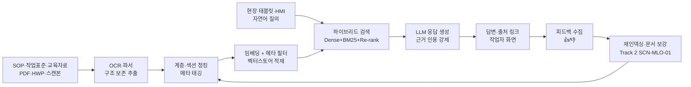
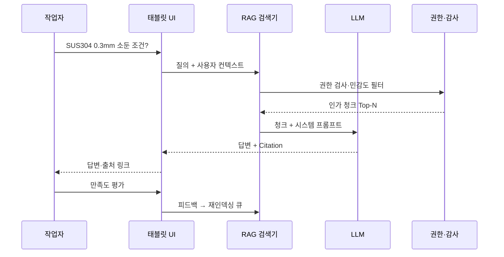
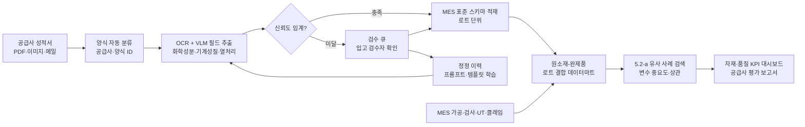
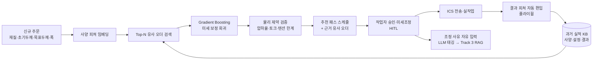
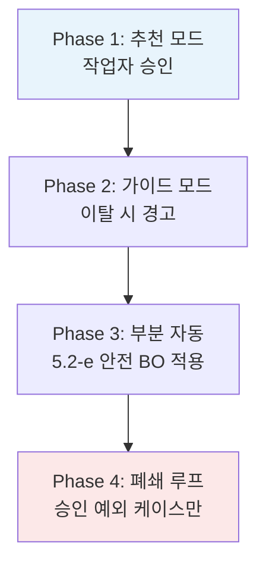
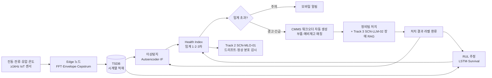
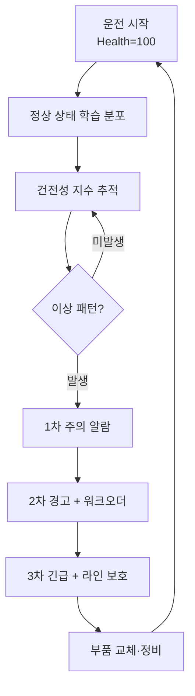
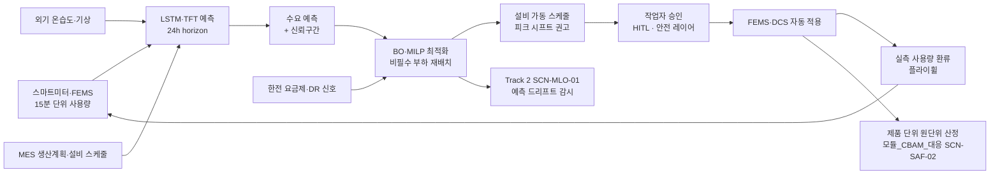
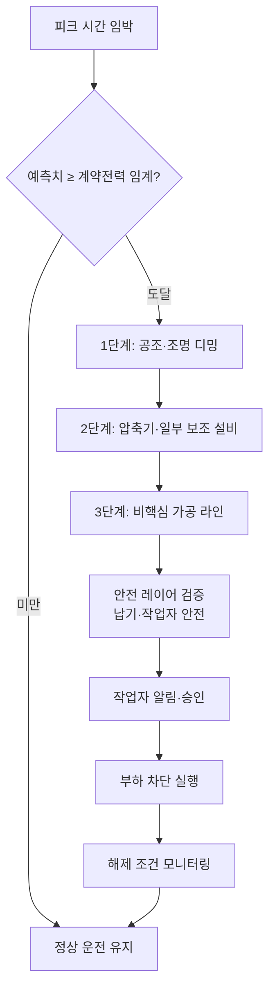

# 시나리오 상세 — 재사용성 Top 5

> **플레이스홀더 범례** — `[고객사]` 고객사명, `[공정]` 대상 공정명, `[수치]` 수치, `[기간]` 기간, `[%]` 비율.
> 본 문서는 `시나리오_카탈로그.md` 부록 A "재사용 효율 Top 5" 카드의 요지를 사업계획서 본문에 그대로 투입 가능한 **완성 문장 + 정량 표 + Mermaid 도식** 으로 확장한 것이다. 시나리오 ID 별로 독립 섹션이며, 사업계획서 조립 시 해당 시나리오 섹션을 복사하여 플레이스홀더만 교체하면 본문 1~2 페이지 분량을 곧바로 채울 수 있도록 설계되었다.

## 사용 안내
- 본 5 종은 카탈로그 부록 A "재사용 효율 Top 5" 기반이며, 부산·경남권 철강·금속·고무·정밀가공 제조 클러스터에서 공통으로 적용 가능한 시나리오로 추렸다.
- 각 시나리오 섹션은 ① **적용 맥락** (1 문단) ② **AS-IS — 현재의 공백** (1~2 문단) ③ **AI 해결 — 도입 후 운영 모습** (2~3 문단) ④ **기대효과 표** ⑤ **삽화(Mermaid)** 1~2 개 로 구성된다.
- `track1_5.2_AI엔진_변형카드.md` 의 5.2-a~f 엔진 패턴을 명시 인용하여 Track 1 5.2 절과 매핑되며, Track 2(MLOps)·Track 3(LLM·RAG) 연계 지점을 1 줄 이상 포함한다.
- 본문은 사업계획서 어투(국문 문어체)로 기술되었으며, 사례·수치는 모두 플레이스홀더로 처리하여 고객사 전환이 용이하도록 하였다.

## 시나리오 ↔ 5.2 엔진 패턴 ↔ Track 매핑 요약

| 시나리오 ID | 핵심 엔진 패턴 | 결합 가능 패턴 | 주 트랙 | 보조 연계 트랙 | 권장 도입 단계 |
|---|---|---|---|---|---|
| SCN-LLM-01 SOP RAG | 5.2-f LLM·RAG | — | Track 3 | Track 2 (운영 감시) | Quick Win (Phase 1) |
| SCN-STL-08 밀시트 OCR·상관 | 5.2-f + 5.2-a | — | Track 3 + Track 1 | Track 2 (드리프트) | Quick Win (Phase 1) |
| SCN-STL-04 패스 스케줄 추천 | 5.2-a 유사 사례 추천 | 5.2-e 최적화 | Track 1 | Track 3 (사유 RAG) | 핵심 (Phase 2) |
| SCN-STL-09 압연기 예지보전 | 5.2-d 예지보전 | 5.2-f (장애 RAG 결합) | Track 1 | Track 2 + Track 3 | 핵심 (Phase 2) |
| SCN-UTL-01 에너지 최적화 | 5.2-e 최적화·제어 | — | Track 1 | Track 2 + Track 3 (규제 RAG) | 전사 (Phase 3) |

## 적용 시 일반 원칙
- **데이터 성숙도가 낮은 단계** 에서는 LLM-01·STL-08 등 비정형 자산화 시나리오부터 진입하여, 데이터 수집·표준화·거버넌스 기반을 먼저 확보한다.
- **데이터 성숙도가 중급 이상** 인 사업장에서는 STL-04·STL-09 와 같은 시계열·추천 시나리오로 정량적 성과를 신속히 가시화하여 경영진의 후속 투자 결정을 견인한다.
- **전사·ESG 차원** 의 의사결정이 가능한 사업장에서는 UTL-01 을 도입하여 비용·탄소·규제 대응을 동시에 해결하며, CBAM·K-ETS 4 기 대응 자산을 자동 축적한다.
- 5 시나리오는 모두 **공통 MLOps 인프라(Track 2)** 와 **공통 RAG 인프라(Track 3)** 를 공유 가능하도록 설계되어, 2 개 이상 시나리오 동시 도입 시 인프라 투자 회수 효율이 비선형적으로 향상된다.

---

## SCN-LLM-01 — 표준작업지시서(SOP) RAG 질의응답

### 적용 맥락
부산·경남권 철강·정밀가공 제조 클러스터의 현장에는 공정별 표준작업지시서(SOP)·작업표준·교육자료가 PDF·HWP·이미지 스캔본 등 다종 포맷으로 [수치] 건 규모에 달하나, 통합 검색 체계가 부재하여 베테랑의 기억과 종이철에 의존하는 실정이다. 본 시나리오는 비정형 작업 지식을 청킹·임베딩하여 현장 태블릿·HMI 에서 자연어 질의로 즉시 조회 가능하도록 전환함으로써, 신입·교대 작업자의 숙련 격차를 단축하고 작업 오류·재작업 비용을 감축하는 것을 목적으로 한다. 본 시나리오는 `track1_5.2_AI엔진_변형카드.md` 의 **5.2-f LLM·RAG 지식검색 엔진** 을 직접 적용하며, Track 3 본문의 핵심 골격을 시연하는 대표 시나리오에 해당한다.

### AS-IS — 현재의 공백
[고객사] 의 [공정] 영역에서는 SOP 가 부서·연도·개정 이력 별로 분산 보관되어 있고, 동일 항목에 대한 복수 버전이 병존하면서 어느 본이 최신인지 현장에서 즉시 확인하기 어려운 상황이다. 신입 작업자가 "SUS304 0.3 mm 소둔 조건은 무엇인가" 와 같은 단순 질의에 답을 얻기까지 평균 [기간] 이 소요되며, 이 과정에서 베테랑의 기억·구두 전달에 의존함에 따라 작업 표준에서 벗어난 임의 판단이 누적되는 위험이 상존한다. 또한 SOP 의 절반 이상이 스캔본 PDF·이미지 형태로 보존되어 있어 텍스트 단위 검색 자체가 불가능하며, 변경 이력 추적·근거 인용 등 품질·안전 감사 대응 측면에서도 공백이 발생한다. 일부 작업표준은 부서별 공유 폴더·메일 첨부·개인 PC 에 흩어져 있어, 동일 작업에 대해 부서별로 상이한 절차가 통용되는 현상마저 관찰된다.

이러한 현황은 단순한 검색 불편의 문제를 넘어, 숙련 인력의 퇴직·이직 시 작업 노하우가 일시적으로 휘발되는 인력 리스크와, 동일 작업이 작업자에 따라 상이하게 수행됨에 따른 품질 편차 문제로 직결된다. 특히 다품종 소량 생산 환경에서는 작업 단계마다 SOP 조회 빈도가 높아 시간 손실이 누적되며, 야간·교대조에서 베테랑의 즉시 자문이 어려운 시간대일수록 오작업·재작업 발생률이 상승하는 패턴이 관찰된다. 안전·품질 사고 발생 시 사후 원인 분석에서도 "어느 시점의 어느 SOP 를 근거로 작업하였는가" 에 대한 추적이 곤란하여, 시정 조치의 실효성 확보와 외부 감사 대응 모두에서 공백이 발생하는 구조적 한계를 드러낸다.

### AI 해결 — 도입 후 운영 모습
본 시나리오의 AI 해결 방안은 **5.2-f LLM·RAG 지식검색 엔진** 을 그대로 차용한 RAG 파이프라인 구축이다. 우선 SOP·작업표준·교육자료를 일괄 수집하여 PDF·HWP·이미지 OCR 파서로 텍스트화하고, 문서 구조(장·절·표) 를 보존하는 계층 청킹과 섹션 기반 청킹을 혼합 적용한다. 청크 단위 임베딩은 한국어 제조 도메인에 적합한 임베딩 모델로 생성하여 [벡터스토어] 에 저장하며, 검색 단계는 Dense + BM25 + 메타데이터 필터(공정·재질·개정일자) 를 결합한 하이브리드 검색에 Re-ranker 를 추가하여 상위 정밀도를 확보한다. 응답 생성은 EXAONE·HyperCLOVA·GPT·Claude 중 보안 정책에 부합하는 [LLM모델] 을 선택하며, 답변에는 반드시 근거 문서·페이지·문단 인용을 강제하여 환각을 차단한다. 또한 청킹 단계에서 표·도식·이미지에 대한 캡션 텍스트와 OCR 결과를 함께 인덱싱하여, "이 그림과 동일한 절차의 SOP 가 있는가" 와 같은 멀티모달 질의에도 대응 가능한 구조로 설계한다.

현장 UX 는 라인 옆 태블릿 또는 HMI 의 사이드 패널 형태로 통합 배포된다. 작업자가 "[공정] 신규 사양 작업 절차" 와 같이 자연어로 질의하면 시스템은 Top-N 근거 문서를 인용한 답변을 [수치] 초 내에 회신하며, 답변 하단에는 출처 SOP 의 직접 링크가 함께 노출되어 작업자가 원본 문서로 즉시 도약할 수 있다. 답변 품질은 작업자의 평가 버튼(👍/👎) 으로 수집되며, 부정 평가가 누적된 청크는 재인덱싱·문서 보강 큐로 자동 회송된다. 권한 측면에서는 사내 AD/HR 권한 체계와 동기화하여 영업비밀·고객사 도면 등 민감 SOP 는 인가된 사용자에게만 노출되도록 하며, 외부 LLM API 호출 시 민감 정보 마스킹 게이트를 거친다. 답변 신뢰도가 임계 미만인 질의는 자동으로 베테랑·QA 담당자에게 에스컬레이션되어 휴먼 검토를 거친 답변이 회신되며, 검토 결과는 향후 동일 질의의 정답 데이터로 환류된다.

운영 단계에서는 Track 2(`SCN-MLO-01` 모니터링·드리프트 탐지) 와 결합하여 답변 신뢰도·인용 적중률·사용자 만족도·환각 발생률을 지속 추적하고, 신규 SOP 등재·기존 문서 개정 시 임베딩 재구축이 자동 트리거되도록 설계한다. 또한 RAGAS·기업 내부 Q/A 테스트셋 기반 정기 평가가 분기 단위로 수행되며, 평가 점수 하락 시 청킹 전략·임베딩 모델·프롬프트 템플릿의 어느 단계에 회귀가 발생하였는지 단계별 진단이 가능하도록 한다. Track 3 본문의 5.2(데이터 수집)·5.3(청킹)·7.1(RAG 평가 체계) 의 구체 절차가 본 시나리오 구축 과정에서 그대로 적용되며, Track 1 의 AI 엔진 운영 시 발생하는 공정 지식 질의도 본 시나리오의 RAG 인프라를 공용 자산으로 활용한다.

### 기대효과
| 영역 | AS-IS | TO-BE | 개선 효과 |
|---|---|---|---|
| SOP 1 건 검색 시간 | [기간] (평균) | [기간] (평균) | [%] 단축 |
| 신입 단독 작업 가능 시점 | [기간] | [기간] | [%] 단축 |
| 작업 절차 누락에 따른 재작업률 | [%] | [%] | [%] 감소 |
| 야간·교대조 자문 의존 건수/월 | [수치] 건 | [수치] 건 | [%] 감소 |
| SOP 인용 근거 추적성 (감사 대응) | 수기 추적 | 자동 인용·링크 | 추적 시간 [%] 단축 |
| 베테랑 검수 부담 (시간/주) | [수치] h | [수치] h | [%] 절감 |

### 삽화 (Mermaid)

---

## SCN-STL-08 — Mill Sheet·성적서 OCR·디지털화 및 원소재-완제품 상관분석

### 적용 맥락
중견 철강·정밀가공사가 외부 공급사로부터 입고받는 원소재 성적서(Mill Sheet) 는 공급사별 [수치] 종 양식의 PDF·이미지 형태로 관리되어 MES 와 연동되지 않는 경우가 다수이다. 본 시나리오는 비정형 성적서를 OCR·문서 이해 LLM 으로 디지털화하여 MES 표준 스키마로 적재하고, 입고 이력·검사 결과·완제품 불량 데이터를 결합하여 원소재 물성과 가공 결과 사이의 상관관계를 정량 분석하는 것을 목적으로 한다. 본 시나리오는 **5.2-f LLM·RAG 지식검색 엔진** (밀시트 OCR·문서 이해) 과 **5.2-a 유사 사례 검색·추천 엔진** (불량-원소재 유사 사례 추적) 을 동시에 적용하는 복합 패턴으로, 비정형 데이터 자산화의 대표 시연 과제이다.

### AS-IS — 현재의 공백
[고객사] 의 자재 입고 검사 단계에서는 공급사가 제출한 성적서를 종이·이메일 PDF 로 수령하여 입고 대장에 수기 전사하는 작업이 반복되고 있다. 공급사별 양식이 표·헤더·필드명에서 모두 상이하여 표준화된 추출이 불가능하며, 화학성분(C·Si·Mn·P·S·Ni·Cr 등)·기계적 성질(인장·항복·연신율·경도)·열처리 이력 등 핵심 필드가 자유 텍스트와 표가 혼합된 형태로 기재되어 있어 단순 OCR 만으로는 정확한 추출이 어렵다. 일부 공급사의 성적서는 스캔 품질이 낮아 소수점·단위·괄호 표기에서 오인식이 빈발하며, 외국어 병기 양식이나 손글씨 보충 기재가 포함된 경우는 사실상 자동 추출이 불가능한 영역에 해당한다. 결과적으로 입고된 원소재의 물성치는 종이철에만 보존되고 MES 에는 강종 코드·로트 번호 정도만 기록되어, 후공정에서 발생한 불량과 입고 원소재의 성분·물성 사이의 상관관계를 사후에 추적하기 사실상 불가능한 구조이다.

이러한 공백은 세 가지 손실로 직결된다. 첫째, 휴먼에러 누적 — 수기 전사 과정에서 단위·소수점·강종 오기재가 발생하며, 이로 인한 잘못된 자재 투입이 압연·열처리·가공 단계에서 재작업 또는 클레임으로 확대된다. 둘째, 품질 추적성 결손 — 완제품 UT 검사·고객 클레임 발생 시 어느 입고 로트의 어떤 성분 편차가 원인인지 규명하는 데 [기간] 이상이 소요되거나, 종이 보관 한계로 인해 규명 자체가 좌절되는 경우가 발생한다. 셋째, 공급사 평가 데이터 부재 — 어느 공급사의 어느 강종이 후공정 불량과 상관이 높은지 정량적으로 평가할 근거가 결손되어, 구매 의사결정이 단가·납기 위주로만 이루어지고 품질·총원가 관점이 반영되지 못하는 한계가 누적된다.

### AI 해결 — 도입 후 운영 모습
본 시나리오는 두 단계로 구성된다. 첫 번째는 **5.2-f 기반 성적서 OCR·디지털화** 단계로, 공급사별 성적서 PDF 를 자동 분류기로 양식 식별 후 양식별 템플릿 + 문서 이해 LLM(VLM 포함) 으로 화학성분·기계적 성질·열처리 조건 필드를 구조화된 JSON 으로 추출한다. 양식 분류기는 신규 양식 등장 시 Few-shot 학습으로 신속히 확장 가능하도록 설계되며, 추출 결과는 MES 표준 스키마로 매핑되어 입고 대장에 자동 적재된다. 신뢰도 임계 미만 필드는 검수 큐로 분기되어 입고 검수자가 [수치] 초 단위로 확인·승인하며, 검수자의 정정 이력은 양식별 템플릿·LLM 프롬프트 개선의 학습 데이터로 환류되는 데이터 플라이휠을 형성한다. 추출된 성적서 원본 이미지·텍스트·구조화 결과는 모두 보존되어 사후 감사·법적 분쟁 시 원본 추적성을 보장한다.

두 번째는 **5.2-a 기반 원소재-완제품 상관분석** 단계로, 디지털화된 성적서 데이터(원소재 측) 와 MES 의 후공정 가공 조건·검사 결과·UT/클레임 이력(완제품 측) 을 로트 단위로 결합하여 분석 데이터마트를 구축한다. 본 데이터마트 위에서 Gradient Boosting·Random Forest 기반 변수 중요도 분석으로 어떤 성분 구간·강종·공급사·열처리 이력 조합이 후공정 불량률 상승과 상관 있는지 주기적으로 산출하며, 결과는 자재 구매·품질 부서의 KPI 대시보드와 공급사 평가 보고서에 자동 반영된다. 신규 불량 발생 시 5.2-a 유사 사례 검색이 동일 성분 프로파일의 과거 로트와 그 처리 결과를 즉시 회신하여 원인 규명 시간을 단축하며, "C 함량 0.05 % 이상이고 Si 0.3 % 미만인 SUS304 로트는 표면 결함률이 평균 대비 [%] 높음" 과 같은 정량적 인사이트가 자동 도출되어 입고 검사 강화·공급사 협의의 근거 자료로 활용된다.

운영 단계에서는 Track 2(`SCN-MLO-01` 드리프트 탐지) 가 신규 공급사·신규 양식 등장에 따른 추출 정확도 저하를 감시하며, 임계 초과 시 양식 분류기·프롬프트 재학습이 자동 트리거된다. 또한 `SCN-MLO-03` 현장 피드백 루프와 결합되어 검수자의 정정·승인 행위가 모델 라벨로 직결되도록 설계한다. Track 3 의 RAG 인덱스에는 추출된 성적서 본문이 자동 등재되어, 후속 시나리오인 `SCN-LLM-01` SOP RAG·`SCN-LLM-02` 장애 RAG 와 지식 자산이 통합되며, "이 강종의 과거 입고 이력은?" 과 같은 자연어 질의에 대한 단일 진실원(Single Source of Truth) 역할을 수행한다.

### 기대효과
| 영역 | AS-IS | TO-BE | 개선 효과 |
|---|---|---|---|
| 성적서 1 건 디지털 입력 시간 | [기간] (수기) | [기간] (자동) | [%] 단축 |
| 입력 오류율 (수기 전사 기준) | [%] | [%] | [%] 감소 |
| 원소재-완제품 매칭 추적 시간 | [기간] | [기간] | [%] 단축 |
| 불량 원인 규명 가능률 | [%] | [%] | [수치] %p 향상 |
| 공급사 평가 데이터 신뢰성 | 수기 표본 | 전수 정량 | 평가 신뢰도 향상 |
| 입고 검수 인력 (FTE) | [수치] | [수치] | [%] 절감 |

### 삽화 (Mermaid)

---

## SCN-STL-04 — 냉간압연 패스 스케줄 표준화·최적화

### 적용 맥락
중견 스테인리스 냉연사·정밀압연사의 냉간압연 공정에서는 패스 스케줄(감면율·텐션·속도 조합) 이 작업자별 경험에 의존하여 결정되므로, 동일 재질·두께 조합에서도 작업조에 따라 두께 균일도와 생산성 편차가 발생하는 구조적 한계가 존재한다. 본 시나리오는 과거 성공 이력을 학습한 추천 엔진과 물리 제약(허용 압하율·롤 토크 한계) 을 결합하여 신규 주문 투입 시 최적 패스 스케줄 초안을 자동 생성하고, 작업자는 승인·미세조정만 수행하도록 운영 모델을 전환하는 것을 목적으로 한다. 본 시나리오는 **5.2-a 유사 사례 검색·추천 엔진** 을 주축으로 하며, 폐쇄 루프 제어 단계로 확장될 경우 **5.2-e 공정 최적화·제어 엔진** 과 결합 가능한 점진적 진화 구조를 갖는다.

### AS-IS — 현재의 공백
[고객사] 의 [공정] 라인에서는 신규 재질·신규 두께 조합 주문이 투입될 때마다 작업자가 과거 비슷한 작업을 기억해 내어 패스 횟수·각 패스의 감면율·텐션·속도를 결정하는 방식이 관행적으로 유지되고 있다. ICS·MES 에는 압연 실적이 [기간] 이상 축적되어 있으나, 활용은 사후 분석 보고서 작성에 제한되며 신규 작업 투입 시점에 과거 사례를 검색·참조하는 도구가 부재하다. 결과적으로 동일 사양에서도 작업조 A 와 작업조 B 의 통과율·두께 표준편차가 [%] 이상 차이가 나는 사례가 누적되며, 신규 작업자의 단독 투입까지 [기간] 이상의 도제식 학습 기간이 필요한 상황이다. 작업조 간 편차는 단순 생산성 문제를 넘어, 동일 코일 내에서 작업조 교대 시점에 두께 단차가 발생하는 등 제품 품질 자체에도 영향을 미치는 현상으로 확장된다.

또한 작업 의사결정의 근거가 작업자 메모·구두 인계 형태로만 존재하여 사후 검증·표준화가 불가능하다. "왜 이 두께에서는 4 패스가 아니라 5 패스로 갔는가" 와 같은 사유 정보가 형식지화되지 않아, 베테랑의 퇴직과 함께 노하우가 휘발되는 리스크가 상존한다. 특히 다품종·소량 주문이 증가하는 추세에서는 신규 사양마다 시행착오가 반복되어 시작품 스크랩과 셋업 시간이 누적되는 비효율이 가시적이며, 일부 사양에서는 "동일 사양을 [수치] 회 작업해야 안정 통과율에 도달" 하는 학습 곡선이 관찰되는 등, 1 회성 주문이 많은 시장 환경에서 실질적 손실로 직결된다. 더 나아가 신규 설비 도입·롤 교체·압연유 변경 등 운영 조건 변화 시 기존의 암묵지가 즉시 무효화되어 다시 시행착오 단계로 회귀하는 현상도 빈번하게 발생한다.

### AI 해결 — 도입 후 운영 모습
본 시나리오의 AI 해결 방안은 **5.2-a 유사 사례 검색·추천 엔진** 의 직접 적용이다. ICS·MES 에 축적된 과거 압연 실적에서 (재질·초기 두께·목표 두께·폭) 등 사양 피쳐와 (패스 수·각 패스 감면율·텐션·속도·롤 포스) 등 설정 피쳐, (출측 두께 표준편차·통과율·표면 결함률) 등 결과 피쳐를 추출하여 일관 스키마로 정렬하고, 사양 피쳐를 임베딩하여 [벡터스토어] 에 적재한다. 신규 주문이 투입되면 사양 임베딩 + 강종군·치수 허용 범위 메타 필터로 Top-N 유사 과거 오더를 검색하고, 결과 피쳐 우수 순으로 정렬한 후 Gradient Boosting 회귀 모델로 신규 사양에 맞는 미세 보정을 적용한 추천 스케줄을 산출한다. 사양이 과거 이력 분포에서 외삽 영역에 속하는 경우 신뢰도 점수가 낮게 산출되어 작업자에게 명시적 경고가 제공되며, 이러한 외삽 사례는 별도의 학습 강화 큐로 분기되어 후속 작업 결과가 우선적으로 학습 데이터에 편입된다.

산출된 추천 스케줄은 물리 제약 검증 모듈을 통과하여 허용 압하율·롤 토크·텐션 상한 등 설비 한계를 위배하지 않음을 확인한 뒤 추천 UI 로 작업자에게 제시된다. UI 는 추천 스케줄 외에 Top-N 참조 유사 오더(사양·설정·결과) 를 함께 노출하여 작업자가 추천의 근거를 직관적으로 이해하고 자신의 경험과 대조해 미세조정할 수 있도록 한다. 작업자가 승인한 스케줄은 ICS 로 자동 전송되며, 작업 종료 후 결과 피쳐가 다시 데이터마트에 자동 편입되어 추천 엔진의 데이터 플라이휠을 형성한다. 특히 작업자의 미세조정 사유를 LLM 기반 자유 텍스트 입력 → 구조화 태깅으로 수집하여, Track 3 RAG 와 결합 시 "왜 이 사양에서는 텐션을 낮췄는가" 와 같은 노하우 검색이 가능해진다. 추천과 작업자 최종 결정 간의 차이(Recommendation Override) 자체도 별도 KPI 로 추적되어, 추천 품질 개선의 직접 신호로 활용된다.

운영 단계에서는 Track 2(`SCN-MLO-01` 드리프트 탐지·`SCN-MLO-03` 현장 피드백) 와 결합하여 신규 재질군·신규 설비 도입에 따른 추천 정확도 변동을 감시하고, 정해진 임계 초과 시 추천 모델 재학습이 자동 트리거된다. 챔피언·챌린저 A/B 검증 프로토콜에 따라 신규 모델은 기존 모델과 병행 운영되며, 일정 기간 우월성이 확인된 이후 전환된다. 폐쇄 루프 제어로의 확장이 결정될 경우 **5.2-e 최적화·제어 엔진** 의 안전 레이어(Safe BO·제약 BO) 가 추가되어 작업자 승인 단계를 점진적으로 줄이는 진화 경로가 가능하며, 본 진화는 4 단계(추천 → 가이드 → 부분 자동 → 폐쇄 루프) 로 단계화하여 각 단계의 KPI 게이트 충족 시 다음 단계로 이행하도록 설계한다.

### 기대효과
| 영역 | AS-IS | TO-BE | 개선 효과 |
|---|---|---|---|
| 신규 사양 셋업 시간 | [기간] | [기간] | [%] 단축 |
| 시작품 스크랩률 | [%] | [%] | [%] 감소 |
| 출측 두께 표준편차 (작업조 간) | [수치] σ | [수치] σ | [%] 축소 |
| 1st coil 통과율 | [%] | [%] | [수치] %p 향상 |
| 신입 단독 작업 가능 기간 | [기간] | [기간] | [%] 단축 |
| 노하우 형식지화 비율 | [%] | [%] | [수치] %p 향상 |

### 삽화 (Mermaid)

---

## SCN-STL-09 — 설비 예지보전 (압연기 롤·베어링·구동부)

### 적용 맥락
대기업·중견 철강사의 압연 라인 구동부(롤·베어링·기어박스·유압 시스템) 는 일반적으로 시간베이스 예방보전(TBM) 으로 운영되어, 과잉 정비로 인한 가동 손실과 돌발 고장으로 인한 생산 중단이 동시에 발생하는 양극단의 비효율이 상존한다. 본 시나리오는 진동·전류·유압·온도 시계열로부터 설비 건전성을 지속 감시하고, 이상 징후를 조기 탐지하여 잔여수명(RUL) 을 추정함으로써 정비 시점을 데이터 기반으로 의사결정하는 상태기반보전(CBM) 체계로 전환하는 것을 목적으로 한다. 본 시나리오는 **5.2-d 예지보전 엔진** 을 직접 차용한다.

### AS-IS — 현재의 공백
[고객사] 의 [공정] 라인 구동부에 대해 설비 보전은 정기 점검 주기와 작업자 순회 점검에 의존하고 있으며, 고장·교체 이력은 CMMS 의 자유 텍스트 형태로만 누적되어 시계열 진동·전류 신호와 정량적으로 결합되지 못한 상태이다. 정상 동작 중 발생하는 진동·전류 미세 변화는 작업자의 청각·촉각으로만 감지되며, 그마저도 야간·교대조에서는 일관성을 보장하기 어렵다. 결과적으로 일부 부품은 수명이 충분히 남았음에도 정기 교체로 폐기되어 자재비 손실이 누적되고, 반대 사례에서는 베어링 시저·기어 균열이 돌발 고장으로 이어져 시간당 [수치] 만 원 규모의 라인 정지 손실이 발생한다. 동일 설비라 하더라도 운전 조건·생산 품목·계절에 따라 마모 패턴이 달라지므로, 통일된 시간 주기 보전은 본질적으로 평균치에 맞춰진 보수적 정책일 수밖에 없으며, 개별 설비의 실제 상태와는 정합되지 못하는 구조적 한계를 갖는다.

또한 부품·예비재고 관리가 정비 이력과 연동되지 않아 긴급 교체 시 부품 조달 지연이 추가 정지 시간을 야기한다. 정비 데이터가 정량화되지 못하면서 어느 설비가 만성적으로 문제인지, 어느 운전 조건이 마모를 가속하는지 등 보전 정책 수립에 필요한 인사이트가 축적되지 않으며, 보전 비용·가용도 KPI 가 관리 회계 수준에 머물러 경영 의사결정으로 연결되지 못하는 한계가 존재한다. 베테랑 정비원의 청각·촉각 진단 노하우 또한 형식지화되지 못한 채 개인 역량으로만 보존되어, 정비 인력의 세대교체 시점에 진단 역량 자체가 일시적으로 후퇴하는 위험이 상존한다.

### AI 해결 — 도입 후 운영 모습
본 시나리오의 AI 해결 방안은 **5.2-d 예지보전 엔진** 의 직접 적용이다. 우선 압연기 구동부에 진동 가속도계(≥ 1 kHz) ·모터 전류·전압 센서·윤활유 압력·온도 센서를 추가 설치 또는 기존 IoT 게이트웨이와 통합하고, 엣지 노드에서 1 차 전처리(FFT·Envelope·Cepstrum 변환, Order Tracking) 를 수행한 뒤 시계열 데이터베이스(TSDB) 로 적재한다. 정상 상태 학습 데이터를 충분히 확보한 후 Autoencoder·Isolation Forest 기반 이상탐지 모델로 건전성 지수(Health Index) 를 산출하고, 누적된 고장 이력과 결합하여 LSTM Regression·Survival Analysis 기반 RUL(잔여수명) 추정 모델을 학습한다. 정상 라벨 대비 고장 라벨의 희소성을 보완하기 위해 정상 상태 학습 + 약간의 고장 라벨을 조합한 Semi-supervised 접근을 채택하며, 도메인 전문가가 정의한 물리적 고장 모드(베어링 BPFO·BPFI·BSF, 기어 메시 주파수, 불평형·정렬 불량 등) 를 피쳐 후보로 명시적으로 포함한다.

운영 단계에서는 건전성 지수가 임계 1 차(주의)·2 차(경고)·3 차(긴급) 를 초과하는 경우 단계별 알람이 정비팀 모바일·CMMS 로 전파되며, 임박 임계 초과 시 CMMS 워크오더가 자동 생성되어 부품·예비재고·작업자 일정과 사전 매칭된다. 알람 피로도 누적을 방지하기 위해 임계 계층화·스누즈·자동 무시 룰을 운영하며, 알람 발생 시 Track 3(`SCN-LLM-02` 장애 RAG) 와 결합되어 과거 동일 진동 프로파일·정비 사례·교체 부품 번호가 함께 회신되도록 설계한다. 정비팀의 처치 결과(부품 교체·재학습·미발생 등) 는 라벨로 환류되어 모델의 분류 경계를 지속적으로 정밀화한다. 또한 베테랑 정비원의 진단 노하우는 알람 발생 시점의 자유 텍스트 코멘트 + 진동 스펙트로그램 스냅샷을 묶어 RAG 인덱스에 등재함으로써, 후속 정비원이 동일 패턴 발생 시 베테랑의 판단 근거를 즉시 참조할 수 있도록 한다.

운영 단계에서는 Track 2(`SCN-MLO-01` 드리프트 탐지) 가 계절·운전 조건 변화에 따른 정상 분포 이동을 감시하며, 임계 초과 시 정상 상태 재학습이 자동 트리거된다. 설비별 모델링과 군집 모델링 사이의 선택은 데이터 양·고장 모드 유사성에 따라 분기되며, 신규 설비 추가 시 군집 모델로부터 출발하여 데이터 누적 후 개체 모델로 전환하는 점진 학습 정책을 적용한다. 본 시나리오는 단독 도입 시에도 가치가 명확하나, `SCN-LLM-02` 장애 RAG·`SCN-MLO-03` 피드백 루프와 함께 패키지로 도입될 때 운영 안정성·정비 노하우 자산화 효과가 가장 크게 발현된다.

### 기대효과
| 영역 | AS-IS | TO-BE | 개선 효과 |
|---|---|---|---|
| 돌발 정지 시간 (월) | [수치] h | [수치] h | [%] 감소 |
| 가동률 (OEE 가용도) | [%] | [%] | [수치] %p 향상 |
| 평균 정비 응답 시간 (MTTR) | [기간] | [기간] | [%] 단축 |
| 예비부품 재고 회전율 | [수치] 회/년 | [수치] 회/년 | [%] 향상 |
| 정기 교체 부품 폐기 비용 (연) | [수치] 만 원 | [수치] 만 원 | [%] 절감 |
| 정비 노하우 형식지화 (Track 3 연계) | [%] | [%] | [수치] %p 향상 |

### 삽화 (Mermaid)

---

## SCN-UTL-01 — 공장 에너지(전력·가스·증기) 최적화·피크 관리

### 적용 맥락
대기업·중견·중소 제조업체 공통으로 적용 가능한 본 시나리오는 공장 전체의 전력·가스·증기 사용량을 15 분 단위로 예측하고 생산계획과 연동하여 피크 시간대 부하를 능동적으로 이전·평탄화하는 것을 목적으로 한다. 한국 산업용 전기요금 체계의 피크 부하 요금 구조와 2026 년 본격 시행되는 CBAM, 그리고 RE100·K-ETS 4 기 대응 압력이 동시에 작용하는 환경에서, 본 시나리오는 단순 비용 절감을 넘어 ESG·탄소중립 대응의 정량 근거를 확보하는 자산 역할을 수행한다. 본 시나리오는 **5.2-e 공정 최적화·제어 엔진** 을 직접 차용하며, `모듈_CBAM_대응.md` 와 결합되어 제품 단위 내재배출량 산정으로 자연스럽게 확장된다.

### AS-IS — 현재의 공백
[고객사] 의 에너지 관리 현황은 월 단위 한전 청구서·도시가스 청구서 수준에서 종결되어, 어느 설비가·어느 시간대에·어느 제품을 가공할 때 에너지 원단위가 어떻게 변동하는지에 대한 정량 가시성이 거의 부재하다. FEMS 가 일부 설치된 경우에도 데이터는 별도 대시보드에 머물러 MES 생산 일정·KPI 와 연결되지 않으며, 피크 시간대(13~17시) 가 임박해 한전 수요반응 알림이 도달해도 실시간으로 비필수 부하를 식별·차단하는 절차가 부재하다. 결과적으로 피크 부하 요금이 청구서 총액의 [%] 이상을 차지하면서도 통제 수단이 없는 상태이며, 일부 사업장에서는 계약전력 초과 페널티가 분기 단위로 반복 발생하면서도 그 발생 원인을 사후에 정확히 짚어내지 못하는 사례가 누적되고 있다.

또한 CBAM·K-ETS 대응을 위한 제품 단위 배출량 산정 시 공정·시간대별 에너지 데이터가 결손되어 있어, 외부 검증 기관의 감사 시 산정 근거를 제시하기 어렵고, 결과적으로 보수적 배출계수를 적용받아 수출 가격 경쟁력에서 불이익을 받을 가능성이 존재한다. 이는 단순 운영 효율 문제를 넘어 사업 지속성·수출 경쟁력 차원의 리스크로 확대되는 구조이다. 더욱이 RE100 가입 고객사의 협력업체 평가, 글로벌 OEM 의 Scope 3 공급망 배출 감축 요구가 강화되는 추세에서 시간대별·제품별 에너지 데이터 부재는 장기 수주 안정성에도 직접적인 위협 요인으로 작용한다.

### AI 해결 — 도입 후 운영 모습
본 시나리오의 AI 해결 방안은 **5.2-e 공정 최적화·제어 엔진** 을 차용한 두 단계 시스템 구축이다. 첫 번째는 에너지 수요 예측 단계로, 스마트미터·FEMS 데이터·외기 온습도·생산계획·설비 가동 스케줄을 입력으로 하여 LSTM·Temporal Fusion Transformer 기반 15 분 단위 다변량 예측 모델을 운영한다. 예측 horizon 은 24 시간으로 설정하고, 예측 신뢰구간을 함께 산출하여 의사결정의 위험 수준을 정량화한다. 두 번째는 부하 최적화·피크 시프트 단계로, 예측된 수요 곡선과 한전 요금제(계시별 요금·수요반응 신호) 를 입력으로 하여 베이지안 최적화·MILP 기반 최적화 엔진이 비필수 설비(공조·압축기·일부 보조 설비) 의 가동 일정을 시간대별로 재배치한다. 다목적 최적화의 가중치(요금 절감 vs 생산 안정성 vs 작업자 쾌적성) 는 의사결정자가 슬라이더 형태로 조정 가능한 인터페이스로 제공되며, 파레토 전선 위의 후보 시나리오들이 시각화되어 비교 검토가 가능하다.

운영 단계에서는 피크 임박 임계(예측치가 계약전력의 [%] 도달) 시 자동으로 수요반응 모드가 활성화되어 사전 정의된 부하 차단 우선순위에 따라 비필수 설비를 단계적으로 차단하며, 작업자 화면에는 차단 사유·예상 절감액·해제 시점이 함께 표시된다. 안전 레이어는 생산계획·납기 제약·작업자 안전을 절대 위배하지 않도록 Safe RL·제약 BO 의 허용 범위 차단 메커니즘으로 보장된다. 산정된 시간대별 에너지 사용량과 생산 실적은 자동으로 결합되어 제품 단위 에너지 원단위·내재배출량 산정 근거로 적재되며, `모듈_CBAM_대응.md` 의 신고 자동화 워크플로(`SCN-SAF-02`) 에 그대로 입력된다. 한전 수요반응 시장 참여 시 본 시스템은 사전 승낙 가능 부하량을 자동 산정하여 입찰 의사결정에 활용되며, DR 보상 수익이 추가 수익원으로 확보된다.

운영 단계에서는 Track 2(`SCN-MLO-01` 드리프트 탐지) 가 계절·생산 품목 변화에 따른 예측 정확도 변동을 감시하며, 임계 초과 시 예측 모델 재학습이 자동 트리거된다. Track 3(규제 문서 RAG) 와 결합하여 K-ETS·CBAM 신고 양식 변경 시 신고 양식 업데이트가 자동 반영되도록 한다. 운영 모드는 초기 [기간] 은 작업자 승인 기반 오픈 루프로 시작하여, 안정성이 확보된 이후 부분 클로즈드 루프로 점진 전환하는 진화 경로를 권장한다. 챔피언·챌린저 A/B 검증 프로토콜에 따라 신규 예측 모델·신규 최적화 정책은 카나리 배포로 일부 시간대·일부 라인에 우선 적용한 뒤, 정해진 KPI 충족 시 전사 확산되는 점진 적용 원칙을 따른다.

### 기대효과
| 영역 | AS-IS | TO-BE | 개선 효과 |
|---|---|---|---|
| 피크 부하 요금 (월) | [수치] 만 원 | [수치] 만 원 | [%] 절감 |
| 전력 원단위 (kWh/생산단위) | [수치] | [수치] | [%] 감소 |
| 가스·증기 원단위 | [수치] | [수치] | [%] 감소 |
| 제품 단위 CO₂ 배출 (kgCO₂/t) | [수치] | [수치] | [%] 감소 |
| CBAM 신고 데이터 신뢰도 | 추정·평균값 | 시간대별 실측 | 검증 통과율 [수치] %p 향상 |
| 수요반응(DR) 보상 수익 (연) | [수치] 만 원 | [수치] 만 원 | [%] 증가 |

### 삽화 (Mermaid)

---

## 추후 보강 후보

본 5 종 시나리오 상세는 Phase D3 산출물로서 사업계획서 본문 직접 투입 가능 수준에 도달하였으나, 다음 항목은 Phase D 이후 확장 보강을 권장한다.

1. **시나리오 결합 사례 — 압연 통합 패키지 (STL-04 + STL-05 + STL-09)**
   부록 B 의 패키지 2(중견 스테인리스 냉연 특화) 를 단일 본문으로 조립한 결합 사례를 별도 시나리오 섹션으로 추가하여, 복수 시나리오가 데이터·MLOps 인프라·작업자 UX 를 공유하는 운영 모델을 시연한다. 패스 스케줄 추천이 두께 예측의 입력이 되고, 두께 이탈 알람이 예지보전 모델의 외생 이벤트로 환류되는 구조를 구체화하며, 단일 시나리오 합산 대비 결합 시 추가로 확보되는 시너지 효과(공통 피쳐 스토어·공통 모니터링 대시보드·공통 작업자 UX 의 비용 회수) 를 정량화한다.

2. **현장 적용 단계별 KPI 추적 양식 (5 시나리오 공통)**
   본 문서는 AS-IS/TO-BE 정량 표를 제공하나, 실제 사업 수행 단계에서는 분기·반기 단위 추적 양식이 별도로 필요하다. 시나리오별로 PoC → Pilot → Scale 3 단계의 KPI 게이트와 측정 방법론을 표준화한 추적 양식을 별도 모듈로 작성하여 사업 보고서·정산 자료 작성 부담을 감소시킨다. 각 단계의 통과·실패 판정 기준, 실패 시 회귀 절차, 외부 평가단 대응 자료 구성까지 표준화하여 사업 수행기관의 운영 부담을 구조적으로 줄이는 것을 목표로 한다.

3. **연합학습 결합 가능성 (UTL-01 + STL-09 산단 공동 모델)**
   `모듈_연합학습_산단공동.md` 와 결합하여 부산·경남 산단 단위 공동 에너지 예측·예지보전 모델 구축 시나리오를 별도 섹션으로 확장한다. 중소 제조업체 개별로는 데이터가 부족한 상황에서 산단 공동체 차원의 데이터 협력으로 모델 성능을 확보하는 패턴을 시연하며, 대중소상생·연합학습 지원사업 매칭에 활용 가능하다. 데이터 비공유·모델 파라미터 공유 원칙 하에서 발생하는 거버넌스·정산·책임 분담 이슈도 함께 다루어, 산단공동 사업의 실효성 있는 추진 모델로 정착시킨다.

## 작성 원칙·정합성 점검 메모
- 본 문서의 모든 5.2-a~f 엔진 패턴 인용은 `track1_5.2_AI엔진_변형카드.md` 의 카드 ID 와 1:1 일치하도록 작성되었다. 변형 카드 문서가 갱신될 경우 본 문서의 엔진 패턴 호출 지점도 동기화 갱신되어야 한다.
- 시나리오 ID(`SCN-LLM-01`·`SCN-STL-04`·`SCN-STL-08`·`SCN-STL-09`·`SCN-UTL-01`) 및 보조 시나리오 인용(`SCN-LLM-02`·`SCN-MLO-01`·`SCN-MLO-03`·`SCN-SAF-02`) 은 `시나리오_카탈로그.md` 의 카드 ID 와 일치한다.
- 모든 정량 수치는 플레이스홀더(`[수치]`·`[%]`·`[기간]`) 처리되어 있으며, 사업계획서 작성 시 고객사 실측치·목표치로 교체한다. 가공·날조된 수치는 포함되어 있지 않다.
- 회사·인물 실명은 사용하지 않았으며, 산업·규모 표현(중견 스테인리스 냉연사, 중견 특수강관사, 중견 고무·폴리머 양산사, 중견·중소 정밀가공사, 부산·경남 제조 클러스터) 만 사용하였다.
