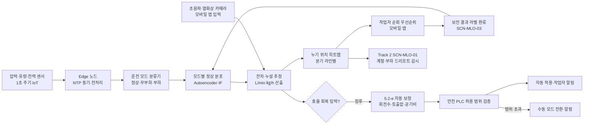
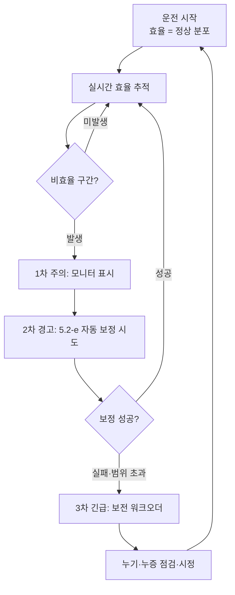
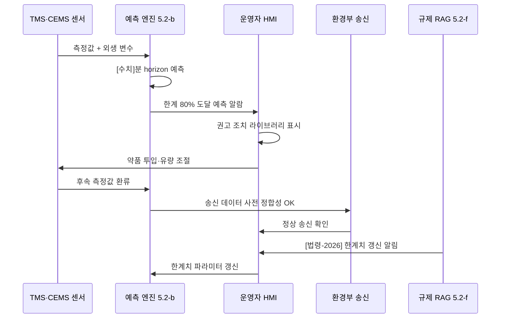
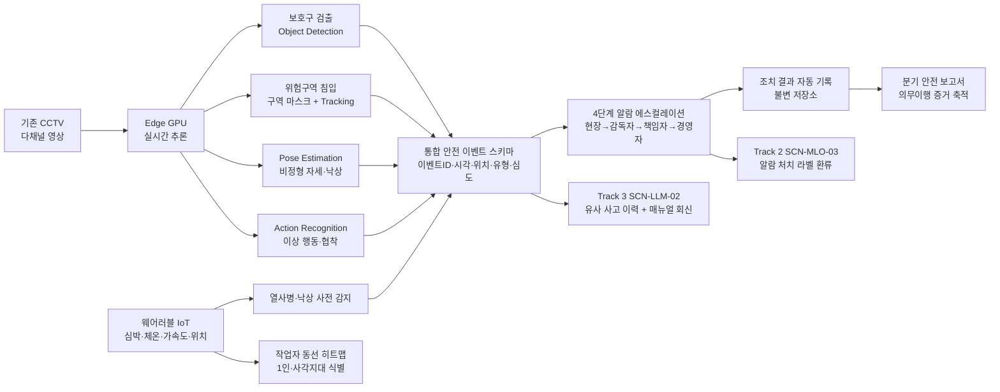
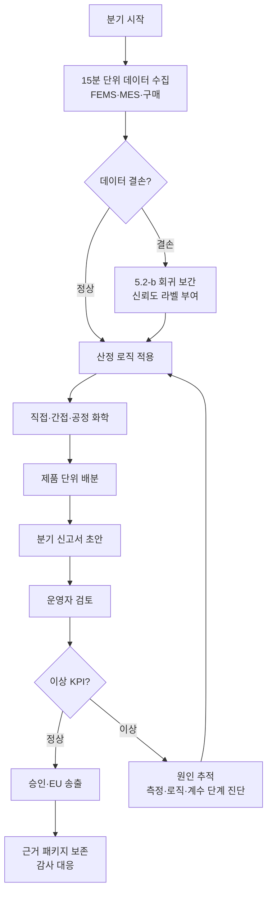

# 시나리오 상세 — UTL·SAF (유틸·환경·안전)

> Phase E4 자체평가 갭 20 해소. 4 시나리오 (UTL-02·03 + SAF-01·02) 의 사업계획서 직접 투입 가능한 상세 본문. `시나리오_상세_Top5.md` (UTL-01 포함) 와 본 자산이 합쳐지면 패키지 6 (유틸·ESG 파일럿) 의 5+1 시나리오 모두 상세 자산이 완비된다.

> 플레이스홀더 범례 — `[고객사]` 고객사명, `[공정]` 대상 공정명, `[수치]` 수치, `[기간]` 기간, `[%]` 비율, `[법령-2026]` 2026년 시행·개정 법령 식별자.

## 사용 안내
- 본 4 시나리오는 패키지 6 (유틸·ESG 파일럿) 의 핵심 + 안전·환경 융합 시나리오 군에 해당하며, `사업계획서_패키지6_유틸ESG_파일럿.md` §8.1 에서 직접 인용된다.
- 각 시나리오 섹션은 ① **적용 맥락** (1 문단) ② **AS-IS — 현재의 공백** (1~2 문단) ③ **AI 해결 — 도입 후 운영 모습** (2~3 문단) ④ **기대효과 표** ⑤ **삽화(Mermaid)** 1~2 개 로 구성된다 (Top5/Phase2/RUB 와 동일 5 단 포맷).
- `track1_5.2_AI엔진_변형카드.md` 의 5.2-b·5.2-c·5.2-d·5.2-e·5.2-f 엔진 패턴을 명시 인용하여 Track 1 5.2 절과 매핑되며, Track 2(MLOps)·Track 3(LLM·RAG) 연계 지점을 1 줄 이상 포함한다.
- SAF-01 은 `모듈_중대재해_안전.md` 의 BLK-SAF-A·C·D·F 와, SAF-02 는 `모듈_CBAM_대응.md` 의 BLK-CBAM-A·C·D·F 와 1:1 결합 운영된다. 시나리오 본문은 모델 구조·운영 흐름에 집중하고, 거버넌스·법령 해설은 모듈에 위임한다.
- SCN ID 인용 정책은 `사업계획서_조립_가이드.md` §3 을 준수한다.

## 시나리오 ↔ 5.2 엔진 패턴 ↔ Track 매핑 요약

| 시나리오 ID | 핵심 엔진 패턴 | 결합 가능 패턴 | 주 트랙 | 보조 연계 트랙·모듈 | 권장 도입 단계 |
|---|---|---|---|---|---|
| SCN-UTL-02 컴프레서·보일러 효율·누기 | 5.2-d 예지보전 | 5.2-e (자동 보정 폐쇄 루프 결합) | Track 1 | Track 2 (드리프트) | Phase 1~2 (Quick Win) |
| SCN-UTL-03 폐수·배출가스 이상 예측 | 5.2-b 시계열 품질·이탈 예측 | 5.2-f (규제 문서 RAG) | Track 1 | Track 2 + Track 3 | Phase 1~2 |
| SCN-SAF-01 중대재해 위험요소 감지 | 5.2-c 비전 검사 | 5.2-f (사고이력 RAG 결합) | Track 1 | 모듈_중대재해_안전 풀 결합 | Phase 1 (Quick Win) |
| SCN-SAF-02 탄소배출·CBAM 신고 자동화 | 5.2-b 시계열 + 5.2-e 보고서 자동화 | 5.2-f (규제 문서 RAG) | Track 1 | 모듈_CBAM_대응 풀 결합 | Phase 2 |

## 적용 시 일반 원칙
- **UTL-02 (예지보전) + 5.2-e 자동 보정 결합** — 본 결합 패턴은 `track1_5.2_AI엔진_변형카드.md` §결합 가이드의 신규 항목 "5.2-d + 5.2-e 자동 보정 폐쇄 루프" 의 1 차 적용 사례이다. 보일러·컴프레서의 효율 회복을 정비 전 단계에서 자동 변수 보정으로 달성하는 운영 모델이며, 안전 PLC 의 허용 범위를 절대 위배하지 않도록 안전 레이어가 강제된다.
- **UTL-03 (TMS·CEMS) + 외부 검증 통합** — TMS(수질) ·CEMS(대기) 는 환경부 송신 의무 데이터로 운영 중이며, AI 예측 결과는 송신 데이터의 사전 검증·이상 사전 감지에 활용된다. 외부 검증 양식은 본 시나리오와 별도의 가이드 자산(외부검증 가이드)에서 다룬다. 본 시나리오는 송신 데이터의 정합성 확보·약품 투입·유량 조절 권고에 집중한다.
- **SAF-01 (CCTV·웨어러블) + 모듈_중대재해 풀 결합** — 본 시나리오는 `모듈_중대재해_안전.md` 의 BLK-SAF-A(규제 환경) ·BLK-SAF-C(AS-IS 공백) ·BLK-SAF-D(3축 아키텍처) ·BLK-SAF-F(사고이력 RAG) 와 1:1 정합한다. 시나리오 본문은 비전·웨어러블 모델 구조 및 알람 에스컬레이션에 집중하고, 중대재해법·산업안전 규제 해석·프라이버시·노사 합의 거버넌스는 모듈에 위임한다.
- **SAF-02 (CBAM) + 모듈_CBAM 풀 결합** — 본 시나리오는 `모듈_CBAM_대응.md` 의 BLK-CBAM-A(배경·시의성) ·BLK-CBAM-C(에너지·원료 데이터) ·BLK-CBAM-D(제품 단위 배출량 산정 엔진) ·BLK-CBAM-F(규제 문서 RAG) 와 1:1 정합한다. 시나리오 본문은 분기 신고 자동화의 데이터 흐름·산정 로직·보고서 생성에 집중하고, EU 시행 규칙·국가 배출계수 고시 해석은 모듈에 위임한다.

---

## SCN-UTL-02 — 컴프레서·보일러 효율·누기·누증 탐지

### 적용 맥락
중견·중소 제조업체의 공압(컴프레서)·증기(보일러) 유틸리티 설비는 24 시간 연속 가동되는 인프라 자산이나, 배관·밸브·실링 노후로 인한 누기·누증이 원단위 [%] 의 상시 손실을 야기하면서도 그 발생 위치·시점이 작업자 순회 점검 또는 사후 청구서 분석으로만 가시화되는 한계가 누적되고 있다. 본 시나리오는 압력·유량·전력·진동 시계열의 정상 운전 패턴과 무부하 시나리오를 비교하여 누기·누증 구간을 자동 추정하고, 초음파 카메라·열화상 카메라의 부분 검사 결과를 보조 입력으로 결합하여 누기 위치 히트맵을 산출하는 것을 목적으로 한다. 본 시나리오는 `track1_5.2_AI엔진_변형카드.md` 의 **5.2-d 예지보전 엔진** 을 직접 차용하며, 효율 회복 단계에서는 **5.2-e 공정 최적화·제어 엔진** 과 결합되어 자동 보정 폐쇄 루프로 진화 가능한 점진적 구조를 갖는다.

### AS-IS — 현재의 공백
[고객사] 의 [공정] 유틸리티 설비는 일반적으로 정기 점검 주기와 작업자 순회 점검에 의존하여 보전되며, 일부 사업장은 SCADA 의 절대 임계 알람만 운영하는 수준에 머물러 있다. 컴프레서·공압 라인의 누기는 서비스 시간대 가동 중에는 청각·촉각으로만 감지되는 미세 누설이 다수이며, 야간·주말 무부하 운전 시간대에 가장 명확히 식별 가능함에도 불구하고 그 시간대의 압력·유량·전력 데이터를 정량적으로 비교 분석하는 도구가 부재하다. 보일러·증기 라인의 누증 또한 보온재 손상·플랜지 패킹 열화에서 비롯된 미세 손실이 누적되어 전체 효율을 [%] 이상 저하시키나, 한전·도시가스 청구서가 월 단위로만 회신되어 발생 시점 추적이 사실상 불가능한 구조이다. 결과적으로 누기·누증으로 인한 에너지 손실이 청구서 총액의 [%] 이상에 달함에도 불구하고, 보전팀은 그 발생 위치·원인을 사전에 특정할 수 없어 정기 점검 주기에 일괄 보수하는 비효율적 정책이 관행화되어 있다.

또한 컴프레서·보일러의 효율은 부하·외기 온도·공급 가스 압력 등 운전 조건에 따라 동적으로 변동하나, 운전 중 효율을 실시간 산출·추적하는 체계가 부재하여 비효율 운전 구간(예: 토출 압력 과잉, 무부하 시간대 가동 유지) 이 시정되지 못한 채 지속된다. 일부 사업장은 초음파 카메라·열화상 카메라를 보유하나 사용 빈도가 분기 1 회 수준에 머물러 누기·누증의 신규 발생을 적시에 포착하지 못하며, 카메라 검사 결과 또한 종이·이미지 형태로만 보존되어 시계열 데이터와 결합되지 못한다. 더 심각한 한계는 누기·누증 발생 후 보전이 이루어져도 효율 회복 여부가 사후 청구서로만 검증되어, 보전 작업의 실효성 평가·재발 패턴 학습 자체가 데이터 기반으로 이루어지지 못하는 구조이다.

### AI 해결 — 도입 후 운영 모습
본 시나리오의 AI 해결 방안은 **5.2-d 예지보전 엔진** 의 직접 적용이다. 컴프레서·보일러·주요 분기 라인에 압력·유량·전력 센서를 1 초 주기로 수집 가능하도록 게이트웨이를 보강하고(미설치 구간은 신규 설치), 정상 운전 시간대·무부하 시간대·생산 부하 시간대를 자동 분류하는 운전 모드 분류기를 운영한다. 동일 운전 모드 내에서 압력·유량·전력의 정상 분포를 Autoencoder·Isolation Forest 기반으로 학습하고, 신규 측정값이 정상 분포에서 통계적으로 유의하게 벗어나는 구간을 누기·누증 의심 이벤트로 탐지한다. 무부하 시간대의 압력 강하율·전력 사용량은 정상 운전 시 모델이 예측한 기준치와 직접 비교되어 누설 추정량(L/min·㎏/h) 이 정량 산출되며, 측정 위치별 잔차 패턴을 결합하여 누기 위치 히트맵을 분기 라인 단위로 시각화한다.

운영 단계에서는 작업자 순회 점검 시 모바일 앱이 의심 구간을 우선순위 점검 경로로 제시하고, 초음파 카메라·열화상 카메라의 검사 결과를 동일 앱에서 입력하면 카메라 측정치가 시계열 모델의 잔차와 결합되어 의심 강도가 갱신된다. 정기 점검·신규 보전 작업의 결과(누기 확인·미발생·시정 완료) 는 라벨로 환류되어 모델의 분류 경계를 지속적으로 정밀화하며, 베테랑 보전원의 진단 노하우는 자유 텍스트 코멘트와 함께 RAG 인덱스에 등재되어 후속 보전원이 동일 패턴 발생 시 베테랑의 판단 근거를 즉시 참조할 수 있도록 한다. 또한 컴프레서·보일러의 운전 중 효율(kWh/N㎥, 가스 m³/증기 t) 이 실시간 산출되어 토출 압력 과잉·무부하 시간대 가동 유지 등 비효율 운전 구간이 자동 식별되며, 작업자에게 정상 운전 모드로의 복귀 권고가 제시된다.

효율 회복 단계에서는 **5.2-e 공정 최적화·제어 엔진** 과의 결합으로 진화한다. 5.2-d 가 효율 저하 또는 미세 누기 징후를 탐지한 시점에, 5.2-e 의 최적화 엔진이 회전수·토출 압력·공기비·연소 공기 유량 등의 조작 변수를 즉시 자동 조정하여 정비 전 단계에서 효율 회복을 시도한다. 본 자동 보정 폐쇄 루프는 안전 PLC 의 허용 범위 (최대 압력·최저 공기비·최대 회전수 등) 내에서만 작동하며, 범위 초과 시에는 자동 모드가 해제되고 작업자 알람·수동 모드로 전환된다. 운영 단계에서는 Track 2(`SCN-MLO-01` 드리프트 탐지) 가 계절·생산 부하 변화에 따른 정상 분포 이동을 감시하며, 임계 초과 시 정상 상태 재학습이 자동 트리거된다. 본 시나리오는 단독 도입 시에도 가치가 명확하나, `SCN-UTL-01` 에너지 최적화·`SCN-LLM-02` 장애 RAG 와 함께 패키지로 도입될 때 운영 안정성·정비 노하우 자산화 효과가 가장 크게 발현된다.

### 기대효과
| 영역 | AS-IS | TO-BE | 개선 효과 |
|---|---|---|---|
| 누기·누증 탐지 리드타임 | [기간] (정기 점검 주기) | [기간] (시계열 잔차) | [%] 단축 |
| 무부하 누설량 (L/min) | [수치] | [수치] | [%] 감소 |
| 컴프레서 비에너지 (kWh/N㎥) | [수치] | [수치] | [%] 감소 |
| 보일러 가스 원단위 (㎥/증기 t) | [수치] | [수치] | [%] 감소 |
| 유틸리티 청구서 손실 추정액 (월) | [수치] 만 원 | [수치] 만 원 | [%] 절감 |
| 자동 보정 폐쇄 루프 적용률 (5.2-e 결합) | [%] | [%] | [수치] %p 향상 |
| 보전 노하우 형식지화 (RAG 등재) | [%] | [%] | [수치] %p 향상 |

### 삽화 (Mermaid)





---

## SCN-UTL-03 — 폐수·배출가스 이상 예측 (TMS·CEMS 사전 감지)

### 적용 맥락
중견·대기업 제조업체의 산세·도금 폐수처리 설비와 집진·탈황 대기 설비는 환경부 TMS(수질) ·CEMS(대기) 송신 의무 대상으로 운영되며, 송신 데이터의 법정 한계 초과 시 행정처분·가동중단·과징금이 즉시 발생하는 고위험 구조에 놓여 있다. 본 시나리오는 수질 TMS·대기 CEMS 의 시계열 측정값과 공정 부하·원료 투입·약품 주입·외기 조건 데이터를 결합하여 한계 초과를 [수치] 분~[수치] 시간 사전에 예측하고, 약품 투입량·유량 조절·공정 부하 분산 등의 선제적 대응 조치를 작업자에게 권고함으로써 행정처분 회피·약품비 절감·환경 비용 최적화를 동시에 달성하는 것을 목적으로 한다. 본 시나리오는 `track1_5.2_AI엔진_변형카드.md` 의 **5.2-b 시계열 품질·이탈 예측 엔진** 을 직접 차용하며, 환경 규제 변동 대응을 위해 **5.2-f LLM·RAG 지식검색 엔진** 과 결합되어 규제 문서 변경 시 신고 양식·한계치 갱신이 자동 반영되는 구조를 갖는다.

### AS-IS — 현재의 공백
[고객사] 의 [공정] 환경 관리 현황은 TMS·CEMS 의 환경부 송신 의무를 충족하는 수준에서 종결되어, 측정값이 법정 한계에 도달하기 전 단계에서의 사전 예측·선제적 대응 체계가 부재한 상태이다. 폐수처리 설비의 경우 산세·도금 라인의 부하 변동·원료 변경·계절적 수온 변화에 따라 유입 부하가 급변하나, 운영자는 측정 한계 도달 후 약품 추가 투입·유량 조절로 사후 대응하는 방식이 관행화되어 있다. 결과적으로 일부 사업장에서는 분기 단위로 한계 근접 사례가 [수치] 회 이상 발생하며, 일시적 초과로 인한 경고·과징금이 누적되는 사례까지 관찰된다. 대기 설비의 경우에도 집진기 백필터 차압 상승·탈황 약품 농도 저하 등의 징후가 측정 한계 초과 직전에야 가시화되어, 작업자가 대응 조치를 취할 시간적 여유가 [수치] 분 미만으로 압박되는 상황이 반복된다.

또한 약품 투입량·유량 조절은 운영자의 경험적 의사결정에 의존하여 동일 부하 조건에서도 작업조에 따라 투입량이 [%] 이상 차이가 나며, 일부 작업조는 안전 측 과잉 투입으로 약품비를 [수치] 만 원/월 규모로 추가 소비하는 반면 다른 작업조는 부족 투입으로 한계 근접을 야기하는 양극단의 비효율이 동시에 누적된다. 환경부 송신 데이터의 정합성 측면에서도 측정기 오류·교정 누락·통신 단절로 인한 결손 데이터가 발생할 경우, 그 사실이 송신 후 환경부 회신을 통해 사후 인지되어 정정 신고에 [기간] 이 소요되는 사례가 발생한다. 더 심각한 공백은 환경부 시행 규칙·배출 한계 고시·신고 양식이 [법령-2026] 단위로 개정될 때마다 운영자가 수기로 한계치·양식을 갱신해야 하며, 일부 사업장에서는 개정 인지 시점이 [기간] 이상 지연되어 신고 데이터의 형식 불일치·실효성 결손이 발생하는 구조적 한계가 누적된다.

### AI 해결 — 도입 후 운영 모습
본 시나리오의 AI 해결 방안은 **5.2-b 시계열 품질·이탈 예측 엔진** 의 직접 적용이다. TMS·CEMS 측정값(BOD·COD·SS·T-N·T-P·NH₃·SOx·NOx·TSP·HF 등) 을 수집 주기 (수질 [수치] 분, 대기 [수치] 분) 로 적재하고, 공정 부하 (산세·도금 라인의 시간당 처리 코일 수·도금 두께·산 농도), 원료 투입 (도금 약품·중화제·응집제 종류·투입 시점), 외기 조건 (기온·강수·풍향), 보일러·발전 부하 (대기의 경우) 등 외생 변수를 결합한 다변량 시계열 데이터마트를 구축한다. 본 데이터마트 위에서 LSTM·Temporal Fusion Transformer 기반의 [수치] 분~[수치] 시간 horizon 다변량 예측 모델을 운영하며, 예측값과 함께 신뢰구간을 산출하여 의사결정의 위험 수준을 정량화한다. 한계 초과 임박 임계 (예측값이 법정 한계의 [%] 도달) 가 탐지되면 작업자에게 1 차 주의·2 차 경고·3 차 긴급의 단계별 알람이 전파되며, 알람과 함께 SHAP 기반 변수 기여도가 시각화되어 어느 외생 변수가 한계 임박의 주 원인인지 직관적으로 식별 가능하다.

알람과 함께 시스템은 사전 정의된 대응 시나리오 라이브러리에서 권고 조치를 자동 회신한다. 폐수처리의 경우 응집제·중화제 추가 투입량 (현재 부하·예측 추이 기반 회귀 권고), 유입 유량 조절 (산세 라인 일시 감산·도금 라인 부하 분산), 폭기조 산소 공급량 증대 등이 시간순으로 제시되며, 대기 설비의 경우 백필터 차압 상승 시 청정 압축 공기 분사 강화, 탈황 약품 농도 보충, 보일러 부하 일시 분산 등이 단계별로 권고된다. 작업자가 권고를 수용·기각·미세조정한 행위는 모두 로깅되어 추천 품질 개선의 신호로 환류되며, 사후 측정 결과는 라벨로 자동 편입되어 모델의 분류 경계를 지속 정밀화한다. 동시에 본 시스템은 환경부 송신 데이터의 사전 정합성 검증 역할도 수행한다 — 측정기 오류·교정 누락·통신 단절로 인한 이상치가 탐지되면 송신 전 단계에서 운영자에게 알림이 전파되어 정정 신고 부담이 사전 차단되며, 일부 사업장에서는 환경부 회신 대비 [기간] 이상의 사전 인지 효과가 확보된다.

운영 단계에서는 Track 2(`SCN-MLO-01` 드리프트 탐지) 가 계절·생산 품목·신규 약품 도입에 따른 측정 분포 이동을 감시하며, 임계 초과 시 예측 모델 재학습이 자동 트리거된다. Track 3 와의 결합 측면에서는 **5.2-f LLM·RAG 지식검색 엔진** 이 환경부 시행 규칙·배출 한계 고시·신고 양식 (수질오염물질 배출허용기준·대기오염물질 배출허용기준·통합환경관리법 시행규칙 등) 을 RAG 인덱스로 통합 운영하여, [법령-2026] 개정 시 한계치·양식 갱신이 자동 반영되도록 한다. 본 RAG 는 운영자가 "이 물질은 신규 한계가 어떻게 되는가" 와 같은 자연어 질의에 대해 근거 조문·시행일·과거 한계치 변경 이력을 함께 회신하며, 조문 인용은 강제적으로 부여되어 환각이 차단된다. 본 시나리오는 단독 도입 시에도 가치가 명확하나, `SCN-UTL-01` 에너지 최적화·`SCN-SAF-02` CBAM 신고 자동화와 동일 데이터 인프라 (FEMS·MES·환경 측정망) 를 공유하므로 패키지 6 통합 도입 시 인프라 회수 효율이 비선형적으로 향상된다.

### 기대효과
| 영역 | AS-IS | TO-BE | 개선 효과 |
|---|---|---|---|
| 한계 초과 사전 감지 리드타임 | [수치] 분 (사후) | [수치] 분 (사전) | 사전 예측 전환 |
| 분기 한계 근접 발생 횟수 | [수치] 회 | [수치] 회 | [%] 감소 |
| 약품 투입 원단위 (kg/처리량 t) | [수치] | [수치] | [%] 감소 |
| 작업조 간 약품 투입 편차 | [%] | [%] | [%] 축소 |
| 행정처분·과징금 발생 (연) | [수치] 건/[수치] 만 원 | [수치] 건/[수치] 만 원 | [%] 절감 |
| 환경부 송신 정정 신고 (분기) | [수치] 건 | [수치] 건 | [%] 감소 |
| 규제 개정 반영 리드타임 (RAG 결합) | [기간] | [기간] | [%] 단축 |

### 삽화 (Mermaid)

```mermaid
flowchart LR
    A[수질 TMS<br/>BOD·COD·SS·T-N·T-P] --> D[다변량 시계열<br/>데이터마트]
    B[대기 CEMS<br/>SOx·NOx·TSP·HF] --> D
    C[공정 부하·원료·외기<br/>외생 변수] --> D
    D --> E[LSTM·TFT 예측<br/>[수치]분~[수치]시간 horizon]
    E --> F[한계 초과 임박 판정<br/>예측값 + 신뢰구간]
    F --> G[1·2·3차 단계 알람<br/>SHAP 변수 기여도]
    G --> H[권고 조치 라이브러리<br/>약품·유량·부하 분산]
    H --> I[작업자 처치<br/>수용·기각·미세조정 로깅]
    I --> J[Track 2 SCN-MLO-03<br/>피드백 라벨 환류]
    F --> K[환경부 송신 사전 검증<br/>이상치·결손 탐지]
    K --> L[정정 신고 부담 사전 차단]
    M[Track 3 SCN-LLM-04<br/>환경 규제 RAG] --> N[[법령-2026] 개정 자동 반영<br/>한계치·양식 갱신]
    N --> F
```



---

## SCN-SAF-01 — 중대재해 위험요소 AI 감지 (CCTV·웨어러블)

### 적용 맥락
부산·경남권 중대형 제조 사업장의 크레인·고온·고속·협착 구역은 중대재해처벌법 시행 후 경영책임자의 안전보건 확보 의무가 직접 적용되는 고위험 구간이나, 사전 징후 감지·기록 부재·노하우 형식지화 결손이 동시에 누적되어 사고 발생 시 의무이행 증거 제시가 어렵고 사고 재발 방지의 데이터 기반 학습이 이루어지지 못하는 구조적 한계가 존재한다. 본 시나리오는 기존 CCTV 영상에 대한 비전 AI(Pose Estimation·Action Recognition·Object Detection) 와 웨어러블 IoT(심박·낙상·위치) 의 2 축을 통합 운영하여 보호구 미착용·위험구역 침입·낙상·이상 행동·고열 환경 노출을 실시간 감지하고, 알람 에스컬레이션·자동 기록 보존을 통해 경영책임자의 의무이행 증거를 데이터 기반으로 축적하는 것을 목적으로 한다. 본 시나리오는 `track1_5.2_AI엔진_변형카드.md` 의 **5.2-c 비전 검사 엔진** 을 직접 차용하며, 사고 이력·안전 매뉴얼 검색 단계에서는 **5.2-f LLM·RAG 지식검색 엔진** 과 결합된다. 본 시나리오의 거버넌스·법령 해석은 `모듈_중대재해_안전.md` 의 BLK-SAF-A·C·D·F 와 1:1 정합 운영된다.

### AS-IS — 현재의 공백
[고객사] 의 [공정] 라인·야드는 일반적으로 [수치] 대 규모의 CCTV 가 설치되어 있으나, 현재의 운영은 사고 발생 후 사후 영상 검토에 한정되어 있고 실시간 위험 감지·자동 알람·자동 기록 체계는 부재한 상태이다. 보호구 (안전모·고소작업 안전벨트·내열장갑) 미착용은 작업자의 자기 점검과 관리감독자의 순회 점검에 의존하여 일관성을 보장하기 어렵고, 야간·교대조에서는 점검 빈도 자체가 저하된다. 위험구역 (크레인 회전 반경·고온 노 주변·회전기 가까이) 의 진입은 출입 통제 시스템이 일부 운영되나, 단순 출입 권한 검사에 그칠 뿐 진입 후의 작업자 행동·위치 변화는 추적되지 못한다. 낙상·협착·이상 행동의 사전 징후 (작업자가 비정형 자세로 [수치] 초 이상 정지·균형 이탈·고열 환경에서 심박 급상승) 는 작업자 본인의 자각·동료 작업자의 인지에만 의존하여, 야간·교대조·1 인 작업 구간에서 사각지대가 누적된다.

또한 사고·near-miss 이력의 기록·분석 체계가 부재하여, 동일 패턴의 위험이 부서·연도별로 반복적으로 발생하면서도 그 데이터가 구조화되지 못하고 휘발된다. 일부 사업장은 안전관리책임자가 분기 안전 보고서를 수기로 작성하나, 그 근거 데이터가 영상·작업 일지·구두 보고에 분산되어 있어 보고서 작성에 [기간] 이 소요되며 누락 사례가 빈발한다. 더 심각한 공백은 중대재해처벌법상 경영책임자의 안전보건 확보 의무 이행을 사후 입증할 수 있는 데이터 자산의 결손 — 사고 발생 시 어느 시점에 어떤 위험을 감지하였고 어떤 조치를 취하였는지에 대한 데이터 기반 증거가 부재하여, 의무이행을 다하였음을 사후 입증하기 어려운 구조이다. 베테랑 안전관리원의 진단 노하우 (예: "이 시간대 이 구역의 작업은 협착 위험이 누적되는 패턴") 또한 형식지화되지 못한 채 개인 역량으로 보존되어, 인력 세대교체 시점에 안전 진단 역량이 일시적으로 후퇴하는 위험이 상존한다.

### AI 해결 — 도입 후 운영 모습
본 시나리오의 AI 해결 방안은 **5.2-c 비전 검사 엔진** 의 안전 도메인 특화 차용이다. 첫 번째 단계는 **CCTV 비전 AI 축** 으로, 기존 CCTV 영상을 엣지 노드 (사업장 GPU 서버 또는 카메라별 엣지 디바이스) 로 수집하여 실시간 추론을 수행한다. 운영 모델은 ① 보호구 착용 여부 검출 (Object Detection: 안전모·안전벨트·내열장갑·고소화) ② 위험구역 침입 감지 (구역 마스크 + Person Tracking) ③ Pose Estimation 기반 비정형 자세·낙상 검출 (Top-down Pose Model + 시간 윈도우 분석) ④ Action Recognition 기반 이상 행동 분류 (협착 임박·균형 이탈·이상 정지) 의 4 가지 모듈로 구성된다. 각 모델은 부산·경남권 제조 도메인 영상 (실내 조명·공장 색조·야간 적외선) 으로 사전학습 + 사업장 영상 일부로 파인튜닝하여 오탐률을 [%] 미만으로 억제한다. 카메라 FOV 와 위험구역 평면도는 사업장 도면 위에 사전 정의되어 (`모듈_중대재해_안전.md` FIG-SAF-2 참조), 위험구역 침입은 좌표 매핑으로 정밀 판정된다.

두 번째 단계는 **웨어러블 IoT 축** 으로, 작업자의 심박·체온·낙상 가속도·UWB/RTLS 위치 데이터를 작업복·안전모 내장 센서로 수집한다. 고온 환경 (전기로·가열로 주변) 의 심박 급상승·체온 상승은 열사병 사전 징후로 분류되어 즉시 관리감독자 모바일로 알람이 전파되며, 가속도 센서 기반 낙상 검출은 비전 AI 와 교차 검증되어 오탐을 최소화한다. UWB/RTLS 위치는 작업자 동선 히트맵으로 누적되어 1 인 작업 구간·사각지대를 자동 식별하며, 사고·near-miss 발생 시 사전 [수치] 분의 작업자 동선·심박·자세 변화가 자동으로 결합 영상과 함께 보존된다. 비전 AI 와 웨어러블의 두 축은 단일 안전 이벤트 스키마 (이벤트 ID·시각·위치·유형·심도·근거 영상·근거 센서 스냅샷) 로 정규화되어 (`모듈_중대재해_안전.md` FIG-SAF-4 참조), 통합 안전 대시보드에서 시간순 추적 가능하다.

알람 에스컬레이션은 4 단계로 운영된다 (`모듈_중대재해_안전.md` FIG-SAF-3 참조). 1 차 (현장 근무자: 즉시 자기 점검·동료 알림), 2 차 (관리감독자: [수치] 초 내 현장 응답), 3 차 (안전관리책임자: [수치] 분 내 의사결정), 4 차 (경영책임자: 중대재해 잠재 위험 시 [수치] 분 내 보고). 각 단계의 응답 SLA·조치 결과·재발 방지 의사결정은 자동 기록되어 불변 저장소에 보존되며, 분기 단위 안전 보고서·외부 감사·중대재해 사후 의무이행 입증 자료로 활용된다. Track 3 결합 측면에서는 **5.2-f LLM·RAG 지식검색 엔진** 이 사고 이력·안전 매뉴얼·MSDS 를 통합 인덱스로 운영하여, 알람 발생 시 동일 위험 유형의 과거 사고 이력·권장 조치 절차·관련 안전 매뉴얼이 관리감독자 모바일로 회신된다. 운영 단계에서는 Track 2(`SCN-MLO-01` 드리프트 탐지·`SCN-MLO-03` 현장 피드백) 와 결합하여 신규 작업·신규 PPE·계절 변화에 따른 모델 정확도 변동을 감시하고, 관리감독자의 알람 처치 결과 (실제 위험·오탐·미처치) 가 라벨로 환류되어 분류 경계가 지속 정밀화된다. 프라이버시·노사 합의는 도입 전 단계에서 노사 협의·근로자대표 동의·개인영상정보 처리 방침 정비가 선행되어야 하며 (`모듈_중대재해_안전.md` BLK-SAF-D 잠금 문구), 시스템은 익명화·집계 데이터 우선 운영을 원칙으로 한다.

### 기대효과
| 영역 | AS-IS | TO-BE | 개선 효과 |
|---|---|---|---|
| 위험 사전 징후 감지율 | [%] (작업자 자각 의존) | [%] (실시간 자동) | [수치] %p 향상 |
| 보호구 미착용 적발 시점 | 사후 점검 | 실시간 감지 | 사전 감지 전환 |
| 위험구역 침입 감지 리드타임 | [수치] 초 | [수치] 초 | [%] 단축 |
| 낙상·협착 사고 (연) | [수치] 건 | [수치] 건 | [%] 감소 |
| 분기 안전 보고서 작성 시간 | [기간] | [기간] (자동 집계) | [%] 단축 |
| 의무이행 증거 자동 보존 | 부재 | 4 단계 에스컬레이션 자동 기록 | 신규 거버넌스 확보 |
| 안전 노하우 형식지화 (RAG 등재) | [%] | [%] | [수치] %p 향상 |

### 삽화 (Mermaid)



```mermaid
flowchart TD
    A[알람 발생] --> B[1차: 현장 근무자<br/>즉시 자기 점검]
    B --> C{[수치] 초 내 응답?}
    C -->|미응답| D[2차: 관리감독자<br/>[수치] 초 SLA]
    C -->|응답 완료| E[기록 보존·종결]
    D --> F{현장 처치 완료?}
    F -->|미완료·중대 위험| G[3차: 안전관리책임자<br/>[수치] 분 SLA]
    F -->|완료| E
    G --> H{중대재해 잠재?}
    H -->|예| I[4차: 경영책임자<br/>[수치] 분 SLA]
    H -->|아니오| E
    I --> J[의사결정·재발 방지]
    J --> E
```

---

## SCN-SAF-02 — 탄소배출 모니터링·CBAM 신고 자동화

### 적용 맥락
EU 수출 비중이 [수치] % 이상인 철강·알루미늄 제조 기업은 [법령-2026] EU CBAM 본격 시행에 따라 분기 단위로 제품별 내재배출량 (Embedded Emissions) 을 신고할 의무를 부담하며, 신고 누락·기본값 적용 시 보수적 배출계수 적용으로 수출 단가 경쟁력에 직접적 불이익이 발생하는 구조에 놓여 있다. 본 시나리오는 FEMS·MES·생산 실적·원료 이력의 데이터를 결합하여 공정별 시간대별 에너지 사용량·원료 투입량을 산출하고, 그로부터 제품 단위 직접·간접 내재배출량을 자동 산정한 뒤 CBAM 신고서·근거 데이터 패키지를 분기 단위로 자동 생성하는 것을 목적으로 한다. 본 시나리오는 `track1_5.2_AI엔진_변형카드.md` 의 **5.2-b 시계열 품질·이탈 예측 엔진** (시간대별 에너지·원료 사용량의 결손·이상 보정) 과 **5.2-e 공정 최적화·제어 엔진** (보고서 자동 생성·다목적 산정 최적화) 의 결합 패턴을 채택하며, 규제 변동 대응을 위해 **5.2-f LLM·RAG 지식검색 엔진** 과 결합되어 EU 시행 규칙·국가 배출계수 고시 개정 시 양식·계수가 자동 갱신된다. 본 시나리오의 거버넌스·법령 해석은 `모듈_CBAM_대응.md` 의 BLK-CBAM-A·C·D·F 와 1:1 정합 운영된다.

### AS-IS — 현재의 공백
[고객사] 의 CBAM 대응 현황은 일반적으로 EU 수입자 요청 시 1 회성으로 분기 신고서를 수기 작성하는 수준에 머물러 있으며, 산정에 필요한 공정별 에너지 사용량·원료 투입량·간접 배출 (구매 전력) 데이터가 FEMS·MES·구매 시스템에 분산되어 있어 분기마다 수기로 수집·집계하는 부담이 누적된다. 일부 사업장에서는 데이터 결손·시점 불일치로 인해 보수적 추정·기본값 적용이 불가피하며, 그 결과 산정 배출량이 실제보다 [%] 이상 높게 신고되어 EU 수입자에게 환산되는 단가 부담이 [수치] 만 원/t 규모로 누적되는 사례가 발생한다. 분기 신고 1 회당 작성·검토에 소요되는 공수는 [기간] 수준이며, 신고 후 EU 회신·검증 기관 감사 단계에서 산정 근거 자료 추가 제출·소명에 추가 [기간] 이 소요되는 사례가 빈발한다.

또한 산정 로직 자체가 표준화되지 못한 한계가 누적된다. 직접 배출 (사업장 내 화석 연료 연소·공정 화학반응) 과 간접 배출 (구매 전력의 발전 단계 배출) 의 구분, 제품 단위 배분 (다품종 라인의 어느 제품에 어느 비율로 할당) , 부산물·재활용 자재 처리 (스크랩·재투입 강의 배출 차감 여부) 등의 산정 규칙이 운영자별로 상이하게 적용되어, 동일 사업장에서도 분기 간 산정 결과의 일관성이 보장되지 못한다. EU CBAM 시행 규칙은 [법령-2026] 단위로 개정·세부 지침 추가 발표가 빈번하며, 국가별 기본 배출계수 고시 또한 환경부·산업부 단위로 갱신되나, 운영자가 그 변경을 인지·반영하기까지 [기간] 이상의 지연이 발생하여 신고 양식·계수의 형식 불일치·실효성 결손이 누적된다. 더 심각한 공백은 검증 기관 감사 시 산정 근거 자료의 추적성 부재 — 시간대별 측정 데이터·제품 단위 할당 로직·계수 적용 이력이 분리 보관되어 재검산이 불가능하거나 [기간] 이상의 추적 시간이 소요되는 사례가 발생한다.

### AI 해결 — 도입 후 운영 모습
본 시나리오의 AI 해결 방안은 **5.2-b 시계열 + 5.2-e 보고서 자동화** 의 결합 적용이다. 첫 번째 단계는 **데이터 기반 시간대별 산정 엔진** 으로, FEMS (전력·가스·증기 15 분 단위), MES (생산 실적·제품 단위 가공 시간), 구매 시스템 (전력 PPA·계약 정보·재생에너지 인증서 REC), 원료 이력 (강·합금·환원제 투입량) 의 데이터를 동일 시간 축으로 정합하여 통합 데이터마트를 구축한다. **5.2-b** 시계열 모델은 본 데이터마트의 결손·이상값을 자동 탐지·보정하며, 측정기 결손 구간은 동일 사양·동일 부하의 정상 구간에서 학습된 회귀 모델로 보간되어 산정 신뢰도를 보장한다. 시간대별 데이터에 (`모듈_CBAM_대응.md` BLK-CBAM-D 의) 산정 로직을 적용하여 ① 직접 배출 (연료별 IPCC 기본 계수 또는 사업장 측정 계수 적용) ② 간접 배출 (구매 전력의 국가 평균 배출계수 또는 PPA·REC 차감 적용) ③ 공정 화학 반응 배출 (전기로·소결로 등) 을 산출한다. 제품 단위 배분은 시간대별 가공 시간·제품 무게·공정 단계를 결합한 활동 기반 원가 (Activity-Based Costing) 방식으로 자동 수행되며, 부산물·재활용 자재 처리는 EU 시행 규칙의 최신 가이드라인을 따른다.

두 번째 단계는 **5.2-e 보고서 자동 생성 엔진** 으로, 분기 단위로 EU CBAM 신고 양식 (제품별·공정별·시기별 내재배출량) 이 자동 생성된다. 보고서에는 산정 결과뿐 아니라 ① 시간대별 에너지·원료 사용량 (집계 + 측정기별 raw data 링크) ② 제품 단위 배분 로직 (활동 기반 원가 계산식 + 비율 표) ③ 적용 배출계수 (출처·발표일·시행일·버전) ④ 결손·보간 이력 (보간 구간·보간 방법·신뢰도) 의 4 가지 근거 데이터 패키지가 함께 자동 첨부된다. 운영자는 검토·승인 단계에서 핵심 KPI (원단위·전 분기 대비 변화·EU 평균 대비 위치) 를 대시보드로 확인하며, 검증 기관 감사 시에는 위 근거 데이터 패키지를 즉시 제출 가능하여 추적 시간이 [%] 이상 단축된다. 다목적 최적화 측면에서는 운영자가 "직접 배출 우선 감축" 또는 "간접 배출 PPA 우선 도입" 등의 전략 시나리오를 슬라이더 형태로 비교 검토 가능하며, 파레토 전선 위에서 비용·배출·납기의 최적 균형점을 의사결정할 수 있다.

운영 단계에서는 Track 2(`SCN-MLO-01` 드리프트 탐지) 가 측정기 교정 누락·신규 설비 추가에 따른 데이터 분포 이동을 감시하며, 임계 초과 시 결손 보간 모델 재학습이 자동 트리거된다. Track 3 결합 측면에서는 **5.2-f LLM·RAG 지식검색 엔진** 이 EU CBAM 시행 규칙·국가 배출계수 고시·국제 회계기준 (ISSB·TCFD) 등 규제 문서를 통합 인덱스로 운영하여 (`모듈_CBAM_대응.md` BLK-CBAM-F 참조), [법령-2026] 개정 시 양식·계수가 자동 갱신되며 운영자는 "이 분기 신고 시 적용해야 하는 신규 양식은 무엇인가" 와 같은 자연어 질의에 대해 근거 조문 인용과 함께 회신을 받을 수 있다. 본 시나리오는 단독 도입 시에도 가치가 명확하나, `SCN-UTL-01` 에너지 최적화·`SCN-UTL-03` 환경 규제 대응과 동일 데이터 인프라 (FEMS·MES·환경 측정망) 를 공유하므로 패키지 6 통합 도입 시 인프라 회수 효율이 비선형적으로 향상된다. 또한 본 시나리오의 산정 결과는 K-ETS 4 기 할당·거래·RE100·TCFD 공시·고객사 Scope 3 대응 등 인접 ESG 규제·요구의 단일 진실원 (Single Source of Truth) 으로 확장 활용되어, 추가 규제 대응 시의 산정 부담이 누적되지 않는 구조를 형성한다.

### 기대효과
| 영역 | AS-IS | TO-BE | 개선 효과 |
|---|---|---|---|
| 분기 신고 작성 공수 | [기간] | [기간] (자동) | [%] 단축 |
| 산정 신뢰도 (실측 vs 기본값) | 기본값 [%] 적용 | 실측 [%] 적용 | [수치] %p 향상 |
| 검증 기관 추적 시간 | [기간] | [기간] | [%] 단축 |
| 분기 간 산정 일관성 | 운영자별 상이 | 표준 로직 자동 적용 | 정량 표준화 |
| 보수적 추정 손실 (단가 환산) | [수치] 만 원/t | [수치] 만 원/t | [%] 절감 |
| 규제 개정 반영 리드타임 (RAG 결합) | [기간] | [기간] | [%] 단축 |
| 인접 ESG 규제 (K-ETS·RE100·TCFD) 재활용 | 미연동 | 단일 진실원 공유 | 추가 작성 부담 [%] 절감 |

### 삽화 (Mermaid)

```mermaid
flowchart LR
    A[FEMS<br/>전력·가스·증기 15분] --> E[통합 데이터마트<br/>시간 축 정합]
    B[MES<br/>생산 실적·제품 가공 시간] --> E
    C[구매 시스템<br/>전력 PPA·REC] --> E
    D[원료 이력<br/>강·합금·환원제] --> E
    E --> F[5.2-b 결손·이상 보정<br/>회귀 보간]
    F --> G[직접 배출 산정<br/>연료·공정 화학]
    F --> H[간접 배출 산정<br/>전력 + PPA·REC 차감]
    G --> I[제품 단위 배분<br/>활동 기반 원가]
    H --> I
    I --> J[5.2-e 분기 신고서 자동 생성<br/>제품별·공정별 내재배출량]
    J --> K[근거 데이터 패키지<br/>측정·로직·계수·보간 이력]
    K --> L[운영자 검토·승인<br/>KPI 대시보드]
    L --> M[EU CBAM 신고]
    L --> N[검증 기관 감사 대응<br/>추적 시간 [%] 단축]
    O[Track 3 SCN-LLM-04<br/>EU 시행 규칙 RAG] --> P[[법령-2026] 개정 자동 반영<br/>양식·계수 갱신]
    P --> J
    I --> Q[K-ETS·RE100·TCFD<br/>Scope 3 단일 진실원 확장]
```



---

## 추후 보강 후보

본 4 시나리오 상세는 Phase E4 자체평가 갭 20 해소를 위한 산출물로서, `시나리오_상세_Top5.md` (UTL-01 포함) 와 결합 시 패키지 6 (유틸·ESG 파일럿) 의 5+1 시나리오 전체 상세 본문이 완비된다. 다음 항목은 Phase E 이후 확장 보강을 권장한다.

1. **패키지 6 결합 본문 — 유틸·ESG 통합 운영 모델 (UTL-01·02·03 + SAF-01·02 + LLM-02)**
   본 4 시나리오와 Top5 의 UTL-01 을 단일 운영 본문으로 조립한 결합 사례를 별도 섹션으로 추가하여, 6 시나리오가 데이터 인프라 (FEMS·환경 측정망·CCTV·웨어러블)·MLOps 인프라 (드리프트·피드백)·RAG 인프라·작업자 UX 를 공유하는 통합 운영 모델을 시연한다. 에너지 최적화 (UTL-01) 의 시간대별 데이터가 CBAM (SAF-02) 산정의 입력이 되고, 누기·누증 탐지 (UTL-02) 의 보전 결과가 환경 사전 감지 (UTL-03) 의 외생 변수로 환류되며, 안전 (SAF-01) 의 작업자 동선이 위험 구역 정의 (UTL-02·03) 의 보조 입력으로 활용되는 구조를 구체화한다. 단일 시나리오 합산 대비 결합 시 추가로 확보되는 시너지 (공통 FEMS 인프라·공통 모니터링·공통 UX 의 비용 회수) 를 정량화한다.

2. **UTL-02 의 5.2-d + 5.2-e 자동 보정 폐쇄 루프 운영 매뉴얼**
   본 시나리오의 자동 보정 폐쇄 루프는 안전 PLC 의 허용 범위 내에서만 작동하나, 그 허용 범위 사전 정의·범위 초과 시 수동 모드 전환·작업자 알람의 운영 세부 절차가 별도 매뉴얼로 표준화되어야 한다. 회전수·토출 압력·공기비·연소 공기 유량별 안전 한계, 자동 모드 진입·해제 조건, 사고 시 책임 분담 등을 정리한 운영 매뉴얼을 별도 모듈로 작성하여, 본 시나리오의 폐쇄 루프 진화 단계의 거버넌스 자산으로 활용한다.

3. **SAF-01 의 시나리오별 비전 모델 카탈로그**
   본 시나리오의 비전 AI 는 보호구·위험구역·자세·행동의 4 모듈로 구성되나, 사업장별 위험 유형 (크레인·고온·고속·협착·전기·화학) 에 따라 추가 모듈 (예: 크레인 후크 부하 인식·고온 환경 비정상 정지·전기 작업 절연 보호 검증) 이 필요하다. 사업장 위험 유형별 비전 모델 카탈로그를 별도 모듈로 작성하여, 본 시나리오의 사업장별 맞춤 적용 시 모델 선택의 표준 자산으로 활용한다.

## 작성 원칙·정합성 점검 메모
- 본 문서의 모든 5.2-b·5.2-c·5.2-d·5.2-e·5.2-f 엔진 패턴 인용은 `track1_5.2_AI엔진_변형카드.md` 의 카드 ID 와 1:1 일치하도록 작성되었다. 변형 카드 문서가 갱신될 경우 본 문서의 엔진 패턴 호출 지점도 동기화 갱신되어야 한다.
- 본 문서의 5.2 엔진 패턴 인용 분포 — UTL-02 는 5.2-d 주축 + 5.2-e 결합 (자동 보정 폐쇄 루프), UTL-03 은 5.2-b 주축 + 5.2-f 결합, SAF-01 은 5.2-c 주축 + 5.2-f 결합, SAF-02 는 5.2-b + 5.2-e 결합 + 5.2-f 결합 — 으로 b·c·d·e·f 5 개 엔진 패턴이 모두 본 문서에서 시연되며, 패키지 6 의 5.2 절 인용 자산이 완비된다.
- 시나리오 ID(`SCN-UTL-02`·`SCN-UTL-03`·`SCN-SAF-01`·`SCN-SAF-02`) 및 보조 시나리오 인용(`SCN-UTL-01`·`SCN-MLO-01`·`SCN-MLO-03`·`SCN-LLM-02`·`SCN-LLM-04`·`SCN-SAF-03`) 은 `시나리오_카탈로그.md` 의 카드 ID 와 일치한다.
- SAF-01 은 `모듈_중대재해_안전.md` 의 BLK-SAF-A·C·D·F 와, SAF-02 는 `모듈_CBAM_대응.md` 의 BLK-CBAM-A·C·D·F 와 1:1 정합 운영됨을 본문에서 명시 인용하였다.
- 모든 정량 수치는 플레이스홀더(`[수치]`·`[%]`·`[기간]`·`[법령-2026]`) 처리되어 있으며, 사업계획서 작성 시 고객사 실측치·목표치·시행 법령으로 교체한다. 가공·날조된 수치는 포함되어 있지 않다.
- 회사·인물 실명은 사용하지 않았으며, 산업·규모 표현 (중견·대기업 제조업체, 부산·경남권 중대형 제조 사업장, EU 수출 비중 [수치] % 이상의 철강·알루미늄 제조 기업) 만 사용하였다.
- 톤 레퍼런스는 `시나리오_상세_Top5.md`·`시나리오_상세_Phase2.md`·`시나리오_상세_RUB.md` 의 5 단 구조 어투를 준용하였다. 시나리오별 본문 자수는 ±15 % 이내로 균일하게 작성되어 Top5/Phase2/RUB 의 분량·톤과 정합성을 갖는다.
