# 🚀 5 분 안내 — 처음이라면

본 사이트는 **부산·경남권 제조업체** (철강·고무·정밀가공) 의 정부지원 R&D 사업계획서 작성을 위한 **paste-ready 자산 허브** 입니다. 본문 블록을 복사하고 SVG 일러스트를 다운로드하여 귀사 사업계획서에 즉시 활용할 수 있습니다.

!!! tip "이 페이지로 시작해야 하는 이유"
    44 자산이 있지만 처음 진입 시 **어디서 시작해야 할지 모호** 합니다. 본 페이지는 5 분 안에 (1) 사이트 구조 파악 → (2) 자신에게 맞는 패키지 매칭 → (3) 핵심 자산 식별 → (4) paste·다운로드 → (5) 사업계획서 작성까지의 흐름을 안내합니다.

---

## 1️⃣ 사이트 구조 (1 분)

본 사이트의 핵심 자산 7 군:

| 자산 군 | 수 | 용도 |
|---|---|---|
| **🔧 기술 트랙** | Track 1·2·3 (8 페이지) | 제조 AI 기술 본문 (paste 가능 5 블록 + 5.2 엔진 카드 6 종) |
| **📦 통합 파일럿** | 6 패키지 | 사업 패턴별 통합 사업계획서 사례 (대기업 철강·중견 냉연·특수강관·고무·정밀가공·유틸 ESG) |
| **📋 운영 가이드** | 11 가이드 | 조립·재무·KPI·외부검증·RAG·도메인지식·sLM·압축·컨설팅·TRL·위험 |
| **🎯 시나리오** | 카탈로그 + 5 상세 | 40 시나리오 (STL·RUB·MET·UTL·SAF·LLM·MLO 7 도메인) |
| **🧩 모듈** | 5 cross-cutting | CBAM·중대재해·연합학습·OEM·SaaS 보안 |
| **📚 참고** | 5 자료 | 시너지 ROI·책임 매트릭스·지원사업 공고·양식 검증·방법론 |
| **🔗 인터랙티브** | 그래프·필터 | 274 인용 cross-reference 망 D3 시각 + 태그 필터 |

---

## 2️⃣ 패키지 매칭 (1~2 분) — 가장 중요

귀사의 사업 환경에 맞는 패키지를 1~2 클릭으로 매칭. **이 단계가 80% 의 노력을 절약** 합니다.

- :material-factory:{ .lg .middle } **대기업 철강 · 다년 R&D**

    ---

    매출 7~8 조원 + 후판·봉형강·전기로 + EU 수출 (CBAM)
    9 시나리오 + 33 개월 다년

    [→ 패키지 1 — 대기업 철강](pkg/pkg1-steel-enterprise.md)

- :material-factory:{ .lg .middle } **중견 스테인리스 냉연**

    ---

    중견기업 (CRM·SSL 라인) + 압연 중심
    6 시나리오 + 18 개월

    [→ 패키지 2 — 중견 냉연](pkg/pkg2-cold-rolled.md)

- :material-pipe:{ .lg .middle } **특수강관 (RAG 중심)**

    ---

    중견 강관사 + 암묵지 자산화 + LLM-RAG
    4 시나리오 + 9 개월

    [→ 패키지 3 — 특수강관](pkg/pkg3-special-pipe.md)

- :material-rubber-band:{ .lg .middle } **고무 양산 (LG EXAONE)**

    ---

    중견 고무 압출 + 양산 품질 + 대중소상생
    5 시나리오 + 12 개월

    [→ 패키지 4 — 고무 양산](pkg/pkg4-rubber.md)

- :material-cog:{ .lg .middle } **정밀가공 SaaS (단축)**

    ---

    중소 정밀가공 + 클라우드 SaaS
    6 시나리오 + 6~9 개월

    [→ 패키지 5 — 정밀가공](pkg/pkg5-precision.md)

- :material-leaf:{ .lg .middle } **유틸·ESG (전 업종)**

    ---

    유틸리티·환경·에너지·중대재해 안전
    5 시나리오 + 12 개월

    [→ 패키지 6 — 유틸·ESG](pkg/pkg6-util-esg.md)

!!! info "어느 패키지가 맞는지 모르겠다면?"
    **[📦 패키지 비교 매트릭스](by-package.md)** 페이지에서 도메인·기간·시나리오·KPI 를 표 1 장으로 비교. 의사결정 트리도 제공.

---

## 3️⃣ 핵심 자산 식별 (1 분)

매칭된 패키지의 **paste-ready 블록 3 종 식별**:

1. **§3 시나리오 본문** — 패키지의 9 시나리오 (또는 4·5·6 등) 가 5 조항 (현장문제·개선·구현·기술개발·DX 추진) 으로 본문화. **귀사 사업계획서 §3 본문에 직접 paste**.
2. **§4 기술 설계 (Track 1·2·3 통합)** — 데이터·MLOps·LLM·RAG 아키텍처. **§4 기술 설계에 직접 paste**.
3. **§5·6 다년 추진계획·예산** — 단계+연차 분기 표 + 5 비목 예산. **§5·6 에 직접 paste**.

각 페이지 상단의 **📋 Paste-Ready Block** 노란 박스가 즉시 paste 가능한 영역입니다 (본 기능 Phase E10-3 에서 강화 예정).

---

## 4️⃣ Paste · 다운로드 (1 분)

### 본문 paste

- **H2/H3 섹션 hover** → 우측 "📋 복사" 버튼 클릭 → 섹션 본문 클립보드 복사
- **표 hover** → 우상단 "📋" → 마크다운 표 형식으로 복사 (다른 도구 호환)
- **blockquote (출처 박스) 도 동일**

### SVG 일러스트 다운로드

- **본문 그림 클릭** → overlay 확대 + ⬇ **다운로드** 버튼 → SVG 원본 (벡터, 해상도 무제한)
- 사업계획서 .docx·.hwp·.pptx 에 그대로 삽입 가능

### 플레이스홀더 치환

본문에 `[고객사]`·`[공정]`·`[수치]`·`[기간]`·`[%]` 등 플레이스홀더가 점선 박스로 강조됩니다. paste 후 **귀사명·실제 공정·정량 수치로 일괄 치환** 만 하면 사업계획서 한 부 완성.

---

## 5️⃣ 사업계획서 작성 워크플로 (1 분)

각 단계는 **운영 모드 Quickstart** 에 상세 안내됩니다.

---

## 다음 단계

- 위 §2 에서 패키지 1~6 중 자신에게 맞는 페이지로 진입.
- 패키지가 모호하면 **[📦 패키지 비교 매트릭스](by-package.md)** 에서 의사결정 트리.
- 워크플로 상세는 **[Quick-Start 가이드](guide/quickstart.md)** 참조.

!!! success "5 분 안내 완료"
    이제 자신의 패키지 페이지로 이동 → §3·4·5·6 의 paste-ready 블록을 복사 + SVG 다운로드 + 플레이스홀더 치환 → 사업계획서 1 부 완성.
