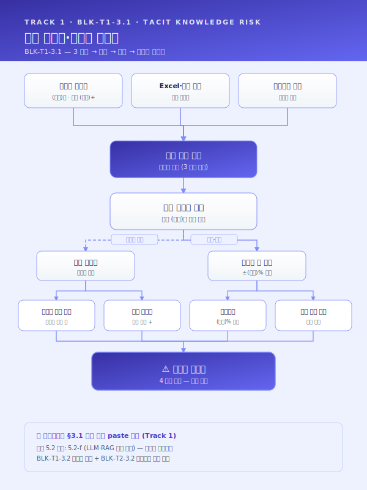
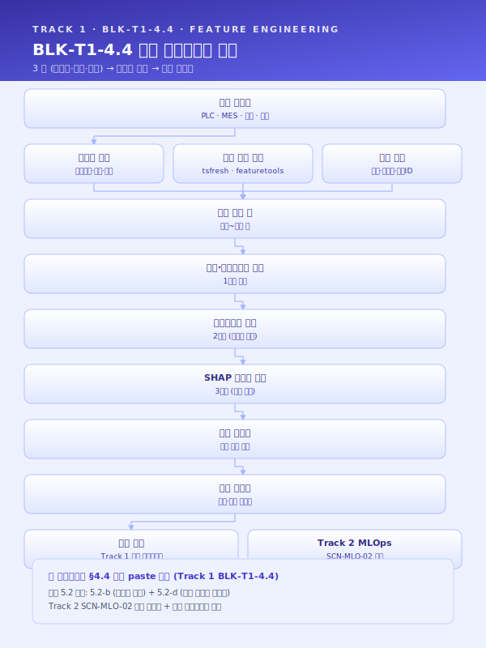

# Track 1 — 공통 재사용 Top 5 블록 실문 초안

> **플레이스홀더 범례** — `[고객사]` 고객사명, `[공정]` 대상 공정명, `[수치]` 수치, `[기간]` 기간, `[%]` 비율.
> 본 문서의 5 블록은 `track1_공통본문_목차.md` 의 3.1 / 3.2 / 4.4 / 4.5 / 4.6 에 대응하며, 사업계획서에 그대로 투입 가능한 **완성 문장** 으로 작성되어 있다. 각 블록은 시나리오·고객사 변경 시 수치·공정명·고객사명 플레이스홀더만 교체하여 재사용한다.

## 사용 안내
- 5 블록은 Track 1 의 **재사용 효율 Top 5** (목차 §공통 자산 vs 특화 지점 맵 참조).
- 각 블록 = 본문 2~3 문단 (600~1200 자) + Mermaid 1 개 + (필요 시) 시나리오 ID·5.2 패턴 ID 인용.
- 사업계획서 조립 시: 본 문서의 해당 블록을 복사 → `[수치]`·`[공정]` 등 플레이스홀더 교체 → 사업별 시연 1~2 줄 부가.
- 본 5 블록은 모든 시나리오와 고객사에 공통 골격으로 적용되며, 시나리오 카탈로그(`시나리오_카탈로그.md`)·5.2 변형 카드(`track1_5.2_AI엔진_변형카드.md`)와의 인용 관계는 각 블록 본문 말미에 명시한다.

---

## 3.1 공정 운영의 인적 의존성 및 암묵지 리스크 (블록명: BLK-T1-3.1)

### 본문

[고객사] 의 [공정] 은 다년간 누적된 현장 경험을 바탕으로 운영되어 왔으며, 그 결과 핵심 공정설계·운전 판단의 상당 부분이 [수치] 명 내외의 베테랑 숙련공이 보유한 암묵지에 의존하는 구조가 형성되어 있다. 신규 주문 접수 시 모관 선정·패스 횟수·열처리 조건·압하율 등 [수치] 종 이상의 변수가 동시에 결정되어야 하나, 그 의사결정의 근거는 문서화된 매뉴얼이 아닌 개별 작업자의 머릿속 경험치이며, 일부 핵심 공정은 [기간] 이상의 현장 경력자가 부재할 경우 동일 품질의 결과를 재현하기 어려운 것이 현실이다. 이러한 운영 구조는 평시에는 안정적으로 보이지만, 정년 퇴직·이직·장기 부재 등 단 한 명의 인적 변동만으로도 공정 역량이 즉각 마비될 수 있다는 점에서 구조적 리스크를 내포한다.

또한 동일 사양의 주문이라 하더라도 작업자별 숙련도 차이로 인해 설계 편차가 ±[수치]% 수준으로 발생하고 있으며, 그 결과 후속 공정의 작업 부하·품질 산포·재작업률에까지 연쇄적인 영향을 미치고 있다. 작업자 간 판단 기준의 차이는 단순한 개인차의 문제가 아니라, 공정 노하우가 수식화·표준화되지 않은 상태에서 Excel 시트와 수기 메모를 통해 파편적으로 관리되는 데에 그 근본 원인이 있다. 이로 인해 동일 작업자라도 시점에 따라 판단이 흔들리며, 신입·중간 숙련자에 대한 체계적 교육 자산이 부재한 상태에서 도제식 전수에만 의존하는 한계가 누적되어 왔다.

요컨대 [고객사] 의 현행 운영 구조는 ① 1~[수치] 명의 베테랑 의존, ② 핵심 인력 이탈 시 즉각적 공정 마비 가능성, ③ 작업자 간 ±[수치]% 수준의 설계 편차, ④ 수식화된 매뉴얼 부재로 인한 재현성 결여라는 네 가지 구조적 리스크를 동시에 안고 있으며, 이는 [공정] 의 고도화·다품종 소량화 추세와 결합되어 시간이 지날수록 더욱 심화되는 양상을 보인다. 본 사업이 추구하는 AI 기반 공정설계·운영 지능화(SCN-STL-07 인발·필거밀 공정설계 LLM, SCN-MET-05 단조·절단·절곡 설정 추천 등 참조) 는 이러한 암묵지를 형식지로 전환하여 조직 자산화함으로써, 인적 의존성에 기인한 구조적 리스크를 근본적으로 해소하는 데 그 일차적 목적이 있다.

### 도식

---

## 3.2 데이터 단절 및 비정형·이미지 기반 관리의 한계 (BLK-T1-3.2)

### 본문

[고객사] 는 원재료 입고부터 최종 출하에 이르는 전 공정에서 상당량의 운영 데이터를 생성하고 있으나, 그 데이터의 상당 부분이 비정형·이미지·수기 양식으로 보관되어 있어 학습·분석·실시간 의사결정에 즉각적으로 활용하기 어려운 상태이다. 특히 입고 원재료의 화학성분·기계적 성질을 기재한 밀시트·성적서는 공급사별로 [수치] 종 이상의 상이한 양식으로 PDF 또는 스캔 이미지 형태로만 보관되며, 그 결과 MES·QMS 와 같은 정형 시스템의 입고대장과 자동 연동되지 못하고 실무자의 수기 입력에 의존하는 운영이 고착되어 있다. 수기 입력은 건당 [수치] 분 내외의 처리 시간을 요구하면서도 [수치]% 수준의 휴먼 에러율을 동반하며, 이는 누적적으로 데이터 신뢰도를 저하시키는 주요 원인으로 작용하고 있다.

데이터 단절의 문제는 단순한 입력 효율의 문제에 그치지 않는다. 공급사·공정·작업자별로 양식이 제각각이라는 사실은 곧 데이터 표준화의 원천이 차단되어 있음을 의미하며, 이로 인해 원재료 물성치와 가공 결과 간 상관관계 분석, 불량 발생 시 Heat No.·LOT No. 기반 역추적, 공정 파라미터와 최종 품질 간 관계 모델링이 모두 사실상 불가능한 상태에 머물러 있다. 동일한 문제는 공정설계서·작업표준서·교대 인수인계 일지·검사 기록지 등 현장에서 일상적으로 생성되는 문서 자산 전반에 걸쳐 나타나고 있으며, 이들 문서는 폴더·파일 단위로 산재되어 있어 검색·재활용에도 [기간] 단위의 시간이 소요되고 있다.

결과적으로 [고객사] 는 데이터를 "보유" 하고 있음에도 불구하고 그 데이터가 AI 학습과 실시간 의사결정의 원재료로 기능하지 못하는 구조적 단절 상태에 있으며, 이러한 단절은 ① 비정형·이미지 자산의 디지털화 부재, ② 양식의 비표준성, ③ MES·QMS 와의 자동 연동 부재, ④ 휴먼 에러 누적이라는 네 축으로 구조화된다. 본 사업은 OCR·문서이해 LLM 기반 밀시트 디지털화(SCN-STL-08 참조), 비정형 문서 지식자산화(SCN-LLM-01 SOP RAG, SCN-LLM-04 도면 RAG 등) 와 결합된 데이터 정형화 체계를 구축함으로써 이 단절을 해소하고, 후속 4 장의 AI 도입 전략이 실효적으로 작동할 수 있는 데이터 기반을 마련하고자 한다.

### 도식

---

## 4.4 피쳐 엔지니어링 접근 (BLK-T1-4.4)

### 본문

본 사업의 AI 모델은 단순히 원시 센서값을 입력으로 하는 블랙박스 구조가 아니라, 도메인 지식과 데이터 과학적 기법을 결합한 체계적 피쳐 엔지니어링을 통해 입력 변수를 설계함으로써 모델 성능과 해석 가능성을 동시에 확보하고자 한다. 피쳐 설계의 첫 번째 축은 **도메인 지식 기반 피쳐** 로, [공정] 의 물리적 특성을 반영한 패스 이력 누적값, 슬라이딩 윈도우 기반 롤링 통계(평균·표준편차·최소·최대), 공정 구간 간 차분, 재질·레시피 메타 정보의 결합 등이 이에 해당한다. 이러한 피쳐는 현장 숙련자가 "이 변수의 변화가 품질에 영향을 준다" 고 판단하는 암묵지를 정량화한 것으로, 모델이 학습할 패턴의 의미를 사전에 부여하는 역할을 수행한다.

두 번째 축은 **자동 피쳐 생성** 으로, tsfresh·featuretools 등 시계열 피쳐 자동 추출 라이브러리를 활용하여 도메인 전문가가 미처 인지하지 못한 잠재 피쳐를 후보로 확보한다. 자동 생성 결과는 수백~수천 개 규모의 후보 피쳐 풀(pool) 을 형성하며, 이는 곧 세 번째 축인 **피쳐 선정** 단계의 입력이 된다. 피쳐 선정은 ① 상관관계 분석을 통한 다중공선성 제거, ② 상호정보량(Mutual Information) 기반 비선형 관계 평가, ③ SHAP(Shapley Additive Explanations) 기반 모델 기여도 분석을 다단계로 적용하여, 통계적·모델 기반 양 측면에서 의미 있는 피쳐만을 최종 입력으로 채택한다. 이러한 다단계 선정은 모델의 일반화 성능을 확보하는 동시에 심사·운영 단계에서의 설명 가능성을 담보한다.

마지막으로 본 사업은 개별 시나리오 단위의 피쳐 설계에 머무르지 않고, 다수 시나리오에서 공통적으로 활용되는 피쳐를 **피쳐 스토어(Feature Store)** 에 등재하여 재사용성을 확보하는 구조를 채택한다. 피쳐 스토어는 학습 시점과 추론 시점의 피쳐 정의를 일관되게 관리하여 학습-추론 간 불일치(training-serving skew) 를 방지하며, 향후 신규 시나리오 도입 시 기존 피쳐를 즉시 재활용함으로써 모델 개발 속도를 가속한다. 이는 5.2-b 시계열 품질·이탈 예측 엔진, 5.2-d 예지보전 엔진, 5.2-e 공정 최적화 엔진 등 다수 엔진 패턴이 동일한 시계열 피쳐 풀을 공유하는 본 사업의 구조와 정합하며, 운영 단계의 피쳐 스토어 거버넌스 상세는 Track 2 MLOps 섹션(SCN-MLO-02 피쳐 스토어 및 모델 레지스트리 구축) 으로 연계된다.

### 도식

---

## 4.5 모델·알고리즘 선정 기준 및 앙상블 구성 (BLK-T1-4.5)

### 본문

본 사업은 단일 알고리즘에 의존하지 않고, **문제 유형별로 적합한 모델 후보군을 사전 정의하고 객관적 기준에 따라 채택 모델을 선정** 하는 모델 거버넌스 체계를 채택한다. 문제 유형은 ① 회귀(품질 수치 예측), ② 시계열 예측(공정 추이 예측), ③ 이상탐지(설비 건전성 감시), ④ 분류(비전 결함 판정·문서 분류), ⑤ 추천(유사 사례·레시피 검색) 의 다섯 축으로 구분되며, 각 축마다 후보 모델 풀이 사전 구성되어 있다. 회귀에는 XGBoost·LightGBM, 시계열에는 LSTM·Transformer·TCN, 이상탐지에는 Isolation Forest·AutoEncoder·OneClassSVM, 분류에는 비전 영역의 EfficientNet·ViT 와 문서 영역의 Transformer 계열, 추천에는 유사도 기반 Retrieval 과 LLM 결합 구조가 1차 후보군으로 등재되어 있다.

채택 모델 선정은 다섯 가지 객관 기준을 동시에 적용한다. 첫째 **데이터 규모** 로, 라벨 보유량·세션 길이·표본 다양성을 평가한다. 둘째 **해석가능성** 으로, 심사·현장 수용성·규제 대응 관점에서 SHAP·Attention 등 설명 도구 적용 가능성을 검토한다. 셋째 **추론 지연** 으로, 실시간 제어가 필요한 시나리오에는 100 ms 이하의 지연을 보장하는 경량 모델 또는 엣지 배포 가능한 구조를 우선한다. 넷째 **재학습 주기** 로, 데이터 드리프트 발생 빈도와 라벨 수집 주기를 고려해 재학습 비용을 산정한다. 다섯째 **현장 엣지 배포 가능성** 으로, GPU·NPU 가용 자원과 운영체제 제약에 부합하는지를 확인한다. 모델 선정 절차는 베이스라인 모델(통상 XGBoost 또는 단순 통계 모델) → 후보 모델 다중 학습·교차검증 → 채택 모델 결정의 3 단계로 진행되며, 각 단계 결과는 별도 평가 보고서로 산출된다.

단일 모델로 충분한 성능을 확보하기 어려운 시나리오에는 **앙상블 전략** 을 적용한다. 앙상블은 ① Stacking(예측값을 메타 모델 입력으로 재학습), ② Weighted Average(검증 성능 기반 가중치 결합), ③ Model Router(입력 특성에 따라 적합한 전문 모델로 분기) 의 세 가지 패턴 중에서 시나리오 특성에 맞게 선택·조합한다. 예컨대 SCN-STL-01 연속주조 품질 예측에서는 LSTM 의 시계열 패턴 학습과 XGBoost 의 표 형식 변수 처리 능력을 Stacking 으로 결합하며(5.2-b 시계열 품질·이탈 예측 엔진 패턴 적용), SCN-STL-09 압연기 예지보전에서는 정상 상태 기반 AutoEncoder 와 신호 기반 Isolation Forest 를 Weighted 로 결합한다(5.2-d 예지보전 엔진). LLM·검색이 결합되는 시나리오(SCN-STL-07 공정설계 LLM, SCN-STL-08 밀시트 OCR) 는 5.2-a 유사 사례 검색 엔진과 5.2-f LLM·RAG 지식검색 엔진의 병기 구조로 구성되며, 본 절의 모델 선정·앙상블 거버넌스가 그 골격으로 작동한다.

### 도식

---

## 4.6 데이터 → 피쳐 → 모델링 → 현장 적용 전체 파이프라인 (BLK-T1-4.6)

### 본문

본 절은 4.3 데이터 유형, 4.4 피쳐 엔지니어링, 4.5 모델 선정에서 서술한 개별 요소를 하나의 엔드투엔드 파이프라인으로 통합하여, [고객사] 의 [공정] 에 AI 가 학습·배포·운영되는 전 과정을 한 장의 흐름으로 제시한다. 파이프라인의 첫 단계인 **데이터 수집** 은 PLC·SCADA·Historian 으로부터의 시계열 신호, MES·QMS·ERP 의 정형 DB, 비전 카메라의 이미지 스트림, 그리고 공정설계서·밀시트·SOP 등 비정형 문서를 동시 수용하며, 각 자원은 시계열 DB(TSDB), 관계형 DB(RDB), 오브젝트 스토리지, 벡터 DB 등 자료 특성에 부합하는 저장소로 적재된다. 이 단계의 핵심은 단일 자료원에 의존하지 않고 정형·비정형·이미지를 동등한 자원으로 다루는 데이터 레이크 구조의 구축에 있다.

이후 **정제·라벨링 → 피쳐 엔지니어링 → 학습·평가 → 모델 레지스트리 → 배포** 의 다섯 단계가 순차적으로 진행된다. 정제 단계에서는 결측·이상치·중복·단위 불일치를 표준 룰셋에 따라 처리하고, 라벨링 단계에서는 품질 검사 결과·정비 이력·작업자 검수 결과를 학습 라벨로 결합한다. 피쳐 엔지니어링은 4.4 절의 다단계 선정 결과를 피쳐 스토어에 등재하는 형태로 수행되며, 학습·평가 단계에서는 4.5 절의 모델 선정 거버넌스에 따라 베이스라인 → 후보 → 채택의 3 단계 평가가 진행된다. 채택된 모델은 모델 레지스트리에 버전·메타데이터·성능 지표와 함께 등록되며, 추론 지연 요건에 따라 엣지 노드 또는 서버로 배포된다. 배포 후에는 실시간 추론·예측이 작업자 HMI 또는 기존 MES·SCADA 화면에 통합되어 현장 의사결정을 지원한다.

엔드투엔드 파이프라인의 마지막 축은 **운영 피드백·재학습 루프** 이며, 이는 본 사업의 단발성 AI 가 아닌 지속 진화형 AI 운영을 담보하는 핵심 장치이다. 현장에서 수집되는 품질 결과·수율·작업자 검수 응답(5.3 HITL 연계) 은 실측 라벨로 환류되어, 데이터 드리프트·성능 저하가 감지될 경우 자동 재학습 파이프라인을 트리거한다. 이 재학습 루프의 거버넌스 상세 — 드리프트 탐지 임계, 챔피언·챌린저 A/B 검증, 모델 자동 승격 — 는 Track 2 MLOps(SCN-MLO-01 모델 운영 감시·드리프트 탐지·자동 재학습) 에서 구체화되며, 본 절은 그 진입 지점으로 기능한다. 한편 비정형 문서 자산의 RAG 기반 활용 흐름은 5.2-f LLM·RAG 지식검색 엔진과 Track 3 LLM+RAG 섹션으로 분기되며(SCN-LLM-01~04 참조), 따라서 본 파이프라인은 Track 1 의 종합 도식인 동시에 Track 2·3 으로의 교량 역할을 동시에 수행한다.

### 도식

---

## 사용 예시 (중견 스테인리스 냉연사 기준 5 블록 조립)

가령 중견 스테인리스 냉연사 대상 "제조AI특화 스마트공장" 사업계획서를 본 5 블록으로 조립한다고 하면, 3 장 AS-IS 서두는 **3.1 암묵지 리스크 블록(BLK-T1-3.1)** 에서 [고객사] 를 해당 냉연사로, [공정] 을 냉간압연 패스 스케줄링으로, 베테랑 의존 인원을 [수치]=2~3 명, 설계 편차를 ±[수치]=10% 수준으로 교체하여 그대로 투입하고, 이어서 **3.2 데이터 단절 블록(BLK-T1-3.2)** 에서 공급사 양식 수를 [수치]=15 종 내외, 휴먼 에러율을 [수치]=3% 수준으로 교체한 뒤 시나리오 인용을 SCN-STL-08 밀시트 디지털화 중심으로 정렬한다. 4 장 TO-BE 의 본문은 **4.4 피쳐 엔지니어링 블록(BLK-T1-4.4)** 을 거의 무수정으로 사용하되 도메인 피쳐 예시를 "패스별 롤 포스 차분·누적 감면율" 로 구체화하고, **4.5 모델 선정 블록(BLK-T1-4.5)** 에서는 5.2-b 시계열 예측 엔진을 채택 사례로 강조하여 SCN-STL-05 냉연 두께 조기경보 시나리오와 정합시키며, **4.6 엔드투엔드 파이프라인 블록(BLK-T1-4.6)** 으로 4 장을 마감한다. 이 같은 방식으로 5 블록을 조합하면 3·4 장 본문의 약 60~70% 가 공통 자산으로 채워지고, 나머지 30~40% 만 해당 사업 고유의 시나리오·수치·고객사 맥락으로 교체되어 재사용 효율과 사업별 특수성의 균형을 동시에 확보할 수 있다.
