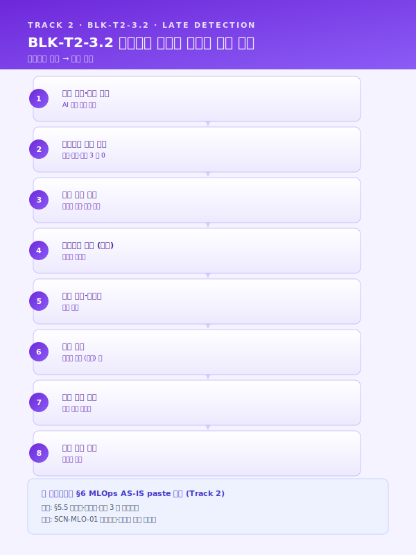

# Track 2 — 공통 재사용 Top 5 블록 실문 초안

> **플레이스홀더 범례** — `[고객사]` 고객사명, `[공정]` 대상 공정명, `[수치]` 수치, `[기간]` 기간, `[%]` 비율.
> 본 문서의 5 블록은 `track2_공통본문_목차.md` 의 §3.2 / §4.2 / §4.4 / §5.5 / §6.1 에 대응하며, 사업계획서 §6 (MLOps AS-IS) · §7 (MLOps TO-BE) · §8 (지속개선 루프) 에 그대로 paste 가능한 한국어 formal 문어체 완성 문장으로 작성되어 있다. 5 블록은 시나리오·고객사 변경 시 수치·공정명·고객사명 플레이스홀더만 교체하여 재사용한다.

## 사용 안내

- 5 블록은 Track 2 의 **재사용 효율 Top 5** (목차 §공통 자산 vs 특화 지점 맵에서 "전 고객사·전 사업 거의 그대로 재사용" 으로 분류된 블록).
- 각 블록 = 본문 1~3 단락 (200~400 자 완성 문장) + 시나리오·도구·5.2 패턴 인용 + 출처 표기.
- 사업계획서 조립 시: 본 문서 해당 블록을 복사 → `[수치]`·`[공정]`·`[고객사]` 등 플레이스홀더 교체 → 사업별 1~2 줄 시연 부가.
- Track 1 본문 Top 5 (BLK-T1-3.1·3.2·4.4·4.5·4.6) 의 형식·분량·인용 양식을 답습한다. 본 5 블록은 Track 1 본문 §4.6 엔드투엔드 파이프라인의 재학습 루프를 호출한 직후 본문 또는 별첨 장으로 삽입하는 것을 표준 배치로 한다.

---

## BLK-T2-3.2 — 모니터링 부재로 인한 후행적 모델 운영의 구조적 공백

### 본문

[고객사] 의 [공정] 에 일부 AI 엔진이 시범 도입되어 운영 중이거나 도입 검토 중인 상태에서, 현 운영 체계의 가장 큰 구조적 공백은 배포된 모델의 **건전성을 상시 판정할 채널이 부재하다는 점** 에 있다. 모델의 입력 피쳐 분포·예측 분포·실측 라벨 기반 성능 지표(정확도·MAE·리콜·캘리브레이션) 가 시계열로 추적되지 않고 있으며, 그 결과 원재료 공급사 교체·계절 변화·설비 노후화·신규 결함 유형의 출현 등 외생 변화가 모델 입력에 투영되더라도 이를 사전에 감지할 수 있는 경로가 존재하지 않는다. 본 사업이 도입할 PSI(Population Stability Index)·KS(Kolmogorov-Smirnov)·Jensen-Shannon 등 분포 거리 지표는 모두 실시간 적재가 전제이나, 현재는 추론 입력값 자체가 영구 보존되지 않아 사후 분석조차 불가능한 상태이다.

이러한 모니터링 공백의 결과, [고객사] 는 모델 성능 저하를 사전 신호로 인지하는 것이 아니라 **현장 불량·재작업·고객 클레임 발생 후에야 비로소 인지하는 후행적 운영** 에 머물러 있다. 일반적으로 드리프트 발생 시점부터 현장 품질 이상으로 표출되기까지는 [기간] 의 잠복 기간이 존재하며, 그 사이 누적되는 불량·재작업 비용은 사후 모델 재학습 비용의 [수치] 배 이상으로 추정된다. 더욱이 사고 후 원인 분석 단계에서도 당시 모델이 어떤 입력값에 대해 어떤 추론 결과를 산출했는지의 로그가 보존되지 않아, 책임 소재 규명·재발 방지 대책 수립 자체가 불가능에 가까운 상황이 반복되고 있다.

요컨대 [고객사] 의 현 모델 운영 구조는 ① 입력·예측·성능 3 축 모니터링 채널의 전면적 부재, ② 추론 입력·출력 로그의 영구 보존 체계 미구축, ③ 드리프트 발생 시점과 품질 이상 표출 시점 간 [기간] 수준의 잠복 구간 방치, ④ 사후 원인 규명 불능에 따른 동일 사고 재발 등 네 가지 구조적 공백을 동시에 안고 있다. 본 사업의 Track 2 모니터링·드리프트 탐지 모듈(§5.5) 은 인프라·데이터·성능 3 층 모니터링 스택과 추론 로그 영구 보존 체계를 구축하여, 모델 건전성 판정을 후행에서 선행으로 전환하고 SCN-MLO-01 모델 운영 감시·드리프트 탐지·자동 재학습 시나리오의 핵심 기반으로 작동하는 것을 일차 목표로 한다.

### 삽화 (Mermaid)

> [출처: track2_공통본문_목차.md §3.2 모니터링 부재, §5.5 모니터링·드리프트 탐지·경보, 가이드_KPI_측정 §드리프트 지표 임계 (PSI 0.1·0.25), 통합 파일럿 §4.2 MLOps 6 차원]

---

## BLK-T2-4.2 — MLOps 핵심 7 종 구성요소 모듈 인벤토리

### 본문

본 사업의 MLOps TO-BE 아키텍처는 **레지스트리·피쳐 스토어·파이프라인·서빙·모니터링·피드백·거버넌스의 7 종 구성요소** 를 모듈 단위로 표준화하여, [고객사] 의 [공정] 별·시나리오별 필요 모듈만 선택·조합할 수 있는 구조로 설계된다. 이러한 모듈 인벤토리 접근은 일괄 도입에 따른 초기 투자 부담을 분산함과 동시에, 사업 진행 중 우선순위 변동·예산 조정에 유연하게 대응할 수 있는 장점을 갖는다. 7 종 모듈은 단일 중앙 도식 위에 원형으로 배치되며, 모델 레지스트리가 중심에서 학습·배포·모니터링·피드백을 매개하는 허브 역할을 수행하는 것이 본 아키텍처의 핵심 설계 원칙이다.

7 종 모듈의 책임 범위와 대표 도구는 다음과 같이 정의된다. ① **모델 레지스트리** 는 학습된 모델의 버전·아티팩트·모델 카드·성능 지표를 단일 소스에서 관리하며, MLflow 를 1 차 후보로 채택한다. ② **피쳐 스토어** 는 학습용 Offline Store 와 추론용 Online Store 의 일관성을 확보하여 학습-추론 간 불일치(training-serving skew) 를 방지하며, Feast 를 1 차 후보로 한다. ③ **학습·재학습 파이프라인** 은 Airflow·Kubeflow Pipelines 기반 DAG 로 데이터 인출부터 배포 승인까지 전 단계를 코드화한다. ④ **추론 서빙** 은 BentoML·Seldon Core·NVIDIA Triton 등을 활용하여 엣지·서버 이원 배포 및 카나리·섀도우·챔피언/챌린저 배포 패턴을 지원한다. ⑤ **모니터링** 은 Evidently·Prometheus·Grafana 조합으로 인프라·데이터·성능 3 층 감시를 수행한다. ⑥ **피드백 루프** 는 현장 태블릿 UI 로부터 라벨 DB 까지의 자동 환류 경로를 구축하여 작업자 정정 라벨이 학습셋으로 환류되는 구조를 보장한다. ⑦ **거버넌스** 는 RBAC·감사 로그·리니지·모델 카드를 통해 ISO/IEC 42001·IATF 16949 등 외부 인증 요구에 대응한다.

본 7 종 모듈 구성은 [고객사] 의 운영 조직 RACI 표와 1 대 1 로 매핑되어 모듈별 소유팀·SLA·문서화 책임을 명확히 한다. 데이터 사이언티스트는 ①·②·③ 의 산출물 책임을, MLOps 엔지니어는 ③·④·⑤ 의 운영 책임을, 운영자(현장 관리자) 는 ⑥ 의 데이터 품질 책임을, 감사·품질팀은 ⑦ 의 거버넌스 책임을 각각 분담하며, 이러한 역할 분담은 SCN-MLO-01·02·03 3 시나리오 전반에 공통으로 적용된다. 도구 스택은 [고객사] 규모(대기업/중견/중소) 에 따라 3 종 템플릿으로 분기되며, 중견 철강사 기준 표준 조합은 MLflow + Feast + Airflow + BentoML + Evidently + Prometheus·Grafana 의 오픈소스 중심 구성을 1 차 권장한다.

### 삽화 (Mermaid)

> [출처: track2_공통본문_목차.md §4.2 핵심 구성요소 7 종, §4.3 도구 스택 선정 기준, 가이드_외부검증_운영 §RACI 매트릭스, 통합 파일럿 §4.2 MLOps 6 차원, 도메인_지식추출_가이드 §모듈 책임 분담]

---

## BLK-T2-4.4 — 엣지·온프레미스·클라우드 3 단 참조 아키텍처

### 본문

본 사업의 MLOps 참조 아키텍처는 [고객사] 의 OT 폐쇄망 제약과 실시간 추론 요구를 동시에 충족하기 위해 **엣지·온프레미스·클라우드 3 단 구조** 로 설계된다. 엣지 노드는 카메라·PLC 신호 수집과 경량 추론을 담당하고, 온프레미스 영역은 데이터 레이크·학습 파이프라인·모델 레지스트리·서빙·모니터링의 본거지이며, 클라우드(KT·NHN·AWS 국내 리전 등 CSAP 인증 리전 우선) 는 대용량 실험 학습과 비실시간 추론을 보조하는 위계로 역할이 명확히 분리된다. 본 아키텍처는 Track 1 본문 §4.6 의 엔드투엔드 파이프라인을 운영판으로 확장한 것이며, 학습은 클라우드·추론은 엣지·온프레미스 기본 유지의 하이브리드 원칙을 따른다.

데이터 흐름은 **데이터 플레인·컨트롤 플레인·피드백 플레인 3 색** 으로 구분되어 시각화된다. 데이터 플레인은 PLC·센서·비전으로부터의 원시 데이터가 게이트웨이를 거쳐 온프레 데이터 레이크(TSDB·Object Storage) 로 적재되는 회색 흐름이며, 컨트롤 플레인은 학습 파이프라인이 모델 레지스트리에 등록한 아티팩트가 서빙 계층을 통해 엣지로 재배포되는 파랑 흐름이다. 피드백 플레인은 현장 태블릿 UI 의 작업자 정정 라벨이 라벨 DB 를 거쳐 데이터 레이크로 환류되는 주황 흐름으로, 본 사업이 강조하는 지속 진화형 운영의 핵심 경로이다. OT ↔ IT ↔ 클라우드 경계는 점선으로 표기되며, 각 경계에서 서명된 아티팩트·일방향 게이트웨이·TLS 인증서 기반 디바이스 ID 관리가 적용된다.

본 참조 아키텍처는 [고객사] 의 시나리오 인벤토리(SCN-MLO-01 모델 운영 감시·드리프트 탐지·자동 재학습, SCN-MLO-02 피쳐 스토어 및 모델 레지스트리 구축, SCN-MLO-03 현장 피드백 HITL 루프) 가 공통으로 의존하는 메인 도식으로 사업계획서 본문 1 페이지 풀 다이어그램으로 제시된다. 노드 명칭만 [고객사] 표준에 맞춰 일부 치환되며, 그 외 구조는 전 고객사·전 사업에 공통 고정으로 재사용된다. 서비스 가용성은 99.0~99.9% 를 목표로 하며, 추론 지연은 실시간 제어 [수치] ms 이하·HMI 경보 [수치] s 이하·RAG 질의 [수치] s 이하의 3 구분 SLA 를 본 아키텍처상의 각 서빙 계층에 매핑한다.

### 삽화 (Mermaid)

> [출처: track2_공통본문_목차.md §4.4 전체 참조 아키텍처, §2.2 배포 지형, §2.3 SLA/SLO, Track 1 §4.6 엔드투엔드 파이프라인, RAG_인프라_운영_가이드 §3 단 배포, 통합 파일럿 §4.2 MLOps 6 차원]

---

## BLK-T2-5.5 — 인프라·데이터·성능 3 층 모니터링 및 드리프트 탐지 체계

### 본문

본 사업의 모니터링 체계는 [고객사] 의 [공정] 에 배포된 AI 엔진의 건전성을 **인프라·데이터·성능 3 층** 에서 동시에 감시하는 구조로 설계된다. 첫째 인프라 층은 Prometheus 가 CPU·GPU·메모리 사용률, 추론 지연(p50·p95·p99), 처리량(TPS), 에러율을 시계열로 수집하고 Grafana 가 대시보드로 가시화하며, SLA 위반 시 자동 경보를 발생시킨다. 둘째 데이터 층은 Evidently 가 입력 피쳐 분포·예측 분포의 안정성을 PSI·KS·Jensen-Shannon 등 분포 거리 지표로 측정하며, 본 사업의 표준 임계로 PSI 0.1 이하는 안정·0.1~0.25 는 주의·0.25 이상은 재학습 검토를 채택한다. 셋째 성능 층은 실측 라벨 기반의 정확도·MAE·리콜·캘리브레이션을 측정하되, 라벨 지연이 큰 시나리오에는 예측 신뢰도 평균·경보 빈도 등 프록시 지표로 보강한다.

드리프트 탐지의 핵심은 단순 통계 임계가 아니라 **임계·기간·비즈니스 영향 3 차원 결합 판정** 에 있다. 즉 PSI 가 단발적으로 0.25 를 초과하더라도 [기간] 이내 자연 회귀하는 경우 정상 변동으로 간주하며, [기간] 이상 지속되거나 비즈니스 KPI(불량률·수율) 상의 동행 악화가 관측될 때만 재학습 트리거로 승격된다. 이러한 다단계 판정은 과잉 재학습으로 인한 자원 낭비와 모델 혼선을 방지하며, 동시에 임계 미달 상황에서 누적되는 미세 드리프트를 놓치지 않기 위해 월간 모델 리뷰(§6.5) 에 누적 PSI 추이를 정기 의제로 상정한다. 경보 채널은 Slack·이메일·SMS·HMI 알람의 4 채널 다중화 구조로 구축되며, 심각도별 에스컬레이션 정책(Lv.1 담당자 → Lv.2 팀장 → Lv.3 임원) 을 사전 정의한다.

본 모니터링 스택은 SCN-MLO-01 의 핵심 산출물이자 SCN-STL-01 연속주조 품질, SCN-STL-05 냉연 두께 조기경보, SCN-STL-09 압연기 예지보전, SCN-RUB-01 고무 배합 품질 등 다수 시나리오에서 공통 골격으로 재사용된다. [고객사] 의 시나리오별 임계 수치만 별도 표로 부속하며, 본 3 층 구조 자체는 전 고객사·전 사업에 공통 고정으로 적용된다. 더불어 본 모니터링 스택은 Track 3 LLM·RAG 의 검색 품질·환각률·응답 시간 모니터링에도 동일 골격으로 확장 적용되며, RAG 인덱스 재구축 트리거(SCN-LLM-01·02) 와 본 §5.5 의 드리프트 트리거가 동일한 알람 큐를 공유하는 구조로 설계된다.

### 삽화 (Mermaid)

> [출처: track2_공통본문_목차.md §5.5 모니터링·드리프트 탐지·경보, §6.2 재학습 트리거 5 대 축, 가이드_KPI_측정 §드리프트 임계, 위험관리_매트릭스_가이드 §경보 에스컬레이션, 통합 파일럿 §4.2 MLOps 6 차원]

---

## BLK-T2-6.1 — 개선 포인트 선정 노하우 — 어디를 왜 먼저 고칠 것인가

### 본문

본 사업의 지속 개선 루프가 "재학습하면 된다" 식의 단순 도식에 머무르지 않고 실효적으로 작동하기 위해서는 **무엇을 왜 먼저 고칠 것인가** 의 사고 틀이 선행되어야 한다. 개선 대상은 ① 데이터(품질 저하·수집 누락·라벨 편향), ② 피쳐(정의 오류·시간 누수·정규화 변동), ③ 모델(알고리즘·하이퍼파라미터·앙상블 비중), ④ 운영(임계·경보·HITL UI·에스컬레이션) 의 4 축으로 분류되며, 동일한 성능 저하 현상이라도 그 원인이 어느 축에 있는지에 따라 처방이 근본적으로 달라진다. 본 절은 [고객사] 의 [공정] 운영 환경에서 4 축 중 어디를 먼저 손볼 것인가를 판정하는 객관 기준을 제시한다.

우선순위 판단은 **드리프트 신호 강도 × 비즈니스 영향 × 수정 비용** 3 축 스코어링으로 정량화된다. 드리프트 신호 강도는 PSI·KS·성능 지표 변화량으로 측정되며, 비즈니스 영향은 해당 엔진이 직접 영향을 미치는 불량률·수율·납기 지표의 가중치로 환산되고, 수정 비용은 라벨링 공수·재학습 GPU 시간·현장 검증 기간을 합산한 값으로 산정된다. 3 축 스코어 곱이 임계 [수치] 이상인 개선 포인트를 월간 모델 리뷰의 우선 의제로 상정하며, 그 외 항목은 분기 포트폴리오 리뷰로 이연된다. 이러한 객관 스코어링은 "담당자 감" 에 의존한 임의적 재학습을 배제하고 외부 감사·심사 시 의사결정 근거를 명시적으로 제시하는 효과를 함께 가진다.

본 사업이 정의하는 **5 대 개선 포인트 패턴** 은 다음과 같이 정형화된다. 첫째 **원재료 공급사 변경** — 입력 분포 드리프트 → 피쳐 정규화 재정의·재학습. 둘째 **신규 결함 유형 출현** — 라벨 체계 확장·재라벨링·재학습. 셋째 **계절·환경 변화** — 시간 피쳐·외생 변수 추가. 넷째 **설비 개·보수 이후 신호 특성 변화** — 드리프트 탐지 임계 재설정·재학습. 다섯째 **현장 피드백 누적으로 특정 구간 정확도 저하 확인** — 해당 구간 가중 재학습. 5 개 패턴 각각에 대해 본 사업은 진단 체크리스트·표준 처방 절차·예상 리드타임([기간]) 을 사전 정의하여, [고객사] 운영팀이 동일 패턴 재발 시 평균 [%] 단축된 시간 내에 대응을 완료할 수 있도록 한다. 본 패턴 정형화는 Track 1 §3.1 암묵지 리스크 블록과 쌍을 이루는 Track 2 의 최고 재사용 자산이며, 월간 모델 리뷰·분기 포트폴리오 리뷰·연간 거버넌스 감사 3 단 리츄얼(§6.5) 과 결합되어 [고객사] 의 MLOps 운영 성숙도를 Lv.0 → Lv.2 로 단계적으로 끌어올리는 구체적 경로를 제공한다.

### 삽화 (Mermaid)

> [출처: track2_공통본문_목차.md §6.1 개선 포인트 선정 노하우, §6.2 재학습 트리거 5 대 축, §6.5 월간 리뷰 리츄얼, 도메인_지식추출_가이드 §패턴 정형화, TRL_진척_관리_가이드 §개선 리드타임, 가이드_KPI_측정 §우선순위 스코어링]

---

## 사용 예시 — 중견 철강사 기준 5 블록 조립 시연

가령 YCP특수강·코리녹스 등 중견 철강사를 대상으로 "디지털 경남" 또는 "스마트공장 고도화 — MLOps 중심" 성격의 사업계획서 §6~§8 (분량 15~20 페이지) 를 본 5 블록으로 조립한다고 하면, §6 AS-IS 서두는 **BLK-T2-3.2 모니터링 부재 블록** 에서 [고객사] 를 해당 철강사로, [공정] 을 냉간압연 두께 예측·압연기 진동 예지보전으로, 잠복 기간을 [기간]=2~4 주, 사후 비용 배수를 [수치]=5~10 배 수준으로 교체하여 그대로 투입한다. 이어서 §7 TO-BE 본문은 **BLK-T2-4.2 7 종 모듈 인벤토리 블록** 으로 모듈 단위 도입 전략을 제시하고, **BLK-T2-4.4 3 단 참조 아키텍처 블록** 으로 §7 의 메인 풀페이지 도식을 마감한다. SLA 수치는 실시간 [수치]=100 ms·HMI [수치]=1 s·RAG [수치]=5 s 로 교체하며, 노드 명칭은 해당 철강사 표준 시스템명(MES·QMS) 으로 일부 치환한다.

§8 지속개선 루프는 **BLK-T2-5.5 3 층 모니터링 블록** 으로 모니터링 스택과 PSI 0.1·0.25 임계 체계를 제시한 뒤, **BLK-T2-6.1 개선 포인트 선정 블록** 으로 4 축 분류·3 축 스코어링·5 대 패턴을 정렬하여 마감한다. 시나리오 인용은 SCN-MLO-01·02·03 을 공통 인용하되, 철강사 특화로 SCN-STL-01 연속주조·SCN-STL-05 냉연 두께·SCN-STL-09 압연기 예지보전을 각 블록 말미에 부가한다. 이 같은 방식으로 5 블록을 조합하면 §6~§8 본문의 약 65~70% 가 공통 자산으로 채워지고, 나머지 30~35% 만 해당 사업 고유의 시나리오·수치·고객사 맥락으로 교체되어 Track 1 본문 Top 5 와 동일한 재사용 효율 구조가 Track 2 에서도 확보된다.
