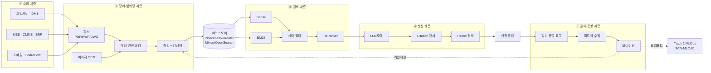
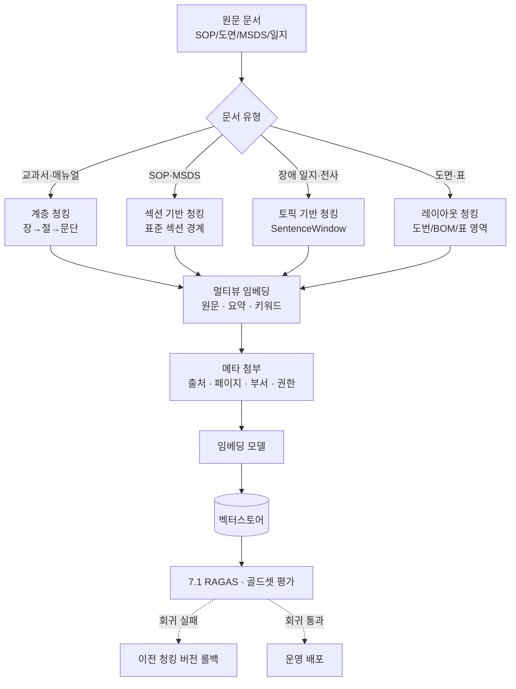

# Track 3 — 공통 재사용 Top 5 블록 실문 초안

> **플레이스홀더 범례** — `[고객사]` 고객사명, `[공정]` 대상 공정명, `[수치]` 수치, `[기간]` 기간, `[%]` 비율, `[문서종]` 대상 문서군(예: 공정설계서·SOP·밀시트·MSDS 등), `[LLM모델]` 선정 LLM(예: EXAONE·HyperCLOVA·GPT·Claude 등), `[벡터스토어]` 벡터스토어(예: Pinecone·Weaviate·Milvus·OpenSearch 등).
> 본 문서의 5 블록은 `track3_공통본문_목차.md` 의 3.1 / 3.2 / 4.2 / 5.2 / 5.5 에 대응하며, 사업계획서에 그대로 투입 가능한 **완성 문장** 으로 작성되어 있다. 각 블록은 시나리오·고객사 변경 시 수치·공정명·고객사명·문서종·모델명 플레이스홀더만 교체하여 재사용한다.

## 사용 안내

- 5 블록은 Track 3 의 **재사용 효율 Top 5** (목차 §공통 자산 vs 특화 지점 맵 참조).
- 각 블록 = 본문 2~3 문단(600~1200 자) + Mermaid 1 개 + 시나리오 ID·관련 자산 인용.
- 사업계획서 조립 시: 본 문서의 해당 블록을 복사 → `[수치]`·`[공정]`·`[고객사]`·`[문서종]`·`[LLM모델]`·`[벡터스토어]` 등 플레이스홀더 교체 → 사업별 시연 1~2 줄 부가.
- 본 5 블록은 SOP RAG·장애 RAG·도면 RAG·MSDS RAG·밀시트 OCR·공정설계 LLM 등 SCN-LLM-01~04 와 SCN-STL-07/08, SCN-SAF-03 등 Track 3 가 호출되는 전 시나리오에 공통 골격으로 적용된다.
- Track 1·Track 2 와의 인용 관계는 각 블록 본문 말미에 명시한다.

---

## 3.1 문서 포맷 이질성 및 검색 불가 상태 (블록명: BLK-T3-3.1)

### 본문

[고객사] 의 [공정] 운영에 필요한 지식 자산은 [수치] 년 이상의 누적을 통해 상당한 분량으로 축적되어 있으나, 그 보관 형태는 HWP·PDF·Excel·스캔 이미지·DWG·이메일 본문 등 [수치] 종 이상의 이질적 포맷으로 산재되어 있어 검색·재활용이 사실상 불가능한 상태에 머물러 있다. 동일한 SOP·작업표준서·공정설계서가 부서별 파일 서버, 담당자 개인 PC, 공유 메일함, 출력본 캐비닛에 분산 저장되어 있으며, 중앙 집중형 문서관리시스템(DMS) 의 부재로 인해 작업자가 특정 절차나 과거 사례를 찾기 위해서는 폴더 트리를 수동으로 탐색하거나 동료에게 구두로 문의하는 방식에 의존할 수밖에 없는 운영 구조가 고착되어 있다. 그 결과 단일 절차 문서 한 건을 식별·확보하는 데에도 평균 [기간] 이상의 시간이 소요되며, 야간·주말 등 베테랑 부재 시점에는 동일한 탐색조차 수행되지 못한 채 작업자의 직관적 판단으로 대체되는 사례가 빈번하게 보고되고 있다.

문제의 본질은 단순한 저장소 분산에 그치지 않는다. 현행 검색 체계는 파일명·폴더 경로 기반의 메타 검색에만 의존하고 있으며, 문서 본문에 대한 전문 검색(full-text search) 기능 자체가 부재하다. 더욱이 스캔 PDF·이미지로만 보관된 [문서종] 의 경우 OCR 이 적용되지 않아 본문 텍스트가 디지털 자산으로 인식되지 못하고 있으며, HWP·DWG 등 국산·전문 포맷은 통상의 인덱서가 처리하지 못하는 한계까지 가중되어 있다. 동일 내용의 복수 버전이 [수치] 종 이상 공존하면서도 최신 승인본을 식별할 메타데이터가 부재한 상황은 검색 불가의 문제를 넘어 **잘못된 버전을 참조한 오작업 리스크** 로까지 직결되며, 이는 품질·안전 측면의 잠재적 손실로 누적되고 있다.

요컨대 [고객사] 의 비정형 지식 자산은 ① [수치] 종 이상의 포맷 혼재, ② 중앙 저장소 부재로 인한 분산 보관, ③ 본문 검색·OCR 미적용에 따른 내용 검색 불가, ④ 최신본 식별 불가에서 비롯된 오작업 리스크라는 네 가지 구조적 한계를 동시에 안고 있다. 이러한 한계는 곧 본 사업이 추구하는 LLM·RAG 기반 지능형 지식 플랫폼(SCN-LLM-01 SOP RAG, SCN-LLM-02 장애 RAG, SCN-LLM-04 도면 RAG 참조) 의 구축 당위성을 직접적으로 정당화하는 근거이며, 4 장에서 제시할 RAG 기준 아키텍처는 위 네 가지 한계를 수집·정제·청킹·검색 계층 각각에서 구조적으로 해소하는 것을 일차 목표로 한다.

> [출처: track3_공통본문_목차.md §3.1, 시나리오_상세_특수강관 LLM-02·STL-07·STL-11, 가이드_RAG_인프라_운영 §1 수집 계층]

### 삽화 (Mermaid)

```mermaid
flowchart TD
    subgraph 산재[분산 저장소]
        A1[부서 파일서버]
        A2[개인 PC]
        A3[공유 메일함]
        A4[출력본 캐비닛]
    end
    subgraph 포맷[이질 포맷]
        F1[HWP/PDF]
        F2[Excel]
        F3[스캔 이미지]
        F4[DWG/DXF]
    end
    A1 --> F1
    A2 --> F2
    A3 --> F1
    A4 --> F3
    F1 --> Q[작업자 탐색<br/>[기간]/건]
    F2 --> Q
    F3 -.OCR 미적용.-> X1[본문 검색 불가]
    F4 -.전용 포맷.-> X1
    Q --> X1
    F1 --> V[복수 버전 [수치]종]
    V -.최신본 식별 불가.-> X2[오작업 리스크]
    X1 --> R[지식 활용 단절]
    X2 --> R
```

---

## 3.2 숙련자 암묵지 의존 및 지식 이전 실패 (BLK-T3-3.2)

### 본문

[고객사] 의 [공정] 운영에서 가장 중대한 지식 리스크는 문서로 기록되지 않은 채 베테랑 숙련공의 머릿속에만 존재하는 **살아있는 지식** 의 휘발 가능성이다. 신규 주문에 대한 공정설계 결정 이유, 비정형 장애 발생 시 처치 순서의 우선순위, 불량 원인 판단 시 무엇을 먼저 의심할지에 대한 직관적 판단 근거 등은 어떤 표준 매뉴얼에도 명시되어 있지 않으며, [수치] 명 내외의 베테랑이 [기간] 이상의 현장 경험을 통해 체득한 암묵지에 전적으로 의존하는 구조가 형성되어 있다. 이는 평시에는 가시화되지 않으나 베테랑의 정년 퇴직·이직·장기 부재 단 한 건만으로도 즉각적 역량 공백을 초래하며, 인구 고령화·숙련공 감소 추세 속에서 그 발생 가능성은 매년 누적적으로 증가하고 있다.

지식 이전 실패의 구조적 원인은 다층적이다. 신입 작업자에 대한 OJT 는 통상 [기간] 이상의 베테랑 1:1 밀착을 전제로 설계되어 있으나, 인력 부족·교대 운영·다품종 생산 구조 하에서 실제로는 단축·축약 운영되는 경우가 빈번하다. 교대 인수인계 일지·정비 일지·불량 보고서 등에 단편적 기록이 남기는 하나, 그 기록은 결과 중심의 짧은 메모 수준에 머물러 있어 **"왜 그렇게 판단했는가"** 라는 의사결정의 이유는 거의 보존되지 못한다. 부서 간·교대 간 지식 단절은 동일한 실수의 반복과 비효율의 누적을 야기하며, 더 나아가 베테랑 한 명이 경쟁사로 이직할 경우 핵심 노하우 자체가 외부 유출되는 기술 보안 리스크와도 직결된다. 기존의 ERP·MES·CMMS 시스템은 정형 트랜잭션의 기록에는 적합하나 **문장 단위로 기술되는 의사결정 이유·선례·예외 처리 근거** 를 담아내기에는 본질적으로 부적합하다.

이러한 지식 이전 실패는 곧 사업 연속성(BCP) 의 직접적 위협이며, 본 사업이 추진하는 LLM·RAG 기반 암묵지 형식지화는 그 해결책의 본체에 해당한다. 베테랑 인터뷰·골드셋 구축을 통해 핵심 의사결정 근거를 [수치] 건 이상 형식지로 추출하고(SCN-STL-07 공정설계 LLM, SCN-LLM-01 SOP RAG, SCN-LLM-02 장애 RAG 참조), 이를 RAG 파이프라인의 검색·생성 자산으로 적재함으로써, ① 베테랑 부재 시점의 의사결정 공백 해소, ② 신입 OJT 의 가속화 및 자가학습 가능 환경 제공, ③ 부서·교대 간 지식 동기화, ④ 핵심 노하우의 조직 자산화를 통한 기술 보안 강화라는 네 축의 효과를 동시에 달성하고자 한다. 본 절의 문제의식은 Track 1 의 3.1 인적 의존성 리스크와 호응하되, 그 해결책의 본체가 Track 3 임을 명시하는 교량 지점이기도 하다.

> [출처: track3_공통본문_목차.md §3.2, 가이드_도메인_지식추출 §베테랑 인터뷰·골드셋, 시나리오_상세_특수강관 LLM-01·LLM-02·STL-07, track1_본문_공통Top5.md §3.1 호응]

### 삽화 (Mermaid)

```mermaid
flowchart LR
    subgraph 베테랑[베테랑 [수치]명 · 경력 [기간]+]
        K1[공정설계 결정 이유]
        K2[장애 처치 우선순위]
        K3[불량 원인 직관]
        K4[예외 처리 노하우]
    end
    K1 -.문서화 부재.-> M[교대 일지<br/>결과 중심 메모]
    K2 -.단편 기록.-> M
    K3 -.전수 부재.-> M
    M --> G1[OJT [기간] 단축 운영]
    G1 --> G2[신입 자가학습 불가]
    베테랑 -.퇴직·이직.-> R1[즉각적 역량 공백]
    베테랑 -.경쟁사 이직.-> R2[기술 유출]
    G2 --> R3[동일 실수 반복]
    M -.ERP·MES 부적합.-> R4[의사결정 이유 휘발]
    R1 --> X[BCP 위협]
    R2 --> X
    R3 --> X
    R4 --> X
    X -.해결책.-> S[Track 3 RAG<br/>암묵지→형식지]
```

---

## 4.2 RAG 기준 아키텍처 — 5 계층 (BLK-T3-4.2)

### 본문

본 사업이 구축하는 지능형 지식 플랫폼은 단발성 검색 도구가 아니라, 다수 시나리오에 공유되는 **5 계층 RAG 기준 아키텍처** 를 골격으로 한다. 5 계층은 ① 수집 계층 — 파일 서버·DMS·MES·CMMS·이메일 커넥터를 통한 증분·이벤트 기반 자동 수집, ② 정제·임베딩 계층 — PDF·HWP·DWG 파서와 이미지 OCR, 메타데이터 추출, 권한 태깅, 문서 유형별 청킹 정책에 따른 임베딩 생성, ③ 검색 계층 — Dense(의미 기반) + BM25(키워드 기반) 하이브리드, 메타 필터(부서·공정·설비·날짜·권한), Re-ranker(Cross-Encoder) 의 3 단 결합, ④ 생성 계층 — [LLM모델] 을 통한 응답 생성과 근거 인용(Citation) 강제·Reject 정책 적용, ⑤ 감사·운영 계층 — 질의·응답 전체 로그의 불변 저장, 피드백 수집, 모니터링 대시보드로 구성된다. 각 계층은 인터페이스 표준에 따라 결합되어 있으며, 시나리오 추가 시에도 계층 단위 확장만으로 대응 가능한 플랫폼 구조를 채택한다.

5 계층 구조의 첫 번째 핵심 가치는 **데이터 주권·보안의 계층별 보장** 에 있다. 수집 계층에서 권한·민감도 메타가 부착되고, 정제 계층에서 개인정보·영업비밀이 자동 마스킹되며, 검색 계층에서 ACL 메타 필터가 강제 적용된 뒤, 생성 계층의 [LLM모델] 라우팅이 민감도에 따라 외부 API 또는 온프레미스 sLM 으로 분기됨으로써, 단일 실패점이 전체 보안을 위협하지 않는 다층 방어 구조가 형성된다. 두 번째 핵심 가치는 **환각(Hallucination) 의 구조적 차단** 으로, 검색 계층에서 확보된 근거 청크 외의 정보 생성을 시스템 프롬프트로 엄격히 금지하고, 검색 유사도가 임계 이하일 때는 답변을 거부하도록 설계한다. 세 번째 가치는 **지속 진화** 로, 감사·운영 계층에서 수집된 피드백이 정제·임베딩 계층의 문서 보강·리인덱싱 입력으로 환류되어, 운영 시간이 누적될수록 응답 품질이 향상되는 자기 강화 루프를 형성한다.

본 5 계층 아키텍처는 [벡터스토어](Pinecone·Weaviate·Milvus·OpenSearch 중 고객사 보안정책·인프라 규모에 따라 선정) 를 중심 자료원으로 하되, 검색 계층의 BM25 인덱스 및 메타 RDB 와 결합하여 하이브리드 검색을 지원한다. 동일 아키텍처는 SOP RAG(SCN-LLM-01)·장애 RAG(SCN-LLM-02)·불량 보고서 자동화(SCN-LLM-03)·도면 RAG(SCN-LLM-04)·공정설계 LLM(SCN-STL-07)·밀시트 OCR(SCN-STL-08)·MSDS RAG(SCN-SAF-03) 등 본 사업이 다루는 전 시나리오에 동일 골격으로 적용되며, 시나리오별 차이는 청킹 정책·메타 스키마·프롬프트의 특화 계층에서만 발생한다. 운영 단계의 모니터링·드리프트 탐지는 Track 2 MLOps 의 SCN-MLO-01·02·03 과 동일 플랫폼에서 수행되며, 본 절은 Track 3 가 단독 시스템이 아니라 Track 1·2 와 결합된 통합 AI 운영 체계의 한 축임을 보이는 기준 다이어그램의 위치를 점한다.

> [출처: track3_공통본문_목차.md §4.2, 가이드_RAG_인프라_운영 §1~5 (수집·임베딩·검색·생성·감사 5 계층), 사업계획서_패키지3_특수강관_파일럿]

### 삽화 (Mermaid)



---

## 5.2 청킹 전략 — 계층·섹션·토픽·멀티뷰 (BLK-T3-5.2)

### 본문

RAG 시스템의 응답 품질은 흔히 "검색 품질이 결정한다" 고 말하나, 그 검색 품질의 절반 이상은 **청킹 품질** 에 좌우된다. 청킹이란 원문 문서를 검색 가능한 의미 단위로 분할하는 작업으로, 분할의 경계가 의미 단위와 어긋나면 아무리 우수한 임베딩 모델·검색기를 적용해도 정확한 근거 청크를 회수할 수 없다. 본 사업은 문서 유형별 특성에 따라 ① 계층 청킹, ② 섹션 기반 청킹, ③ 토픽 기반 청킹, ④ 멀티뷰 임베딩 의 네 가지 전략을 차등 적용하며, 동일 문서에 대해서도 시나리오 목적에 따라 복수 전략을 병행한다.

**계층 청킹** 은 문서 → 장 → 절 → 문단의 위계 구조를 보존하여 분할하는 방식으로, 검색 시 매칭된 문단과 함께 그 상위 절·장의 컨텍스트를 동반 반환함으로써 LLM 의 응답 정확도를 높인다. **섹션 기반 청킹** 은 SOP·작업표준서·MSDS 와 같이 표준화된 섹션 구조를 가진 문서에 적용되며, "용도·취급방법·응급조치·폐기방법" 과 같은 표준 섹션을 자연 경계로 사용함으로써 의미 단위 분할의 정확도를 극대화한다. **토픽 기반 청킹** 은 자유 형식 문서·인터뷰 전사·교대 일지 등 표준 구조가 부재한 문서에 SentenceWindow·Semantic Chunking 기법을 적용하여 의미 군집을 자동 추출하는 방식이다. **멀티뷰 임베딩** 은 동일 청크를 원문·요약·키워드 등 복수 표현으로 임베딩하여 동일 사실을 다양한 질의 표현으로 회수할 수 있도록 검색 다양성을 확보한다. 청크 크기·오버랩·메타데이터 첨부(출처·페이지·부서·권한 태그) 는 시나리오별 실험을 통해 최적값을 도출하되, 통상 [수치] 토큰 청크 + [수치]% 오버랩을 출발점으로 한다.

청킹 전략의 채택은 시나리오 특성에 따라 결정된다. SOP·MSDS RAG(SCN-LLM-01·SCN-SAF-03) 는 섹션 기반 청킹이 1 차 전략이며, 장애 RAG·불량 보고서 자동화(SCN-LLM-02·SCN-LLM-03) 는 토픽 기반 청킹과 멀티뷰 임베딩의 결합이 효과적이다. 도면·공정설계서 RAG(SCN-LLM-04·SCN-STL-07) 는 도면의 도번·BOM·주기 영역을 별도 청크로 분리하는 멀티모달 변형 청킹을 적용하며, 밀시트 OCR(SCN-STL-08) 은 표 영역과 본문 영역을 분리하는 레이아웃 청킹을 적용한다. 청킹 정책 변경은 곧 전체 임베딩 자산의 재구축을 의미하므로, 본 사업은 시나리오별 청킹 정책을 **버전 관리 자산** 으로 등재하여 청킹 정책 변경 → 리인덱싱 → 평가 → 배포의 절차를 표준 운영 프로세스(SOP) 로 확립한다. 평가 단계의 회귀 테스트(7.1 RAGAS·골드셋) 결과 청킹 정책 변경이 응답 품질을 저하시킬 경우 즉시 이전 버전으로 롤백 가능한 구조를 갖춘다.

> [출처: track3_공통본문_목차.md §5.2, 가이드_RAG_인프라_운영 §2 정제·임베딩 계층, 가이드_도메인_지식추출 §골드셋 구축]

### 삽화 (Mermaid)



---

## 5.5 LLM 응답 생성 — 환각 방지·근거 인용·거부 정책 (BLK-T3-5.5)

### 본문

LLM 을 제조 현장에 도입하는 데 있어 가장 큰 신뢰 장벽은 **환각(Hallucination)** — 즉 근거 없는 그럴듯한 답변의 생성 — 이며, 본 사업은 이를 단순한 모델 선택 문제가 아닌 **시스템 설계 차원의 차단 과제** 로 다룬다. 환각 차단의 첫 번째 장치는 **근거 인용(Citation) 강제** 로, 응답의 모든 문장은 검색 단계에서 회수된 근거 청크와 일대일로 연결되어야 하며, 출처 문서명·페이지·청크 ID 가 응답 화면에 명시적으로 노출된다. 사용자는 인용 링크를 통해 즉시 원문을 확인할 수 있고, 인용 없이 생성된 문장은 후처리 검증 단계에서 자동 차단되어 사용자에게 도달하지 않는다. 시스템 프롬프트에는 "근거 청크 외의 정보 생성 금지" 가 명시적으로 선언되며, [공정] 도메인의 안전·규제 관련 응답에는 추가적으로 "정확한 인용이 불가능한 경우 답변을 거부하라" 는 강제 지침이 부여된다.

두 번째 장치는 **거부 정책(Reject Policy)** 으로, 검색 단계의 Top-k 유사도가 사전 정의된 임계값 이하이거나 Re-ranker 점수가 낮을 경우 LLM 은 답변 생성을 시도하지 않고 "근거 부족으로 답변할 수 없습니다" 를 명시적으로 반환한다. 이는 "그럴듯한 답변을 만들어 내는 것보다 모르는 것을 모른다고 답하는 것이 신뢰 형성에 절대적으로 유리하다" 는 운영 철학에 기반한 설계이며, 거부 응답이 누적되는 질의 패턴은 곧 문서 보강의 우선순위 신호로 환류되어 6.3 피드백 루프를 통해 자산을 강화한다. 세 번째 장치는 **신뢰도 스코어 표기** 로, 검색 유사도·Re-rank 점수·응답 일관성 검사 결과를 종합한 신뢰도 등급(상·중·하) 이 응답과 함께 표시되어 사용자가 답변의 채택 여부를 스스로 판단하도록 지원한다.

네 번째이자 운영적으로 가장 중요한 장치는 **휴먼 에스컬레이션 자동 전환** 이다. 신뢰도가 임계 이하이거나, 질의가 안전·규제 영역(MSDS·CBAM·중대재해 관련) 에 해당하거나, 응답이 [공정] 의 핵심 의사결정에 직결되는 경우 시스템은 자동으로 담당자 승인 루트로 전환한다. 담당자는 제안 답변·참조 문서·신뢰도 등급을 검토한 후 승인·수정·부적합 3 단 평가를 입력하며, 승인 결과는 6.2 HITL 루프를 통해 재학습·문서 보강 데이터로 자동 편입된다. 본 4 단 장치 — Citation 강제, Reject 정책, 신뢰도 스코어, 휴먼 에스컬레이션 — 는 SOP RAG·장애 RAG·불량 보고서 자동화·MSDS RAG(SCN-LLM-01·02·03·SCN-SAF-03) 등 본 사업의 전 시나리오에 공통으로 적용되며, 도메인별 차이는 임계값·승인자·SLA 의 파라미터 수준에서만 발생한다. [LLM모델] 은 외부 API(GPT·Claude 등) 와 온프레미스 sLM(EXAONE·HyperCLOVA·오픈소스 Llama·Qwen 계열) 을 민감도·질의 유형에 따라 라우팅하는 하이브리드 구조를 채택하며, 영업비밀·개인정보·규제 관련 질의는 외부 전송 없이 온프레미스 경로로 분기되어 데이터 주권을 동시에 확보한다.

> [출처: track3_공통본문_목차.md §5.5, 가이드_RAG_인프라_운영 §4 생성 계층 + §5 감사 계층, 가이드_한국_sLM_활용 §하이브리드 라우팅, 시나리오_상세_특수강관 LLM-02 환각 차단]

### 삽화 (Mermaid)

```mermaid
flowchart TD
    Q[사용자 질의] --> SR[검색 결과<br/>Top-k 청크 + 점수]
    SR --> TH{유사도·Re-rank<br/>임계 통과?}
    TH -->|미달| REJ[거부 응답<br/>"근거 부족"]
    REJ --> FB1[6.3 피드백 루프<br/>문서 보강 신호]
    TH -->|통과| PR[프롬프트 구성<br/>+근거 청크<br/>+Citation 지침]
    PR --> ROUTE{민감도·도메인}
    ROUTE -->|영업비밀·규제| LLM1[온프레미스 sLM<br/>EXAONE/HyperCLOVA]
    ROUTE -->|범용 지식| LLM2[외부 API<br/>GPT/Claude]
    LLM1 --> CHK[Citation 검증]
    LLM2 --> CHK
    CHK -->|인용 누락| BLK[차단 + 재생성]
    CHK -->|통과| SC[신뢰도 스코어 산출]
    SC --> ESC{임계 · 안전·규제?}
    ESC -->|예| HITL[6.2 휴먼 에스컬레이션<br/>담당자 승인]
    ESC -->|아니오| OUT[현장 응답<br/>+Citation +신뢰도]
    HITL --> OUT
    OUT --> AUD[감사 로그<br/>불변 저장]
```

---

## 사용 예시 (중견 스테인리스 냉연사 · SOP RAG + 장애 RAG 9 개월 사업 기준 5 블록 조립)

가령 중견 스테인리스 냉연사 대상 "제조AI특화 스마트공장" 또는 "2026 디지털 기업 in 경남" 사업에 본 5 블록을 조립한다고 하면, 3 장 AS-IS 서두는 **3.1 포맷 이질성 블록(BLK-T3-3.1)** 에서 [고객사] 를 해당 냉연사로, [공정] 을 냉간압연·열처리·표면처리로, 포맷 종 수를 [수치]=8 종, 탐색 시간을 [기간]=20~30 분/건, 복수 버전 수를 [수치]=3~5 종으로 교체하여 그대로 투입하고, 이어서 **3.2 암묵지 의존 블록(BLK-T3-3.2)** 에서 베테랑 인원을 [수치]=2~3 명, OJT 기간을 [기간]=6~12 개월, 형식지 추출 목표를 [수치]=300 건 이상으로 교체한 뒤 시나리오 인용을 SCN-LLM-01·02 중심으로 정렬한다. 4 장 TO-BE 의 본문은 **4.2 RAG 기준 아키텍처 블록(BLK-T3-4.2)** 을 거의 무수정으로 사용하되 [LLM모델] 을 EXAONE 또는 HyperCLOVA 온프레미스 + GPT/Claude 외부 API 하이브리드로, [벡터스토어] 를 Weaviate 또는 OpenSearch 온프레미스로 구체화한다. 5 장 구축 상세는 **5.2 청킹 전략 블록(BLK-T3-5.2)** 에서 SOP 는 섹션 기반·장애 일지는 토픽 기반·멀티뷰 임베딩 결합을 1 차 전략으로 명시하고, **5.5 환각 방지·응답 블록(BLK-T3-5.5)** 으로 5 장을 마감하되 거부 임계·휴먼 에스컬레이션 SLA(즉시·1 시간·익일 3 단) 를 정비팀장·품질팀장 승인 라인에 맞춰 교체한다. 이 같은 방식으로 5 블록을 조합하면 3·4·5 장 본문의 약 65~75% 가 공통 자산으로 채워지고, 나머지 25~35% 만 해당 사업 고유의 시나리오·수치·고객사·모델·벡터스토어 맥락으로 교체되어 재사용 효율과 사업별 특수성의 균형을 동시에 확보할 수 있다.
