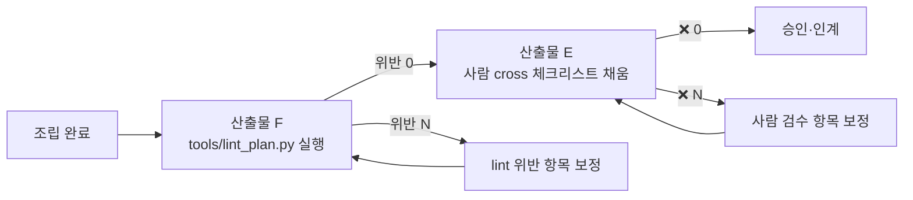

# 조립 가이드 — 공통 라이브러리 × 슬롯 사전 → 가상 사업계획서

> 본 가이드는 **공통/수시/조립/점검 4 분할 자산** 의 "조립" 축에 해당하며, 산출물 A (`라이브러리_공통문구_9섹션.md`) + 산출물 B (`사전_슬롯과_도메인_10종.md`) 를 입력으로 받아 산출물 C (`사업계획서_가상_10종/<도메인>_<규모>.md`) 를 만들어내는 **사람·자동 양 경로의 조립 절차** 를 표준화한다. 신규 고객사 적용 시에도 동일한 절차를 따른다.

---

## 1. 조립 흐름 한눈에 (Mermaid)

```mermaid
flowchart LR
  A[산출물 A<br/>라이브러리_공통문구_9섹션.md<br/>9 섹션 슬롯 텍스트] --> Z{조립}
  B[산출물 B<br/>사전_슬롯과_도메인_10종.md<br/>10 도메인·39 슬롯·신규 시나리오 ID]--> Z
  M{도메인 1·시나리오 N·슬롯 N<br/>'수시 결정' 셋} --> Z
  Z --> C[산출물 C<br/>사업계획서_가상_10종/*.md<br/>또는 신규 고객사 사업계획서]
  C --> E[산출물 E<br/>점검_체크리스트_가상10종.md<br/>사람 검증]
  C --> F[산출물 F<br/>tools/lint_plan.py<br/>자동 검증]
  E -.- 보정[위반 항목 보정]
  F -.- 보정
  보정 -.→ Z
```

**핵심 흐름 6 단계** — ① 도메인 1 종 픽업 → ② 시나리오 N 종 (3~5 개) 결정 → ③ 사업 규모·KPI 결정 → ④ 고객사·사업명 작성 → ⑤ 9 섹션 페이스트·슬롯 채움 → ⑥ E·F 점검 → 보정 루프.

---

## 2. 사람 5 단계 절차 (수동 조립)

### Step 1 — 도메인 1 종 픽업 (소요 1 분)

`사전_슬롯과_도메인_10종.md` §2 의 10 도메인 매트릭스에서 가장 가까운 1 행을 선정한다. **결합형 사업** (예: STL × HEA 통합) 은 1 차 도메인 1 개를 권위로 두고 부 도메인은 §5 시나리오로 표현 — process_default·sample_facility·model_examples 등 12 슬롯이 한 도메인 안에서 정합해야 본문 모순이 없다.

**대표 결정 단서 표**

| 결정 단서 | 선택 도메인 |
|---|---|
| 압연·소둔 중심 | STL |
| 가공·CNC·단조 중심 | MET |
| 고무·폴리머 중심 | RUB |
| 에너지·환경·다공정 통합 | UTL |
| 비정형 문서·LLM·RAG 중심 | LLM |
| 연주·전기로·주조 | CAS (신규) |
| 가열로·소둔·QT | HEA (신규) |
| 도금·도장·표면처리 | PLT (신규) |
| 선각·블록·해양 | SHP (신규) |
| 자동조립·체결·로봇 | ASM (신규) |

### Step 2 — 시나리오 N 종 (3~5 개) 선정 (소요 5 분)

`시나리오_카탈로그.md` 의 정식 ID + 본 사전 §3 의 신규 후보 ID 를 결합. 권장 패턴:

- **도메인 우세 시나리오** 2~3 개 (예: SCN-STL-04·SCN-STL-05·SCN-STL-09)
- **MLOps cross-cutting** 1 개 (SCN-MLO-NN)
- **LLM·RAG cross-cutting** 0~1 개 (SCN-LLM-NN — 비정형 지식 활용 필요 시)

> 5 개 초과 시 §5.1 본문이 산만해진다. 3~5 개가 정합 한도.

### Step 3 — 사업 규모·KPI 결정 (소요 5 분)

`사전_슬롯과_도메인_10종.md` §1.3 의 권장 범위 내에서 5 ~ 7 개 핵심 정량 슬롯을 결정한다.

| 규모 | total_budget_eok | govt_ratio_pct | duration_months | trl_start → trl_target | veteran_count |
|---|---|---|---|---|---|
| 대기업 | 18~30 | 30~40 | 24~36 | 5 → 7 | 10~15 |
| 중견 | 6~10 | 50 | 9~12 | 5 → 6 | 3~5 |
| 중소 | 2~3 | 70 | 6~9 | 4 → 5 | 2~3 |

KPI 4 축 (`kpi_quality_pct`·`kpi_productivity_pct`·`kpi_anomaly_accuracy_pct`·`kpi_fp_pct`/`kpi_fn_pct`) 은 도메인 특성·시나리오 난이도에 따라 ±5 % 조정.

### Step 4 — 고객사·사업명 작성 (소요 2 분)

- `company` 슬롯: "[고객사 — 부산·경남 (가상 / 실재) 규모 + 업종 표기 X사]" 형식
- 머리말 (1 줄): "[고객사] " + "[scenario_focus 의 핵심 동사]" + " AI 플랫폼"

### Step 5 — 9 섹션 페이스트·슬롯 채움 (소요 15 분)

`라이브러리_공통문구_9섹션.md` §1~§9 본문을 그대로 복사 → 슬롯 26 종 일괄 검색·바꾸기. 검색 정렬 패턴:

```
{{company}}              → [고객사 — ...]
{{industry}}             → STL (또는 MET·RUB·...)
{{process}}              → 도메인 process_default 또는 사용자 지정
{{domain_label}}         → 도메인 process_default
{{facility}}             → 도메인 sample_facility
{{product}}              → 도메인 sample_product
{{quality_target}}       → 도메인 sample_quality_target (수치 채움)
{{kpi_label}}            → 도메인 sample_kpi_label
{{sensor_examples}}      → 도메인 sensor_examples
{{image_examples}}       → 도메인 image_examples
{{cert_examples}}        → 도메인 cert_examples
{{risk_examples}}        → 도메인 risk_examples
{{model_examples}}       → 도메인 model_examples
{{scenario_focus}}       → 도메인 scenario_focus
{{veteran_areas}}        → 도메인 veteran_areas
{{scenarios_label}}      → SCN-XXX-01·SCN-XXX-02·... (콤마/중점 결합)
{{package_label}}        → pkg1 ~ pkg6 (사업 패턴 매칭)
{{veteran_count}} ~ {{service_sla_pct}} (정량 22 슬롯) → 사전 §1.3 권장 범위 내 결정값
```

> 정량 슬롯 22 종은 한 번에 검색·바꾸기 (예: VS Code Find & Replace `{{kpi_quality_pct}}` → `15~25`). 도메인 어휘 11 종은 표 한 행을 순서대로 복사.

---

## 3. 자동 조립 절차 (LAYER A composeFromLibrary)

### 3.1 입력 → 출력 흐름

```
┌─────────────────────────────────────────────────────────────────────┐
│  UI / Agent 입력 (도메인·시나리오·고객사·정량 옵션)                     │
└─────────────────────────────────────────────────────────────────────┘
        ↓
┌─────────────────────────────────────────────────────────────────────┐
│  worker/src/library.js  buildSlots(profile, plan)                   │
│  → DEFAULTS 24 + buildSlots 동적 13 = 37 슬롯 인스턴스               │
│  (사전 §1.3 권장 범위는 코드 레벨에서는 강제 안 됨 — 사람 검수 필요)    │
└─────────────────────────────────────────────────────────────────────┘
        ↓
┌─────────────────────────────────────────────────────────────────────┐
│  worker/src/library.js  composeFromLibrary('§N', slots)             │
│  → LIBRARY['§N'] 의 paragraphs / subsections 에 슬롯 채움            │
│  → '## §N 제목\n\n본문' 마크다운 반환                                │
└─────────────────────────────────────────────────────────────────────┘
        ↓
┌─────────────────────────────────────────────────────────────────────┐
│  worker/src/agent.js  9 섹션 (§1 ~ §9) 순차 호출 + 머리말·메타 결합   │
│  → final_md (붙여넣기용) + audit_md (검토용) 분리                    │
│  → AGENT_MAX_LLM_SECTIONS=5 cap 적용 시 fallback path 가 LAYER A     │
└─────────────────────────────────────────────────────────────────────┘
        ↓
┌─────────────────────────────────────────────────────────────────────┐
│  Cloudflare Pages 클라이언트 → 다운로드·복사 가능                     │
└─────────────────────────────────────────────────────────────────────┘
```

### 3.2 사람 절차 vs 자동 절차 대응

| 단계 | 사람 절차 (Step) | 자동 절차 (코드) |
|---|---|---|
| 1. 도메인 픽업 | 사전 §2 표 1 행 선택 | UI dropdown → `industry` 슬롯 |
| 2. 시나리오 결정 | 카탈로그·사전 §3 에서 ID 결합 | UI checkbox → `plan.scenarios` 배열 |
| 3. 규모·KPI | 사전 §1.3 권장 범위 표 참조 | DEFAULTS 24 키 + UI override |
| 4. 고객사·사업명 | "[고객사 — ...]" 형식 작성 | UI input → `profile.company` |
| 5. 9 섹션 조립 | 라이브러리 §1~§9 페이스트 + 검색·바꾸기 | composeFromLibrary 9 회 호출 |
| 6. 점검·보정 | 산출물 E 매트릭스 채움 | 산출물 F lint 자동 실행 |

### 3.3 자동 경로 활용 권고

- **신규 고객사 1 차 안 빠르게** — Cloudflare Worker (`/api/llm` 또는 `/api/agent`) 호출이 5~10 초 내에 9 섹션 출력. 1 차 안 검토 → 사람 손 가다듬기.
- **도메인 신규 (CAS·HEA·PLT·SHP·ASM)** — library.js 의 DOMAIN_PROFILE 에 신규 5 도메인이 아직 코드 반영 안 됨. 이 5 도메인은 사람 페이스트 경로만 가능 (별 단계에서 코드 갱신 필요).
- **AGENT_MAX_LLM_SECTIONS=5** — 5 섹션은 LLM 가다듬기, 4 섹션은 LAYER A 그대로. 어느 5 개를 LLM 으로 보낼지는 agent.js 의 우선순위 정책 참조.

---

## 4. 변형 우선순위 (신규 고객사 적용 시)

신규 고객사 사업계획서를 만들 때, 변경 비용 高 → 低 순으로 의사결정한다. 도메인이 정해지면 9 섹션의 절반이 결정되므로 가장 먼저 확정.

| 우선 | 변형 축 | 영향 섹션 | 변경 비용 | 결정 기준 |
|---|---|---|---|---|
| 1 | 도메인 (12 슬롯 일괄 교체) | §1·§2·§3·§4·§5·§6·§7·§8·§9 (전 섹션) | **高** | 고객사 주력 공정 |
| 2 | 시나리오 셋 (3~5 개) | §3·§5.1 | 中 | 사업 목적·심사 강조점 |
| 3 | KPI 수치 (4 축) | §3·§5.2 | 中 | 가이드_KPI_측정.md §3 권장 범위 |
| 4 | 사업 규모·기간 (5 슬롯) | §3·§4.1·§4.3·§5.2 | 低 | 지원사업 양식·총사업비 |
| 5 | 사업명·머리말 | 머리말·전 섹션 (company 인용) | 低 | 1 슬롯 |

### 4.1 의사결정 분기점 4 종 (운영 가이드 11 종 컨벤션 답습)

다음 4 분기에서 자주 막힌다. 각 분기의 1 차 답을 정해두면 조립 속도가 50 % 단축.

1. **도메인 결합 사업** (예: STL × HEA × LLM 통합) → 1 차 도메인 1 개를 권위로, 부 도메인은 §5 시나리오로만 표현. 본문 슬롯은 1 차 도메인 어휘 유지.
2. **신규 도메인 적용** (CAS·HEA·PLT·SHP·ASM) → 사전 §2.2 표 + §3 신규 시나리오 ID 사용. library.js 코드 반영 전까지는 사람 페이스트 only.
3. **시나리오 셋 5 개 초과** 필요 → §5.1 본문이 산만해짐. 5 개 이내로 압축, 나머지는 부록·연계 사업으로 분리.
4. **KPI 수치 권장 범위 초과** 요구 (예: kpi_anomaly_accuracy_pct=99) → 심사 신뢰도 저하. 권장 범위 (85~98 %) 내에서 도메인 평균값에 +1~2 σ 정도만.

### 4.2 강도 3 단계 — 적용 깊이 조절

| 강도 | 작업 | 소요 | 산출 깊이 |
|---|---|---|---|
| **light** | 도메인 1 + 시나리오 3 + 정량 5 슬롯 결정 → 9 섹션 페이스트 | 30 분 | 가상 견본 수준 (산출물 C 와 동일) |
| **standard** | light + 도메인 어휘 1~2 항목 고객사 특화 (sensor_examples 등) + KPI 수치 가이드 §3 정합 검증 | 1~2 시간 | 1 차 안 + 사업계획서 양식 정합 |
| **deep** | standard + 시나리오 본문 (§5.1) 의 "선정 시나리오" 단락에 고객사 운영 데이터 인용 추가 + §6 데이터 거버넌스 절을 고객사 인증 체계로 구체화 + §9 운영 리듬을 고객사 조직 구조로 정합 | 3~5 시간 | 심사·외부 검증 가능 수준 |

> 신규 고객사 1 차 미팅 후에는 **light** 로 시작 → 2 차 미팅에 **standard** → 사업 신청서 마감 전 **deep**.

---

## 5. 점검 연동 (산출물 E·F)

조립 직후 즉시 점검을 실행해야 보정 루프가 짧아진다.



**점검 순서**: F (자동) 먼저 → E (사람) 다음. 자동 lint 가 슬롯 잔존·placeholder 잔존·9 섹션 헤더 누락 등의 기계 검증을 처리하므로, 사람은 도메인 어휘 적합성·KPI 권장 범위·문체 등의 의미 검증에 집중.

---

## 6. 빠른 참조 — 어디 무엇이 있나

| 무엇 | 위치 | 역할 |
|---|---|---|
| 공통 라이브러리 (사람 view) | `라이브러리_공통문구_9섹션.md` | 9 섹션 슬롯 텍스트 (사람 페이스트용) |
| 공통 라이브러리 (코드 권위) | `worker/src/library.js` LIBRARY (line 161~277) | composeFromLibrary 의 권위 |
| 슬롯 사전 + 10 도메인 | `사전_슬롯과_도메인_10종.md` | 39 슬롯 + 10 도메인 매트릭스 + 신규 시나리오 ID |
| 가상 견본 10 종 | `사업계획서_가상_10종/*.md` | 조립 결과 견본 (lint 입력) |
| 검증 견본 3 종 | `사업계획서_샘플_<도메인>_완성형.md` | LAYER A 권위 검증 (수정 금지) |
| 사람 cross 체크리스트 | `점검_체크리스트_가상10종.md` | 도메인 10 × 항목 N 매트릭스 |
| 자동 lint | `tools/lint_plan.py` | placeholder·슬롯·도메인 cross 검사 |
| KPI 권장 범위 | `가이드_KPI_측정.md` §3 | KPI 4 축 표준 범위 |
| 사업 규모·예산 | `가이드_재무_예산.md` §2~§4 | total_budget_eok·govt_ratio_pct 등 권장 |
| 시나리오 정식 ID | `시나리오_카탈로그.md` | 40 정식 시나리오 |
| 신규 시나리오 ID 후보 | `사전_슬롯과_도메인_10종.md` §3 | CAS·HEA·PLT·SHP·ASM 25 종 후보 |
| LAYER A 코드 동기화 의무 | 본 가이드 §3.3 | 신규 5 도메인은 사람 경로만 — 코드 반영은 별 단계 |
| 작업 인수 인계 | `작업로그.md` 섹션 3 (진행 연대기) | 8 필드 엔트리 누적 |

---

> [출처 통합]
> - 공통 라이브러리 derive 원천: `worker/src/library.js` line 11~304
> - 슬롯·도메인 사전: `사전_슬롯과_도메인_10종.md` §1·§2·§3
> - 운영 가이드 11 종 컨벤션 (8 장 + 4 분기 + 강도 3 단계) 답습
> - LAYER A 자동 경로: 작업로그 #77 / Cloudflare Worker `/api/llm`·`/api/agent`
> - 신규 고객사 적용 패턴: `방법론_총론.md` §3.8 (시나리오 카드 조합)
