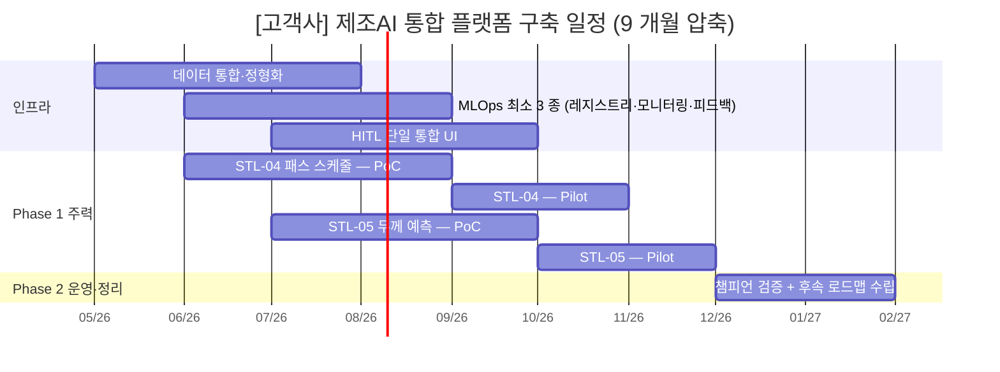

# 사업 기간 압축 가이드

> Phase E1 통합 파일럿(`사업계획서_패키지2_중견냉연_파일럿.md`) 자체평가 갭 7 (사업 기간 9 개월 가정 시 압축 가이드 부재) 해소를 위한 신규 자산. 사업 기간이 18 개월 표준에서 12 개월·9 개월로 압축될 때, 어느 시나리오를 후순위로 미루고 어느 인프라를 통합·축소할지의 표준 의사결정 프레임을 제공한다. `시나리오_카탈로그.md` 부록 B 의 6 패키지 모두에 적용 가능하며, `사업계획서_조립_가이드.md` §1 조립 절차의 1 단계(패키지 결정) 직후·2 단계(5.2 카드 매핑) 직전에 본 가이드를 1 회 통과시키는 것을 표준으로 한다.
>
> **플레이스홀더 범례** — `[고객사]` 고객사명, `[공정]` 대상 공정명, `[수치]` 수치, `[기간]` 기간, `[%]` 비율.
> 본 가이드의 [수치] 는 일반적 제조 AI 도입 사례 추정 범위로 채워졌으며, 구체 적용 시점에는 고객사·지원사업·시나리오별 검증을 요한다.

---

## 1. 압축의 4 분기 (어디를 줄이는가)

사업 기간이 18 개월에서 12 개월·9 개월로 압축될 때, 균등 축소(모든 시나리오·인프라를 같은 비율로 축소) 는 운영 성립성을 무너뜨린다. 본 가이드는 압축 시 줄일 수 있는 영역을 4 분기로 분류하고, 각 분기를 **선택적으로 축소** 하는 것을 표준으로 한다. 4 분기는 압축 의사결정의 발생 영역에 따라 상호 배타적(mutually exclusive) 으로 구분되며, 시나리오 범위·인프라 깊이·작업자 인터페이스·로드맵 분리의 4 축을 모두 포괄(collectively exhaustive) 한다.

### 1.1 시나리오 후순위 (Scenario Deferral)

본 사업의 시나리오 군 중 일부를 1 단계 (본 사업 기간 내) 가 아닌 후속 단계 (후속 사업·다음 회차 펀딩) 로 미루는 분기이다. 핵심 시나리오 (Quick Win 성격·정량 효과가 큰 것·데이터 기반이 이미 있는 것) 만 1 단계에 두고, 확장 시나리오 (난이도 높음·신규 IoT 증설 필요·인프라 의존도 높음) 는 후속으로 분리한다. 패키지 2 (중견 스테인리스 냉연) 의 예에서 18 개월 표준은 STL-04·05·06·09 + MLO-03 + LLM-02 의 6 시나리오를 모두 수행하나, 12 개월 압축 시에는 STL-04·05 + MLO-03 + LLM-02 의 4 시나리오로 축소하고, 9 개월 압축 시에는 STL-04·05 + MLO-03 의 3 시나리오로 추가 축소한다. STL-06 소둔 적재 최적화와 STL-09 예지보전 (IoT 증설 필요) 은 후속 사업으로 위임하는 구조이다.

본 분기의 선택 우선순위는 다음 4 기준의 가중 합산이다 — 데이터 기반의 성숙도 (이미 PLC·MES 데이터가 있는가, 신규 IoT 증설이 필요한가), 정량 KPI 의 가시화 속도 (PoC 단계에서 KPI 가 측정 가능한가), 인프라 의존도 (Track 2 풀 구성 필요 여부), 시나리오 간 인과 의존성 (다른 시나리오의 결과를 입력으로 요구하는가). 신규 IoT 증설이 필요한 시나리오 (예: STL-09 진동·전류 1 kHz 수집) 는 데이터 확보 자체에 [기간] 이 소요되므로 9 개월 사업에서는 일반적으로 후순위된다.

### 1.2 인프라 축소 (Infrastructure Reduction)

Track 2 MLOps 의 7 종 구성요소 (모델 레지스트리·피쳐 스토어·학습 파이프라인·서빙·모니터링·피드백·거버넌스 — `track2_공통본문_목차.md` §4.2) 중 1 단계 도입 범위를 축소하는 분기이다. 모델 레지스트리·모니터링·피드백 루프 3 종은 사업 운영 자체의 필수 구성요소이므로 어떤 압축에서도 유지되며, 피쳐 스토어·고급 거버넌스·고급 카나리 배포는 압축 시 후속 사업으로 위임한다. 본 분기의 결과로 시너지 ROI 모델 §2.2 의 인프라 시너지가 일부 손실됨에 유의한다 — Track 2 풀 도입 (β_track2 풀) 시 인프라 시너지 계수가 보수 1.30 / 낙관 1.45 인 반면, 부분 도입 (β_track2 부분) 시에는 보수 1.18 / 낙관 1.28 수준으로 축소된다 (시너지 ROI 모델 §3.2·§4 표).

본 분기의 선택 우선순위는 사업 운영 성립성을 기준으로 한다. 모델 레지스트리는 모델 버전 추적·롤백을 위해, 모니터링은 성능 저하 탐지를 위해, 피드백 루프는 작업자 라벨 환류를 위해 어떤 사업에서도 1 단계에 도입한다. 피쳐 스토어는 시나리오 간 피쳐 공유의 필요성이 명확할 때만 1 단계에 두며, 그 외에는 후속 사업으로 위임한다. 고급 거버넌스 (모델 카드·감사 로그·승인 워크플로우) 는 정부지원 평가에 직접 영향을 주지 않는 한 후속으로 위임 가능하다.

### 1.3 HITL UI 단일화 (HITL UI Unification)

시나리오별로 별도 작업자 인터페이스 (UI) 를 구축하는 대신, 단일 통합 UI 로 시작하는 분기이다. 18 개월 표준에서는 시나리오별 특화 UI (예: STL-04 패스 스케줄 추천 UI, STL-09 예지보전 알람 UI) 를 각각 구축하나, 12·9 개월 압축에서는 단일 통합 UI (SCN-MLO-03 피드백 루프 UI 를 확장) 위에 시나리오별 위젯·뷰만 분기시키는 구조로 축소한다. 본 분기는 시너지 ROI 모델 §2.3 의 HITL 시너지가 가장 빨리 발현되도록 작용하므로, 압축 시 시간 단축에 유리하게 작동한다 — 작업자 학습 곡선이 1 회로 통합되어 [기간] 단위의 학습 부담이 감소하고, 시나리오별 UI 통합 작업이 본 사업 기간에서 후속 사업으로 위임 가능해진다.

본 분기의 주의 사항은 단일 UI 의 정보 밀도 관리이다. 단일 UI 에 N 시나리오의 위젯이 동시 표시될 경우 작업자 인지 부담이 증가하여 알람 피로도·오인 가능성이 누적된다 (시너지 ROI 모델 §7.2 음 시너지 사례). 압축 사업에서도 시나리오별 우선순위·시간대별 표시 정책을 단일 UI 내부 거버넌스로 명문화한다.

### 1.4 로드맵 분리 (Roadmap Bifurcation)

본 사업의 추진 로드맵을 1·2 단계 (본 사업 기간 내 수행) 와 3 단계 (안정화·확산, 후속 사업으로 분리) 로 명시 분리하는 분기이다. 18 개월 표준에서는 Phase 1·2·3 (예: 1~6 / 7~12 / 13~18 개월) 을 본 사업에 모두 포함시키나, 12·9 개월 압축에서는 Phase 1·2 만 본 사업에 두고 Phase 3 은 사업계획서 §6.4 중장기 로드맵에 후속 사업으로 명시한다. 본 분기의 효과는 사업 가치 보존이다 — 압축으로 인해 본 사업에서 수행 불가능한 시나리오·인프라가 "후속 단계로 명시 분리됨" 으로써 사업의 전체 가치 사슬이 보존되며, 심사자에게 "본 사업의 한계와 후속 계획" 이 동시에 가시화된다.

본 분기는 §1.1 시나리오 후순위 분기와 짝을 이룬다 — §1.1 에서 후순위된 시나리오가 §1.4 의 후속 단계 로드맵에 명시되어야 본 사업 종료 시점에 ROI 단절이 발생하지 않는다. 후속 단계의 명시는 시나리오 ID·예상 기간·예상 사업비·예상 KPI 의 4 항목을 1 단락 분량으로 기술하며, 후속 사업의 펀딩 가능성 (예: 동일 지원사업의 다음 회차·별도 펀딩 트랙) 을 1 문장 이상 첨부한다.

### 1.5 4 분기의 MECE 자기평가

4 분기는 **압축 의사결정의 발생 영역** 차원에서 상호 배타적이다. 시나리오 후순위(시나리오 범위 차원)·인프라 축소(MLOps 구성요소 차원)·HITL UI 단일화(작업자 인터페이스 차원)·로드맵 분리(시간 축 차원) 의 네 축은 각각 사업 설계의 다른 레이어에 위치하며, 한 압축 의사결정이 두 분기에 동시 귀속되는 모호 영역은 발견되지 않는다. 또한 사업 설계의 4 차원 (범위·깊이·인터페이스·시간) 을 모두 포괄하므로 누락 없이 collectively exhaustive 하다. 단, 사업비 자체의 절감 (단가 협상·아웃소싱 비율 조정) 은 본 4 분기 외부 영역으로 본 가이드의 범위에 포함하지 않는다.

---

## 2. 9·12·18 개월 비교 표

본 표는 동일 패키지 (패키지 2 기준) 의 9·12·18 개월 사업 설계를 4 분기 차원에서 비교한 것이다. 다른 패키지의 경우 시나리오 수·인프라 깊이의 절대값은 달라지나 비교 구조는 동일하게 적용된다.

| 항목 | 9 개월 (압축) | 12 개월 (중간) | 18 개월 (표준) |
|---|---|---|---|
| 시나리오 수 (본 사업 범위) | 2~3 시나리오 | 3~4 시나리오 | 5~6 시나리오 |
| Track 2 MLOps 구성 깊이 | 최소 (3 종 — 레지스트리·모니터링·피드백) | 부분 (5 종 — 위 3 종 + 학습 파이프라인·서빙) | 풀 (7 종 — 위 5 종 + 피쳐 스토어·거버넌스) |
| Track 3 RAG 도입 | 후속 사업 위임 | 1 시나리오 (예: 장애 RAG·SOP RAG 중 택 1) | 2~3 시나리오 |
| HITL UI 구성 | 단일 통합 UI | 시나리오별 부분 분리 | 풀 시나리오별 분리 |
| 인프라 시너지 (보수 케이스 대비) | 보수 추정의 [%] | 보수 추정의 [%] | 보수 추정의 [%] (완전) |
| 사업비 비율 (18 개월 표준 대비) | [%] | [%] | 100 % |
| 후속 사업 의존도 | 高 | 中 | 低 |
| Phase 구성 | Phase 1 (1~6) + Phase 2 (7~9) | Phase 1 (1~6) + Phase 2 (7~12) | Phase 1 (1~6) + Phase 2 (7~12) + Phase 3 (13~18) |
| 정부지원 평가 적합도 | 단기 시연·SaaS 트랙에 적합 | 일반 스마트공장 트랙에 적합 | R&D·전사 DX 트랙에 적합 |

본 표에서 인프라 시너지 [%] 는 시너지 ROI 모델 §3.2 α_infra 산식에서 β_track2 도입 깊이에 따른 변동값이다. Track 2 풀 도입(18 개월) 을 100 % 기준으로 할 때, 부분 도입(12 개월) 은 [%], 최소 도입(9 개월) 은 [%] 수준이며, 이는 본 가이드의 (확인 필요) 항목이다 (§7).

---

## 3. 패키지 2 시뮬레이션 (시연)

본 절은 패키지 2 (중견 스테인리스 냉연) 를 대상으로 9·12·18 개월 3 시나리오를 시뮬레이션한 것이다. 패키지 2 는 Phase E1 통합 파일럿의 1 차 적용 대상이므로 본 가이드의 시연 패키지로 선정되었으며, 다른 5 패키지의 시뮬레이션은 §4 요약 표로 대체한다.

### 3.1 패키지 2 — 9 개월 압축

본 사업 시나리오 군은 STL-04 패스 스케줄 + STL-05 두께 예측 + MLO-03 피드백 루프(단일 통합 UI) 의 3 시나리오로 압축된다. Track 2 는 모델 레지스트리·모니터링·피드백의 최소 3 종만 1 단계에 도입하며, 피쳐 스토어·고급 거버넌스는 후속으로 위임한다. Track 3 RAG (LLM-02) 는 본 사업 범위 외로 분리되며, 후속 사업의 1 차 추가 시나리오로 명시된다.

일정 구성은 Phase 1 (1~6 개월) 데이터 통합·표준화 + STL-04·05 PoC, Phase 2 (7~9 개월) STL-04·05 Pilot 운영 + 결과 정리·후속 로드맵의 2 단계 구조이다. 본 압축 구조에서 미달성 가치는 STL-06 소둔 최적화 (정성·정량 KPI 모두) · STL-09 예지보전 (가동률 [수치] %p 향상) · LLM-02 장애 RAG (정비 응답 [기간] 단축) 의 3 종이며, 모두 사업계획서 §6.4 중장기 로드맵에 후속 단계로 명시 분리된다. 사업비는 18 개월 표준 대비 [%] 수준으로 추정된다.

### 3.2 패키지 2 — 12 개월 (권장)

본 사업 시나리오 군은 STL-04 + STL-05 + MLO-03 + LLM-02 의 4 시나리오로 구성된다. Track 2 는 부분 5 종 (레지스트리·모니터링·피드백·학습 파이프라인·서빙) 을 1 단계에 도입하며, 피쳐 스토어·고급 거버넌스는 후속으로 위임한다. Track 3 RAG 는 LLM-02 장애 RAG 1 시나리오만 본 사업에 포함시키고, 나머지 LLM 시나리오 (예: SOP RAG·도면 검색) 는 후속으로 분리한다.

일정 구성은 Phase 1 (1~6 개월) 데이터 통합 + STL-04·05 PoC + RAG 인프라 구축, Phase 2 (7~12 개월) STL-04·05 Pilot + LLM-02 PoC·Pilot + MLO-03 단일 UI 운영의 2 단계이다. 본 구조의 핵심은 LLM-02 가 압연 라인의 장애 대응 시간을 단축시키는 정량 KPI 가시화에 12 개월이 충분하다는 점이며, 이로써 12 개월 사업이 정부지원 평가에서 9 개월 대비 사업의 완결성을 효과적으로 보일 수 있다. 본 가이드는 패키지 2 의 압축 케이스로서 12 개월을 권장하며, 9 개월은 펀딩 한계 등 외부 제약 시의 차선으로 위치 짓는다. 미달성 가치는 STL-06·09 의 2 종이며, 사업비는 18 개월 표준 대비 [%] 수준이다.

### 3.3 패키지 2 — 18 개월 (표준)

`사업계획서_패키지2_중견냉연_파일럿.md` §5.5 에 본 사업의 표준 18 개월 간트차트가 작성되어 있으며, 본 가이드는 그 구조를 표준 참조로 인용한다. 시나리오 군은 STL-04·05·06·09 + MLO-03 + LLM-02 의 6 시나리오, Track 2 는 풀 7 종, Track 3 RAG 는 LLM-02 1 시나리오 (패키지 2 의 RAG 범위) 로 구성되며, Phase 1 (1~6) 데이터·주력 시나리오, Phase 2 (7~12) 확장 시나리오·RAG, Phase 3 (13~18) 안정화·확산의 3 단계 구조를 갖는다. 18 개월 표준은 본 가이드의 비교 기준점이며, 9·12 개월 압축의 사업비·시너지 폭의 분모로 작동한다.

---

## 4. 6 패키지 압축 적용 가이드 (요약 표)

`시나리오_카탈로그.md` 부록 B 의 6 패키지 각각에 대해 9 개월 압축 시 핵심 시나리오 군과 18 개월 표준 시 풀 시나리오 군을 매핑한 것이다. 본 표는 본 가이드의 1 차 통과 시 패키지별 즉시 의사결정을 가능하게 하는 의도로 작성되었다.

| 패키지 | 9 개월 압축 시 핵심 시나리오 | 18 개월 표준 시 풀 시나리오 | 압축 시 비고 |
|---|---|---|---|
| **1. 대기업 전사 AI 공장** | (압축 권장 안 함 — 다년 R&D 성격) | STL-01·03·09·10 + UTL-01 + MLO-01·02 + LLM-02 + SAF-02 (24~36 개월 권장) | 전사적 DX 촉진 R&D 트랙은 본질적으로 다년 사업이며, 9 개월 압축은 사업 성격에 부합하지 않음 |
| **2. 중견 스테인리스 냉연 ★** | STL-04 + STL-05 + MLO-03 | STL-04·05·06·09 + MLO-03 + LLM-02 | §3 시뮬레이션 참조. STL-09 IoT 증설 필요로 9 개월 후순위 |
| **3. 특수강관 중견 (암묵지)** | STL-07 + LLM-01 | STL-07·08·11 + LLM-01 | LLM-01 SOP RAG 가 핵심 — 비정형 데이터 정제로 PoC 가시화 빠름 |
| **4. 고무 양산 중견** | RUB-02 + LLM-03 | RUB-01·02·05 + LLM-03 + MLO-01 | RUB-02 압출 라인 데이터 기반이 가장 빠르게 가시화. RUB-01 배합·05 외관검사는 후속 |
| **5. 정밀가공 중소 SaaS** | MET-01 + LLM-04 | MET-01·03 + UTL-01 + LLM-01·04 + SAF-01 | 클라우드 SaaS 트랙은 9 개월에 자연스럽게 부합. LLM-04 도면 검색이 차별 KPI |
| **6. 유틸 ESG 특화** | UTL-01 + UTL-02 | UTL-01·02·03 + SAF-01·02 | 규제 대응 (CBAM·중대재해법) 시나리오는 사업 성격상 후속 회차 분리에 적합 |

본 표의 9 개월 압축 시 핵심 시나리오 선정 기준은 §1.1 의 4 기준 (데이터 기반 성숙도·KPI 가시화 속도·인프라 의존도·시나리오 간 인과 의존성) 의 가중 합산이며, 패키지별 시나리오 카드의 데이터 소스·기대효과·신규 IoT 필요 여부 3 필드를 직접 평가하여 도출하였다. 패키지 1 은 사업 성격상 9 개월 압축이 부적절하므로 제외 처리하고, 다년 R&D 트랙의 권장 기간을 별도 표기한다.

---

## 5. 압축 시 신규 작성 필요 섹션 양식

압축 사업의 사업계획서 작성 시점에 18 개월 표준의 §5.5 마일스톤·§6.4 중장기 로드맵·§0 과제 요약을 압축 사업에 맞게 재작성해야 한다. 본 절은 그 3 섹션의 표준 양식을 제공한다.

### 5.1 §5.5 마일스톤 — 9 개월 압축 양식

9 개월 사업의 §5.5 단계별 추진 일정은 Phase 1 (1~6) + Phase 2 (7~9) 의 2 단계 간트차트로 구성된다. 18 개월 표준의 Phase 3 (안정화·확산) 은 §6.4 후속 단계로 분리 명시되며, §5.5 자체에는 포함되지 않는다.



마일스톤 표는 다음과 같이 5 행으로 압축된다 — M3 데이터 통합 완료 / M5 STL-04·05 PoC / M7 STL-04·05 Pilot 진입 / M9 KPI 검증 + 후속 로드맵 수립. 9 개월 사업의 검수 게이트는 M5·M7·M9 의 3 회로 축소되며, Phase 종료 게이트의 회귀 절차는 18 개월 표준과 동일하게 운영위원회 검수로 작동한다.

12 개월 양식은 본 9 개월 양식에 STL-09 또는 LLM-02 의 1 시나리오를 추가하고 Phase 2 를 7~12 개월로 확장하는 구조이며, 별도 간트차트는 사업계획서 작성 시점에 본 양식을 기반으로 파생한다.

### 5.2 §6.4 중장기 로드맵 — 후속 단계 명시 양식

압축 사업의 사업계획서 §6.4 중장기 로드맵은 본 사업에서 후순위된 시나리오를 후속 단계로 명시 분리한다. 표준 양식은 다음과 같이 4 항목 1 단락 구조로 작성된다.

```
[후속 단계 — +12 개월, 후속 사업 펀딩 가정]
시나리오: SCN-STL-06 소둔 적재 최적화 + SCN-STL-09 예지보전 + SCN-LLM-02 장애 RAG
예상 기간: 12 개월 (본 사업 종료 직후 착수, Phase 1 6 개월 + Phase 2 6 개월)
예상 사업비: 본 사업 대비 [%]
예상 KPI: 가동률 +[수치] %p / 정비 응답 [%] 단축 / 에너지 원단위 [%] 감소
펀딩 가능성: 동일 지원사업 ([지원사업명]) 의 다음 회차 또는 별도 펀딩 트랙 ([트랙명])
```

본 양식은 Mermaid 로드맵 다이어그램과 병기 가능하며, `사업계획서_패키지2_중견냉연_파일럿.md` §6.4 의 후속 사업 다이어그램 구조를 참조 표준으로 인용한다. 후속 단계의 명시는 압축 사업의 ROI 단절을 방지하는 핵심 장치이다.

### 5.3 §0 과제 요약 — 사업비 압축 비율 표기 양식

압축 사업의 사업계획서 §0 과제 요약 표에는 18 개월 표준 대비 사업비 압축 비율을 1 행 추가하여 심사자에게 압축 사업의 위치를 명시한다. 표준 양식은 다음과 같다.

| 항목 | 본 사업 (압축) | 18 개월 표준 (참조) | 차이 |
|---|---|---|---|
| 사업 기간 | 9 개월 | 18 개월 | 50 % 단축 |
| 시나리오 수 | 3 시나리오 | 6 시나리오 | 50 % 축소 |
| 사업비 | [수치] 백만 원 | [수치] 백만 원 | 표준 대비 [%] |
| 후속 사업 의존도 | 高 (3 시나리오 + Track 2 풀 도입 후속 위임) | 低 | — |

본 표 하단에 1 문장 주석으로 "본 사업은 18 개월 표준 대비 압축 구조로, 후순위 시나리오·인프라는 §6.4 중장기 로드맵에 후속 단계로 명시 분리되어 ROI 가치 사슬이 보존된다." 의 표기를 권장한다.

---

## 6. 압축 시 주의 사항

압축 사업은 18 개월 표준 대비 단순 축소가 아닌 **트레이드오프** 구조이며, 본 절은 압축 의사결정에 따르는 주요 리스크 4 종을 명시한다.

첫째, **시너지 손실** 이다. 시너지 ROI 모델 §3.2 의 α_infra 가 Track 2 풀 도입 시 보수 1.30 / 낙관 1.45 인 반면, 부분 도입 시 보수 1.18 / 낙관 1.28 로 축소되며, α_data·α_kpi 도 시나리오 수 N 의 감소에 따라 함께 축소된다. 패키지 2 의 18 개월 표준 시너지 +69 %(보수) 가 9 개월 압축 시 +[%] 수준으로 축소되며, 이는 본 가이드의 (확인 필요) 항목이다. 압축 사업의 사업계획서 §6.1 결합 시너지 행 작성 시 본 축소를 정직하게 표기할 것을 권장한다.

둘째, **HITL 학습 곡선 부담** 이다. 단일 통합 UI 로 시작해도 작업자의 일상 검수·피드백 부담은 시나리오 수에 비례하지 않고 단일 UI 의 정보 밀도에 비례한다 (시너지 ROI 모델 §7.2). 9 개월 사업에서 작업자 학습 시간이 18 개월 사업의 [기간] 에서 [기간] 으로 단축되지 않을 수 있으며, 압축 사업의 HITL 운영 게이트는 학습 진도가 아닌 "단일 UI 정보 밀도의 운영 가능성" 으로 재정의된다.

셋째, **후속 사업 연계의 명시성** 이다. 본 사업 종료 시점에 후속 사업 (다음 회차 펀딩·별도 트랙·자비 투자) 의 계획이 §6.4 중장기 로드맵에 명시되지 않으면 본 사업의 1 단계 ROI 가 단절되며, 후순위된 시나리오의 가치 회수가 불가능해진다. 압축 사업은 사업 착수 시점부터 후속 사업의 펀딩 시나리오를 1 안 이상 확보한 상태에서 진입할 것을 권장한다.

넷째, **정부지원 평가 적합도** 이다. 압축 사업이 표준 사업 대비 정부지원 평가에서 불리할 수 있으며, 지원사업별 권장 기간 가이드라인 (본 가이드 §7 (확인 필요) 항목) 을 사업 착수 전에 확인해야 한다. 일반적으로 R&D 트랙·전사 DX 트랙은 18 개월 이상의 사업을 선호하며, 스마트공장 트랙·SaaS 트랙은 9~12 개월 사업도 평가 영향이 제한적이다. 압축 사업의 사업계획서 §0 과제 요약에 압축 비율 표기 (§5.3) 를 명시함으로써 심사자의 사전 인지를 확보한다.

---

## 7. (확인 필요) 항목

본 가이드 인용 시 다음 항목은 사업계획서 작성 시점에 별도 검증을 요한다. 본 문서의 [수치] 는 모두 추정 기본값이며, 아래 항목은 출처 검증 또는 고객사 자료 기반 재산정이 필수적이다.

- (확인 필요) §2 비교 표의 사업비 비율 [%] — 6 패키지 평균값으로 추정되었으며, 패키지별·고객사별 사업비 구성에 따른 재산정 대상.
- (확인 필요) §2 비교 표의 인프라 시너지 [%] — 시너지 ROI 모델 §3.2 α_infra 의 β_track2 도입 깊이별 변동값으로 산정되었으며, Track 2 부분 도입의 실측 데이터 검증 대상.
- (확인 필요) §3 패키지 2 시뮬레이션의 사업비 비율 [%] — 9·12 개월 압축 시의 절대값은 18 개월 표준 사업비의 실측 데이터 검증 대상.
- (확인 필요) §4 6 패키지 압축 표의 9 개월 핵심 시나리오 선정 — 6 패키지의 일반 산업 평균 기간과 권장 압축 형태의 외부 자료 (KOSME·중기부 가이드라인) 검증 대상.
- (확인 필요) 정부지원 사업별 권장 기간 가이드라인 — 제조AI특화 스마트공장·디지털 경남·대중소상생·전사 DX 촉진·클라우드 종합솔루션 5 개 트랙 각각의 권장 기간 공식 가이드라인 검증 대상 (`지원사업_공고_스냅샷_2026.md` 갱신 시 동기화).
- (확인 필요) 시나리오별 PoC → Pilot → Production 표준 [기간] — 본 가이드는 PoC 3 개월·Pilot 3 개월·Production 6 개월의 가정으로 9·12·18 개월을 분배하였으나, 시나리오별 표준 기간의 도메인 전문가 검증 대상.
- (확인 필요) §6 시너지 손실의 압축 사업 시너지 폭 [%] — 시너지 ROI 모델 §4 표의 보수·낙관 케이스를 압축 사업에 재적용한 결과의 산정 대상.

본 (확인 필요) 표기는 향후 본 가이드의 [수치] 를 갱신·검증하는 후속 작업의 우선순위 목록으로 작동하며, 검증 완료 시 해당 항목의 표기를 제거하고 출처를 인라인 주석으로 부기한다.

---

## 작성 메모

- 본 가이드는 Phase E1 통합 파일럿(`사업계획서_패키지2_중견냉연_파일럿.md`) 자체평가 갭 7 (사업 기간 9 개월 가정 시 압축 가이드 부재) 해소를 위한 신규 자산으로 작성되었다.
- 본 가이드의 4 분기 (시나리오 후순위·인프라 축소·HITL UI 단일화·로드맵 분리) 는 압축 의사결정의 발생 영역에 따라 MECE 로 구분되며, `사업계획서_조립_가이드.md` §1 조립 절차의 1 단계(패키지 결정) 직후·2 단계(5.2 카드 매핑) 직전에 본 가이드를 1 회 통과시키는 것을 표준으로 한다.
- 본 가이드의 §3 패키지 2 시뮬레이션은 18 개월 표준 (`사업계획서_패키지2_중견냉연_파일럿.md` §5.5) 의 1 차 압축 적용 사례이며, 다른 5 패키지의 시뮬레이션은 §4 요약 표로 대체한다. 향후 패키지 1·3·4·5·6 의 신규 사업계획서 작성 시 동일 구조로 시뮬레이션 절을 추가할 수 있다.
- 본 가이드는 시너지 ROI 모델과의 일관성을 유지한다 — §1.2 인프라 축소 시의 시너지 손실은 시너지 ROI 모델 §3.2 α_infra 산식의 β_track2 변동으로 직접 연결되며, §6 시너지 손실 항목은 시너지 ROI 모델 §4 표의 보수·낙관 케이스를 압축 사업에 재적용한 것이다.
- 본 가이드의 [수치] 갱신·검증은 별도 후속 작업으로 진행하며, 본 문서는 프레임 제공의 1 차 완성본에 해당한다.
