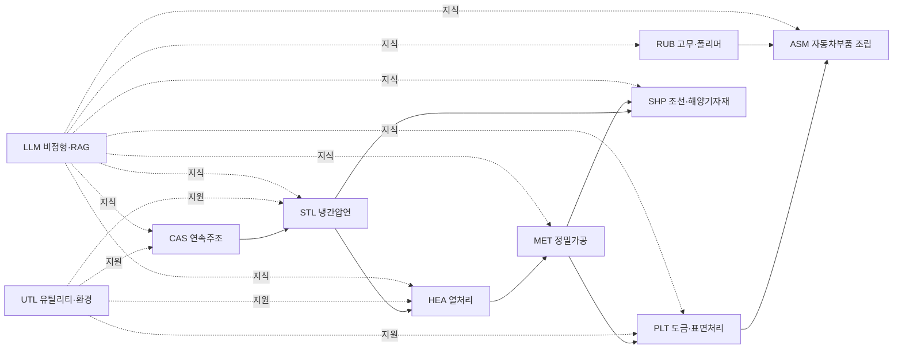

# 사전 — 슬롯 37 종 + 도메인 프로필 10 종 + 신규 시나리오 ID 후보

> 본 사전은 LAYER A (`worker/src/library.js`) 의 DEFAULTS·DOMAIN_PROFILE 를 사람 친화 마크다운으로 derive 한 운영 사전이다. **library.js 가 권위 (single source of truth)** 이며, 본 사전은 사람 손으로 가상 사업계획서를 조립할 때 참조한다. 수정 시 두 자료를 함께 갱신한다 (현재는 수동, 향후 동기화 스크립트 검토).
>
> **공통 / 수시 / 조립 / 점검 4 분할 자산 중 "수시 생성" 의 본질** = 본 사전에서 (a) **도메인 1 종**, (b) **시나리오 N 종**, (c) **슬롯 N 개 값** 을 골라 채우는 행위. 새 사업계획서마다 본 사전을 1 회 펼쳐 셋만 결정하면 나머지는 산출물 A (공통 라이브러리) 와 산출물 D (조립 가이드) 가 결정한다.

---

## 목차

1. 슬롯 37 종 정의표
2. 도메인 프로필 10 종 매트릭스 (기존 5 + 신규 5)
3. 신규 5 도메인 시나리오 ID 후보 (시나리오_카탈로그.md 통합 전 단계)
4. 사용 절차 — "도메인 1 + 시나리오 N + 슬롯 N" 셋 결정 방법
5. 점검 포인트 (산출물 E 체크리스트와의 연동)

---

## 1. 슬롯 37 종 정의표

> `library.js` DEFAULTS (line 11~39) + buildSlots 동적 슬롯 (line 123~148) 통합. 형태·기본값·예시값·산출 섹션을 함께 표기.

### 1.1 식별·도메인 슬롯 (5 종, buildSlots 동적)

| 슬롯 | 정의 | 기본값 | 예시값 | 산출 섹션 |
|---|---|---|---|---|
| `company` | 고객사 표기. "[고객사 — 부산·경남 중견 X사]" 형식 권장 | `[고객사]` | `[고객사 — 부산·경남 중견 스테인리스 냉연사]` | §1·§2.1·§3·§4.2·§9 |
| `industry` | 도메인 ID (10 종 중 1) | `STL` | `STL`·`MET`·`RUB`·`UTL`·`LLM`·`CAS`·`HEA`·`PLT`·`SHP`·`ASM` | (메타) |
| `process` | 대상 공정 (도메인 process_default 또는 사용자 지정) | `[공정]` | `냉간압연·연속소둔` | §2.1·§2.3·§2.4·§3·§4·§9 |
| `domain_label` | 도메인 한글 레이블 (process_default 동일) | (도메인) | `냉간압연·연속소둔` | §1 |
| `package_label` | 사업계획서 패키지 레이블 | `pkg2` | `pkg2`·`pkg3`·`pkg6` | §5.1 |

### 1.2 도메인 어휘 슬롯 (10 종, DOMAIN_PROFILE 에서 매핑)

| 슬롯 | 정의 | 산출 섹션 |
|---|---|---|
| `facility` | 도메인 대표 설비군 (sample_facility) | §1 |
| `product` | 도메인 대표 제품 (sample_product) | §1 |
| `quality_target` | 도메인 대표 품질 목표 (sample_quality_target) | §6 |
| `kpi_label` | 도메인 대표 KPI 레이블 (sample_kpi_label) | §2.4·§3·§5.2·§6·§9 |
| `sensor_examples` | 시계열 센서 예시 (콤마/중점 분리) | §1·§2.4·§4.1·§5.1·§6 |
| `image_examples` | 이미지 데이터 예시 | §1·§6 |
| `cert_examples` | 적용 인증·표준 (예: IATF 16949·ISO 9001) | §1·§4.2·§6·§8 |
| `risk_examples` | 외부 규제·리스크 (예: 중대재해처벌법·CBAM) | §1·§4.2·§4.4·§5.2 |
| `model_examples` | 후보 모델 풀 (예: XGBoost·LSTM·Transformer) | §4.1·§4.4·§5.1·§7 |
| `scenario_focus` | 시나리오 초점 한 줄 요약 | §4.1·§5.1·§8 |
| `veteran_areas` | 베테랑 의존 영역 3 개 | §2.1 |

### 1.3 정량 슬롯 (22 종, DEFAULTS — 사업 규모·KPI 수치)

> 도메인 비의존. 사업 규모·심사 기준·자체 산정에 따라 가변.

| 슬롯 | 정의 | 기본값 | 권장 범위 (가이드_KPI_측정.md §3 정합) | 산출 섹션 |
|---|---|---|---|---|
| `veteran_count` | 베테랑 숙련공 인원 범위 | `3~5` | 1~10 명 | §2.1 |
| `variable_count` | 의사결정 변수 종류 수 | `10~15` | 5~30 종 | §2.1 |
| `experience_years` | 베테랑 평균 경력 | `10 년` | 5~30 년 | §2.1 |
| `spec_variance_pct` | 작업자별 설계 편차 | `8~12` | 3~20 % | §2.1 |
| `pdf_form_count` | 비표준 양식 종류 수 | `10~20` | 5~50 종 | §2.2 |
| `human_entry_minutes` | 수기 입력 건당 시간 | `5~10` | 1~30 분 | §2.2 |
| `human_error_pct` | 휴먼 에러율 | `2~5` | 0.5~10 % | §2.2 |
| `retention_period` | 이력 회수 소요 기간 | `3 년` | 1~10 년 | §2.3 |
| `kpi_quality_pct` | 품질 KPI 개선 목표 | `15~25` | 10~40 % | §3·§5.2 |
| `kpi_productivity_pct` | 생산성 KPI 개선 목표 | `10~20` | 5~30 % | §3 |
| `kpi_anomaly_accuracy_pct` | 이상탐지 정확도 목표 | `90` | 85~98 % | §3 |
| `kpi_fp_pct` | 오탐율 상한 | `5` | 1~10 % | §3 |
| `kpi_fn_pct` | 미탐율 상한 | `3` | 1~10 % | §3 |
| `total_budget_eok` | 총 사업비 (억 원) | `6` | 2~50 억 | §4.3·§5.2 |
| `govt_ratio_pct` | 정부지원 비중 | `50` | 30~80 % | §4.3·§5.2 |
| `private_ratio_pct` | 민간부담 비중 | `50` | 20~70 % | §4.3 |
| `trl_start` | TRL 시작 단계 | `5` | 3~7 | §3·§4.1 |
| `trl_target` | TRL 목표 단계 | `6` | 4~8 | §3·§4.1 |
| `duration_months` | 사업 기간 (개월) | `9` | 6~36 | §3·§4.1 |
| `ml_drift_psi_warn` | PSI 주의 임계 | `0.10` | 0.05~0.20 | §5.3·§9 |
| `ml_drift_psi_retrain` | PSI 재학습 임계 | `0.25` | 0.15~0.40 | §5.3·§9 |
| `edge_latency_ms` | 엣지 추론 지연 SLA | `100` | 10~500 ms | §7·§8 |
| `hmi_latency_s` | HMI 경보 지연 SLA | `2` | 0.5~10 s | §8 |
| `rag_latency_s` | RAG 질의 응답 SLA | `5` | 1~30 s | §8 |
| `service_sla_pct` | 서비스 가용성 SLA | `99.5` | 95~99.99 % | §8 |

### 1.4 동적 시나리오 슬롯 (1 종, plan 입력)

| 슬롯 | 정의 | 기본값 | 예시값 | 산출 섹션 |
|---|---|---|---|---|
| `scenarios_label` | 선정 시나리오 ID 콤마 결합 | `시나리오 후보` | `SCN-STL-04·SCN-STL-05·SCN-STL-09·SCN-MLO-01` | §3·§5.1 |

> **합계 = 5 (식별) + 11 (도메인 어휘) + 22 (정량 DEFAULTS) + 1 (시나리오) = 39 슬롯**. library.js 코드상 DEFAULTS 24 키 + buildSlots 추가 13 = 37 슬롯과의 차이 (39 vs 37) 는 `domain_label`·`facility` 등 도메인 프로필에서 직접 매핑되는 슬롯을 별 카운트했는지 여부의 1 차 차이이다. 본 사전은 사람 친화 분류로 39 슬롯 형태 유지.

---

## 2. 도메인 프로필 10 종 매트릭스

### 2.1 기존 5 도메인 (library.js DOMAIN_PROFILE 권위 — 변경 없음)

> 본 절은 library.js line 41~112 의 DOMAIN_PROFILE 객체와 1:1 일치. 변경 시 코드 동기 갱신 필요.

| 슬롯 | **STL** 철강·냉연 | **MET** 정밀가공·금속 | **RUB** 고무·폴리머 | **UTL** 유틸리티·환경 | **LLM** 비정형·RAG |
|---|---|---|---|---|---|
| `process_default` | 냉간압연·연속소둔 | 정밀가공·단조·절단·절곡 | 고무 배합·압출·가황 | 유틸리티 관리·환경·에너지 | 비정형 지식 자산 RAG·LLM 적용 |
| `sample_facility` | 1ZHM·2ZHM·정밀압연·APL·BAF | CNC 머시닝센터·프레스·레이저 절단기 | 밴버리 믹서·압출기·가황 프레스 | 보일러·압축기·냉동기·폐수 처리·집진 | SOP·작업표준서·CMMS·도면·매뉴얼 저장소 |
| `sample_product` | 스테인리스 SUS304·SUS316L 0.1~2.0 mm 박판 | 자동차·전자 부품용 정밀 금속 가공품 | 자동차 OEM 1차 협력사 수준 고무 부품·가스켓·호스 | 공장 전체 유틸리티 안정 공급 + 환경 규제 준수 | 현장 작업자용 자연어 질의 응답·작업지시 자동 생성 |
| `sample_quality_target` | 출측 두께 ±0.05 mm·평탄도 I-unit < 8 | 치수 공차 ±10 μm·표면 거칠기 Ra < 1.6 | 경도 편차 ±3 HA·인장강도 12 MPa 이상 | 에너지 원단위 8 % 절감·환경 측정값 법규 한도 90 % 이내 | 응답 정확도 90 % 이상·환각률 5 % 이하·응답 시간 5 s 이내 |
| `sample_kpi_label` | 두께 편차·표면 결함 | 치수 편차·공구 마모·재가공률 | 배합 분산도·가황도·치수 불량률 | 에너지 효율·환경 측정·설비 가용도 | 응답 정확도·환각률·작업자 채택률 |
| `sensor_examples` | 롤 포스·텐션·속도·게이지·압연유 온도 | 주축 부하·진동·온도·절삭 토크 | 믹서 토크·전력·온도·압출 압력·가황 온도 프로파일 | 전력·가스·증기·폐수 pH·SOx·NOx·먼지 | 비정형 문서 메타데이터·검색 로그·작업자 정정 이력 |
| `image_examples` | 출측 표면 라인스캔 이미지·결함 패치 | 치수 측정 비전·표면 검사 이미지 | 제품 외관 검사·블리딩·기포 검출 이미지 | 굴뚝 영상·집진 필터 상태·누수 감시 | 도면 OCR·표 추출·다이어그램 이해 |
| `cert_examples` | IATF 16949·ISO 9001·ISO 14001 | IATF 16949·ISO 9001·KS·OHSAS 18001 | IATF 16949·ISO 9001·자동차 OEM 인증 | ISO 50001·ISO 14001·CBAM 보고 | ISO/IEC 42001·ISMS·개인정보 보호 |
| `risk_examples` | 중대재해처벌법·CBAM·자동차 SQA | 중대재해처벌법·자동차 SQA·납기 페널티 | 중대재해처벌법·자동차 SQA·환경규제(VOC) | CBAM·중대재해·환경 규제(대기·수질) | 데이터 유출·환각·저작권 |
| `model_examples` | XGBoost·LightGBM·LSTM·Transformer·Isolation Forest | XGBoost·CNN(비전)·LSTM·Random Forest | XGBoost·LSTM·AutoEncoder·CNN(외관 검사) | XGBoost·LSTM·Anomaly Detection·강화학습(에너지 최적화) | 한국 sLM(KoAlpaca·SOLAR)·Gemini·GPT·BGE 임베딩 |
| `scenario_focus` | 냉간압연 패스 스케줄 최적화·두께 조기경보·압연기 예지보전 | 가공 조건 추천·공구 마모 예지·치수 이상탐지 | 배합 분산도 예측·가황 조건 최적화·외관 결함 탐지 | 에너지 수요 예측·설비 이상탐지·환경 데이터 자동 보고 | SOP RAG·장애 대응 RAG·도면 검색·작업지시 자동 생성 |
| `veteran_areas` | 1ZHM 패스 스케줄·BAF 적재 결정·압연기 진동 진단 | 신소재 가공 조건 결정·공구 교체 시점 판단·정밀 보정 | 밴버리 토크·전력 곡선 판독·가황 종료 시점 결정 | 보일러 부하 분배·압축기 운전·폐수 처리 약품 투입 | 장애 대응 노하우·교대 인수인계·작업표준서 작성 |

### 2.2 신규 5 도메인 (본 사전 신설 — 부산·경남 클러스터 인접 공정)

> 신규 5 도메인 (CAS·HEA·PLT·SHP·ASM) 은 부산·경남 제조 클러스터 실수요와 LAYER A 기존 5 도메인의 인접·연계 공정을 우선 고려해 선정. **library.js 코드 반영은 본 plan 범위 밖** 이며, 산출물 C 가상 사업계획서 10 종 작성에 한해 본 사전을 권위로 사용한다.

| 슬롯 | **CAS** 연속주조·중력주조 | **HEA** 열처리·소둔·QT | **PLT** 도금·표면처리·도장 | **SHP** 조선·해양기자재 | **ASM** 자동차부품 조립 |
|---|---|---|---|---|---|
| `process_default` | 연속주조·중력주조·전기로 출강 | 가열로·연속소둔·진공 열처리·QT (퀜칭·템퍼링) | 전기도금·아연도금·인산염피막·분체도장 | 선각·블록·의장·도장·해양플랜트 모듈 | 자동차부품 자동 조립·체결·검사 라인 |
| `sample_facility` | 전기로·LF·VD·턴디시·몰드·연주기·주형 | 가스가열로·전기로·진공로·소둔로·QT 라인 | 전처리 라인·도금 셀·정류기·도장 부스·건조로 | 선각 블록 라인·서브 어셈블리·도장 도크·해양 모듈 야드 | 컨베이어 라인·산업로봇·체결 토크 건·비전 검사 부스 |
| `sample_product` | 자동차·조선용 슬라브·블룸·빌렛·중력주조 부품 | 자동차 강판·기어·베어링·공구강용 열처리품 | 자동차 차체·전자부품용 도금·도장 처리품 | 컨테이너선·LNG선 블록·해양플랜트 토프사이드 모듈 | 자동차 ECU·도어 모듈·서스펜션·시트 어셈블리 |
| `sample_quality_target` | 슬라브 표면 결함 0.3 개/m 이하·내부 크랙 0·중심 편석 ≤ 1.2 | 경도 편차 ±2 HRC·결정립도 ASTM 8 이상·잔류응력 80 MPa 이내 | 도금 두께 편차 ±2 μm·도장 외관 결함 1 % 이하·부착력 4B 이상 | 블록 정도 ±3 mm·용접 결함율 1 % 이하·도장 두께 250 μm 균일 | 토크 정밀도 ±3 %·조립 오결합 0.5 % 이하·검사 통과율 98 % 이상 |
| `sample_kpi_label` | 표면 결함·내부 크랙·중심 편석 | 경도 편차·결정립도·잔류응력 | 도금 두께 편차·외관 결함·부착력 | 블록 정도·용접 결함·도장 균일도 | 토크 정밀도·오결합·검사 통과율 |
| `sensor_examples` | 턴디시 온도·몰드 진동·주조 속도·2 차 냉각수 유량·용강 성분 | 노 내 온도·분위기 가스·냉각 속도·열전대 응답·진공도 | 도금조 온도·전류 밀도·pH·전도도·도금 시간 | 용접 전류·전압·아크 시간·구조해석 응답·환경 온습도 | 토크·체결력·로봇 관절 위치·비전 검사 좌표·라인 속도 |
| `image_examples` | 슬라브 표면 라인스캔·UT 검사 이미지·연주 단면 매크로 | 결정립 광학 현미경 이미지·표면 산화·뒤틀림 측정 | 도금 두께 SEM·외관 결함 비전·부착력 테이프 자국 이미지 | 용접 비드 외관·UT/RT 결함 이미지·도장 외관 검사 | 조립 외관 비전·체결 자국·LDS 위치 측정 이미지 |
| `cert_examples` | IATF 16949·ISO 9001·KS D·ASTM A | IATF 16949·ISO 9001·SAE AMS·KS D | IATF 16949·ISO 9001·QUALICOAT·자동차 OEM 도장 인증 | KR·ABS·DNV·LR 선급·ISO 9001 | IATF 16949·ISO 9001·자동차 OEM SQA·VDA 6.3 |
| `risk_examples` | 중대재해처벌법·CBAM·환경규제(분진·소음) | 중대재해처벌법·CBAM·에너지 다소비 규제·자동차 SQA | 중대재해처벌법·환경규제(중금속 폐수·VOC)·자동차 SQA | 중대재해처벌법·해양 환경 규제·선급 검사·납기 페널티 | 중대재해처벌법·자동차 SQA·리콜 책임·라인 정지 손실 |
| `model_examples` | XGBoost·LSTM·Transformer·CNN(표면 검사)·Isolation Forest | XGBoost·LSTM·물리 기반 시뮬레이션 결합 (PINN)·CNN | XGBoost·CNN(외관)·AutoEncoder(이상)·강화학습(전류 제어) | XGBoost·LSTM·CNN(용접 비드)·구조해석 surrogate | XGBoost·CNN(체결 자국)·LSTM(라인 추세)·Isolation Forest |
| `scenario_focus` | 슬라브 결함 예측·연주 속도 최적화·턴디시 온도 안정화 | 경도 균일화 예측·결정립도 추정·열처리 조건 추천 | 도금 두께 균일도 예측·전류 밀도 최적화·외관 결함 탐지 | 용접 결함 예측·블록 정도 추정·도장 외관 검사 | 토크 이상 탐지·조립 오결합 예방·검사 통과율 예측 |
| `veteran_areas` | 턴디시 온도 판단·몰드 오실 조정·주조 속도 결정 | 가열로 분위기 결정·QT 인출 시점 결정·결정립 판단 | 도금조 보충 시점·정류기 전류 조정·외관 검사 판정 | 용접 작업 자세·블록 매칭·도장 표면 판정 | 토크 이상 감지·라인 속도 조정·비전 검사 임계 결정 |

### 2.3 도메인 인접·결합 관계도 (Mermaid)

> 화살표 = 공정 흐름. UTL·LLM 은 모든 도메인의 cross-cutting 지원층. **본 결합 관계는 패키지 파일럿 6 종이 다공정 통합 시나리오로 설계된 이유와 정합** (사업계획서_패키지6_유틸ESG_파일럿.md 가 UTL × 다도메인 결합 사례).

---

## 3. 신규 5 도메인 시나리오 ID 후보

> `시나리오_카탈로그.md` 의 ID 체계 (`SCN-STL-NN`·`SCN-MET-NN`·…) 답습. 본 후보는 산출물 C 가상 사업계획서 10 종 의 §5.1 선정 시나리오 본문에 사용되며, **시나리오_카탈로그.md 의 정식 등록은 사용자 승인 후 별 단계** (본 plan scope 외).

### 3.1 SCN-CAS — 연속주조·중력주조 (5 종)

| ID | 시나리오 | 트랙 | 적합 규모 |
|---|---|---|---|
| `SCN-CAS-01` | 슬라브 표면 결함 실시간 예측 (몰드 진동·주조 속도·턴디시 온도 입력) | T1 + T2 | 대기업 |
| `SCN-CAS-02` | 턴디시 온도 안정화 추천 (강화학습 기반 가스·전력 제어) | T1 | 대기업 |
| `SCN-CAS-03` | 연주 속도 최적화 (성분·온도·몰드 상태 결합 LSTM) | T1 + T2 | 대기업·중견 |
| `SCN-CAS-04` | 중심 편석 예측 + 2 차 냉각수 추천 | T1 | 대기업 |
| `SCN-CAS-05` | 중력주조 공정 인자 추천 RAG (작업표준 조회·이상 대응) | T3 | 중견·중소 |

### 3.2 SCN-HEA — 열처리·소둔·QT (5 종)

| ID | 시나리오 | 트랙 | 적합 규모 |
|---|---|---|---|
| `SCN-HEA-01` | 가열로 분위기·온도 프로파일 최적화 (LSTM + 물리 시뮬레이션 결합) | T1 + T2 | 중견 |
| `SCN-HEA-02` | QT 처리 후 경도 분포 예측 (XGBoost) | T1 | 중견·중소 |
| `SCN-HEA-03` | 결정립도 광학 이미지 자동 등급 판정 (CNN) | T1 | 중견·중소 |
| `SCN-HEA-04` | 잔류응력 예측 + 후처리 추천 | T1 + T3 | 중견 |
| `SCN-HEA-05` | 열처리 작업표준 RAG·이상 대응 | T3 | 중견·중소 |

### 3.3 SCN-PLT — 도금·표면처리·도장 (5 종)

| ID | 시나리오 | 트랙 | 적합 규모 |
|---|---|---|---|
| `SCN-PLT-01` | 도금 두께 균일도 실시간 예측 (전류 밀도·온도·시간 입력) | T1 + T2 | 중견·중소 |
| `SCN-PLT-02` | 외관 결함 자동 탐지 (CNN 비전) | T1 | 중견·중소 |
| `SCN-PLT-03` | 도금조 보충·정류기 전류 추천 (강화학습) | T1 + T2 | 중견 |
| `SCN-PLT-04` | 도장 부착력·외관 결함 결합 예측 | T1 | 중견·중소 |
| `SCN-PLT-05` | 폐수·VOC 환경 데이터 자동 보고 (UTL 시너지) | T1 + T2 | 중견·중소 |

### 3.4 SCN-SHP — 조선·해양기자재 (5 종)

| ID | 시나리오 | 트랙 | 적합 규모 |
|---|---|---|---|
| `SCN-SHP-01` | 용접 비드 결함 자동 탐지 (CNN + UT 결합) | T1 | 대기업·중견 |
| `SCN-SHP-02` | 블록 정도 측정·매칭 추천 (LDS·구조해석 결합) | T1 + T2 | 대기업·중견 |
| `SCN-SHP-03` | 도장 두께·외관 검사 자동화 (비전 + 두께 게이지) | T1 | 중견 |
| `SCN-SHP-04` | 선급 검사 대응 문서 자동 생성·근거 RAG | T3 | 대기업·중견 |
| `SCN-SHP-05` | 해양플랜트 모듈 진동·온도 이상탐지 (UTL 시너지) | T1 + T2 | 대기업 |

### 3.5 SCN-ASM — 자동차부품 조립 (5 종)

| ID | 시나리오 | 트랙 | 적합 규모 |
|---|---|---|---|
| `SCN-ASM-01` | 토크 체결 이상 실시간 탐지 (Isolation Forest + 라인 추세) | T1 | 중견·중소 |
| `SCN-ASM-02` | 조립 오결합 예방 비전 검사 (CNN) | T1 | 중견·중소 |
| `SCN-ASM-03` | 검사 통과율 예측 + 라인 속도 추천 | T1 + T2 | 중견 |
| `SCN-ASM-04` | 라인 정지 원인 RAG (CMMS·작업일지 통합) | T3 | 중견·중소 |
| `SCN-ASM-05` | 자동차 OEM SQA 대응 문서 자동 생성 | T3 | 중견 |

### 3.6 ID 충돌 회피 규칙

- 본 사전의 신규 25 시나리오 ID 는 모두 **시나리오_카탈로그.md 의 기존 40 종과 prefix 비충돌** (CAS·HEA·PLT·SHP·ASM 신규 prefix).
- 정식 등록 시 시나리오_카탈로그.md §1 목차 + 각 도메인 절 + 부록 D (지원사업 유형별 매칭) 동시 갱신.
- 등록 전까지는 본 사전이 권위.

---

## 4. 사용 절차 — "도메인 1 + 시나리오 N + 슬롯 N" 셋 결정 방법

### 4.1 5 단계 결정 흐름

1. **도메인 1 종 픽업** — 표 2.1 / 2.2 의 12 컬럼 (process_default·sample_facility·sample_product·...) 을 1 분 훑어 가장 가까운 도메인 1 개 선정. **도메인 결합이 필요한 사업** (예: STL × HEA × LLM) 은 1 차 도메인 1 개를 권위로 두고 부 도메인은 §5 시나리오 결합으로 표현.
2. **시나리오 N 종 (3~5 개) 선정** — `시나리오_카탈로그.md` 또는 본 사전 §3 에서 도메인 우세 시나리오 2~3 + cross-cutting (`SCN-MLO-NN`·`SCN-LLM-NN`·`SCN-SAF-NN`) 1~2 결합. 너무 많이 선정하면 §5 본문이 산만해짐.
3. **사업 규모 픽업 (대기업/중견/중소)** — 정량 슬롯 22 종 중 `total_budget_eok`·`govt_ratio_pct`·`duration_months`·`trl_*`·`veteran_count` 5 개를 사업 규모에 맞춰 조정. 권장 범위 (1.3 표) 를 벗어나면 심사 신뢰도 저하.
4. **고객사 슬롯 채움** — `company` 1 개. "[고객사 — 부산·경남 중견 X사]" 형식 (가상안에서는 허구 회사명 또는 클러스터 + 업종 표기).
5. **조립** — 산출물 D (조립 가이드) 의 5 단계 페이스트 또는 LAYER A composeFromLibrary() 자동 조립.

### 4.2 신규 사업계획서 작성 시 변형 우선순위

| 우선 | 변형 축 | 영향 섹션 | 변경 비용 |
|---|---|---|---|
| 1 | 도메인 (12 슬롯 일괄 교체) | §1·§2·§3·§4·§5·§6·§7·§8·§9 (전 섹션) | 高 — 도메인 표 1 행 통째 |
| 2 | 시나리오 셋 (`scenarios_label`·`scenario_focus`) | §3·§5.1 | 中 — 시나리오 ID 3~5 개 결정 |
| 3 | KPI 수치 (`kpi_*_pct`·`kpi_anomaly_accuracy_pct`) | §3·§5.2 | 中 — 권장 범위 내 조정 |
| 4 | 사업 규모·기간 (`total_budget_eok`·`duration_months`·`trl_*`) | §3·§4.1·§4.3·§5.2 | 低 — 5 슬롯만 |
| 5 | 사업명·머리말 (`company` + 한 줄 사업명) | 머리말·§1·§2.1·§3·§4.2·§9 | 低 — 1 슬롯 |

> **변경 비용 高 → 低 순으로 의사결정** — 도메인을 먼저 확정하고 시나리오·KPI·규모·사업명 순으로 좁혀 들어가는 것이 작업로그 흐름·재작업 최소화에 유리.

---

## 5. 점검 포인트 (산출물 E 체크리스트와의 연동)

본 사전을 사용해 가상 사업계획서를 조립한 뒤, 산출물 E 점검 체크리스트는 다음 5 축으로 본 사전의 일관성을 가로 검증한다.

| 점검 축 | 본 사전의 점검 단위 | E 체크리스트 항목 (예) |
|---|---|---|
| 도메인 어휘 일관성 | 표 2.1 / 2.2 의 12 컬럼이 본문 §1·§6·§7 에 누락 없이 등장 | "STL 가상안의 §6 sensor_examples 가 표 2.1 의 STL 행과 일치" |
| 시나리오 ID 정합 | 본 사전 §3 의 ID 가 본문 §5.1 와 일치 | "CAS 가상안 §5.1 의 SCN-CAS-NN 가 §3.1 표에 존재" |
| KPI 수치 권장 범위 | 표 1.3 의 권장 범위 내 | "kpi_quality_pct 가 10~40 % 내인지" |
| 슬롯 잔존 0 | 표 1.1·1.2·1.3·1.4 의 모든 슬롯 채움 | "{{slot_*}}·[수치]·[고객사] 잔존 0" |
| 도메인 cross 충돌 | 다른 도메인 행 어휘가 누출 0 | "RUB 가상안에 STL 의 '롤 포스' 등장 0" |

> **자동 검증** — 산출물 F (`tools/lint_plan.py`) 가 슬롯 잔존·도메인 cross 충돌·시나리오 ID 매칭을 기계 검증.
> **사람 검증** — 산출물 E (`점검_체크리스트_가상10종.md`) 가 도메인 어휘 의미 적합성·KPI 수치 권장 범위 내 적정성·문체·논리 연결을 사람 검증.

---

> [출처]
> - LAYER A 코드 권위: `worker/src/library.js` line 11~112 (DEFAULTS + DOMAIN_PROFILE)
> - 시나리오 ID 패턴: `시나리오_카탈로그.md` §1.1~§1.7
> - KPI 권장 범위: `가이드_KPI_측정.md` §3
> - 사업 규모 범위: `가이드_재무_예산.md` §2~§4
> - 신규 5 도메인 분류 근거: 본 plan `/Users/lanco/.claude/plans/ai-curious-quasar.md` §"신규 5 도메인 제안"
