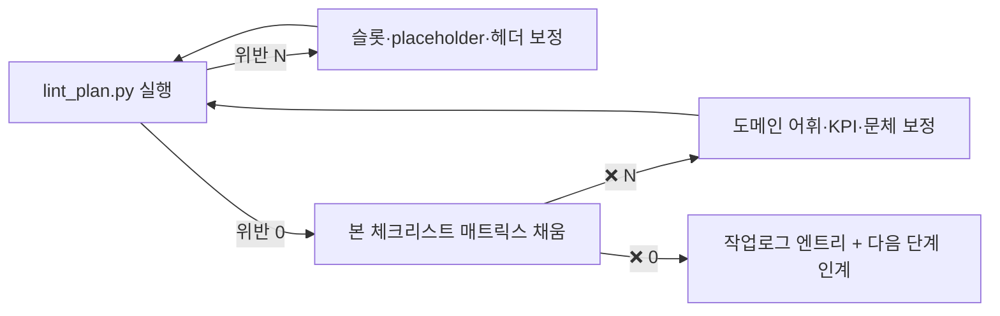

# 점검 체크리스트 — 가상 사업계획서 10 종 cross-자기검토

> 본 체크리스트는 **공통/수시/조립/점검 4 분할 자산** 의 "점검·사람 검수" 축이다. `사업계획서_가상_10종/*.md` 10 파일을 가로 비교하여 도메인 어휘 의미 적합성·KPI 권장 범위·문체·논리 연결을 사람이 한 번 가로 훑으면서 검증한다. 자동 검증은 `tools/lint_plan.py` (산출물 F) 가 처리하므로, 본 체크리스트는 **사람만이 판단할 수 있는 의미·맥락·정합성** 에 집중한다.
>
> **사용 절차**: 각 셀에 ✅ (통과) / ⚠ (경미한 보정 필요) / ❌ (보정 필수) 중 하나를 채운다. ❌ 0 까지 보정 → 산출물 F lint 재실행 → 둘 다 통과 시 승인.

---

## 0. 자동 lint 결과 (참고)

> `python3 tools/lint_plan.py 사업계획서_가상_10종/` 2026-05-13 1 차 실행 결과 — 10 / 10 PASS.

| 검사 축 | 결과 |
|---|---|
| 1. {{slot_*}} 잔존 0 | ✅ 10 / 10 |
| 2. placeholder ([수치]·[고객사] 비-화이트리스트) 잔존 0 | ✅ 10 / 10 |
| 3. 9 섹션 헤더 (§1~§9) 누락 0 | ✅ 10 / 10 |
| 4. 섹션 길이 균형도 ≥ 0.10 | ✅ 10 / 10 (0.33) |
| 5. 도메인 cross 누출 < 4 단어 | ✅ 10 / 10 (≤1 단어, cross-cutting 허용 범위) |
| 6. 메타 흔적 (TODO·sample_·DEFAULTS) 누설 0 | ✅ 10 / 10 |

> 자동 lint 통과 = 기계 검증 가능 부분의 1 차 정합 확보. 본 체크리스트는 자동 lint 가 **할 수 없는** 의미 검증을 담당.

---

## 1. 도메인 × 항목 매트릭스 (사람 검수)

> 10 도메인 (STL·MET·RUB·UTL·LLM + CAS·HEA·PLT·SHP·ASM) × 30 항목 = 300 셀. 각 셀에 ✅/⚠/❌ 채움.

### 1.1 §1 현황 (4 항목)

| # | 항목 | STL | MET | RUB | UTL | LLM | CAS | HEA | PLT | SHP | ASM |
|---|---|---|---|---|---|---|---|---|---|---|---|
| 1.1.1 | 머리말 (사업명) 이 도메인 scenario_focus 와 정합 | | | | | | | | | | |
| 1.1.2 | §1 1 단락의 facility·product 가 도메인 표 (사전 §2) 와 일치 | | | | | | | | | | |
| 1.1.3 | §1 2 단락의 sensor·image 어휘가 도메인 특성에 자연 | | | | | | | | | | |
| 1.1.4 | §1 3 단락의 cert·risk 가 도메인 인증·규제와 부합 | | | | | | | | | | |

### 1.2 §2 문제인식 (4 항목)

| # | 항목 | STL | MET | RUB | UTL | LLM | CAS | HEA | PLT | SHP | ASM |
|---|---|---|---|---|---|---|---|---|---|---|---|
| 1.2.1 | §2.1 veteran_areas 3 영역이 도메인 현장 실제와 부합 | | | | | | | | | | |
| 1.2.2 | §2.2 pdf_form_count·human_entry_minutes 가 사업 규모와 정합 (대기업 → 25~40, 중소 → 8~15) | | | | | | | | | | |
| 1.2.3 | §2.3 retention_period 가 사업 규모와 정합 (대기업 → 5~6 년, 중소 → 2 년) | | | | | | | | | | |
| 1.2.4 | §2.4 sensor·kpi_label 어휘가 도메인 표와 1:1 매칭 | | | | | | | | | | |

### 1.3 §3 개선방향 — KPI 4 축 (5 항목)

| # | 항목 | STL | MET | RUB | UTL | LLM | CAS | HEA | PLT | SHP | ASM |
|---|---|---|---|---|---|---|---|---|---|---|---|
| 1.3.1 | scenarios_label 의 SCN-XXX-NN 이 시나리오_카탈로그·사전 §3 에 존재 | | | | | | | | | | |
| 1.3.2 | kpi_quality_pct 가 가이드_KPI_측정.md §3 권장 범위 (10~40 %) 내 | | | | | | | | | | |
| 1.3.3 | kpi_anomaly_accuracy_pct 가 권장 범위 (85~98 %) 내 | | | | | | | | | | |
| 1.3.4 | kpi_fp_pct·kpi_fn_pct 가 권장 범위 (1~10 %) 내 | | | | | | | | | | |
| 1.3.5 | total duration·TRL 단계가 사업 규모와 정합 (대기업 24 개월·TRL 5→7, 중견 9~12 개월·TRL 5→6, 중소 6~9 개월·TRL 4→5) | | | | | | | | | | |

### 1.4 §4 수행방향 (4 항목)

| # | 항목 | STL | MET | RUB | UTL | LLM | CAS | HEA | PLT | SHP | ASM |
|---|---|---|---|---|---|---|---|---|---|---|---|
| 1.4.1 | §4.1 1·2·3 단계 기간 분할이 duration_months 와 정합 (대기업 1·2·3 단계 = 8·8·8 개월 등) | | | | | | | | | | |
| 1.4.2 | §4.2 외부 자문 항목에 risk_examples 가 명시 | | | | | | | | | | |
| 1.4.3 | §4.3 total_budget_eok·govt_ratio_pct 가 사업 규모 컨벤션 (대기업 18~30 억·30~40 %, 중견 6~10 억·50 %, 중소 2~3 억·70 %) 과 정합 | | | | | | | | | | |
| 1.4.4 | §4.4 위험 1·2·3 의 model_examples 가 도메인 모델 풀과 일치 | | | | | | | | | | |

### 1.5 §5 AI 적용 포인트 (4 항목)

| # | 항목 | STL | MET | RUB | UTL | LLM | CAS | HEA | PLT | SHP | ASM |
|---|---|---|---|---|---|---|---|---|---|---|---|
| 1.5.1 | §5.1 패키지 (pkg1~pkg6) 매핑이 사업 패턴·규모와 정합 | | | | | | | | | | |
| 1.5.2 | §5.1 sensor·model·scenario_focus 가 한 도메인 안에서 어휘 일관 | | | | | | | | | | |
| 1.5.3 | §5.2 ROI 4 축의 cert_examples 인용이 §1·§6·§8 과 동일 표기 | | | | | | | | | | |
| 1.5.4 | §5.3 ml_drift_psi_warn·ml_drift_psi_retrain 임계가 §9 과 동일값 | | | | | | | | | | |

### 1.6 §6 데이터·변수 (3 항목)

| # | 항목 | STL | MET | RUB | UTL | LLM | CAS | HEA | PLT | SHP | ASM |
|---|---|---|---|---|---|---|---|---|---|---|---|
| 1.6.1 | §6 1 단락의 sensor·image 어휘가 §1 2 단락과 일치 | | | | | | | | | | |
| 1.6.2 | §6 2 단락의 quality_target 수치가 도메인 표 (사전 §2) 와 정합 | | | | | | | | | | |
| 1.6.3 | §6 3 단락의 cert_examples 인용이 §1·§5.2·§8 과 동일 | | | | | | | | | | |

### 1.7 §7 모델·학습 (2 항목)

| # | 항목 | STL | MET | RUB | UTL | LLM | CAS | HEA | PLT | SHP | ASM |
|---|---|---|---|---|---|---|---|---|---|---|---|
| 1.7.1 | §7 1 단락의 model_examples 가 §4.1·§4.4·§5.1 과 동일 | | | | | | | | | | |
| 1.7.2 | §7 2 단락의 edge_latency_ms SLA 가 §8 과 동일값 | | | | | | | | | | |

### 1.8 §8 적용·배포 (3 항목)

| # | 항목 | STL | MET | RUB | UTL | LLM | CAS | HEA | PLT | SHP | ASM |
|---|---|---|---|---|---|---|---|---|---|---|---|
| 1.8.1 | §8 1 단락의 cert_examples + ISO/IEC 42001 결합이 자연 (중복·누락 없음) | | | | | | | | | | |
| 1.8.2 | §8 2 단락의 service_sla_pct·edge·hmi·rag latency 가 §7 과 정합 | | | | | | | | | | |
| 1.8.3 | §8 3 단락의 scenario_focus 가 §4.1·§5.1 과 동일 | | | | | | | | | | |

### 1.9 §9 MLOps loop (3 항목)

| # | 항목 | STL | MET | RUB | UTL | LLM | CAS | HEA | PLT | SHP | ASM |
|---|---|---|---|---|---|---|---|---|---|---|---|
| 1.9.1 | §9 1 단락의 ml_drift_psi_warn·retrain 임계가 §5.3 과 동일값 | | | | | | | | | | |
| 1.9.2 | §9 2 단락의 kpi_label 인용이 §3·§5.2·§6 과 동일 | | | | | | | | | | |
| 1.9.3 | §9 3 단락의 MLOps Lv.0 → Lv.N 목표가 사업 규모와 정합 (대기업 → Lv.3, 중견 → Lv.2, 중소 → Lv.2) | | | | | | | | | | |

### 1.10 조립 메타·견본 관계 (2 항목)

| # | 항목 | STL | MET | RUB | UTL | LLM | CAS | HEA | PLT | SHP | ASM |
|---|---|---|---|---|---|---|---|---|---|---|---|
| 1.10.1 | 조립 메타의 industry·company·process·scenarios·package 가 본문과 일치 | | | | | | | | | | |
| 1.10.2 | 견본과의 관계 명시 (기존 5 도메인은 견본 derivation·신규 5 도메인은 신규 어휘 첫 적용) | | | | | | | | | | |

> **항목 합계**: 4 + 4 + 5 + 4 + 4 + 3 + 2 + 3 + 3 + 2 = **30 항목** × 10 도메인 = **300 셀**

---

## 2. cross-도메인 가로 비교 (10 종 전체 일관성 5 항목)

> 1 도메인 1 도메인 검수가 끝난 뒤, 10 종 전체를 가로 비교해 일관성 검증.

| # | 항목 | 통과 여부 | 비고 |
|---|---|---|---|
| 2.1 | 9 섹션 본문 골격 (단락·서브섹션 수) 이 10 종 전부 동일 | | composeFromLibrary 의 출력 정합성 |
| 2.2 | 슬롯 26 종이 모든 도메인에서 동일 위치에 등장 | | 라이브러리_공통문구_9섹션.md §"사용 슬롯 일람" 과 1:1 |
| 2.3 | KPI 4 축의 수치 분포가 도메인 특성에 따라 자연 (제조 정밀가공 > 비정형 RAG 등) | | 가이드_KPI_측정.md §3 |
| 2.4 | 사업 규모 (대기업·중견·중소) 분포가 5 도메인 변형 발굴에 충분 (대기업 2·중견 6·중소 2) | | 본 plan §"신규 5 도메인 제안" |
| 2.5 | 견본 3 종 (철강·고무·정밀가공 완성형) 과의 어휘·결 정합 | | STL·RUB·MET 가상안 ↔ 견본 비교 |

---

## 3. 보정 루프 절차

**보정 우선순위**: 자동 lint → 사람 체크리스트 → 자동 lint 재실행 (의미 보정이 슬롯·placeholder 를 깨뜨릴 수 있음).

---

## 4. 보정 시 자주 발견되는 실수 (Lessons Learned)

> 본 plan 1 차 실행 (2026-05-13) 에서 학습한 항목 — 향후 신규 고객사 적용 시 사전 점검.

1. **신규 5 도메인의 quality_target 수치 단위** — 사전 §2.2 의 placeholder ([수치] HRC 등) 를 그대로 두지 말고 도메인 합당한 수치로 채워야 lint placeholder 검사 통과.
2. **MLOps Lv 목표** — 대기업은 Lv.3, 중견은 Lv.2, 중소도 Lv.2 가 일반적. Lv.4 이상 목표는 심사 신뢰도 저하.
3. **스마트공장 수준 진단 표기** — 중간 1~2 (Lv.2) / 중간 2~고도화 1 (Lv.3) / 기초~중간 1 (Lv.1~2) 의 3 단 표기를 사업 규모에 맞춰 §1 1 단락에 명시.
4. **edge_latency_ms 의 도메인별 차이** — 실시간 제어형 (CAS·SHP) 은 50~80 ms, 일반 (STL·MET·HEA) 은 100 ms, 비정형 (LLM) 은 응답 시간 (rag_latency_s) 에 무게.
5. **시나리오 ID 충돌 회피** — 신규 5 도메인 시나리오 ID (SCN-CAS-NN 등) 는 시나리오_카탈로그.md 정식 등록 전까지 사전 §3 만 권위. 본 가상안 §5.1 의 ID 가 사전 §3 에 존재하는지 확인 필수.

---

> [출처]
> - 자동 lint 권위: `tools/lint_plan.py` (검사 항목 6 종)
> - 슬롯·도메인 정의 권위: `사전_슬롯과_도메인_10종.md` §1·§2·§3
> - KPI 권장 범위: `가이드_KPI_측정.md` §3
> - 사업 규모 권장 범위: `가이드_재무_예산.md` §2~§4
> - 운영 가이드 11 종 컨벤션 (8 장 구조) 답습
